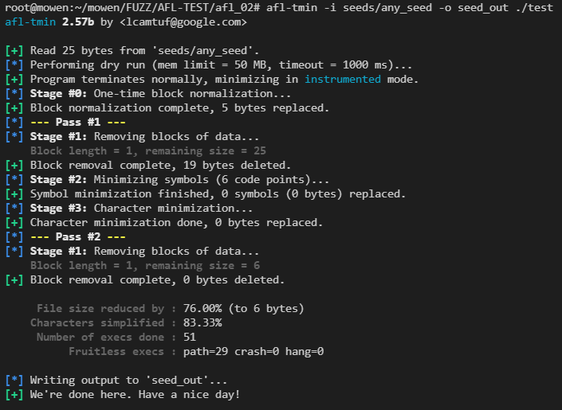
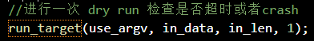
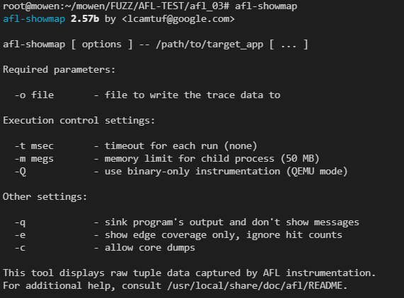
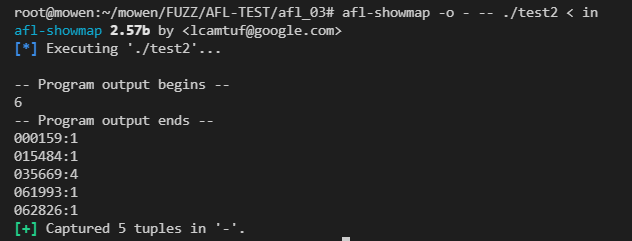
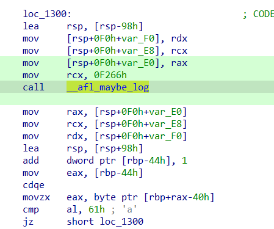
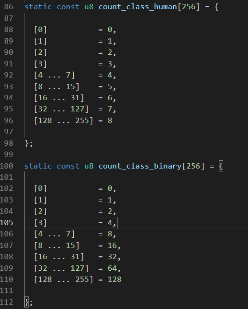
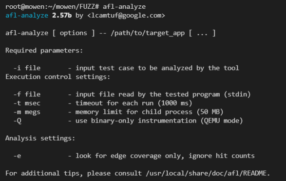
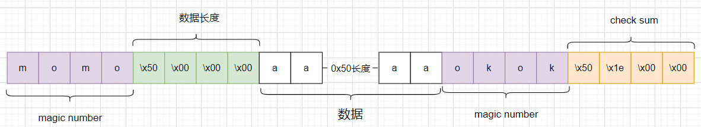
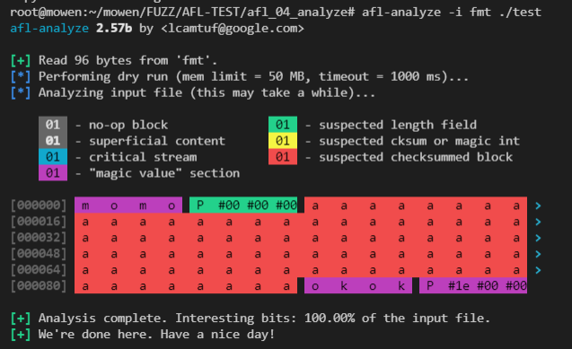
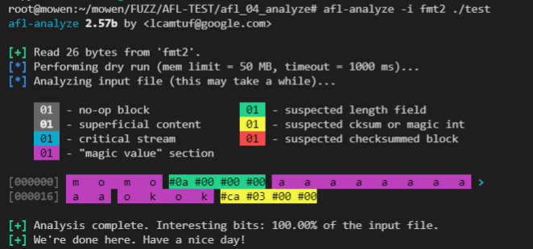

# AFL源码学习(二)-先知社区

> **来源**: https://xz.aliyun.com/news/16654  
> **文章ID**: 16654

---

# AFL源码学习(二)

## 前言

​ 在上一篇（[AFL源码学习(一)](https://xz.aliyun.com/t/16896?time__1311=Gui%3DGK0IPUxBqDwqeqqQTxYT4mqOQ%3Do%3DoD)）我们分析了AFL的编译和插桩代码。AFL编译是源编译器的封装，在编译时会先对参数进行调整然后在编译成汇编后进行插桩。插桩后的程序会在第一个桩处停下，并初始化`shm`共享内存，之后进入循环形成`fork server`的形式，不断fork子进程，让子进程进行探索的操作，主进程通过管道汇报给`afl-fuzz`。现在还不着急去阅读`afl-fuzz`的实现，先了解两个小功能最后再去阅读`afl-fuzz.c`。就像`Pion1eer`师傅所说“这就如同爬岳麓山，直接冲往顶峰是很艰难的；沿着盘山公路走，虽然路程远了些，但坡度较缓，便可轻松登顶”。我们需要用一定的扎实基础之后，再去阅读一些相对复杂的代码会很轻松。

### 注释附件：

[mowenroot/Kernel/AFL-2.57b-mowen注释版](https://github.com/mowenroot/Kernel/tree/master/AFL-2.57b-mowen注释版)

## afl-tmin

​ 看看`shm`中保存的覆盖信息是如何被利用的，从`afl-tmin.c`入手。

> `Afl-tmin`是一个简单的测试用例最小化器，它接受一个输入文件，并尝试删除尽可能多的数据，同时保持二进制文件处于崩溃状态或产生一致的检测输出（模式是根据最初观察到的行为自动选择的）。
>
> * non-crash 模式，目标程序必须被插桩。afl-tmin 在缩小 input 的过程中，维持覆盖度不变。
> * crash 模式，目标程序可以被插桩，也可以不被插桩。afl-tmin 将保持程序 crash。

### 样例

先写一个样例来熟悉 `afl-tmin`的用法。

```
#include<stdio.h>
#include<stdlib.h>
#include<unistd.h>
#include<string.h>
int main(void){
    char buf[0x100]={0};
    gets(buf);

    if(strncmp(buf,"mowen",5))return 0;

    int a_count=4;
    while (buf[++a_count]=='a');

    if(buf[a_count]=='$') puts("OK");
    
    return 0;
}
```

程序再输入`mowena*$`会输出`OK`,从代码看来最短的字符串`mowen$`就能输出`OK`。

```
afl-time -i seeds/any_seed -o seed_out ./test
#any_seed: mowenaaaaaaaaaaaaa$123456
#seed_out: mowen$
```

`afl-tmin`先进行 `dry run`如何发现程序是插桩的进行最小化处理(`block normalization、Symbol minimization、Character minimization` )。处理直到没法优化后退出。执行完成后种子从 `25 bytes`到`6 bytes`。



```
#any_seed: mowenaaaaaaaaaaaaa$123456
#seed_out: mowen$
```

对比两次`input`，发现原始`input`会执行很多次循环，优化后的`input`不会执行循环，那两条执行路径本质是不同的，`afl-tmin`是通过什么优化掉循环的呢，通过反编译代码可以看见循环处根本没有插入桩。就导致无论循环多少次`shm`都不会改变，那反馈的覆盖率也就相同。


### afl-tmin源码分析

#### main函数

`main`函数主要做了以下几点事,加粗的为重点分析的部分:

1. 根据`argv`设置变量，包含等等参数的设置这里不展开
2. **初始化**`shm`
3. 设置`signal handler`(当按下`CTRL+C`的时候退出)，设置环境变量，处理二进制文件
4. 读取种子文件数据保存到`in_data`
5. **进行一次** `dry run` **检查程序是否超时或者**`crash` **(调用**`run_target`**)**
6. **调用**`minmize()`**进行优化**
7. 退出清理工作

```
//afl-tmin.c
int main(int argc, char** argv) {

  s32 opt;
  u8  mem_limit_given = 0, timeout_given = 0, qemu_mode = 0;
  char** use_argv;

  doc_path = access(DOC_PATH, F_OK) ? "docs" : DOC_PATH;

  SAYF(cCYA "afl-tmin " cBRI VERSION cRST " by <lcamtuf@google.com>
");
  //参数初始化
  while ((opt = getopt(argc,argv,"+i:o:f:m:t:B:xeQ")) > 0)

    switch (opt) {

      case 'i':

        if (in_file) FATAL("Multiple -i options not supported");
        in_file = optarg;
        break;

      case 'o':

        if (out_file) FATAL("Multiple -o options not supported");
        out_file = optarg;
        break;

    //...

    }

  if (optind == argc || !in_file || !out_file) usage(argv[0]);
  //初始化shm
  setup_shm();
  //设置signal handler 
  setup_signal_handlers();
  //设置环境变量
  set_up_environment();
  //分析传进来的二进制文件
  find_binary(argv[optind]);
  detect_file_args(argv + optind);

  if (qemu_mode)
    use_argv = get_qemu_argv(argv[0], argv + optind, argc - optind);
  else
    use_argv = argv + optind;

  exact_mode = !!getenv("AFL_TMIN_EXACT");

  SAYF("
");
  //读取文件数据
  read_initial_file();

  ACTF("Performing dry run (mem limit = %llu MB, timeout = %u ms%s)...",
       mem_limit, exec_tmout, edges_only ? ", edges only" : "");
  //进行一次 dry run 检查是否超时或者crash
  run_target(use_argv, in_data, in_len, 1);

  if (child_timed_out)
    FATAL("Target binary times out (adjusting -t may help).");

  if (!crash_mode) {

     OKF("Program terminates normally, minimizing in " 
         cCYA "instrumented" cRST " mode.");

     if (!anything_set()) FATAL("No instrumentation detected.");

  } else {

     OKF("Program exits with a signal, minimizing in " cMGN "%scrash" cRST
         " mode.", exact_mode ? "EXACT " : "");

  }
  //minmize优化
  minimize(use_argv);

  ACTF("Writing output to '%s'...", out_file);

  unlink(prog_in);
  prog_in = NULL;

  close(write_to_file(out_file, in_data, in_len));

  OKF("We're done here. Have a nice day!
");

  exit(0);

}
```

#### 初始化shm

​ 之前在分析插桩代码的时候提到过，初始化共享地址用的`shmat(getenv("__AFL_SHM_ID"),0,0);`,但是这个环境变量是由`fuzz`的时候创建的，桩代码只是使用这个`shm_id`来挂载共享内存。通过查看`setup_shm()`函数来看怎么初始化的。

```
static void setup_shm(void) {

  u8* shm_str;
  //创建shm id
  shm_id = shmget(IPC_PRIVATE, MAP_SIZE, IPC_CREAT | IPC_EXCL | 0600);

  if (shm_id < 0) PFATAL("shmget() failed");

  atexit(remove_shm);//程序退出时删除shm

  shm_str = alloc_printf("%d", shm_id);
  //设置插桩的环境变量，用于共享内存挂载
  setenv(SHM_ENV_VAR, shm_str, 1);// #define SHM_ENV_VAR         "__AFL_SHM_ID"

  ck_free(shm_str);
  //  trace_bits 挂载 shm_id 的共享内存
  trace_bits = shmat(shm_id, NULL, 0);
  
  if (trace_bits == (void *)-1) PFATAL("shmat() failed");

}
```

`setup_shm()`

​ 通过`shmget`创建**共享内存标识符**(`shm_id`),然后将符号设置为环境变量，并为`trace_bits`挂载上同样的共享内存地址，这样桩申请的空间就和`fuzz`时申请的空间为同一块内存区域,从而实现高效的数据交换。

#### run\_target函数

​ 在最开始的样例测试中出现了\*\*[\*] Performing dry run (mem limit = 50 MB, timeout = 1000 ms)...\*\*这样的字样，会通过调用`run_target()`执行一次`dry run`来检查程序是否超时或者崩溃。



`run_targe()会做如下操作`：

首先将共享内存区域清空，然后把input写入到文件中，之后调用`fork()`。

子进程:重定向流->创建新进程组->设置内存限制->禁用`core dump` ->执行目标程序

主进程完成：给子进程定时->等待子进程结束->对`shm_mem`进行分桶->处理崩溃等情况->计算`shm_mem`的`hash`并决定是否保留。

在主进程中最后判断是否保留`input`使用的`hash`这点是因为：`shm_mem`的大小为`65536 bytes`，而我们只需要用`shm_mem`来做判断，那引用全部的显然太耗效率，在AFL中先采用`hash32()`，然后用`hash`值来进行比较肯定更高效。

```
/* Execute target application. Returns 0 if the changes are a dud, or
   1 if they should be kept. */
static u8 run_target(char** argv, u8* mem, u32 len, u8 first_run) {

  static struct itimerval it;
  int status = 0;

  s32 prog_in_fd;
  u32 cksum;
  //位图清空
  memset(trace_bits, 0, MAP_SIZE);
  MEM_BARRIER();//内存屏障
  // input写入use_dir/.afl-tmin-temp-pid文件
  prog_in_fd = write_to_file(prog_in, mem, len);
  /*
    write_to_file : 1、删除文件 2、rw创建文件 3、写入数据 4、重置文件指针到开头 
  */

  child_pid = fork();

  if (child_pid < 0) PFATAL("fork() failed");

  if (!child_pid) {
    //子进程

    struct rlimit r;
    //重定向流 stdin 指向 prog_in 文件 其他为空
    if (dup2(use_stdin ? prog_in_fd : dev_null_fd, 0) < 0 ||
        dup2(dev_null_fd, 1) < 0 ||
        dup2(dev_null_fd, 2) < 0) {

      *(u32*)trace_bits = EXEC_FAIL_SIG;
      PFATAL("dup2() failed");

    }

    close(dev_null_fd);
    close(prog_in_fd);
    //创建新会话，daemon 
    setsid();
    //设置内存限制
    if (mem_limit) {

      r.rlim_max = r.rlim_cur = ((rlim_t)mem_limit) << 20;

#ifdef RLIMIT_AS

      setrlimit(RLIMIT_AS, &r); /* Ignore errors */

#else

      setrlimit(RLIMIT_DATA, &r); /* Ignore errors */

#endif /* ^RLIMIT_AS */

    }
    //禁用 core dump
    r.rlim_max = r.rlim_cur = 0;
    setrlimit(RLIMIT_CORE, &r); /* Ignore errors */
    //执行目标程序
    execv(target_path, argv);
    //以下是执行失败，失败后 trace_bits == 0xfee1dead
    *(u32*)trace_bits = EXEC_FAIL_SIG;
    exit(0);

  }

  //主进程
  close(prog_in_fd);

  /* Configure timeout, wait for child, cancel timeout. */

  child_timed_out = 0;
  it.it_value.tv_sec = (exec_tmout / 1000);
  it.it_value.tv_usec = (exec_tmout % 1000) * 1000;
  //设置定时器，到时会kill child_pid
  setitimer(ITIMER_REAL, &it, NULL);
  //等待子进程，并获取状态status
  if (waitpid(child_pid, &status, 0) <= 0) FATAL("waitpid() failed");

  child_pid = 0;
  it.it_value.tv_sec = 0;
  it.it_value.tv_usec = 0;
  //取消定时器
  setitimer(ITIMER_REAL, &it, NULL);
  //内存屏障
  MEM_BARRIER();

  /* Clean up bitmap, analyze exit condition, etc. */
  //分析 trace_bits，如果execv执行失败
  if (*(u32*)trace_bits == EXEC_FAIL_SIG)
    FATAL("Unable to execute '%s'", argv[0]);
  // 边->分桶操作
  classify_counts(trace_bits);
  apply_mask((u32*)trace_bits, (u32*)mask_bitmap);//掩码，不影响平时操作
  total_execs++;
  //是否需要停止操作
  if (stop_soon) {

    SAYF(cRST cLRD "
+++ Minimization aborted by user +++
" cRST);
    close(write_to_file(out_file, in_data, in_len));
    exit(1);

  }

  /* Always discard inputs that time out. */
  //超时，返回0 表示丢弃当前input
  if (child_timed_out) {

    missed_hangs++;
    return 0;

  }

  /* Handle crashing inputs depending on current mode. */
  //处理崩溃情况
  if (WIFSIGNALED(status) ||
      (WIFEXITED(status) && WEXITSTATUS(status) == MSAN_ERROR) ||
      (WIFEXITED(status) && WEXITSTATUS(status) && exit_crash)) {
    //第一次运行就crash ，说明要使用 crash mode
    if (first_run) crash_mode = 1;

    if (crash_mode) {
      //不要求 crash 路径 和原input 相同，则保留该路径
      if (!exact_mode) return 1;

    } else {
      // 路径未命中次数++
      missed_crashes++;
      return 0;

    }

  } else

  /* Handle non-crashing inputs appropriately. */

  if (crash_mode) {

    missed_paths++;
    return 0;

  }
  // 对 shm_mem 计算hash
  cksum = hash32(trace_bits, MAP_SIZE, HASH_CONST);
  // 首次运行记录hash
  if (first_run) orig_cksum = cksum;
  // 原始input的 hash 和 本次input hash 一致就保留
  if (orig_cksum == cksum) return 1;
  
  missed_paths++;
  return 0;

}
```

`classify_counts()`函数赋值分桶的操作，使用`-e` 关闭分桶机制。

```
static const u8 count_class_lookup[256] = {

  [0]           = 0,
  [1]           = 1,
  [2]           = 2,
  [3]           = 4,
  [4 ... 7]     = 8,
  [8 ... 15]    = 16,
  [16 ... 31]   = 32,
  [32 ... 127]  = 64,
  [128 ... 255] = 128

};

static void classify_counts(u8* mem) {

  u32 i = MAP_SIZE;
  //只有边 -e 无论命中多少次都视为相同
  if (edges_only) {

    while (i--) {
      if (*mem) *mem = 1;
      mem++;
    }

  } else {
    // 分桶操作
    // hit count 变为 桶的大小
    while (i--) {
      *mem = count_class_lookup[*mem];
      mem++;
    }

  }

}
```

​ 关于分桶的概念意图，Pion1eer师傅说的非常好[AFL源码阅读（三）：afl-tmin](https://www.ruanx.net/afl-source-3/)

> 　　想看懂以上代码的意图，需要先了解 AFL 的 hit count 分桶机制（可参考 [AFL 白皮书](https://lcamtuf.coredump.cx/afl/technical_details.txt)）。假如我们现在要设计一个灰盒 fuzzer，现在有一个 input 走了某条边 100 次，另一个 input 走了 101 次，我们要不要认为这两个 input 的执行路径本质不同呢？如果认为这算是不同的路径，那么 corpus 数量立刻会爆炸——因为修改 input 有极大概率变更某个循环的执行次数，从而被认为与先前的 input 是本质不同的。另一方面，假如我们认为一条边只有「被走过」和「未被走过」两种状态，那么 fuzzer 将会严重丧失搜索能力。例如，假如目标程序中有一句 `strcmp(input, "abcd")`，则 fuzzer 能发现 `a***` 是有趣的，但它变异出 `ab**` 之后，会认为它与前述输入路径相同，于是丢弃这个变异。只有等到该 fuzzer 变异出完整的 `abcd`，它才会认为这是有趣的——但这概率实在太低了。
>
> 　　　因此，AFL 的思路是这两个方案的折中——既要避免 corpus 爆炸，又要在循环次数增加的过程中给一些奖励。所以，AFL 设计了 8 个 hit count 桶：
>
> 　```plaintext  
> 　1, 2, 3, 4-7, 8-15, 16-31, 32-127, 128+  
> 　```
>
> 　　　如果对于两个 input，某条边的 hit count 在同一个桶内，则认为这两个 hit count 没有本质区别。因此，AFL 认为循环次数 0、1、2、3、4 是有本质区别的，7 次与 8 次也有本质区别，但 100 次与 101 次没有本质区别。

#### minimize 函数

函数主要分为四个部分:**BLOCK NORMALIZATION、BLOCK DELETION、ALPHABET MINIMIZATION、CHARACTER MINIMIZATION**。

会先执行一遍`BLOCK NORMALIZATION`，然后循环其他**3**个模块机进行优化直到无法优化为止。

```
static void minimize(char** argv) {

  //块规范化 BLOCK NORMALIZATION
    //...
  //块删除 BLOCK DELETION
    //...

next_del_blksize:

  //退出 ：不是第一轮 并且 没有改变
  if (cur_pass > 1 && !changed_any) goto finalize_all;

  //字符集最小化 ALPHABET MINIMIZATION
    //...  
  //字符最小化，暴力把字符替换成'0' CHARACTER MINIMIZATION
    //...
  //如果有修改则继续优化
  if (changed_any) goto next_pass;

finalize_all:
    //输出结果

}
```

##### BLOCK NORMALIZATION

块规范化，数据先被分为128个块长度为 2 的幂次（最后一个块不一定），然后进行块的优化，尝试把整个块替换成'0'。如果运行路径与 input 相同，则保留该更改。`BLOCK NORMALIZATION`用处在于删除不敏感的数据,就像最开始的样例中“123456”,这个最后的数据并不能决定程序的走向，会被替换成'0'。

```
static void minimize(char** argv) {

  //记录字符使用情况的映射表
  static u32 alpha_map[256];

  u8* tmp_buf = ck_alloc_nozero(in_len);
  u32 orig_len = in_len, stage_o_len;

  u32 del_len, set_len, del_pos, set_pos, i, alpha_size, cur_pass = 0;
  u32 syms_removed, alpha_del0 = 0, alpha_del1, alpha_del2, alpha_d_total = 0;
  u8  changed_any, prev_del;

  /***********************
   * BLOCK NORMALIZATION *
   ***********************/
  //块规范化
  set_len    = next_p2(in_len / TMIN_SET_STEPS);//获取最小2的幂次方大小
  set_pos    = 0;
  // set_len 块规范化长度  TMIN_SET_MIN_SIZE =4
  if (set_len < TMIN_SET_MIN_SIZE) set_len = TMIN_SET_MIN_SIZE;

  ACTF(cBRI "Stage #0: " cRST "One-time block normalization...");
  //遍历所有块进行规范化
  while (set_pos < in_len) {

    u8  res;
    //计算当前块的实际长度（主要处理最后一个不完整的块）
    u32 use_len = MIN(set_len, in_len - set_pos);
    //检查整个块是否都是0
    for (i = 0; i < use_len; i++)
      if (in_data[set_pos + i] != '0') break;
    //如果整个块不都是0，则尝试整个块全替换0
    if (i != use_len) {

      memcpy(tmp_buf, in_data, in_len);
      memset(tmp_buf + set_pos, '0', use_len);
  
      res = run_target(argv, tmp_buf, in_len, 0);
      
      if (res) {

        memset(in_data + set_pos, '0', use_len);
        changed_any = 1;
        alpha_del0 += use_len;

      }

    }
    //移动到下一块
    set_pos += set_len;
  }
  //更新总替换字节数
  alpha_d_total += alpha_del0;

  OKF("Block normalization complete, %u byte%s replaced.", alpha_del0,
      alpha_del0 == 1 ? "" : "s");

```

##### **BLOCK DELETION**

块删除

1. 数据先被分为`16`个块。
2. 从前往后尝试删除每一个块。
3. 减半删除长度然后重复第二步，直到删除长度小于1或者数据为空

　　有一个加速逻辑：如果上一个块没删除并且当前块和上一个相同，则直接跳过这个块，没必要再去跑`run_target()`来测试。

> 由于 block normalization 过程过程产生了大量的连续 `'0'`，故这个加速逻辑是可以取得一定效果的。

```
next_pass:

  ACTF(cYEL "--- " cBRI "Pass #%u " cYEL "---", ++cur_pass);
  changed_any = 0;

  /******************
   * BLOCK DELETION *
   ******************/
  //块删除

  del_len = next_p2(in_len / TRIM_START_STEPS);
  stage_o_len = in_len;

  ACTF(cBRI "Stage #1: " cRST "Removing blocks of data...");

next_del_blksize:

  if (!del_len) del_len = 1;
  del_pos  = 0;
  prev_del = 1;

  SAYF(cGRA "    Block length = %u, remaining size = %u
" cRST,
       del_len, in_len);

  while (del_pos < in_len) {

    u8  res;
    s32 tail_len;

    tail_len = in_len - del_pos - del_len;
    if (tail_len < 0) tail_len = 0;

    /* If we have processed at least one full block (initially, prev_del == 1),
       and we did so without deleting the previous one, and we aren't at the
       very end of the buffer (tail_len > 0), and the current block is the same
       as the previous one... skip this step as a no-op. */
    /*
      前一个块未被删除
      并且前一个块和当前块相同则跳过
      这里优化策略：如果前一个块没有被删除，并且后面一样说明也不会被删除，直接跳过
    */
    if (!prev_del && tail_len && !memcmp(in_data + del_pos - del_len,
        in_data + del_pos, del_len)) {

      del_pos += del_len;
      continue;

    }

    prev_del = 0;
    //构建删除块后的数据
    /* Head */
    memcpy(tmp_buf, in_data, del_pos);

    /* Tail */
    memcpy(tmp_buf + del_pos, in_data + del_pos + del_len, tail_len);

    res = run_target(argv, tmp_buf, del_pos + tail_len, 0);
    //如果不影响原本路径则删除
    if (res) {

      memcpy(in_data, tmp_buf, del_pos + tail_len);
      prev_del = 1;
      in_len   = del_pos + tail_len;

      changed_any = 1;

    } else del_pos += del_len;

  }
  //如果块还有数据则 对半删除长度继续尝试
  if (del_len > 1 && in_len >= 1) {

    del_len /= 2;
    goto next_del_blksize;

  }

  OKF("Block removal complete, %u bytes deleted.", stage_o_len - in_len);
  //完全删除警告
  if (!in_len && changed_any)
    WARNF(cLRD "Down to zero bytes - check the command line and mem limit!" cRST);
  //退出 ：不是第一轮 并且 没有改变
  if (cur_pass > 1 && !changed_any) goto finalize_all;

```

##### **ALPHABET MINIMIZATION**

字符集最小化，最少字符集。

优化策略：会把相同的字符全部替换为'0'，然后尝试删除。

```
/*************************
   * ALPHABET MINIMIZATION *
   *************************/
  //字符集最小化
  alpha_size   = 0;
  alpha_del1   = 0;
  syms_removed = 0;
  //统计 [0,255] 字符使用频率
  memset(alpha_map, 0, 256 * sizeof(u32));

  for (i = 0; i < in_len; i++) {
    if (!alpha_map[in_data[i]]) alpha_size++;
    alpha_map[in_data[i]]++;
  }

  ACTF(cBRI "Stage #2: " cRST "Minimizing symbols (%u code point%s)...",
       alpha_size, alpha_size == 1 ? "" : "s");
  //遍历全部可能的字符[0,255]
  for (i = 0; i < 256; i++) {

    u32 r;
    u8 res;
    //跳过'0' 和 未使用的
    if (i == '0' || !alpha_map[i]) continue;

    memcpy(tmp_buf, in_data, in_len);
    //替换成 '0'
    for (r = 0; r < in_len; r++)
      if (tmp_buf[r] == i) tmp_buf[r] = '0'; 

    res = run_target(argv, tmp_buf, in_len, 0);

    if (res) {

      memcpy(in_data, tmp_buf, in_len);
      syms_removed++;
      alpha_del1 += alpha_map[i];
      changed_any = 1;

    }

  }
  //替换总字节更新
  alpha_d_total += alpha_del1;

  OKF("Symbol minimization finished, %u symbol%s (%u byte%s) replaced.",
      syms_removed, syms_removed == 1 ? "" : "s",
      alpha_del1, alpha_del1 == 1 ? "" : "s");
```

##### **CHARACTER MINIMIZATION**

字符最小化,最后一个模块相对来说比较暴力，直接把当前字符替换为'0'，然后尝试删除。

```
  /**************************
   * CHARACTER MINIMIZATION *
   **************************/
  //字符最小化，暴力把字符替换成'0'
  alpha_del2 = 0;

  ACTF(cBRI "Stage #3: " cRST "Character minimization...");

  memcpy(tmp_buf, in_data, in_len);

  for (i = 0; i < in_len; i++) {

    u8 res, orig = tmp_buf[i];

    if (orig == '0') continue;
    tmp_buf[i] = '0';

    res = run_target(argv, tmp_buf, in_len, 0);

    if (res) {

      in_data[i] = '0';
      alpha_del2++;
      changed_any = 1;

    } else tmp_buf[i] = orig;

  }

  alpha_d_total += alpha_del2;

  OKF("Character minimization done, %u byte%s replaced.",
      alpha_del2, alpha_del2 == 1 ? "" : "s");
  //如果有修改则继续优化
  if (changed_any) goto next_pass;

finalize_all:

  SAYF("
"
       cGRA "     File size reduced by : " cRST "%0.02f%% (to %u byte%s)
"
       cGRA "    Characters simplified : " cRST "%0.02f%%
"
       cGRA "     Number of execs done : " cRST "%u
"
       cGRA "          Fruitless execs : " cRST "path=%u crash=%u hang=%s%u

",
       100 - ((double)in_len) * 100 / orig_len, in_len, in_len == 1 ? "" : "s",
       ((double)(alpha_d_total)) * 100 / (in_len ? in_len : 1),
       total_execs, missed_paths, missed_crashes, missed_hangs ? cLRD : "",
       missed_hangs);

  if (total_execs > 50 && missed_hangs * 10 > total_execs)
    WARNF(cLRD "Frequent timeouts - results may be skewed." cRST);

}
```

再来看我们最初的样例，在执行`BLOCK DELETION`后就已经无法再优化，包括后面的字符集和字符优化都显示不出作用，故第二轮在 **BLOCK DELETION**直接退出了。

```
#any_seed: mowenaaaaaaaaaaaaa$123456
#seed_out: mowen$
```


## afl-showmap

用于分析和显示程序在运行时访问的代码路径和输入数据,帮助开发者理解模糊测试过程中哪些输入数据导致了程序的哪些执行路径。简单点说就是分析`input`显示`shm_mem`。

`afl-showmap`菜单



##### 样例测试

编译命令`AFL_DONT_OPTIMIZE=1 afl-gcc test.c -o test -g`

如果不加上`AFL_DONT_OPTIMIZE=1` 编译的时候循环里面的插桩会被抛弃。

```
#include <stdio.h>
#include <unistd.h>

int main(void) {
    char s[50];
    read(0,s,100);

    int len = -1;

    do {
        len++;
    } while(s[len] == 'a');

    printf("%d
", len);

    return 0;
}
```

使用`afl-showmap`来测试样例

```
echo "aaaaaamowen" > in
afl-showmap -o - -- ./test2 < in
```



显示捕获到`5`个元组，有一个`tuples`和其他的不同，我们在第一章的时候讲过覆盖率的实现,主要逻辑是这样的。

```
cur_location = <COMPILE_TIME_RANDOM>; //每个代码块生成一个随机数，作为其“位置”的记录
/*
    对分支处的”源位置“和”目标位置“进行异或，并将异或的结果作为该分支的key，保存每个分支的执行次数（就是在用hash记录元组及覆盖情况）
*/
shared_mem[cur_location ^ prev_location]++; 
prev_location = cur_location >> 1;//自己跳转到自己计算得到的hash的key会是0，要避免这种情况，于是进行移位操作
```

通过计算可以确定输出这个id 为「35669」就是在循环中。但是我'a'有6个，按道理来说应该「35669」输出为6才对，那这违背了AFL进行探测的一个逻辑，AFL是会进行分桶操作然后根据这个进一步探测，那按照我们第一节讲的分桶，6对应的值应该也是8来着，为什么会输出4，之后我们会进行详细分析。

```
0xf266^(0xf266>>1)=35669
static const u8 count_class_lookup8[256] = {
//左边为分支执行次数   //右边为记述byte
  [0]           = 0, 
  [1]           = 1, 
  [2]           = 2, 
  [3]           = 4, 
  [4 ... 7]     = 8, 
  [8 ... 15]    = 16,
  [16 ... 31]   = 32,
  [32 ... 127]  = 64,
  [128 ... 255] = 128

};
```



##### main函数

因为我们之前分析过`afl-tmin`,那再来看`afl-showmap`的时候会发现很多重复的，阅读相对快一点

先进行参数的赋值，然后初始化`share_shm`，之后就是各种环境初始化，最后使用`run_target`执行一遍程序后使用`write_results`写入结果。

```
int main(int argc, char** argv) {

  s32 opt;
  u8  mem_limit_given = 0, timeout_given = 0, qemu_mode = 0;
  u32 tcnt;
  char** use_argv;

  doc_path = access(DOC_PATH, F_OK) ? "docs" : DOC_PATH;

  while ((opt = getopt(argc,argv,"+o:m:t:A:eqZQbc")) > 0)

    switch (opt) {
     
      case 'b':binary_mode = 1;break;
         //...   
    }

  if (optind == argc || !out_file) usage(argv[0]);

  setup_shm();
  setup_signal_handlers();

  set_up_environment();

  find_binary(argv[optind]);

  if (!quiet_mode) {
    show_banner();
    ACTF("Executing '%s'...
", target_path);
  }

  detect_file_args(argv + optind);

  if (qemu_mode)
    use_argv = get_qemu_argv(argv[0], argv + optind, argc - optind);
  else
    use_argv = argv + optind;

  run_target(use_argv);

  tcnt = write_results();

  if (!quiet_mode) {

    if (!tcnt) FATAL("No instrumentation detected" cRST);
    OKF("Captured %u tuples in '%s'." cRST, tcnt, out_file);

  }

  exit(child_crashed * 2 + child_timed_out);

}
```

`run_target`代码于`afl-tmin`中的基本一致,在`classify_counts()`进行分桶的时候有一点区别。

```
static void run_target(char** argv) {

  static struct itimerval it;
  int status = 0;

  if (!quiet_mode)
    SAYF("-- Program output begins --
" cRST);

  MEM_BARRIER();

  child_pid = fork();

  if (child_pid < 0) PFATAL("fork() failed");

  if (!child_pid) {


    //...

    execv(target_path, argv);

    *(u32*)trace_bits = EXEC_FAIL_SIG;
    exit(0);

  }

  /* Configure timeout, wait for child, cancel timeout. */

     //...
  if (waitpid(child_pid, &status, 0) <= 0) FATAL("waitpid() failed");

     //...
  MEM_BARRIER();

  /* Clean up bitmap, analyze exit condition, etc. */

  if (*(u32*)trace_bits == EXEC_FAIL_SIG)
    FATAL("Unable to execute '%s'", argv[0]);

  classify_counts(trace_bits, binary_mode ?
                  count_class_binary : count_class_human);

  if (!quiet_mode)
    SAYF(cRST "-- Program output ends --
");

  if (!child_timed_out && !stop_soon && WIFSIGNALED(status))
    child_crashed = 1;

  if (!quiet_mode) {

    if (child_timed_out)
      SAYF(cLRD "
+++ Program timed off +++
" cRST);
    else if (stop_soon)
      SAYF(cLRD "
+++ Program aborted by user +++
" cRST);
    else if (child_crashed)
      SAYF(cLRD "
+++ Program killed by signal %u +++
" cRST, WTERMSIG(status));

  }

}
```

再采用`classify_counts()`进行分桶，以用户模式输出的时候，桶的 data 是从 0 到 8 的自然数，在`binary_mode`模式下使用的桶与之前相同，这也就造成了我们最开始的样例为什么会输出`4`的情况了。



##### write\_results函数

先确定要使用的输出文件，然后把`trace_bits`数据写入文件。

在样例中使用的是'-'，在这里体现就为dup(1)，直接使用了标准输出流。然后抉择了一下是否为用户模式，如果不是则`直接输出 65536 字节的 shm`。

```
static u32 write_results(void) {

  s32 fd;
  u32 i, ret = 0;

  u8  cco = !!getenv("AFL_CMIN_CRASHES_ONLY"),
      caa = !!getenv("AFL_CMIN_ALLOW_ANY");
  //打开输出文件
  if (!strncmp(out_file, "/dev/", 5)) {

    fd = open(out_file, O_WRONLY, 0600);
    if (fd < 0) PFATAL("Unable to open '%s'", out_file);

  } else if (!strcmp(out_file, "-")) {

    fd = dup(1);
    if (fd < 0) PFATAL("Unable to open stdout");

  } else {

    unlink(out_file); /* Ignore errors */
    fd = open(out_file, O_WRONLY | O_CREAT | O_EXCL, 0600);
    if (fd < 0) PFATAL("Unable to create '%s'", out_file);

  }

  //二进制模式
  if (binary_mode) {

    for (i = 0; i < MAP_SIZE; i++)
      if (trace_bits[i]) ret++;
    
    ck_write(fd, trace_bits, MAP_SIZE, out_file);
    close(fd);
  //用户模式
  } else {

    FILE* f = fdopen(fd, "w");

    if (!f) PFATAL("fdopen() failed");

    for (i = 0; i < MAP_SIZE; i++) {

      if (!trace_bits[i]) continue;
      ret++;

      if (cmin_mode) {

        if (child_timed_out) break;
        if (!caa && child_crashed != cco) break;

        fprintf(f, "%u%u
", trace_bits[i], i);

      } else fprintf(f, "%06u:%u
", i, trace_bits[i]);

    }
  
    fclose(f);

  }

  return ret;

}
```

## afl-analyze

​ 是`AFL`的一个分析工具。它接受一个输入文件，尝试按顺序翻转字节，并观察被测试程序的行为。然后，它会根据哪些部分是关键的，哪些不是，对输入进行颜色编码；通常可以快速洞察复杂的文件格式。可以快速识别 `magic number`、`checksum`、`length`等。

`afl-analyze`菜单



##### 样例测试

先设计一个文件格式：

* 头部4字节`"momo"`
* 其次4字节为`len`（数据长度），类型为无符号类型
* 然后填充上`len`个数据
* 后4字节为`"okok"`,用来截断数据
* 再后4字节是`check sum`。



文件格式的验证代码

```
#include<stdio.h>
#include<unistd.h>
#include<string.h>
#define ErrExit(fmt,...)                                                        \
    do{                                                                         \
        dprintf(2,  "[-] %s:%d " fmt "
" , __FILE__, __LINE__, ##__VA_ARGS__); \
        _exit(-1);                                                              \
    }while (0)


int main(void){
    char buf[0x100]={0};
    int buf_len=read(0,buf,0x200);
    //magic number 
    if(strncmp(buf,"momo",4))ErrExit("Header error");

    //data len  
    unsigned int dlen =*(unsigned int*)(buf+4);
    if(dlen+16!=buf_len)ErrExit("Data Len error");
    //magic number 
    if(strncmp(buf+8+dlen,"okok",4))ErrExit("Header error");

    //check sum
    unsigned int sum=0;
    for (size_t i = 8; i < dlen+8; i++)
    {
        sum+=(unsigned char)(buf[i]);
    }
    if(sum!=*(unsigned int*)(buf+8+dlen+4))ErrExit("CheckSum error");

    puts("successful");    

    return 0;
}
```

使用`python`伪造一个合法的文件

```
from pwn import *
with open("fmt",'wb') as f:
    f.write(b"momo"+p32(0x50)+b"a"*0x50+b'okok'+p32(97*0x50))
```

使用`afl-analyze`来验证文件格式

```
afl-analyze -i fmt ./test
```



两个magic、length、data区域分析的都没问题，主要就是把checksum识别成了magic number。

##### main函数

大体都与`afl-tmin`类似，主要不同是调用了`analyze()`

```
int main(int argc, char** argv) {

  s32 opt;
  u8  mem_limit_given = 0, timeout_given = 0, qemu_mode = 0;
  char** use_argv;

  doc_path = access(DOC_PATH, F_OK) ? "docs" : DOC_PATH;

  SAYF(cCYA "afl-analyze " cBRI VERSION cRST " by <lcamtuf@google.com>
");

  while ((opt = getopt(argc,argv,"+i:f:m:t:eQ")) > 0)

    switch (opt) {
//...

    }

  if (optind == argc || !in_file) usage(argv[0]);

  use_hex_offsets = !!getenv("AFL_ANALYZE_HEX");

  setup_shm();
  setup_signal_handlers();

  set_up_environment();

  find_binary(argv[optind]);
  detect_file_args(argv + optind);

  if (qemu_mode)
    use_argv = get_qemu_argv(argv[0], argv + optind, argc - optind);
  else
    use_argv = argv + optind;

  SAYF("
");

  read_initial_file();

  ACTF("Performing dry run (mem limit = %llu MB, timeout = %u ms%s)...",
       mem_limit, exec_tmout, edges_only ? ", edges only" : "");

  run_target(use_argv, in_data, in_len, 1);

  if (child_timed_out)
    FATAL("Target binary times out (adjusting -t may help).");

  if (!anything_set()) FATAL("No instrumentation detected.");

  analyze(use_argv);

  OKF("We're done here. Have a nice day!
");

  exit(0);

}
```

##### analyze函数

会循环对单字节进行`4`次异变(`xor 0xff,xor 0x1,sub 0x10,add 0x10`)，然后分为四个模式：

完全无响应(不重要)：如果4个都不改变原始路径，说明不重要

部分无响应(不关键)：4个中至少有一个不改变原路径，说明可变异，但是位置不关键（不关键）

固定响应(固定)：4个路径和原路径都不同并且4个变异路径一致，则这个位置不能改(固定)，其实基本上这里**数据**、`maigc number` 、`checksum`都会被识别成这个。

可变响应(铭感):4个路径和原路径都不同、4个变异路径还都不一致,说明这个对控制流很重要(敏感)。

然后查看当前行为和上次是否相同，如果不相同则说明不是相同的字段，做了一个`xor 0x80`来区别不同字段。最后使用`dump_hex()`函数来打印。

```
static void analyze(char** argv) {

  u32 i;
  u32 boring_len = 0, prev_xff = 0, prev_x01 = 0, prev_s10 = 0, prev_a10 = 0;

  u8* b_data = ck_alloc(in_len + 1);
  u8  seq_byte = 0;

  b_data[in_len] = 0xff; /* Intentional terminator. */

  ACTF("Analyzing input file (this may take a while)...
");

#ifdef USE_COLOR
  show_legend();
#endif /* USE_COLOR */

  for (i = 0; i < in_len; i++) {

    u32 xor_ff, xor_01, sub_10, add_10;
    u8  xff_orig, x01_orig, s10_orig, a10_orig;

    /* Perform walking byte adjustments across the file. We perform four
       operations designed to elicit some response from the underlying
       code. */
    //xor 0xff
    in_data[i] ^= 0xff;
    xor_ff = run_target(argv, in_data, in_len, 0);
    //xor 0x1
    in_data[i] ^= 0xfe;
    xor_01 = run_target(argv, in_data, in_len, 0);
    //sub 0x10
    in_data[i] = (in_data[i] ^ 0x01) - 0x10;
    sub_10 = run_target(argv, in_data, in_len, 0);
    //add 0x10
    in_data[i] += 0x20;
    add_10 = run_target(argv, in_data, in_len, 0);
    in_data[i] -= 0x10;
    //还原
    /* Classify current behavior. */
    //变异路径后的检查
    xff_orig = (xor_ff == orig_cksum);
    x01_orig = (xor_01 == orig_cksum);
    s10_orig = (sub_10 == orig_cksum);
    a10_orig = (add_10 == orig_cksum);
    
    if (xff_orig && x01_orig && s10_orig && a10_orig) {
      //如果4个都不改变原始路径，说明不重要 RESP_NONE(不重要)
      b_data[i] = RESP_NONE;/* 完全无响应 */
      boring_len++;

    } else if (xff_orig || x01_orig || s10_orig || a10_orig) {
      //4个中至少有一个不改变原路径，说明可变异，但是位置不关键（不关键）
      b_data[i] = RESP_MINOR;/* 部分无响应 */
      boring_len++;

    } else if (xor_ff == xor_01 && xor_ff == sub_10 && xor_ff == add_10) {
      /*
        4个路径和原路径都不同并且4个变异路径一致
        则这个位置不能改(固定)，比如maigc位置不可改
      */
      b_data[i] = RESP_FIXED;/* 固定响应模式 */
    /*
      4个路径和原路径都不同、4个变异路径还都不一致
      说明这个对控制流很重要(敏感)
    */
    } else b_data[i] = RESP_VARIABLE;/* 可变响应 */

    /* When all checksums change, flip most significant bit of b_data. */
    //字段分块，看这个位置和之前行为是否完全不一致
    if (prev_xff != xor_ff && prev_x01 != xor_01 &&
        prev_s10 != sub_10 && prev_a10 != add_10) seq_byte ^= 0x80;

    b_data[i] |= seq_byte;

    prev_xff = xor_ff;
    prev_x01 = xor_01;
    prev_s10 = sub_10;
    prev_a10 = add_10;

  } 

  dump_hex(in_data, in_len, b_data);

  SAYF("
");

  OKF("Analysis complete. Interesting bits: %0.02f%% of the input file.",
      100.0 - ((double)boring_len * 100) / in_len);

  if (exec_hangs)
    WARNF(cLRD "Encountered %u timeouts - results may be skewed." cRST,
          exec_hangs);

  ck_free(b_data);

}
```

##### dump\_hex函数

首先通过高位来判断每个filed的长度，然后会对`RESP_FIXED(固定)`细致化处理：

长度为2字节：值小于等于输入长度，则为`length(RESP_LEN)`。

长度为2字节：两个字节相差大于32，则判断为`checksum(RESP_CKSUM)`。

长度为4字节：值小于等于输入长度，则为`length(RESP_LEN)`。

长度为4字节：第一个字节的**最高位**与其他三个字节**最高位**不同，则认为是`checksum(RESP_CKSUM)`。

`[1,32)`字节除去`2、4字节`类型不变。

长度**大于等于32字节**，被认为数据区域，所以当`data`长度小于32字节的时候，会被判断成其他类型。



```
static void dump_hex(u8* buf, u32 len, u8* b_data) {

  u32 i;
  /* 遍历输入数据的每个字节 */
  for (i = 0; i < len; i++) {

#ifdef USE_COLOR
    u32 rlen = 1, off;
#else
    u32 rlen = 1;
#endif /* ^USE_COLOR */
    /* 获取当前字节的响应类型(取低4位) */
    u8  rtype = b_data[i] & 0x0f;

    /* Look ahead to determine the length of run. */
    /* 通过比较高位(>>7)判断是否为相同类型的响应 
       向后查看连续相同的响应类型并统计长度
    */

    while (i + rlen < len && (b_data[i] >> 7) == (b_data[i + rlen] >> 7)) {

      if (rtype < (b_data[i + rlen] & 0x0f)) rtype = b_data[i + rlen] & 0x0f;
      rlen++;

    }

    /* Try to do some further classification based on length & value. */
    //细致化分析固定响应
    if (rtype == RESP_FIXED) {

      switch (rlen) {
        //长度为2
        case 2: {

            u16 val = *(u16*)(in_data + i);

            /* Small integers may be length fields. */
            /*
              如果值小于等于输入长度,SWPAP16考虑大小端序
              则判断为长度字段
            */
            if (val && (val <= in_len || SWAP16(val) <= in_len)) {
              rtype = RESP_LEN;
              break;
            }

            /* Uniform integers may be checksums. */
            //如果两个字节相差大于32则判断为checksum
            if (val && abs(in_data[i] - in_data[i + 1]) > 32) {
              rtype = RESP_CKSUM;
              break;
            }

            break;

          }

        case 4: {

            u32 val = *(u32*)(in_data + i);

            /* Small integers may be length fields. */
            /*
              如果值小于等于输入长度,SWPAP32考虑大小端序
              则判断为长度字段
            */
            if (val && (val <= in_len || SWAP32(val) <= in_len)) {
              rtype = RESP_LEN;
              break;
            }

            /* Uniform integers may be checksums. */
            /*
              检查4个字节的高位是否不同,如果不同为checksum
            */
            if (val && (in_data[i] >> 7 != in_data[i + 1] >> 7 ||
                in_data[i] >> 7 != in_data[i + 2] >> 7 ||
                in_data[i] >> 7 != in_data[i + 3] >> 7)) {
              rtype = RESP_CKSUM;
              break;
            }

            break;

          }
        /* 1,3,5到MAX_AUTO_EXTRA-1长度的保持原类型 */
        case 1: case 3: case 5 ... MAX_AUTO_EXTRA - 1: break;
        //大于等于32的长度为data区域
        default: rtype = RESP_SUSPECT;

      }

    }

    /* Print out the entire run. */

#ifdef USE_COLOR

    for (off = 0; off < rlen; off++) {

      /* Every 16 digits, display offset. */

      if (!((i + off) % 16)) {

        if (off) SAYF(cRST cLCY ">");

        if (use_hex_offsets)
          SAYF(cRST cGRA "%s[%06x] " cRST, (i + off) ? "
" : "", i + off);
        else
          SAYF(cRST cGRA "%s[%06u] " cRST, (i + off) ? "
" : "", i + off);

      }

      switch (rtype) {

        case RESP_NONE:     SAYF(cLGR bgGRA); break;
        case RESP_MINOR:    SAYF(cBRI bgGRA); break;
        case RESP_VARIABLE: SAYF(cBLK bgCYA); break;
        case RESP_FIXED:    SAYF(cBLK bgMGN); break;
        case RESP_LEN:      SAYF(cBLK bgLGN); break;
        case RESP_CKSUM:    SAYF(cBLK bgYEL); break;
        case RESP_SUSPECT:  SAYF(cBLK bgLRD); break;

      }

      show_char(in_data[i + off]);

      if (off != rlen - 1 && (i + off + 1) % 16) SAYF(" "); else SAYF(cRST " ");

    }

#else

//...

#endif /* ^USE_COLOR */

    i += rlen - 1;

  }

#ifdef USE_COLOR
  SAYF(cRST "
");
#endif /* USE_COLOR */

}
```

参考链接

[AFL源码阅读（一）：启程](https://www.ruanx.net/afl-source-1/)

[AFL/docs/technical\_details.txt at master · google/AFL](https://github.com/google/AFL/blob/master/docs/technical_details.txt)

[[原创]漏洞挖掘技术之 AFL 项目分析-二进制漏洞-看雪-安全社区|安全招聘|kanxue.com](https://bbs.kanxue.com/thread-249912.htm#msg_header_h2_2)

[【AFL（一）】入门小白第一次测试 - 未配妥剑，已入江湖 - 博客园](https://www.cnblogs.com/wayne-tao/p/11739420.html)

[AFL中使用的环境变量 以及状态栏、fuzzer\_stats文件、plot\_data文件中各字段的含义\_cycles done-CSDN博客](https://blog.csdn.net/weixin_50972562/article/details/125550494)
