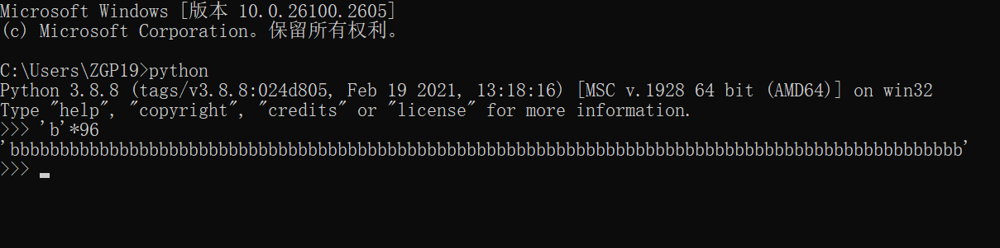
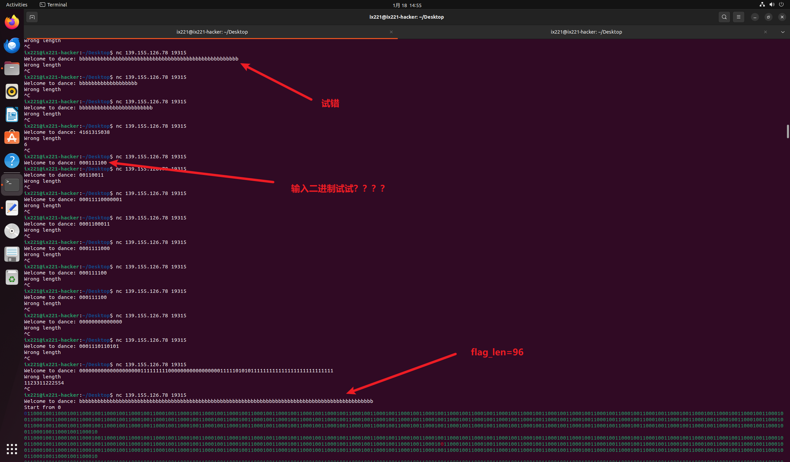
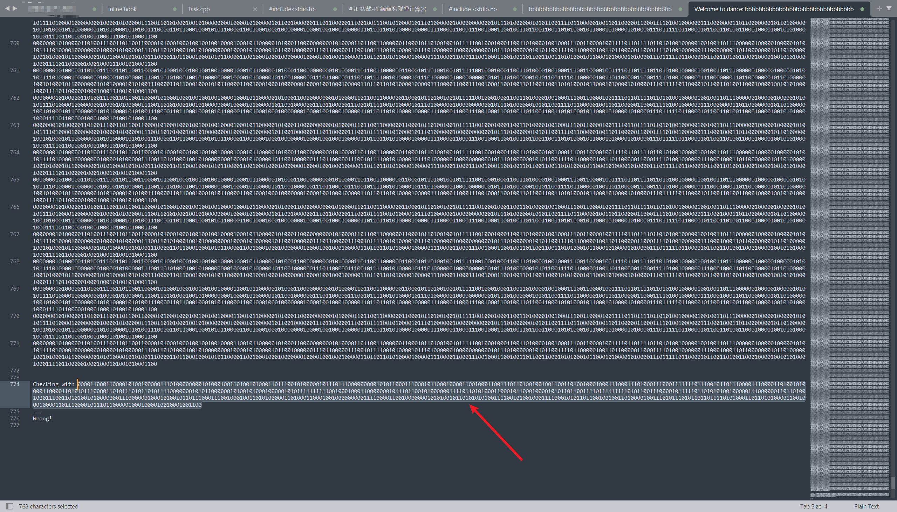
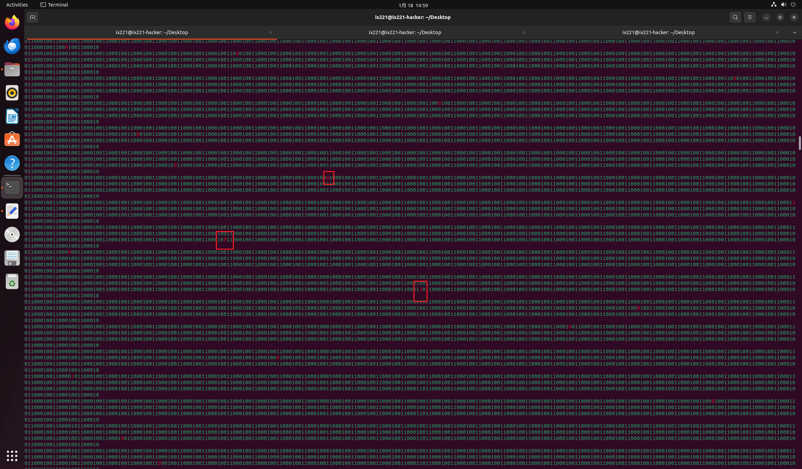
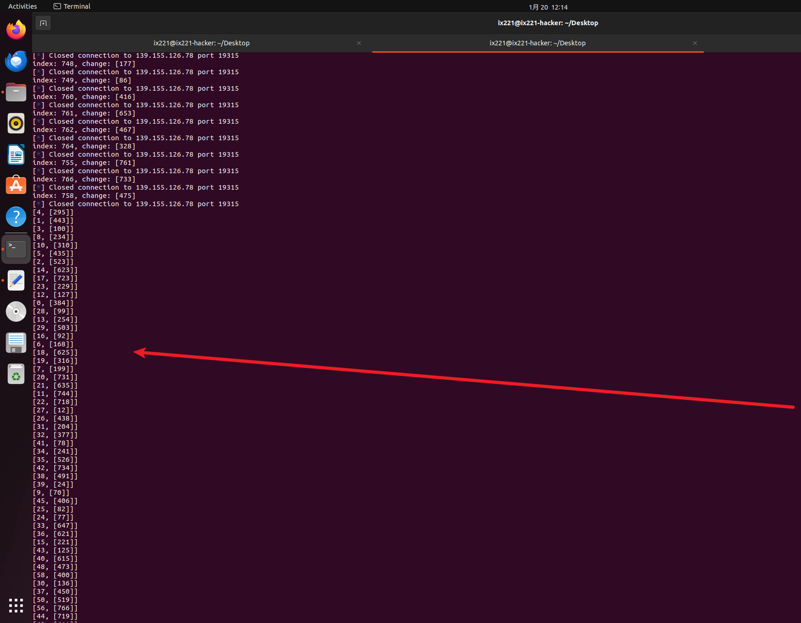
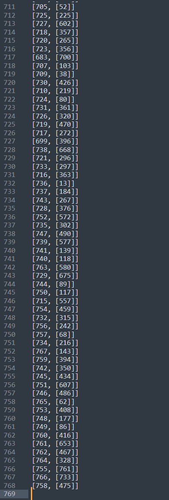
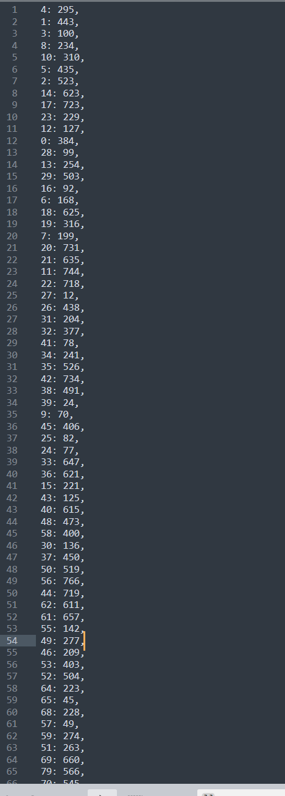
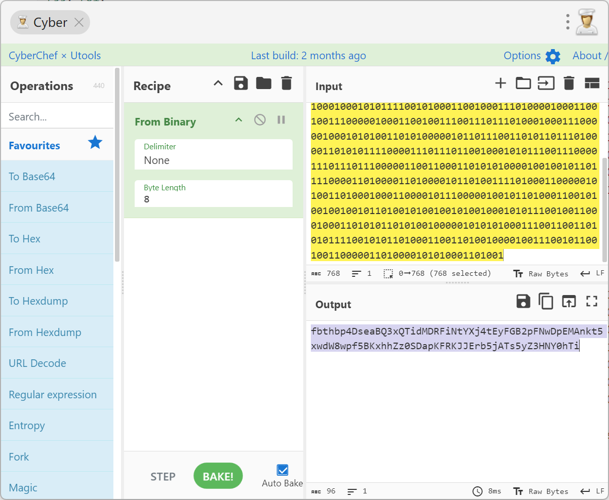

# 记一次无附件单靶机逆向题目求解-Bitdance-先知社区

> **来源**: https://xz.aliyun.com/news/16671  
> **文章ID**: 16671

---

# 0. 概述

本次西湖论剑revere分区只有一道题目，并且没有附件，只给了个纯靶机。

思路：对于无附件的题目，我们采取通过回显来判断出题人意图，从而得解的方式。

# 1. 测试

题目无附件，只给了个靶机


名字叫bitdance

连接靶机，发现只有个长度回显，所以我们首先测试长度，看长度正确回显





测试得知，flag\_len = 96

# 2. 求解

## 2.1 探索字符变化规律

回显比较长，我们把回显报存到文件中

```
HOST = '139.155.126.78'  # 这里请替换为目标主机的真实地址
PORT = 19315         # 这里请替换为目标服务的真实端口
TIMEOUT = 15  # 设置超时时间

def test_input_length(length, filename=None):
    try:
        with remote(HOST, PORT, timeout=TIMEOUT) as r:
            # 接收欢迎消息直到换行符
            welcome_msg = r.recvuntil(b'/n')
            print(f"Received welcome message: {welcome_msg}")

            # 发送指定长度的输入，加上换行符
            input_data = b'b' * length
            r.sendline(input_data)

            # 接收响应直到换行符
            response = r.recvuntil(b'Wrong!', drop=True)
            print(f"Received: {response.decode().strip()}")

            if b"Wrong length" not in response:
                print(f"Length {length} seems to be correct.")
                # 如果提供了文件名，则将回显写入文件
                with open(filename, 'wb') as f:
                    f.write(welcome_msg)
                    f.write(response)
                    print(f"Echo saved to {filename}.")
                return True

            
    except EOFError as e:
        print("Connection closed by server.")
        return False
    except Exception as e:
        print(f"An error occurred: {e}")
        return False

# 已知正确长度是96，进行测试并将回显保存到文件
correct_length = 96
output_filename = 'output.txt'
print(f"Testing length {correct_length} and saving echo to {output_filename}...")
if test_input_length(correct_length, output_filename):
    print("Process completed successfully.")
```

然后看回显文本，这些数据的行数正好是768，也就是是96\*8=768，并且发现有一些数据是红色的。

仔细分辨可以知道将输入转为二进制，绿色，然后会出来一个红色字符





密文如下，总共有768个二进制位。

Checking with 000011000110000101001000001110100000000101000100110100101000110111001010000010111011100000000010101100011100010110001000011001000110011101101001001001100110100100010001110001110100011100011111110111001011011100001110000110100101000011000011010101110000110101110101101011110000000101011000000101001010001000001010111111111100100010001100000001011101100101000000111101101010001100010110001000010101101100111101111111110101100111000010111110110101010010000011100000011011010010001110011010100101000000011100000010001010010110111000111001000100110101000001101000110001001000000000111100001100100000001010100101101010101001111001010010001111000101011011001001001101000010011101011101011011011110101000110110101000011001000100001101110000101110110000010001000010010001001100

## 2.2 爆破红色字符位置

通过红色字符判断，每次都会对一行数据进行操作，所以我们将红色字符的位置爆破出来。

猜测是对密文进行类似字符映射的机制，从而求解。

```
from pwn import *
from concurrent.futures import ThreadPoolExecutor


def change_bit(byte_str, index):
    byte_list = list(byte_str)
    byte_index = index // 8
    bit_index = index % 8
    byte = byte_list[byte_index]
    mask = 1 << (7 - bit_index)
    byte_list[byte_index] = chr(ord(byte) & ~mask)
    return "".join(byte_list)
def remove_ansi_escape_codes(text):
    ansi_escape = re.compile(r'/x1b/[[0-?]*[ -/]*[@-~]')
    return ansi_escape.sub('', text)
initial_byte_str = "/xff" * 96
output_sequence = []
for i in range(96 * 8):
    modified_byte_str = change_bit(initial_byte_str, i)
    output_sequence.append(modified_byte_str)

def find_zero_positions(binary_str):
    zero_positions = [i for i, bit in enumerate(binary_str) if bit == "0"]
    return zero_positions
res=[]
threads = []

def exploit_thread(i, output_sequence, res):
    p = remote("139.155.126.78", 19315)
    p.recvuntil("Welcome to dance: ")
    p.sendline(output_sequence[i])
    p.recvuntil("Start from 0/n")
    data = p.recvuntil("Checking")
    data = data.split(b"/n")
    data = data[:-3]
    data = data[-1]
    data=data.decode('utf-8')
    data=remove_ansi_escape_codes(data)
    data = find_zero_positions(data)
    print(f"index: {i}, change: {data}")
    res.append([i,data])
    p.close()

with ThreadPoolExecutor(max_workers=40) as executor:
    for i in range(8*96):
        executor.submit(exploit_thread, i, output_sequence, res)

executor.shutdown(wait=True)
def find_duplicates_and_missing(arr):
    n = len(arr)
    duplicates = set()
    missing = []
    seen = set()
    for num in arr:
        if num in seen:
            duplicates.add(num)
        else:
            seen.add(num)
    all_nums = set(range(768))
    missing = list(all_nums - set(arr))
    return duplicates, missing


for result in res:
    print(result)
```

跑出结果



```
[4, [295]]
[1, [443]]
[3, [100]]
[8, [234]]
[10, [310]]
[5, [435]]
[2, [523]]
[14, [623]]
[17, [723]]
[23, [229]]
[12, [127]]
[0, [384]]
[28, [99]]
[13, [254]]
[29, [503]]
[16, [92]]
[6, [168]]
[18, [625]]
[19, [316]]
[7, [199]]
[20, [731]]
[21, [635]]
[11, [744]]
[22, [718]]
[27, [12]]
....
....
....
[746, [486]]
[765, [62]]
[753, [408]]
[748, [177]]
[749, [86]]
[760, [416]]
[761, [653]]
[762, [467]]
[764, [328]]
[755, [761]]
[766, [733]]
[758, [475]]
```



## 2.3 单表替换，映射字符

```
dict_map ={
4: 295,
1: 443,
3: 100,
8: 234,
10: 310,
5: 435,
2: 523,
14: 623,
17: 723,
23: 229,
12: 127,
0: 384,
28: 99,
13: 254,
29: 503,
16: 92,
6: 168,
18: 625,
19: 316,
7: 199,
20: 731,
21: 635,
11: 744,
22: 718,
27: 12,
26: 438,
31: 204,
32: 377,
41: 78,
34: 241,
35: 526,
42: 734,
38: 491,
39: 24,
9: 70,
45: 406,
25: 82,
24: 77,
33: 647,
36: 621,
15: 221,
43: 125,
40: 615,
48: 473,
58: 400,
30: 136,
37: 450,
50: 519,
56: 766,
44: 719,
62: 611,
61: 657,
55: 142,
49: 277,
46: 209,
53: 403,
52: 504,
64: 223,
65: 45,
68: 228,
57: 49,
59: 274,
51: 263,
69: 660,
79: 566,
......
......    
759: 394,
742: 350,
745: 434,
751: 607,
746: 486,
765: 62,
753: 408,
748: 177,
749: 86,
760: 416,
761: 653,
762: 467,
764: 328,
755: 761,
766: 733,
758: 475,
}
cipher = '000011000110000101001000001110100000000101000100110100101000110111001010000010111011100000000010101100011100010110001000011001000110011101101001001001100110100100010001110001110100011100011111110111001011011100001110000110100101000011000011010101110000110101110101101011110000000101011000000101001010001000001010111111111100100010001100000001011101100101000000111101101010001100010110001000010101101100111101111111110101100111000010111110110101010010000011100000011011010010001110011010100101000000011100000010001010010110111000111001000100110101000001101000110001001000000000111100001100100000001010100101101010101001111001010010001111000101011011001001001101000010011101011101011011011110101000110110101000011001000100001101110000101110110000010001000010010001001100'

for i in range(len(cipher)):
    print(cipher[dict_map[i]],end='')

#enc='011001100110001001110100011010000110001001110000001101000100010001110011011001010110000101000010010100010011001101111000010100010101010001101001011001000100110101000100010100100100011001101001010011100111010001011001010110000110101000110100011101000100010101111001010001100100011101000010001100100111000001000110010011100111011101000100011100000100010101001101010000010110111001101011011101000011010101111000011101110110010001010111001110000111011101110000011001100011010101000010010010110111100001101000011010000101101001111010001100000101001101000100011000010111000001001011010001100101001001001011010010100100101001000101011100100110001000110101011010100100000101010100011100110011010101111001010110100011001101001000010011100101100100110000011010000101010001101001'
#fbthbp4DseaBQ3xQTidMDRFiNtYXj4tEyFGB2pFNwDpEMAnkt5xwdW8wpf5BKxhhZz0SDapKFRKJJErb5jATs5yZ3HNY0hTi -->flag
```



得解。
