# 初探鸿蒙应用逆向分析(奇妙的Math逻辑运算)-先知社区

> **来源**: https://xz.aliyun.com/news/16673  
> **文章ID**: 16673

---

# 概述

近年来，鸿蒙应用开发新兴起来，所以本文借一道鸿蒙应用Demo梳理一下鸿蒙的应用程序的逆向方法。

> 鸿蒙的定位不是替代安卓，而是实现万物互联。鸿蒙OS是一款面向万物互联新时代的、全场景、分布式的操作系统，实现OS与 硬件解绑、生态共享、跨端共享等。

# 实战-SU\_Harmony

题目附件为`hap`包。

## HAP包

那么什么是hap包呢? （**类比APK包**）

官方文档解释如下：

> HAP（Harmony Ability Package）是应用安装和运行的基本单元。HAP包是由代码、资源、第三方库、配置文件等打包生成的模块包，其主要分为两种类型：entry和feature。
>
> entry：应用的主模块，作为应用的入口，提供了应用的基础功能。
>
> feature：应用的动态特性模块，作为应用能力的扩展，可以根据用户的需求和设备类型进行选择性安装。
>
> 应用程序包可以只包含一个基础的entry包，也可以包含一个基础的entry包和多个功能性的feature包。

跟APK相似，所以，我们将hap文件解压。


逆向hap包，我们需要关注这里面的 `./ets/modules.abc` 和 `./libs`。（类比逆向APK的java层和so层）

即 ArkTS源码的编译结果（ArkTS是鸿蒙原生应用的开发语言）和动态库 。

## 逆向分析module.abc

modules.abc的反编译工具我们使用基于jadx和abcde开发的abc-decompiler。

（https://github.com/ohos-decompiler/abc-decompiler）

使用abc-decompiler打开modules.abc后可见源代码结构如下：

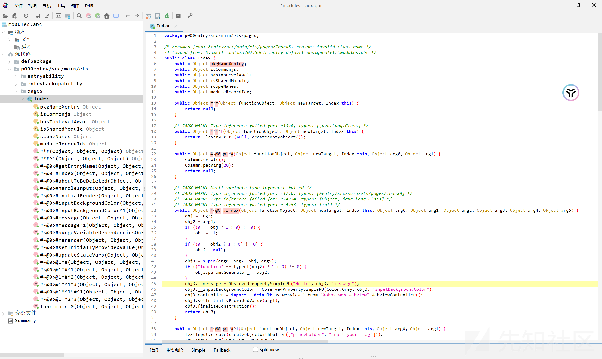

跟进源代码中main包的pages目录，这里包含了该程序中的所有的页面，这里只有一个Index页面。

明显看到了这几个敏感的地方。

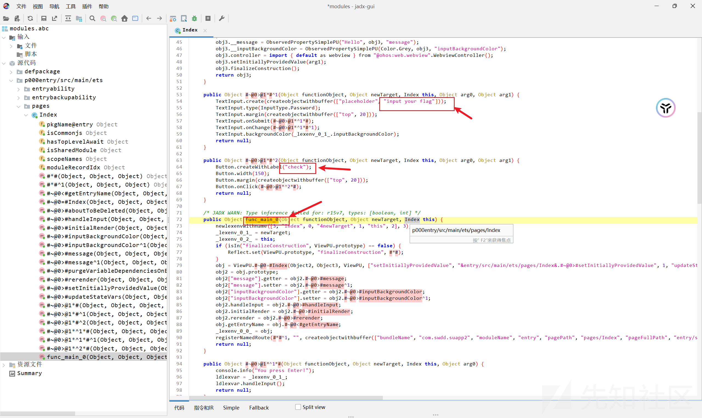

我们看onSubmit事件, 跟进handleInput

找到#~@0>#handleInput，看到调用了libentry.so，故check函数逻辑在so里。


## 逆向分析libentry.so

定位入口函数

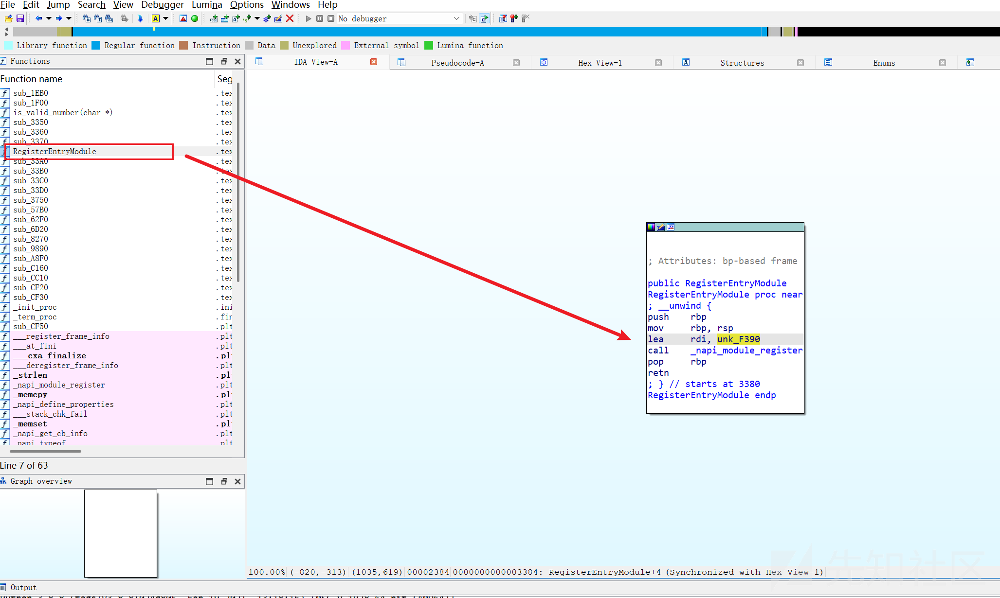

双击跟进

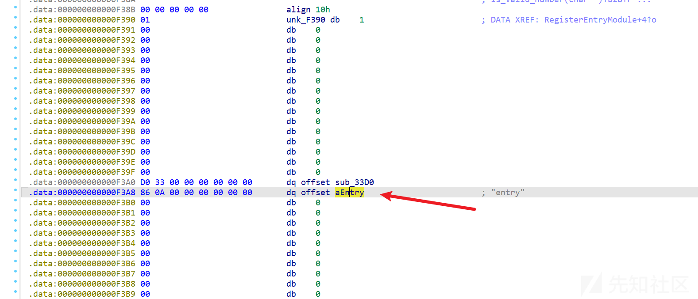

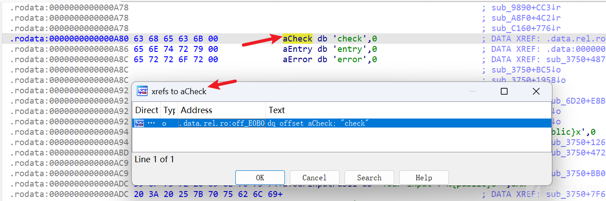

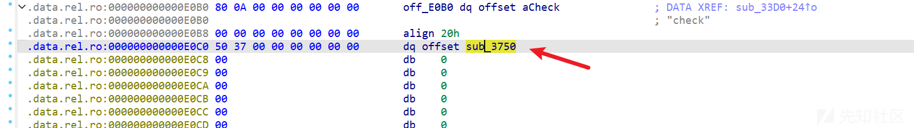

找到了check函数 sub\_3750 。

### 指令混淆-ollvm

首先看到一大坨，这里使用了ollvm的指令混淆,把运算变复杂了,超级难看。

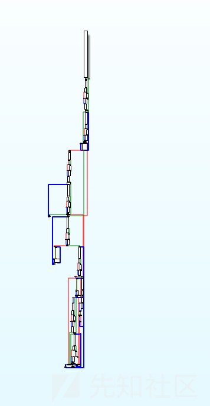

审计代码，猜出flag\_len = 32。

指令混淆根据 vxxx=0.0可以看懂代码逻辑，代码量不太大。

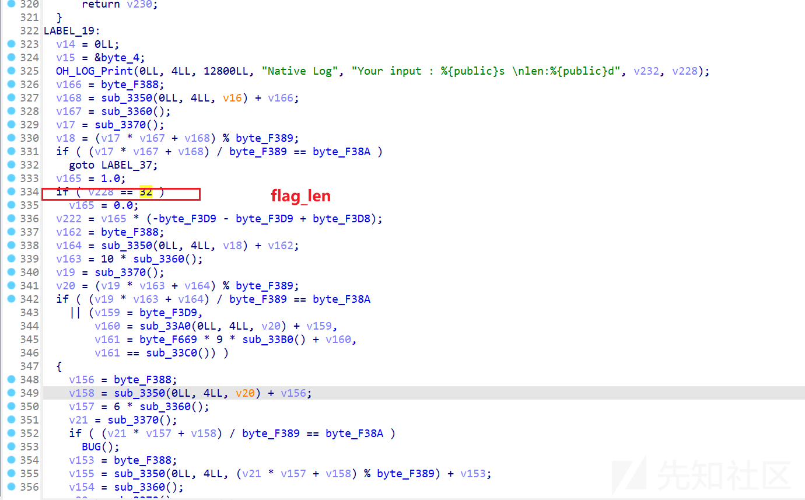

比较的地方和密文数据很容易找到，sub\_57B0才是真正的算法 。

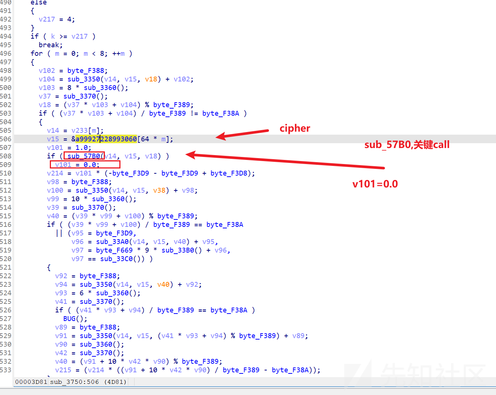

提取密文

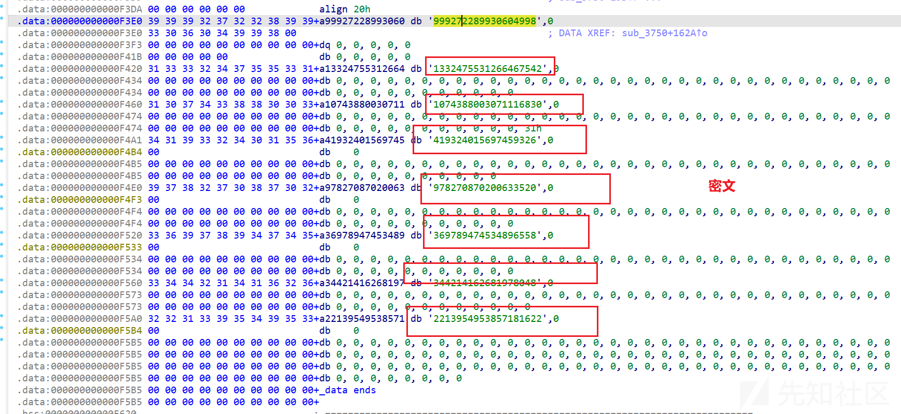

```
999272289930604998,
1332475531266467542,
1074388003071116830,
1419324015697459326,
978270870200633520,
369789474534896558,
344214162681978048,
2213954953857181622.
```

### 主要加密运算分析

跟进 sub\_57B0

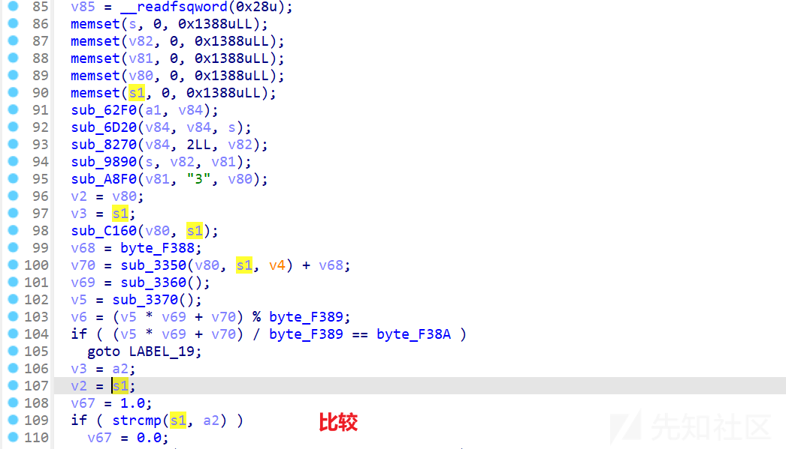

以下6个函数是加密

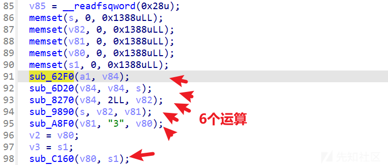

我们对运算处理函数进行逐个分析：（每个函数都有指令混淆）

sub\_62F0

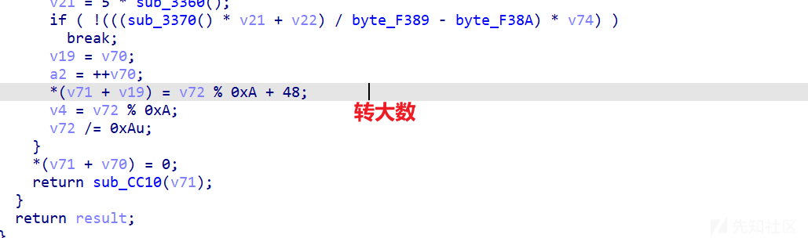

sub\_CC10

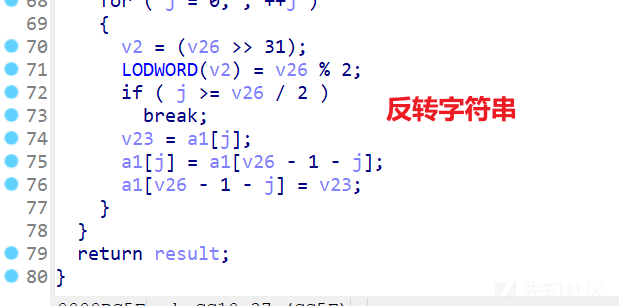

sub\_6D20

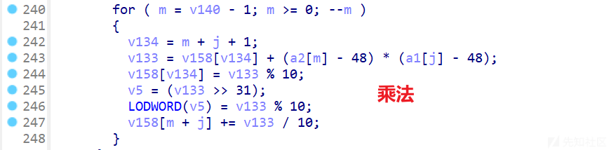

sub\_8270

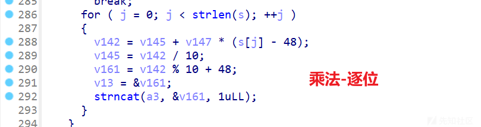

sub\_9890

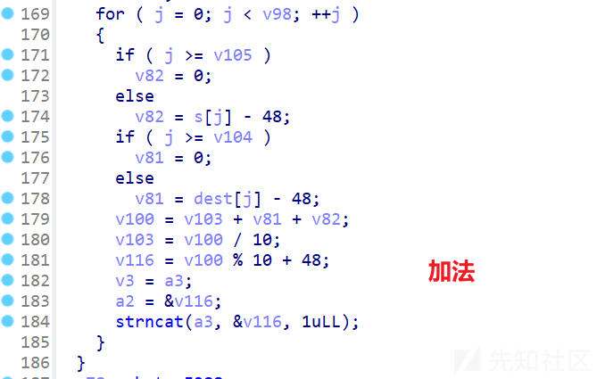

sub\_A8F0

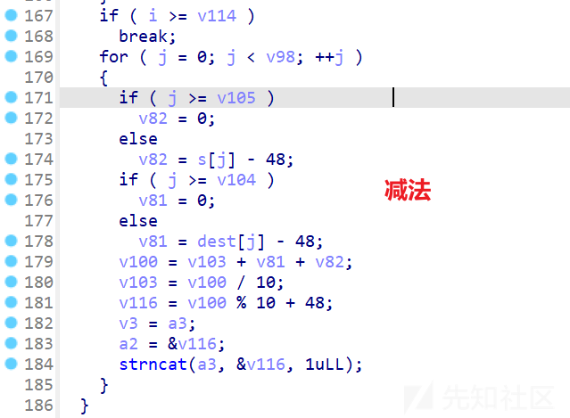

sub\_C160

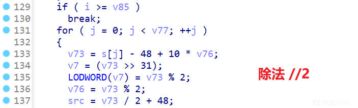

整理一下

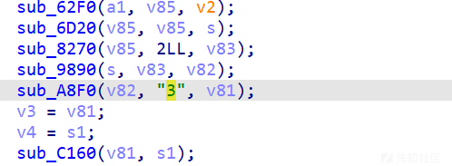

逻辑差不多这样.

我们可以发现其实就是完全平方

(((x\*x+(x)\*2))-3)/2

### 完全平方 Math 求解

求解的话：

把密文乘2+3等于x\*x+2x,再加1就凑成完全平方，然后开根号就是x+1 再减1就是x

解题脚本：

```
import math

numbers = [
    999272289930604998,
    1332475531266467542,
    1074388003071116830,
    1419324015697459326,
    978270870200633520,
    369789474534896558,
    344214162681978048,
    2213954953857181622
]

result_str = ""

for index, value in enumerate(numbers):
    updated_value = value * 2 + 4
    result = math.sqrt(updated_value) - 1
    result_str += f"{hex(int(result))+','}"
print(result_str)

hex_values = [
    0x54435553, 0x614d7b46, 0x575f6837, 0x646c726f,
    0x535f7349, 0x33425f30, 0x31747561, 0x7d6c7566
]

flag = ""
for value in hex_values:
    temp = f"{value:08x}"
    strr = ""
    
    # 每两个十六进制数字转换为一个字符
    for j in range(0, 8, 2):
        hex_pair = temp[j:j+2]
        char_value = chr(int(hex_pair, 16))
        strr += char_value
    
    strr = strr[::-1]
    flag += strr
# 输出最终结果
print(flag)

# SUCTF{Ma7h_WorldIs_S0_B3aut1ful}
```

​
