# wangmarket代码审计-先知社区

> **来源**: https://xz.aliyun.com/news/16680  
> **文章ID**: 16680

---

# 项目介绍

私有化部署自己的SAAS云建站系统，可通过后台任意开通多个网站，每个网站使用自己的账号进行独立管理。延续了织梦、帝国CMS的模版方式，性能高度优化，一台1核1G服务器可建立几万个独立网站

# 环境搭建

我选取的版本是v4.10

项目地址：<https://gitee.com/mail_osc/wangmarket/archive/refs/tags/v4.10.zip>

源码下载到本地后解压(注意：不要解压到中文目录下)，IDEA打开

修改配置文件：application.properties

数据库连接配置

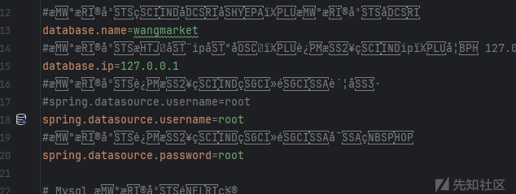

数据库接口配置，把sqlite的注释掉，用mysql的

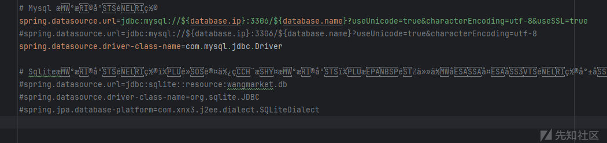

然后在数据库中创建对应数据库，并导入sql文件：\else\wangmarket.sql

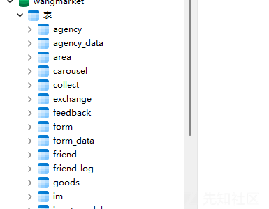

然后启动项目，访问127.0.0.1:8080即可开始系统安装

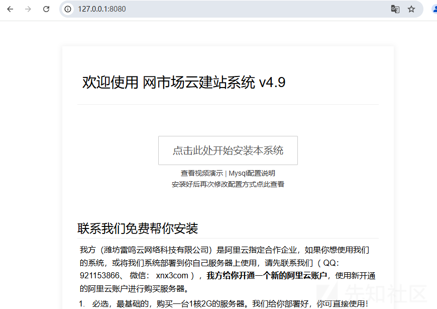

## 环境搭建踩坑

我本地用的maven3.8.1，然后运行时报错

```
Pingplusplus:pingpp-java:pom:2.1.7 failed to transfer from http://0.0.0.0/ during a previous attempt. This failure was cached in the local repository and resolution is not reattempted until the update interval of maven-default-http-blocker has elapsed or updates are forced. Original error: Could not transfer artifact Pingplusplus:pingpp-java:pom:2.1.7 from/to maven-default-http-blocker (http://0.0.0.0/): Blocked mirror for repositories: [central (http://jcenter.bintray.com, default, releases), maven-ali (http://maven.aliyun.com/nexus/content/groups/public/, default, releases+snapshots)]
```

解决办法：

在pom.xml文件中把下面两个依赖改成https

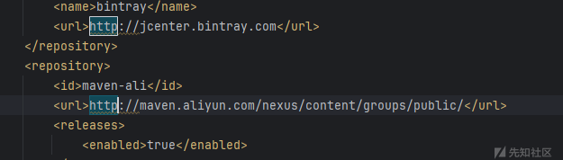

然后使用下面命令强制更新依赖

```
mvn clean install -U
```

# 漏洞挖掘

## SQL注入

先判断sql语句使用api，检查下pom.xml文件或者依赖包

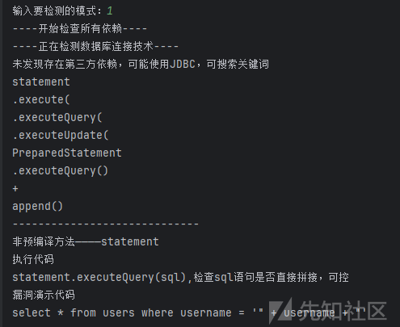

pom.xml中未发现其它依赖引用

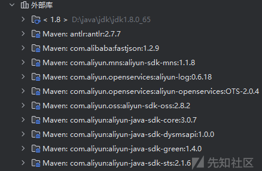

外部库也没发现，判断为原生JDBC

全局搜索\*\*+\*\*&**append**

这套系统实际上是有做sql注入预防的，我们可以找一处查询功能点看下

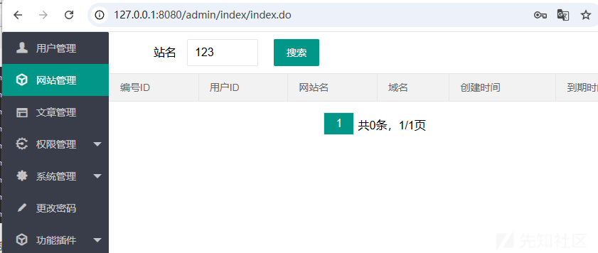

像这种搜索的功能点，也就是模糊匹配是我们优先可以看的，抓包看下路由

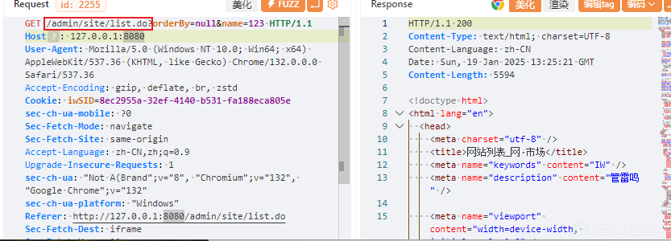

根据路由定位到代码段

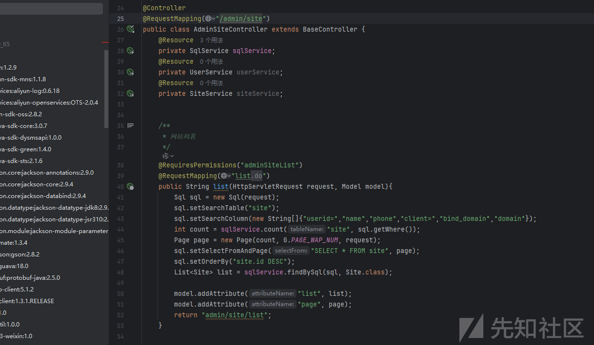

这里我们没有看到name数据的处理，其实是写在setSearchColumn这个方法里面的，我们跟进

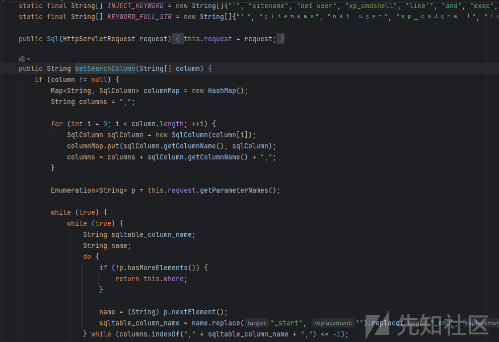

可以看到过滤内容也在这里面，我们重点看数据处理的部分

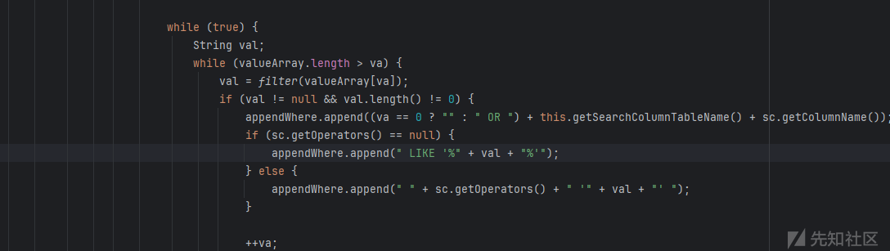

可以看到通过while循环取出valueArray数组中对应索引的值，然后用到了个filter方法，然后在把取出来的val通过append拼接到语句中，那么这里的关键点肯定就是filter方法了，我们看下这个方法干了什么

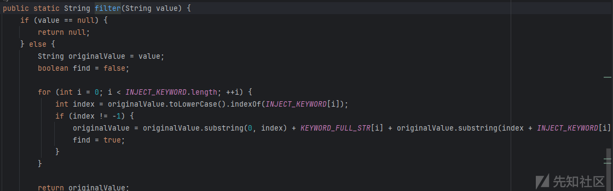

通过toLowerCase()方法把我们传入的内容转换成小写，然后进行字典匹配，如果存在就查询给originalValue赋值，内容就是替换的字符，我们可以看下执行结果

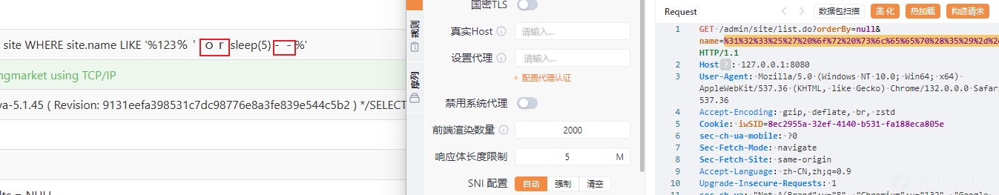

那么这里就不存在注入问题了，因为这个函数绕不过去，然后还禁用了特殊字符，但是

这里作者是自定义了一个filter函数用于SQL检测，不是写在filter层，也就是说不是默认全局的，那么我们就可以找下有没有没使用filter()方法并且写入sql语句中执行并且我们可控的参数。

还真有！

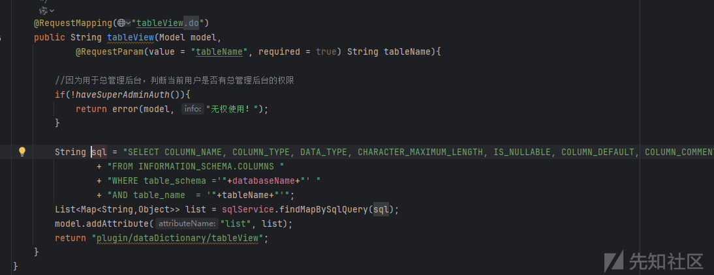

这里有个tablename参数是我们可控的并且是直接拼接到sql语句中没有进行处理，直接使用findMapBySqlQuery方法执行的，那么这里就会有注入问题

对应的路由是：/plugin/dataDictionary/tableView.do

然后这里要管理员权限才能访问，登入的时候使用admin登入

抓包，sqlmap一把搜哈

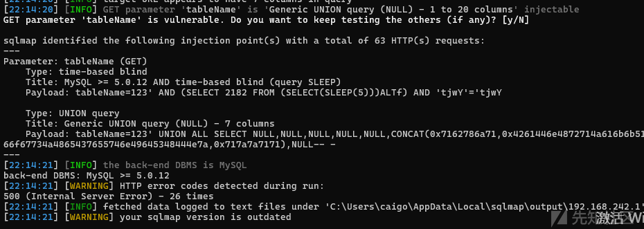

## XSS

这套系统的xss和sql一样，有预防函数

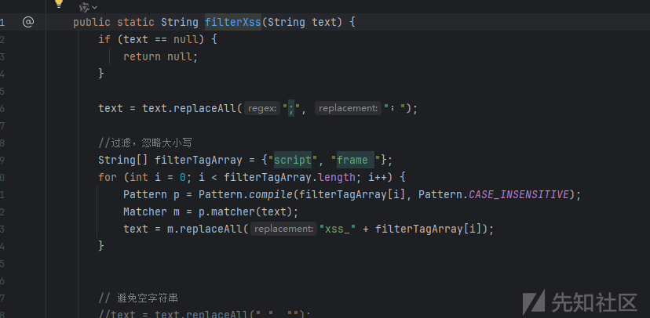

所以我们要找的就是没有使用filterxss并且能回显的地方，这个还是比较难找的

### 第一处

网站有模板修改功能，尝试插入xss语句


保存，并且生成整站

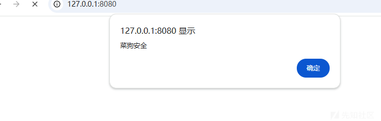

这个的话因为这套系统是多用户管理，除了后台用户还有代理用户和总管理，所以通过后台xss可以获取总管理或代理的cookie还是有利用价值的。

### 第二处

在总代理的角色添加处

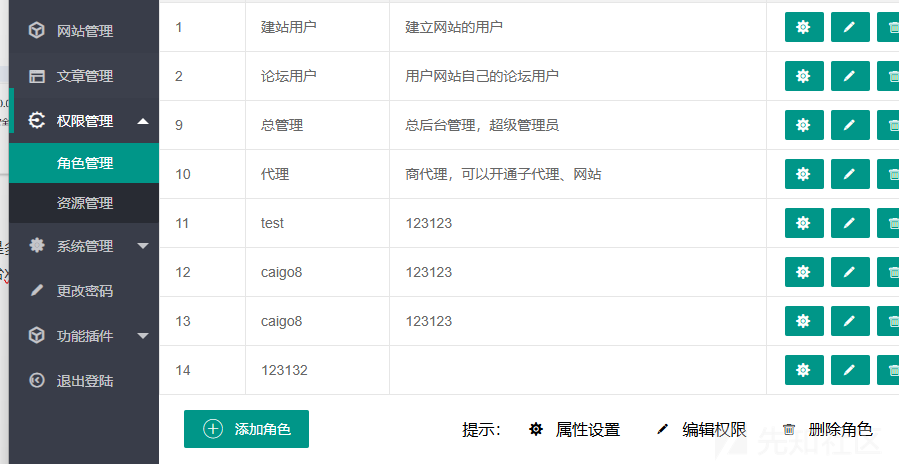

可以新增角色，然后这里可以写描述

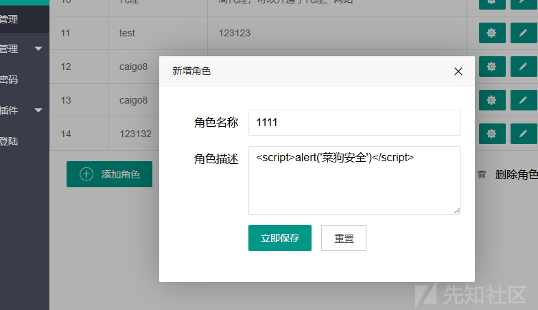

保存

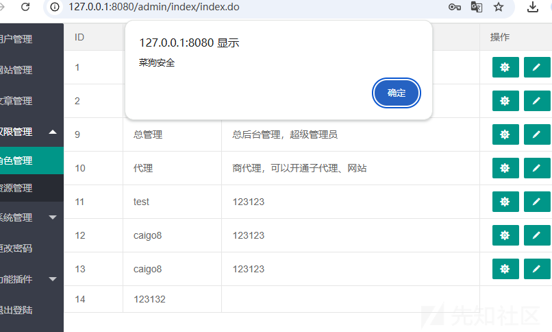

## 多处CSRF

### 代理用户创建

抓取数据包用户创建

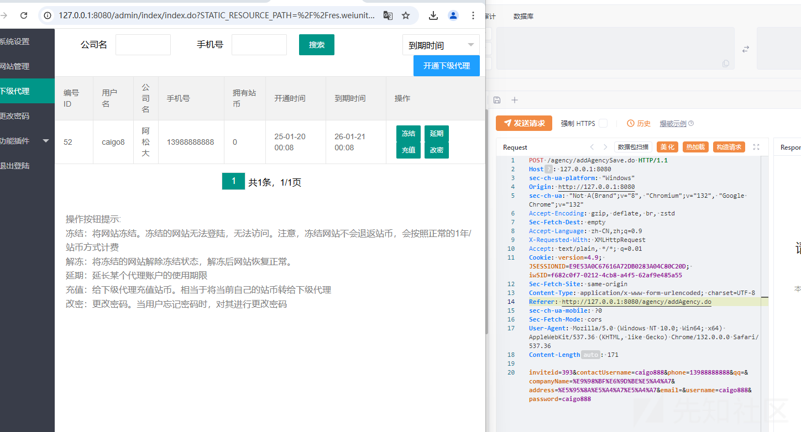

生成csrf\_poc

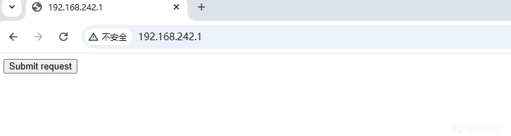

把csrf1.html放到服务器上，模拟管理员触发

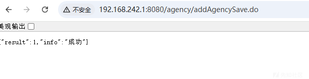

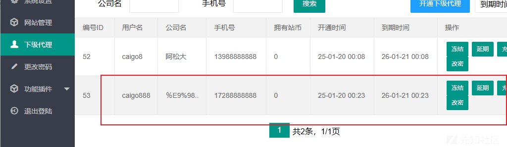

### 密码修改

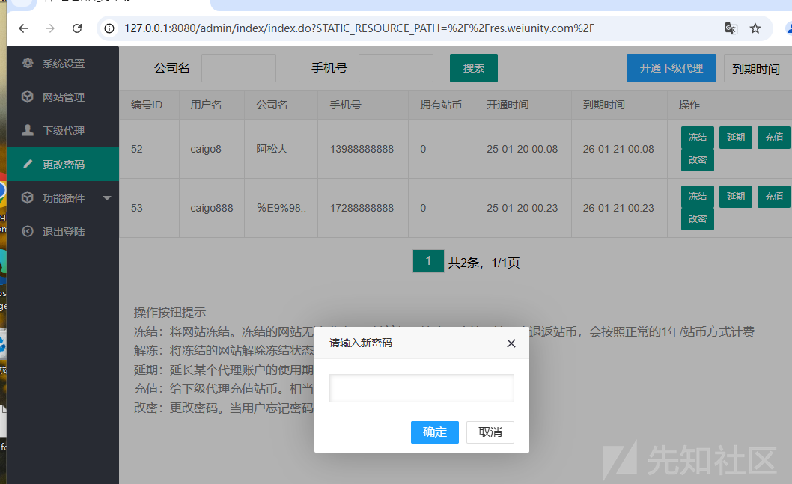

他这里密码修改不需要校验旧密码，那这里如果可以csrf就可以直接修改密码了

抓包

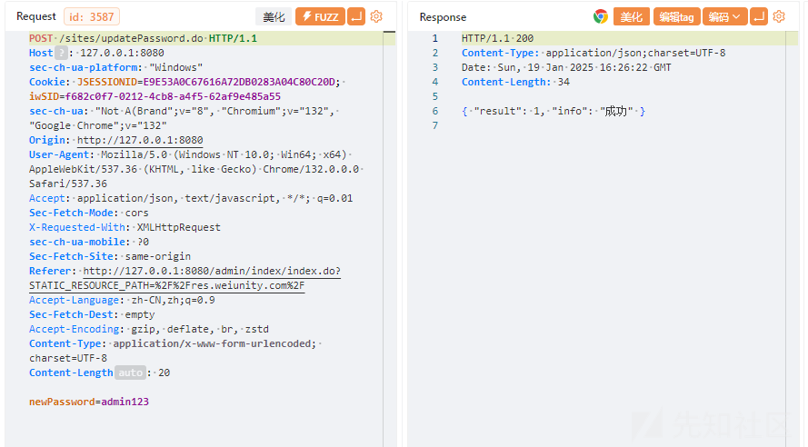

生成poc

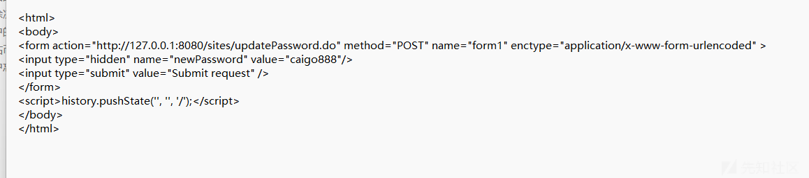

把csrf1.html放到服务器上，模拟管理员触发

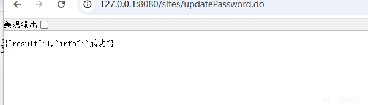

登入测试agency/admin123

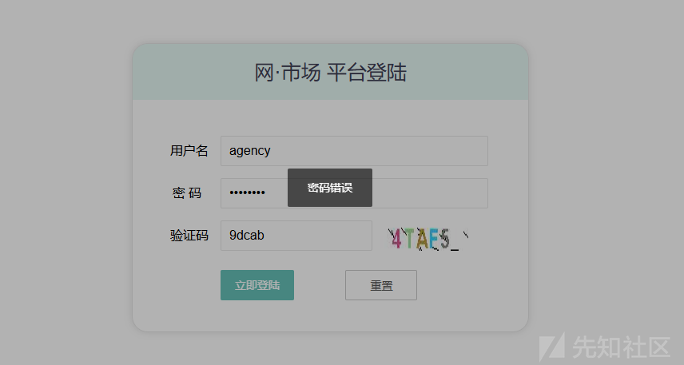

登入我们修改的密码caigo888

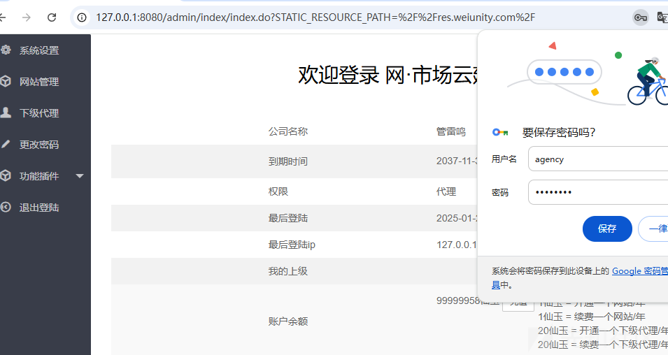

除了这两处还有很多功能点存在csrf，而且这个可以加上我们前面的xss进行组合利用
