# DLINK设备sc_mgr接口RCE分析-先知社区

> **来源**: https://xz.aliyun.com/news/16682  
> **文章ID**: 16682

---

# 前言

审计网络相关的设备漏洞，简单的跟一下，第一次看cgi的漏洞，发现此漏洞比较简单，所以分析一下。

# 审计

获取到源码，找到sc\_mgr.cgi文件

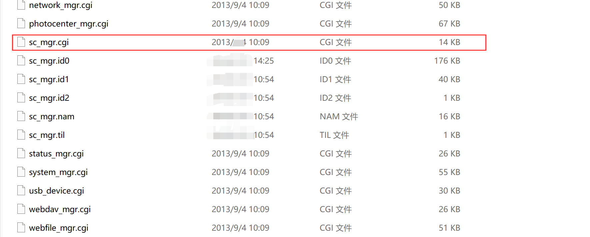

直接丢进IDA pro进行审计，首先一般入口函数都是main函数，但是cgi的入口函数为cgiMain函数开始，因此主要从这个函数入手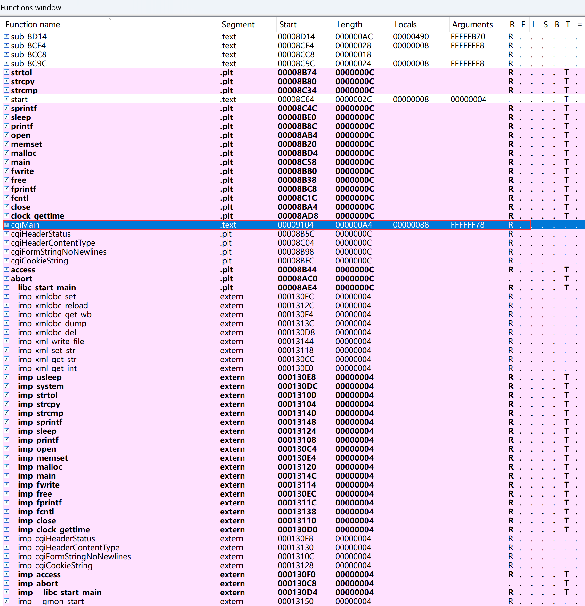

打开cgiMain函数，发现结构挺简单的

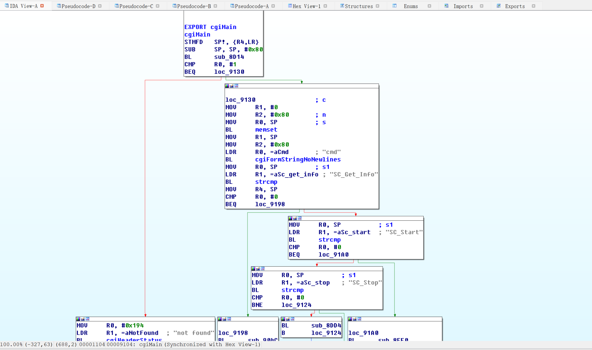

直接F5进去伪代码模式，发现调用sub\_8D14函数，检查是否满足某个条件（返回值为 1），如果条件不满足，调用 cgiHeaderStatus 返回 404 状态码，表示资源未找到，cgiFormStringNoNewlines 是一个 CGI 库函数，用于获取表单参数并过滤掉换行符。

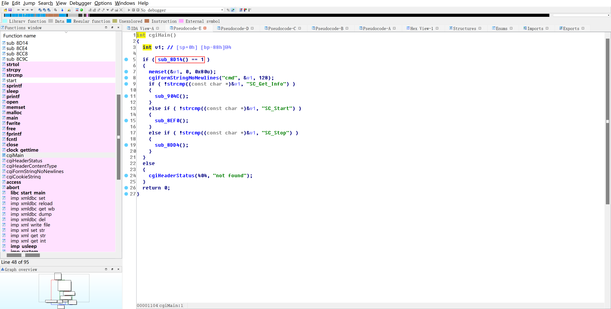

跟进sub\_8D14函数，发现检查客户端 IP 地址，如果客户端的 IP 地址是 127.0.0.1（本地回环地址），直接返回 1，表示允许执行操作。反之，客户端IP不是127.0.0.1则使用 cgiCookieString 获取 username 的值。构造一个命令字符串，将用户名和客户端 IP 地址写入 /tmp/test 文件并执行该命令。到这里基本上久可以进行RCE了。后面几行其实都可以不用看了

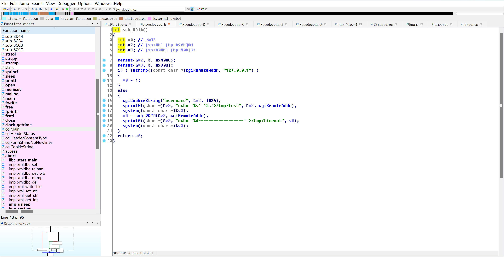

system函数，主要就是用于命令执行

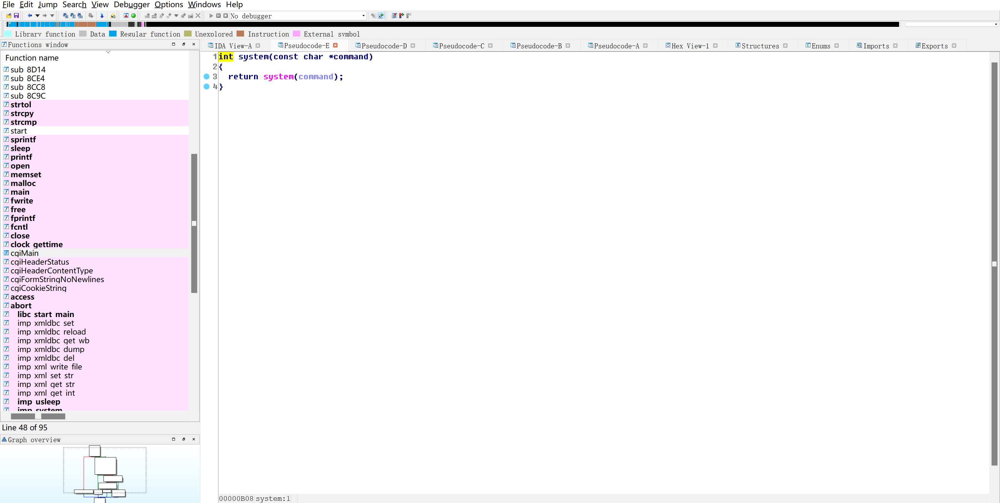

再回过头来查看cgiMain函数，发现执行过后，判断cmd的值从而选择进入哪一个执行语句进行处理。

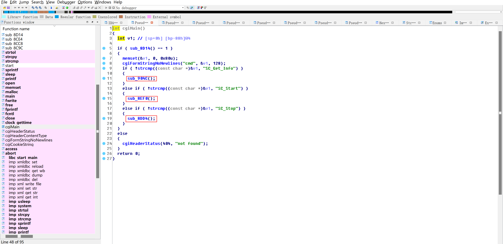

我们通过下述三张图可以发现每一个循环语句均可以对用户输入的命令进行回显

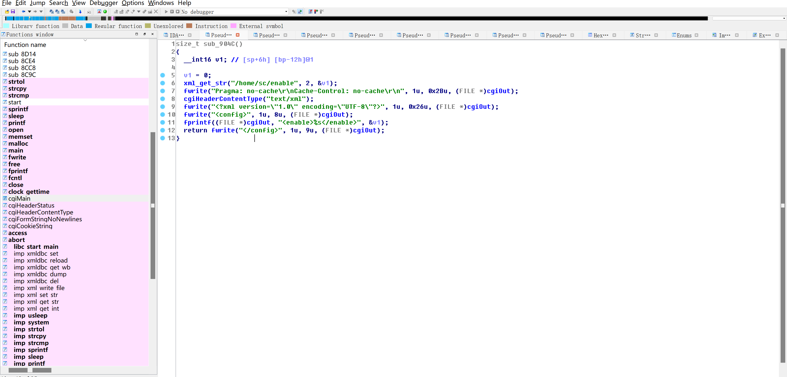

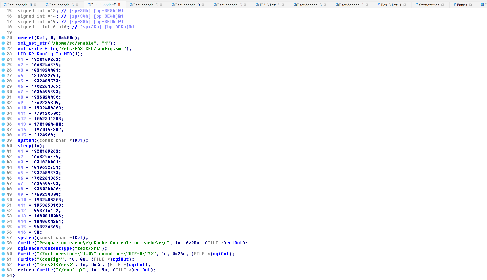

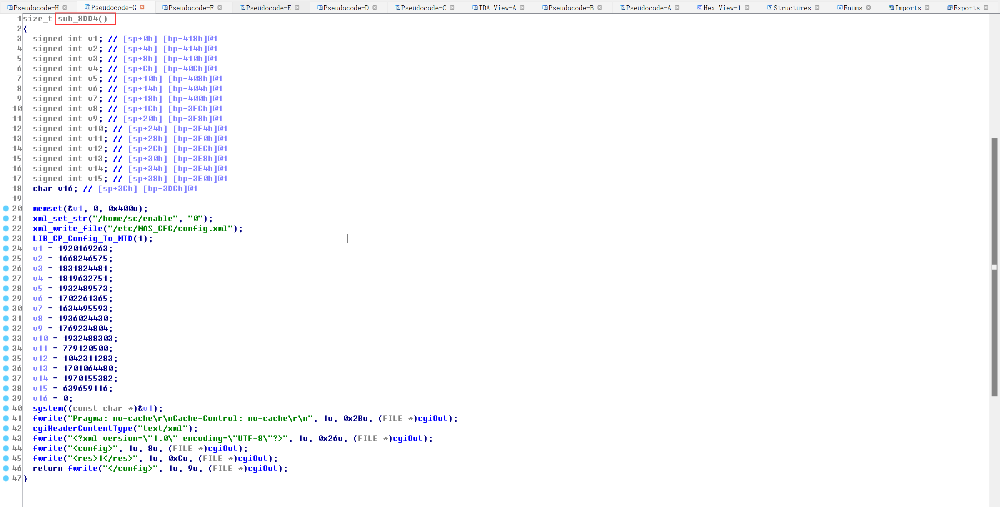

我们可以构造语句来闭合命令从而达到RCE，例如如下图：

直接闭合前面的单引号，然后使用&进行连接，最终输入id命令`echo 'qweewq12' & id & echo 'admin' '127.0.0.1'>/tmp/test`

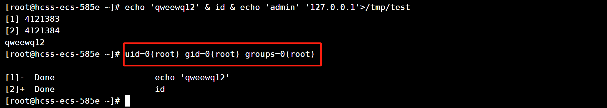

## 复现

如下可知，cmd等于任意值均可回显执行的命令

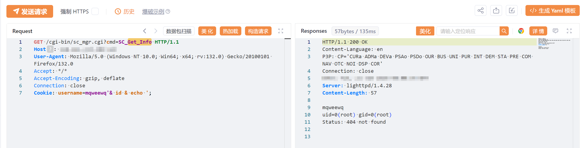

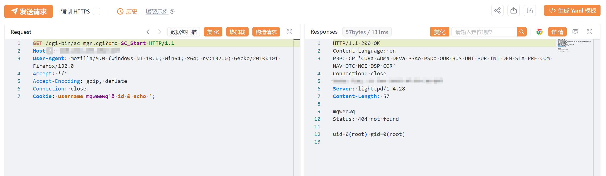
