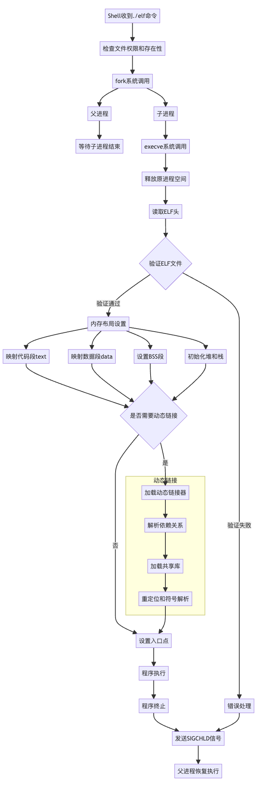
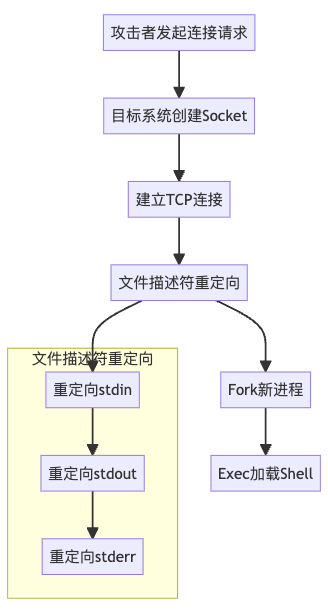
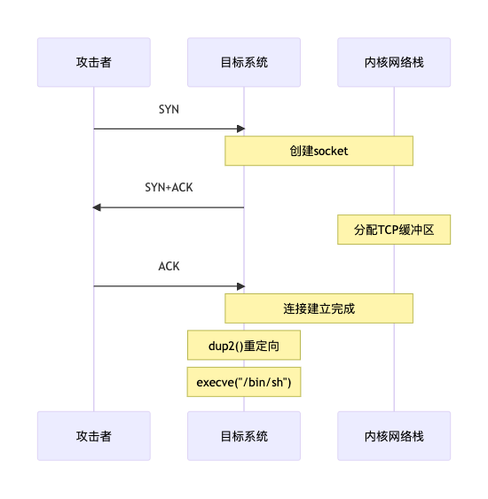
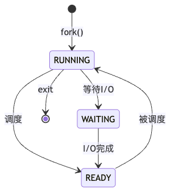
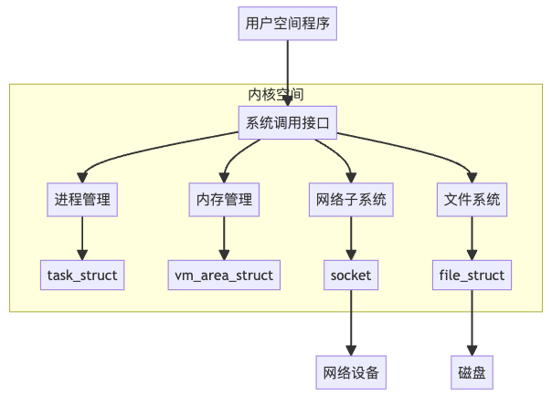

# 当我们在聊Getshell，我们本质上在聊什么？-先知社区

> **来源**: https://xz.aliyun.com/news/16683  
> **文章ID**: 16683

---

# 当我们在聊Getshell，我们本质上在聊什么？

## 什么是shell？

Shell本质上是一个命令行解释器，是用户与Linux内核交互的接口。它接收用户输入的命令，解释这些命令，然后调用相应的程序来执行。可以把Shell理解为一个中间人的角色，它在用户和操作系统内核之间进行翻译和沟通。

关于/bin/sh：

* /bin/sh最初指向Bourne Shell(sh)，这是Unix系统中最早的Shell之一
* 在现代Linux系统中，/bin/sh通常是一个符号链接，可能指向bash、dash或其他Shell
* 它被设计成POSIX标准的最小实现，确保脚本的可移植性

Shell的主要功能包括：

1. 命令解释：解析用户输入的命令
2. 程序执行：启动和管理其他程序的运行
3. 环境控制：管理环境变量
4. 脚本执行：运行Shell脚本
5. 管道和重定向：处理输入输出流

## 什么是POSIX？

POSIX (Portable Operating System Interface) 是一套标准化的操作系统接口规范。

POSIX的核心目标是确保不同操作系统之间的兼容性和软件的可移植性。它定义了操作系统应该提供什么样的接口，使得遵循这个标准编写的程序可以在不同的操作系统上运行。

POSIX标准主要规范了以下几个方面：

1. 系统调用和库函数

* 文件操作
* 进程控制
* 线程管理
* 网络通信
* 用户和组管理

2. 命令行和工具

* Shell命令语法
* 常用工具的行为（如ls, grep, awk等）
* 程序返回值的规范

3. 线程模型

* pthread库的接口规范
* 线程同步机制
* 线程调度

主流的类Unix系统都实现了POSIX标准的大部分特性：

* Linux系统基本上完全兼容POSIX
* macOS获得了POSIX认证
* BSD系列操作系统也largely遵循POSIX标准

在没有安装bash/zsh/fish的基础Linux系统中，/bin/sh通常指向dash (Debian Almquist Shell)或者busybox中的ash。这就是为什么在编写需要广泛兼容的shell脚本时，建议只使用POSIX shell特性，而不是依赖bash等特定shell的扩展功能。

## /bin/sh执行./elf时，系统本质上在做什么？

1. 程序执行前的准备

* Shell解析命令行，获取到文件路径"./elf"
* 检查文件权限（读取和执行权限）
* 确认文件存在且可执行

2. fork()过程

* 系统调用clone()（fork的底层实现）
* 复制进程描述符（task\_struct）
* 创建新的内存管理结构（mm\_struct）
* 复制页表
* 设置子进程的返回值为0，父进程获取子进程PID
* 子进程继承父进程的文件描述符表

3. execve()详细过程

```
int execve(const char *filename, char *const argv[], char *const envp[])
```

* 释放原进程空间
* 读取ELF文件头（前128字节）
* 验证ELF魔数：0x7F 'E' 'L' 'F'
* 检查ELF文件类型（ET\_EXEC或ET\_DYN）
* 检查目标架构是否匹配

4. ELF加载过程

* 解析程序头表（Program Header Table）

* PT\_LOAD段的加载
* PT\_DYNAMIC段的处理
* PT\_INTERP段识别动态链接器

5. 内存映射详细步骤

* 建立虚拟内存布局
* 代码段（text）：

* 映射到固定地址
* 设置为只读和可执行

* 数据段（data）：

* 映射可读写数据
* 包含已初始化的全局变量

* BSS段：

* 分配零页
* 映射未初始化的全局变量

* 堆区：

* 从数据段末尾开始
* 初始化brk指针

* 栈区：

* 在虚拟地址空间高地址处
* 设置栈指针（sp）

6. 动态链接过程（如果是动态链接的ELF）

* 加载动态链接器（ld.so）
* 解析依赖关系
* 加载所需的共享库
* 重定位和符号解析

7. 执行环境设置

* 设置程序入口地址（entry point）
* 初始化寄存器状态
* 设置argc、argv和环境变量
* 准备辅助向量（auxiliary vector）

8. 进程状态转换

* 从TASK\_RUNNING状态开始执行
* 父进程（Shell）进入TASK\_INTERRUPTIBLE等待子进程结束

9. 错误处理机制

* execve失败时返回到子进程
* 出错处理（文件不存在、权限不足等）
* 资源清理

10. 进程终止

* 程序执行完毕或异常终止
* 发送SIGCHLD信号给父进程
* 资源回收
* 退出码传递给父进程



## 当我们聊GetShell的时候，我们本质上在聊什么？

GetShell的本质是获取目标系统的Shell解释器的交互权限，通常包括：

* 获得一个交互式的Shell会话
* 能够执行命令并获取结果
* 通常是/bin/sh或/bin/bash的解释器环境

反弹Shell的技术原理：

```
核心是重定向文件描述符：
- 标准输入 (fd 0)
- 标准输出 (fd 1)
- 标准错误 (fd 2)
将这些描述符重定向到网络连接
```



1. 网络连接建立阶段

```
// 系统调用序列
socket(AF_INET, SOCK_STREAM, 0);    // 创建TCP套接字
struct sockaddr_in addr;             // 设置连接目标
connect(sockfd, (struct sockaddr*)&addr, sizeof(addr)); // 建立连接
```



2. 文件描述符重定向

```
// 重定向标准输入输出错误到socket
dup2(sockfd, 0);  // 标准输入
dup2(sockfd, 1);  // 标准输出
dup2(sockfd, 2);  // 标准错误
```

3. 进程创建和替换

```
pid_t pid = fork();
if (pid == 0) {
    // 子进程
    execve("/bin/sh", ["/bin/sh", "-i", NULL], environ);
}
```



4. 内核层面发生的事情：

a) 网络子系统：

* 创建socket文件描述符
* TCP三次握手过程
* 建立网络缓冲区
* 设置TCP状态机

b) 进程管理：

* 创建新的task\_struct结构
* 复制文件描述符表
* 设置进程上下文
* 调度新进程

c) 内存管理：

* 为新进程分配虚拟内存空间
* 建立页表映射
* 复制父进程的地址空间
* 加载shell程序到内存

d) 文件系统：

* 打开/bin/sh文件
* 读取程序代码
* 处理文件描述符继承



5. Shell环境建立：

```
struct pt_regs regs;
// 设置寄存器状态
// 设置程序计数器(PC)
// 设置栈指针(SP)
```

6. I/O重定向后的数据流：

```
网络数据 -> TCP缓冲区 -> Socket读缓冲 -> fd 0 -> Shell进程
Shell进程 -> fd 1/2 -> Socket写缓冲 -> TCP缓冲区 -> 网络数据
```


系统调用链路：

```
connect() 
  -> sys_connect() 
    -> sock->ops->connect() 
      -> tcp_v4_connect()
        -> tcp_connect()
```

完整的系统调用序列：

```
socket()
bind()    (对于监听端)
connect() (对于反弹端)
dup2()    (3次，用于重定向)
fork()
execve()
```

## 总结

Shell本质上是用户与操作系统内核交互的接口，它作为一个命令解释器，负责接收用户指令并转化为系统能理解的操作。POSIX则是确保这些接口标准化的规范，它定义了操作系统应该提供什么样的接口，使得不同系统间的操作具有可预测性和可移植性。

当我们执行./elf时，系统展现了进程创建和程序执行的基本机制：从fork()创建新进程，到execve()加载新程序，再到内存映射、动态链接等一系列精密的系统调用操作。这个过程展示了操作系统如何管理和调度资源。

而当讨论到GetShell这个概念时，我们实际上是在讨论如何获取目标系统的命令解释器权限。这涉及了文件描述符重定向、网络套接字操作、进程控制等技术细节。通过操纵这些底层机制，攻击者能够建立一个远程的交互式Shell环境。

这整个技术探讨展示了从基本的系统接口，到复杂的程序执行机制，再到高级的攻击技术，操作系统的各个层面是如何紧密联系并相互作用的。这也说明了为什么深入理解底层机制对于理解高级安全概念如此重要。
