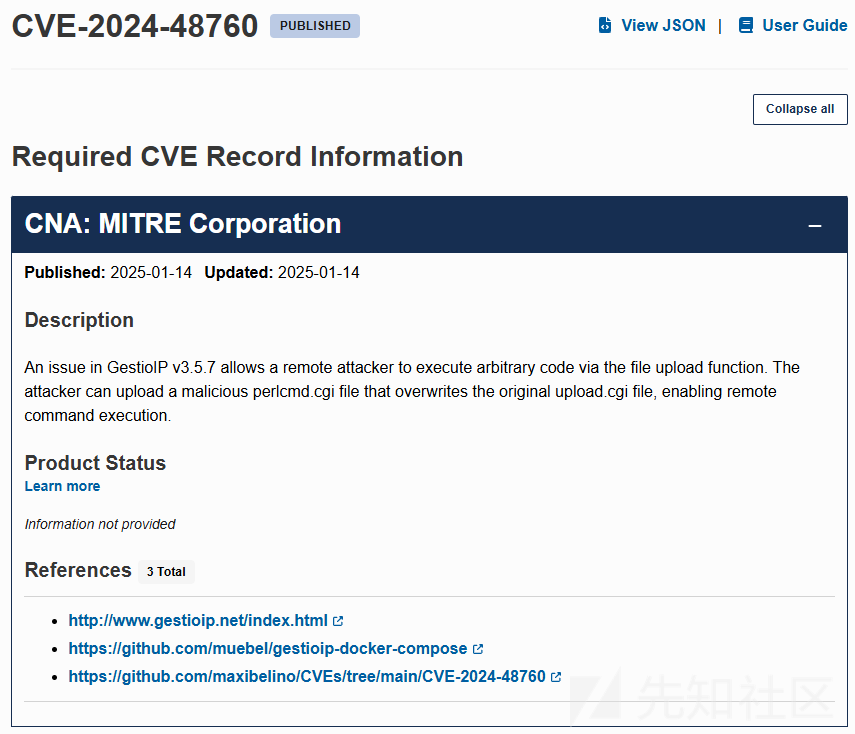
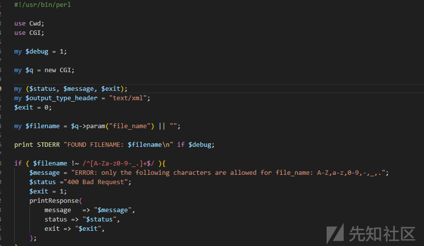
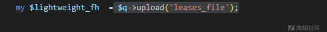
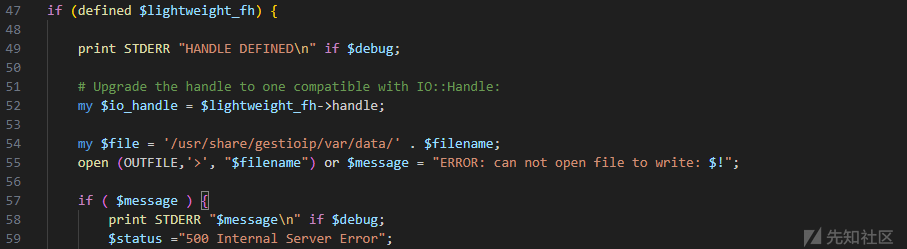
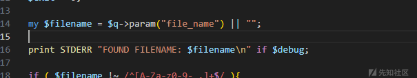
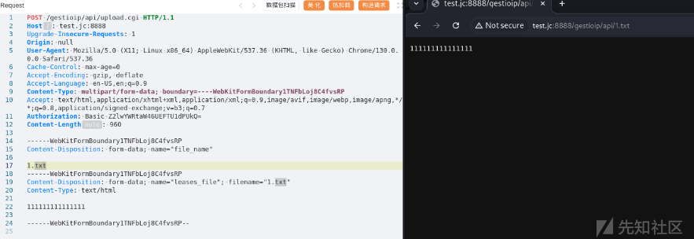
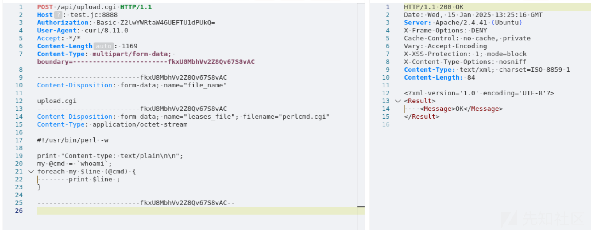
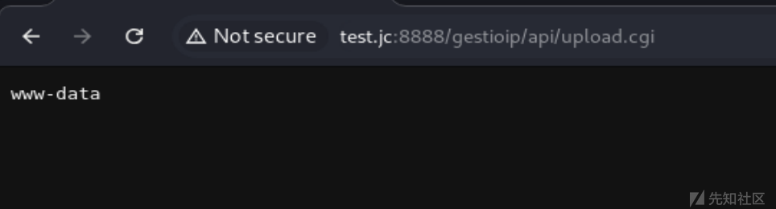

# GestioIP 3.5.7 文件上传漏洞分析(CVE-2024-48760)-先知社区

> **来源**: https://xz.aliyun.com/news/16688  
> **文章ID**: 16688

---

# 漏洞通告



根据漏洞通告了解漏洞文件在`upload.cgi` 并且是文件上传

# 漏洞分析

根据官网搭建环境

打开`upload.cgi`文件，环境是`perl`语法



漏洞点如下


文件上传句柄是通过`$lightweight_fh->handle`获取的


`$lightweight_fh`是通过`$q->upload('leases_file');`获取文件内容的字段是`leases_file`



`$filename`是要打开的文件的，如果文件不存在则创建文件



继续向上分析`$filename`是通过 `$q->param("file_name") || "";`获取的，如果没有这个参数那么`$filename`为空



因此可以确定

* file\_name参数表示文件名
* leases\_file参数表示文件内容

# 流程分析

要想到达漏洞触发点需要经过三个条件判断

```
if ( $filename !~ /^[A-Za-z0-9-_.]+$/ ){
...退出...
}

$POST_MAX=1024 * 10000;  # 10MB max
if (($POST_MAX > 0) && ($content_length > $POST_MAX)) {
...退出...
}

if (defined $lightweight_fh) {
...漏洞触发点...
}
```

根据简化代码流程可以知道要想触发漏洞，要满足三个条件

* 文件名只能是字母数字
* 文件大小不能超过10M
* 要有文件参数

# 构造payload

文件上传成功



上传webshell




