# ThemeGlow JobBoard Job文件上传漏洞分析(CVE-2024-43243)-先知社区

> **来源**: https://xz.aliyun.com/news/16689  
> **文章ID**: 16689

---

# 漏洞通告

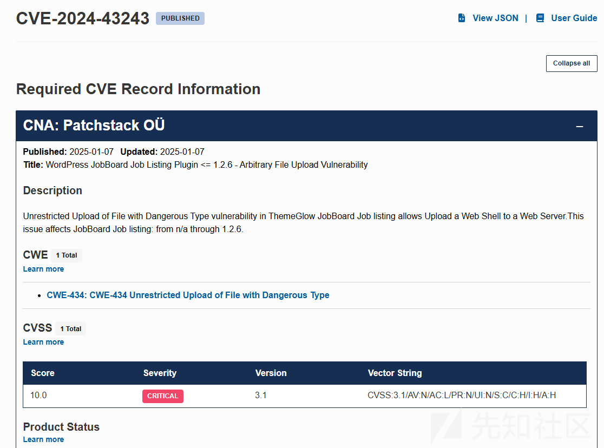

根据漏洞通告了解到漏洞是文件上传

# 漏洞分析

漏洞触发点如下

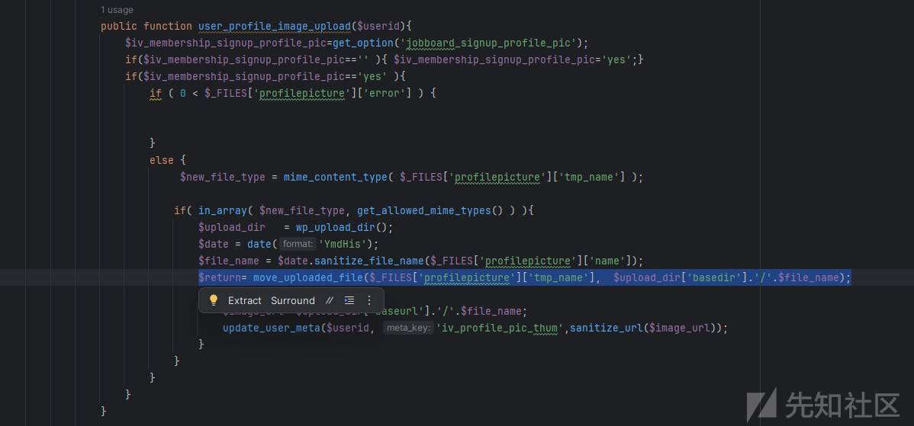

初步分析`user_profile_image_upload`函数仅对类型做了校验

```
if( in_array( $new_file_type, get_allowed_mime_types() ) ){   
  ......
}
```

`$new_file_type`是通过`mime_content_type( $_FILES['profilepicture']['tmp_name'] )`获取的

根据官网介绍`mime_content_type`即返回一个文件的 MIME 内容类型，这个结果是通过使用来自 magic.mime 文件的信息确定的。

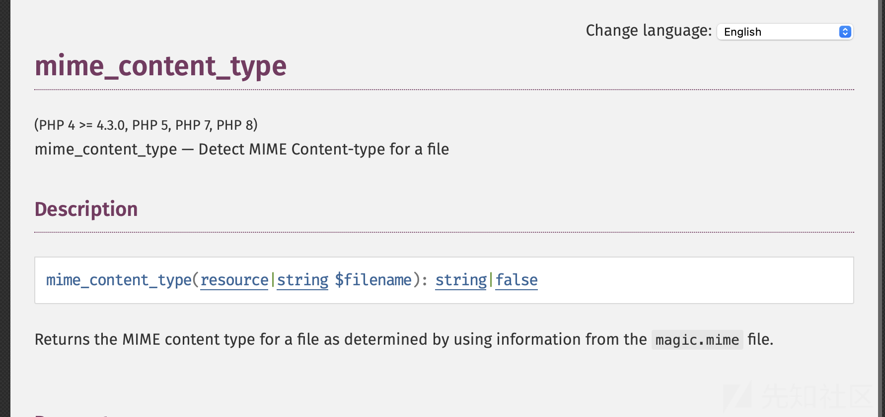

然后判断 `$new_file_type`是否在`get_allowed_mime_types()`数组里，继续分析寻找入口点

`user_profile_image_upload`函数在paypal-submit.php 文件里调用的


一般来说wp无法直接paypal-submit.php 文件，推测其他地方导入了这个文件

经过查询plugin.php的`jobboard_paypal_form_submit`文件导入了

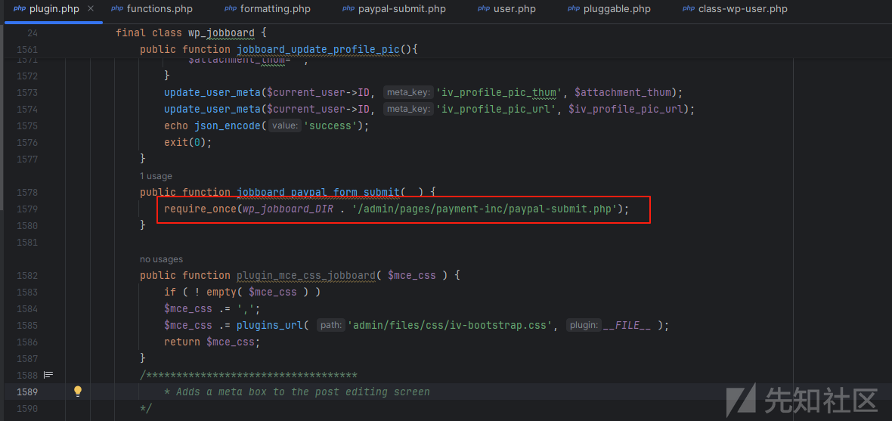

继续追踪，在当前对象创建时，注册回调函数，该函数将在 init 动作被触发时执行。

init初始化动作，那么说明只要访问哪个文件创建这个对象就出发该方法了。

在wp-settings.php文件中触发了init

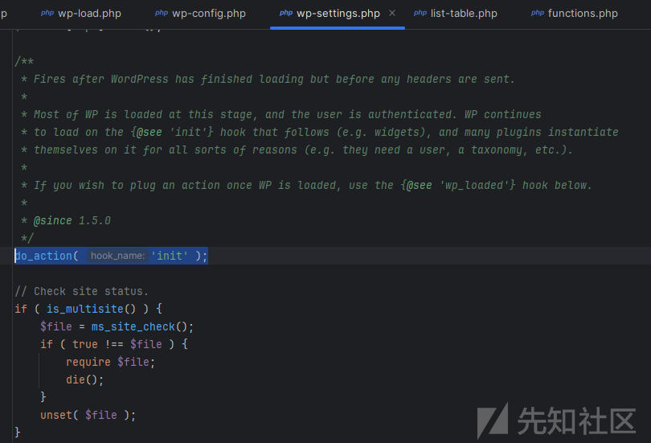

wp-settings.php是配置文件，那么推出访问首页就可以调用`jobboard_paypal_form_submit`函数

# 动态调试

访问首页测试断点是否进入`jobboard_paypal_form_submit`函数。


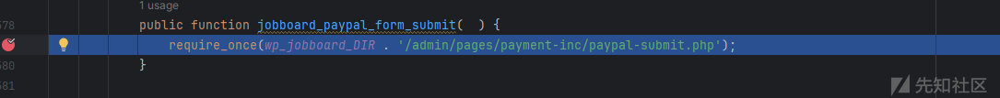

入口找到了，那么接下来就一步一步的进入漏洞点就可以了。

第一个判断，需要参数`iv-submit-listing=register，payment_gateway=paypal`

POST请求获取`_wpnonce`参数，`wp_verify_nonce`函数用于验证WordPress表单提交的安全验证函数

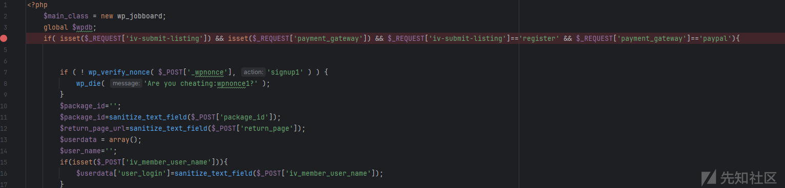

继续分析，需要POST请求携带`user_login，iv_member_email，iv_member_password`参数

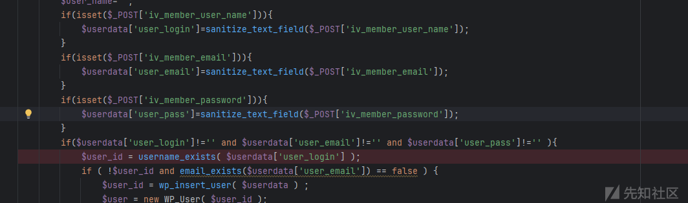

紧接判断是否存在用户名和邮箱，`user_login=[值不重复]，iv_member_email=aaaa`

进入`user_profile_image_upload`函数

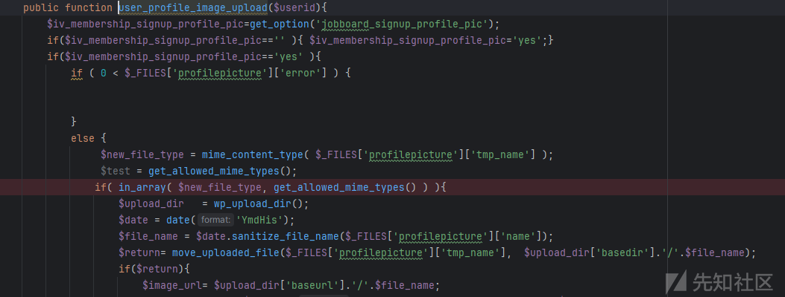

根据初步分析的情况需要判断文件类型

获取`get_allowed_mime_types()`中有什么数据，单独将`get_allowed_mime_types()`提取出来动态测试。

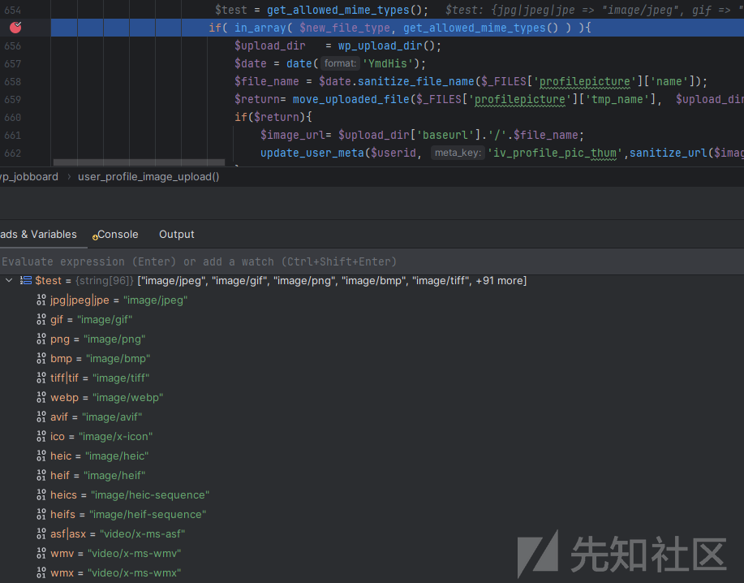

```
jpg|jpeg|jpe = "image/jpeg"
gif = "image/gif"
png = "image/png"
bmp = "image/bmp"
tiff|tif = "image/tiff"
webp = "image/webp"
avif = "image/avif"
ico = "image/x-icon"
heic = "image/heic"
heif = "image/heif"
heics = "image/heic-sequence"
heifs = "image/heif-sequence"
asf|asx = "video/x-ms-asf"
wmv = "video/x-ms-wmv"
wmx = "video/x-ms-wmx"
wm = "video/x-ms-wm"
avi = "video/avi"
divx = "video/divx"
flv = "video/x-flv"
mov|qt = "video/quicktime"
mpeg|mpg|mpe = "video/mpeg"
mp4|m4v = "video/mp4"
ogv = "video/ogg"
webm = "video/webm"
mkv = "video/x-matroska"
3gp|3gpp = "video/3gpp"
3g2|3gp2 = "video/3gpp2"
txt|asc|c|cc|h|srt = "text/plain"
csv = "text/csv"
tsv = "text/tab-separated-values"
ics = "text/calendar"
rtx = "text/richtext"
css = "text/css"
htm|html = "text/html"
vtt = "text/vtt"
dfxp = "application/ttaf+xml"
mp3|m4a|m4b = "audio/mpeg"
aac = "audio/aac"
ra|ram = "audio/x-realaudio"
wav = "audio/wav"
ogg|oga = "audio/ogg"
flac = "audio/flac"
mid|midi = "audio/midi"
wma = "audio/x-ms-wma"
wax = "audio/x-ms-wax"
mka = "audio/x-matroska"
rtf = "application/rtf"
js = "application/javascript"
pdf = "application/pdf"
class = "application/java"
tar = "application/x-tar"
zip = "application/zip"
gz|gzip = "application/x-gzip"
rar = "application/rar"
7z = "application/x-7z-compressed"
psd = "application/octet-stream"
xcf = "application/octet-stream"
doc = "application/msword"
pot|pps|ppt = "application/vnd.ms-powerpoint"
wri = "application/vnd.ms-write"
xla|xls|xlt|xlw = "application/vnd.ms-excel"
mdb = "application/vnd.ms-access"
mpp = "application/vnd.ms-project"
docx = "application/vnd.openxmlformats-officedocument.wordprocessingml.document"
docm = "application/vnd.ms-word.document.macroEnabled.12"
dotx = "application/vnd.openxmlformats-officedocument.wordprocessingml.template"
dotm = "application/vnd.ms-word.template.macroEnabled.12"
xlsx = "application/vnd.openxmlformats-officedocument.spreadsheetml.sheet"
xlsm = "application/vnd.ms-excel.sheet.macroEnabled.12"
xlsb = "application/vnd.ms-excel.sheet.binary.macroEnabled.12"
xltx = "application/vnd.openxmlformats-officedocument.spreadsheetml.template"
xltm = "application/vnd.ms-excel.template.macroEnabled.12"
xlam = "application/vnd.ms-excel.addin.macroEnabled.12"
pptx = "application/vnd.openxmlformats-officedocument.presentationml.presentation"
pptm = "application/vnd.ms-powerpoint.presentation.macroEnabled.12"
ppsx = "application/vnd.openxmlformats-officedocument.presentationml.slideshow"
ppsm = "application/vnd.ms-powerpoint.slideshow.macroEnabled.12"
potx = "application/vnd.openxmlformats-officedocument.presentationml.template"
potm = "application/vnd.ms-powerpoint.template.macroEnabled.12"
ppam = "application/vnd.ms-powerpoint.addin.macroEnabled.12"
sldx = "application/vnd.openxmlformats-officedocument.presentationml.slide"
sldm = "application/vnd.ms-powerpoint.slide.macroEnabled.12"
onetoc|onetoc2|onetmp|onepkg = "application/onenote"
oxps = "application/oxps"
xps = "application/vnd.ms-xpsdocument"
odt = "application/vnd.oasis.opendocument.text"
odp = "application/vnd.oasis.opendocument.presentation"
ods = "application/vnd.oasis.opendocument.spreadsheet"
odg = "application/vnd.oasis.opendocument.graphics"
odc = "application/vnd.oasis.opendocument.chart"
odb = "application/vnd.oasis.opendocument.database"
odf = "application/vnd.oasis.opendocument.formula"
wp|wpd = "application/wordperfect"
key = "application/vnd.apple.keynote"
numbers = "application/vnd.apple.numbers"
pages = "application/vnd.apple.pages"
```

简单看一下文件类型，没有php脚本相关的类，那么可能是存在绕过了。

## mime\_content\_type绕过

首先要了解一下`mime_content_type`检测原理，

* 该函数会读取文件的一部分内容，通常是文件的开头部分（头部），并根据这些内容来判断文件的 MIME 类型。

根据文件开头那么稍微有点思路了，可以使用垃圾数据填充开头污染检测。

所有参数都获取成功了，那么使用payload进行测试

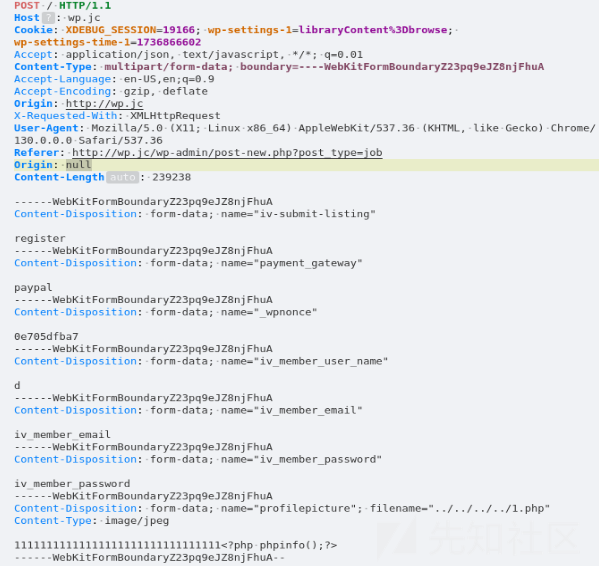

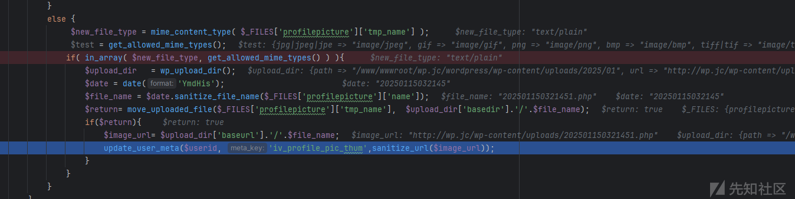

恶意文件上传成功，访问测试

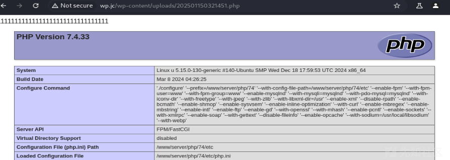
