# 一次研究如何获得wifi密码的过程-先知社区

> **来源**: https://xz.aliyun.com/news/16712  
> **文章ID**: 16712

---

# 一次研究如何获得wifi密码的过程

## 前言

**研究这个的契机是有次跟我的学长**[@ZIKH26](https://zikh26.github.io/)**聊智能家居iot安全的时候说的“那不连接wifi怎么去入侵智能家居呢”，然后就引申出这个了，描述概括下核心内容大概是这样**

任何设备都可以接收到路由器的信号，因为本身这个信号就是广播的，否则你识别不到路由器怎么去连接。只是要是想通过wifi去上网，就需要输入验证密码，因为数据是加密的。现在我通过可以发射信号的网卡，去向路由器发送一个特别的帧，让路由器以为与设备断卡连接了，而一般断开连接之后会重新连接，我们就可以捕获这个连接的握手包，然后在本地进行破解出密码

**我一听这个牛掰啊：**

**首先 这样就可以破解任意密码了(错误的，弱口令且字典需要足够强大，后续会说明)**

**其次 这可以直接让区域内设备都上不了网了，这破坏性多大，直接让邻居上不了网(:**

**当时学长玩这个的时候用的是**[aircrack-ng](https://github.com/aircrack-ng/aircrack-ng)**这个工具，说一套下来操作有很多，可以尝试下怎么一键梭哈**

**在寒假就一起研究了一下原理等的内容**

## 抓包过程

**直接get到学长的无线网卡**

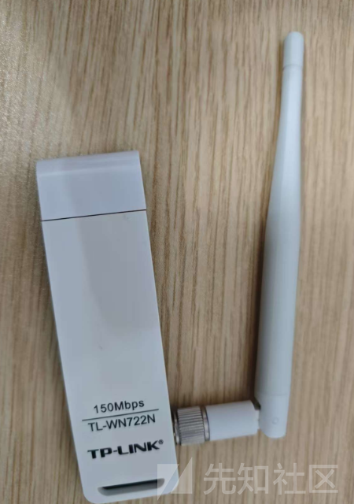

**先用现成的工具体验一下**

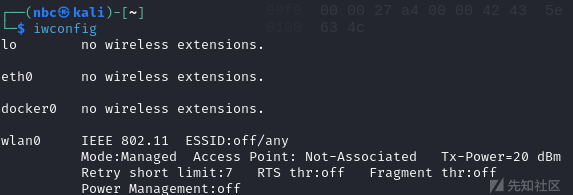

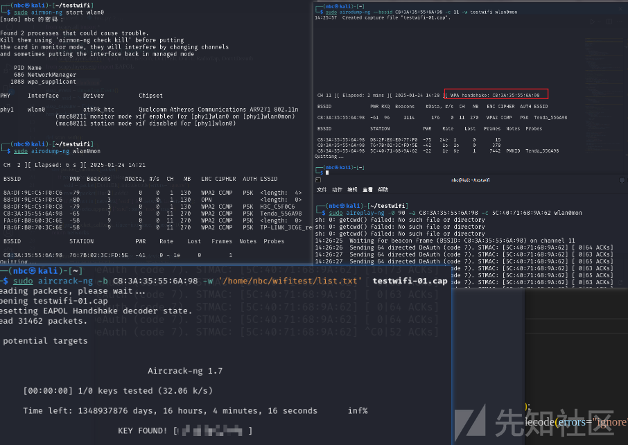

**工具的具体操作过程这里就不写了，网上有很多文章怎么操作，这里探究怎么写出一键梭哈脚本**

**在用工具进行操作时，过程大概是这样的：****启动网卡为监听模式->监听当前环境AP(路由器)->选定AP监听该设备下的连接设备(STA)->发送断开帧->捕获到握手包->破解**

**这时候就存在疑问点：**

1. **怎么抓包？**
2. **抓什么包？**
3. **发送的是什么？**
4. **发送完之后抓到什么包才能破解出密码呢？**

**打开wireshark选定我们的无线网卡**

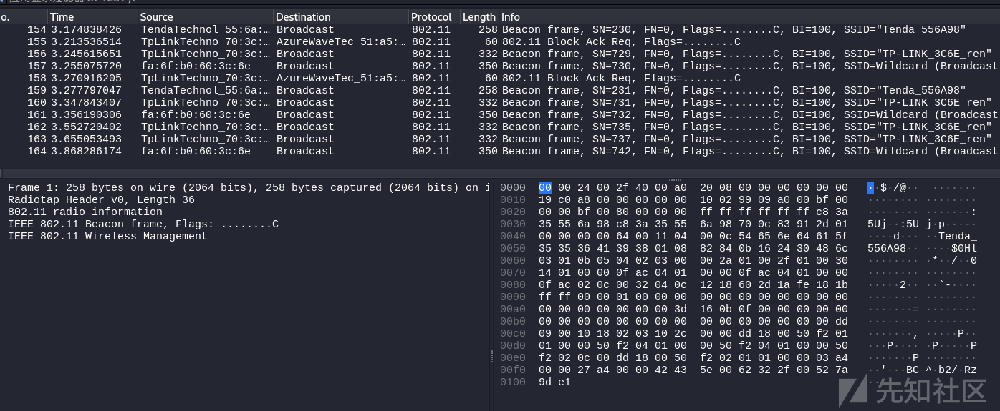

**看到就是一堆包，也看不懂也不知道哪些包是我需要的，所以就要去研究一下原理了**

### Scapy

**首先是怎么抓包，可以使用Scapy来操作**

**Scapy** **是一个用于** **网络数据包处理** **和** **网络攻击模拟** **的强大 Python 库。它允许用户轻松地创建、发送、捕获、解析和修改网络数据包**

**具体可以看文档**

[Introduction — Scapy 2.6.1 documentation](https://scapy.readthedocs.io/en/latest/introduction.html)

**我们所使用的模块主要在**

[scapy.layers.dot11 — Scapy 2.6.1 documentation](https://scapy.readthedocs.io/en/latest/api/scapy.layers.dot11.html)

### 802.11协议

#### 802.11协议简介

**IEEE 802协议簇是指IEEE标准中关于局域网（LAN）和城域网（MAN）的一系列标准。IEEE 802中定义的服务和协议限定在OSI七层网络模型的最低两层，即数据链路层和物理层。实际上，IEEE802又将OSI的数据链路层分成了两个子层，逻辑链路控制层（LLC）和媒介访问控制层（MAC）。IEEE802协议簇由IEEE802标准委员会维护。其中最广泛应用的协议有以太网（802.3）和WLAN（802.11）。每一个工作组专注一个方向，每个工作组由数字编号，比如目前从802.1编到了802.24。**

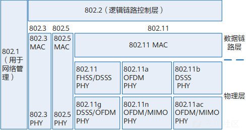

**所以802.11协议是IEEE802标准委员会下属的无线局域网工作组制定的无线局域网标准。**

**详细内容可以看**[IEEE Xplore Full-Text PDF](https://ieeexplore.ieee.org/stamp/stamp.jsp?tp=&arnumber=9363693)

#### 802.11 MAC帧结构

**802.11 MAC帧格式如图**

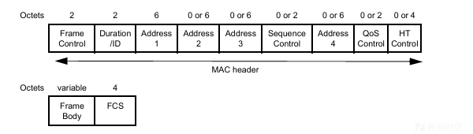

**每个MAC帧都包含以下几部分：**

1. **一个MAC帧头**
2. **一个可变长度的帧体，包含特定于帧类型或子类型的信息**
3. **一个帧校验序列，简写为FCS，包含一个32bit的CRC**

**主要来看一下帧控制字段**

* **Protocol Version：帧使用的MAC版本，目前仅支持一个版本，编号为0。**
* **Type/Subtype：标识帧类型，包括数据帧、控制帧和管理帧。**

**数据帧：负责传输数据报文，包括一种帧主体部分为空的特殊报文（Null帧）。STA可以通过Null帧通知AP自身省电状态的改变。**

**控制帧：协助数据帧的传输，负责无线信道的清空、信道的获取等，还用于接收数据时的确认。常用的控制帧有：**

* **ACK：接收端接收报文后，需要回应ACK帧向发送端确认接收到了此报文。**
* **请求发送RTS（Request To Send）/允许发送CTS（Clear To Send）：提供一种用来减少由隐藏节点问题所造成冲突的机制。发送端向接收端发送数据之前先发送RTS帧，接收端收到后回应CTS帧。通过这种机制来清空无线信道，使发送端获得发送数据的媒介控制权。**

**管理帧：负责对无线网络的管理，包括网络信息通告、加入或退出无线网络，射频管理等。常用的管理帧有：**

* **Beacon：信标帧，AP周期性地宣告无线网络的存在以及支持的各类无线参数（例如，SSID、支持的速率和认证类型等）。**
* **Association Request/Response：关联请求/应答帧，当STA试图加入到某个无线网络时，STA会向AP发送关联请求帧。AP收到关联请求帧后，会回复应答帧接受或拒绝STA的关联请求。**
* **Disassociation：去关联帧，STA可以发送Disassociation帧解除和AP的关联。**
* **Authentication Request/Response：认证请求/应答帧，STA和AP进行链路认证时使用，用于无线身份验证。**
* **Deauthentication：去认证帧，STA可以发送Deauthentication帧解除和AP的链路认证。**
* **Probe Request/Response：探测请求/应答帧，STA或AP都可以发送探测帧来探测周围存在的无线网络，接收到该报文的AP或STA需回应Probe Response，Probe Response帧中基本包含了Beacon帧的所有参数。**
* **To DS/From DS：标识帧是否来自和去往一个分布式系统（Distribution System，其实就是指AP）。例如都为1，表示AP到AP之间的帧。**
* **More Frag：表示是否有后续分片传送。**
* **Retry：表示帧是否重传，用来协助接收端排除重复帧。**
* **Pwr Mgmt：表示STA发送完成当前帧序列后将要进入的模式，Active或Sleep。**
* **More Data：表示AP向省电状态的STA传送缓存报文。**
* **Protected Frame：表示当前帧是否已经被加密。**
* **+HTC：为控制帧提供额外的信息支持**

**详尽在第九章节**[IEEE Xplore Full-Text PDF](https://ieeexplore.ieee.org/stamp/stamp.jsp?tp=&arnumber=9363693)

**关于地址Address** ***n*****字段：表示MAC地址。4个Address位填法不固定，需要和Frame Control字段中的To DS/From DS位结合来确定。例如，帧从一个STA发往AP，与从AP发往STA，4个Address字段的填法是不一样的。**

**Address n字段填写规则**

|  |  |  |  |  |  |  |
| --- | --- | --- | --- | --- | --- | --- |
| **To DS** | **From DS** | **Address 1** | **Address 2** | **Address 3** | **Address 4** | **说明** |
| 0 | 0 | 目的地址 | 源地址 | BSSID | 未使用 | 管理帧与控制帧。例如，AP发送的Beacon帧。 |
| 0 | 1 | 目的地址 | BSSID | 源地址 | 未使用 | 如图中的AP1向STA1发送的帧。 |
| 1 | 0 | BSSID | 源地址 | 目的地址 | 未使用 | 如图中的STA2向AP1发送的帧。 |
| 1 | 1 | 目的AP的BSSID | 源AP的BSSID | 目的地址 | 源地址 | 如图中的AP1向AP2发送的帧。 |

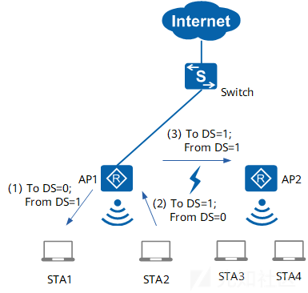

#### 小结

**到这里我们就可以有个大概的思路了，如果我们想要知道当前环境下有哪些AP的话，就要捕捉到Beacon帧，因为这个帧是AP用于广播其存在和网络信息的方式。而断开就通过发送Deauthentication帧来中断STA和AP的连接。**

**这里会存在一个疑问，如何去获得STA的MAC地址呢？我是通过捕获AP发送的Beacon帧的目的地址来获取的，也就是add1。因为AP的Beacon帧是广播的，所以目的地址也会存在"ff:ff:ff:ff:ff:ff"，过滤掉就行了。**

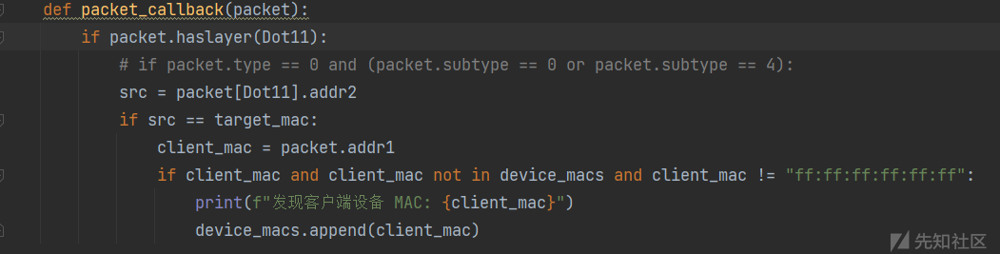

**现在我们怎么抓包，抓什么包，发送什么都搞清楚了，那破解关键抓的包是什么呢**

### WLAN中的身份认证和访问控制机制

**我想既然有密码这里肯定是跟无限网络中的认证有关的，查阅一番后发现了802.1X**

#### 802.1X认证

##### 802.1X简介

**802.1X认证系统使用可扩展认证协议EAP（Extensible Authentication Protocol）来实现客户端、设备端和认证服务器之间的信息交互。EAP协议可以运行在各种底层，包括数据链路层和上层协议（如UDP、TCP等），而不需要IP地址。因此使用EAP协议的802.1X认证具有良好的灵活性。**

* **在客户端与设备端之间，EAP协议报文使用EAPoL（EAP over LANs）封装格式，直接承载于LAN环境中。**
* **在设备端与认证服务器之间，用户可以根据客户端支持情况和网络安全要求来决定采用的认证方式。**

* **EAP终结(解析和处理)方式中，EAP报文在设备端终结并重新封装到RADIUS报文中，利用标准RADIUS协议完成认证、授权和计费。**
* **EAP中继方式中，EAP报文被直接封装到RADIUS报文中（EAP over RADIUS，简称为EAPoR），以便穿越复杂的网络到达认证服务器。**

##### 认证过程

**EAP数据首先被封装在EAPOL帧中，传输于申请者（Supplicant）和验证者（Authenticator）之间。随后又封装在RADIUS或Diameter，传输于验证者和验证服务器（Authentication server）之间。**

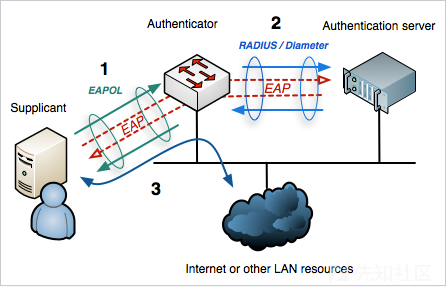

#### 安全策略

**到这里要提一下WLAN的安全策略**

**WLAN安全提供了WEP、WPA、WPA2和WAPI四种安全策略机制。每种安全策略体现了一整套安全机制，包括无线链路建立时的链路认证方式，无线用户上线时的用户接入认证方式和无线用户传输数据业务时的数据加密方式。**

**现在常用的机制就是WPA/WPA2，在手机中就可以看到**

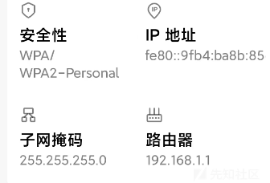

##### WPA/WPA2简介

**由于WEP共享密钥认证采用的是基于RC4对称流的加密算法，需要预先配置相同的静态密钥，无论从加密机制还是从加密算法本身，都很容易受到安全威胁。为了解决这个问题，在802.11i标准没有正式推出安全性更高的安全策略之前，Wi-Fi联盟推出了针对WEP改良的WPA。WPA的核心加密算法还是采用RC4，在WEP基础上提出了临时密钥完整性协议TKIP（Temporal Key Integrity Protocol）加密算法，采用了802.1X的身份验证框架，支持EAP-PEAP、EAP-TLS等认证方式。随后802.11i安全标准组织又推出WPA2，区别于WPA，WPA2采用安全性更高的区块密码锁链-信息真实性检查码协议CCMP（Counter Mode with CBC-MAC Protocol）加密算法。**

**为了实现更好的兼容性，在目前的实现中，WPA和WPA2都可以使用802.1X的接入认证、TKIP或CCMP的加密算法，他们之间的不同主要表现在协议报文格式上，在安全性上几乎没有差别。**

##### 密钥协商

**在802.11i里定义了两种密钥层次模型，一种是成对密钥层次结构，主要用来保护STA与AP之间往来的数据；一种是群组密钥层次结构，主要用来描述STA与AP之间的广播或组播数据。**

**密钥协商阶段是根据接入认证生成的成对主钥PMK（Pairwise Master Key）产生成对临时密钥PTK（Pairwise Transient Key）和群组临时密钥GTK（Group Temporal Key）。PTK用来加密单播报文，GTK用来加密组播和广播无线报文。**

* **针对802.1X接入认证，生成PMK的流程图如图所示。**

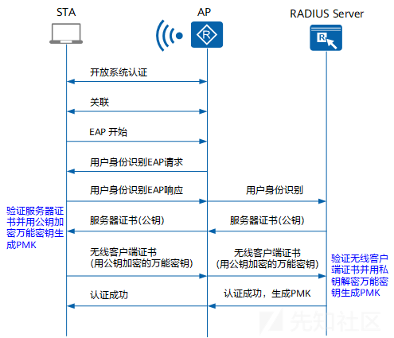

* **针对PSK认证，根据设置预共享密钥的方式不同（通过命令行可以选择设置预共享密钥的方式），生成的PMK方式也不同：**

* **如果设置的预共享密钥是十六进制，则预共享密钥即是PMK；**
* **如果设置的预共享密钥是字符串，则PMK是利用预共享密钥和SSID通过哈希算法计算出来的。**

**密钥协商包括单播密钥协商和组播密钥协商过程。**

###### 单播密钥协商过程

**密钥协商过程也叫做四次握手过程，是通过EAPOL-Key报文进行信息交互的，如图所示。**

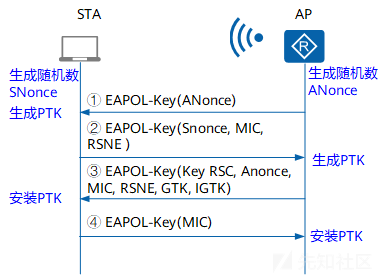

###### 组播密钥协商过程

**组播密钥协商过程也叫做二次握手过程，此过程是在四次握手产生PTK并安装密钥后开始进行的，如图所示**

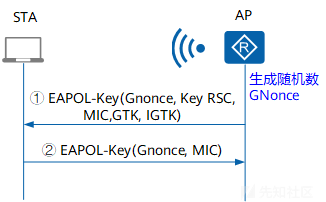

#### 小结

**通过对WLAN中的身份认证和访问控制机制了解之后，我们就可以知道加密的数据是封装在EAPOL数据包中的，也就是我们要抓取断开重连之后的四次握手数据包(EAPOL)**

**在工具抓取的数据包中也可以看到**

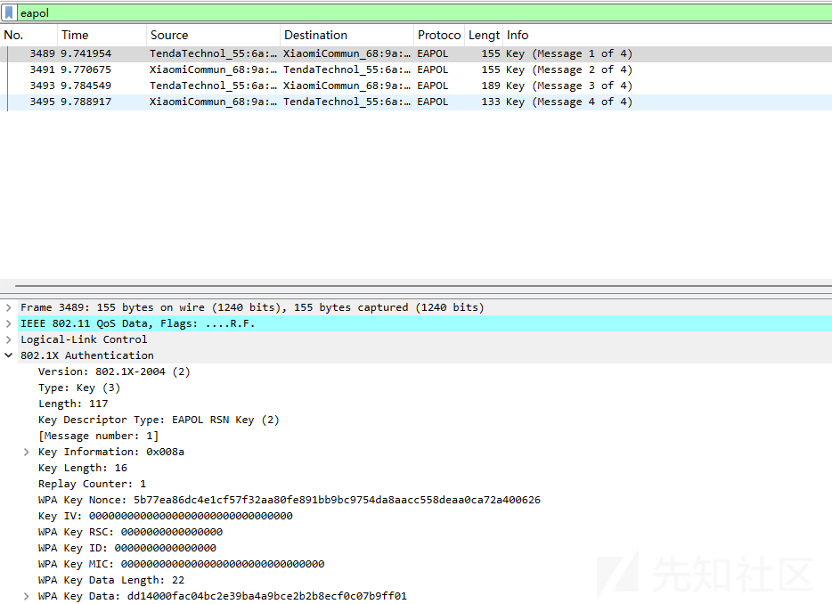

## 得到密码过程

**要想知道密码的关键就在于这个四次握手包中，那这四次握手到底发生了什么呢？**

**在了解四次握手之前先了解一些术语**

### 术语

**PMK (Pairwise Master Key)**

**PMK 是由 MSK 生成，WPA2/PSK 的情况下，当 supplicant 和 authenticator 身份验证后，PSK 变成 PMK。PMK 会驻留在 AP 和所有 STA，不需要进行 key 交换，用它来生成用于加密单播数据的PTK。**

**PMK=HMAC−SHA1(ssid,psk)**

**PSK****由ssid和passphrase生成，知道AP名和密码就能得出PSK**

**GMK (Group Master Key)**

**GMK 用在四次握手来生成 GTK，GTK 在 AP 端由 MSK 生成，所有连接到该 AP 的 STA 共享。**

**PTK (Pairwise Transit Key)**

**PTK 用来加密 AP 和 Station 通讯的单播数据包，AP 与每个 Station 通讯用的 PTK 都是唯一的。我们来看一下生成 PTK 的函数，参数是生成 PTK 需要的信息：**

**PTK = PRF(PMK + ANonce + SNonce + Mac(AP) + Mac(SA))**

**PRF是 pseudo-random function 的缩写，表示伪随机函数，PMK、ANonce、SNonce、Mac(AA) 和Mac(SA) 作为它的输入参数；**

**ANonce****是 AP 生成的随机数，A 表示 authenticator；**

**SNonce****是 STA生成的随机数，S 表示 supplicant；**

**Mac(AP)****是 AP 的 Mac 地址；**

**Mac(SA)****是 STA 的 Mac 地址；**

**由此可知，生成 PTK 依赖 PMK。**

**PTK 由多个密钥组成**

* **KCK – 在创建 MIC 期间使用，哈希将使用 KCK 生成。**
* **KEK – 用于加密密钥 [例如：GTK 将使用 KEK 在 M3 中加密以交付给客户端]。**
* **TK – 单播数据包的加密和解密。**
* **MIC Tx — 仅用于接入点发送的单播数据包的 TKIP 配置。**
* **MIC Rx （MIC 接收） – 仅用于客户端发送的单播数据包的 TKIP 配置。**

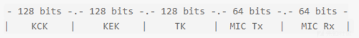

**GTK (Group Temporal Key)**

**GTK 用来加密 AP 和 STA 通讯的多播/广播数据包，连接该 AP 的所有 STA 共享一个 GTK。生成 GTK 的公式：**

**GTK = PRF(GMK + ANonce + Mac(AA))**

**与 PTK 不同的是没有 SNonce 和 Mac(SA)，GTK 也依赖 GMK。**

**MIC(Message Integrity Check)**

**消息完整性校验，针对一组需要保护的数据计算出的散列值，用来防止数据遭篡改。**

**KCK (Key Confirmation Key):**

**PTK 的一部分，用于计算 MIC 验证消息的完整性。**

**RSN Information****：**

**包含有关密码套件 （加密算法） 和使用的身份验证方法的信息。**

### WPA 和 WPA2 4 次握手

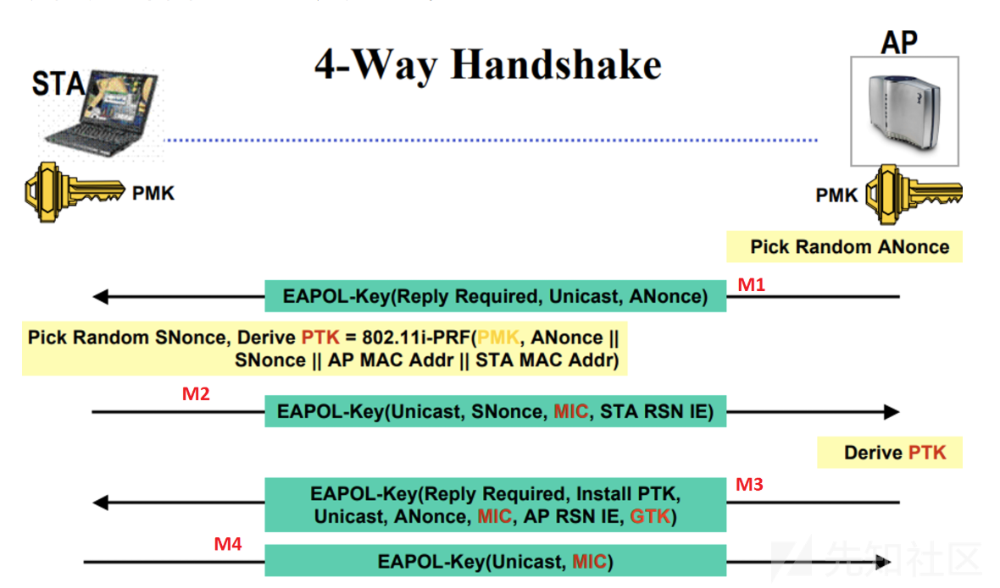

1. **AP发送EAPOL-Key帧给STA，帧中包含随机数ANonce。**
2. **STA根据STA与AP的MAC地址、PMK、ANonce和SNonce计算出PTK，STA发送EAPOL-Key帧给AP，帧中包含SNonce、RSN信息元素和EAPOL-Key帧的消息完整码MIC（Message Integrity Code）。AP根据PMK、ANonce、SNonce、AP的MAC地址、STA的MAC地址计算出PTK，并校验MIC，核实STA的PMK是否和自己的一致。**
3. **AP发送EAPOL-Key帧给STA，并通知STA安装密钥，帧中包含Anonce、RSN信息元素、帧MIC、加密过的GTK。**
4. **STA发送EAPOL-Key帧给AP，并通知AP已经安装并准备开始使用加密密钥。AP收到后安装加密密钥。**

**根据握手包详细分析一下**

#### 第一次握手

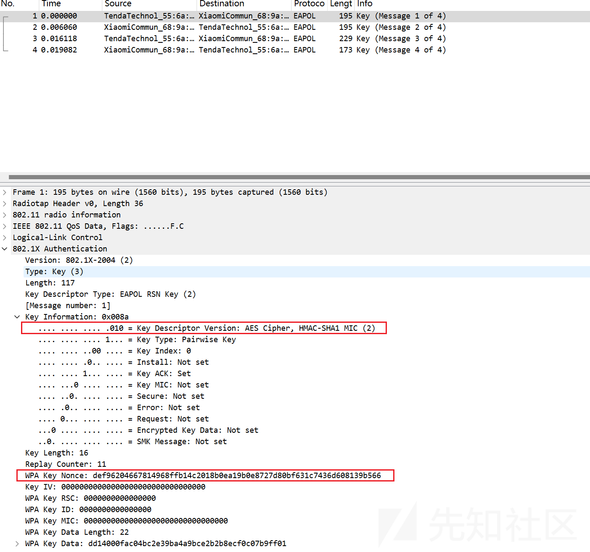

**AP 会发送 Nonce，称之为 ANonce。4 次握手使用 HMAC-SHA1 过程生成 MIC。**

**关于Nonce：****Nonce****（Number once）是一个随机数或伪随机数，通常用于一次性用途，确保安全通信中的某些操作不会被重放攻击利用。它的基本特性是** **唯一性****，即每次通信中使用的 Nonce 都是不同的。**

#### 第二次握手

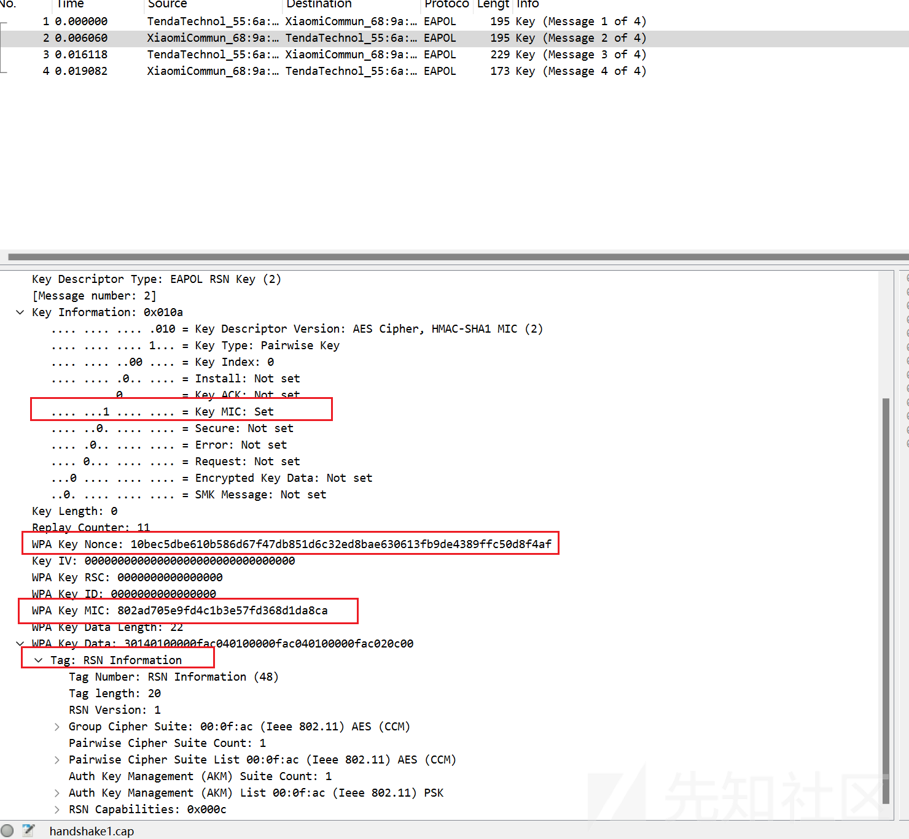

**在STA收到AP发来的第一个帧之后，STA就拥有了计算PTK的所有数据：**

* **SNonce**
* **ANonce**
* **PMK**
* **APMac**
* **SAMAC**

**从术语介绍中可知PMK是由ssid和密码计算出来的**

**此时STA会计算出PTK，然后截取其中的KCK去计算MIC**

**最终STA会发送SNonce、MIC、RSN到AP也就是第二个帧**

#### 第三次握手

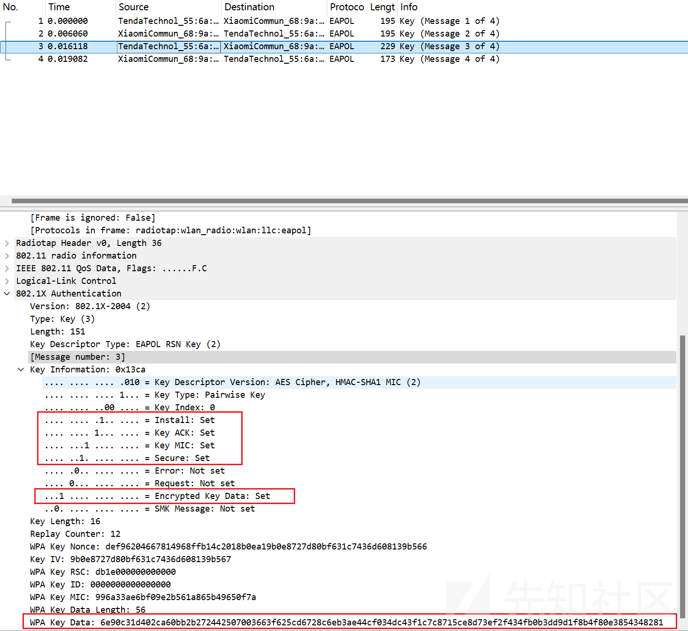

**在AP接收到STA发来的第二帧时，AP会计算PTK然后生成KCK，计算出MIC。然后将计算出来的MIC和收到的MIC进行对比，如果相同就证明AP和STA拥有相同的PMK，也就是密码是对的。****如果密码是错的，那么就只会有前两个包，后续的包不会出现**

**Key information:**

* **Install:此位向客户端发出信号以安装其派生的密钥。**
* **Key ACK: 客户端必须确认此帧。**
* **Key MIC: 存在完整性检查**
* **Secure: 此位表示初始密钥交换现已完成，并向客户端发出信号，从现在开始，连接应从不安全切换到安全。**
* **Encrypted Key Data: GTK 包含在此帧中**

**AP检查message2没问题后，会发送Anonce、RSN信息元素、MIC、加密过的GTK也就是第三个帧通知STA安装密钥**

#### 第四次握手

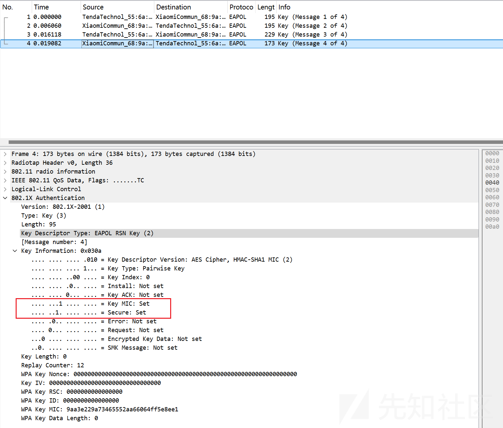

**STA接收到第三个包的时候会进行验证MIC等字段如果没问题，就会安装密钥，然后向AP发送确认也就是第四个帧。**

**之后AP接收到确认报文后安装安装加密密钥**

### 小结

**通过上面的分析，我们可以知道，在第二次握手时(STA->AP)的包中的MIC值的计算过程，以及AP对接到的第二次握手包中的MIC值的校验过程，均利用到了密码。所以我们想要得到密码，就应该在第二次和第三次握手时。**

**可以发现关键就在这个MIC的计算，总结一下MIC的计算过程：**

**计算PMK(calc\_pmk(passphrase, ssid))->计算PTK(calc\_ptk(pmk, ptk\_salt))->得到KCK(ptk[:16])->计算MIC**

## 项目的编写

### 抓包过程

**这个地方没什么说的，就是按照前面分析的逻辑，用scapy这个写出来就行。并且还加了个众生平等操作，控制一下发送断开帧的包数量以及速度，做到区域内无法上网。**

### 爆破部分

**其他信息都可以在包中直接得到，变量其实就是passphrase也就是密码，以这个为变量爆破mic，当mic匹配上了,密码也就对了。所以要是弱口令或者信息收集些信息，否则直接爆破还是不容易爆出来的。学长用ewsa gpu拉满用掩码爆破，一位大写字母加手机号都要20分钟，最后没爆破出来才发现少加一位掩码(: 这还是由果导因。**

**所以就会想到个问题，爆半天发现爆破用的包不是正确密码的握手包，那就悲剧了。解决这个问题是通过前面学习了解到的，如果密码是错误的情况下，就不会有第三次、第四次握手。所以计算第三次握手包中的mic就可以了，这样就保证这四次握手是成功的握手。**

**具体的算法在802.11的官方文档中都有，刚开始我更多参考了**[aircrack-ng-crypto.c](https://github.com/aircrack-ng/aircrack-ng/blob/master/lib/crypto/crypto.c)**的算法，然后写出了第一版。感觉自己写的没什么问题，但是就是最后算出来的mic就是不对。这时候学长直接：我来助你！**

**一起研究了一下，最终还是整出来了。**

### 项目地址

[Nbccccc/WAP-WPA2-Handshake-Crack: 基于WPA/WPA2握手原理的Wi-Fi密码爆破](https://github.com/Nbccccc/WAP-WPA2-Handshake-Crack)

**感兴趣的师傅可以玩玩**

## WAP3

**从上面我们也可以知道，WAP2是不安全的所以Wi-Fi联盟组织于2018年发布的第三代Wi-Fi加密协议——WPA3。**

**这里就引入一下，关于本篇文章的危害改变之处：**

**WPA3个人版使采用了更加安全的SAE（Simultaneous Authentication of Equals，对等实体同时验证）取代了WPA2个人版采用预先设置共享密钥的PSK认证方式。**

**WPA2采用的PSK认证方式通过四次握手进行密钥协商，在协商过程前首先根据SSID和预共享密钥生成PMK，此时由于SSID和预共享密钥都是固定的，PMK也就成了固定的且可计算的，导致每次重装的密钥都是相同的。WPA3所采用的SAE协议在原有的PSK四次握手前增加了SAE握手，在PMK生成过程中引入了动态随机变量，使得每次协商的PMK都是不同的，也就保证了密钥的随机性。因此，SAE为WPA3带来的更加安全的密钥验证机制解决了WPA2所暴露的安全风险：**

* **防止离线字典或暴力破解攻击：首先SAE对于多次尝试连接设备的终端，会直接拒绝服务，断绝了采用穷举或者逐一尝试密码的行为。其次，SAE还提供了前向保密功能，即使攻击者通过某种方式获取了密码，由于每次建立连接时密钥都是随机的，攻击者尝试再次重新建立连接时密钥已经更换了，就不能破解获取到的数据流量。**

**SAE使得个人或家庭用户可以自由设置更加容易记住的Wi-Fi密码，即使不够复杂也能提供同样的安全防护。**

## 结尾

**这篇文章写也有半个月了，一回到家零零散散的其他事情就变多了。**

**褪去昔日旧模样，今日方知我是我！新的一年有新的状态，越来越好！祝各位师傅也是如此，越来越好。**

**感谢我的学长楠哥**[ZIKH26](https://zikh26.github.io/)**在很多方面帮了我很多很多**

**以下省略，加上上面是自己写给自己的年终总结...**

## 参考文章

[IEEE Xplore Full-Text PDF](https://ieeexplore.ieee.org/stamp/stamp.jsp?tp=&arnumber=9363693)

[802.11协议标准介绍 - AR100-S, AR110-S, AR120-S, AR150-S, AR160-S, AR200-S, AR1200-S, AR2200-S, AR3200-S V200R010 配置指南-WLAN FAT AP（命令行） - 华为](https://support.huawei.com/enterprise/zh/doc/EDOC1100033976/35825214)

[802.11协议详解：从基础到最新进展-CSDN博客](https://blog.csdn.net/twozh123/article/details/122247337)

[IEEE 802.1X - 维基百科，自由的百科全书](https://zh.wikipedia.org/wiki/IEEE_802.1X#cite_note-1)

[How to Disconnect Devices from Wi-Fi using Scapy in Python? - GeeksforGeeks](https://www.geeksforgeeks.org/how-to-disconnect-devices-from-wi-fi-using-scapy-in-python/)

[4 次握手、密钥生成和 MIC 验证 - WPA2 – Praneeth's Blog](https://praneethwifi.in/2019/11/09/4-way-hand-shake-keys-generation-and-mic-verification/)

[WPA and WPA2 4-Way Handshake](https://networklessons.com/cisco/ccnp-encor-350-401/wpa-and-wpa2-4-way-handshake)

[WPA/WPA2 4-way handshake - X's blog](https://chujian521.github.io/blog/2018/11/18/WPA-WPA2-4-way-handshake/)

[4-Way Hand shake , Keys generation and MIC Verification-WPA2 – Praneeth's Blog](https://praneethwifi.in/2019/11/09/4-way-hand-shake-keys-generation-and-mic-verification/)

[Calculate PMK, PTK, MIC and MIC verification in WPA2-PSK authentication](https://gist.github.com/c4mx/0f8eacea356ca01fc8315483ba348b23)

[Wifi 认证，关联，四次握手（WPA/WPA2/WPA3-SAE）\_android wifi 四次握手-CSDN博客](https://blog.csdn.net/weixin_43415201/article/details/124432621)

[关于无线网络WPA2的四次握手及中间人攻击 - FreeBuf网络安全行业门户](https://www.freebuf.com/articles/others-articles/307276.html)

[Calculate PTK with Python of WPA - Stack Overflow](https://stackoverflow.com/questions/78220476/calculate-ptk-with-python-of-wpa/79374433#79374433)

[How to use Aircrack-ng | Aircrack-ng tutorial](https://techofide.com/blogs/how-to-use-aircrack-ng-aircrack-ng-tutorial-practical-demonstration/)

[什么是WPA3？WPA3 vs WPA2 - 华为](https://info.support.huawei.com/info-finder/encyclopedia/zh/WPA3.html)
