# 某luo数据包加密逆向分析-先知社区

> **来源**: https://xz.aliyun.com/news/16714  
> **文章ID**: 16714

---

本文仅用于技术交流

## 准备

app: 5ZOI5ZWwdjYuNzQuMQ==  
设备：cGl4ZWwyIGFuZHJvaWQxMA==

​

## 正文

抓包发现，大部分请求包和返回包都加密了  
例如下面的

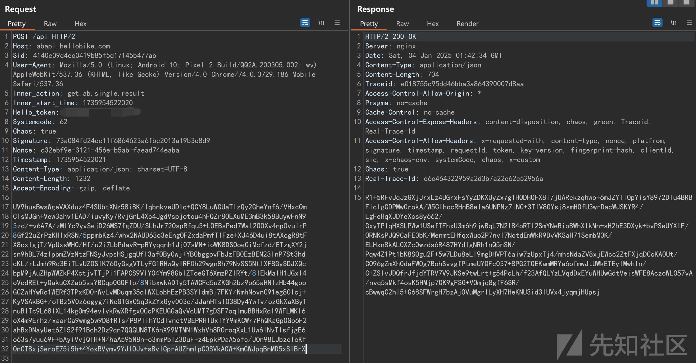

对于这种，先尝试一手算法自吐脚本 hook一下

但是发现做了frida检测

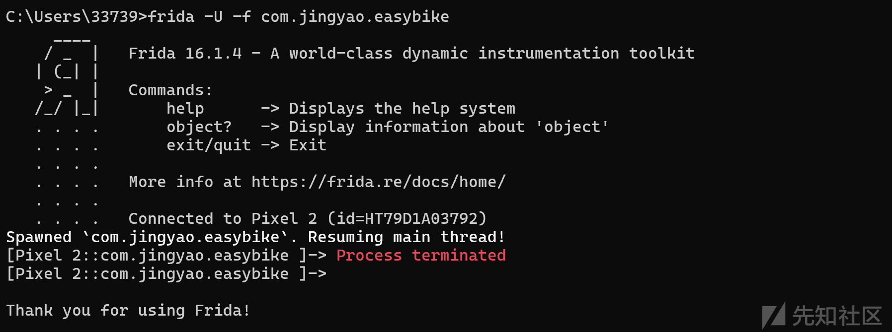

### 绕过检测

下面尝试两种方法绕过  
第一种是使用修改过特征的frida-server   
这里使用的是florida-server  
<https://github.com/Ylarod/Florida>

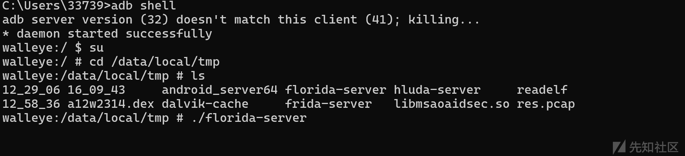  
hook后发现没有被杀死  
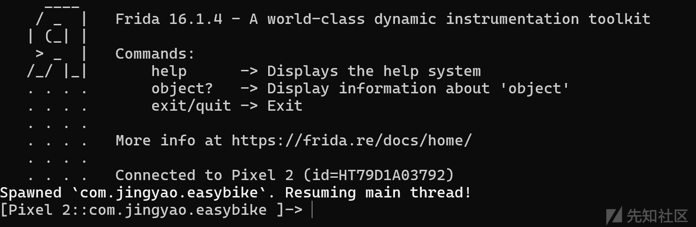

还有一种是找到用于检测的库，在它检测之前nop掉检测函数或者是直接删了这个so库  
详细分析：<https://xz.aliyun.com/t/16185?time__1311=GuD=7IqjOx/D78G7DyjzqoiI++4fO7bD>

脚本

```
function hook_dlopen() {
    Interceptor.attach(Module.findExportByName(null, "android_dlopen_ext"),
        {
            onEnter: function (args) {
                this.fileName = args[0].readCString()
                console.log(`dlopen onEnter: ${this.fileName}`)
            }, onLeave: function (retval) {
                console.log(`dlopen onLeave fileName: ${this.fileName}`)
                if (this.fileName != null && this.fileName.indexOf("libmsaoaidsec.so") >= 0) {
                    let JNI_OnLoad = Module.getExportByName(this.fileName, 'JNI_OnLoad')
                    console.log(`dlopen onLeave JNI_OnLoad: ${JNI_OnLoad}`)
                }
            }
        }
    );
}
```

运行后发现在进入了libmsaoaidsec库后发生进程终止，说明这个库里存在检测机制

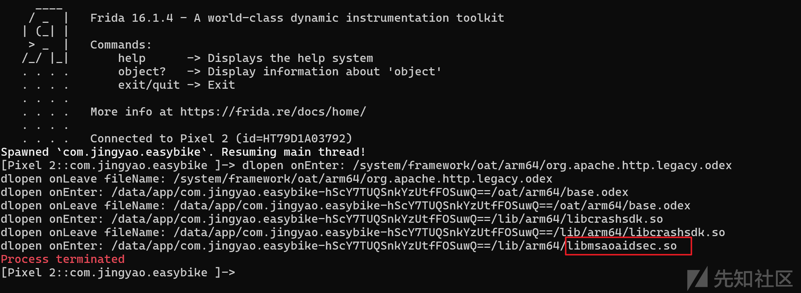

进入这个app文件夹里删了这个库

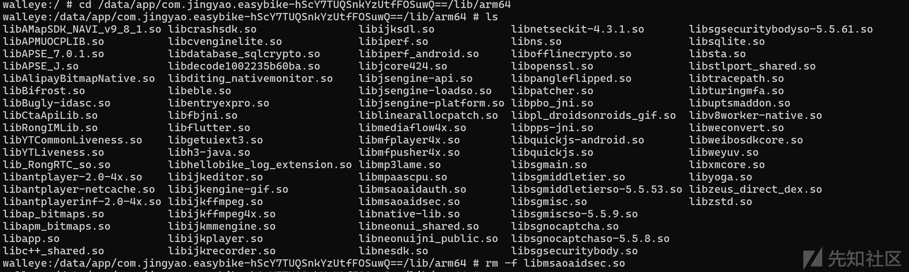  
删除了，再启动frida-server就不会被杀掉了

接着使用自吐脚本来hook一下

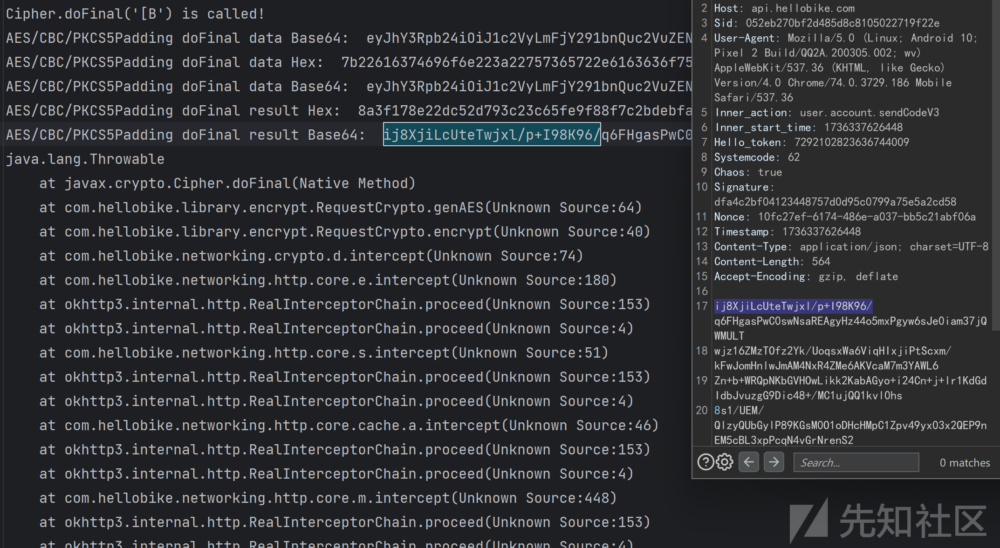

hook一下方法来看看  
代码如下：

```
function hook_encrypt(){
    Java.perform(
        function () {
            var requestCryptoClass = Java.use("com.hellobike.library.encrypt.RequestCrypto");
            requestCryptoClass.encrypt.implementation = function (a) {
                console.log("a==============> ", a);
                var result = this.encrypt(a);
                console.log("result=========> ", result);
                return result;
            }
        }
    )
}
```

对比发现位置找对了  
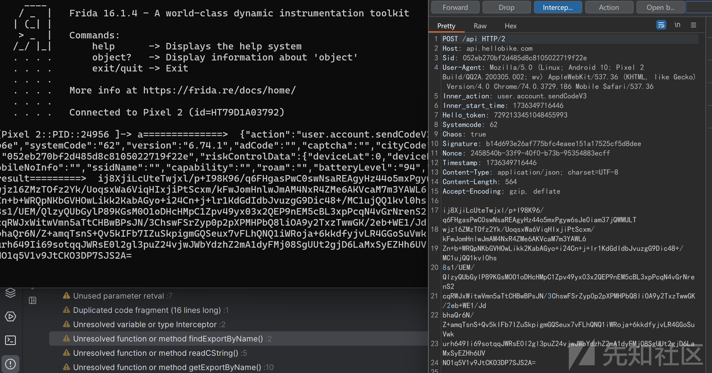

jadx反编译源码搜索encrypt函数，  
这里对genEAS函数的返回结果进行了base64编码，传入的参数src是encrypt接收的字符串，另一个也是字符串  
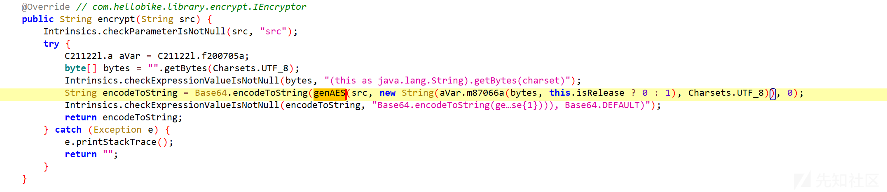  
查看一下genEAS函数

去掉空值检查和异常处理其实就是用AES算法对输入字符串数据基于给定密钥进行加密并返回加密后的字节数组

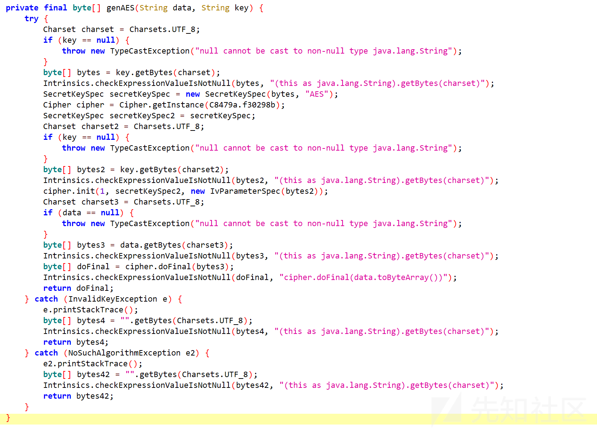  
可以跟最基本的javax.crypto包提供的 AES 加密功能实现代码如下：

```
// 将密钥转换为字节数组，使用AES算法创建SecretKeySpec对象
byte[] keyBytes = key.getBytes(StandardCharsets.UTF_8);
SecretKeySpec secretKeySpec = new SecretKeySpec(keyBytes, "AES");
// 获取Cipher实例，使用默认的加密模式和填充方式（如ECB/PKCS5Padding等，实际应用推荐更安全模式）
Cipher cipher = Cipher.getInstance("AES/CBC/PKCS5Padding");
cipher.init(Cipher.ENCRYPT_MODE, secretKeySpec);
// 将待加密数据转换为字节数组并进行加密，返回加密后的字节数组
byte[] dataBytes = data.getBytes(StandardCharsets.UTF_8);

```

可以看到genAES函数中填充方式为C8479a.f30298b，键入进去看一下，可以看到这个值为"AES/CBC/PKCS5Padding"

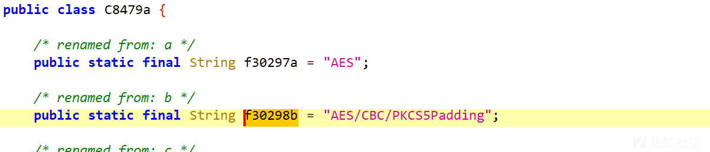

钩住genEAS来看看参数和返回值

```
function hook_genAES(){
    Java.perform(
        function (){
            var requestCryptoClass = Java.use("com.hellobike.library.encrypt.RequestCrypto");
            requestCryptoClass.genAES.implementation = function (data, key) {
                console.log("data==============> ", data);
                console.log("key==============> ", key);
                var result = this.genAES(data, key);
                console.log("result=========> ", result);
                return result;
            }
        }
    )
}
```

data就是加密前的数据，key好像是固定的

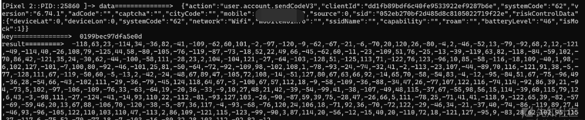

不过还是得来看看key的生成  
回到encrypt函数中，找到函数m87066a

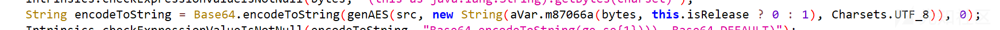

进入

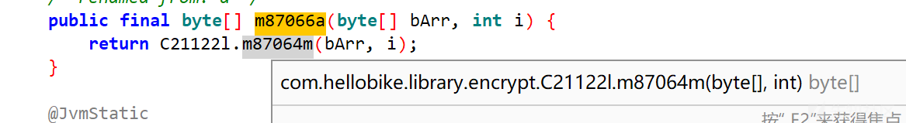

发现m87064m是jni函数

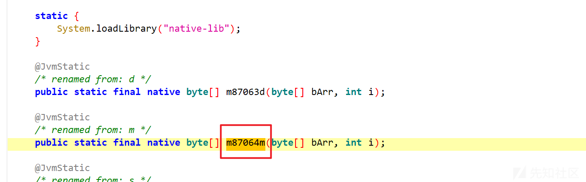

ida反编译native-lib库  
导出的函数太多，搜索一手l\_m,发现这个m确实是静态注册的

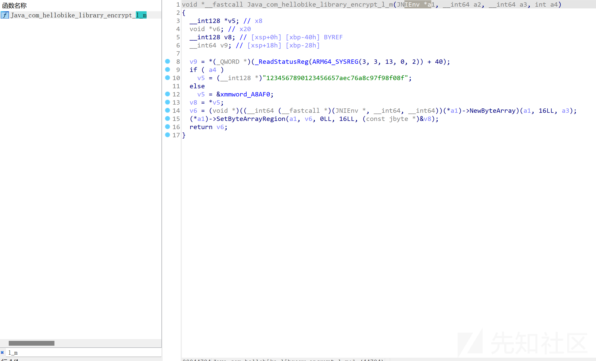

手动修改一下参数名  
可以看到i为1时，返回值为"1234567890123456657aec76a8c97f98f08f"，为0时则将xmmword\_A8AF0指向的内容处理成字符串  
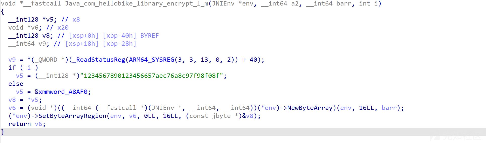

查看xmmword\_A8AF0指向的内容

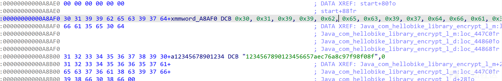  
转换一下，0199bec97dfa5e0d就是上面的key值  
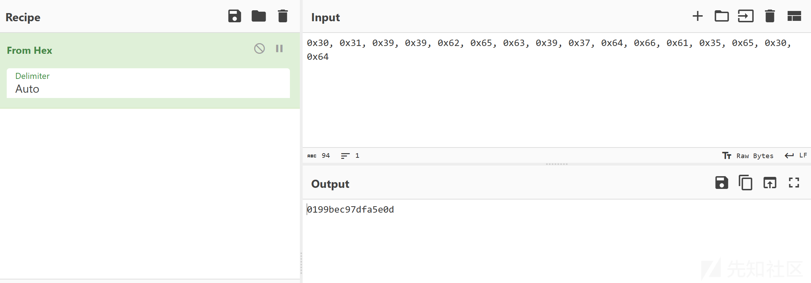

总结一下，这个加密逻辑很简单，只是aes加密，填充方式为AES/CBC/PKCS5Padding。key是根据传入参数i来决定的，生成key的函数在native层，逻辑也很直接。
