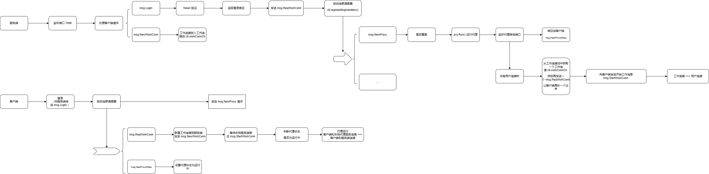
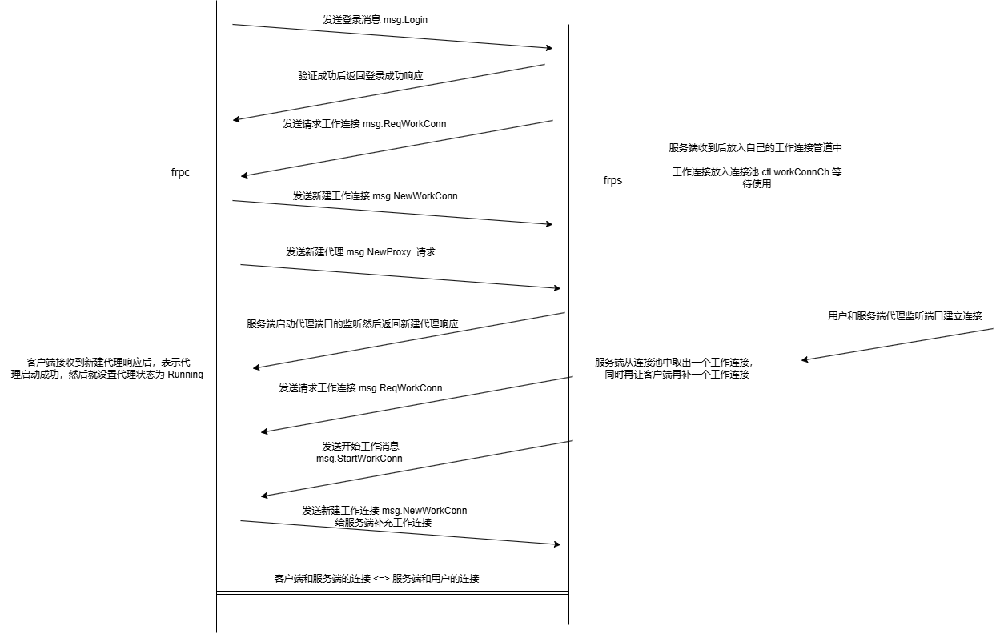
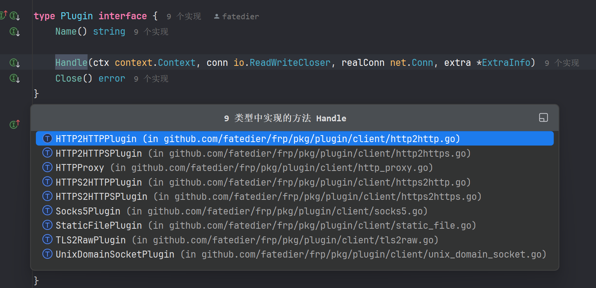
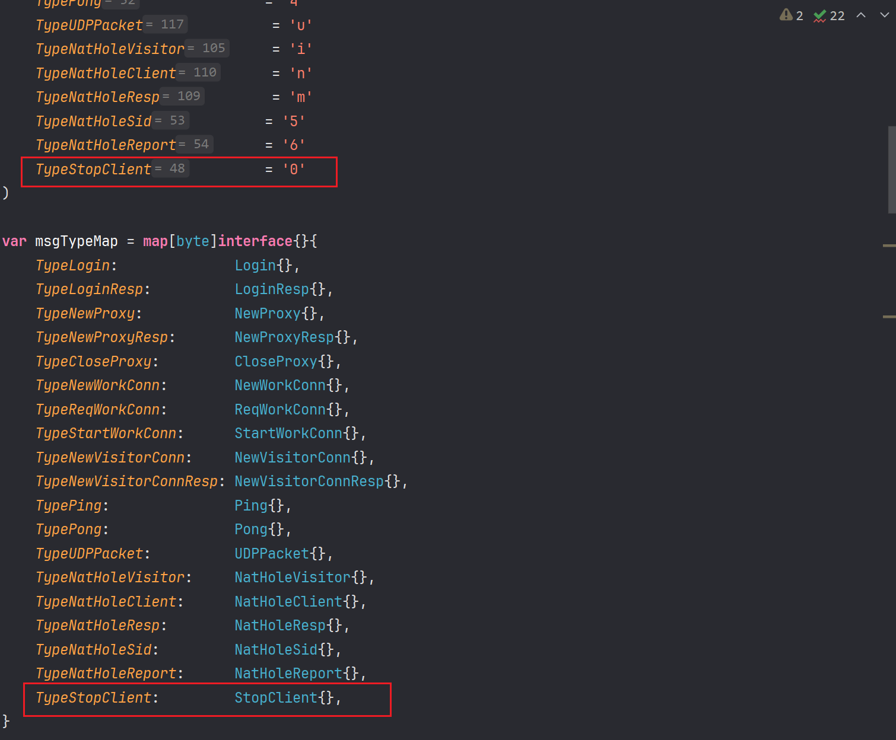

# frp 源码学习-先知社区

> **来源**: https://xz.aliyun.com/news/16719  
> **文章ID**: 16719

---

# frp

项目地址：<https://github.com/fatedier/frp>

使用文档：<https://gofrp.org>

目前版本：0.61

frp 是一个专注于内网穿透的高性能的反向代理应用，支持 TCP、UDP、HTTP、HTTPS 等多种协议，且支持 P2P 通信。可以将内网服务以安全、便捷的方式通过具有公网 IP 节点的中转暴露到公网。

## 简要流程

​



## 客户端

### 初始化部分

```
func runClient(cfgFilePath string) error {
    // 加载配置文件
    cfg, proxyCfgs, visitorCfgs, isLegacyFormat, err := config.LoadClientConfig(cfgFilePath, strictConfigMode)
    if err != nil {
        return err
    }
    if isLegacyFormat {
        fmt.Printf("WARNING: ini format is deprecated and the support will be removed in the future, " +
            "please use yaml/json/toml format instead!
")
    }
    // 验证
    warning, err := validation.ValidateAllClientConfig(cfg, proxyCfgs, visitorCfgs)
    if warning != nil {
        fmt.Printf("WARNING: %v
", warning)
    }
    if err != nil {
        return err
    }
    // 开启服务
    return startService(cfg, proxyCfgs, visitorCfgs, cfgFilePath)
}
```

```
func startService(
    cfg *v1.ClientCommonConfig,
    proxyCfgs []v1.ProxyConfigurer,
    visitorCfgs []v1.VisitorConfigurer,
    cfgFile string,
) error {
    log.InitLogger(cfg.Log.To, cfg.Log.Level, int(cfg.Log.MaxDays), cfg.Log.DisablePrintColor)

    if cfgFile != "" {
        log.Infof("start frpc service for config file [%s]", cfgFile)
        defer log.Infof("frpc service for config file [%s] stopped", cfgFile)
    }
    // 客户端服务
    svr, err := client.NewService(client.ServiceOptions{
        Common:         cfg,
        ProxyCfgs:      proxyCfgs,
        VisitorCfgs:    visitorCfgs,
        ConfigFilePath: cfgFile,
    })
    if err != nil {
        return err
    }
    // 优雅关闭
    shouldGracefulClose := cfg.Transport.Protocol == "kcp" || cfg.Transport.Protocol == "quic"
    // Capture the exit signal if we use kcp or quic.
    if shouldGracefulClose {
        go handleTermSignal(svr)
    }
    // 运行服务
    return svr.Run(context.Background())
}

// 优雅关闭
func handleTermSignal(svr *client.Service) {
    ch := make(chan os.Signal, 1)
    signal.Notify(ch, syscall.SIGINT, syscall.SIGTERM)
    <-ch
    svr.GracefulClose(500 * time.Millisecond)
}

func (svr *Service) GracefulClose(d time.Duration) {
    svr.gracefulShutdownDuration = d
    svr.cancel(nil)
}
```

新建服务这里还有一些参数的配置：

```
func NewService(options ServiceOptions) (*Service, error) {
    // 设置默认参数
    setServiceOptionsDefault(&options)

    var webServer *httppkg.Server
    if options.Common.WebServer.Port > 0 {
        ws, err := httppkg.NewServer(options.Common.WebServer)
        if err != nil {
            return nil, err
        }
        webServer = ws
    }
    s := &Service{
        ctx:              context.Background(),
        // 认证
        authSetter:       auth.NewAuthSetter(options.Common.Auth),
        webServer:        webServer,
        common:           options.Common,
        configFilePath:   options.ConfigFilePath,
        proxyCfgs:        options.ProxyCfgs,
        // 普通的 TCP 不需要
        visitorCfgs:      options.VisitorCfgs,
        clientSpec:       options.ClientSpec,
        connectorCreator: options.ConnectorCreator,
        handleWorkConnCb: options.HandleWorkConnCb,
    }
    if webServer != nil {
        webServer.RouteRegister(s.registerRouteHandlers)
    }
    return s, nil
}


func setServiceOptionsDefault(options *ServiceOptions) {
    if options.Common != nil {
        options.Common.Complete()
    }
    if options.ConnectorCreator == nil {
        options.ConnectorCreator = NewConnector
    }
}


func (c *ClientCommonConfig) Complete() {
    c.ServerAddr = util.EmptyOr(c.ServerAddr, "0.0.0.0")
    c.ServerPort = util.EmptyOr(c.ServerPort, 7000)
    // 默认首次登录失败退出
    c.LoginFailExit = util.EmptyOr(c.LoginFailExit, lo.ToPtr(true))
    c.NatHoleSTUNServer = util.EmptyOr(c.NatHoleSTUNServer, "stun.easyvoip.com:3478")

    c.Auth.Complete()
    c.Log.Complete()
    c.Transport.Complete()
    c.WebServer.Complete()

    c.UDPPacketSize = util.EmptyOr(c.UDPPacketSize, 1500)
}


func (c *ClientTransportConfig) Complete() {
    c.Protocol = util.EmptyOr(c.Protocol, "tcp")
    c.DialServerTimeout = util.EmptyOr(c.DialServerTimeout, 10)
    c.DialServerKeepAlive = util.EmptyOr(c.DialServerKeepAlive, 7200)
    c.ProxyURL = util.EmptyOr(c.ProxyURL, os.Getenv("http_proxy"))
    c.PoolCount = util.EmptyOr(c.PoolCount, 1)
    // 默认开启 TCP MUX 多路复用
    c.TCPMux = util.EmptyOr(c.TCPMux, lo.ToPtr(true))
    c.TCPMuxKeepaliveInterval = util.EmptyOr(c.TCPMuxKeepaliveInterval, 30)
    if lo.FromPtr(c.TCPMux) {
        // If TCPMux is enabled, heartbeat of application layer is unnecessary because we can rely on heartbeat in tcpmux.
        // 使用 TCP MUX 就关闭掉心跳检测, 使用 MUX 中的
        c.HeartbeatInterval = util.EmptyOr(c.HeartbeatInterval, -1)
        c.HeartbeatTimeout = util.EmptyOr(c.HeartbeatTimeout, -1)
    } else {
        c.HeartbeatInterval = util.EmptyOr(c.HeartbeatInterval, 30)
        c.HeartbeatTimeout = util.EmptyOr(c.HeartbeatTimeout, 90)
    }
    c.QUIC.Complete()
    c.TLS.Complete()
}

func (c *TLSClientConfig) Complete() {
    // 默认开启 TLS 
    c.Enable = util.EmptyOr(c.Enable, lo.ToPtr(true))
    // 默认禁用 TLS 自定义首字节 0x17 特征
    c.DisableCustomTLSFirstByte = util.EmptyOr(c.DisableCustomTLSFirstByte, lo.ToPtr(true))
}
```

服务启动：

```
func (svr *Service) Run(ctx context.Context) error {
    ctx, cancel := context.WithCancelCause(ctx)
    svr.ctx = xlog.NewContext(ctx, xlog.FromContextSafe(ctx))
    svr.cancel = cancel

    // set custom DNSServer
    if svr.common.DNSServer != "" {
        netpkg.SetDefaultDNSAddress(svr.common.DNSServer)
    }

    if svr.webServer != nil {
        go func() {
            log.Infof("admin server listen on %s", svr.webServer.Address())
            if err := svr.webServer.Run(); err != nil {
                log.Warnf("admin server exit with error: %v", err)
            }
        }()
    }

    // first login to frps
    // 首次登录 frps, 默认首次登录失败就退出
    // 1. 尝试登录
    // 2. 新建控制器
    // 3. 启动消息调度器（ 消息的发送、各种响应的处理 ）
    // 4. 向服务器注册代理
    svr.loopLoginUntilSuccess(10*time.Second, lo.FromPtr(svr.common.LoginFailExit))
    if svr.ctl == nil {
        cancelCause := cancelErr{}
        _ = errors.As(context.Cause(svr.ctx), &cancelCause)
        return fmt.Errorf("login to the server failed: %v. With loginFailExit enabled, no additional retries will be attempted", cancelCause.Err)
    }
    // 保持控制器工作
    // 上面的 loopLoginUntilSuccess 已经实现了 frpc 的正常工作
    // 这里时为了保持工作, 如果上面的退出了, 这里会再次启动
    go svr.keepControllerWorking()
    // 阻塞
    <-svr.ctx.Done()
    // 退出
    svr.stop()
    return nil
}
```

### loopLoginUntilSuccess

```
func (svr *Service) loopLoginUntilSuccess(maxInterval time.Duration, firstLoginExit bool) {
    xl := xlog.FromContextSafe(svr.ctx)
    // 登录函数
    loginFunc := func() (bool, error) {
        xl.Infof("try to connect to server...")
        // 登录到服务端
        conn, connector, err := svr.login()
        if err != nil {
            xl.Warnf("connect to server error: %v", err)
            if firstLoginExit {
                svr.cancel(cancelErr{Err: err})
            }
            return false, err
        }

        svr.cfgMu.RLock()
        proxyCfgs := svr.proxyCfgs
        visitorCfgs := svr.visitorCfgs
        svr.cfgMu.RUnlock()
        // 默认开启连接加密
        connEncrypted := true
        if svr.clientSpec != nil && svr.clientSpec.Type == "ssh-tunnel" {
            connEncrypted = false
        }
        sessionCtx := &SessionContext{
            Common:        svr.common,
            RunID:         svr.runID,
            Conn:          conn,
            ConnEncrypted: connEncrypted,
            AuthSetter:    svr.authSetter,
            Connector:     connector,
        }
        // 客户端控制器
        ctl, err := NewControl(svr.ctx, sessionCtx)
        if err != nil {
            conn.Close()
            xl.Errorf("NewControl error: %v", err)
            return false, err
        }
        ctl.SetInWorkConnCallback(svr.handleWorkConnCb)
        // 启动代理
        ctl.Run(proxyCfgs, visitorCfgs)
        // close and replace previous control
        svr.ctlMu.Lock()
        if svr.ctl != nil {
            svr.ctl.Close()
        }
        svr.ctl = ctl
        svr.ctlMu.Unlock()
        return true, nil
    }

    // try to reconnect to server until success
    // backoff 退避机制
    wait.BackoffUntil(loginFunc, wait.NewFastBackoffManager(
        wait.FastBackoffOptions{
            Duration:    time.Second,
            Factor:      2,
            Jitter:      0.1,
            MaxDuration: maxInterval,
        }), true, svr.ctx.Done())
}
```

整个函数的逻辑就是运行 loginFunc 函数，这里就先看这个函数。

wait.BackoffUntil 退避机制介绍：

什么是退避算法？通常我们的某服务发生故障时，我们会固定间隔时间来重试一次？但这样会带来一些问题，同一时间有很多请求在重试可能会造成无意义的请求。

指数退避算法会利用抖动（随机延迟）来防止连续的冲突。 效果如下，每次间隔的时间都是指数上升，另外加了少许的随机。

相关参考链接：

1. <https://blog.csdn.net/gitblog_00062/article/details/139036688>
2. [golang backoff 重试指数退避算法](https://xiaorui.cc/archives/5836)

#### svr.login()

```
func (svr *Service) login() (conn net.Conn, connector Connector, err error) {
    xl := xlog.FromContextSafe(svr.ctx)
    // 创建连接器 => defaultConnectorImpl
    connector = svr.connectorCreator(svr.ctx, svr.common)
    // 创建客户端到服务端的连接
    if err = connector.Open(); err != nil {
        return nil, nil, err
    }

    defer func() {
        if err != nil {
            connector.Close()
        }
    }()
    // 获取连接流
    conn, err = connector.Connect()
    if err != nil {
        return
    }
    // 封装登录消息
    loginMsg := &msg.Login{
        Arch:      runtime.GOARCH,
        Os:        runtime.GOOS,
        PoolCount: svr.common.Transport.PoolCount,
        User:      svr.common.User,
        Version:   version.Full(),
        Timestamp: time.Now().Unix(),
        RunID:     svr.runID,
        Metas:     svr.common.Metadatas,
    }
    if svr.clientSpec != nil {
        loginMsg.ClientSpec = *svr.clientSpec
    }

    // Add auth
    // 设置登录消息中的私钥
    if err = svr.authSetter.SetLogin(loginMsg); err != nil {
        return
    }
    // 发送登录请求 => 这里是直接发送的 JSON 还没有加密, 但是使用 TLS 的话也看不出来
    if err = msg.WriteMsg(conn, loginMsg); err != nil {
        return
    }

    var loginRespMsg msg.LoginResp
    // 等待响应超时时间 10s
    _ = conn.SetReadDeadline(time.Now().Add(10 * time.Second))
    // 获取响应
    if err = msg.ReadMsgInto(conn, &loginRespMsg); err != nil {
        return
    }
    // 清空
    _ = conn.SetReadDeadline(time.Time{})
    // 登录失败
    if loginRespMsg.Error != "" {
        err = fmt.Errorf("%s", loginRespMsg.Error)
        xl.Errorf("%s", loginRespMsg.Error)
        return
    }
    // 登录成功
    svr.runID = loginRespMsg.RunID
    xl.AddPrefix(xlog.LogPrefix{Name: "runID", Value: svr.runID})

    xl.Infof("login to server success, get run id [%s]", loginRespMsg.RunID)
    return
}
```

##### connector.Open()

```
// Open opens an underlying connection to the server.
// The underlying connection is either a TCP connection or a QUIC connection.
// After the underlying connection is established, you can call Connect() to get a stream.
// If TCPMux isn't enabled, the underlying connection is nil, you will get a new real TCP connection every time you call Connect().
// 打开到服务器的底层连接。
// 底层连接是TCP连接或QUIC连接。
// 底层连接建立后，你可以调用Connect()来获取流。
// 如果TCPMux未启用，底层连接为nil，每次调用Connect（）时都将获得一个新的真实TCP连接。
func (c *defaultConnectorImpl) Open() error {
    xl := xlog.FromContextSafe(c.ctx)

    // special for quic
    // quic 的连接
    if strings.EqualFold(c.cfg.Transport.Protocol, "quic") {
        var tlsConfig *tls.Config
        var err error
        sn := c.cfg.Transport.TLS.ServerName
        if sn == "" {
            sn = c.cfg.ServerAddr
        }
        if lo.FromPtr(c.cfg.Transport.TLS.Enable) {
            tlsConfig, err = transport.NewClientTLSConfig(
                c.cfg.Transport.TLS.CertFile,
                c.cfg.Transport.TLS.KeyFile,
                c.cfg.Transport.TLS.TrustedCaFile,
                sn)
        } else {
            tlsConfig, err = transport.NewClientTLSConfig("", "", "", sn)
        }
        if err != nil {
            xl.Warnf("fail to build tls configuration, err: %v", err)
            return err
        }
        tlsConfig.NextProtos = []string{"frp"}

        conn, err := quic.DialAddr(
            c.ctx,
            net.JoinHostPort(c.cfg.ServerAddr, strconv.Itoa(c.cfg.ServerPort)),
            tlsConfig, &quic.Config{
                MaxIdleTimeout:     time.Duration(c.cfg.Transport.QUIC.MaxIdleTimeout) * time.Second,
                MaxIncomingStreams: int64(c.cfg.Transport.QUIC.MaxIncomingStreams),
                KeepAlivePeriod:    time.Duration(c.cfg.Transport.QUIC.KeepalivePeriod) * time.Second,
            })
        if err != nil {
            return err
        }
        c.quicConn = conn
        return nil
    }

    if !lo.FromPtr(c.cfg.Transport.TCPMux) {
        return nil
    }
    // 建立 TCP 连接
    conn, err := c.realConnect()
    if err != nil {
        return err
    }
    // 多路复用 => github.com/hashicorp/yamux
    fmuxCfg := fmux.DefaultConfig()
    fmuxCfg.KeepAliveInterval = time.Duration(c.cfg.Transport.TCPMuxKeepaliveInterval) * time.Second
    fmuxCfg.LogOutput = io.Discard
    fmuxCfg.MaxStreamWindowSize = 6 * 1024 * 1024
    session, err := fmux.Client(conn, fmuxCfg)
    if err != nil {
        return err
    }
    c.muxSession = session
    return nil
}
```

c.realConnect()

使用作者封装的 `github.com/fatedier/golib/net` 去建立连接。

```
func (c *defaultConnectorImpl) realConnect() (net.Conn, error) {
    xl := xlog.FromContextSafe(c.ctx)
    var tlsConfig *tls.Config
    var err error
    tlsEnable := lo.FromPtr(c.cfg.Transport.TLS.Enable)
    if c.cfg.Transport.Protocol == "wss" {
        tlsEnable = true
    }
    // TLS 配置 => 默认开启 TLS 
    if tlsEnable {
        sn := c.cfg.Transport.TLS.ServerName
        if sn == "" {
            sn = c.cfg.ServerAddr
        }

        tlsConfig, err = transport.NewClientTLSConfig(
            c.cfg.Transport.TLS.CertFile,
            c.cfg.Transport.TLS.KeyFile,
            c.cfg.Transport.TLS.TrustedCaFile,
            sn)
        if err != nil {
            xl.Warnf("fail to build tls configuration, err: %v", err)
            return nil, err
        }
    }
    proxyType, addr, auth, err := libnet.ParseProxyURL(c.cfg.Transport.ProxyURL)
    if err != nil {
        xl.Errorf("fail to parse proxy url")
        return nil, err
    }
    // 连接的配置信息
    dialOptions := []libnet.DialOption{}
    protocol := c.cfg.Transport.Protocol
    switch protocol {
    case "websocket":
        protocol = "tcp"
        dialOptions = append(dialOptions, libnet.WithAfterHook(libnet.AfterHook{Hook: netpkg.DialHookWebsocket(protocol, "")}))
        dialOptions = append(dialOptions, libnet.WithAfterHook(libnet.AfterHook{
            Hook: netpkg.DialHookCustomTLSHeadByte(tlsConfig != nil, lo.FromPtr(c.cfg.Transport.TLS.DisableCustomTLSFirstByte)),
        }))
        dialOptions = append(dialOptions, libnet.WithTLSConfig(tlsConfig))
    case "wss":
        protocol = "tcp"
        dialOptions = append(dialOptions, libnet.WithTLSConfigAndPriority(100, tlsConfig))
        // Make sure that if it is wss, the websocket hook is executed after the tls hook.
        dialOptions = append(dialOptions, libnet.WithAfterHook(libnet.AfterHook{Hook: netpkg.DialHookWebsocket(protocol, tlsConfig.ServerName), Priority: 110}))
    default:
        // 默认的配置
        // 自定义 TLS 首字节设置
        dialOptions = append(dialOptions, libnet.WithAfterHook(libnet.AfterHook{
            Hook: netpkg.DialHookCustomTLSHeadByte(tlsConfig != nil, lo.FromPtr(c.cfg.Transport.TLS.DisableCustomTLSFirstByte)),
        }))
        // TLS Config
        dialOptions = append(dialOptions, libnet.WithTLSConfig(tlsConfig))
    }

    if c.cfg.Transport.ConnectServerLocalIP != "" {
        dialOptions = append(dialOptions, libnet.WithLocalAddr(c.cfg.Transport.ConnectServerLocalIP))
    }
    // 必须的配置
    dialOptions = append(dialOptions,
        libnet.WithProtocol(protocol),
        libnet.WithTimeout(time.Duration(c.cfg.Transport.DialServerTimeout)*time.Second),
        libnet.WithKeepAlive(time.Duration(c.cfg.Transport.DialServerKeepAlive)*time.Second),
        libnet.WithProxy(proxyType, addr),
        libnet.WithProxyAuth(auth),
    )
    // 建立连接
    conn, err := libnet.DialContext(
        c.ctx,
        net.JoinHostPort(c.cfg.ServerAddr, strconv.Itoa(c.cfg.ServerPort)),
        dialOptions...,
    )
    return conn, err
}

func DialHookCustomTLSHeadByte(enableTLS bool, disableCustomTLSHeadByte bool) libnet.AfterHookFunc {
    return func(ctx context.Context, c net.Conn, addr string) (context.Context, net.Conn, error) {
        // 开启 TLS 和使用自定义首字节就先向连接中写入自定义的 0x17 => 默认是关闭的
        if enableTLS && !disableCustomTLSHeadByte {
            _, err := c.Write([]byte{byte(FRPTLSHeadByte)})
            if err != nil {
                return nil, nil, err
            }
        }
        return ctx, c, nil
    }
}
```

多路复用使用的是 `github.com/hashicorp/yamux` 库，Yamux 提供 session 管理机制，主要用来保存 Yamux session 和 Agent 对应关系。 每个内网可以运行多个 Agent，每次新建连接会从已有的 Agent session 列表中随机选择一个 session，并通过创建一个新的 Yamux Stream 机制复用连接。

##### connector.Connect()

```
// Connect returns a stream from the underlying connection, or a new TCP connection if TCPMux isn't enabled.
func (c *defaultConnectorImpl) Connect() (net.Conn, error) {
    // QUIC 或者 TCP MUX 返回一个流
    if c.quicConn != nil {
        stream, err := c.quicConn.OpenStreamSync(context.Background())
        if err != nil {
            return nil, err
        }
        return netpkg.QuicStreamToNetConn(stream, c.quicConn), nil
    } else if c.muxSession != nil {
        stream, err := c.muxSession.OpenStream()
        if err != nil {
            return nil, err
        }
        return stream, nil
    }
    // TCP 的就创建一个连接
    return c.realConnect()
}
```

##### svr.authSetter.SetLogin(loginMsg)

认证有 Token 和 Oidc ，这里只看 Token：

基于用户设置的 Token 和时间戳来生成一个加密的私钥。

```
func (auth *TokenAuthSetterVerifier) SetLogin(loginMsg *msg.Login) error {
    loginMsg.PrivilegeKey = util.GetAuthKey(auth.token, loginMsg.Timestamp)
    return nil
}

func GetAuthKey(token string, timestamp int64) (key string) {
    md5Ctx := md5.New()
    md5Ctx.Write([]byte(token))
    md5Ctx.Write([]byte(strconv.FormatInt(timestamp, 10)))
    data := md5Ctx.Sum(nil)
    return hex.EncodeToString(data)
}
```

##### 消息

```
package msg

import (
    "io"

    jsonMsg "github.com/fatedier/golib/msg/json"
)

type Message = jsonMsg.Message

var msgCtl *jsonMsg.MsgCtl

func init() {
    msgCtl = jsonMsg.NewMsgCtl()
    for typeByte, msg := range msgTypeMap {
        msgCtl.RegisterMsg(typeByte, msg)
    }
}

func ReadMsg(c io.Reader) (msg Message, err error) {
    return msgCtl.ReadMsg(c)
}

func ReadMsgInto(c io.Reader, msg Message) (err error) {
    return msgCtl.ReadMsgInto(c, msg)
}

func WriteMsg(c io.Writer, msg interface{}) (err error) {
    return msgCtl.WriteMsg(c, msg)
}

```

github.com/fatedier/golib/msg/json 库，可以发现这里就是直接去向连接中写入 json 的消息了，所以如果是普通的 TCP 连接就是开了流量加密的话也是能够看到特征的。因为登录这里并没有流量加密。当然默认的 TLS 就不会出现什么特征。

```
package json

import (
    "encoding/binary"
    "errors"
    "io"
)

var (
    ErrMsgType      = errors.New("message type error")
    ErrMaxMsgLength = errors.New("message length exceed the limit")
    ErrMsgLength    = errors.New("message length error")
    ErrMsgFormat    = errors.New("message format error")
)

func (msgCtl *MsgCtl) readMsg(c io.Reader) (typeByte byte, buffer []byte, err error) {
    buffer = make([]byte, 1)
    _, err = c.Read(buffer)
    if err != nil {
        return
    }
    typeByte = buffer[0]
    if _, ok := msgCtl.typeMap[typeByte]; !ok {
        err = ErrMsgType
        return
    }

    var length int64
    err = binary.Read(c, binary.BigEndian, &length)
    if err != nil {
        return
    }
    if length > msgCtl.maxMsgLength {
        err = ErrMaxMsgLength
        return
    } else if length < 0 {
        err = ErrMsgLength
        return
    }

    buffer = make([]byte, length)
    n, err := io.ReadFull(c, buffer)
    if err != nil {
        return
    }

    if int64(n) != length {
        err = ErrMsgFormat
    }
    return
}

func (msgCtl *MsgCtl) ReadMsg(c io.Reader) (msg Message, err error) {
    typeByte, buffer, err := msgCtl.readMsg(c)
    if err != nil {
        return
    }
    return msgCtl.UnPack(typeByte, buffer)
}

func (msgCtl *MsgCtl) ReadMsgInto(c io.Reader, msg Message) (err error) {
    _, buffer, err := msgCtl.readMsg(c)
    if err != nil {
        return
    }
    return msgCtl.UnPackInto(buffer, msg)
}

func (msgCtl *MsgCtl) WriteMsg(c io.Writer, msg interface{}) (err error) {
    buffer, err := msgCtl.Pack(msg)
    if err != nil {
        return
    }

    if _, err = c.Write(buffer); err != nil {
        return
    }
    return nil
}
```

#### NewControl(svr.ctx, sessionCtx)

```
func NewControl(ctx context.Context, sessionCtx *SessionContext) (*Control, error) {
    // new xlog instance
    // 控制器
    ctl := &Control{
        ctx:        ctx,
        xl:         xlog.FromContextSafe(ctx),
        sessionCtx: sessionCtx,
        doneCh:     make(chan struct{}),
    }
    // 上次响应时间
    ctl.lastPong.Store(time.Now())
    // 消息调度器
    if sessionCtx.ConnEncrypted {
        // 创建一个加解密的 io.ReadWriter
        // []byte(sessionCtx.Common.Auth.Token) 是加解密的 Key
        cryptoRW, err := netpkg.NewCryptoReadWriter(sessionCtx.Conn, []byte(sessionCtx.Common.Auth.Token))
        if err != nil {
            return nil, err
        }
        // 创建消息调度器
        ctl.msgDispatcher = msg.NewDispatcher(cryptoRW)
    } else {
        ctl.msgDispatcher = msg.NewDispatcher(sessionCtx.Conn)
    }
    // 注册一下各类消息的处理的各种 handler
    ctl.registerMsgHandlers()
    // 把消息调度器的 SendChannel 赋值到 ctl.msgTransporter 后续其他地方使用这个去发送消息
    ctl.msgTransporter = transport.NewMessageTransporter(ctl.msgDispatcher.SendChannel())
    // 新建代理管理器
    ctl.pm = proxy.NewManager(ctl.ctx, sessionCtx.Common, ctl.msgTransporter)
    ctl.vm = visitor.NewManager(ctl.ctx, sessionCtx.RunID, sessionCtx.Common, ctl.connectServer, ctl.msgTransporter)
    return ctl, nil
}
```

#### 消息调度器

对发送和响应的处理。

```
package msg

import (
    "io"
    "reflect"
)

func AsyncHandler(f func(Message)) func(Message) {
    return func(m Message) {
        go f(m)
    }
}

// Dispatcher is used to send messages to net.Conn or register handlers for messages read from net.Conn.
type Dispatcher struct {
    rw io.ReadWriter

    sendCh         chan Message
    doneCh         chan struct{}
    // 对服务端响应消息的处理程序
    msgHandlers    map[reflect.Type]func(Message)
    defaultHandler func(Message)
}

func NewDispatcher(rw io.ReadWriter) *Dispatcher {
    return &Dispatcher{
        rw:          rw,
        sendCh:      make(chan Message, 100),
        doneCh:      make(chan struct{}),
        msgHandlers: make(map[reflect.Type]func(Message)),
    }
}

// Run will block until io.EOF or some error occurs.
// 启动消息的发送和读取处理
func (d *Dispatcher) Run() {
    go d.sendLoop()
    go d.readLoop()
}

// sendLoop 发送消息
func (d *Dispatcher) sendLoop() {
    for {
        select {
        case <-d.doneCh:
            return
        case m := <-d.sendCh:
            _ = WriteMsg(d.rw, m)
        }
    }
}

// readLoop 读取消息并根据消息类型使用不同的 handler 进行处理
func (d *Dispatcher) readLoop() {
    for {
        m, err := ReadMsg(d.rw)
        if err != nil {
            close(d.doneCh)
            return
        }

        if handler, ok := d.msgHandlers[reflect.TypeOf(m)]; ok {
            handler(m)
        } else if d.defaultHandler != nil {
            d.defaultHandler(m)
        }
    }
}

// Send 封装的发送消息方法 把消息放到 sendCh
func (d *Dispatcher) Send(m Message) error {
    select {
    case <-d.doneCh:
        return io.EOF
    case d.sendCh <- m:
        return nil
    }
}

func (d *Dispatcher) SendChannel() chan Message {
    return d.sendCh
}

// 注册消息处理程序
func (d *Dispatcher) RegisterHandler(msg Message, handler func(Message)) {
    d.msgHandlers[reflect.TypeOf(msg)] = handler
}

func (d *Dispatcher) RegisterDefaultHandler(handler func(Message)) {
    d.defaultHandler = handler
}

func (d *Dispatcher) Done() chan struct{} {
    return d.doneCh
}
```

#### 消息处理 handlers

```
func (ctl *Control) registerMsgHandlers() {
    // 请求工作连接
    ctl.msgDispatcher.RegisterHandler(&msg.ReqWorkConn{}, msg.AsyncHandler(ctl.handleReqWorkConn))
    // 新建代理响应
    ctl.msgDispatcher.RegisterHandler(&msg.NewProxyResp{}, ctl.handleNewProxyResp)
    ctl.msgDispatcher.RegisterHandler(&msg.NatHoleResp{}, ctl.handleNatHoleResp)
    // Pong
    ctl.msgDispatcher.RegisterHandler(&msg.Pong{}, ctl.handlePong)
}
```

##### msg.ReqWorkConn

```
type ReqWorkConn struct{}

type NewWorkConn struct {
    RunID        string `json:"run_id,omitempty"`
    PrivilegeKey string `json:"privilege_key,omitempty"`
    Timestamp    int64  `json:"timestamp,omitempty"`
}

type StartWorkConn struct {
    ProxyName string `json:"proxy_name,omitempty"`
    SrcAddr   string `json:"src_addr,omitempty"`
    DstAddr   string `json:"dst_addr,omitempty"`
    SrcPort   uint16 `json:"src_port,omitempty"`
    DstPort   uint16 `json:"dst_port,omitempty"`
    Error     string `json:"error,omitempty"`
}

func (ctl *Control) handleReqWorkConn(_ msg.Message) {
    xl := ctl.xl
    // 连接到服务端
    workConn, err := ctl.connectServer()
    if err != nil {
        xl.Warnf("start new connection to server error: %v", err)
        return
    }
    // 新建工作的消息
    m := &msg.NewWorkConn{
        RunID: ctl.sessionCtx.RunID,
    }
    // 认证
    if err = ctl.sessionCtx.AuthSetter.SetNewWorkConn(m); err != nil {
        xl.Warnf("error during NewWorkConn authentication: %v", err)
        workConn.Close()
        return
    }
    // 发送消息
    if err = msg.WriteMsg(workConn, m); err != nil {
        xl.Warnf("work connection write to server error: %v", err)
        workConn.Close()
        return
    }
    // 接收服务端响应的开始工作的消息
    var startMsg msg.StartWorkConn
    if err = msg.ReadMsgInto(workConn, &startMsg); err != nil {
        xl.Tracef("work connection closed before response StartWorkConn message: %v", err)
        workConn.Close()
        return
    }
    if startMsg.Error != "" {
        xl.Errorf("StartWorkConn contains error: %s", startMsg.Error)
        workConn.Close()
        return
    }

    // dispatch this work connection to related proxy
    // 把这个工作连接分给相关代理使用
    ctl.pm.HandleWorkConn(startMsg.ProxyName, workConn, &startMsg)
}


// connectServer return a new connection to frps
func (ctl *Control) connectServer() (net.Conn, error) {
    return ctl.sessionCtx.Connector.Connect()
}

func (auth *TokenAuthSetterVerifier) SetNewWorkConn(newWorkConnMsg *msg.NewWorkConn) error {
    if !slices.Contains(auth.additionalAuthScopes, v1.AuthScopeNewWorkConns) {
        return nil
    }

    newWorkConnMsg.Timestamp = time.Now().Unix()
    newWorkConnMsg.PrivilegeKey = util.GetAuthKey(auth.token, newWorkConnMsg.Timestamp)
    return nil
}

// 连接分配给代理
func (pm *Manager) HandleWorkConn(name string, workConn net.Conn, m *msg.StartWorkConn) {
    pm.mu.RLock()
    pw, ok := pm.proxies[name]
    pm.mu.RUnlock()
    if ok {
        pw.InWorkConn(workConn, m)
    } else {
        workConn.Close()
    }
}


func (pw *Wrapper) InWorkConn(workConn net.Conn, m *msg.StartWorkConn) {
    xl := pw.xl
    pw.mu.RLock()
    pxy := pw.pxy
    pw.mu.RUnlock()
    // 工作状态 Running 
    if pxy != nil && pw.Phase == ProxyPhaseRunning {
        xl.Debugf("start a new work connection, localAddr: %s remoteAddr: %s", workConn.LocalAddr().String(), workConn.RemoteAddr().String())
        go pxy.InWorkConn(workConn, m)
    } else {
        workConn.Close()
    }
}
```

`go pxy.InWorkConn(workConn, m)`​

```
func (pxy *BaseProxy) InWorkConn(conn net.Conn, m *msg.StartWorkConn) {
    if pxy.inWorkConnCallback != nil {
        if !pxy.inWorkConnCallback(pxy.baseCfg, conn, m) {
            return
        }
    }
    // 处理 TCP 的工作连接
    pxy.HandleTCPWorkConnection(conn, m, []byte(pxy.clientCfg.Auth.Token))
}
```

```
func (pxy *BaseProxy) HandleTCPWorkConnection(workConn net.Conn, m *msg.StartWorkConn, encKey []byte) {
    xl := pxy.xl
    baseCfg := pxy.baseCfg
    var (
        remote io.ReadWriteCloser
        err    error
    )
    // 把工作连接 net.Conn 给 remote io.ReadWriteCloser
    // net.Conn 实现了 io.ReadWriteCloser 接口 => Reader Writer Closer
    remote = workConn
    if pxy.limiter != nil {
        remote = libio.WrapReadWriteCloser(limit.NewReader(workConn, pxy.limiter), limit.NewWriter(workConn, pxy.limiter), func() error {
            return workConn.Close()
        })
    }

    xl.Tracef("handle tcp work connection, useEncryption: %t, useCompression: %t",
        baseCfg.Transport.UseEncryption, baseCfg.Transport.UseCompression)
    // 加密
    if baseCfg.Transport.UseEncryption {
        remote, err = libio.WithEncryption(remote, encKey)
        if err != nil {
            workConn.Close()
            xl.Errorf("create encryption stream error: %v", err)
            return
        }
    }
    // 压缩
    var compressionResourceRecycleFn func()
    if baseCfg.Transport.UseCompression {
        remote, compressionResourceRecycleFn = libio.WithCompressionFromPool(remote)
    }

    // check if we need to send proxy protocol info
    // 检查代理信息 源地址和源端口
    var extraInfo plugin.ExtraInfo
    if m.SrcAddr != "" && m.SrcPort != 0 {
        if m.DstAddr == "" {
            m.DstAddr = "127.0.0.1"
        }
        srcAddr, _ := net.ResolveTCPAddr("tcp", net.JoinHostPort(m.SrcAddr, strconv.Itoa(int(m.SrcPort))))
        dstAddr, _ := net.ResolveTCPAddr("tcp", net.JoinHostPort(m.DstAddr, strconv.Itoa(int(m.DstPort))))
        extraInfo.SrcAddr = srcAddr
        extraInfo.DstAddr = dstAddr
    }

    if baseCfg.Transport.ProxyProtocolVersion != "" && m.SrcAddr != "" && m.SrcPort != 0 {
        h := &pp.Header{
            Command:         pp.PROXY,
            SourceAddr:      extraInfo.SrcAddr,
            DestinationAddr: extraInfo.DstAddr,
        }

        if strings.Contains(m.SrcAddr, ".") {
            h.TransportProtocol = pp.TCPv4
        } else {
            h.TransportProtocol = pp.TCPv6
        }

        if baseCfg.Transport.ProxyProtocolVersion == "v1" {
            h.Version = 1
        } else if baseCfg.Transport.ProxyProtocolVersion == "v2" {
            h.Version = 2
        }
        extraInfo.ProxyProtocolHeader = h
    }
    // 使用插件处理
    if pxy.proxyPlugin != nil {
        // if plugin is set, let plugin handle connection first
        xl.Debugf("handle by plugin: %s", pxy.proxyPlugin.Name())
        pxy.proxyPlugin.Handle(pxy.ctx, remote, workConn, &extraInfo)
        xl.Debugf("handle by plugin finished")
        return
    }
    // 非插件处理
    // 和本地要转发的端口连接连接 => 本地连接
    localConn, err := libnet.Dial(
        net.JoinHostPort(baseCfg.LocalIP, strconv.Itoa(baseCfg.LocalPort)),
        libnet.WithTimeout(10*time.Second),
    )
    if err != nil {
        workConn.Close()
        xl.Errorf("connect to local service [%s:%d] error: %v", baseCfg.LocalIP, baseCfg.LocalPort, err)
        return
    }

    xl.Debugf("join connections, localConn(l[%s] r[%s]) workConn(l[%s] r[%s])", localConn.LocalAddr().String(),
        localConn.RemoteAddr().String(), workConn.LocalAddr().String(), workConn.RemoteAddr().String())

    if extraInfo.ProxyProtocolHeader != nil {
        if _, err := extraInfo.ProxyProtocolHeader.WriteTo(localConn); err != nil {
            workConn.Close()
            xl.Errorf("write proxy protocol header to local conn error: %v", err)
            return
        }
    }
    // 本地连接 <=> 远程连接 实现端口转发功能
    _, _, errs := libio.Join(localConn, remote)
    xl.Debugf("join connections closed")
    if len(errs) > 0 {
        xl.Tracef("join connections errors: %v", errs)
    }
    // 压缩
    if compressionResourceRecycleFn != nil {
        compressionResourceRecycleFn()
    }
}
```

`libio.Join(localConn, remote)`​

涉及到的 io 包的函数：

* `func Copy(dst Writer, src Reader) (written int64, err error)`：从 Reader 中读取数据并写入到 Writer 中，直到无法再从 Reader 中读取到任何数据（EOF）或发生错误，返回被复制的字节数和任何发生的错误信息
* `func CopyBuffer(dst Writer, src Reader, buf []byte) (written int64, err error)`：用于在 io.Reader 和 io.Writer 之间缓冲复制数据，与 io.Copy 函数不同的是，使用 io.CopyBuffer 可以手动控制缓冲区的大小。如果 buf 为 nil，则分配一个；如果长度为零，则会触发 panic。io.CopyBuffer 避免了 io.Copy 可能出现的大内存使用问题，因为可以使用具有固定大小的缓冲区，所以可以更好地控制内存使用、提高性能

缓冲写入和读取：避免频繁操作文件、减少访问本地磁盘次数，从而提高效率

写入流程:

* 当写入内容小于缓冲区(`buf`)的可用大小时,内容写入缓存区(`buf`)；
* 当缓冲区(`buf`)空间不够时，一次性将缓冲区(`buf`)内容写入文件,并清空缓存区(`buf`)；
* 当写入内容大于缓冲区(`buf`)空间时，将内容直接写入文件；

读取流程:

* 当读取内容小于缓冲区(`buf`)空间时,从缓存区(`buf`)读取；
* 当缓冲区(`buf`)内容为空时，一次性从文件中读取大小等于缓冲区(`buf`)的内容；
* 当写入内容大于缓冲区(`buf`)空间时，将内容直接写入文件；

```
// Join two io.ReadWriteCloser and do some operations.
func Join(c1 io.ReadWriteCloser, c2 io.ReadWriteCloser) (inCount int64, outCount int64, errors []error) {
    var wait sync.WaitGroup
    recordErrs := make([]error, 2)
    pipe := func(number int, to io.ReadWriteCloser, from io.ReadWriteCloser, count *int64) {
        defer wait.Done()
        defer to.Close()
        defer from.Close()
        // 获取 16k 的缓冲区
        buf := pool.GetBuf(16 * 1024)
        defer pool.PutBuf(buf)
        // 从 from 中读取数据并写入到 to 中
        *count, recordErrs[number] = io.CopyBuffer(to, from, buf)
    }

    wait.Add(2)
    go pipe(0, c1, c2, &inCount)
    go pipe(1, c2, c1, &outCount)
    wait.Wait()

    for _, e := range recordErrs {
        if e != nil {
            errors = append(errors, e)
        }
    }
    return
}
```

```
import (
    "sync"
)

// 对象池
var (
    bufPool16k sync.Pool
    bufPool5k  sync.Pool
    bufPool2k  sync.Pool
    bufPool1k  sync.Pool
    bufPool    sync.Pool
)

// 复用
func GetBuf(size int) []byte {
    var x interface{}
    switch {
    case size >= 16*1024:
        x = bufPool16k.Get()
    case size >= 5*1024:
        x = bufPool5k.Get()
    case size >= 2*1024:
        x = bufPool2k.Get()
    case size >= 1*1024:
        x = bufPool1k.Get()
    default:
        x = bufPool.Get()
    }

    if x == nil {
        return make([]byte, size)
    }
    buf := x.([]byte)
    // cap 返回切片长度
    if cap(buf) < size {
        // 分配空间创建缓冲区
        return make([]byte, size)
    }
    return buf[:size]
}

func PutBuf(buf []byte) {
    // Put 到对象池中
    size := cap(buf)
    switch {
    case size >= 16*1024:
        bufPool16k.Put(buf)
    case size >= 5*1024:
        bufPool5k.Put(buf)
    case size >= 2*1024:
        bufPool2k.Put(buf)
    case size >= 1*1024:
        bufPool1k.Put(buf)
    default:
        bufPool.Put(buf)
    }
}

type Buffer struct {
    pool sync.Pool
}
```

插件的处理：

```
pxy.proxyPlugin.Handle(pxy.ctx, remote, workConn, &extraInfo)
```

​

```
//go:build !frps

package plugin

import (
    "context"
    "io"
    "log"
    "net"

    gosocks5 "github.com/armon/go-socks5"

    v1 "github.com/fatedier/frp/pkg/config/v1"
    netpkg "github.com/fatedier/frp/pkg/util/net"
)

func init() {
    Register(v1.PluginSocks5, NewSocks5Plugin)
}

type Socks5Plugin struct {
    Server *gosocks5.Server
}

func NewSocks5Plugin(options v1.ClientPluginOptions) (p Plugin, err error) {
    opts := options.(*v1.Socks5PluginOptions)

    cfg := &gosocks5.Config{
        Logger: log.New(io.Discard, "", log.LstdFlags),
    }
    if opts.Username != "" || opts.Password != "" {
        cfg.Credentials = gosocks5.StaticCredentials(map[string]string{opts.Username: opts.Password})
    }
    sp := &Socks5Plugin{}
    sp.Server, err = gosocks5.New(cfg)
    p = sp
    return
}

// 处理远程的 socks 客户端的连接
func (sp *Socks5Plugin) Handle(_ context.Context, conn io.ReadWriteCloser, realConn net.Conn, _ *ExtraInfo) {
    defer conn.Close()
    // 包装远程连接
    wrapConn := netpkg.WrapReadWriteCloserToConn(conn, realConn)
    // go-socks5 处理这个远程连接 
    _ = sp.Server.ServeConn(wrapConn)
}

func (sp *Socks5Plugin) Name() string {
    return v1.PluginSocks5
}

func (sp *Socks5Plugin) Close() error {
    return nil
}
```

包装连接，目前不知道时干啥的：

```
wrapConn := netpkg.WrapReadWriteCloserToConn(conn, realConn)
```

```
type WrapReadWriteCloserConn struct {
    io.ReadWriteCloser

    underConn net.Conn

    remoteAddr net.Addr
}

func WrapReadWriteCloserToConn(rwc io.ReadWriteCloser, underConn net.Conn) *WrapReadWriteCloserConn {
    return &WrapReadWriteCloserConn{
        ReadWriteCloser: rwc,
        underConn:       underConn,
    }
}

func (conn *WrapReadWriteCloserConn) LocalAddr() net.Addr {
    if conn.underConn != nil {
        return conn.underConn.LocalAddr()
    }
    return (*net.TCPAddr)(nil)
}

func (conn *WrapReadWriteCloserConn) SetRemoteAddr(addr net.Addr) {
    conn.remoteAddr = addr
}

func (conn *WrapReadWriteCloserConn) RemoteAddr() net.Addr {
    if conn.remoteAddr != nil {
        return conn.remoteAddr
    }
    if conn.underConn != nil {
        return conn.underConn.RemoteAddr()
    }
    return (*net.TCPAddr)(nil)
}

func (conn *WrapReadWriteCloserConn) SetDeadline(t time.Time) error {
    if conn.underConn != nil {
        return conn.underConn.SetDeadline(t)
    }
    return &net.OpError{Op: "set", Net: "wrap", Source: nil, Addr: nil, Err: errors.New("deadline not supported")}
}

func (conn *WrapReadWriteCloserConn) SetReadDeadline(t time.Time) error {
    if conn.underConn != nil {
        return conn.underConn.SetReadDeadline(t)
    }
    return &net.OpError{Op: "set", Net: "wrap", Source: nil, Addr: nil, Err: errors.New("deadline not supported")}
}

func (conn *WrapReadWriteCloserConn) SetWriteDeadline(t time.Time) error {
    if conn.underConn != nil {
        return conn.underConn.SetWriteDeadline(t)
    }
    return &net.OpError{Op: "set", Net: "wrap", Source: nil, Addr: nil, Err: errors.New("deadline not supported")}
}
```

##### msg.NewProxyResp

```
type NewProxyResp struct {
    ProxyName  string `json:"proxy_name,omitempty"`
    RemoteAddr string `json:"remote_addr,omitempty"`
    Error      string `json:"error,omitempty"`
}

func (ctl *Control) handleNewProxyResp(m msg.Message) {
    xl := ctl.xl
    inMsg := m.(*msg.NewProxyResp)
    // Server will return NewProxyResp message to each NewProxy message.
    // Start a new proxy handler if no error got
    err := ctl.pm.StartProxy(inMsg.ProxyName, inMsg.RemoteAddr, inMsg.Error)
    if err != nil {
        xl.Warnf("[%s] start error: %v", inMsg.ProxyName, err)
    } else {
        xl.Infof("[%s] start proxy success", inMsg.ProxyName)
    }
}


func (pm *Manager) StartProxy(name string, remoteAddr string, serverRespErr string) error {
    // 判断是否有这个代理
    pm.mu.RLock()
    pxy, ok := pm.proxies[name]
    pm.mu.RUnlock()
    if !ok {
        return fmt.Errorf("proxy [%s] not found", name)
    }
    // 设置代理状态
    err := pxy.SetRunningStatus(remoteAddr, serverRespErr)
    if err != nil {
        return err
    }
    return nil
}

func (pw *Wrapper) SetRunningStatus(remoteAddr string, respErr string) error {
    pw.mu.Lock()
    defer pw.mu.Unlock()
    // 客户端的代理状态需要是等待开始
    if pw.Phase != ProxyPhaseWaitStart {
        return fmt.Errorf("status not wait start, ignore start message")
    }

    pw.RemoteAddr = remoteAddr
    if respErr != "" {
        pw.Phase = ProxyPhaseStartErr
        pw.Err = respErr
        pw.lastStartErr = time.Now()
        return fmt.Errorf("%s", pw.Err)
    }
    // 设置插件
    if err := pw.pxy.Run(); err != nil {
        pw.close()
        pw.Phase = ProxyPhaseStartErr
        pw.Err = err.Error()
        pw.lastStartErr = time.Now()
        return err
    }
    // 设置代理状态为运行中
    pw.Phase = ProxyPhaseRunning
    pw.Err = ""
    return nil
}

// 如果有插件就设置一下插件
func (pxy *BaseProxy) Run() error {
    if pxy.baseCfg.Plugin.Type != "" {
        p, err := plugin.Create(pxy.baseCfg.Plugin.Type, pxy.baseCfg.Plugin.ClientPluginOptions)
        if err != nil {
            return err
        }
        pxy.proxyPlugin = p
    }
    return nil
}
```

##### msg.Pong

```
type Pong struct {
    Error string `json:"error,omitempty"`
}

func (ctl *Control) handlePong(m msg.Message) {
    xl := ctl.xl
    inMsg := m.(*msg.Pong)

    if inMsg.Error != "" {
        xl.Errorf("Pong message contains error: %s", inMsg.Error)
        ctl.closeSession()
        return
    }
    // 存储 Pong 的时间
    ctl.lastPong.Store(time.Now())
    xl.Debugf("receive heartbeat from server")
}
```

#### ctl.msgTransporter

```
ctl.msgTransporter = transport.NewMessageTransporter(ctl.msgDispatcher.SendChannel())

func NewMessageTransporter(sendCh chan msg.Message) MessageTransporter {
    return &transporterImpl{
        sendCh:   sendCh,
        registry: make(map[string]map[string]chan msg.Message),
    }
}

package transport

import (
    "context"
    "reflect"
    "sync"

    "github.com/fatedier/golib/errors"

    "github.com/fatedier/frp/pkg/msg"
)

type MessageTransporter interface {
    Send(msg.Message) error
    // Recv(ctx context.Context, laneKey string, msgType string) (Message, error)
    // Do will first send msg, then recv msg with the same laneKey and specified msgType.
    // Do 将首先发送 msg，然后接收具有相同 laneKey 和指定 msgType 的 msg。
    Do(ctx context.Context, req msg.Message, laneKey, recvMsgType string) (msg.Message, error)
    // Dispatch will dispatch message to related channel registered in Do function by its message type and laneKey.
    // Dispatch 会根据消息类型和 laneKey 将消息分派到 Do 函数中注册的相关通道。
    Dispatch(m msg.Message, laneKey string) bool
    // Same with Dispatch but with specified message type.
    // 与Dispatch相同，但指定了消息类型。
    DispatchWithType(m msg.Message, msgType, laneKey string) bool
}

func NewMessageTransporter(sendCh chan msg.Message) MessageTransporter {
    return &transporterImpl{
        sendCh:   sendCh,
        registry: make(map[string]map[string]chan msg.Message),
    }
}

type transporterImpl struct {
    sendCh chan msg.Message

    // First key is message type and second key is lane key.
    // Dispatch will dispatch message to related channel by its message type
    // and lane key.
    registry map[string]map[string]chan msg.Message
    mu       sync.RWMutex
}

// 发送消息 => 把消息发送到 消息调度器的 chan 中
func (impl *transporterImpl) Send(m msg.Message) error {
    return errors.PanicToError(func() {
        impl.sendCh <- m
    })
}

// 注册消息管道
// recvCh 接收响应的 chan
// lanekey 
// msgType 消息类型
func (impl *transporterImpl) registerMsgChan(recvCh chan msg.Message, laneKey string, msgType string) (unregister func()) {
    impl.mu.Lock()
    // 获取指定消息类型的 byLaneKey map[string]chan msg.Message
    byLaneKey, ok := impl.registry[msgType]
    if !ok {
        byLaneKey = make(map[string]chan msg.Message)
        impl.registry[msgType] = byLaneKey
    }
    // 注册
    byLaneKey[laneKey] = recvCh
    impl.mu.Unlock()
    // 不注册函数 就是删掉掉
    unregister = func() {
        impl.mu.Lock()
        delete(byLaneKey, laneKey)
        impl.mu.Unlock()
    }
    return
}

// 将首先发送 msg，然后接收具有相同 laneKey 和指定 msgType 的 msg
func (impl *transporterImpl) Do(ctx context.Context, req msg.Message, laneKey, recvMsgType string) (msg.Message, error) {
    // 响应的管道
    ch := make(chan msg.Message, 1)
    // 注册
    defer close(ch)
    unregisterFn := impl.registerMsgChan(ch, laneKey, recvMsgType)
    defer unregisterFn()
    // 发送请求
    if err := impl.Send(req); err != nil {
        return nil, err
    }

    select {
    case <-ctx.Done():
        return nil, ctx.Err()
    case resp := <-ch:
        return resp, nil
    }
}

// 根据消息类型和 laneKey 将消息分派到 Do 函数中注册的相关通道。
// 应该是接收的响应处理
func (impl *transporterImpl) DispatchWithType(m msg.Message, msgType, laneKey string) bool {
    // 拿到 Do 注册的管道
    var ch chan msg.Message
    impl.mu.RLock()
    byLaneKey, ok := impl.registry[msgType]
    if ok {
        ch = byLaneKey[laneKey]
    }
    impl.mu.RUnlock()

    if ch == nil {
        return false
    }
    // 把响应放到这个管道中
    if err := errors.PanicToError(func() {
        ch <- m
    }); err != nil {
        return false
    }
    return true
}

func (impl *transporterImpl) Dispatch(m msg.Message, laneKey string) bool {
    msgType := reflect.TypeOf(m).Elem().Name()
    return impl.DispatchWithType(m, msgType, laneKey)
}
```

#### proxy.NewManager

```
ctl.pm = proxy.NewManager(ctl.ctx, sessionCtx.Common, ctl.msgTransporter)


type Manager struct {
    proxies            map[string]*Wrapper
    msgTransporter     transport.MessageTransporter
    inWorkConnCallback func(*v1.ProxyBaseConfig, net.Conn, *msg.StartWorkConn) bool

    closed bool
    mu     sync.RWMutex

    clientCfg *v1.ClientCommonConfig

    ctx context.Context
}

func NewManager(
    ctx context.Context,
    clientCfg *v1.ClientCommonConfig,
    msgTransporter transport.MessageTransporter,
) *Manager {
    return &Manager{
        proxies:        make(map[string]*Wrapper),
        msgTransporter: msgTransporter,
        closed:         false,
        clientCfg:      clientCfg,
        ctx:            ctx,
    }
}
```

#### ctl.Run(proxyCfgs, visitorCfgs)

```
func (ctl *Control) Run(proxyCfgs []v1.ProxyConfigurer, visitorCfgs []v1.VisitorConfigurer) {
    go ctl.worker()

    // start all proxies
    ctl.pm.UpdateAll(proxyCfgs)

    // start all visitors
    ctl.vm.UpdateAll(visitorCfgs)
}
```

##### ctl.worker()

```
func (ctl *Control) worker() {
    // 心跳 => 默认是不开启的
    go ctl.heartbeatWorker()
    // 启动消息调度器
    go ctl.msgDispatcher.Run()

    <-ctl.msgDispatcher.Done()
    // 关闭操作
    ctl.closeSession()

    ctl.pm.Close()
    ctl.vm.Close()
    close(ctl.doneCh)
}
```

心跳处理：

```
type Ping struct {
    PrivilegeKey string `json:"privilege_key,omitempty"`
    Timestamp    int64  `json:"timestamp,omitempty"`
}

func (ctl *Control) heartbeatWorker() {
    xl := ctl.xl
    // 是否配置了心跳 默认是 -1
    if ctl.sessionCtx.Common.Transport.HeartbeatInterval > 0 {
        // Send heartbeat to server.
        // 发送心跳 Ping 
        sendHeartBeat := func() (bool, error) {
            xl.Debugf("send heartbeat to server")
            pingMsg := &msg.Ping{}
            if err := ctl.sessionCtx.AuthSetter.SetPing(pingMsg); err != nil {
                xl.Warnf("error during ping authentication: %v, skip sending ping message", err)
                return false, err
            }
            _ = ctl.msgDispatcher.Send(pingMsg)
            return false, nil
        }
        // 重试机制 一直运行
        go wait.BackoffUntil(sendHeartBeat,
            wait.NewFastBackoffManager(wait.FastBackoffOptions{
                Duration:           time.Duration(ctl.sessionCtx.Common.Transport.HeartbeatInterval) * time.Second,
                InitDurationIfFail: time.Second,
                Factor:             2.0,
                Jitter:             0.1,
                MaxDuration:        time.Duration(ctl.sessionCtx.Common.Transport.HeartbeatInterval) * time.Second,
            }),
            true, ctl.doneCh,
        )
    }

    // Check heartbeat timeout.
    // 检查心跳超时
    if ctl.sessionCtx.Common.Transport.HeartbeatInterval > 0 && ctl.sessionCtx.Common.Transport.HeartbeatTimeout > 0 {
        go wait.Until(func() {
            if time.Since(ctl.lastPong.Load().(time.Time)) > time.Duration(ctl.sessionCtx.Common.Transport.HeartbeatTimeout)*time.Second {
                xl.Warnf("heartbeat timeout")
                ctl.closeSession()
                return
            }
        }, time.Second, ctl.doneCh)
    }
}
```

启动消息调度器就是这里的[消息调度器](https://xz.aliyun.com/rich-editor/yuque#20241205171341-sdr7m87)启动了发送和读取响应的处理。

##### ctl.pm.UpdateAll(proxyCfgs)

```
func (pm *Manager) UpdateAll(proxyCfgs []v1.ProxyConfigurer) {
    xl := xlog.FromContextSafe(pm.ctx)
    // 把 proxyCfgs 处理为 map
    proxyCfgsMap := lo.KeyBy(proxyCfgs, func(c v1.ProxyConfigurer) string {
        return c.GetBaseConfig().Name
    })
    pm.mu.Lock()
    defer pm.mu.Unlock()
    // 需要删除的代理名称
    delPxyNames := make([]string, 0)
    for name, pxy := range pm.proxies {
        del := false
        // 这个代理配置文件的配置写的有问题 不正确就从 pm.proxies （ 代理管理器 ）中删掉
        cfg, ok := proxyCfgsMap[name]
        if !ok || !reflect.DeepEqual(pxy.Cfg, cfg) {
            del = true
        }
        // 删掉
        if del {
            delPxyNames = append(delPxyNames, name)
            delete(pm.proxies, name)
            pxy.Stop()
        }
    }
    if len(delPxyNames) > 0 {
        xl.Infof("proxy removed: %s", delPxyNames)
    }

    addPxyNames := make([]string, 0)
    for _, cfg := range proxyCfgs {
        name := cfg.GetBaseConfig().Name
        if _, ok := pm.proxies[name]; !ok {
            // NewWrapper
            pxy := NewWrapper(pm.ctx, cfg, pm.clientCfg, pm.HandleEvent, pm.msgTransporter)
            if pm.inWorkConnCallback != nil {
                pxy.SetInWorkConnCallback(pm.inWorkConnCallback)
            }
            // 注册到代理管理器 pm 中
            pm.proxies[name] = pxy
            addPxyNames = append(addPxyNames, name)
            // 启动代理
            pxy.Start()
        }
    }
    if len(addPxyNames) > 0 {
        xl.Infof("proxy added: %s", addPxyNames)
    }
}

```

看一下这个 Wrapper ：

```
// 工作状态
type WorkingStatus struct {
    Name  string             `json:"name"`
    Type  string             `json:"type"`
    Phase string             `json:"status"`
    Err   string             `json:"err"`
    Cfg   v1.ProxyConfigurer `json:"cfg"`

    // Got from server.
    RemoteAddr string `json:"remote_addr"`
}


type Wrapper struct {
    WorkingStatus

    // underlying proxy
    pxy Proxy

    // if ProxyConf has healcheck config
    // monitor will watch if it is alive
    monitor *health.Monitor

    // event handler
    handler event.Handler

    msgTransporter transport.MessageTransporter

    health           uint32
    lastSendStartMsg time.Time
    lastStartErr     time.Time
    closeCh          chan struct{}
    healthNotifyCh   chan struct{}
    mu               sync.RWMutex

    xl  *xlog.Logger
    ctx context.Context
}


func NewWrapper(
    ctx context.Context,
    cfg v1.ProxyConfigurer,
    clientCfg *v1.ClientCommonConfig,
    eventHandler event.Handler,
    msgTransporter transport.MessageTransporter,
) *Wrapper {
    baseInfo := cfg.GetBaseConfig()
    xl := xlog.FromContextSafe(ctx).Spawn().AppendPrefix(baseInfo.Name)
    pw := &Wrapper{
        WorkingStatus: WorkingStatus{
            Name:  baseInfo.Name,
            Type:  baseInfo.Type,
            Phase: ProxyPhaseNew,	// 当前状态为新建代理
            Cfg:   cfg,
        },
        closeCh:        make(chan struct{}),
        healthNotifyCh: make(chan struct{}),
        handler:        eventHandler,
        msgTransporter: msgTransporter,
        xl:             xl,
        ctx:            xlog.NewContext(ctx, xl),
    }

    if baseInfo.HealthCheck.Type != "" && baseInfo.LocalPort > 0 {
        pw.health = 1 // means failed
        // 设置健康监控
        addr := net.JoinHostPort(baseInfo.LocalIP, strconv.Itoa(baseInfo.LocalPort))
        pw.monitor = health.NewMonitor(pw.ctx, baseInfo.HealthCheck, addr,
            pw.statusNormalCallback, pw.statusFailedCallback)
        xl.Tracef("enable health check monitor")
    }

    pw.pxy = NewProxy(pw.ctx, pw.Cfg, clientCfg, pw.msgTransporter)
    return pw
}
```

这个代理就是 [msg.ReqWorkConn](https://xz.aliyun.com/rich-editor/yuque#20241206093727-116xc5a) 这里：

```
func NewProxy(
    ctx context.Context,
    pxyConf v1.ProxyConfigurer,
    clientCfg *v1.ClientCommonConfig,
    msgTransporter transport.MessageTransporter,
) (pxy Proxy) {

    // 限制
    var limiter *rate.Limiter
    limitBytes := pxyConf.GetBaseConfig().Transport.BandwidthLimit.Bytes()
    if limitBytes > 0 && pxyConf.GetBaseConfig().Transport.BandwidthLimitMode == types.BandwidthLimitModeClient {
        limiter = rate.NewLimiter(rate.Limit(float64(limitBytes)), int(limitBytes))
    }
    // 基础代理
    baseProxy := BaseProxy{
        baseCfg:        pxyConf.GetBaseConfig(),
        clientCfg:      clientCfg,
        limiter:        limiter,
        msgTransporter: msgTransporter,
        xl:             xlog.FromContextSafe(ctx),
        ctx:            ctx,
    }
    // 代理处理工厂 就是对这个 baseProxy 做了修复这样子 TCP 就没啥
    factory := proxyFactoryRegistry[reflect.TypeOf(pxyConf)]
    if factory == nil {
        return nil
    }
    return factory(&baseProxy, pxyConf)
}
```

然后就是 `pxy.Start()` 了：

```
func (pw *Wrapper) Start() {
    go pw.checkWorker()
    if pw.monitor != nil {
        go pw.monitor.Start()
    }
}


func (pw *Wrapper) checkWorker() {
    xl := pw.xl
    if pw.monitor != nil {
        // let monitor do check request first
        // 等一会先做监控监控 ?
        time.Sleep(500 * time.Millisecond)
    }
    for {
        // check proxy status
        now := time.Now()
        // 健康是否为 0 如果不开健康监控 默认就是 0
        // 所以默认就是只走这里
        if atomic.LoadUint32(&pw.health) == 0 {
            pw.mu.Lock()
            // 1. 新建代理
            // 2. 检查失败
            // 3. 等待开始 + 从上传发送开始消息算目前已经超时了
            // 4. 开始失败 + 超时
            if pw.Phase == ProxyPhaseNew ||
                pw.Phase == ProxyPhaseCheckFailed ||
                (pw.Phase == ProxyPhaseWaitStart && now.After(pw.lastSendStartMsg.Add(waitResponseTimeout))) ||
                (pw.Phase == ProxyPhaseStartErr && now.After(pw.lastStartErr.Add(startErrTimeout))) {

                xl.Tracef("change status from [%s] to [%s]", pw.Phase, ProxyPhaseWaitStart)
                // 设置状态
                pw.Phase = ProxyPhaseWaitStart
                // 新建代理请求
                var newProxyMsg msg.NewProxy
                // 把代理配置转换为新建代理请求消息
                pw.Cfg.MarshalToMsg(&newProxyMsg)
                // 上次开始时间
                pw.lastSendStartMsg = now
                // 使用 handle 取处理这个开始代理的 payload 事件
                _ = pw.handler(&event.StartProxyPayload{
                    NewProxyMsg: &newProxyMsg,
                })
            }
            pw.mu.Unlock()
        } else {
            pw.mu.Lock()
            if pw.Phase == ProxyPhaseRunning || pw.Phase == ProxyPhaseWaitStart {
                pw.close()
                xl.Tracef("change status from [%s] to [%s]", pw.Phase, ProxyPhaseCheckFailed)
                pw.Phase = ProxyPhaseCheckFailed
            }
            pw.mu.Unlock()
        }

        select {
        case <-pw.closeCh:
            return
        case <-time.After(statusCheckInterval):
        case <-pw.healthNotifyCh:
        }
    }
}
```

```
func (pm *Manager) HandleEvent(payload interface{}) error {
    var m msg.Message
    switch e := payload.(type) {
    case *event.StartProxyPayload:
        m = e.NewProxyMsg
    case *event.CloseProxyPayload:
        m = e.CloseProxyMsg
    default:
        return event.ErrPayloadType
    }
    // 发送新建代理消息
    return pm.msgTransporter.Send(m)
}
```

### keepControllerWorking()

```
func (svr *Service) keepControllerWorking() {
    // 等待上面的那个 loopLoginUntilSuccess 失败退出 然后就继续执行 loopLoginUntilSuccess
    <-svr.ctl.Done()

    // There is a situation where the login is successful but due to certain reasons,
    // the control immediately exits. It is necessary to limit the frequency of reconnection in this case.
    // The interval for the first three retries in 1 minute will be very short, and then it will increase exponentially.
    // The maximum interval is 20 seconds.
    // 登录成功，但由于某些原因，
    // 控件立即退出。在这种情况下，有必要限制重新连接的频率。
    // 1分钟内前三次重试的时间间隔将非常短，然后将呈指数级增长。
    // 最大时间间隔为20秒。
    wait.BackoffUntil(func() (bool, error) {
        // loopLoginUntilSuccess is another layer of loop that will continuously attempt to
        // login to the server until successful.
        svr.loopLoginUntilSuccess(20*time.Second, false)
        if svr.ctl != nil {
            <-svr.ctl.Done()
            return false, errors.New("control is closed and try another loop")
        }
        // If the control is nil, it means that the login failed and the service is also closed.
        return false, nil
    }, wait.NewFastBackoffManager(
        wait.FastBackoffOptions{
            Duration:        time.Second,
            Factor:          2,
            Jitter:          0.1,
            MaxDuration:     20 * time.Second,
            FastRetryCount:  3,
            FastRetryDelay:  200 * time.Millisecond,
            FastRetryWindow: time.Minute,
            FastRetryJitter: 0.5,
        },
    ), true, svr.ctx.Done())
}
```

### 流程整理

这里简单写一下客户端是如何处理代理的简单流程：

1. `svr.login()` 客户端发送登录消息成功登录
2. `ctl.worker()` 启动消息调度器（ 两个协程 ）

1. `sendLoop()` 向服务端发送消息
2. `readLoop()` 读取消息并使用各种 handle 进行处理

* `msg.NewProxyResp` 新建代理响应，客户端设置该代理的状态为 `ProxyPhaseRunning`​
* `msg.ReqWorkConn` 请求工作连接

1. 获取一个和服务端的工作连接
2. 发送新建工作的消息（ 携带 runid ）
3. 接收服务端的表示开始工作的消息（ 其中有包含要进行工作的代理信息 ）
4. 然后把这个连接丢给这个代理服务，代理服务会先判断这个代理的连接是否为 `ProxyPhaseRunning`​
5. 如果一切正常，就启动这个代理

1. 是否加密、压缩
2. 插件处理
3. 正常的 TCP 端口转发

1. `UpdateAll(proxyCfgs []v1.ProxyConfigurer)` 启动所有代理

1. 一些前置操作，判断是否正常，加入到代理管理器，创建 Wrapper 设置代理状态为 `ProxyPhaseNew`​
2. 死循环

1. 判断当前代理状态
2. 如果是 `ProxyPhaseNew` 或者啥啥啥的就设置代理状态为 `ProxyPhaseWaitStart` 并发送新建代理请求

‍

就是这样，`UpdateAll` 发送了新建代理请求后，消息调度器收到新建代理的响应，然后把这个代理的状态设置为 `ProxyPhaseRunning`，表示当前代理正常运行。

当前服务端发送工作请求的时候，客户端检查当前代理的状态是否为 `ProxyPhaseRunning`，如果正常运行就启动这个代理的相关工作（ socks 、端口转发）等等。

### 免杀

#### 流量

当前版本的 frp 有着一些帮助免杀默认的配置：

1. 默认开启 TLS 传输
2. 默认开启流量加密、压缩
3. 默认关闭了 TLS 首字节特征

所以感觉目前这个版本就不需要进行什么自定义配置。

#### 静态

因为只是个正常的工具，所以简单改一下结构再编译其实就能过免杀了。

1. 把 client 包下面的 go 文件都过一遍，只留下 tcp 相关的，因为其他基本不用，然后再加功能做修改
2. 不使用 Go Cobra 库的命令行，而是直接 main 函数里面写好，就不需要再搞配置文件了，麻烦

目前这些就够了，如果不行重写一下调用结构就可以了。

需要注意的是 client 和 server 包里面 init 方法中的默认密钥要同步，全部删除或者修改。

阅读的目的是为了去加一些功能，方便使用：

1. socks 随机用户名密码、端口 0 （ 服务端自动寻找空闲端口 ）
2. 在代理的描述信息那里写上 hostname、网络信息、上线时间、socks 的用户名密码
3. 代理名称 = 主机名 + socks5 + MD5 的主机名 + 网络信息的字符串取一部分出来，这样就可以防止多次运行客户端导致的上线多个代理，又能够明了的知道是哪个主机的
4. 运行模式：

1. 正常模式：启动后子进程运行 + 成功运行后删除自身，就不用 nohup 运行和再手动删除了
2. 服务模式：Linux 系统服务，进程没了 2 min 后重新启动，开机自启动

5. frps 端控制 frpc 的退出，服务模式删除
6. frpc 登录失败 > 500 次后则自动退出

‍

#### 效果

go build 直接编译：

​

## 服务端

```
func runServer(cfg *v1.ServerConfig) (err error) {
    log.InitLogger(cfg.Log.To, cfg.Log.Level, int(cfg.Log.MaxDays), cfg.Log.DisablePrintColor)

    if cfgFile != "" {
        log.Infof("frps uses config file: %s", cfgFile)
    } else {
        log.Infof("frps uses command line arguments for config")
    }
    // 服务
    svr, err := server.NewService(cfg)
    if err != nil {
        return err
    }
    log.Infof("frps started successfully")
    // 运行
    svr.Run(context.Background())
    return
}
```

### 初始化操作 NewService

Service 结构体：

```
// Server service
type Service struct {
    // Dispatch connections to different handlers listen on same port
    // 分派连接到不同的处理程序监听相同的端口
    muxer *mux.Mux

    // Accept connections from client
    // 接收来自客户端的连接
    listener net.Listener

    // Accept connections using kcp
    kcpListener net.Listener

    // Accept connections using quic
    quicListener *quic.Listener

    // Accept connections using websocket
    websocketListener net.Listener

    // Accept frp tls connections
    tlsListener net.Listener

    // Accept pipe connections from ssh tunnel gateway
    sshTunnelListener *netpkg.InternalListener

    // Manage all controllers
    ctlManager *ControlManager

    // Manage all proxies
    pxyManager *proxy.Manager

    // Manage all plugins
    pluginManager *plugin.Manager

    // HTTP vhost router
    httpVhostRouter *vhost.Routers

    // All resource managers and controllers
    rc *controller.ResourceController

    // web server for dashboard UI and apis
    webServer *httppkg.Server

    sshTunnelGateway *ssh.Gateway

    // Verifies authentication based on selected method
    authVerifier auth.Verifier

    tlsConfig *tls.Config

    cfg *v1.ServerConfig

    // service context
    ctx context.Context
    // call cancel to stop service
    cancel context.CancelFunc
}
```

新建服务，做一些初始化操作，然后监听服务端端口：

```
func NewService(cfg *v1.ServerConfig) (*Service, error) {
    // TLS 配置
    tlsConfig, err := transport.NewServerTLSConfig(
        cfg.Transport.TLS.CertFile,
        cfg.Transport.TLS.KeyFile,
        cfg.Transport.TLS.TrustedCaFile)
    if err != nil {
        return nil, err
    }
    // ....
    svr := &Service{
        ctlManager:    NewControlManager(),	// 控制器管理器
        pxyManager:    proxy.NewManager(),	// 代理管理器
        pluginManager: plugin.NewManager(),	// 插件管理器
        // 资源管理
        rc: &controller.ResourceController{
            VisitorManager: visitor.NewManager(),
            TCPPortManager: ports.NewManager("tcp", cfg.ProxyBindAddr, cfg.AllowPorts),
            UDPPortManager: ports.NewManager("udp", cfg.ProxyBindAddr, cfg.AllowPorts),
        },
        sshTunnelListener: netpkg.NewInternalListener(),
        httpVhostRouter:   vhost.NewRouters(),
        // 认证
        authVerifier:      auth.NewAuthVerifier(cfg.Auth),
        webServer:         webServer,
        tlsConfig:         tlsConfig,
        cfg:               cfg,
        ctx:               context.Background(),
    }
    // WEB 服务路由注册
    if webServer != nil {
        webServer.RouteRegister(svr.registerRouteHandlers)
    }

    // Create tcpmux httpconnect multiplexer.
    // TCP 多路复用
    if cfg.TCPMuxHTTPConnectPort > 0 {
        var l net.Listener
        // 普通的 TPC 监听
        address := net.JoinHostPort(cfg.ProxyBindAddr, strconv.Itoa(cfg.TCPMuxHTTPConnectPort))
        l, err = net.Listen("tcp", address)
        if err != nil {
            return nil, fmt.Errorf("create server listener error, %v", err)
        }
        // 创建一个 TCP 多路复用相关的
        svr.rc.TCPMuxHTTPConnectMuxer, err = tcpmux.NewHTTPConnectTCPMuxer(l, cfg.TCPMuxPassthrough, vhostReadWriteTimeout)
        if err != nil {
            return nil, fmt.Errorf("create vhost tcpMuxer error, %v", err)
        }
        log.Infof("tcpmux httpconnect multiplexer listen on %s, passthough: %v", address, cfg.TCPMuxPassthrough)
    }

    // Init all plugins
    // HTTP 插件
    for _, p := range cfg.HTTPPlugins {
        svr.pluginManager.Register(plugin.NewHTTPPluginOptions(p))
        log.Infof("plugin [%s] has been registered", p.Name)
    }
    svr.rc.PluginManager = svr.pluginManager

    // Init group controller
    // TCP 管理器组
    svr.rc.TCPGroupCtl = group.NewTCPGroupCtl(svr.rc.TCPPortManager)

    // Init HTTP group controller
    svr.rc.HTTPGroupCtl = group.NewHTTPGroupController(svr.httpVhostRouter)

    // Init TCP mux group controller
    svr.rc.TCPMuxGroupCtl = group.NewTCPMuxGroupCtl(svr.rc.TCPMuxHTTPConnectMuxer)

    // Init 404 not found page
    vhost.NotFoundPagePath = cfg.Custom404Page

    var (
        httpMuxOn  bool
        httpsMuxOn bool
    )

    // 服务端的监听端口 = 代理的端口 http|s 多路复用
    if cfg.BindAddr == cfg.ProxyBindAddr {
        if cfg.BindPort == cfg.VhostHTTPPort {
            httpMuxOn = true
        }
        if cfg.BindPort == cfg.VhostHTTPSPort {
            httpsMuxOn = true
        }
    }

    // Listen for accepting connections from client.
    // 监听客户端的 TCP 连接
    address := net.JoinHostPort(cfg.BindAddr, strconv.Itoa(cfg.BindPort))
    ln, err := net.Listen("tcp", address)
    if err != nil {
        return nil, fmt.Errorf("create server listener error, %v", err)
    }
    // 把这个监听给到 muxer => 连接调度, 分派客户端连接给到不同的处理程序进行处理
    svr.muxer = mux.NewMux(ln)
    svr.muxer.SetKeepAlive(time.Duration(cfg.Transport.TCPKeepAlive) * time.Second)
    go func() {
        _ = svr.muxer.Serve()
    }()
    ln = svr.muxer.DefaultListener()

    svr.listener = ln
    log.Infof("frps tcp listen on %s", address)
    // ....
    return svr, nil
}
```

然后是服务的启动 Run 方法，主要是启动监听的处理程序：

```
func (svr *Service) Run(ctx context.Context) {
    ctx, cancel := context.WithCancel(ctx)
    svr.ctx = ctx
    svr.cancel = cancel

    // run dashboard web server.
    if svr.webServer != nil {
        go func() {
            log.Infof("dashboard listen on %s", svr.webServer.Address())
            if err := svr.webServer.Run(); err != nil {
                log.Warnf("dashboard server exit with error: %v", err)
            }
        }()
    }

    // 处理各种类型的监听器

    go svr.HandleListener(svr.sshTunnelListener, true)

    if svr.kcpListener != nil {
        go svr.HandleListener(svr.kcpListener, false)
    }
    if svr.quicListener != nil {
        go svr.HandleQUICListener(svr.quicListener)
    }
    go svr.HandleListener(svr.websocketListener, false)
    go svr.HandleListener(svr.tlsListener, false)

    if svr.rc.NatHoleController != nil {
        go svr.rc.NatHoleController.CleanWorker(svr.ctx)
    }

    if svr.sshTunnelGateway != nil {
        go svr.sshTunnelGateway.Run()
    }
    // 处理监听器
    svr.HandleListener(svr.listener, false)

    <-svr.ctx.Done()
    // service context may not be canceled by svr.Close(), we should call it here to release resources
    if svr.listener != nil {
        svr.Close()
    }
}
```

### 处理监听 HandleListener

`HandleListener` 主要是去接收客户端的连接，然后启一个协程去使用 `svr.handleConnection` 去处理这个连接。

```
// HandleListener accepts connections from client and call handleConnection to handle them.
// If internal is true, it means that this listener is used for internal communication like ssh tunnel gateway.
// TODO(fatedier): Pass some parameters of listener/connection through context to avoid passing too many parameters.
// HandleListener接收来自客户端的连接并调用handlecontion来处理它们。
// 如果internal为true，则表示该侦听器用于内部通信，如ssh隧道网关。
// TODO(fatedier)：通过上下文传递监听器/连接的一些参数，以避免传递太多参数。
func (svr *Service) HandleListener(l net.Listener, internal bool) {
    // Listen for incoming connections from client.
    for {
        // 接收客户端的连接
        c, err := l.Accept()
        if err != nil {
            log.Warnf("Listener for incoming connections from client closed")
            return
        }
        // inject xlog object into net.Conn context
        xl := xlog.New()
        ctx := context.Background()

        c = netpkg.NewContextConn(xlog.NewContext(ctx, xl), c)

        if !internal {
            log.Tracef("start check TLS connection...")
            originConn := c
            forceTLS := svr.cfg.Transport.TLS.Force
            var isTLS, custom bool
            c, isTLS, custom, err = netpkg.CheckAndEnableTLSServerConnWithTimeout(c, svr.tlsConfig, forceTLS, connReadTimeout)
            if err != nil {
                log.Warnf("CheckAndEnableTLSServerConnWithTimeout error: %v", err)
                originConn.Close()
                continue
            }
            log.Tracef("check TLS connection success, isTLS: %v custom: %v internal: %v", isTLS, custom, internal)
        }

        // Start a new goroutine to handle connection.
        // 新开一个协程处理连接
        go func(ctx context.Context, frpConn net.Conn) {
            // 多路复用处理
            if lo.FromPtr(svr.cfg.Transport.TCPMux) && !internal {
                fmuxCfg := fmux.DefaultConfig()
                fmuxCfg.KeepAliveInterval = time.Duration(svr.cfg.Transport.TCPMuxKeepaliveInterval) * time.Second
                fmuxCfg.LogOutput = io.Discard
                fmuxCfg.MaxStreamWindowSize = 6 * 1024 * 1024
                session, err := fmux.Server(frpConn, fmuxCfg)
                if err != nil {
                    log.Warnf("Failed to create mux connection: %v", err)
                    frpConn.Close()
                    return
                }

                for {
                    stream, err := session.AcceptStream()
                    if err != nil {
                        log.Debugf("Accept new mux stream error: %v", err)
                        session.Close()
                        return
                    }
                    go svr.handleConnection(ctx, stream, internal)
                }
            } else {
                // 正常的客户端连接处理
                svr.handleConnection(ctx, frpConn, internal)
            }
        }(ctx, c)
    }
}
```

### 处理连接 handleConnection

```
func (svr *Service) handleConnection(ctx context.Context, conn net.Conn, internal bool) {
    xl := xlog.FromContextSafe(ctx)

    var (
        rawMsg msg.Message
        err    error
    )
    // 读取连接
    _ = conn.SetReadDeadline(time.Now().Add(connReadTimeout))
    if rawMsg, err = msg.ReadMsg(conn); err != nil {
        log.Tracef("Failed to read message: %v", err)
        conn.Close()
        return
    }
    _ = conn.SetReadDeadline(time.Time{})

    switch m := rawMsg.(type) {
    // 登录消息
    case *msg.Login:
        // server plugin hook
        // 插件登录 应该就 HTTP 的插件
        content := &plugin.LoginContent{
            Login:         *m,
            ClientAddress: conn.RemoteAddr().String(),
        }
        retContent, err := svr.pluginManager.Login(content)
        if err == nil {
            m = &retContent.Login
            // 具体的处理 注册
            err = svr.RegisterControl(conn, m, internal)
        }

        // If login failed, send error message there.
        // Otherwise send success message in control's work goroutine.
        if err != nil {
            xl.Warnf("register control error: %v", err)
            _ = msg.WriteMsg(conn, &msg.LoginResp{
                Version: version.Full(),
                Error:   util.GenerateResponseErrorString("register control error", err, lo.FromPtr(svr.cfg.DetailedErrorsToClient)),
            })
            conn.Close()
        }
    // 新建工作消息
    case *msg.NewWorkConn:
        if err := svr.RegisterWorkConn(conn, m); err != nil {
            conn.Close()
        }
    case *msg.NewVisitorConn:
        // .....
    default:
        log.Warnf("Error message type for the new connection [%s]", conn.RemoteAddr().String())
        conn.Close()
    }
}

```

##### msg.Login

```
// server plugin hook
// 插件登录
content := &plugin.LoginContent{
    Login:         *m,
    ClientAddress: conn.RemoteAddr().String(),
}
retContent, err := svr.pluginManager.Login(content)
if err == nil {
    m = &retContent.Login
    // 插件没啥问题就注册控制器 插件主要是 HTTP 其他不管
    err = svr.RegisterControl(conn, m, internal)
}

// If login failed, send error message there.
// Otherwise send success message in control's work goroutine.
if err != nil {
    xl.Warnf("register control error: %v", err)
    _ = msg.WriteMsg(conn, &msg.LoginResp{
        Version: version.Full(),
        Error:   util.GenerateResponseErrorString("register control error", err, lo.FromPtr(svr.cfg.DetailedErrorsToClient)),
    })
    conn.Close()
}
```

`svr.RegisterControl(conn, m, internal)`​

```
func (svr *Service) RegisterControl(ctlConn net.Conn, loginMsg *msg.Login, internal bool) error {
    // If client's RunID is empty, it's a new client, we just create a new controller.
    // Otherwise, we check if there is one controller has the same run id. If so, we release previous controller and start new one.
    var err error
    // 如果 RunID 为空就新创建一个
    if loginMsg.RunID == "" {
        loginMsg.RunID, err = util.RandID()
        if err != nil {
            return err
        }
    }

    ctx := netpkg.NewContextFromConn(ctlConn)
    xl := xlog.FromContextSafe(ctx)
    xl.AppendPrefix(loginMsg.RunID)
    ctx = xlog.NewContext(ctx, xl)
    xl.Infof("client login info: ip [%s] version [%s] hostname [%s] os [%s] arch [%s]",
        ctlConn.RemoteAddr().String(), loginMsg.Version, loginMsg.Hostname, loginMsg.Os, loginMsg.Arch)

    // 认证检查
    authVerifier := svr.authVerifier
    if internal && loginMsg.ClientSpec.AlwaysAuthPass {
        authVerifier = auth.AlwaysPassVerifier
    }
    // 根据客户端的时间戳 + 服务端 Token 生成一个私钥, 检查下私钥对不对
    if err := authVerifier.VerifyLogin(loginMsg); err != nil {
        return err
    }

    // TODO(fatedier): use SessionContext
    // 新建一个控制器 初始化消息调度 ... 和客户端其实差不多
    ctl, err := NewControl(ctx, svr.rc, svr.pxyManager, svr.pluginManager, authVerifier, ctlConn, !internal, loginMsg, svr.cfg)
    if err != nil {
        xl.Warnf("create new controller error: %v", err)
        // don't return detailed errors to client
        return fmt.Errorf("unexpected error when creating new controller")
    }
    // 添加到控制器管理, 如果有之前的相同 ID 的就释放掉之前的
    if oldCtl := svr.ctlManager.Add(loginMsg.RunID, ctl); oldCtl != nil {
        oldCtl.WaitClosed()
    }
    // 启动控制器
    ctl.Start()

    // for statistics
    metrics.Server.NewClient()

    go func() {
        // block until control closed
        ctl.WaitClosed()
        svr.ctlManager.Del(loginMsg.RunID, ctl)
    }()
    return nil
}

```

控制器：

```
func NewControl(
    ctx context.Context,
    rc *controller.ResourceController,
    pxyManager *proxy.Manager,
    pluginManager *plugin.Manager,
    authVerifier auth.Verifier,
    ctlConn net.Conn,
    ctlConnEncrypted bool,
    loginMsg *msg.Login,
    serverCfg *v1.ServerConfig,
) (*Control, error) {
    poolCount := loginMsg.PoolCount
    if poolCount > int(serverCfg.Transport.MaxPoolCount) {
        poolCount = int(serverCfg.Transport.MaxPoolCount)
    }
    ctl := &Control{
        rc:            rc,
        pxyManager:    pxyManager,
        pluginManager: pluginManager,
        authVerifier:  authVerifier,
        conn:          ctlConn,
        loginMsg:      loginMsg,
        workConnCh:    make(chan net.Conn, poolCount+10),
        proxies:       make(map[string]proxy.Proxy),
        poolCount:     poolCount,
        portsUsedNum:  0,
        runID:         loginMsg.RunID,
        serverCfg:     serverCfg,
        xl:            xlog.FromContextSafe(ctx),
        ctx:           ctx,
        doneCh:        make(chan struct{}),
    }
    ctl.lastPing.Store(time.Now())
    // 加密连接 消息调度器
    if ctlConnEncrypted {
        cryptoRW, err := netpkg.NewCryptoReadWriter(ctl.conn, []byte(ctl.serverCfg.Auth.Token))
        if err != nil {
            return nil, err
        }
        ctl.msgDispatcher = msg.NewDispatcher(cryptoRW)
    } else {
        ctl.msgDispatcher = msg.NewDispatcher(ctl.conn)
    }
    // 消息处理程序
    ctl.registerMsgHandlers()
    ctl.msgTransporter = transport.NewMessageTransporter(ctl.msgDispatcher.SendChannel())
    return ctl, nil
}
```

启动控制器：

1. 响应客户端登录成功
2. 向客户端发送 msg.ReqWorkConn 消息
3. 启动心跳、消息调度

```
// Start send a login success message to client and start working.
func (ctl *Control) Start() {
    // 返回登录成功消息
    loginRespMsg := &msg.LoginResp{
        Version: version.Full(),
        RunID:   ctl.runID,
        Error:   "",
    }
    _ = msg.WriteMsg(ctl.conn, loginRespMsg)
    // 发送请求工作连接 => 让客户端返回新建工作连接放到连接池中
    go func() {
        // 连接池
        for i := 0; i < ctl.poolCount; i++ {
            // ignore error here, that means that this control is closed
            _ = ctl.msgDispatcher.Send(&msg.ReqWorkConn{})
        }
    }()
    // 启动消息调度器等
    go ctl.worker()
}


func (ctl *Control) worker() {
    xl := ctl.xl
    // 心跳
    go ctl.heartbeatWorker()
    // 消息调度器
    go ctl.msgDispatcher.Run()
    // 关闭操作 移除管理器、关闭监听等
    <-ctl.msgDispatcher.Done()
    ctl.conn.Close()

    ctl.mu.Lock()
    defer ctl.mu.Unlock()

    close(ctl.workConnCh)
    for workConn := range ctl.workConnCh {
        workConn.Close()
    }

    for _, pxy := range ctl.proxies {
        pxy.Close()
        ctl.pxyManager.Del(pxy.GetName())
        metrics.Server.CloseProxy(pxy.GetName(), pxy.GetConfigurer().GetBaseConfig().Type)

        notifyContent := &plugin.CloseProxyContent{
            User: plugin.UserInfo{
                User:  ctl.loginMsg.User,
                Metas: ctl.loginMsg.Metas,
                RunID: ctl.loginMsg.RunID,
            },
            CloseProxy: msg.CloseProxy{
                ProxyName: pxy.GetName(),
            },
        }
        go func() {
            _ = ctl.pluginManager.CloseProxy(notifyContent)
        }()
    }

    metrics.Server.CloseClient()
    xl.Infof("client exit success")
    close(ctl.doneCh)
}

```

#### msg.NewWorkConn

```
case *msg.NewWorkConn:
    // 注册工作连接
    if err := svr.RegisterWorkConn(conn, m); err != nil {
        conn.Close()
    }


// RegisterWorkConn register a new work connection to control and proxies need it.
func (svr *Service) RegisterWorkConn(workConn net.Conn, newMsg *msg.NewWorkConn) error {
    xl := netpkg.NewLogFromConn(workConn)
    // 获取这个代理的控制器
    ctl, exist := svr.ctlManager.GetByID(newMsg.RunID)
    if !exist {
        xl.Warnf("No client control found for run id [%s]", newMsg.RunID)
        return fmt.Errorf("no client control found for run id [%s]", newMsg.RunID)
    }
    // server plugin hook
    content := &plugin.NewWorkConnContent{
        User: plugin.UserInfo{
            User:  ctl.loginMsg.User,
            Metas: ctl.loginMsg.Metas,
            RunID: ctl.loginMsg.RunID,
        },
        NewWorkConn: *newMsg,
    }
    retContent, err := svr.pluginManager.NewWorkConn(content)
    if err == nil {
        newMsg = &retContent.NewWorkConn
        // Check auth.
        // 检测客户端的认证
        err = ctl.authVerifier.VerifyNewWorkConn(newMsg)
    }
    // 有错误则返回开启代理失败
    if err != nil {
        xl.Warnf("invalid NewWorkConn with run id [%s]", newMsg.RunID)
        _ = msg.WriteMsg(workConn, &msg.StartWorkConn{
            Error: util.GenerateResponseErrorString("invalid NewWorkConn", err, lo.FromPtr(svr.cfg.DetailedErrorsToClient)),
        })
        return fmt.Errorf("invalid NewWorkConn with run id [%s]", newMsg.RunID)
    }
    // 注册工作连接
    return ctl.RegisterWorkConn(workConn)
}


// RegisterWorkConn
// 这里主要是把客户端的这个工作连接放到控制器的 ctl.workConnCh
func (ctl *Control) RegisterWorkConn(conn net.Conn) error {
    xl := ctl.xl
    defer func() {
        if err := recover(); err != nil {
            xl.Errorf("panic error: %v", err)
            xl.Errorf(string(debug.Stack()))
        }
    }()

    select {
    case ctl.workConnCh <- conn:
        xl.Debugf("new work connection registered")
        return nil
    default:
        xl.Debugf("work connection pool is full, discarding")
        return fmt.Errorf("work connection pool is full, discarding")
    }
}
```

#### 消息调度器 msg.NewProx

返回来看一下上面注册的消息调度器，主要看一下 msg.NewProxy ：

```
func (ctl *Control) registerMsgHandlers() {
    ctl.msgDispatcher.RegisterHandler(&msg.NewProxy{}, ctl.handleNewProxy)
    // ... 
}
```

客户端在登录成功后，启动代理就是去发送一个新建代理的请求，现在看下服务端是如何处理的：

1. 控制器根据 msg.NewProxy 注册代理 `ctl.RegisterProxy(inMsg)` => 主要逻辑
2. 响应给客户端 msg.NewProxyResp

```
func (ctl *Control) handleNewProxy(m msg.Message) {
    xl := ctl.xl
    inMsg := m.(*msg.NewProxy)

    content := &plugin.NewProxyContent{
        User: plugin.UserInfo{
            User:  ctl.loginMsg.User,
            Metas: ctl.loginMsg.Metas,
            RunID: ctl.loginMsg.RunID,
        },
        NewProxy: *inMsg,
    }
    var remoteAddr string
    // 主要是插件对代理的处理
    retContent, err := ctl.pluginManager.NewProxy(content)
    if err == nil {
        inMsg = &retContent.NewProxy
        // 注册这个代理 主要逻辑
        remoteAddr, err = ctl.RegisterProxy(inMsg)
    }

    // register proxy in this control
    // 新建代理响应
    resp := &msg.NewProxyResp{
        ProxyName: inMsg.ProxyName,
    }
    if err != nil {
        xl.Warnf("new proxy [%s] type [%s] error: %v", inMsg.ProxyName, inMsg.ProxyType, err)
        resp.Error = util.GenerateResponseErrorString(fmt.Sprintf("new proxy [%s] error", inMsg.ProxyName),
            err, lo.FromPtr(ctl.serverCfg.DetailedErrorsToClient))
    } else {
        resp.RemoteAddr = remoteAddr
        xl.Infof("new proxy [%s] type [%s] success", inMsg.ProxyName, inMsg.ProxyType)
        metrics.Server.NewProxy(inMsg.ProxyName, inMsg.ProxyType)
    }
    // 响应给客户端
    _ = ctl.msgDispatcher.Send(resp)
}

```

`ctl.RegisterProxy(inMsg)`​

```
func (ctl *Control) RegisterProxy(pxyMsg *msg.NewProxy) (remoteAddr string, err error) {
    var pxyConf v1.ProxyConfigurer
    // Load configures from NewProxy message and validate.
    pxyConf, err = config.NewProxyConfigurerFromMsg(pxyMsg, ctl.serverCfg)
    if err != nil {
        return
    }

    // User info
    userInfo := plugin.UserInfo{
        User:  ctl.loginMsg.User,
        Metas: ctl.loginMsg.Metas,
        RunID: ctl.runID,
    }

    // NewProxy will return an interface Proxy.
    // In fact, it creates different proxies based on the proxy type. We just call run() here.
    pxy, err := proxy.NewProxy(ctl.ctx, &proxy.Options{
        UserInfo:           userInfo,
        LoginMsg:           ctl.loginMsg,
        PoolCount:          ctl.poolCount,
        ResourceController: ctl.rc,
        GetWorkConnFn:      ctl.GetWorkConn,
        Configurer:         pxyConf,
        ServerCfg:          ctl.serverCfg,
    })
    if err != nil {
        return remoteAddr, err
    }

    // Check ports used number in each client
    if ctl.serverCfg.MaxPortsPerClient > 0 {
        ctl.mu.Lock()
        if ctl.portsUsedNum+pxy.GetUsedPortsNum() > int(ctl.serverCfg.MaxPortsPerClient) {
            ctl.mu.Unlock()
            err = fmt.Errorf("exceed the max_ports_per_client")
            return
        }
        ctl.portsUsedNum += pxy.GetUsedPortsNum()
        ctl.mu.Unlock()

        defer func() {
            if err != nil {
                ctl.mu.Lock()
                ctl.portsUsedNum -= pxy.GetUsedPortsNum()
                ctl.mu.Unlock()
            }
        }()
    }
    // 是否重复
    if ctl.pxyManager.Exist(pxyMsg.ProxyName) {
        err = fmt.Errorf("proxy [%s] already exists", pxyMsg.ProxyName)
        return
    }
    // 代理运行
    remoteAddr, err = pxy.Run()
    if err != nil {
        return
    }
    defer func() {
        if err != nil {
            pxy.Close()
        }
    }()
    // 注册
    err = ctl.pxyManager.Add(pxyMsg.ProxyName, pxy)
    if err != nil {
        return
    }

    ctl.mu.Lock()
    ctl.proxies[pxy.GetName()] = pxy
    ctl.mu.Unlock()
    return
}
```

`pxy.Run()` 启动代理：

1. 监听代理的转发端口
2. 处理监听 用户连接 <=> 客户端连接

```
func (pxy *TCPProxy) Run() (remoteAddr string, err error) {
    xl := pxy.xl
    if pxy.cfg.LoadBalancer.Group != "" {
        l, realBindPort, errRet := pxy.rc.TCPGroupCtl.Listen(pxy.name, pxy.cfg.LoadBalancer.Group, pxy.cfg.LoadBalancer.GroupKey,
            pxy.serverCfg.ProxyBindAddr, pxy.cfg.RemotePort)
        if errRet != nil {
            err = errRet
            return
        }
        defer func() {
            if err != nil {
                l.Close()
            }
        }()
        pxy.realBindPort = realBindPort
        pxy.listeners = append(pxy.listeners, l)
        xl.Infof("tcp proxy listen port [%d] in group [%s]", pxy.cfg.RemotePort, pxy.cfg.LoadBalancer.Group)
    } else {
        // 获取端口
        pxy.realBindPort, err = pxy.rc.TCPPortManager.Acquire(pxy.name, pxy.cfg.RemotePort)
        if err != nil {
            return
        }
        defer func() {
            if err != nil {
                pxy.rc.TCPPortManager.Release(pxy.realBindPort)
            }
        }()
        // 监听
        listener, errRet := net.Listen("tcp", net.JoinHostPort(pxy.serverCfg.ProxyBindAddr, strconv.Itoa(pxy.realBindPort)))
        if errRet != nil {
            err = errRet
            return
        }
        pxy.listeners = append(pxy.listeners, listener)
        xl.Infof("tcp proxy listen port [%d]", pxy.cfg.RemotePort)
    }

    pxy.cfg.RemotePort = pxy.realBindPort
    remoteAddr = fmt.Sprintf(":%d", pxy.realBindPort)
    // 处理监听
    pxy.startCommonTCPListenersHandler()
    return
}


// 看一下这个端口的获取
func (pm *Manager) Acquire(name string, port int) (realPort int, err error) {
    portCtx := &PortCtx{
        ProxyName:  name,
        Closed:     false,
        UpdateTime: time.Now(),
    }

    var ok bool

    pm.mu.Lock()
    defer func() {
        if err == nil {
            portCtx.Port = realPort
        }
        pm.mu.Unlock()
    }()

    // check reserved ports first
    // 如果是 0 就看一下是不是预留了 0 这个端口, 如果能使用的话就是使用
    if port == 0 {
        if ctx, ok := pm.reservedPorts[name]; ok {
            // isPortAvailable 检测端口是否可用
            if pm.isPortAvailable(ctx.Port) {
                realPort = ctx.Port
                pm.usedPorts[realPort] = portCtx
                pm.reservedPorts[name] = portCtx
                delete(pm.freePorts, realPort)
                return
            }
        }
    }
    // 如果 0 不能使用就从空闲端口中获取一个随机的可用的端口 
    if port == 0 {
        // get random port
        count := 0
        maxTryTimes := 5
        for k := range pm.freePorts {
            count++
            if count > maxTryTimes {
                break
            }
            if pm.isPortAvailable(k) {
                realPort = k
                pm.usedPorts[realPort] = portCtx
                pm.reservedPorts[name] = portCtx
                delete(pm.freePorts, realPort)
                break
            }
        }
        if realPort == 0 {
            err = ErrNoAvailablePort
        }
    } else {
        // specified port
        // 其他自定义的端口
        if _, ok = pm.freePorts[port]; ok {
            if pm.isPortAvailable(port) {
                realPort = port
                pm.usedPorts[realPort] = portCtx
                pm.reservedPorts[name] = portCtx
                delete(pm.freePorts, realPort)
            } else {
                err = ErrPortUnAvailable
            }
        } else {
            // 已经使用过了
            if _, ok = pm.usedPorts[port]; ok {
                err = ErrPortAlreadyUsed
            } else {
                err = ErrPortNotAllowed
            }
        }
    }
    return
}

// startCommonTCPListenersHandler start a goroutine handler for each listener.
func (pxy *BaseProxy) startCommonTCPListenersHandler() {
    xl := xlog.FromContextSafe(pxy.ctx)
    for _, listener := range pxy.listeners {
        go func(l net.Listener) {
            var tempDelay time.Duration // how long to sleep on accept failure

            for {
                // block
                // if listener is closed, err returned
                c, err := l.Accept()
                if err != nil {
                    if err, ok := err.(interface{ Temporary() bool }); ok && err.Temporary() {
                        if tempDelay == 0 {
                            tempDelay = 5 * time.Millisecond
                        } else {
                            tempDelay *= 2
                        }
                        if maxTime := 1 * time.Second; tempDelay > maxTime {
                            tempDelay = maxTime
                        }
                        xl.Infof("met temporary error: %s, sleep for %s ...", err, tempDelay)
                        time.Sleep(tempDelay)
                        continue
                    }

                    xl.Warnf("listener is closed: %s", err)
                    return
                }
                xl.Infof("get a user connection [%s]", c.RemoteAddr().String())
                // 处理用户的 TCP 连接
                go pxy.handleUserTCPConnection(c)
            }
        }(listener)
    }
}


// HandleUserTCPConnection is used for incoming user TCP connections.
func (pxy *BaseProxy) handleUserTCPConnection(userConn net.Conn) {
    xl := xlog.FromContextSafe(pxy.Context())
    defer userConn.Close()

    serverCfg := pxy.serverCfg
    cfg := pxy.configurer.GetBaseConfig()
    // server plugin hook
    rc := pxy.GetResourceController()
    content := &plugin.NewUserConnContent{
        User:       pxy.GetUserInfo(),
        ProxyName:  pxy.GetName(),
        ProxyType:  cfg.Type,
        RemoteAddr: userConn.RemoteAddr().String(),
    }
    _, err := rc.PluginManager.NewUserConn(content)
    if err != nil {
        xl.Warnf("the user conn [%s] was rejected, err:%v", content.RemoteAddr, err)
        return
    }

    // try all connections from the pool
    // 获取一个工作连接（ 从 ctl.workConnCh 工作连接池中获取一个工作连接）
    workConn, err := pxy.GetWorkConnFromPool(userConn.RemoteAddr(), userConn.LocalAddr())
    if err != nil {
        return
    }
    defer workConn.Close()
    // frps 和 frpc 的连接
    var local io.ReadWriteCloser = workConn
    // 加密、压缩、速率限制
    xl.Tracef("handler user tcp connection, use_encryption: %t, use_compression: %t",
        cfg.Transport.UseEncryption, cfg.Transport.UseCompression)
    if cfg.Transport.UseEncryption {
        local, err = libio.WithEncryption(local, []byte(serverCfg.Auth.Token))
        if err != nil {
            xl.Errorf("create encryption stream error: %v", err)
            return
        }
    }
    if cfg.Transport.UseCompression {
        var recycleFn func()
        local, recycleFn = libio.WithCompressionFromPool(local)
        defer recycleFn()
    }

    if pxy.GetLimiter() != nil {
        local = libio.WrapReadWriteCloser(limit.NewReader(local, pxy.GetLimiter()), limit.NewWriter(local, pxy.GetLimiter()), func() error {
            return local.Close()
        })
    }

    xl.Debugf("join connections, workConn(l[%s] r[%s]) userConn(l[%s] r[%s])", workConn.LocalAddr().String(),
        workConn.RemoteAddr().String(), userConn.LocalAddr().String(), userConn.RemoteAddr().String())
    // 用户连接 <=> 客户端的连接
    name := pxy.GetName()
    proxyType := cfg.Type
    metrics.Server.OpenConnection(name, proxyType)
    inCount, outCount, _ := libio.Join(local, userConn)
    metrics.Server.CloseConnection(name, proxyType)
    metrics.Server.AddTrafficIn(name, proxyType, inCount)
    metrics.Server.AddTrafficOut(name, proxyType, outCount)
    xl.Debugf("join connections closed")
}
```

服务端接收到客户端的新建代理请求后，本地监听对应的转发端口，当有用户连接的时候，服务端向客户端发送新建工作的消息去建立工作连接，然后用户连接和客户端工作连接相互交换实现代理。

再看一下这个工作连接的来源：

```
func (pxy *BaseProxy) GetWorkConnFromPool(src, dst net.Addr) (workConn net.Conn, err error) {
    xl := xlog.FromContextSafe(pxy.ctx)
    // try all connections from the pool
    for i := 0; i < pxy.poolCount+1; i++ {
        // 获取一个工作连接
        if workConn, err = pxy.getWorkConnFn(); err != nil {
            xl.Warnf("failed to get work connection: %v", err)
            return
        }
        xl.Debugf("get a new work connection: [%s]", workConn.RemoteAddr().String())
        xl.Spawn().AppendPrefix(pxy.GetName())
        workConn = netpkg.NewContextConn(pxy.ctx, workConn)

        var (
            srcAddr    string
            dstAddr    string
            srcPortStr string
            dstPortStr string
            srcPort    uint64
            dstPort    uint64
        )

        if src != nil {
            srcAddr, srcPortStr, _ = net.SplitHostPort(src.String())
            srcPort, _ = strconv.ParseUint(srcPortStr, 10, 16)
        }
        if dst != nil {
            dstAddr, dstPortStr, _ = net.SplitHostPort(dst.String())
            dstPort, _ = strconv.ParseUint(dstPortStr, 10, 16)
        }
        // 再工作连接中向客户端发送开始工作消息 msg.StartWorkConn
        err := msg.WriteMsg(workConn, &msg.StartWorkConn{
            ProxyName: pxy.GetName(),
            SrcAddr:   srcAddr,
            SrcPort:   uint16(srcPort),
            DstAddr:   dstAddr,
            DstPort:   uint16(dstPort),
            Error:     "",
        })
        if err != nil {
            xl.Warnf("failed to send message to work connection from pool: %v, times: %d", err, i)
            workConn.Close()
        } else {
            break
        }
    }

    if err != nil {
        xl.Errorf("try to get work connection failed in the end")
        return
    }
    return
}

// 找一下这个工作连接的获取
func (ctl *Control) GetWorkConn() (workConn net.Conn, err error) {
    xl := ctl.xl
    defer func() {
        if err := recover(); err != nil {
            xl.Errorf("panic error: %v", err)
            xl.Errorf(string(debug.Stack()))
        }
    }()

    var ok bool
    // get a work connection from the pool
    // 从连接池中取一个工作连接
    select {
    case workConn, ok = <-ctl.workConnCh:
        if !ok {
            err = pkgerr.ErrCtlClosed
            return
        }
        xl.Debugf("get work connection from pool")
    default:
        // no work connections available in the poll, send message to frpc to get more
        // 没有的话就发送一个请求工作连接的请求, 让客户端在新建一个工作连接过来
        if err := ctl.msgDispatcher.Send(&msg.ReqWorkConn{}); err != nil {
            return nil, fmt.Errorf("control is already closed")
        }

        select {
        case workConn, ok = <-ctl.workConnCh:
            if !ok {
                err = pkgerr.ErrCtlClosed
                xl.Warnf("no work connections available, %v", err)
                return
            }

        case <-time.After(time.Duration(ctl.serverCfg.UserConnTimeout) * time.Second):
            err = fmt.Errorf("timeout trying to get work connection")
            xl.Warnf("%v", err)
            return
        }
    }

    // When we get a work connection from pool, replace it with a new one.
    // 当一个工作连接被取出就让客户端在来一个新的
    _ = ctl.msgDispatcher.Send(&msg.ReqWorkConn{})
    return
}
```

1. 从 ctl.workConnCh 中拿一个工作连接，取出之后服务端会再发送 msg.ReqWorkConn 让客户端再建立一个工作连接
2. 在这个工作连接中发送 msg.StartWorkConn 表示开始工作

然后关于客户端、服务端、用户之间的处理就完了。

## 二开记录

### 添加 frps 控制 frpc 退出功能

`pkg/msg/msg.go` 添加一个用于表示退出消息的结构体：

```
type StopClient struct {
    Bye string `json:"bye,omitempty"`
}
```

然后在 `msgTypeMap` 和上面的 `const` 定义这里加上：

​

#### 服务端

添加一个方法用于通过代理名称去向对应的客户端发送退出消息：

```
func (svr *Service) StopClientByProxyName(proxyName string) {
    // 通过代理名称获取 runID
    pxy, _ := svr.pxyManager.GetByName(proxyName)
    runID := pxy.GetLoginMsg().RunID
    // 通过 runID 拿到控制器
    ctl, _ := svr.ctlManager.GetByID(runID)
    // 使用控制器的消息调度器发送关闭消息
    err := ctl.msgDispatcher.Send(&msg.StopClient{})
    if err != nil {
        fmt.Printf("Stop Client [%v] [%v] Failed %v
", proxyName, runID, err.Error())
        return
    }
    fmt.Printf("Stop Client [%v] [%v] Success !
", proxyName, runID)
}
```

`server/dashboard_api.go` 添加 API：

```
// DELETE /api/client?proxyName=offline
func (svr *Service) deleteClient(w http.ResponseWriter, r *http.Request) {
    res := GeneralResponse{Code: 200}
    log.Infof("Http request: [%s]", r.URL.Path)
    defer func() {
        log.Infof("Http response [%s]: code [%d]", r.URL.Path, res.Code)
        w.WriteHeader(res.Code)
        if len(res.Msg) > 0 {
            _, _ = w.Write([]byte(res.Msg))
        }
    }()
    proxyName := r.URL.Query().Get("proxyName")
    if proxyName != "" {
        svr.StopClientByProxyName(proxyName)
        res.Code = 200
        res.Msg = "client success !"
    }
    log.Infof("client success !")
}
```

注册路由：

```
subRouter.HandleFunc("/api/client", svr.deleteClient).Methods("DELETE")
```

vue web 修改：`web/frps/src/components/ProxyView.vue`​

```
      <el-table-column label="Operations">
        <template #default="scope">
          <el-button
              type="primary"
              :name="scope.row.name"
              style="margin-bottom: 10px"
              @click="dialogVisibleName = scope.row.name; dialogVisible = true"
          >Traffic
          </el-button>
          <!-- 添加退出按钮 -->
          <el-button
              type="primary"
              :name="scope.row.name"
              style="margin-bottom: 10px"
              @click="exitClientByPxyName(scope.row.name)"
          >Exit
          </el-button>
        </template>
      </el-table-column>
```

方法：

```
const exitClientByPxyName = (proxyName: any) => {
  fetch('../api/client?proxyName=' + proxyName, {
    method: 'DELETE',
    credentials: 'include',
  })
  emit('refresh')
}
```

然后 npm 构建一下为 html 放到 `assets/frpc/static` 即可。

#### 客户端

`client/control.go` 注册消息处理程序：

```
ctl.msgDispatcher.RegisterHandler(&msg.StopClient{}, ctl.handleStop)

func (ctl *Control) handleStop(m msg.Message) {
    fmt.Println("Client Stop .")
    if len(os.Args) > 1 {
        cmd := exec.Command(os.Args[0], "uninstall")
        _ = cmd.Run()
    }
    ctl.GracefulClose(0)
    // 删除自身
    del.DeleteSelf()
    os.Exit(1)
}
```

### 客户端退出

原本只有首次登录失败退出这个选项，但是有时候服务端已经没了，客户端还在请求。

所以修改，记录登录失败的次数，如果大于 500 就退出

客户端 `Service` 添加失败计数器：

```
LoginFailedCount uint64
```

`loginFunc` 这里失败退出的地方都加上计算：

```
atomic.AddUint64(&svr.LoginFailedCount, 1)
```

可以在 `loginFunc` 这里就添加判断退出逻辑，或者新运行一个协程去处理。

‍
