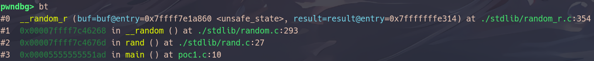
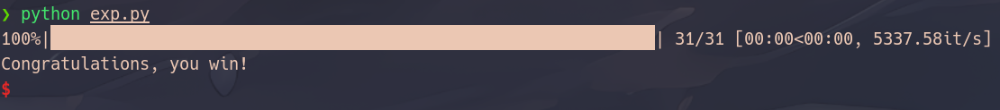
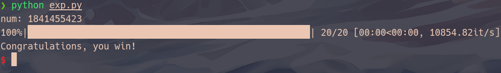

# 为何 glibc 的 rand() 不够随机？——深入源码与攻击案例-先知社区

> **来源**: https://xz.aliyun.com/news/16729  
> **文章ID**: 16729

---

### 序言

在许多 C 语言程序中，`rand()` 函数被广泛用于生成随机数。然而，glibc 提供的 `rand()` 真的足够“随机”吗？在安全性要求较高的场景下，它是否会带来隐患？

事实上，`rand()` 采用的是线性同余生成器（LCG），其随机性远不及现代加密安全的随机数生成器（CSPRNG）。在特定条件下，攻击者甚至可以通过观察少量输出值来预测后续的随机数，进而利用这一漏洞进行攻击。

本文将深入 glibc 的 `rand()` 实现源码，分析其工作机制及随机性缺陷，并结合实际案例，探讨如何利用这些弱点进行预测攻击。

### 源码分析

分析环境：

> GNU C Library (Ubuntu GLIBC 2.35-0ubuntu3.8) stable release version 2.35.  
> Copyright (C) 2022 Free Software Foundation, Inc.  
> This is free software; see the source for copying conditions.  
> There is NO warranty; not even for MERCHANTABILITY or FITNESS FOR A  
> PARTICULAR PURPOSE.  
> Compiled by GNU CC version 11.4.0.  
> libc ABIs: UNIQUE IFUNC ABSOLUTE  
> For bug reporting instructions, please see:  
> <https://bugs.launchpad.net/ubuntu/+source/glibc/+bugs>.

源码来源：

> <https://elixir.bootlin.com/glibc/glibc-2.35/source>

#### rand部分

要了解随机数的生成机制，我们先写一个poc来跟踪`rand`函数的函数调用过程：

```
// gcc poc.c -o poc
#include<stdio.h>
#include <stdlib.h>

int main()
{
    srand(0);
    printf("%d
", rand());
}
```

gdb调试跟踪找到如下的调用链：



找到具体的`random_r`函数源码：

```
int
__random_r (struct random_data *buf, int32_t *result)
{
  state;

  if (buf == NULL || result == NULL)
    goto fail;

  state = buf->state;

  if (buf->rand_type == TYPE_0)
    {
      int32_t val = ((state[0] * 1103515245U) + 12345U) & 0x7fffffff;
      state[0] = val;
      *result = val;
    }
  else
    {
      int32_t *fptr = buf->fptr;
      int32_t *rptr = buf->rptr;
      int32_t *end_ptr = buf->end_ptr;
      uint32_t val;

      val = *fptr += (uint32_t) *rptr;
      /* Chucking least random bit.  */
      *result = val >> 1;
      ++fptr;
      if (fptr >= end_ptr)
    {
      fptr = ;
      ++rptr;
    }
      else
    {
      ++rptr;
      if (rptr >= end_ptr)
        rptr = state;
    }
      buf->fptr = fptr;
      buf->rptr = rptr;
    }
  return 0;

 fail:
  __set_errno (EINVAL);
  return -1;
}

weak_alias (__random_r, random_r)
```

其中有一个关键的结构体`random_data`：

```
struct random_data
  {
    int32_t *fptr;		/* Front pointer.  */
    int32_t *rptr;		/* Rear pointer.  */
    int32_t *state;		/* Array of state values.  */
    int rand_type;		/* Type of random number generator.  */
    int rand_deg;		/* Degree of random number generator.  */
    int rand_sep;		/* Distance between front and rear.  */
    int32_t *end_ptr;		/* Pointer behind state table.  */
  };
```

|  |  |  |
| --- | --- | --- |
| 字段名 | 类型 | 作用 |
| `fptr` | `int32_t *` | 指向当前前端（front）的状态变量，参与随机数计算。 |
| `rptr` | `int32_t *` | 指向当前后端（rear）的状态变量，通常滞后于 `fptr`。 |
| `state` | `int32_t *` | 指向存储随机数生成器状态的数组，所有的内部状态都存储在这里。 |
| `rand_type` | `int` | 指示使用的 RNG 算法类型（不同 `rand_type` 代表不同的算法）。 |
| `rand_deg` | `int` | 表示状态数组 `state` 中用于计算的“多项式阶数”（degree of recursion），即状态变量的数量。 |
| `rand_sep` | `int` | `rand_sep = fptr - rptr`，表示 `fptr` 和 `rptr` 之间的间隔，用于计算新的随机数。 |
| `end_ptr` | `int32_t *` | 指向 `state` 数组的末尾，用于检测是否超出边界。 |

glibc 定义了 5 种 `rand_type`，用于控制 `random_data` 结构体的工作方式：

```
/* Linear congruential.  */
#define	TYPE_0		0
#define	BREAK_0		8
#define	DEG_0		0
#define	SEP_0		0

/* x**7 + x**3 + 1.  */
#define	TYPE_1		1
#define	BREAK_1		32
#define	DEG_1		7
#define	SEP_1		3

/* x**15 + x + 1.  */
#define	TYPE_2		2
#define	BREAK_2		64
#define	DEG_2		15
#define	SEP_2		1

/* x**31 + x**3 + 1.  */
#define	TYPE_3		3
#define	BREAK_3		128
#define			31
#define	SEP_3		3

/* x**63 + x + 1.  */
#define	TYPE_4		4
#define	BREAK_4		256
#define	DEG_4		63
#define	SEP_4		1
```

|  |  |  |
| --- | --- | --- |
| `rand_type` 值 | 名称 | 说明 |
| 0 | `TYPE_0` | 经典的 LCG（低质量，最简单） |
| 1 | `TYPE_1` | 7 级移位寄存器 |
| 2 | `TYPE_2` | 15 级移位寄存器 |
| 3 | `TYPE_3` | 31 级移位寄存器 |
| 4 | `TYPE_4` | 63 级移位寄存器 |

默认情况下，glibc 使用 `TYPE_3`，即 31 级移位寄存器，它的随机性比传统 LCG 强，但仍然可以通过足够的样本进行预测。直接用gdb查看也能证明：


回到函数`__random_r`的源码，我们可以发现其实在这个函数中只是对于是否是使用了`TYPE_0`进行了区分，如果是使用`TYPE_0`，是最简单的线性同余算法 (Linear Congruential Generator, LCG)：   
  
这个算法：

* 乘以 `1103515245`，加 `12345`，再取 `0x7fffffff` 保持非负数。
* 计算出的值存回 `state[0]`，并赋值给 `result` 作为输出。

这也就意味着只需要知道随机数中的任意一次结果就能精准预测出后面的所有结果，如果是处理其他类型 (`TYPE_1` 及以上)：

* `fptr` 和 `rptr` 分别是前向指针和后向指针，通常用于更高级别的随机数生成器（如 `TYPE_1` 及以上的 Tausworthe 或者 `rand48` 算法）。
* 计算：

* `val = *fptr += (uint32_t) *rptr`：将 `rptr` 处的值加到 `fptr` 处，并存储到 `fptr`。
* `*result = val >> 1`：去掉最低位（最不随机的位）

* 移动 `fptr` 和 `rptr` 指针：

* `fptr` 递增，超过 `end_ptr` 时，回绕到 `state`。
* `rptr` 也递增，超过 `end_ptr` 时，同样回绕。

可以发现在这个过此中，整个随机数的生成都是依赖于一个数组`state`，一旦泄漏了这个数组，就能实现任意随机数的预测。

#### srand部分

那么这个数组是什么时候初始化的呢，根据我们的代码很容易看出来是`srand`函数，我们继续跟踪这个函数，找到源码：

```
int
__srandom_r (unsigned int seed, struct random_data *buf)
{
  int type;
  int32_t *state;
  long int i;
  int32_t word;
  int32_t *dst;
  int kc;

  if (buf == NULL)
    goto fail;
  type = buf->rand_type;
  if ((unsigned int) type >= MAX_TYPES)
    goto fail;

  state = buf->state;
  /* We must make sure the seed is not 0.  Take arbitrarily 1 in this case.  */
  if (seed == 0)
    seed = 1;
  write_state (state, 0, seed);
  if (type == TYPE_0)
    goto done;

  dst = state;
  word = seed;
  kc = buf->rand_deg;
  for (i = 1; i < kc; ++i)
    {
      /* This does:
       state[i] = (16807 * state[i - 1]) % 2147483647;
     but avoids overflowing 31 bits.  */
      long int hi = word / 127773;
      long int lo = word % 127773;
      word = 16807 * lo - 2836 * hi;
      if (word < 0)
    word += 2147483647;
      write_state (++dst, 0, word);
    }

  buf->fptr = &state[buf->rand_sep];
  buf->rptr = &state[0];
  kc *= 10;
  while (--kc >= 0)
    {
      int32_t discard;
      (void) __random_r (buf, &discard);
    }

 done:
  return 0;

 fail:
  return -1;
}

weak_alias (__srandom_r, srandom_r)
```

处理过程和`random_r`一样，只是对是否是`TYPE_0`做了区分，如果 `rand_type` 是 `TYPE_0`，即选择了最简单的随机数生成算法，则跳到 `done` 结束函数，因为不需要进一步的复杂初始化，如果不是，初始化过程更复杂，使用了一个线性递推算法（类似于 **LFSR** 或 **Tausworthe** 生成器）：

`word` 根据递推公式更新，其中：

* `hi` 和 `lo` 是将当前的 `word` 分为两部分，用于避免 31 位溢出。
* 更新公式为： word=16807×lo−2836×hiword = 16807 imes lo - 2836 imes hiword=16807×lo−2836×hi
* 如果结果为负数，则加上 `2147483647` 保证结果为正数。

每次更新后，将 `word` 写入 `state` 数组。

每次写入的数量是由`buf->rand_deg`决定的，而这个值也是由`rand_type`决定的，因此由于glibc默认的`rand_type`是`TYPE_3`，默认的`buf->rand_deg`也就是`DEG_3`，因此对于一般的随机数预测程序，只需要泄漏124字节就能实现精准预测。

> 这里我们注意到，为了保证计算过程中不会出现除0异常，这里的处理是将种子0和种子1做了相同的处理，因此，`srand(0)`和`srand(1)`的效果是完全一致的。

#### type部分

那么如何重新设置随机数生成器的`rand_type`呢？我们看剩下两个函数`setstate_r`和`initstate_r`：

1. `initstate_r` 函数

```
/* Initialize the state information in the given array of N bytes for
   future random number generation.  Based on the number of bytes we
   are given, and the break values for the different R.N.G.'s, we choose
   the best (largest) one we can and set things up for it.  srandom is
   then called to initialize the state information.  Note that on return
   from srandom, we set state[-1] to be the type multiplexed with the current
   value of the rear pointer; this is so successive calls to initstate won't
   lose this information and will be able to restart with setstate.
   Note: The first thing we do is save the current state, if any, just like
   setstate so that it doesn't matter when initstate is called.
   Returns 0 on success, non-zero on failure.  */
int
__initstate_r (unsigned int seed, char *arg_state, size_t n,
           struct random_data *buf)
{
  if (buf == NULL)
    goto fail;

  int32_t *old_state = buf->state;
  if (old_state != NULL)
    {
      int old_type = buf->rand_type;
      if (old_type == TYPE_0)
    write_state (old_state, -1, TYPE_0);
      else
    write_state (old_state, -1, (MAX_TYPES * (buf->rptr - old_state))
                    + old_type);
    }

  int type;
  if (n >= BREAK_3)
    type = n < BREAK_4 ? TYPE_3 : TYPE_4;
  else if (n < BREAK_1)
    {
      if (n < BREAK_0)
    goto fail;

      type = TYPE_0;
    }
  else
    type = n < BREAK_2 ? TYPE_1 : TYPE_2;

  int degree = random_poly_info.degrees[type];
  int separation = random_poly_info.seps[type];

  buf->rand_type = type;
  buf->rand_sep = separation;
  buf->rand_deg = degree;
  int32_t *state = &((int32_t *) arg_state)[1];	/* First location.  */
  /* Must set END_PTR before srandom.  */
  buf->end_ptr = &state[degree];

  buf->state = state;

  __srandom_r (seed, buf);

  write_state (state, -1, TYPE_0);
  if (type != TYPE_0)
    write_state (state, -1, (buf->rptr - state) * MAX_TYPES + type);

  return 0;

 fail:
  __set_errno (EINVAL);
  return -1;
}

weak_alias (__initstate_r, initstate_r)
```

`initstate_r` 的作用是初始化随机数生成器的状态信息。它会根据给定的字节数 `n` 选择一个合适的随机数生成器类型，并进行状态设置。函数的工作流程如下：**参数**:`seed`：初始化种子，用于生成随机数。`arg_state`：指向存储随机数生成器状态的内存区域。`n`：表示状态数组的字节数，用来确定应使用哪个类型的随机数生成器。`buf`：指向 `random_data` 结构体的指针，存储有关随机数生成器的状态。这个函数会将`state`替换成用户指定的内存空间，并利用用户提供的新的`seed`和对应的`rand_type`进行初始化。

1. `setstate_r` 函数

```
/* Restore the state from the given state array.
   Note: It is important that we also remember the locations of the pointers
   in the current state information, and restore the locations of the pointers
   from the old state information.  This is done by multiplexing the pointer
   location into the zeroth word of the state information. Note that due
   to the order in which things are done, it is OK to call setstate with the
   same state as the current state
   Returns 0 on success, non-zero on failure.  */
int
__setstate_r (char *arg_state, struct random_data *buf)
{
  int32_t *new_state = 1 + (int32_t *) arg_state;
  int type;
  int old_type;
  int32_t *old_state;
  int degree;
  int separation;

  if (arg_state == NULL || buf == NULL)
    goto fail;

  old_type = buf->rand_type;
  old_state = buf->state;
  if (old_type == TYPE_0)
    write_state (old_state, -1, TYPE_0);
  else
    write_state (old_state, -1, (MAX_TYPES * (buf->rptr - old_state))
                + old_type);

  type = new_state[-1] % MAX_TYPES;
  if (type < TYPE_0 || type > TYPE_4)
    goto fail;

  buf->rand_deg = degree = random_poly_info.degrees[type];
  buf->rand_sep = separation = random_poly_info.seps[type];
  buf->rand_type = type;

  if (type != TYPE_0)
    {
      int rear = new_state[-1] / MAX_TYPES;
      buf->rptr = &new_state[rear];
      buf->fptr = &new_state[(rear + separation) % degree];
    }
  buf->state = new_state;
  /* Set end_ptr too.  */
  buf->end_ptr = &new_state[degree];

  return 0;

 fail:
  __set_errno (EINVAL);
  return -1;
}

weak_alias (__setstate_r, setstate_r)
```

`setstate_r` 的作用是恢复随机数生成器的状态。它将给定的状态数组 `arg_state` 恢复到 `buf` 中，以便继续使用之前的状态生成随机数。工作流程如下：**参数**:`arg_state`：包含恢复的随机数生成器状态的内存区域。`buf`：指向 `random_data` 结构体的指针，存储当前的随机数生成器状态。如果用户传入的`state`是合规的，将会将随机数生成器的状态恢复成用户指定的状态。

### 攻击手法

#### 从种子角度

根据前面的源码分析，随机数生成器的初始化基本上完全依赖于随机数种子，因此，如果种子是一个固定值或者是一个可以预测的值，那么攻击者就可以很轻易的生成一个完全一致的随机数生成器来对随机数进行预测：

1. 种子是一个固定值

```
// gcc poc.c -o poc
#include<stdio.h>
#include<stdlib.h>

int main()
{
    srand(0);
    int num;
    scanf("%d", &num);
    if(num != rand() % 100) {
        puts("Die!");
        exit(-1);
    }
    puts("Congratulations, you win!");
}
```

攻击脚本：

```
from pwn import *
from ctypes import *

context.log_level = 'ERROR'
p = process('./poc')
libc = CDLL('/lib/x86_64-linux-gnu/libc.so.6')

libc.srand(0)
num = libc.rand() % 100
p.sendline(str(num).encode())

p.interactive()
```

效果：


1. 种子依赖于时间

```
// gcc poc.c -o poc
#include<stdio.h>
#include<stdlib.h>
#include <time.h>

int main()
{
    srand(time(0));
    int num;
    scanf("%d", &num);
    if(num != rand() % 100) {
        puts("Die!");
        exit(-1);
    }
    puts("Congratulations, you win!");
}
```

攻击脚本：

```
from pwn import *
from ctypes import *

context.log_level = 'ERROR'
p = process('./poc1')
libc = CDLL('/lib/x86_64-linux-gnu/libc.so.6')

libc.srand(libc.time(0))
num = libc.rand() % 100
p.sendline(str(num).encode())

p.interactive()
```

效果：


#### 从泄漏`state`角度

根据前面的分析，如果我们能泄漏出整个`state`就能实现任意随机数的泄漏：

```
// gcc poc.c -o poc
#include <stdio.h>
#include <stdlib.h>
#include <time.h>
#include <stdint.h>
#include <sys/types.h>
#include <sys/stat.h>
#include <fcntl.h>
#include <unistd.h>

int main() {
    setbuf(stdin, 0);
    setbuf(stdout, 0);
    setbuf(stderr, 0);
    int gift[32];
    int arg[32];
    uint32_t seed;
    int fd = open("/dev/urandom", 0);
    read(fd, &seed, 4);
    close(fd);
    initstate(seed, (char *)arg, 128);
    seed = 0;
    for(int i = 0; i < 32; i++) {
        gift[i] = rand();
    }
    int num = -1;
    while(1)
    {
        printf("Index: ");
        scanf("%d", &num);
        if(num < 0) break;
        printf("Gift for you: %d
", gift[num]);
    }
    puts("Game for you!");
    for(int i = 0; i < 20; i++) {
        printf("Please enter the number you want to guess:");
        scanf("%d", &num);
        if(num != rand() % 100) {
            puts("Die!");
            exit(-1);
        }
    }
    puts("Congratulations, you win!");
    return 0;
}
```

有一个很明显的数组越界可以用来泄漏出`state`中的数据，自行构建一个`random`函数进行预测即可。

攻击脚本：

```
from pwn import *
from tqdm import trange

context.log_level = 'ERROR'
p = process('./poc')

ran1 = 2
ran2 = 5
end = 31
mylist = []
def myrandom():
    global ran1, ran2, end, mylist
    random1 = mylist[ran1 - 1]
    random2 = mylist[ran2 - 1]
    new_data = (random1 + random2) & 0xffffffff
    mylist[ran2 - 1] = new_data
    result = (new_data) >> 1
    ran2 += 1
    if(ran2 > end):
        ran2 = 1
        ran1 += 1
    else:
        ran1 += 1
        if(ran1 > end):
            ran1 = 1
    return result

for i in trange(31):
    p.recvuntil(b':')
    p.sendline(str(33 + i).encode())
    p.recvuntil(b':')
    num = int(p.recvuntil(b'
')[:-1])
    mylist.append(num)

p.recvuntil(b':')
p.sendline(b'-1')

for i in range(20):
    p.recvuntil(b':')
    p.sendline(str(myrandom() % 100).encode())  

p.interactive()                           
```

效果：



#### 从生成方式的角度

当使用较低安全性的生成器时（如`TYPE_0`），根据`random_r`函数中的生成方式，我们可以很轻易得根据任意一个随机数推断出之后的每一个随机数：

```
// gcc poc.c -o poc
#include <stdio.h>
#include <stdlib.h>
#include <time.h>
#include <stdint.h>
#include <sys/types.h>
#include <sys/stat.h>
#include <fcntl.h>
#include <unistd.h>

int main() {
    setbuf(stdin, 0);
    setbuf(stdout, 0);
    setbuf(stderr, 0);
    char arg[8];
    uint32_t seed;
    int fd = open("/dev/urandom", 0);
    read(fd, &seed, 4);
    close(fd);
    initstate(seed, arg, 8);
    printf("You are the %dth visitor!
", rand());
    puts("Game for you!");
    int num;
    for(int i = 0; i < 20; i++) {
        printf("Please enter the number you want to guess:");
        scanf("%d", &num);
        if(num != rand() % 100) {
            puts("Die!");
            exit(-1);
        }
    }
    puts("Congratulations, you win!");
    return 0;
}


```

攻击脚本：

```
from pwn import *
from tqdm import trange

context.log_level = 'ERROR'
p = process('./poc1')
libc = ELF('/lib/x86_64-linux-gnu/libc.so.6')

p.recvuntil(b'You are the ')
num = int(p.recvuntil(b'th')[:-2])
print("num:", num)

def trand():
    global num
    v4 = (1103515245 * num + 12345) & 0x7FFFFFFF
    num = v4
    return v4

for i in trange(20):
    p.recvuntil(b':')
    p.sendline(str(trand() % 100).encode())
    
p.interactive()   
```

效果：



### 总结

通过对 glibc 的 `rand()` 函数源码的深入分析，我们可以清晰地看到其随机数生成的机制及其潜在的缺陷。`rand()` 函数使用的是线性同余生成器（LCG）或类似的算法，虽然这些算法在计算上非常高效，但在安全性方面存在明显的不足。尤其是在安全性要求较高的场景下，`rand()` 的随机性远远不够，攻击者可以通过多种方式预测随机数序列，进而实施攻击。

#### 主要问题总结

1. **种子依赖性**：`rand()` 的随机性完全依赖于初始种子。如果种子是固定的或可预测的（如基于时间），攻击者可以轻松重现相同的随机数序列。
2. **状态泄漏**：`rand()` 的内部状态（`state` 数组）一旦泄漏，攻击者可以通过已知的状态值预测未来的随机数输出。
3. **算法弱点**：`rand()` 使用的 LCG 或类似算法在数学上并不复杂，攻击者可以通过观察少量输出值推断出内部状态，进而预测后续的随机数。

#### 攻击手法总结

1. **种子预测攻击**：通过固定种子或基于时间的种子，攻击者可以重现随机数序列，从而绕过基于随机数的安全机制。
2. **状态泄漏攻击**：通过数组越界或其他漏洞，攻击者可以泄漏 `state` 数组的内容，进而预测未来的随机数。
3. **算法推断攻击**：对于使用简单 LCG 的 `TYPE_0` 类型，攻击者可以通过已知的随机数输出推断出后续的随机数序列。

#### 改进建议

1. **使用加密安全的随机数生成器（CSPRNG）**：在安全性要求较高的场景下，应使用如 `/dev/urandom` 或 `getrandom()` 等加密安全的随机数生成器，而不是 `rand()`。
2. **避免固定种子**：在使用 `rand()` 时，应确保种子是不可预测的，避免使用固定值或基于时间的种子。
3. **定期重置状态**：如果必须使用 `rand()`，建议定期重置随机数生成器的状态，增加攻击者预测的难度。
4. **使用更复杂的随机数生成算法**：如果性能允许，可以考虑使用更复杂的随机数生成算法，如 Mersenne Twister 或其他现代随机数生成器。

#### 结论

虽然 `rand()` 函数在简单的随机数生成场景中表现良好，但在安全性要求较高的应用中，它的随机性远远不够。通过本文的分析和攻击案例，我们可以看到，攻击者可以通过多种方式预测 `rand()` 的输出，进而实施攻击。因此，在设计和实现安全相关的系统时，开发者应谨慎选择随机数生成器，避免使用 `rand()`，转而使用更安全的替代方案。
