# 内存取证各大平台例题-先知社区

> **来源**: https://xz.aliyun.com/news/16735  
> **文章ID**: 16735

---

### GHCTF 2024 的三道取证题

#### [GHCTF 2024 新生赛]皆非取证

vol.py -f chall.vmem --profile=Win7SP1x64 filescan | grep zip

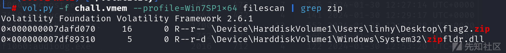

找到压缩包

vol.py -f chall.vmem --profile=Win7SP1x64 mimikatz

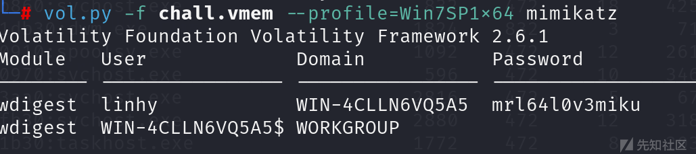

mrl64l0v3miku

这个是密码，解压得flag

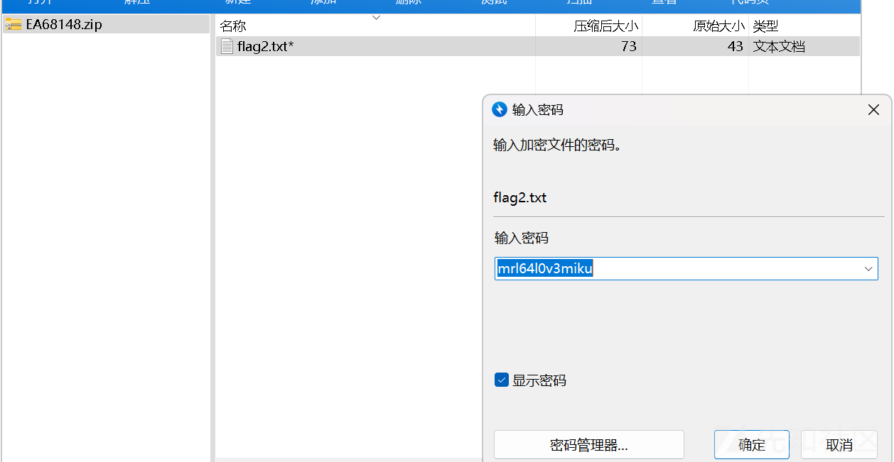

#### [GHCTF 2024 新生赛]是名取证

vol.py -f chall.vmem --profile=Win7SP1x64 iehistory

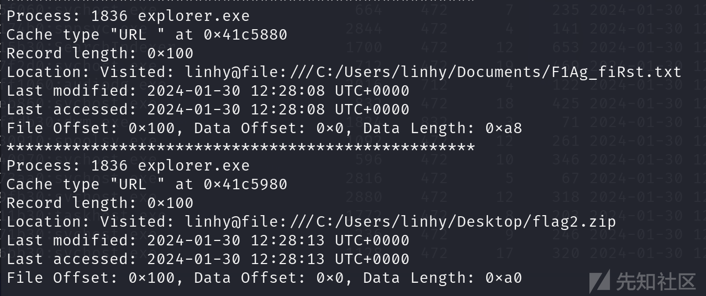

vol.py -f chall.vmem --profile=Win7SP1x64 memdump -p 1836 -D ./..

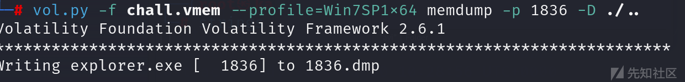

strings explorer.exe | grep flag

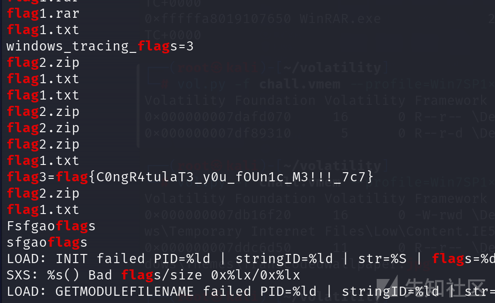

#### [GHCTF 2024 新生赛]佛说取证

vol.py -f chall.vmem --profile=Win7SP1x64 clipboard

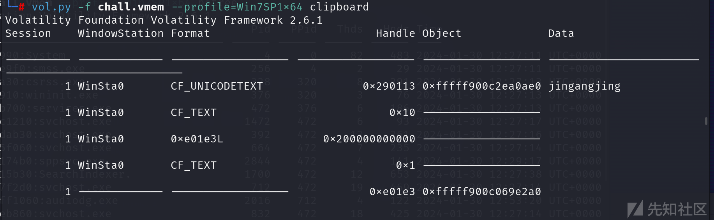

jingangjing


### **[NSSRound#12 Basic]ordinary forensics**

vol.py -f forensics.raw --profile=Win7SP1x64 cmdscan

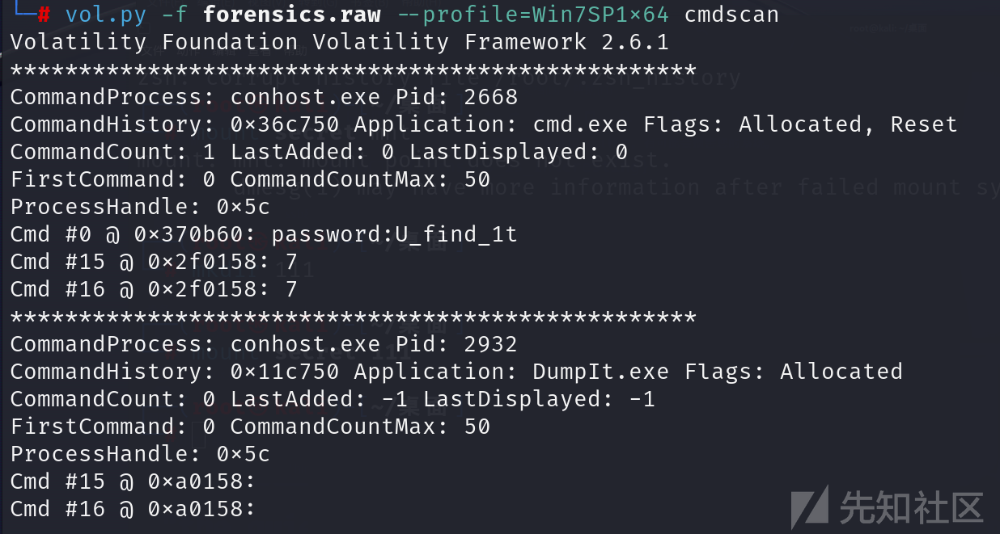

找到了一个密码U\_find\_1t

vol.py -f forensics.raw --profile=Win7SP1x64 filescan | grep zip·

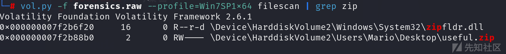

提取这个压缩包

vol.py -f forensics.raw --profile=Win7SP1x64 dumpfiles -Q 0x000000007f2b88b0 -D ./..

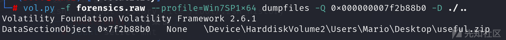

用上面的密码解压得到一个文本

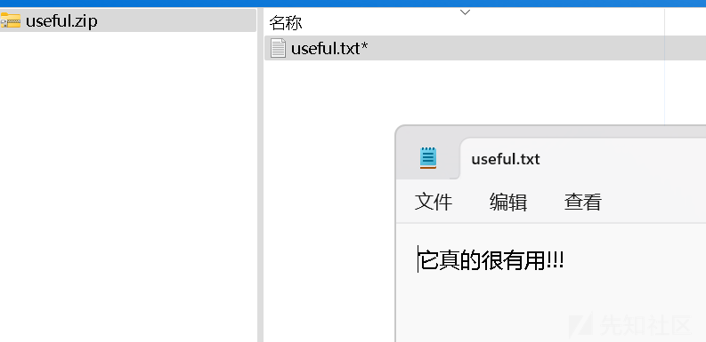

再提取一下这个文本

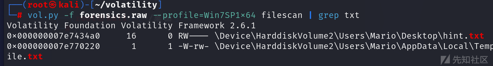

内容：你知道vera吗

用veracrypt挂载

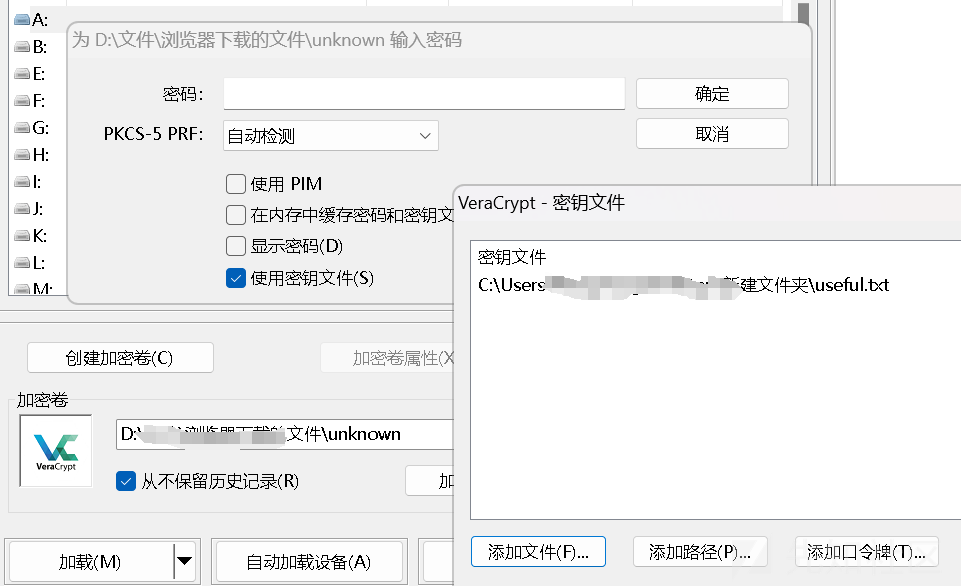

得到一个secret的文件

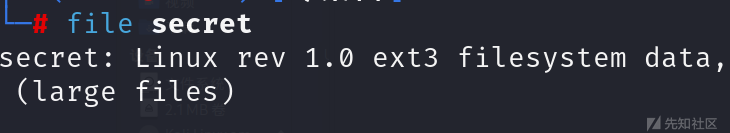

挂载

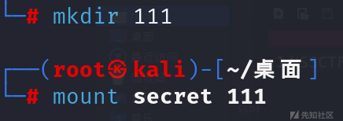

得到一个压缩包

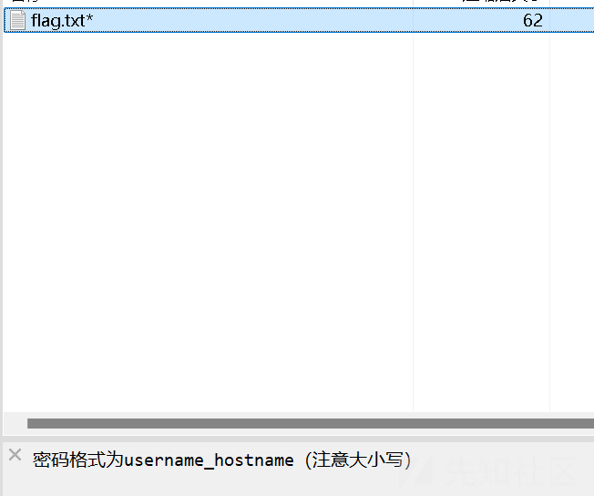

提示密码格式为username\_hostname

vol.py -f forensics.raw --profile=Win7SP1x64 mimikatz

得到username和hostname

密码：Mario\_Princess-Peach

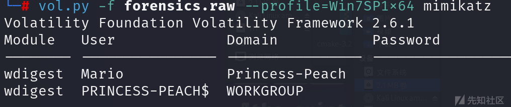

NSSCTF{f0rens1cs\_1s\_Interesting}

### **[腾龙杯 2024]easy\_Forensics**

vol.py -f 3.img --profile=Win7SP1x64 filescan | grep -E "png|zip|rar|jpg|txt"

找到一张图片


提取出来发现有压缩包

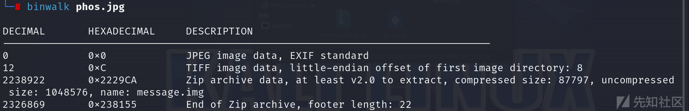

分离出来

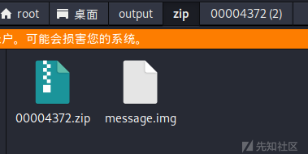

解压得镜像

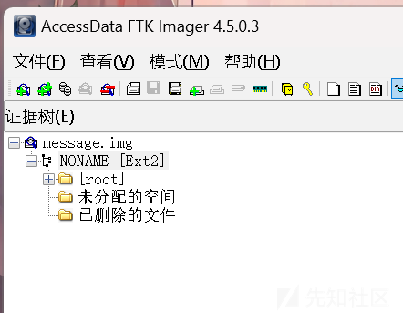

导出来

镜像里面是一个hint.txt

打开是坐标，需要画图

直接用gnuplot画图

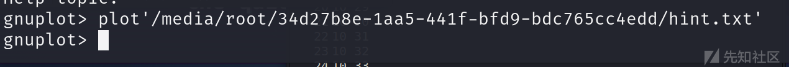

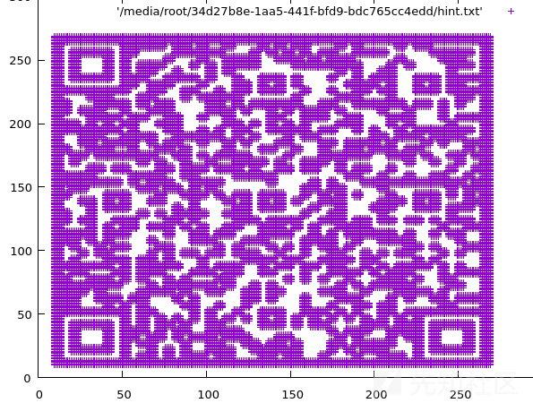

解码就行

Here is the vigenere key: aeolus, but i deleted the encrypted message。

得到一个维吉尼亚的key，需要明文

在这个文件夹里面发现一个文件

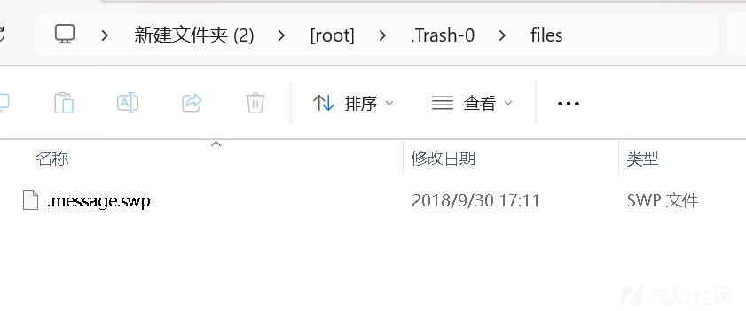

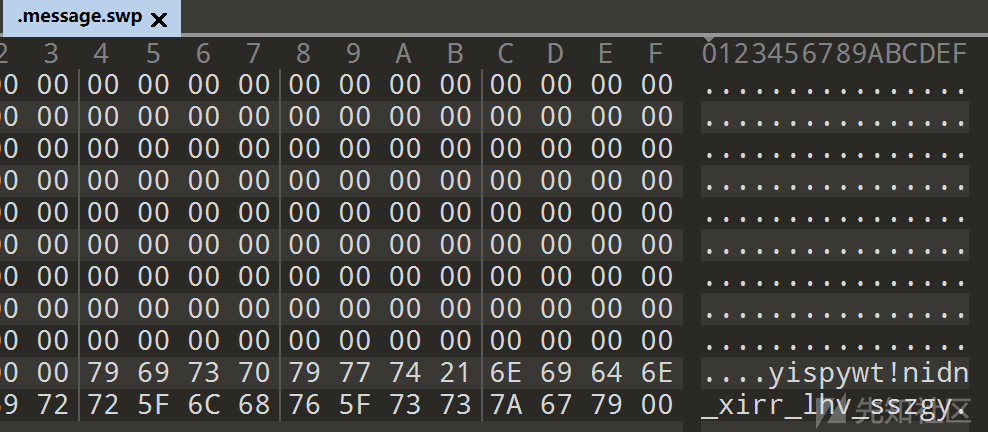

yispywt!nidn\_xirr\_lhv\_sszgy

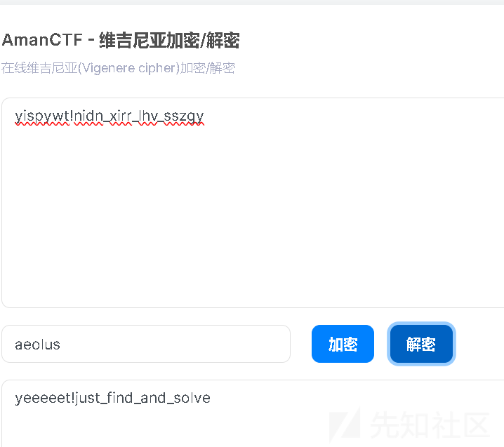

flag{yeeeeet!just\_find\_and\_solve}

### DASCTF

#### baby\_misc

查看文件，在导出这个文件

vol.py -f baby\_misc.raw --profile=Win7SP1x64 filescan | grep txt

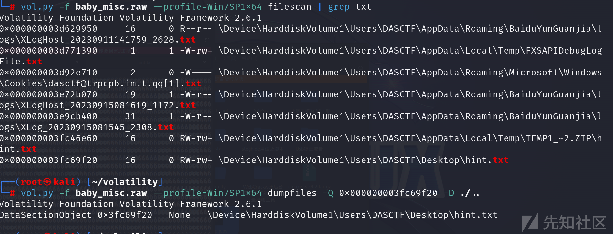

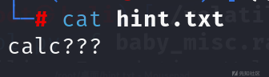

再导出压缩包

vol.py -f baby\_misc.raw --profile=Win7SP1x64 dumpfiles -Q 0x000000003e7d2650 -D ./..

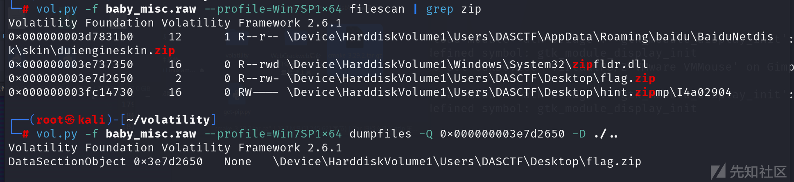

查看一下进程导出这个文件

vol.py -f baby\_misc.raw --profile=Win7SP1x64 memdump -p 1516 -D ./..

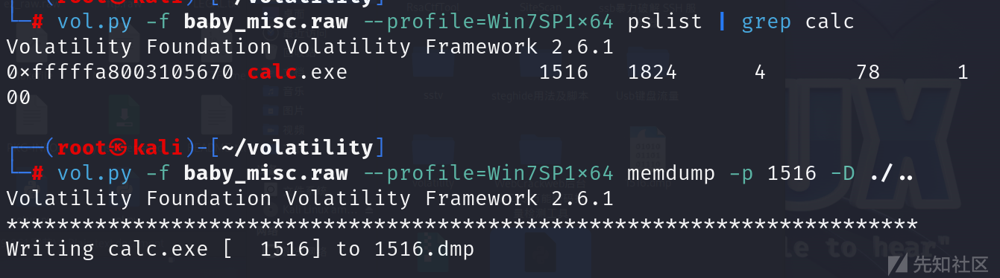

用gimp查看

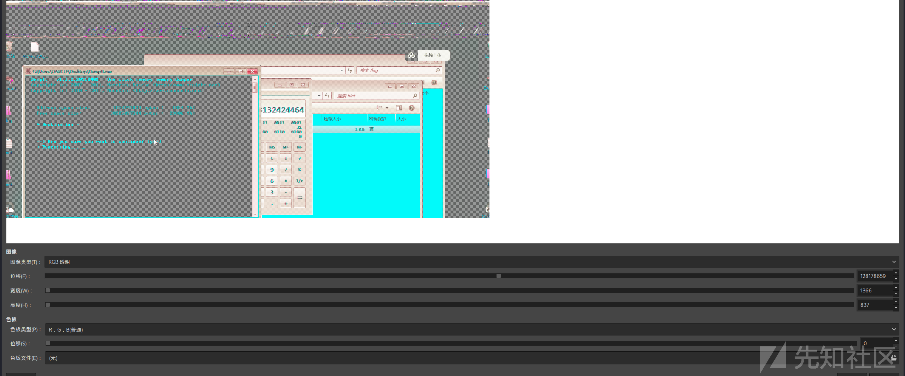

132424464

用windowns模块查看

vol.py -f baby\_misc.raw --profile=Win7SP1x64 windows | grep 132424464

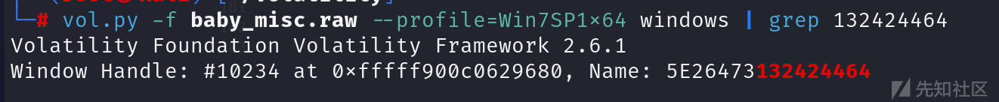

16进制得到解压密码

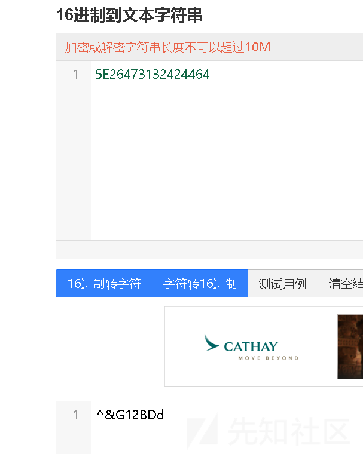

^&G12BDd

得到flag

flag{fba99a87-2278-f175-5055-a47f5773c131}

### **2021陇剑杯-内存取证**

#### 内存分析（问1）

```
网管小王制作了一个虚拟机文件，让您来分析后作答：
虚拟机的密码是_____________。（密码中为flag{xxxx}，含有空格，提交时不要去掉）。
```

mimikatz一把梭了

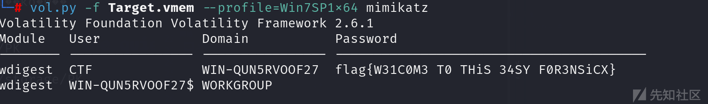

flag{W31C0M3 T0 THiS 34SY F0R3NSiCX}

#### 内存分析（问2）

```
网管小王制作了一个虚拟机文件，让您来分析后作答：
虚拟机中有一个某品牌手机的备份文件，文件里的图片里的字符串为_____________。（解题过程中需要用到上一题答案中flag{}内的内容进行处理。本题的格式也是flag{xxx}，含有空格，提交时不要去掉）。
```

先查看信息

vol.py -f Target.vmem imageinfo

查看一下桌面文件

vol.py -f Target.vmem --profile=Win7SP1x64 filescan | grep Desk

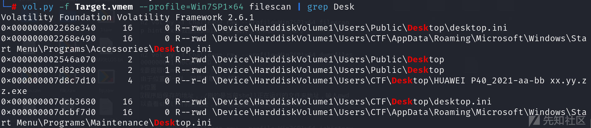

提取一下

vol.py -f Target.vmem --profile=Win7SP1x64 dumpfiles -Q 0x000000007d8c7d10 -D ./..

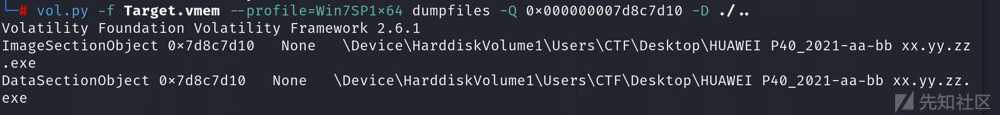

再文件分离一下，得到华为的文件夹

<https://github.com/RealityNet/kobackupdec>用这个软件解密

密码是上题的W31C0M3\_T0\_THiS\_34SY\_F0R3NSiCX

```
python kobackupdec.py -vvv W31C0M3_T0_THiS_34SY_F0R3NSiCX "HUAWEI P40_2021-aa-bb xx.yy.zz" D:\666
```

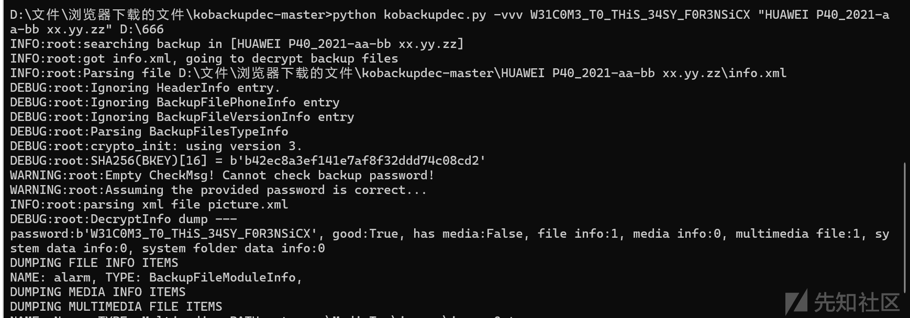

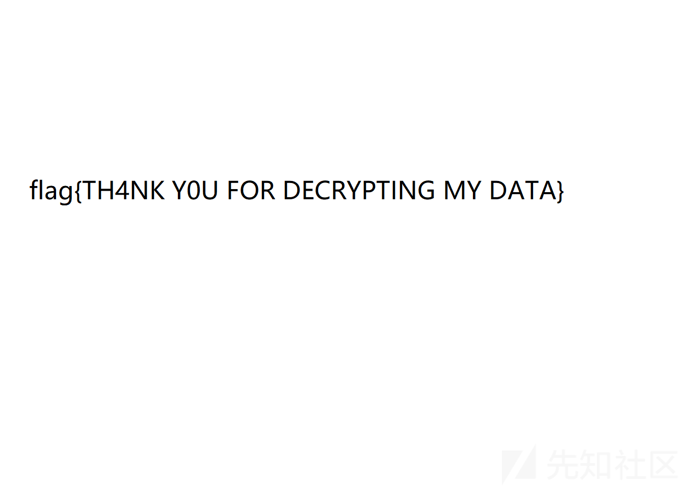

flag{TH4NK Y0U FOR DECRYPTING MY DATA}

### **2022鹏城杯-简单取证**

查看信息，找文件

```
vol.py -f file.raw imageinfo
vol.py -f file.raw --profile=WinXPSP2x86 filescan | grep jpg
```

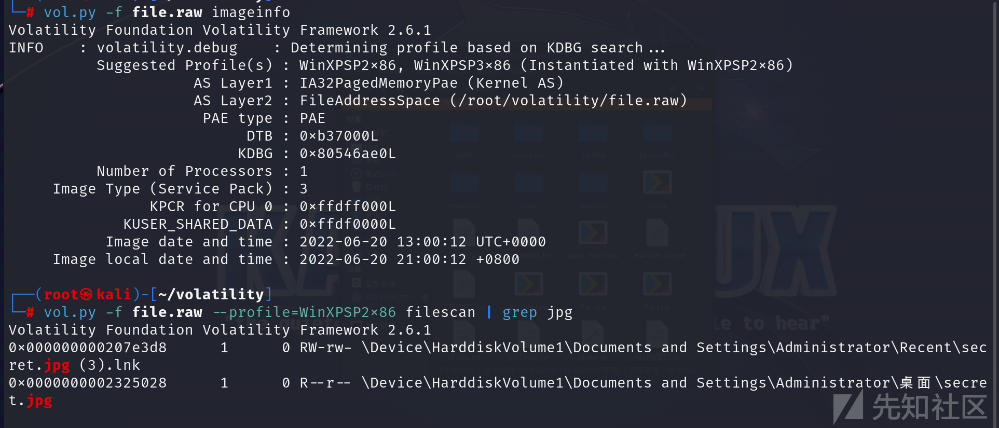

导出来

vol.py -f file.raw --profile=WinXPSP2x86 dumpfiles -Q 0x0000000002325028 -D ./..

去010显示是BASE64，赛博厨子一把梭了

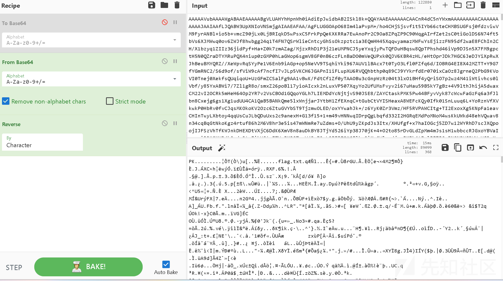

压缩包导出来

找到密码

vol.py -f file.raw --profile=WinXPSP2x86 cmdscan

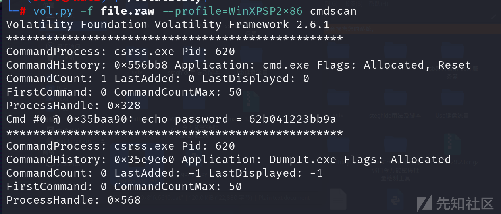

解压出来是坐标，用脚本

```
from PIL import Image

im = Image.new("RGB", (350, 350), (0, 0, 0))

with open("flag.txt", "r") as f:
    r = f.read()

lst = r.split("
")
for i in lst:
    x = int(i.split(" ")[0])
    y = int(i.split(" ")[1])
    im.putpixel((x, y), (255, 255, 255))

im.save("flag.png")
```

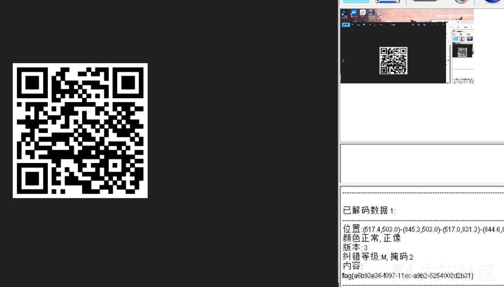

flag{a6b93e36-f097-11ec-a9b2-5254002d2b31}

### **2023巅峰极客**

#### easy\_Forensic

先查看镜像信息，

vol.py -f secret.raw imageinfo

再查看进程

vol.py -f secret.raw --profile=Win7SP1x64 pslist

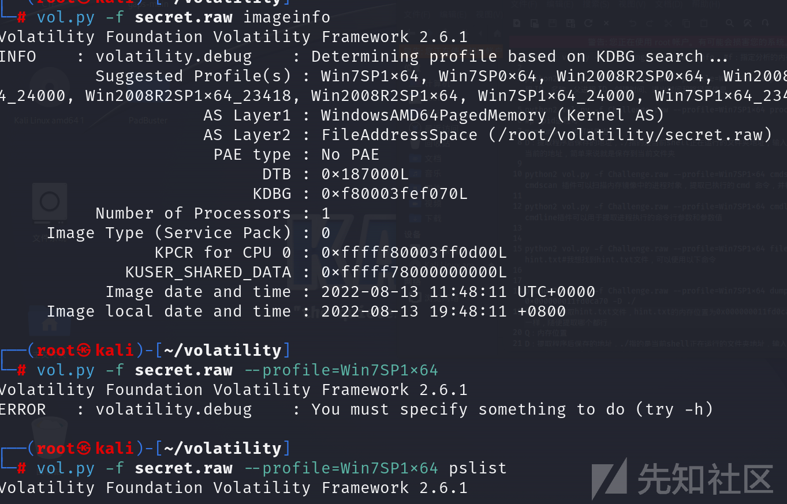

没什么用

再获取文件

vol.py -f secret.raw --profile=Win7SP1x64 filescan

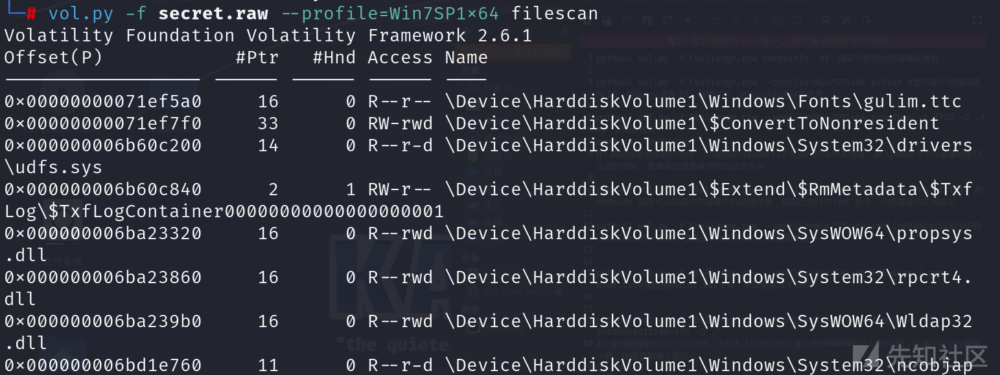

发现了一个压缩包

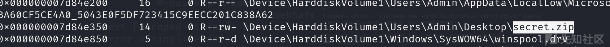

一个jpg


一个txt文本


或者直接过滤

vol.py -f secret.raw --profile=Win7SP1x64 filescan | grep txt

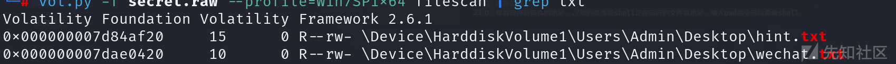

把它们都dump下来

vol.py -f secret.raw --profile=Win7SP1x64 dumpfiles -Q 0x000000007d84af20 -D ./

hint.txt dump不下来

再来看一下图片，左下角有东西，修改宽高

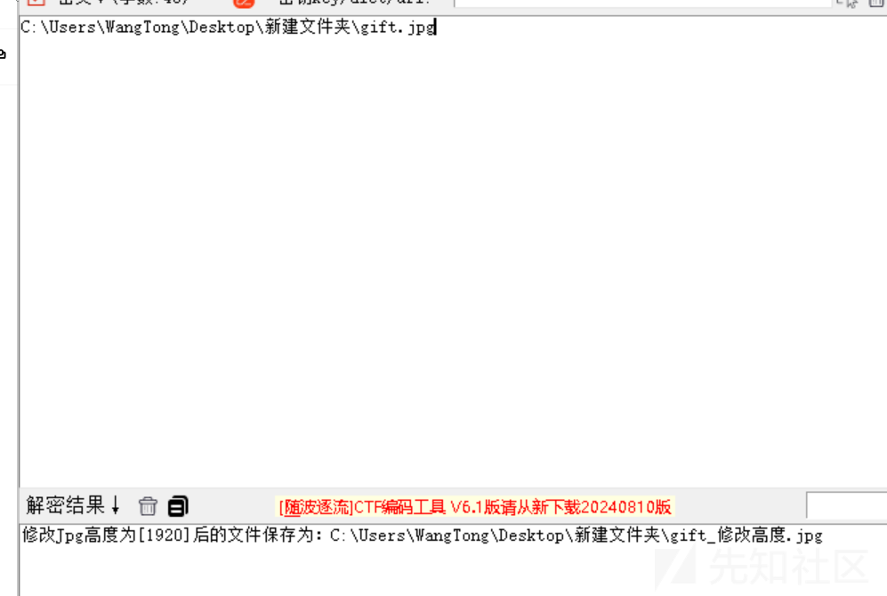

得到压缩包的密码：Nothing\_is\_more\_important\_than\_your\_life!

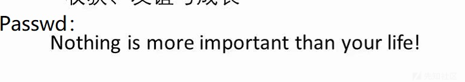

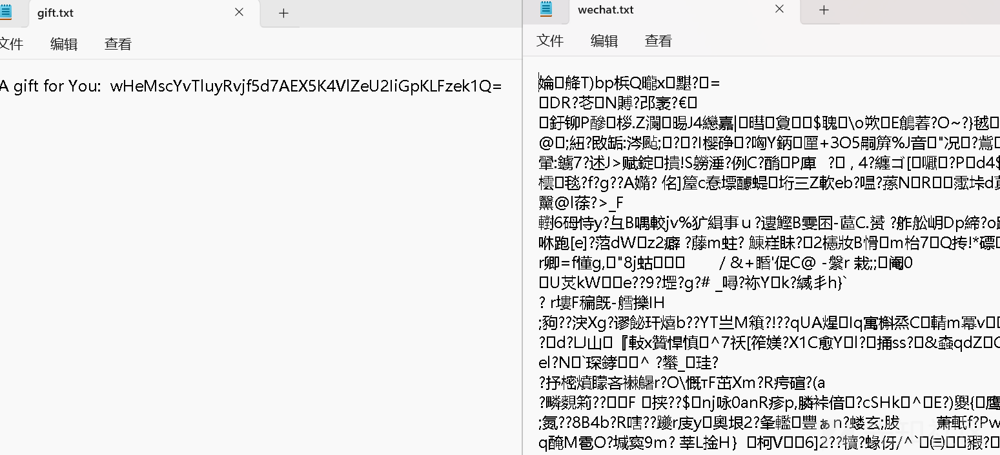

可以看到gift里的内容应该是个密钥，wechat是聊天记录

<https://github.com/x1hy9/WeChatUserDB>，用这个来解

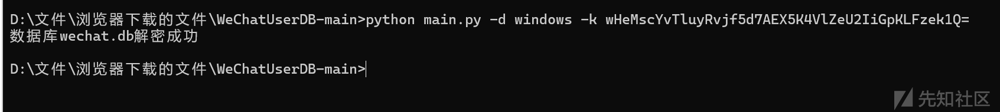

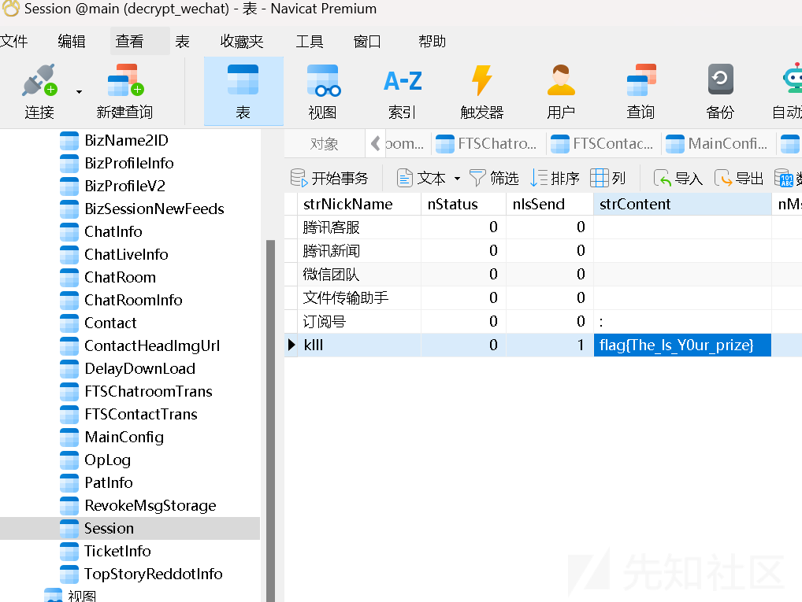


flag{The\_Is\_Y0ur\_prize}

### **24鹏城杯-取证**

vol.py -f flag.raw imageinfo


vol.py -f flag.raw --profile=Win7SP1x64 filescan | grep -E "png|jpg|rar|zip|Desktop"


找到压缩包


密码爆破

u3=LEnoG9HX2fJPVyIUpjax+8CSqsBOYWmzekwA1Z5grM0F/6DTNhQb4dKlR7tivc

得到这个

考虑到需要base64换表


CADmC4MN8NfdfoJePLj4JNsdfLW6CeJmfAIAJxE68eIkJLBkf4hc

再解码


得到flag

flag{3c380cc857778080f3a2df5a0b4d47d3}

### [湖湘杯 2021]某取证题

我们先导出这张图片

```
vol.py -f PC11.raw --profile=Win7SP1x64 filescan | grep jpg
vol.py -f PC11.raw --profile=Win7SP1x64 dumpfiles -Q 0x000000007e353630 -D ./..
```


得到一部分flag


查看一下ie浏览器的记录，太多了，就过滤一下

vol.py -f PC11.raw --profile=Win7SP1x64 iehistory | grep zip


在计算机中没有找到zip文件，就在进程中看到了Wireshark.exe

导出来

vol.py -f PC11.raw --profile=Win7SP1x64 memdump -p 1096 -D ./..


文件分离找到了压缩包

需要明文攻击

./bkcrack -L target.zip


太慢了

./bkcrack -C target.zip -c t.jpg -x 0 ffd8ffe000104a46494600


更改一下密码

./bkcrack -C target.zip -k b0a90b36 14dd97b9 f5d648cf -U flag.zip 123456


over


flag{2911364c-7f0c-4d37-b92c-accaf9d1de2d}
