# JAVA代审之publiccmsV4最新版-先知社区

> **来源**: https://xz.aliyun.com/news/16780  
> **文章ID**: 16780

---

# 项目介绍

200多万行代码修改 持续迭代8年 现代化java cms完整开源，轻松支撑千万数据、千万PV；支持静态 化，服务器端包含，多级缓存，全文搜索复杂搜索，后台支持手机操作; 目前已经拥有全球0.0005% (w3techs提供的数据)的用户，语言支持中、繁、日、英；是一个已走向海外的成熟CMS产品

# 环境搭建

项目地址：https://gitee.com/sanluan/PublicCMS/archive/refs/tags/V4.0.202406.d.zip

源码下载到本地后，IDEA打开加载

加载好后，配置tomcat，直接启动即可

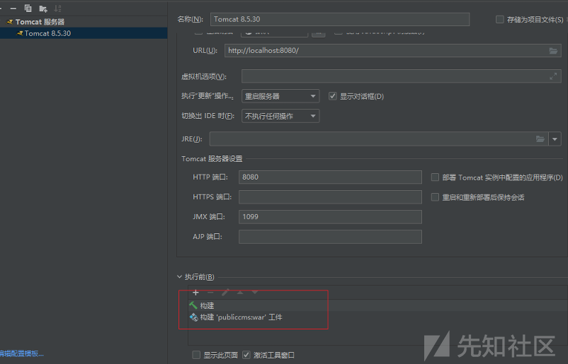

访问 http://localhost:8080/，按照指引创建对应数据库配置

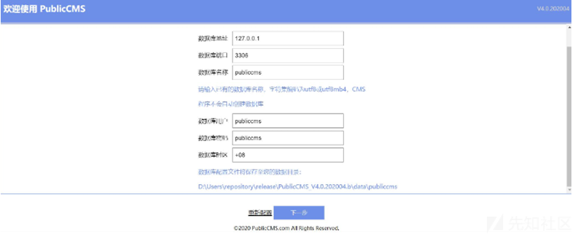 出现下面页面即可

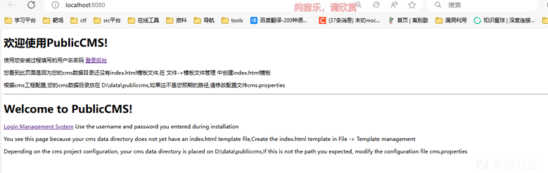

安装过程中会自定义账号密码，登入后台

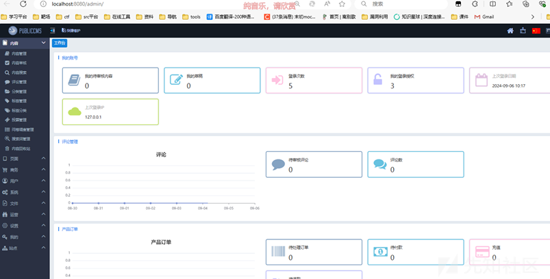

# 漏洞挖掘

这个是最新版，很多漏洞都修了，我找了两处，说实话也比较鸡肋

## 任意文件上传

在网站后台存在文件操作类功能

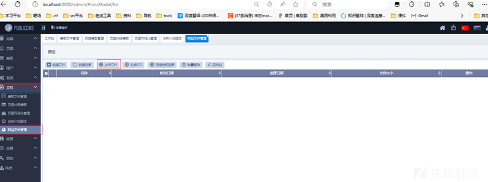

这里可以上传文件，我们尝试上传查看对应路由

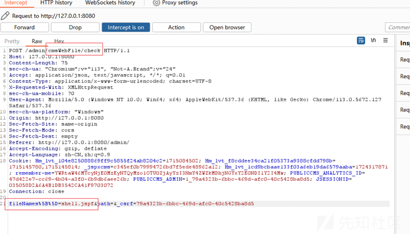

在上传文件前会触发个check方法，定位代码段查看作用

```
@RequestMapping("check")
@Csrf
@ResponseBody
public boolean check(@RequestAttribute SysSite site, 
                     @RequestParam("fileNames[]") String[] fileNames, String path) {
    if (null != fileNames) {  //if 判断我们上传的文件名是否为null
        for (String fileName : fileNames) {   //for 获取我们上传的文件名
            String filepath = CommonUtils.joinString(path, 
                                                     Constants.SEPARATOR, fileName);
            //使用joinString 拼接完整文件路径
            if 
                (CmsFileUtils.exists(siteComponent.getWebFilePath(site.getId(), filepath))) {
                    //使用exists 判断文件是否存在
                    return true;
                }
        }
    }
    return false;
```

我们接着上传

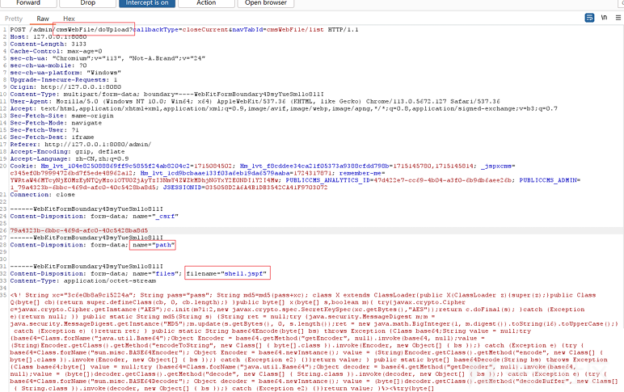

定位对应代码段

```
@RequestMapping("doUpload")
@Csrf
public String upload(@RequestAttribute SysSite site, @SessionAttribute 
                     SysUser admin, MultipartFile[] files, String path,
                     boolean privatefile, boolean overwrite, HttpServletRequest request, 
                     ModelMap model) {
    if (null != files) {  //if判断文件名是否为null
        try {
            for (MultipartFile file : files) {   //for 循环获取我们上传的文件
                String originalName = file.getOriginalFilename(); //获取文件
                名：shell.jspf
                String suffix = CmsFileUtils.getSuffix(originalName);  //获取
                文件后缀：jspf
                String filepath = CommonUtils.joinString(path, 
                                                         Constants.SEPARATOR, originalName);
                // 这里拼接我们上传的路径： + / + shell.jspf //path没写所以是空
                String fuleFilePath = 
                siteComponent.getWebFilePath(site.getId(), filepath);
                //getWebFilePath是自定义方法，是使用joinString拼接完整路径，并且限制
                了../防止了目录穿越
                if 
                (ArrayUtils.contains(safeConfigComponent.getSafeSuffix(site), suffix)) {
                    //对文件后缀进行白名单判断
                    if (overwrite || !CmsFileUtils.exists(fuleFilePath)) {
                        //判断文件是否存在
                        if (CmsFileUtils.exists(fuleFilePath)) {             

                            String historyFilePath = 
                            siteComponent.getWebHistoryFilePath(site.getId(), filepath, true);
                            try {
                                CmsFileUtils.copyFileToFile(historyFilePath, 
                                                            historyFilePath);
                            } catch (IOException e1) {
                            }
                        }
                            大概意思就是这样，那么这处限制了目录穿越，限制了文件后缀并且是白名单检查，字典如下（断点调
                            试可以得到）
                            [".mp3", ".wav", ".mid", ".flv", ".swf", 其他 +38]
                        允许上传常规文件，有html，zip等等
                        这里发现可以上传zip，并且有解压zip的功能，尝试上传zip，解压抓包查看对应路由
                        CmsFileUtils.upload(file, fuleFilePath);
                        //使用upload方法上传文件
                        if (CmsFileUtils.isSafe(fuleFilePath, suffix)) {
                            //.isSafe方法来检查文件，检查后缀，针对SVG & PDF
                            FileUploadResult uploadResult = 
                            CmsFileUtils.getFileSize(fuleFilePath, originalName, suffix);
                            //记录文件上传日志
                            logUploadService.save(new 
                                                  LogUpload(site.getId(), admin.getId(),
                                                            LogLoginService.CHANNEL_WEB_MANAGER, 
                                                            originalName, privatefile,

                                                            CmsFileUtils.getFileType(CmsFileUtils.getSuffix(originalName)), file.getSize(),
                                                            uploadResult.getWidth(), 
                                                            uploadResult.getHeight(), RequestUtils.getIpAddress(request),
                                                            CommonUtils.getDate(), filepath));
                        } else {
                            //处理不安全的文件
                            CmsFileUtils.delete(fuleFilePath);
                            model.addAttribute(CommonConstants.ERROR, 
"verify.custom.file.unsafe");
                                return CommonConstants.TEMPLATE_ERROR;
                            }
                        }
                    } else {
                        model.addAttribute(CommonConstants.ERROR, 
"verify.custom.fileType");
                        return CommonConstants.TEMPLATE_ERROR;
                    }
                }
            } catch (IOException e) {
                model.addAttribute(CommonConstants.ERROR, e.getMessage());
                log.error(e.getMessage(), e);
                return CommonConstants.TEMPLATE_ERROR;
            }
        }
        return CommonConstants.TEMPLATE_DONE;
    }
```

大概意思就是这样，那么这处限制了目录穿越，限制了文件后缀并且是白名单检查，字典如下（断点调 试可以得到）

[".mp3", ".wav", ".mid", ".flv", ".swf", 其他 +38]

允许上传常规文件，有html，zip等等

这里发现可以上传zip，并且有解压zip的功能，尝试上传zip，解压抓包查看对应路由

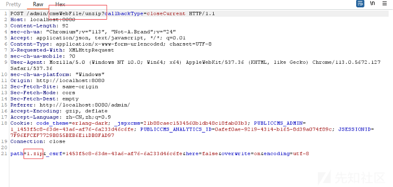

定位对应代码段

```
public String doUnzip(@RequestAttribute SysSite site, @SessionAttribute 
                      SysUser admin, String path, String encoding,
                      boolean here, boolean overwrite, HttpServletRequest request, 
                      ModelMap model) {
    if (CommonUtils.notEmpty(path) && path.toLowerCase().endsWith(".zip")) {
        //获取并判断文件后缀是否为zip
        String filepath = siteComponent.getWebFilePath(site.getId(), path);
        //拼接文件完整路径
        if (CmsFileUtils.isFile(filepath)) {
            //判断文件是否存在
            try {
                if (here) {
                    ZipUtils.unzipHere(filepath, encoding, overwrite, (f, e) -> {
                        String historyFilePath = 
                        siteComponent.getTemplateHistoryFilePath(site.getId(), e.getName(), true);
                        try {

                            CmsFileUtils.copyInputStreamToFile(f.getInputStream(e), historyFilePath);
                        } catch (IOException e1) {
                        }
                        return true;
                    });
                } else {
                    ZipUtils.unzip(filepath, encoding, overwrite, (f, e) -> 
                                   {
                                       String historyFilePath = 
                                       siteComponent.getWebHistoryFilePath(site.getId(), e.getName(), true);
                                       try {

                                           CmsFileUtils.copyInputStreamToFile(f.getInputStream(e), historyFilePath);
                                       } catch (IOException e1) {
                                       }
                                       return true;
                                   });
                }
            } catch (IOException e) {
                model.addAttribute(CommonConstants.ERROR, e.getMessage());
                log.error(e.getMessage(), e);
            }
        }
        logOperateService
        .save(new LogOperate(site.getId(), admin.getId(), 
                             admin.getDeptId(), LogLoginService.CHANNEL_WEB_MANAGER,
                             "unzip.web.webfile", 
                             RequestUtils.getIpAddress(request), CommonUtils.getDate(), path));
    }
    return CommonConstants.TEMPLATE_DONE;
}
```

代码比较短，貌似只判断了zip本身，没有对zip中的文件进行判断，可以断点调试下

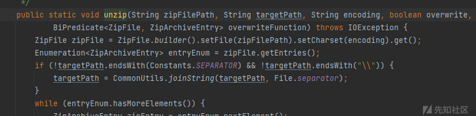 会使用unzip解压文件，接着跟

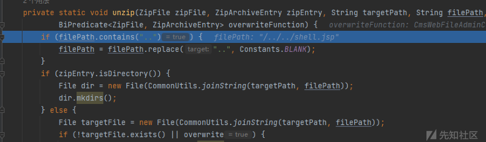

会限制..，防止了目录穿越，后续没有对zip中的文件后缀进行校验，于是可以上传任意文件，但是很可惜不能目录穿越

只能上传在data\publiccms\web\site\_1\ 目录下

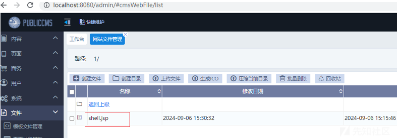

# XSS(存储型)

这个我只能说鸡肋的很，在网站后台可以修改模板文件

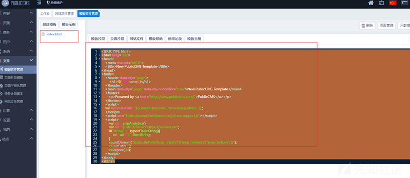 在早些版本这一处是有SSTI的，但是最新版修复了，但是可以执行JS代码

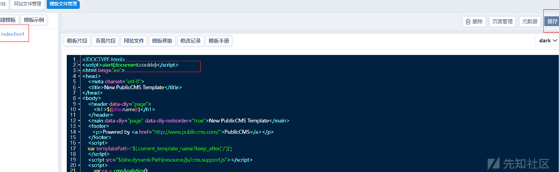


# SSRF

全局搜索 .execute( 定位到一处Controller层代码

PublicCMS-V4\publiccms-parent\publiccms core\src\main\java\com\publiccms\controller\admin\sys\UeditorAdminController.java

```
@RequestMapping(params = "action=" + ACTION_CATCHIMAGE)
//路由?actio=catchimage
@ResponseBody
public Map<String, Object> catchimage(@RequestAttribute SysSite site, 
                                      @SessionAttribute SysUser admin,
                                      HttpServletRequest request) {
    try (CloseableHttpClient httpclient = 
         HttpClients.custom().setDefaultRequestConfig(Constants.defaultRequestConfig)
         .build()) {
        String[] files = request.getParameterValues(FIELD_NAME + "[]");
        获取file[]参数中的值赋值给files
        image
        if (CommonUtils.notEmpty(files)) {
            //判断内容是否为空
            List<Map<String, Object>> list = new ArrayList<>();
            for (String image : files) {
                //循环遍历files，赋值和image
                HttpGet httpget = new HttpGet(image); //创建http请求，地址为
                CloseableHttpResponse response = 
                httpclient.execute(httpget);  //发送http请求
                HttpEntity entity = response.getEntity();
```

我们尝试构造路由，这个功能在后台

文件头部有上级路由 ueditor ，加上功能点路由，完整路由为

请求地址通过file[]传入，post，get都行，get记得[]url编码

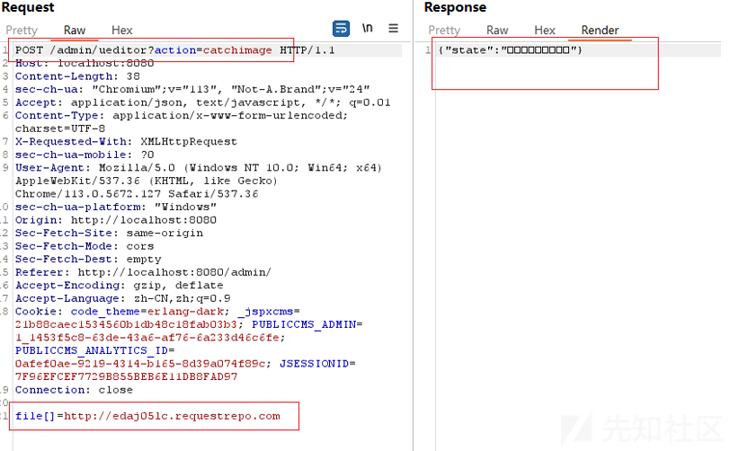

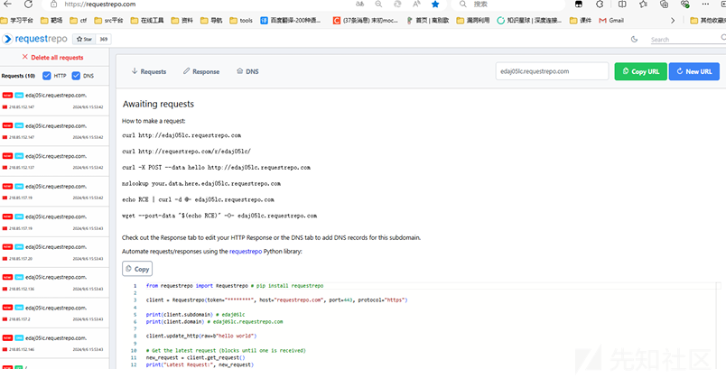
