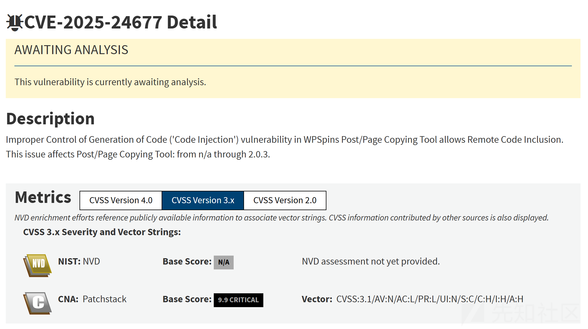
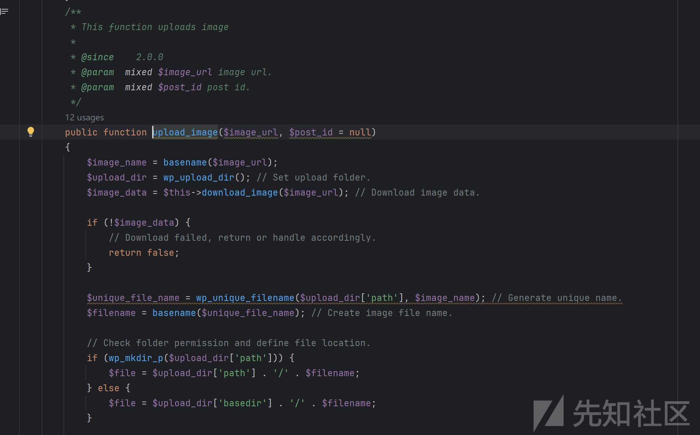
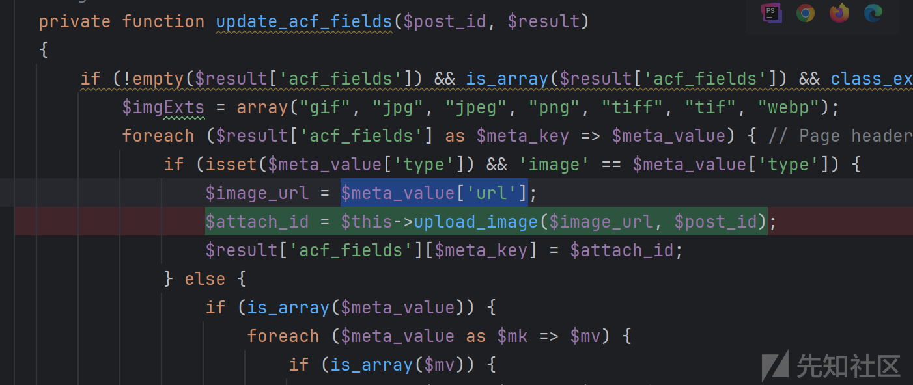
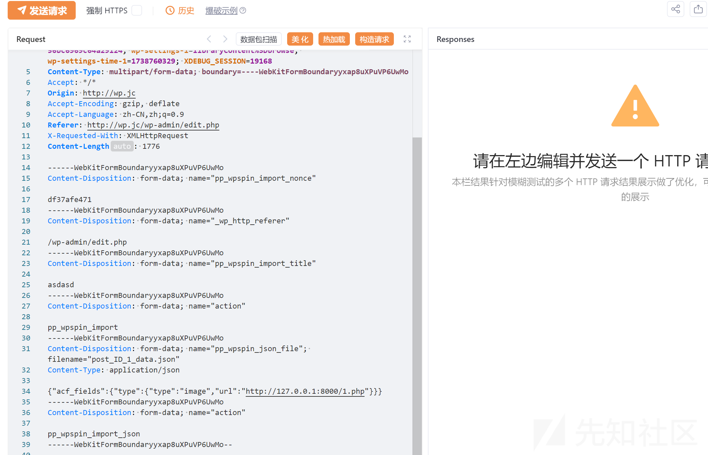
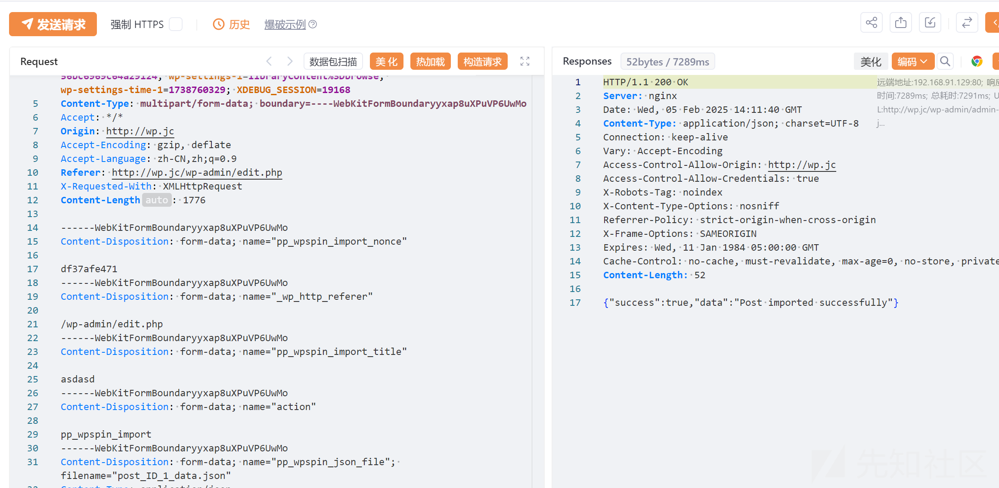
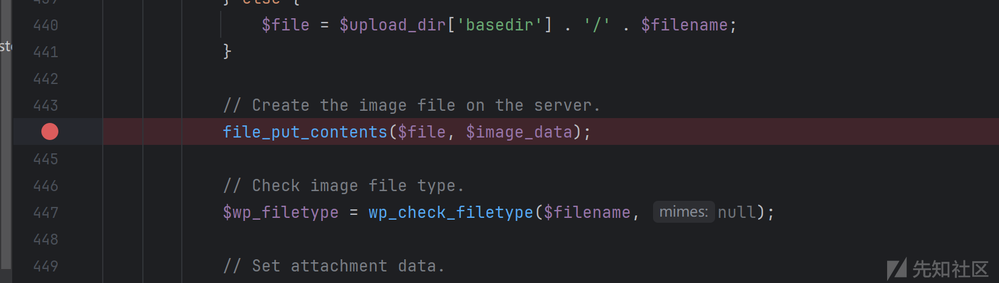
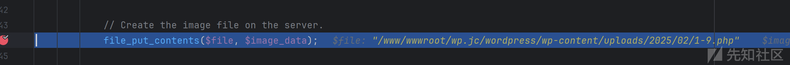
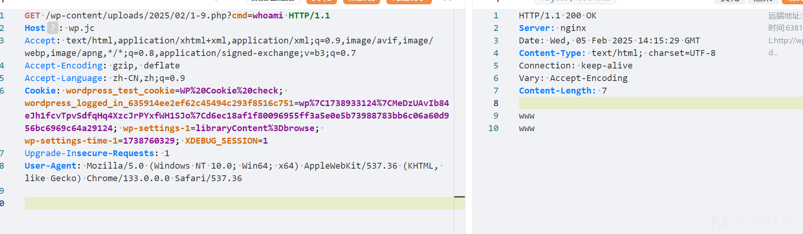

# WPSpins远程代码包含漏洞分析(CVE-2025-24677)-先知社区

> **来源**: https://xz.aliyun.com/news/16781  
> **文章ID**: 16781

---

# 漏洞通告



根据漏洞通告了解这个漏洞评分评分9.9，漏洞类型是远程包含代码

# 漏洞分析

关键漏洞位置



初步分析代码逻辑

1. 获取文件名
2. 获取文件存储路径
3. 获取文件内容
4. 写入文件

代码向上追踪，了解image是通过$meta\_value['url']获取的



可控参数的关键代码如下


了解到$meta\_value是通过文件上传的内容构造的，那么只需要触发`_pp_wpspin_import`函数即可

`_pp_wpspin_import`是通过`wp_ajax_pp_wpspin_import_json`动作触发的

```
add_action('wp_ajax_pp_wpspin_import_json', array($this, '_pp_wpspin_import'));
```

知道了所有的条件构造poc



但是直接打poc无法知道文件写入的路径



直接在`file_put_contents`处下断点



动态调试获取文件上传路径

成功获取文件上传路径，由于我这边上传了多个1.php测试，所有文件名后面自动添加1-x.php



访问测试上传的恶意文件，成功访问


