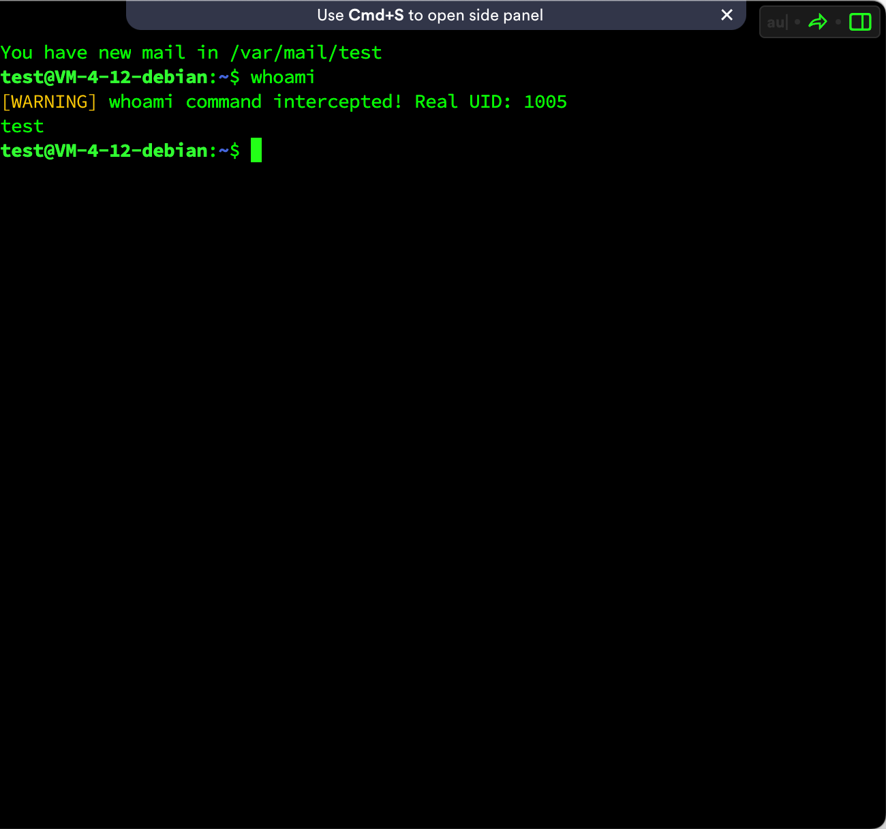
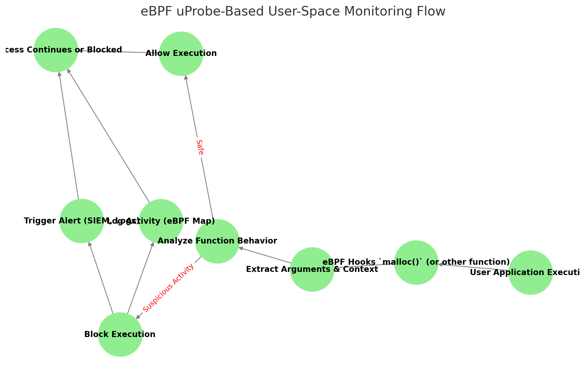
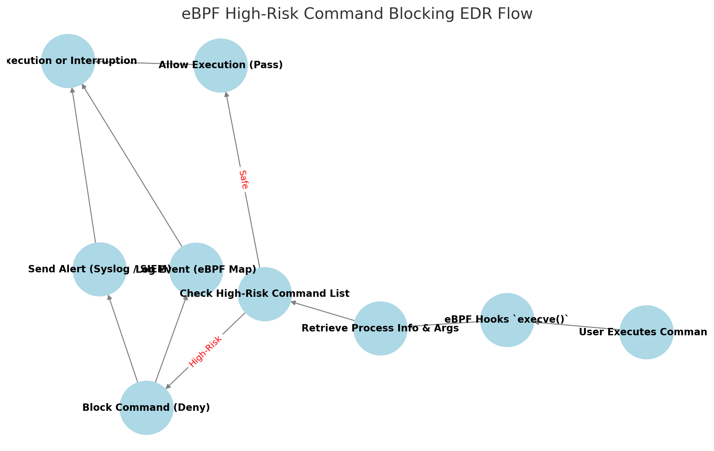

# Linux下EDR产品设计：高危命令阻断-先知社区

> **来源**: https://xz.aliyun.com/news/16782  
> **文章ID**: 16782

---

## 产品对比

### 1号产品服务

技术栈：**netlink检测方式**

**优势：**

好的那么什么是**netlink**呢：Netlink 允许用户态进程（如 `iproute2`、`udevd`、`NetworkManager` 等）通过 socket 与内核交互，监测内核状态变化并作出相应处理。它采用消息传递机制，支持多播（multicast）和单播（unicast），因此非常适合事件驱动的监测系统。

这其实有一个非常关键的点，**内核检测**，在Windows下的很多EDR都会在在内核上做操作，类似于使用一些[ObRegisterCallbacks]等内核回调函数，实现回滚更高的优先级让攻击者头疼不已，所以Linux下的EDR设计的拦截的方向也应该朝着内核前进。

**不足：**

但是它存在的问题是什么呢，该产品只做了相关的检测功能，没有做阻断的功能。而且netlink的轮询机制或者异步机制并不是实时检测的

「<https://myzxcg.com/2023/10/AV/EDR-%E5%AE%8C%E5%85%A8%E8%87%B4%E7%9B%B2-%E6%B8%85%E9%99%A46%E5%A4%A7%E5%86%85%E6%A0%B8%E5%9B%9E%E8%B0%83%E5%AE%9E%E7%8E%B0/#remove-obregistercallbacks」>

### 2号产品服务

技术栈：hook glic库方式

**优势：**

对比一号产品，2号产品实现了命令阻断的功能

**不足**：hook glbic的方法更多的只是用在用户态做阻拦，例如之前文章中通过LD\_PRELOAD进行动态链接阻拦的方法如果通过sudo命令运行，或者使用syscall运行的时候就无法进行拦截

下面实现一个对whoami命令的阻拦实现

现在需要将我们的思维发散，在终端下实现whoami命令的时候，调用的其实是getuid()这个函数，所以我们要针对的是getuid()

```
#define _GNU_SOURCE
#include <stdio.h>
#include <unistd.h>
#include <dlfcn.h>

uid_t geteuid(void) {
    static uid_t (*real_geteuid)(void) = NULL;

    if (!real_geteuid) {
        real_geteuid = dlsym(RTLD_NEXT, "geteuid");  // 获取原始的 geteuid() 地址
    }

    uid_t uid = real_geteuid();  // 调用原始的 geteuid()
    
    printf("[WARNING] whoami command intercepted! Real UID: %d
", uid);
    
    return uid;
}

```

然后将我们的文件编译成共享库

```
gcc -shared -fPIC -o libhook.so hook_whoami.c -ldl

```

然后我们设计全局的LD\_PRELOAD

**将** `libhook.so` **复制到** `/lib/` **或** `/usr/lib/` **目录（确保所有用户都能访问）**

```
sudo cp libhook.so /usr/lib/libhook.so
```

编辑 `/etc/ld.so.preload`

```
sudo sh -c 'echo "/usr/lib/libhook.so" >> /etc/ld.so.preload'

```



当我们添加编译成功后实现的效果就如上图所示

# 产品设计

首先我们引入一个Liunx下一个非常特别的内核机制，eBPF。那么什么是eBPF。**eBPF（Extended Berkeley Packet Filter）** 是一种高效、灵活的 **内核扩展** 机制，允许开发者在 **不修改内核代码** 的情况下，在内核中 **运行安全的自定义程序**，用于 **网络处理、安全监控、系统跟踪、性能优化** 等，最关键的一个点是它不需要直接修改Linux相关的内核，保证了内核的安全，减少了系统崩溃的风险

### Probe&Kprobe

在 eBPF 和 Linux 内核跟踪中，`uProbe`**（用户态探针）** 和 `kProbe`**（内核态探针）** 是两种用于 **动态插桩**（Instrumentation）的技术，它们的主要区别如下：

|  |  |  |
| --- | --- | --- |
| **特性** | **kProbe（内核探针）** | **uProbe（用户探针）** |
| **适用范围** | **内核函数**（Kernel Functions） | **用户态函数**（User-space Functions） |
| **作用对象** | Linux 内核中的所有函数 | 运行中的用户进程 |
| **挂载位置** | 任何内核符号表中的函数 | 任何用户态二进制程序的函数 |
| **典型用途** | 监控系统调用、分析内核行为 | 监控用户进程行为、调试应用程序 |
| **触发时机** | 当内核执行到目标函数 | 当用户进程执行到目标函数 |
| **性能影响** | 低，运行在内核态 | 低，运行在用户态 |
| **兼容性** | 需要 `CONFIG_KPROBES` 内核支持 | 需要 `CONFIG_UPROBES` 内核支持 |
| **调试方式** | `perf probe`、`bpftrace` | `perf probe`、`bpftrace` |
| **示例场景** | 监控 `sys_open()`、`netif_receive_skb()` | 监控 `malloc()`、`sqlite3_exec()` |

所以我们可以从用户态和内核态都对命令起到阻拦的作用，减少了上述只针对于用户态的命令阻断

### 设计流程

1. **进程监控（eBPF** `kprobe` **/** `tracepoint`**）**

* 监听 `execve()` / `execveat()` 系统调用，获取用户执行的命令。
* 提取 **命令参数（argv）**，解析高危行为。

1. **黑名单匹配**

* 预设 **高危命令列表**（如 `rm -rf /*`、`dd if=/dev/zero`、`nc -e /bin/sh`）。
* **支持模式匹配**（正则表达式匹配危险行为）。

1. **安全策略**

* 允许（Pass）：普通命令执行不受影响。
* 拦截（Block）：如果检测到高危命令，则阻断执行。
* 记录（Log）：将日志存入 **eBPF Map**，供用户态程序分析。

1. **用户态交互**

* 用户态程序通过 **eBPF Map** 获取检测数据，发送 **告警通知**。
* 支持 **Syslog / SIEM / Webhook** 进行日志采集与分析。





### 部署

#### 安装 eBPF 依赖

```
sudo apt update

sudo apt install -y clang llvm libbpf-dev linux-headers-$(uname -r) make

```

#### eBPF代码（rm&killall）

```
#include <uapi/linux/ptrace.h>
#include <linux/sched.h>
#include <linux/string.h>
#include <linux/bpf.h>
#include <linux/bpf_helpers.h>

SEC("kprobe/sys_execve")
int block_execve(struct pt_regs *ctx) {
    char cmd[128];
    bpf_probe_read_user(&cmd, sizeof(cmd), (void *)PT_REGS_PARM1(ctx)); 

    // Blacklist of dangerous commands
    if (strncmp(cmd, "/bin/rm", 7) == 0 || strncmp(cmd, "/usr/bin/rm", 10) == 0) {
        bpf_trace_printk("Blocked command: %s
", cmd);
        return -1; // Block execution
    }

    if (strncmp(cmd, "/bin/killall", 12) == 0 || strncmp(cmd, "/usr/bin/killall", 16) == 0) {
        bpf_trace_printk("Blocked command: %s
", cmd);
        return -1; // Block execution
    }

    return 0; // Allow other commands
}

char _license[] SEC("license") = "GPL";

```

##### 编译block\_execve.c

```
clang -O2 -target bpf -c block_execve.c -o block_execve.o

```

#### 用户态代码

两种语言二选一

```
#include <stdio.h>
#include <stdlib.h>
#include <bpf/libbpf.h>
#include <linux/bpf.h>
#include <unistd.h>

int main() {
    struct bpf_object *obj;
    int prog_fd;
    
    // 加载 eBPF 代码
    obj = bpf_object__open_file("block_execve.o", NULL);
    if (!obj) {
        printf("Failed to load eBPF object
");
        return 1;
    }

    // 加载 eBPF 程序到内核
    int err = bpf_object__load(obj);
    if (err) {
        printf("Failed to load eBPF program into the kernel
");
        return 1;
    }

    // 获取 eBPF 程序的 file descriptor
    struct bpf_program *prog;
    bpf_object__for_each_program(prog, obj) {
        prog_fd = bpf_program__fd(prog);
        if (prog_fd < 0) {
            printf("Failed to get program file descriptor
");
            return 1;
        }

        // 附加 eBPF 程序到 kprobe
        err = bpf_raw_tracepoint_open("sys_enter_execve", prog_fd);
        if (err < 0) {
            printf("Failed to attach eBPF program
");
            return 1;
        }
    }

    printf("eBPF program successfully loaded and attached.
");
    
    // 持续运行，防止程序退出
    while (1) {
        sleep(10);
    }

    return 0;
}

```

```
from bcc import BPF

# Load eBPF program
bpf_code = """
#include <uapi/linux/ptrace.h>
#include <linux/sched.h>
#include <linux/string.h>
#include <linux/bpf.h>

SEC("kprobe/sys_execve")
int block_execve(struct pt_regs *ctx) {
    char cmd[128];
    bpf_probe_read_user(&cmd, sizeof(cmd), (void *)PT_REGS_PARM1(ctx));

    if (strncmp(cmd, "/bin/rm", 7) == 0 || strncmp(cmd, "/usr/bin/rm", 10) == 0) {
        bpf_trace_printk("Blocked command: %s\
", cmd);
        return -1;
    }

    if (strncmp(cmd, "/bin/killall", 12) == 0 || strncmp(cmd, "/usr/bin/killall", 16) == 0) {
        bpf_trace_printk("Blocked command: %s\
", cmd);
        return -1;
    }

    return 0;
}
"""

b = BPF(text=bpf_code)
b.attach_kprobe(event="sys_execve", fn_name="block_execve")

print("eBPF program loaded. Monitoring `rm -rf` and `killall`...")
print("Use `sudo cat /sys/kernel/debug/tracing/trace_pipe` to check logs.")

# Monitor logs
while True:
    try:
        (_, _, _, _, msg) = b.trace_fields()
        print(msg)
    except ValueError:
        pass

```

#### 查询监控日志

```
sudo cat /sys/kernel/debug/tracing/trace_pipe

```

#### 停止 eBPF

当你想卸载 eBPF 代码时，可以找到它的 kprobe 并删除：

```
sudo bpftool prog show
```

找到 `block_execve` 相关的程序 ID 并执行：

```
sudo bpftool prog detach ID
```

或者 **直接终止** `loader` **进程**：

sudo pkill loader
