# Fortify控制流巧用之XXE规则调试记录-先知社区

> **来源**: https://xz.aliyun.com/news/16789  
> **文章ID**: 16789

---

#### 文章前言

在Fortify执行静态代码扫描时会加载默认规则和自定义规则目录下的自定义规则内容，输出结果中不仅有默认规则的众多的安全问题还会有自定义规则扫描出来的问题，如果我们想要只扫描我们自定义的规则那么就得重新进行二次扫描，基于此背景我们可以借助Fortify protal的接口来执行静态代码扫描并且附加相关的参数来丢弃对默认规则的导入，在使用自定义扫描规则执行静态代码扫描之初我们需要去按需自定义静态代码的扫描规则，本篇文章主要记录近期编写、调试关于XXE漏洞静态代码扫描规则中的历程，主要包括规则定义、规则使用、规则优化、误报处理、规则输出等环节

#### 基础知识

控制流分析器可以在具有不安全操作序列的程序中通过将每个安全属性建模为状态机，每个状态机具有以下状态：

* Initial state：初始状态
* One or more error states：一个或多个错误状态
* Any number of internal states：任何数量的内部状态

状态机在函数开始时处于初始状态，当状态机进入错误状态时，控制流分析器会报告漏洞，状态机中的状态通过转换连接，转换从一个状态(源状态)引导到另一状态(目标状态)并具有一个或多个关联规则模式，规则模式指定程序构造，当转换的规则模式之一与控制流分析器正在分析的语句相匹配时，状态机的状态会从源更改为目标，而控制流分析器会按照状态机定义中出现的顺序逐个检查导出状态的转换，控制流分析器执行与语句匹配的第一条语句，控制流分析器会忽略任何其他超出相同状态的转换，我们可以使用它来限制程序在给定上下文中可以调用的函数的数量，如果程序调用允许的函数则表示该上下文的状态将转换为安全状态(可能是自身)，如果程序调用任何函数，则转换为错误状态

#### 规则介绍

控制流规则的XML基于导致漏洞的规则的表示，除了所有规则所共有的元素之外还有一些元素是控制流规则所特有的或者在控制流规则中使用的，以下规则显示了具有主状态规则的控制流规则示例：

```
<?xml version="1.0" encoding="UTF-8"?>
<RulePack xmlns="xmlns://www.fortifysoftware.com/schema/rules">
  <RulePackID>3E108F67-3116-481D-8C52-67C6E6939CE9</RulePackID>
  <SKU>SKU-SAXParserXXE-rule</SKU>
  <Name><![CDATA[SAXParserXXE-rule]]></Name>
  <Activated>true</Activated>
  <Version>1.0</Version>
  <Description><![CDATA[]]></Description>
  <Rules version="3.2">
    <Notes><![CDATA[]]></Notes>
    <RuleDefinitions>
      <ControlflowRule formatVersion="22.1.0" language="java">
        <MetaInfo></MetaInfo>
        <RuleID>6FC83768-C5A0-0E26-044B-59E8A1EBA0BA</RuleID>
        <VulnKingdom>Input Validation and Representation</VulnKingdom>
        <VulnCategory>Resource Leak</VulnCategory>
        <DefaultSeverity>2.0</DefaultSeverity>
        <Description ref="desc.controlflow.java.xxe_injection"/>
        <FunctionIdentifier id="XXX">
          <NamespaceName>
            <Pattern>xxx</Pattern>
          </NamespaceName>
          <ClassName>
            <Pattern>xxx</Pattern>
          </ClassName>
          <FunctionName>
            <Value>xxx</Value>
          </FunctionName>
          <ApplyTo implements="true" overrides="true" extends="true"/>
        </FunctionIdentifier>
        .......
        <FunctionCallIdentifier id="validateSetA">
          <FunctionIdentifier>
            <NamespaceName>
              <Pattern>xxx</Pattern>
            </NamespaceName>
            <ClassName>
              <Pattern>xxx</Pattern>
            </ClassName>
            <FunctionName>
              <Value>xxx</Value>
            </FunctionName>
            <ApplyTo implements="true" overrides="true" extends="true"/>
          </FunctionIdentifier>
          <Conditional>
            xxxx
            ....
          </Conditional>
        </FunctionCallIdentifier>
        <ControlflowRuleFlag flagValue="false">end-of-function matches nonreturning functions</ControlflowRuleFlag>
        <Definition><![CDATA[
          state Unallocated (start);
          state Allocated;
          state Deallocated;
          state Leaked;var resource;
          Unallocated -> Allocated { resource = allocate(…) }
          Allocated -> Deallocated { deallocate(resource) }
          Allocated -> Leaked { #end_scope(resource) } 
          ]]></Definition>
      </ControlflowRule>
    </RuleDefinitions>
  </Rules>
</RulePack>
```

​

下面描述了上一个控制流规则示例中引入的XML元素：

* FunctionIdentifier：使用<FunctionIdentifier>元素来标识函数，与大多数其他规则类型不同的是控制流规则可以包含多个函数标识符，因为由控制流规则定义的状态机可以引用多个函数
* FunctionCallIdentifier：函数调用标识符结合<FunctionIdentifier>和<Conditional>元素以匹配对函数的特定调用
* Definition：控制流状态机定义包含在<definition>元素中，您可以将此元素的内容包含在CDATA部分中以避免在状态机定义中转义XML特殊字符

#### 规则定义

漏洞示例代码如下所示：

​

```
package org.example;

import org.xml.sax.Attributes;
import org.xml.sax.SAXException;
import org.xml.sax.helpers.DefaultHandler;
import javax.xml.parsers.SAXParser;
import javax.xml.parsers.SAXParserFactory;
import java.io.InputStream;

public class XmlSAXParserWithHandler {
    public static void parse(InputStream xmlInput) throws Exception {
        SAXParserFactory factory = SAXParserFactory.newInstance();
        /*      factory.setFeature("http://apache.org/xml/features/disallow-doctype-decl", true);
        factory.setFeature("http://xml.org/sax/features/external-general-entities", false);
        factory.setFeature("http://xml.org/sax/features/external-parameter-entities", false);*/
        SAXParser parser = factory.newSAXParser();
        DefaultHandler handler = new DefaultHandler() {
            @Override
            public void startElement(String uri, String localName, String qName, Attributes attributes) throws SAXException {
                System.out.println("Start Element: " + qName);
            }

            @Override
            public void characters(char[] ch, int start, int length) throws SAXException {
                System.out.println("Characters: " + new String(ch, start, length).trim());
            }

            @Override
            public void endElement(String uri, String localName, String qName) throws SAXException {
                System.out.println("End Element: " + qName);
            }
        };

        parser.parse(xmlInput, handler);
    }
}
```

​

首先我们进行一个简单的分析，从上面的源码中我们可以看到我们这里主要需要去匹配下面的三个部分：factory创建、Parser创建、Parser解析

```
        SAXParserFactory factory = SAXParserFactory.newInstance();        
        SAXParser parser = factory.newSAXParser();
		parser.parse(xmlInput, handler);
```

​

下面我们运行Fortify的自定义规则编辑器生成一个常规的规则：

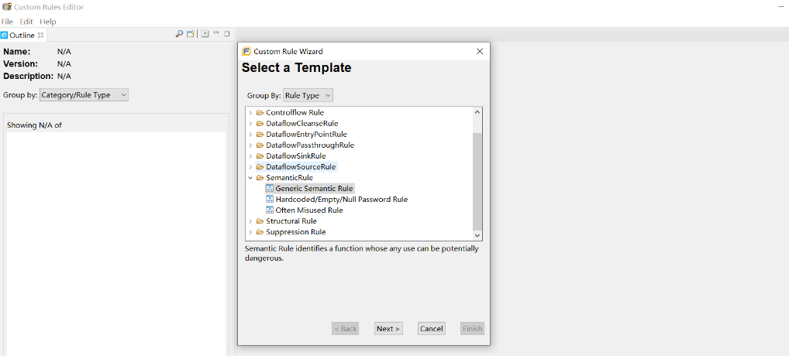

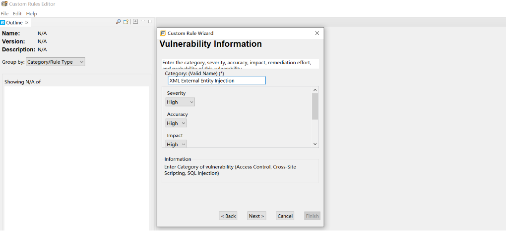

最初生成的规则如下所示：

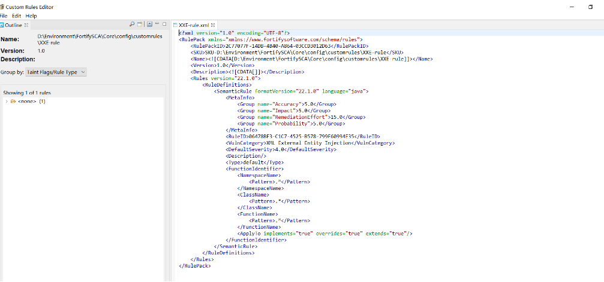

随后按照模板进行调整更改，注意这里的RuleId不可更改，替换后如下：

```
<?xml version="1.0" encoding="UTF-8"?>
<RulePack xmlns="xmlns://www.fortifysoftware.com/schema/rules">
    <RulePackID>2C77077F-14DB-4B40-A864-03CCD3012D63</RulePackID>
    <SKU>SKU-D:\Environment\FortifySCA\Core\config\customrules\XXE-rule</SKU>
    <Name><![CDATA[D:\Environment\FortifySCA\Core\config\customrules\XXE-rule]]></Name>
    <Version>1.0</Version>
    <Description><![CDATA[]]></Description>
    <Rules version="22.1.0">
        <RuleDefinitions>
            <ControlflowRule formatVersion="22.1.0" language="java">
            <MetaInfo></MetaInfo>
            <RuleID>06478BF3-C1C7-4525-B578-799F60994E35</RuleID>
            <VulnCategory>XML External Entity Injection</VulnCategory>
            <DefaultSeverity>4.0</DefaultSeverity>
            <Description ref="desc.controlflow.java.xxe_injection"/>
            <FunctionIdentifier>
               <NamespaceName>
                 <Pattern>.*</Pattern>
               </NamespaceName>
               <ClassName>
                  <Pattern>.*</Pattern>
                </ClassName>
                <FunctionName>
                   <Pattern>.*</Pattern>
                </FunctionName>
                <ApplyTo implements="true" overrides="true" extends="true"/>
             </FunctionIdentifier>
              <ControlflowRuleFlag flagValue="false">end-of-function matches nonreturning functions</ControlflowRuleFlag>
   			 <Definition><![CDATA[
                  state Unallocated (start);
                  state Allocated;
                  state Deallocated;
                  state Leaked;var resource;
                  Unallocated -> Allocated { resource = allocate(…) }
                  Allocated -> Deallocated { deallocate(resource) }
                  Allocated -> Leaked { #end_scope(resource) } 
              ]]></Definition>
           </ControlflowRule>
        </RuleDefinitions>
    </Rules>
</RulePack>
```

​

下面开始调整：

##### 第一阶段：函数匹配

在这个环节我们需要对之前我们看到的三个位置的函数进行一个定义和匹配处理，比如下面的factory，它是应用的包javax.xml.parsers.SAXParserFactory中的newInstance方法进行的创建操作，同时期间还伴随着init操作：

​

```
SAXParserFactory factory = SAXParserFactory.newInstance();
```

于是乎我们构造如下的结构来进行匹配上述的关联操作：

​

```
                <FunctionIdentifier id="createFactoryA">
                    <NamespaceName>
                        <Pattern>javax.xml.parsers</Pattern>
                    </NamespaceName>
                    <ClassName>
                        <Pattern>SAXParserFactory</Pattern>
                    </ClassName>
                    <FunctionName>
                        <Value>init^</Value>
                    </FunctionName>
                    <ApplyTo implements="true" overrides="true" extends="true"/>
                </FunctionIdentifier>
                <FunctionIdentifier id="createFactoryB">
                    <NamespaceName>
                        <Pattern>javax.xml.parsers</Pattern>
                    </NamespaceName>
                    <ClassName>
                        <Pattern>SAXParserFactory</Pattern>
                    </ClassName>
                    <FunctionName>
                        <Value>newInstance</Value>
                    </FunctionName>
                    <ApplyTo implements="true" overrides="true" extends="true"/>
                </FunctionIdentifier>
```

这里的FunctionIdentifier为第一个，第N个函数方法的定义，其中的<NamespaceName>指明命名空间，根据具体的包来定义， <ClassName>则为类名，</FunctionName>则为方法名称，其中的id需要注意坐区分处理，后续的状态机的定义需要使用到，最终我们完成上面的三个部分的定义之后，规则如下：

​

```
<?xml version="1.0" encoding="UTF-8"?>
<RulePack xmlns="xmlns://www.fortifysoftware.com/schema/rules">
    <RulePackID>2C77077F-14DB-4B40-A864-03CCD3012D63</RulePackID>
    <SKU>SKU-D:\Environment\FortifySCA\Core\config\customrules\XXE-rule</SKU>
    <Name><![CDATA[D:\Environment\FortifySCA\Core\config\customrules\XXE-rule]]></Name>
    <Version>1.0</Version>
    <Description><![CDATA[]]></Description>
    <Rules version="22.1.0">
        <RuleDefinitions>
            <ControlflowRule formatVersion="22.1.0" language="java">
            <MetaInfo></MetaInfo>
            <RuleID>06478BF3-C1C7-4525-B578-799F60994E35</RuleID>
            <VulnCategory>XML External Entity Injection</VulnCategory>
            <DefaultSeverity>4.0</DefaultSeverity>
            <Description ref="desc.controlflow.java.xxe_injection"/>
            <FunctionIdentifier id="createFactoryA">
                 <NamespaceName>
                      <Pattern>javax.xml.parsers</Pattern>
                 </NamespaceName>
                 <ClassName>
                      <Pattern>SAXParserFactory</Pattern>
                 </ClassName>
                 <FunctionName>
                      <Value>init^</Value>
                 </FunctionName>
                 <ApplyTo implements="true" overrides="true" extends="true"/>
             </FunctionIdentifier>
             <FunctionIdentifier id="createFactoryB">
                  <NamespaceName>
                    	<Pattern>javax.xml.parsers</Pattern>
                  </NamespaceName>
                  <ClassName>
                        <Pattern>SAXParserFactory</Pattern>
                  </ClassName>
                  <FunctionName>
                        <Value>newInstance</Value>
                   </FunctionName>
                  <ApplyTo implements="true" overrides="true" extends="true"/>
             </FunctionIdentifier>
             <FunctionIdentifier id="createParserA">
                   <NamespaceName>
                   <Pattern>javax.xml.parsers</Pattern>
                   </NamespaceName>
                   <ClassName>
                       <Pattern>SAXParserFactory</Pattern>
                   </ClassName>
                   <FunctionName>
                       <Value>newSAXParser</Value>
                   </FunctionName>
                   <ApplyTo implements="true" overrides="true" extends="true"/>
                </FunctionIdentifier>
                <FunctionIdentifier id="ParserA">
                    <NamespaceName>
                        <Pattern>javax.xml.parsers</Pattern>
                    </NamespaceName>
                    <ClassName>
                        <Pattern>SAXParser</Pattern>
                    </ClassName>
                    <FunctionName>
                        <Value>parse</Value>
                    </FunctionName>
                    <ApplyTo implements="true" overrides="true" extends="true"/>
                </FunctionIdentifier>
              <ControlflowRuleFlag flagValue="false">end-of-function matches nonreturning functions</ControlflowRuleFlag>
   			 <Definition><![CDATA[
                  state Unallocated (start);
                  state Allocated;
                  state Deallocated;
                  state Leaked;var resource;
                  Unallocated -> Allocated { resource = allocate(…) }
                  Allocated -> Deallocated { deallocate(resource) }
                  Allocated -> Leaked { #end_scope(resource) } 
              ]]></Definition>
           </ControlflowRule>
        </RuleDefinitions>
    </Rules>
</RulePack>
```

##### 第二阶段：写状态机

下面我们开始来写状态机，所谓的状态机其实说白了就是对程序源代码中某种数据类型的数据从一种状态到另外一种状态的转变，下面我们简单的画一下上述源代码中XXE的状态的转变：

```
start ——> factory = SAXParserFactory.newInstance();
     ——>  factory.newSAXParser();
	 ——>  parser.parse(xmlInput, handler);
```

下面我们开始编写后续的状态机内容：

```
              <Definition><![CDATA[
                state start (start);
                state newFactory: "statedesc.java.newxmlfactory";
                state newParser: "statedesc.java.newxmlparser";
                state use_without_xxe_avoidance_config(error) : "statedesc.java.parsexml.external.entities.allowed";
                
                var factory;
                var parser;

                start -> newFactory {factory = $createFactoryA(...) }
                newFactory -> newParser {parser = factory.$createParserA(...)}
                newParser -> use_without_xxe_avoidance_config{ parser.$ParserA(...) }
            ]]></Definition>
```

​

最终输出规则如下：

​

```
<?xml version="1.0" encoding="UTF-8"?>
<RulePack xmlns="xmlns://www.fortifysoftware.com/schema/rules">
    <RulePackID>2C77077F-14DB-4B40-A864-03CCD3012D63</RulePackID>
    <SKU>SKU-D:\Environment\FortifySCA\Core\config\customrules\XXE-rule</SKU>
    <Name><![CDATA[D:\Environment\FortifySCA\Core\config\customrules\XXE-rule]]></Name>
    <Version>1.0</Version>
    <Description><![CDATA[]]></Description>
    <Rules version="22.1.0">
        <RuleDefinitions>
            <ControlflowRule formatVersion="22.1.0" language="java">
            <MetaInfo></MetaInfo>
            <RuleID>06478BF3-C1C7-4525-B578-799F60994E35</RuleID>
            <VulnCategory>XML External Entity Injection</VulnCategory>
            <DefaultSeverity>4.0</DefaultSeverity>
            <Description ref="desc.controlflow.java.xxe_injection"/>
             <FunctionIdentifier id="createFactoryA">
                  <NamespaceName>
                    	<Pattern>javax.xml.parsers</Pattern>
                  </NamespaceName>
                  <ClassName>
                        <Pattern>SAXParserFactory</Pattern>
                  </ClassName>
                  <FunctionName>
                        <Value>newInstance</Value>
                   </FunctionName>
                  <ApplyTo implements="true" overrides="true" extends="true"/>
             </FunctionIdentifier>
             <FunctionIdentifier id="createParserA">
                   <NamespaceName>
                   <Pattern>javax.xml.parsers</Pattern>
                   </NamespaceName>
                   <ClassName>
                       <Pattern>SAXParserFactory</Pattern>
                   </ClassName>
                   <FunctionName>
                       <Value>newSAXParser</Value>
                   </FunctionName>
                   <ApplyTo implements="true" overrides="true" extends="true"/>
                </FunctionIdentifier>
                <FunctionIdentifier id="ParserA">
                    <NamespaceName>
                        <Pattern>javax.xml.parsers</Pattern>
                    </NamespaceName>
                    <ClassName>
                        <Pattern>SAXParser</Pattern>
                    </ClassName>
                    <FunctionName>
                        <Value>parse</Value>
                    </FunctionName>
                    <ApplyTo implements="true" overrides="true" extends="true"/>
                </FunctionIdentifier>
              <ControlflowRuleFlag flagValue="false">end-of-function matches nonreturning functions</ControlflowRuleFlag>
              <Definition><![CDATA[
                state start (start);
                state newFactory: "statedesc.java.newxmlfactory";
                state newParser: "statedesc.java.newxmlparser";
                state use_without_xxe_avoidance_config(error) : "statedesc.java.parsexml.external.entities.allowed";
                
                var factory;
                var parser;

                start -> newFactory {factory = $createFactoryA(...) }
                newFactory -> newParser {parser = factory.$createParserA(...)}
                newParser -> use_without_xxe_avoidance_config{ parser.$ParserA(...) }
            ]]></Definition>
           </ControlflowRule>
        </RuleDefinitions>
    </Rules>
</RulePack>
```

#### **规则扫描**

##### **漏洞情况**

下面我们对上面的规则进行扫描应用，看看使用上述规则对存在漏洞的代码执行扫描时的具体效果：

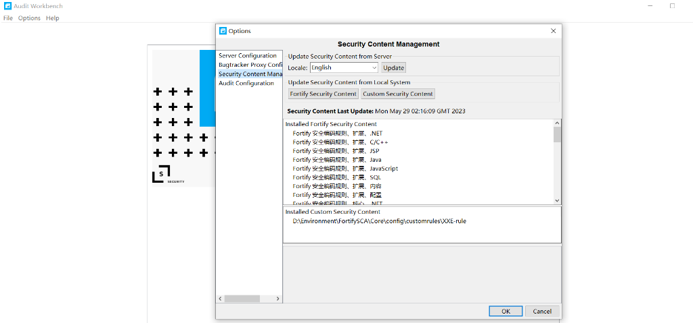

执行扫描：

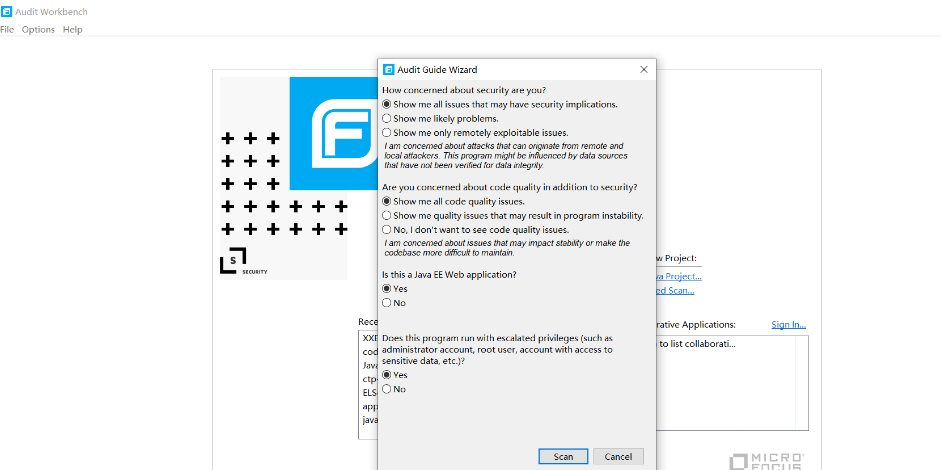

扫描结果如下所示：

​

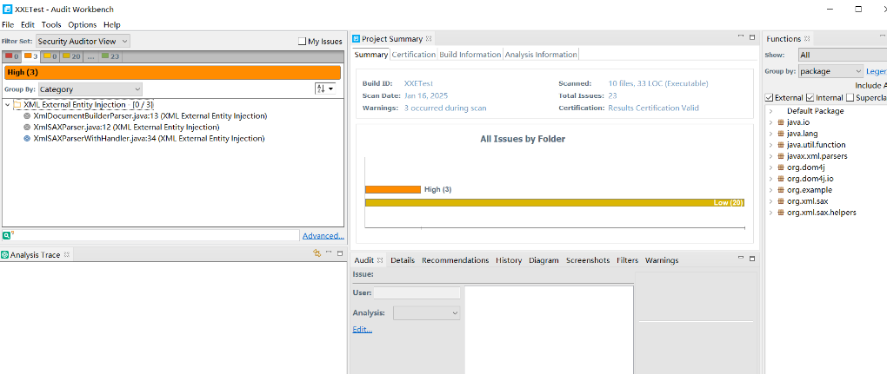

随后我们看扫描出来的XML中是否有我们的规则检测到的，主要的确定方法为查看其中的Ruleid是否和我们自定义规则中的RuleId是否一致：

​

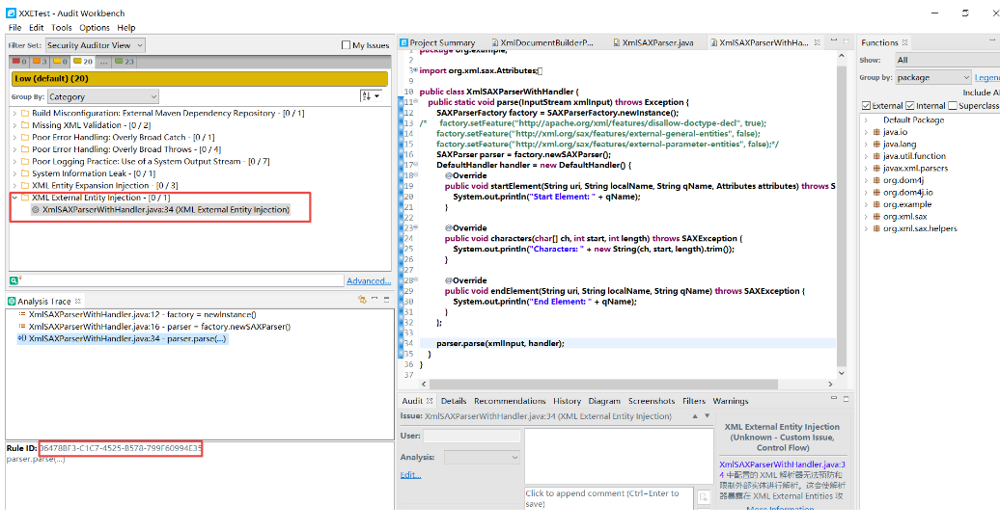

##### 安全代码

下面我们更改上述的源代码为下面的代码：

​

```
package org.example;

import org.xml.sax.Attributes;
import org.xml.sax.SAXException;
import org.xml.sax.helpers.DefaultHandler;
import javax.xml.parsers.SAXParser;
import javax.xml.parsers.SAXParserFactory;
import java.io.InputStream;

public class XmlSAXParserWithHandler {
    public static void parse(InputStream xmlInput) throws Exception {
        SAXParserFactory factory = SAXParserFactory.newInstance();
        factory.setFeature("http://apache.org/xml/features/disallow-doctype-decl", true);
        factory.setFeature("http://xml.org/sax/features/external-general-entities", false);
        factory.setFeature("http://xml.org/sax/features/external-parameter-entities", false);
        SAXParser parser = factory.newSAXParser();
        DefaultHandler handler = new DefaultHandler() {
            @Override
            public void startElement(String uri, String localName, String qName, Attributes attributes) throws SAXException {
                System.out.println("Start Element: " + qName);
            }

            @Override
            public void characters(char[] ch, int start, int length) throws SAXException {
                System.out.println("Characters: " + new String(ch, start, length).trim());
            }

            @Override
            public void endElement(String uri, String localName, String qName) throws SAXException {
                System.out.println("End Element: " + qName);
            }
        };

        parser.parse(xmlInput, handler);
    }
}

```

随后我们对不存在风险的安全代码执行扫描操作，发现存在误报问题......

​

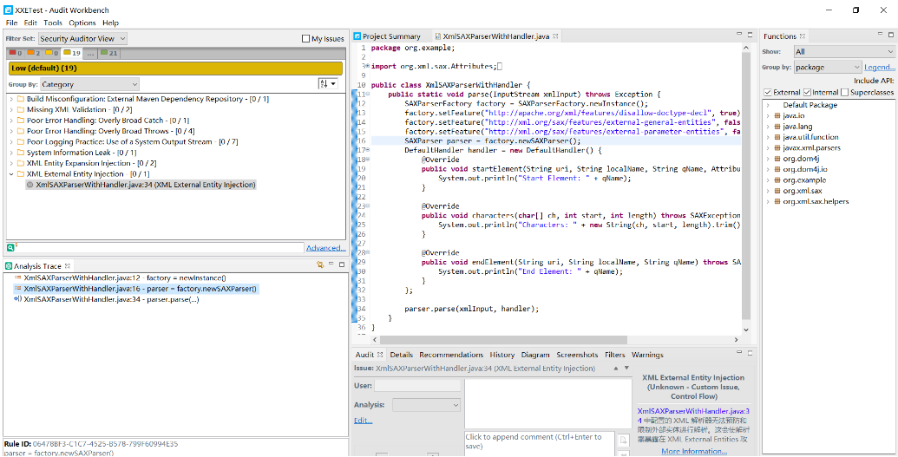

​

#### 规则优化

从上面的扫描结果我们发现有一下几个点：

1、误报问题：扫描结果存在误报的情况，目前知识匹配到了各个状态而已

2、漏洞级别：目前漏洞级别统一到了Low级别中并非我们预期的，我们需要对其进行更改，使其转为Hig

3、修复建议：目前漏洞扫描完成后并未规范化相关的漏洞描述和漏洞修复处置方案，需要应用官方或者自定义

下面分别进行调优：

##### 误报问题

关于误报问题的处理我们可以看到这里其实是增加了一个factory.setFeature(xxxx)操作，而我们的状态机中并没有相关的描述，只有一个未使用任何防护的描述，下面我们进行二次更改：

```
                <Definition><![CDATA[
                state start (start);
                state newFactory: "statedesc.java.newxmlfactory";
                state newParser: "statedesc.java.newxmlparser";
                state xxe_avoidance_config;
                state use_without_xxe_avoidance_config(error) : "statedesc.java.parsexml.external.entities.allowed";
                
                var factory;
                var parser;

                start -> newFactory {factory = $createFactoryA(...) }
                newFactory -> xxe_avoidance_config { factory.$validateSetA(...) }
                newFactory -> newParser {parser = factory.$createParserA(...)}
                newParser -> use_without_xxe_avoidance_config{ parser.$ParserA(...) }
            ]]></Definition>
```

​

随后我们进行二次扫描，可以看到一则被移除

​

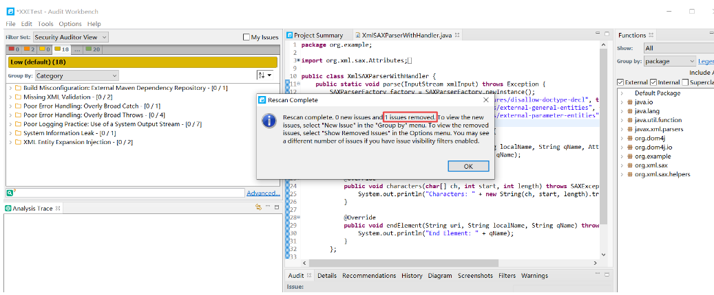

备注：这里在更改状态机内容的时候我们引入了一个validateSetA，所以我们还需要添加一个函数调用的声明

​

```
                <FunctionCallIdentifier id="validateSetA">
                    <FunctionIdentifier>
                        <NamespaceName>
                            <Pattern>javax.xml.parsers</Pattern>
                        </NamespaceName>
                        <ClassName>
                            <Pattern>SAXParserFactory</Pattern>
                        </ClassName>
                        <FunctionName>
                            <Value>setFeature</Value>
                        </FunctionName>
                        <ApplyTo implements="true" overrides="true" extends="true"/>
                    </FunctionIdentifier>
                    <Conditional>
                        <And>
                            <ConstantEq argument="0"
                                value="http://apache.org/xml/features/disallow-doctype-decl" mode="value"/>
                            <ConstantEq argument="1" value="true" mode="value"/>
                        </And>
                    </Conditional>
              </FunctionCallIdentifier>
```

​

##### 漏洞级别

漏洞的级别我们可以通过MetaInfo来定义：

​

```
            <MetaInfo>
                  <Group name="Accuracy">1.0</Group>
                  <Group name="Impact">4.0</Group>
                  <Group name="Probability">3.0</Group>
            </MetaInfo>
```

简易说明如下：

1、Accuracy：准确性，可选范围为0-5

* 0：完全不准确，几乎不会检测到真正的漏洞，可能会产生大量误报
* 1-2：低准确性，可能存在相当多的误报或漏报
* 3：中等准确性，能够检测出一些真实问题，但也可能有一定数量的误报
* 4-5：高准确性，能够有效地识别真实的安全问题，误报率较低

2、Impact：影响力，可选范围0-5

* 0：没有影响，若漏洞被利用，对系统没有任何实际威胁
* 1-2：低影响力，漏洞可能造成小规模的问题或者损失
* 3：中等影响力，漏洞可能导致显著的问题，需要关注
* 4-5：高影响力，漏洞如果被利用将会造成严重的后果，如数据泄露、系统崩溃等

3、Probability：发生概率，可选范围0-5

* 0：几乎不可能发生的漏洞
* 1-2：低概率，不太可能被攻击者利用
* 3：中等概率，有一定可能性被攻击者利用
* 4-5：高概率，容易被攻击者利用，尤其是在特定场景下

##### 修复建议

修复建议我们这里直接应用官方的建议接口进行描述：

```
<Description ref="desc.controlflow.java.xxe_injection"/>
```

#### **最终结果**

最后在完成上述的改造之后我们输出最终的规则如下：

​

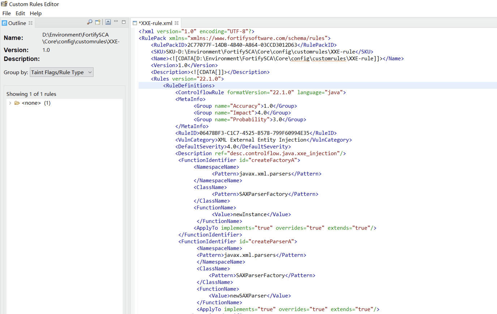

随后执行扫描操作：

(1) 安全代码扫描——误报解决

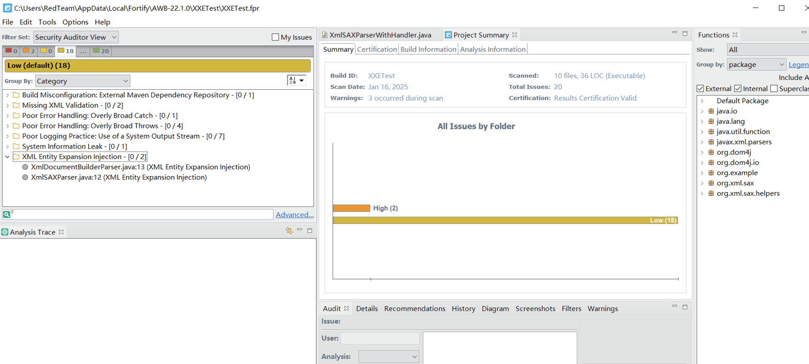

(2) 风险代码——可以识别漏洞风险

​

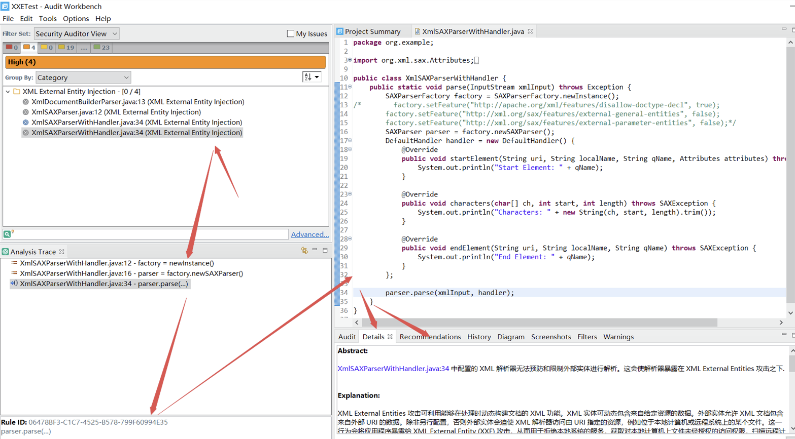

#### 文末小结

本篇文章主要介绍了如何使用Fortify的控制流规则来编写类似流程化的自定义扫描规则，同时给出了相关的调优思路，建议读者根据具体的风险代码以及风险类型进行编写对应的漏洞扫描规则，同时需要注意的是不能只去匹配存在漏洞的代码，也要看对于不存在漏洞或者添加的防护措施的漏洞代码的检测效果综合来评估一个规则的完成度~
