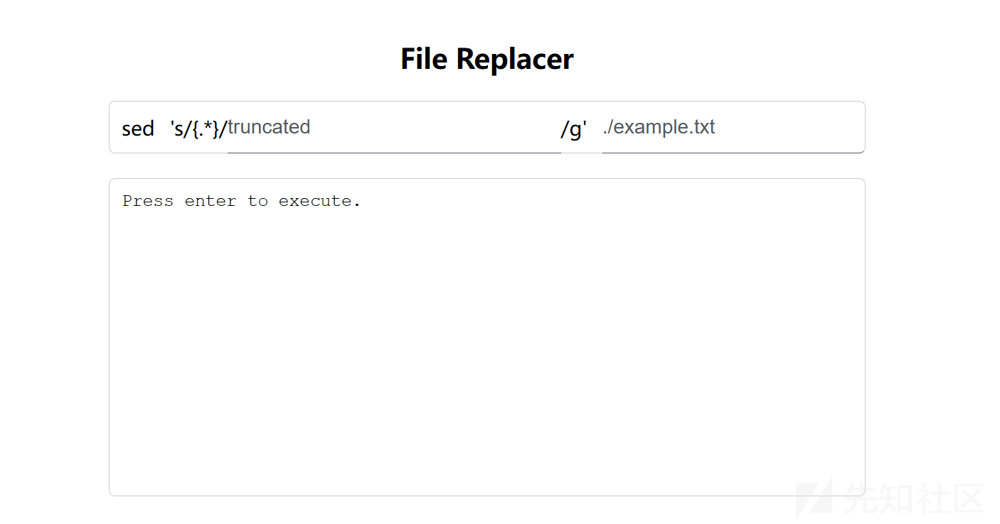
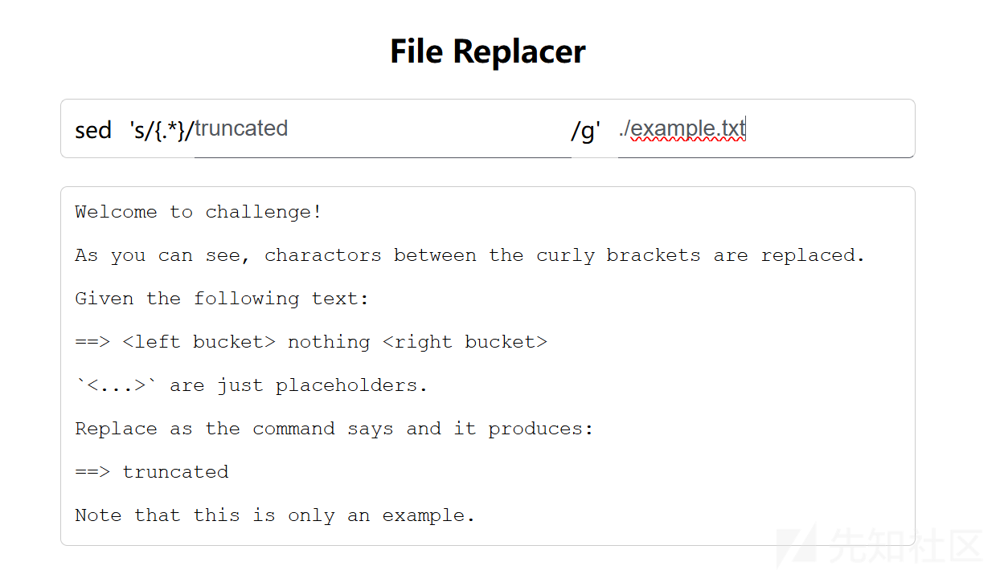
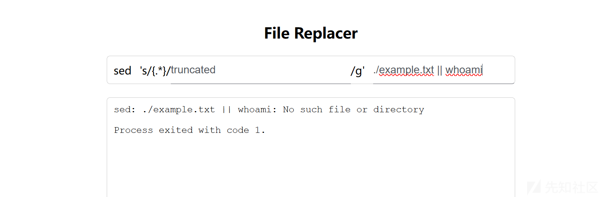
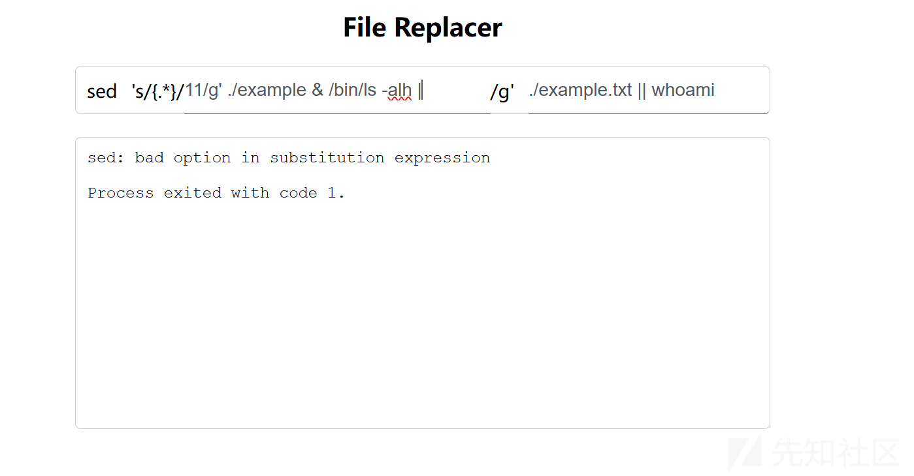
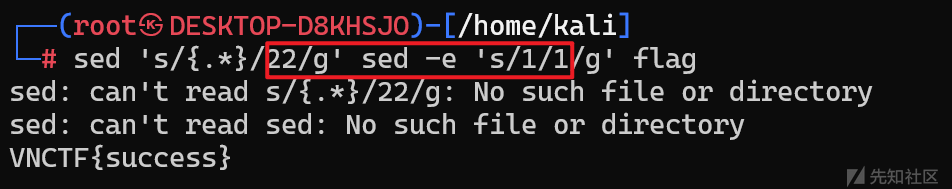
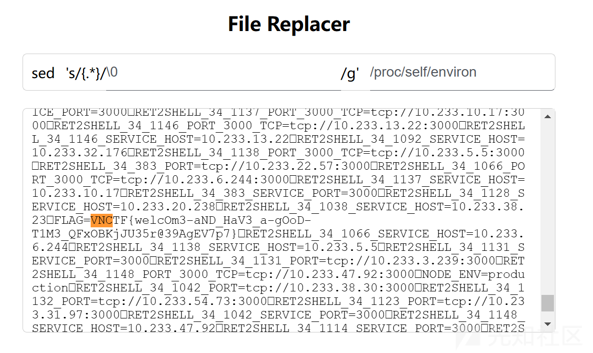
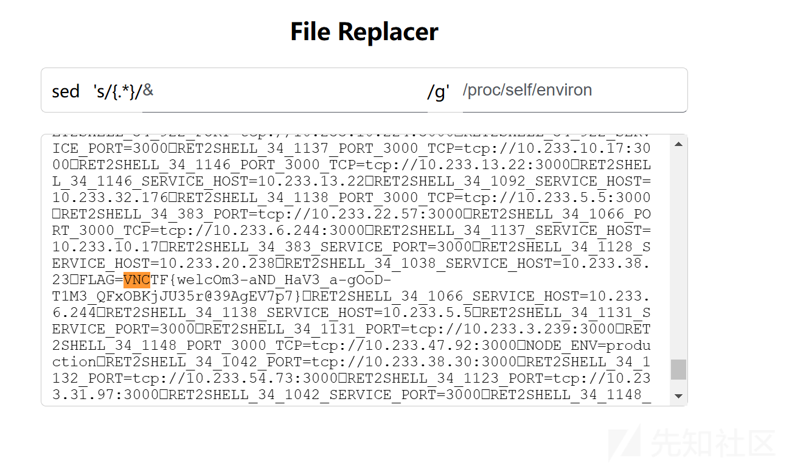

# ctf中sed替换内容的利用技巧-先知社区

> **来源**: https://xz.aliyun.com/news/16794  
> **文章ID**: 16794

---



题目开始是这样的，让我们按下回车，



可以知道大概意思就是读取一个文件

然后把里面被{}包裹的字符替换成填入的字符，现在的nothing就被替换成了truncated

一开始我想的是命令注入，但是发现怎么拼接都会有错。



或者是



总之试了很多次都不能实现命令注入

看这道题前端的js代码是如何处理的

```
(()=>{let t=!1;var e=document.querySelectorAll("input");let n=document.querySelector('input[name="pattern"]'),r=document.querySelector('input[name="file"]'),o=e=>{document.querySelector("#output").innerText=e},a=async e=>{e=new Uint8Array(e).buffer;return(new TextDecoder).decode(e)},d=(e,t)=>`${e}${e.endsWith("
")?"":"
"}
`+t;e.forEach(e=>e.addEventListener("keydown",function(e){13!==e.keyCode||t||(t=!0,fetch(window.location.href,{method:"POST",headers:{"Content-Type":"application/x-www-form-urlencoded"},body:new URLSearchParams({pattern:n.value,file:r.value})}).then(async e=>{if(!e.ok)throw new Error(d(await e.text(),`Server responded with status ${e.status}.`));e=await e.json();0===e.exit?o(await a(e.stdout),e.exit):o(d(await a(e.stderr),`Process exited with code ${e.exit}.`))}).catch(e=>{o(e.message)}))})),e.forEach(e=>e.addEventListener("keyup",function(e){13===e.keyCode&&(t=!1)}))})()
```

这段 JavaScript 代码的功能是在用户在输入框中按下回车键时，向当前页面的服务器发送一个 `POST` 请求。请求的内容包括用户输入的文件名和匹配模式。根据服务器的响应，它会更新页面上的输出内容。具体来说，这段代码的作用可以分解为以下几个步骤：

### 代码解析：

1. **变量定义与初始化**：

* `t` 是一个布尔变量，用来防止在短时间内多次触发回车键事件。
* `e` 是页面上所有的 `<input>` 元素。
* `n` 是页面中 `name="pattern"` 的输入框，可能用于用户输入的匹配模式。
* `r` 是页面中 `name="file"` 的输入框，可能用于用户输入的文件名。

2. `o` **函数**：  
    用于更新页面上的输出，具体是把给定的内容显示在 `#output` 元素内。
3. `a` **函数**：  
    将返回的 `Uint8Array` 数据解码为字符串，通常用于处理服务器返回的二进制数据。
4. `d` **函数**：  
    生成一个带有换行符的字符串，用于格式化输出。如果传入的字符串已经以换行符结尾，它不会再加上额外的换行符。
5. **事件监听与处理**：

* 对所有 `input` 元素添加了 `keydown` 和 `keyup` 事件监听器。
* `keydown` **事件**：当用户按下回车键（键码 13）时，如果 `t` 为 `false`（表示没有正在处理请求），就会发送一个 `POST` 请求到当前页面的 URL。请求体包含了输入框 `pattern` 和 `file` 的值。
* `keyup` **事件**：当用户松开回车键时，将 `t` 设为 `false`，表示可以再次发送请求。

6. **请求与响应处理**：

* 发送的 `POST` 请求会传递 `pattern` 和 `file` 两个参数。
* 如果响应成功（

```
response.ok
```

为真），它会解析返回的 JSON 数据，并检查

```
exit
```

状态码：

* 如果 `exit` 为 `0`，表示正常退出，显示 `stdout`（标准输出）。
* 如果 `exit` 不是 `0`，表示程序错误，显示 `stderr`（错误输出）。

* 如果请求失败（例如，网络错误或服务器返回错误），则会捕获错误并显示错误信息。

### 原理分析：

那么这里我个人推测一下为什么不能够进行命令执行注入呢？

我认为是先把后面的即路径，先判断这个路径是否存在，若这个路径存在，再执行sed

那么如果我们从中间即替换的内容进行命令注入，后面的引号需要闭合，同时也需要换行，虽然在web中是无法执行的，但是在linux中可以实现



红色的框框为注入的部分，web中无法执行可能是因为接受到了一个错的，就不会再执行下去，而终端则不会

## 下面是正确的解法

### 方法 1: 使用空字符串替换

你可以用一个空字符串替换匹配到的内容，但并不改变实际的输入。这样，`sed` 会执行替换操作，但实际上内容并没有发生改变。

例如：

```
sed 's/{.*}/\0/g'
```

在这个例子中：

* `s/{.*}/\0/g` 是 `sed` 的替换命令。
* `{.*}` 会匹配以 `{` 开头并以 `}` 结尾的所有内容。
* `\0` 是一个“捕获组”，但是没有定义捕获组，因此替换实际上不会做任何改变。

这种方式实际上是“无操作”的替换，尽管 `sed` 会识别并匹配 `{.*}`，它并不会修改文件内容。



### 方法 2: 使用 `&` 作为替换部分

另一个常见技巧是，使用 `&` 代表匹配到的内容作为替换部分，这样即使匹配到某些内容，它也会用自己来替换，从而保持原样。

例如：

```
sed 's/{.*}/&/g'
```

解释：

* `s/{.*}/&/g` 会将匹配到的 `{.*}` 用匹配到的内容 `&` 替换。
* 由于 `&` 会被替换成匹配到的原始内容，所以实际上不会有任何变化。


