# Rust逆向之程序启动-先知社区

> **来源**: https://xz.aliyun.com/news/16797  
> **文章ID**: 16797

---

本文通过对以下最简单的代码程序进行逆向，分析Rust在执行main函数之前执行的代码，来学习Rust语言。

```
fn main() {
    println!("Hello World");
}
```

以下是编译所用的Rust版本，不知道后续更新会不会导致本文的一些信息不一样。

```
PS C:\Users\admin> rustc --version
rustc 1.76.0 (07dca489a 2024-02-04)
```

# 1.基本PE信息

首先可以看到VC++8.0，猜测Rust编译器可能内置了VC++8.0的编译器：

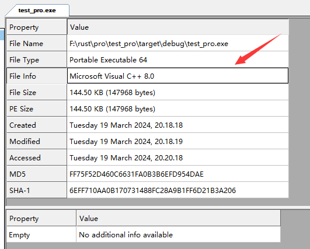

DOSHeader和FileHeader没看到有什么特别的，从OptionHeader可以知道程序的入口地址是0x140018A70。

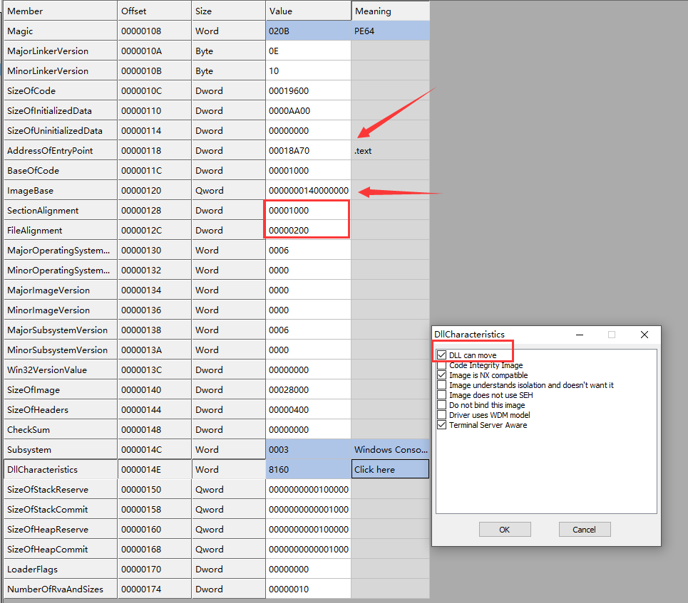

这里比较特别的就是FileAlignment为0x200，而C/C++编译器编译出来的文件一般为0x400和0x1000，而64位的程序基本都是0x1000。这里应该是Rust做了优化，来缩小文件的大小。另外可以看到，基址随机化打开了，这里可以关掉方便后续调试。

在Data Directories这里可以看到，Rust编译出来的程序有TLS表，所以可以想到，在执行main函数之前可能执行了TLS回调函数：

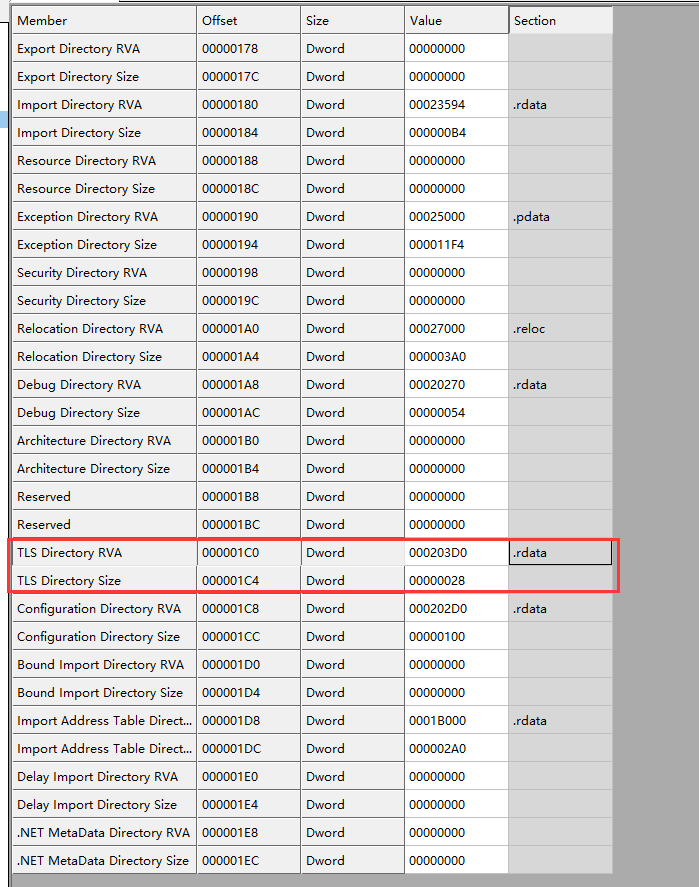

节区这里没什么特别的，这里看出Rust不像Go会增加什么额外的节区：

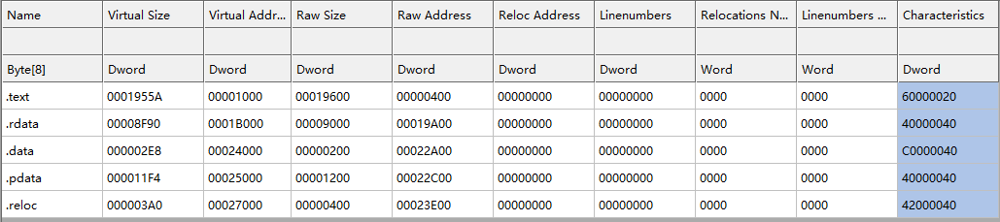

而导入表这里可以看到，Rust程序会导入一些Rust专有的Dll和函数：

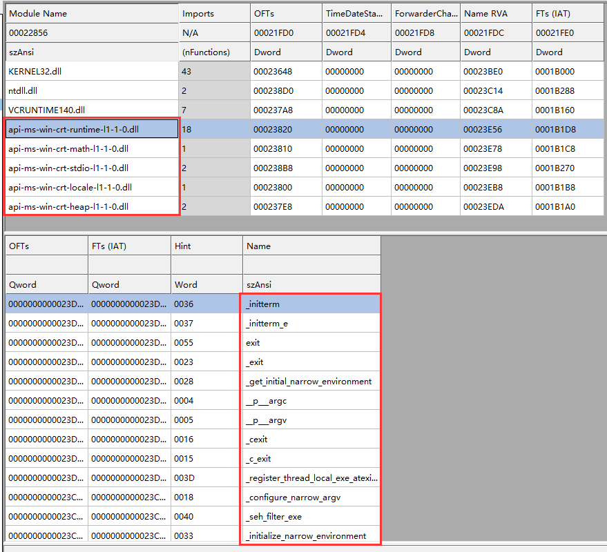

以下是TLS表信息，这里可以看到保存TLS回调函数的地址：

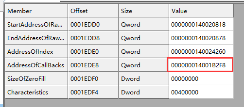

# 2.静态调试

根据保存TLS回调函数地址，可以找到要执行的TLS回调函数，这里可以看到只需要执行\_ZN3std3sys7windows16thread\_local\_key15on\_tls\_callback17hd83a98723c50bb8aE这个回调函数：

```
.rdata:000000014001B2F8 ; std::sys::windows::thread_local_key::p_thread_callback::hb507c5610d52a3f6
.rdata:000000014001B2F8 _ZN3std3sys7windows16thread_local_key17p_thread_callback17hb507c5610d52a3f6E dq offset _ZN3std3sys7windows16thread_local_key15on_tls_callback17hd83a98723c50bb8aE ; std::sys::windows::thread_local_key::on_tls_callback::hd83a98723c50bb8a
```

这个回调函数会在经过一些判断以后，决定是否执行std\_\_sys\_\_windows\_\_thread\_local\_key\_\_run\_keyless\_dtors这个函数。但是经过动态调试，发现会在上一个判断跳转。也就是说第二个参数不等于3，导致跳转，不执行这个函数。

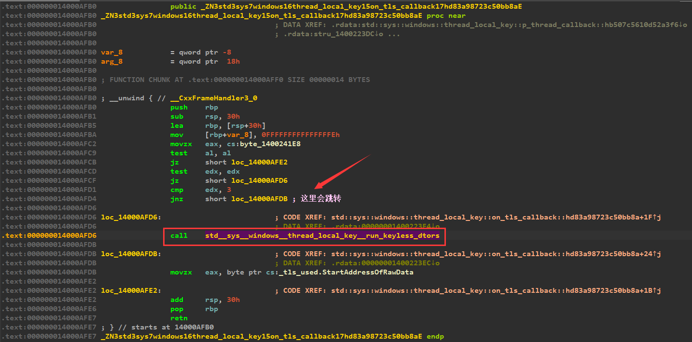

接下来就会执行入口函数mainCRTStartup，这里会首先调用\_\_security\_init\_cookie函数，这个函数会根据时间，进程PID和线程PID来设置cookie，随后跳转到\_\_scrt\_common\_main\_seh函数执行：

```
.text:0000000140018A70 ; int __fastcall mainCRTStartup()
.text:0000000140018A70                 public mainCRTStartup
.text:0000000140018A70 mainCRTStartup  proc near               ; DATA XREF: .pdata:0000000140025F6C↓o
.text:0000000140018A70                                         ; .pdata:0000000140025F78↓o
.text:0000000140018A70                 sub     rsp, 28h
.text:0000000140018A74                 call    __security_init_cookie ; 设置cookie
.text:0000000140018A79                 add     rsp, 28h
.text:0000000140018A7D                 jmp     __scrt_common_main_seh
.text:0000000140018A7D mainCRTStartup  endp
```

\_\_scrt\_common\_main\_seh函数，会首先调用一些Rust自定义的函数(包括上面说的自定义的.dll中的函数)进行一些设置。随后获取argc和argv作为参数来调用main函数：

```
.text:00000001400189DE                 call    __p___argv_0
.text:00000001400189E3                 mov     rdi, [rax]
.text:00000001400189E6                 call    __p___argc_0
.text:00000001400189EB                 mov     rbx, rax
.text:00000001400189EE                 call    _get_initial_narrow_environment_0
.text:00000001400189F3                 mov     r8, rax         ; envp
.text:00000001400189F6                 mov     rdx, rdi        ; argv
.text:00000001400189F9                 mov     ecx, [rbx]      ; argc
.text:00000001400189FB                 call    main
.text:0000000140018A00                 mov     ebx, eax
```

main函数会调用std::rt::lang\_start::h09171374b7c116e9函数，其中第一个参数就是编写Rust函数的时候写的fn main()函数的地址。从这可以看出Rust将它重命名为"文件名\_\_main"这样一个函数名。然后第二个和第三个参数则分别是argc和argv，最后第四个参数则为0：

```
.text:0000000140001240 ; int __fastcall main(int argc, const char **argv, const char **envp)
.text:0000000140001240 main            proc near               ; CODE XREF: __scrt_common_main_seh+107↓p
.text:0000000140001240                                         ; DATA XREF: .pdata:0000000140025084↓o
.text:0000000140001240                 sub     rsp, 28h
.text:0000000140001244                 mov     r8, rdx         ; unsigned __int8 **
.text:0000000140001247                 movsxd  rdx, ecx        ; __int64
.text:000000014000124A                 lea     rcx, test_pro__main ; void (__fastcall *)()
.text:0000000140001251                 xor     r9d, r9d        ; unsigned __int8
.text:0000000140001254                 call    _ZN3std2rt10lang_start17h09171374b7c116e9E ; std::rt::lang_start::h09171374b7c116e9
.text:0000000140001259                 nop
.text:000000014000125A                 add     rsp, 28h
.text:000000014000125E                 retn
.text:000000014000125E main            endp
```

std::rt::lang\_start::h09171374b7c116e9函数则会将参数赋值到args数组中。然后将其地址作为第一个参数，并将impl\_\_std::rt::lang\_start::closure\_env\_0\_tuple\_\_\_\_\_\_\_core::ops::function::Fn\_tuple\_\_\_\_\_\_\_::vtable\_数组地址作为第二个参数，调用std::rt::lang\_start\_internal::h68f55995b3e4e811函数。这里不知道为什么test\_pro\_\_main函数地址会被赋值两次，不过这里只要记得args数组第一个元素是test\_pro\_\_main函数地址就行。

```
__int64 __fastcall std::rt::lang_start::h09171374b7c116e9(
        void (__fastcall *test_pro__main)(),
        __int64 arg0,
        unsigned __int8 **argv,
        byte a4)
{
  byte args[40]; // [rsp+38h] [rbp-30h] BYREF

  *(_QWORD *)&args[8] = test_pro__main;
  *(_QWORD *)&args[0x10] = arg0;
  *(_QWORD *)&args[0x18] = argv;
  args[0x27] = a4;
  *(_QWORD *)args = test_pro__main;
  return std::rt::lang_start_internal::h68f55995b3e4e811(
           (__int64)args,
           (__int64)&impl__std::rt::lang_start::closure_env_0_tuple_______core::ops::function::Fn_tuple_______::vtable_);
}
```

impl\_\_std::rt::lang\_start::closure\_env\_0\_tuple\_\_\_\_\_\_\_core::ops::function::Fn\_tuple\_\_\_\_\_\_\_::vtable\_数组中保存了一些函数的地址，这里需要注意最后一个函数，因为后面会执行它：

```
.rdata:000000014001B3B8 ; impl$<std::rt::lang_start::closure_env$0<tuple$<> >, core::ops::function::Fn<tuple$<> > >::vtable_type$ impl__std::rt::lang_start::closure_env_0_tuple_______core::ops::function::Fn_tuple_______::vtable_
.rdata:000000014001B3B8 impl$_std__rt__lang_start__closure_env$0_tuple$______core__ops__function__Fn_tuple$________vtable$ impl$<std::rt::lang_start::closure_env$0<tuple$<> >, core::ops::function::Fn<tuple$<> > >::vtable_type$ <offset _ZN4core3ptr85drop_in_place$LT$std__rt__lang_start$LT$$LP$$RP$$GT$__$u7b$$u7b$closure$u7d$$u7d$$GT$17hc6641ac3297587c8E,\
.rdata:000000014001B3B8                                         ; DATA XREF: std::rt::lang_start::h09171374b7c116e9+2A↑o
.rdata:000000014001B3B8                                                                                                                          8,\ ; core::ptr::drop_in_place$LT$std..rt..lang_start$LT$$LP$$RP$$GT$..$u7b$$u7b$closure$u7d$$u7d$$GT$::hc6641ac3297587c8
.rdata:000000014001B3B8                                                                                                                          8,\
.rdata:000000014001B3B8                                                                                                                          offset _ZN4core3ops8function6FnOnce40call_once$u7b$$u7b$vtable_shim$u7d$$u7d$17h60ff440d686890ddE,\
.rdata:000000014001B3B8                                                                                                                          offset _ZN3std2rt10lang_start28_$u7b$$u7b$closure$u7d$$u7d$17h37c065078fbc660eE,\
.rdata:000000014001B3B8                                                                                                                          offset _ZN3std2rt10lang_start28_$u7b$$u7b$closure$u7d$$u7d$17h37c065078fbc660eE>
```

std::rt::lang\_start\_internal::h68f55995b3e4e811函数首先会将两个参数保存在局部变量var\_40和var\_48中。然后将std\_\_sys\_\_windows\_\_stack\_overflow\_\_vectored\_handler增到SEH链表中，该函数用于处理栈溢出异常的情况。接着会设置最大堆栈大小。如果上述两个函数执行失败，则会跳转到报错代码执行：

```
.text:0000000140003090 ; std::rt::lang_start_internal::h68f55995b3e4e811
.text:0000000140003090 _ZN3std2rt19lang_start_internal17h68f55995b3e4e811E proc near
.text:0000000140003090                                         ; CODE XREF: std::rt::lang_start::h09171374b7c116e9+35↑p
.text:0000000140003090                                         ; DATA XREF: .rdata:stru_140020EA8↓o ...
.text:0000000140003090 StackSizeInBytes= dword ptr -98h
.text:0000000140003090 var_48          = qword ptr -48h
.text:0000000140003090 var_40          = qword ptr -40h
.text:0000000140003090                 push    rbp
.text:0000000140003091                 push    rsi
.text:0000000140003092                 sub     rsp, 0F8h
.text:0000000140003099                 lea     rbp, [rsp+80h]
.text:00000001400030A1                 mov     [rbp+80h+var_30], 0FFFFFFFFFFFFFFFEh
.text:00000001400030A9                 mov     [rbp+80h+var_40], rdx ; 这里保存了第二个参数，即impl__std::rt::lang_start::closure_env_0_tuple_______core::ops::function::Fn_tuple_______::vtable_数组地址
.text:00000001400030AD                 mov     [rbp+80h+var_48], rcx ; 这里保存了第一个参数，即args的地址
.text:00000001400030B1                 lea     rdx, std__sys__windows__stack_overflow__vectored_handler ; Handler
.text:00000001400030B8                 xor     ecx, ecx        ; First
.text:00000001400030BA                 call    cs:__imp_AddVectoredExceptionHandler ; 增加SEH
.text:00000001400030C0                 test    rax, rax
.text:00000001400030C3                 jz      loc_1400031A4
.text:00000001400030C9                 mov     [rbp+80h+StackSizeInBytes], 5000h
.text:00000001400030D0                 lea     rcx, [rbp+80h+StackSizeInBytes] ; StackSizeInBytes
.text:00000001400030D4                 call    cs:__imp_SetThreadStackGuarantee ; 设置堆栈最大大小
.text:00000001400030DA                 test    eax, eax
.text:00000001400030DC                 jnz     short loc_1400030ED ; 设置成功则跳转
.text:00000001400030DE                 call    cs:__imp_GetLastError
.text:00000001400030E4                 cmp     eax, 78h ; 'x'  ; 这个错误码表示该系统不支持这个功能
.text:00000001400030E7                 jnz     loc_140003267
```

如果执行成功，接下来会调用Rust的一些库函数继续进行一些设置：

```
.text:00000001400030ED loc_1400030ED:                          ; CODE XREF: std::rt::lang_start_internal::h68f55995b3e4e811+4C↑j
.text:00000001400030ED                                         ; DATA XREF: .rdata:0000000140020EB0↓o
.text:00000001400030ED ;   try {
.text:00000001400030ED                 lea     rcx, aMain      ; "main"
.text:00000001400030F4                 mov     edx, 5
.text:00000001400030F9                 call    _ZN3std3sys7windows6thread6Thread8set_name17h4b2931aba1212a8aE ; std::sys::windows::thread::Thread::set_name::h4b2931aba1212a8a
.text:00000001400030FE                 lea     rdx, unk_14001BA30
.text:0000000140003105                 lea     rsi, [rbp+80h+var_B8]
.text:0000000140003109                 mov     r8d, 4
.text:000000014000310F                 mov     rcx, rsi
.text:0000000140003112                 call    _ZN72_$LT$$RF$str$u20$as$u20$alloc__ffi__c_str__CString__new__SpecNewImpl$GT$13spec_new_impl17h655a14117da83755E ; _$LT$$RF$str$u20$as$u20$alloc..ffi..c_str..CString..new..SpecNewImpl$GT$::spec_new_impl::h655a14117da83755
.text:0000000140003117                 mov     rax, [rbp+80h+var_B8]
.text:000000014000311B                 mov     rcx, 8000000000000000h
.text:0000000140003125                 mov     [rbp+80h+var_50], rax
.text:0000000140003129                 cmp     rax, rcx
.text:000000014000312C                 jnz     loc_1400031DE
.text:0000000140003132                 mov     rcx, [rbp+80h+var_B0]
.text:0000000140003136                 mov     rdx, [rbp+80h+var_A8]
.text:0000000140003136 ;   } // starts at 1400030ED
.text:000000014000313A
.text:000000014000313A loc_14000313A:                          ; DATA XREF: .rdata:0000000140020EB8↓o
.text:000000014000313A ;   try {
.text:000000014000313A                 call    _ZN3std6thread6Thread3new17h8c9c8375c980fc00E ; std::thread::Thread::new::h8c9c8375c980fc00
.text:000000014000313A ;   } // starts at 14000313A
.text:000000014000313F
.text:000000014000313F loc_14000313F:                          ; DATA XREF: .rdata:0000000140020EC0↓o
.text:000000014000313F ;   try {
.text:000000014000313F                 mov     rcx, rax
.text:0000000140003142                 call    _ZN3std10sys_common11thread_info3set17hb9b8f494a7e09866E ; std::sys_common::thread_info::set::hb9b8f494a7e09866
```

接下来，函数会将在上面保存的第一个参数地址赋值给rcx，第二个参数地址付给rax。此时rax保存的就是impl\_\_std::rt::lang\_start::closure\_env\_0\_tuple\_\_\_\_\_\_\_core::ops::function::Fn\_tuple\_\_\_\_\_\_\_::vtable\_数组地址。随后，将会调用该地址偏移0x28处保存的函数。根据上面展示的数组内容可以知道，这个时候会调用\_ZN3std2rt10lang\_start28\_$u7b$u7bclosure$u7d$u7d17h37c065078fbc660eE这个函数。而调用这个函数的时候，第一个参数就是前面传过来的args数组的地址。

```
.text:0000000140003147 loc_140003147:                          ; CODE XREF: std::rt::lang_start_internal::h68f55995b3e4e811+290↓j
.text:0000000140003147                                         ; DATA XREF: .rdata:0000000140020EC8↓o
.text:0000000140003147                 mov     rcx, [rbp+80h+var_48]   ; 将第一个参数赋值给r 
.text:000000014000314B                 mov     rax, [rbp+80h+var_40] ; 将第二个参数赋值给rax
.text:000000014000314F                 call    qword ptr [rax+28h]
```

*ZN3std2rt10lang\_start28*$u7b$$u7b$closure$u7d$$u7d$17h37c065078fbc660eE函数会从args数组中取出第一个元素，也就是test\_pro\_\_main函数地址作为参数，接着调用std::sys\_common::backtrace::\_\_rust\_begin\_short\_backtrace::h3cd2d30df04669c3函数：

```
.text:00000001400011E0 ; int __fastcall std::rt::lang_start::_$u7b$$u7b$closure$u7d$$u7d$::h37c065078fbc660e(std::rt::lang_start::closure_env$0<tuple$<> > *)
.text:00000001400011E0 _ZN3std2rt10lang_start28_$u7b$$u7b$closure$u7d$$u7d$17h37c065078fbc660eE proc near
.text:00000001400011E0                                         ; CODE XREF: core__ops__function__FnOnce__call_once_std__rt__lang_start__closure_env$0_tuple$_____tuple$____+1A↑p
.text:00000001400011E0                                         ; DATA XREF: .rdata:impl$_std__rt__lang_start__closure_env$0_tuple$______core__ops__function__Fn_tuple$________vtable$↓o ...
.text:00000001400011E0
.text:00000001400011E0 var_14          = dword ptr -14h
.text:00000001400011E0 var_10          = qword ptr -10h
.text:00000001400011E0 var_8           = qword ptr -8
.text:00000001400011E0
.text:00000001400011E0                 sub     rsp, 38h
.text:00000001400011E4                 mov     [rsp+38h+var_10], rcx
.text:00000001400011E9                 mov     rcx, [rcx]      ; rcx=test_pro__main函数地址
.text:00000001400011EC                 call    _ZN3std10sys_common9backtrace28__rust_begin_short_backtrace17h3cd2d30df04669c3E ; std::sys_common::backtrace::__rust_begin_short_backtrace::h3cd2d30df04669c3
.text:00000001400011F1                 call    _ZN54_$LT$$LP$$RP$$u20$as$u20$std__process__Termination$GT$6report17h898d9242579cf8b8E ; _$LT$$LP$$RP$$u20$as$u20$std..process..Termination$GT$::report::h898d9242579cf8b8
.text:00000001400011F6                 mov     [rsp+38h+var_14], eax
.text:00000001400011FA                 lea     rax, [rsp+38h+var_14]
.text:00000001400011FF                 mov     [rsp+38h+var_8], rax
.text:0000000140001204                 mov     eax, [rsp+38h+var_14]
.text:0000000140001208                 add     rsp, 38h
.text:000000014000120C                 retn
.text:000000014000120C _ZN3std2rt10lang_start28_$u7b$$u7b$closure$u7d$$u7d$17h37c065078fbc660eE endp
```

std::sys\_common::backtrace::\_\_rust\_begin\_short\_backtrace::h3cd2d30df04669c3函数会继续调用core::ops::function::FnOnce::call\_once::h7a03834函数:

```
.text:0000000140001170 ; void __fastcall std::sys_common::backtrace::__rust_begin_short_backtrace::h3cd2d30df04669c3(void (__fastcall *)())
.text:0000000140001170 _ZN3std10sys_common9backtrace28__rust_begin_short_backtrace17h3cd2d30df04669c3E proc near
.text:0000000140001170                                         ; CODE XREF: std::rt::lang_start::_$u7b$$u7b$closure$u7d$$u7d$::h37c065078fbc660e+C↓p
.text:0000000140001170                                         ; DATA XREF: .pdata:0000000140025054↓o
.text:0000000140001170
.text:0000000140001170 var_8           = qword ptr -8
.text:0000000140001170
.text:0000000140001170                 sub     rsp, 38h
.text:0000000140001174                 mov     [rsp+38h+var_8], rcx
.text:0000000140001179                 call    _ZN4core3ops8function6FnOnce9call_once17h7a0383449d9a25ccE ; core::ops::function::FnOnce::call_once::h7a0383449d9a25cc
.text:000000014000117E                 nop
.text:000000014000117F                 add     rsp, 38h
.text:0000000140001183                 retn
.text:0000000140001183 _ZN3std10sys_common9backtrace28__rust_begin_short_backtrace17h3cd2d30df04669c3E endp
```

在a25ccE ; core::ops::function::FnOnce::call\_once::h7a03834函数中，才调用了test\_pro\_\_main函数

```
.text:0000000140001020 ; void __fastcall core::ops::function::FnOnce::call_once::h7a0383449d9a25cc(void (__fastcall *)())
.text:0000000140001020 _ZN4core3ops8function6FnOnce9call_once17h7a0383449d9a25ccE proc near
.text:0000000140001020                                         ; CODE XREF: std::sys_common::backtrace::__rust_begin_short_backtrace::h3cd2d30df04669c3+9↓p
.text:0000000140001020                                         ; DATA XREF: .pdata:000000014002500C↓o
.text:0000000140001020
.text:0000000140001020 var_8           = qword ptr -8
.text:0000000140001020
.text:0000000140001020                 sub     rsp, 38h
.text:0000000140001024                 mov     [rsp+38h+var_8], rcx
.text:0000000140001029                 call    rcx             ; 调用test_pro__main函数
.text:000000014000102B                 nop
.text:000000014000102C                 add     rsp, 38h
.text:0000000140001030                 retn
.text:0000000140001030 _ZN4core3ops8function6FnOnce9call_once17h7a0383449d9a25ccE endp
```

test\_pro\_\_main就是编写的输出Hello World的代码:

```
.text:0000000140001210 ; void __fastcall test_pro::main()
.text:0000000140001210 test_pro__main  proc near               ; DATA XREF: main+A↓o
.text:0000000140001210                                         ; .pdata:0000000140025078↓o
.text:0000000140001210
.text:0000000140001210 var_30          = byte ptr -30h
.text:0000000140001210
.text:0000000140001210                 sub     rsp, 58h
.text:0000000140001214                 lea     rcx, [rsp+58h+var_30]
.text:0000000140001219                 lea     rdx, off_14001B3F8 ; "Hello World
"
.text:0000000140001220                 mov     r8d, 1
.text:0000000140001226                 call    _ZN4core3fmt9Arguments9new_const17hcc6d1cc21b852a27E ; core::fmt::Arguments::new_const::hcc6d1cc21b852a27
.text:000000014000122B                 lea     rcx, [rsp+58h+var_30]
.text:0000000140001230                 call    _ZN3std2io5stdio6_print17h809a7cb8277a4b47E ; std::io::stdio::_print::h809a7cb8277a4b47
.text:0000000140001235                 nop
.text:0000000140001236                 add     rsp, 58h
.text:000000014000123A                 retn
.text:000000014000123A test_pro__main  endp
```

# 3.动态调试

接下来通过动态调试验证一下上面的一些关键步骤。首先是在调用main函数，这里可以看到前两个参数分别被赋予了argc和argv，而第三个参数则指向公共文件夹。

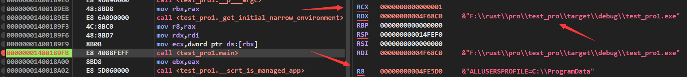

在main函数中，会将编写Rust时候的main，也就是静态分析时候说的test\_pro\_\_main作为第一个参数。argc和argv依次作为第二和第三个参数，最后一个参数则为0，随后调用std::rt::lang\_start::h09171374b7c116e9函数。

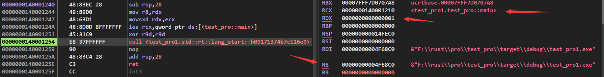

std::rt::lang\_start::h09171374b7c116e9函数会继续调用std::rt::lang\_start\_internal::h68f55995b3e4e811函数。此时，第一个参数rcx指向了局部变量数组，数组中前两个元素保存了test\_pro\_\_main函数地址，后面依次是之前传进来的三个参数。第二个参数rdx则是impl\_\_std::rt::lang\_start::closure\_env\_0\_tuple\_\_\_\_\_\_\_core::ops::function::Fn\_tuple\_\_\_\_\_\_\_::vtable\_数组地址。

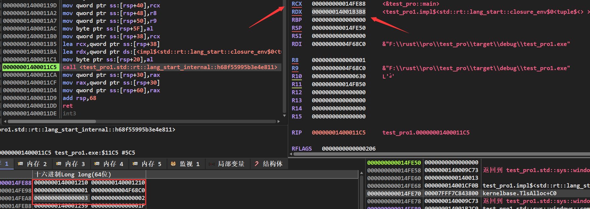

继续跟进std::rt::lang\_start\_internal::h68f55995b3e4e811函数，可以看到在此处rax保存的就是impl\_\_std::rt::lang\_start::closure\_env\_0\_tuple\_\_\_\_\_\_\_core::ops::function::Fn\_tuple\_\_\_\_\_\_\_::vtable\_数组地址。接下来会调用这个数组中的第五个元素保存的函数，这里可以看到函数地址为0x1400011E0。而第一个参数，和上面一样是那个保存了test\_pro\_\_main函数地址的局部变量数组。

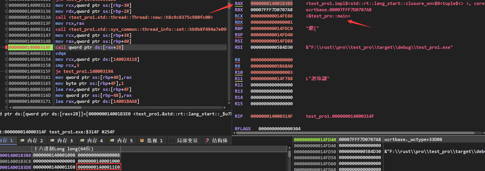

继续跟进，接下来会将test\_pro\_\_main函数作为第一个参数，然后调用std::sys\_common::backtrace::\_\_rust\_begin\_short\_backtrace::h3cd2d30df04669c3函数。

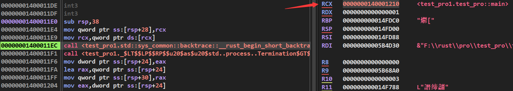

同样的，接下来会将test\_pro\_\_main作为第一个参数，继续调用core::ops::function::FnOnce::call\_once::h7a03834函数。

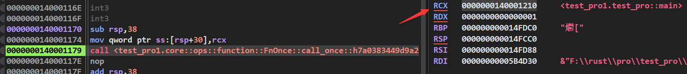

在core::ops::function::FnOnce::call\_once::h7a03834函数，才调用test\_pro\_\_main函数。

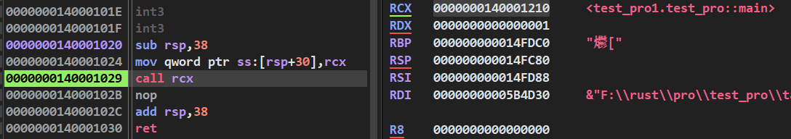

接下来才开始正式执行fn main函数的代码：

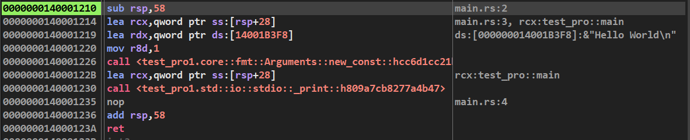
