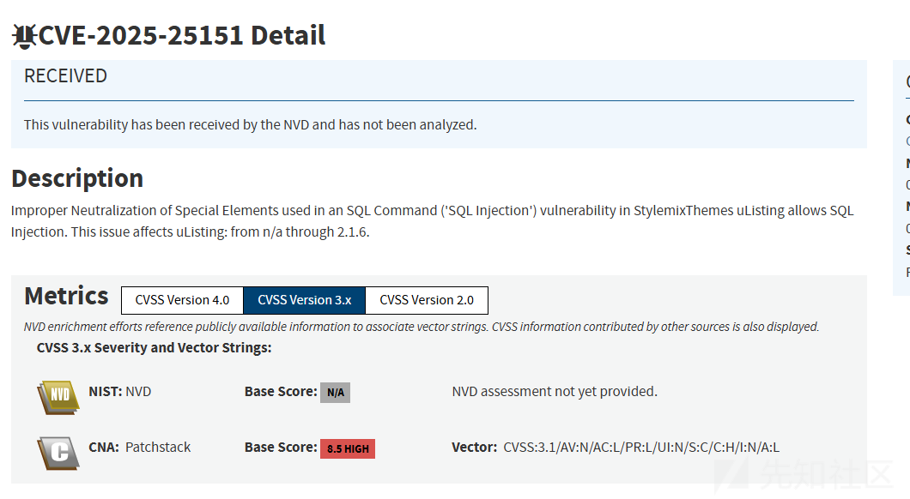
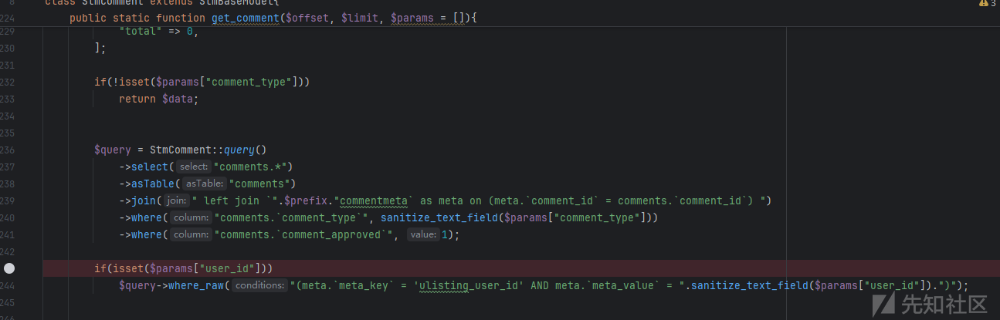
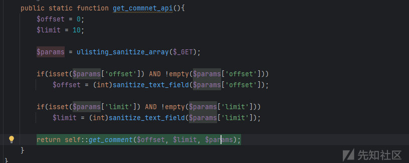
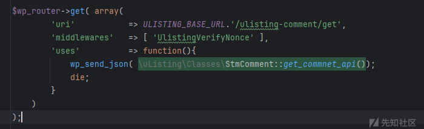
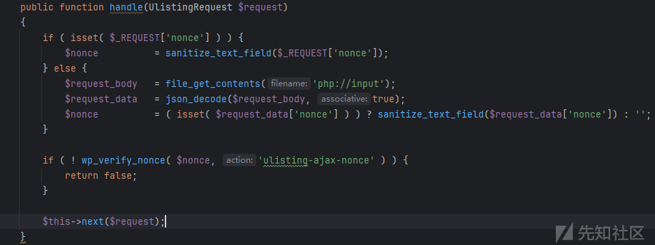
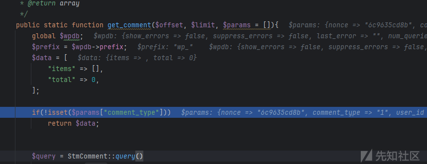
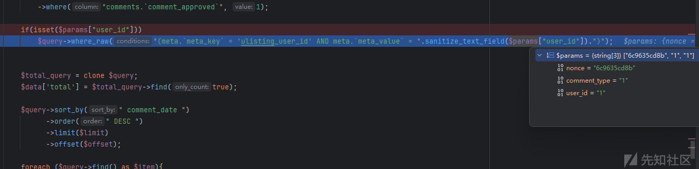
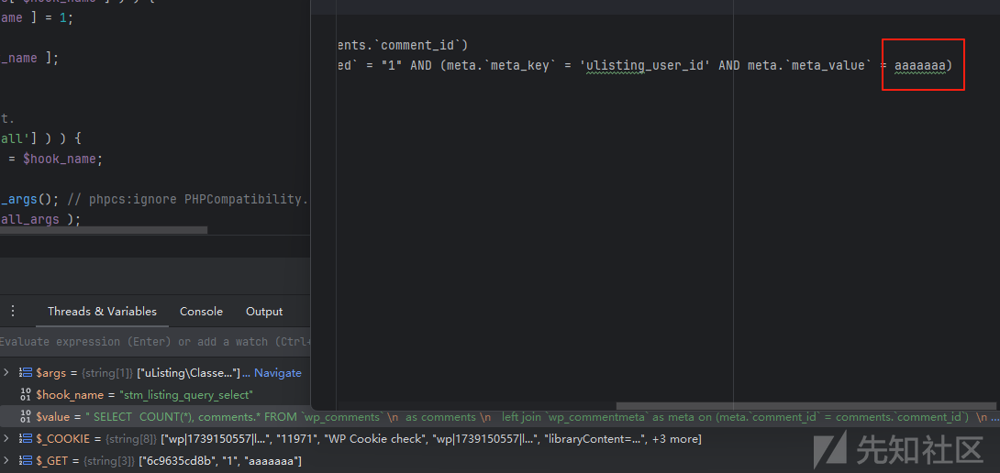
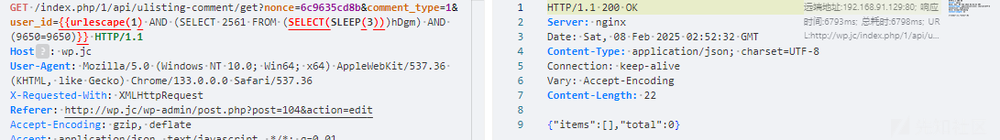

# StylemixThemes uListing sql注入漏洞分析(CVE-2025-25151)-先知社区

> **来源**: https://xz.aliyun.com/news/16799  
> **文章ID**: 16799

---

# 通过

根据漏洞通告了解这个漏洞评分评分8.5，漏洞类型是sql注入

# 分析

## 静态分析

漏洞触发代码如下

`$params["user_id"]`直接拼接sql语句，`$params`是上层调用传递的，追踪是怎么传递的

分析调用发现`$params`直接通过GET请求获取的

继续追踪入口点，查看路由

`ULISTING_BASE_URL`的值是`/1/api`，所以最终的`uri`值是`/1/api/ulisting-comment/get`

## 动态分析

断点调试，进入匿名函数之前会进入中间件

断点跟踪获取`nonce`的值是`6c9635cd8b`

请求添加参数，动态分析`get_comment`，遇到第一个判断，需要`comment_type`参数

调试到sql拼接处，污染参数是`user_id`

污染aaaaaaa，查看最终构造的sql

那么整个payload就可以构造成功了

# 漏洞复现

构造时间盲注

注入sleep(1)时间2

注入sleep(3)时间6

注入sleep(5)时间10

