# 免杀基础-SysCall-先知社区

> **来源**: https://xz.aliyun.com/news/16805  
> **文章ID**: 16805

---

# 什么是SysCall

Syscall是windows提供的进0环提权的一个方法 通过sysenter指令进入0环 将执行流程给到内核

3环实际上做不了什么 真正的操作都是在0环实现的 三环只是封装了参数

这里以VirtualAlloc为例 该API最终调用ntdll!NtAllocateVirtualMemory

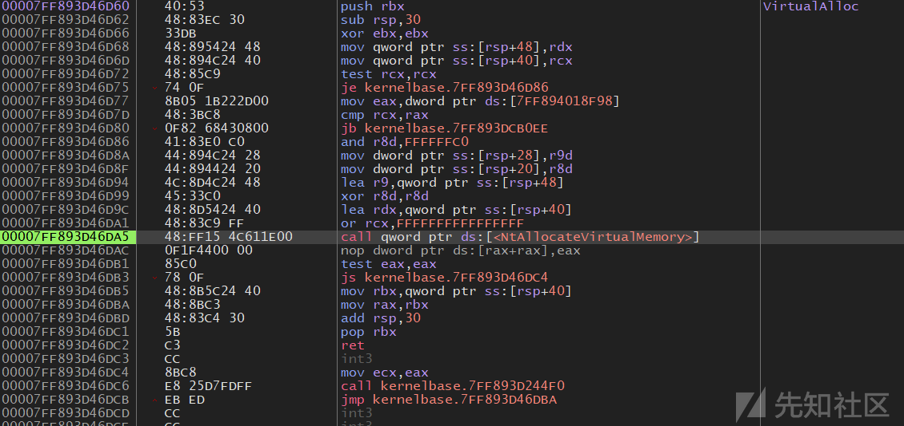

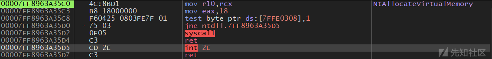

可以看见里面就这几行 实际的内存分配在内核进行

那么这几行干了什么呢

首先我们先来看看这里的7FFE0308是什么东西

0x7ffe0000 储存着结构 \_KUSER\_SHARED\_DATA

\_KUSER\_SHARED\_DATA在0环线性地址为0xffdf0000 3环线性地址为0x7ffe0000

3环只读 0环可写 指向的是同一个物理页

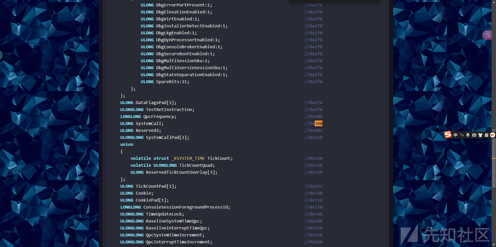

0x308对应着成员SystemCall

这个值表明是否支持syscall 影响了我们是走int 2e中断门进0环 还是syscall进0环

这里我们不去深究3环怎么进的0环 走着两个的区别又是什么

我们只需要知道这整个过程大概就是保存三环堆栈 查ssdt表得到具体函数然后调用就行了 此处的eax 就是所谓的调用号 用于查表

# 3环自实现VirtualAlloc

照着ida的嗯抄

```
.code
 myNtVirtualAlloc proc
     mov     r10, rcx        
     mov     eax, 18h
     test    byte ptr [7FFE0308h], 1
     jnz     short loc_1800A35D5
     syscall                 
     ret
 loc_1800A35D5:
     int     2Eh                            
     ret
 myNtVirtualAlloc endp
 end
```

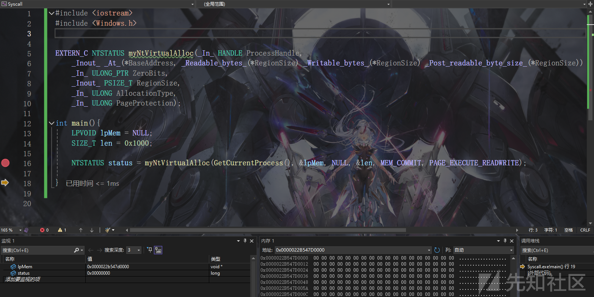

那么这么做有什么意义呢? 答案是绕过hook

操作系统不同版本的调用号不一定相同 可以在<https://j00ru.vexillium.org/syscalls/nt/64/>上找到具体的调用号

现在大部分cpu都支持快速调用 实际上只需要这几行汇编

```
.code
 myNtVirtualAlloc proc
     mov     r10, rcx        
     mov     eax, 18h
     syscall  
     ret
 myNtVirtualAlloc endp
 end
```

# 直接系统调用与间接系统调用

## 直接系统调用

在当前模块中使用syscall指令

上面我们自实现的这个myNtVirtualAlloc就是直接系统调用

直接体现在这个syscall指令 而不是硬编码的调用号 不是说通过加解密得到一个调用号就叫间接系统调用

## 间接系统调用

而间接syscall则是通过如jmp的指令跳到syscall的位置(不在当前模块)

这么做的好处是 我们的syscall可以从ntdll.dll中发起 显得不那么可疑

# 项目手法分析

接下来我们通过几个现有项目具体看看不同的手法

## SysWhispers

<https://github.com/jthuraisamy/SysWhispers>

我们还是以NtAllocateVirtualMemory为例

```
NtAllocateVirtualMemory PROC
     mov rax, gs:[60h]                                 ; Load PEB into RAX.
 NtAllocateVirtualMemory_Check_X_X_XXXX:               ; Check major version.
     cmp dword ptr [rax+118h], 5
     je  NtAllocateVirtualMemory_SystemCall_5_X_XXXX
     cmp dword ptr [rax+118h], 6
     je  NtAllocateVirtualMemory_Check_6_X_XXXX
     cmp dword ptr [rax+118h], 10
     je  NtAllocateVirtualMemory_Check_10_0_XXXX
     jmp NtAllocateVirtualMemory_SystemCall_Unknown
 NtAllocateVirtualMemory_Check_6_X_XXXX:               ; Check minor version for Windows Vista/7/8.
     cmp dword ptr [rax+11ch], 0
     je  NtAllocateVirtualMemory_Check_6_0_XXXX
     cmp dword ptr [rax+11ch], 1
     je  NtAllocateVirtualMemory_Check_6_1_XXXX
     cmp dword ptr [rax+11ch], 2
     je  NtAllocateVirtualMemory_SystemCall_6_2_XXXX
     cmp dword ptr [rax+11ch], 2
     je  NtAllocateVirtualMemory_SystemCall_6_3_XXXX
     jmp NtAllocateVirtualMemory_SystemCall_Unknown
 NtAllocateVirtualMemory_Check_6_0_XXXX:               ; Check build number for Windows Vista.
     cmp dword ptr [rax+120h], 6000
     je  NtAllocateVirtualMemory_SystemCall_6_0_6000
     cmp dword ptr [rax+120h], 6001
     je  NtAllocateVirtualMemory_SystemCall_6_0_6001
     cmp dword ptr [rax+120h], 6002
     je  NtAllocateVirtualMemory_SystemCall_6_0_6002
     jmp NtAllocateVirtualMemory_SystemCall_Unknown
 NtAllocateVirtualMemory_Check_6_1_XXXX:               ; Check build number for Windows 7.
     cmp dword ptr [rax+120h], 7600
     je  NtAllocateVirtualMemory_SystemCall_6_1_7600
     cmp dword ptr [rax+120h], 7601
     je  NtAllocateVirtualMemory_SystemCall_6_1_7601
     jmp NtAllocateVirtualMemory_SystemCall_Unknown
 NtAllocateVirtualMemory_Check_10_0_XXXX:              ; Check build number for Windows 10.
     cmp dword ptr [rax+120h], 10240
     je  NtAllocateVirtualMemory_SystemCall_10_0_10240
     cmp dword ptr [rax+120h], 10586
     je  NtAllocateVirtualMemory_SystemCall_10_0_10586
     cmp dword ptr [rax+120h], 14393
     je  NtAllocateVirtualMemory_SystemCall_10_0_14393
     cmp dword ptr [rax+120h], 15063
     je  NtAllocateVirtualMemory_SystemCall_10_0_15063
     cmp dword ptr [rax+120h], 16299
     je  NtAllocateVirtualMemory_SystemCall_10_0_16299
     cmp dword ptr [rax+120h], 17134
     je  NtAllocateVirtualMemory_SystemCall_10_0_17134
     cmp dword ptr [rax+120h], 17763
     je  NtAllocateVirtualMemory_SystemCall_10_0_17763
     cmp dword ptr [rax+120h], 18362
     je  NtAllocateVirtualMemory_SystemCall_10_0_18362
     cmp dword ptr [rax+120h], 18363
     je  NtAllocateVirtualMemory_SystemCall_10_0_18363
     jmp NtAllocateVirtualMemory_SystemCall_Unknown
 NtAllocateVirtualMemory_SystemCall_5_X_XXXX:          ; Windows XP and Server 2003
     mov eax, 0015h
     jmp NtAllocateVirtualMemory_Epilogue
 NtAllocateVirtualMemory_SystemCall_6_0_6000:          ; Windows Vista SP0
     mov eax, 0015h
     jmp NtAllocateVirtualMemory_Epilogue
 NtAllocateVirtualMemory_SystemCall_6_0_6001:          ; Windows Vista SP1 and Server 2008 SP0
     mov eax, 0015h
     jmp NtAllocateVirtualMemory_Epilogue
 NtAllocateVirtualMemory_SystemCall_6_0_6002:          ; Windows Vista SP2 and Server 2008 SP2
     mov eax, 0015h
     jmp NtAllocateVirtualMemory_Epilogue
 NtAllocateVirtualMemory_SystemCall_6_1_7600:          ; Windows 7 SP0
     mov eax, 0015h
     jmp NtAllocateVirtualMemory_Epilogue
 NtAllocateVirtualMemory_SystemCall_6_1_7601:          ; Windows 7 SP1 and Server 2008 R2 SP0
     mov eax, 0015h
     jmp NtAllocateVirtualMemory_Epilogue
 NtAllocateVirtualMemory_SystemCall_6_2_XXXX:          ; Windows 8 and Server 2012
     mov eax, 0016h
     jmp NtAllocateVirtualMemory_Epilogue
 NtAllocateVirtualMemory_SystemCall_6_3_XXXX:          ; Windows 8.1 and Server 2012 R2
     mov eax, 0017h
     jmp NtAllocateVirtualMemory_Epilogue
 NtAllocateVirtualMemory_SystemCall_10_0_10240:        ; Windows 10.0.10240 (1507)
     mov eax, 0018h
     jmp NtAllocateVirtualMemory_Epilogue
 NtAllocateVirtualMemory_SystemCall_10_0_10586:        ; Windows 10.0.10586 (1511)
     mov eax, 0018h
     jmp NtAllocateVirtualMemory_Epilogue
 NtAllocateVirtualMemory_SystemCall_10_0_14393:        ; Windows 10.0.14393 (1607)
     mov eax, 0018h
     jmp NtAllocateVirtualMemory_Epilogue
 NtAllocateVirtualMemory_SystemCall_10_0_15063:        ; Windows 10.0.15063 (1703)
     mov eax, 0018h
     jmp NtAllocateVirtualMemory_Epilogue
 NtAllocateVirtualMemory_SystemCall_10_0_16299:        ; Windows 10.0.16299 (1709)
     mov eax, 0018h
     jmp NtAllocateVirtualMemory_Epilogue
 NtAllocateVirtualMemory_SystemCall_10_0_17134:        ; Windows 10.0.17134 (1803)
     mov eax, 0018h
     jmp NtAllocateVirtualMemory_Epilogue
 NtAllocateVirtualMemory_SystemCall_10_0_17763:        ; Windows 10.0.17763 (1809)
     mov eax, 0018h
     jmp NtAllocateVirtualMemory_Epilogue
 NtAllocateVirtualMemory_SystemCall_10_0_18362:        ; Windows 10.0.18362 (1903)
     mov eax, 0018h
     jmp NtAllocateVirtualMemory_Epilogue
 NtAllocateVirtualMemory_SystemCall_10_0_18363:        ; Windows 10.0.18363 (1909)
     mov eax, 0018h
     jmp NtAllocateVirtualMemory_Epilogue
 NtAllocateVirtualMemory_SystemCall_Unknown:           ; Unknown/unsupported version.
     ret
 NtAllocateVirtualMemory_Epilogue:
     mov r10, rcx
     syscall
     ret
 NtAllocateVirtualMemory ENDP
```

mov rax, gs:[60h] 首先拿到PEB

3环64位下gs存储着TEB

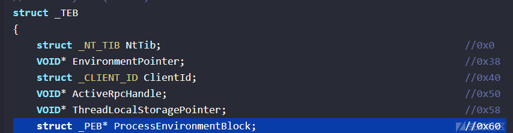

TEB+0x60得到PEB

通过PEB中的这几个成员判断当前windows版本 跳到不同的标签 在SysWhispers1的系统编号是硬编码的


## SysWhispers2

```
NtAllocateVirtualMemory PROC
     mov currentHash, 0C1512DC6h    ; Load function hash into global variable.
     call WhisperMain               ; Resolve function hash into syscall number and make the call
 NtAllocateVirtualMemory ENDP
```

使用了hash来查找调用号

```
WhisperMain PROC
     pop rax
     mov [rsp+ 8], rcx              ; Save registers.
     mov [rsp+16], rdx
     mov [rsp+24], r8
     mov [rsp+32], r9
     sub rsp, 28h
     mov ecx, currentHash
     call SW2_GetSyscallNumber
     add rsp, 28h
     mov rcx, [rsp+ 8]              ; Restore registers.
     mov rdx, [rsp+16]
     mov r8, [rsp+24]
     mov r9, [rsp+32]
     mov r10, rcx
     syscall                        ; Issue syscall
     ret
 WhisperMain ENDP
```

```
EXTERN_C DWORD SW2_GetSyscallNumber(DWORD FunctionHash)
 {
     // Ensure SW2_SyscallList is populated.
     if (!SW2_PopulateSyscallList()) return -1;
 
     for (DWORD i = 0; i < SW2_SyscallList.Count; i++)
     {
         if (FunctionHash == SW2_SyscallList.Entries[i].Hash)
         {
             return i;
         }
     }
 
     return -1;
 }
```

SW2\_PopulateSyscallList函数解析ntdll.dll的导出表 按系统调用地址进行排序 SW2\_SYSCALL\_LIST 结构储存着hash和地址 这里返回的下标就是调用号

RANDSYSCALL的处理额外调用了SW2\_GetRandomSyscallAddress函数

```
WhisperMain PROC
     pop rax
     mov [rsp+ 8], rcx                       ; Save registers.
     mov [rsp+16], rdx
     mov [rsp+24], r8
     mov [rsp+32], r9
     sub rsp, 28h
     mov ecx, currentHash
     call SW2_GetSyscallNumber
     mov dword ptr [syscallNumber], eax      ; Save the syscall number
     xor rcx, rcx
     call SW2_GetRandomSyscallAddress        ; Get a random syscall address
     mov qword ptr [syscallAddress], rax     ; Save the random syscall address
     xor rax, rax
     mov eax, syscallNumber
     add rsp, 28h
     mov rcx, [rsp+ 8]                       ; Restore registers.
     mov rdx, [rsp+16]
     mov r8, [rsp+24]
     mov r9, [rsp+32]
     mov r10, rcx
     pop qword ptr [returnAddress]           ; Save the original return address
     call qword ptr [syscallAddress]         ; Call the random syscall instruction
     push qword ptr [returnAddress]          ; Restore the original return address
     ret
 WhisperMain ENDP
```

```
#ifdef RANDSYSCALL
 #ifdef _WIN64
 EXTERN_C uint64_t SW2_GetRandomSyscallAddress(void)
 #else
 EXTERN_C DWORD SW2_GetRandomSyscallAddress(int callType)
 #endif
 {
     int instructOffset = 0;
     int instructValue = 0;
 #ifndef _WIN64
     // Wow64
     if (callType == 0)
     {
         instructOffset = 0x05;
         instructValue = 0x0E8;
     }
     // x86
     else if (callType == 1)
     {
         instructOffset = 0x05;
         instructValue = 0x0BA;
     }
 #else
     instructOffset = 0x12;
     instructValue = 0x0F;
 #endif
     srand(time(0));
     do
     {
         int randNum = (rand() % (SW2_SyscallList.Count + 1));
         if (*(unsigned char*)(ntdllBase + SW2_SyscallList.Entries[randNum].Address + instructOffset) == instructValue)
             return (ntdllBase + SW2_SyscallList.Entries[randNum].Address + instructOffset);
     } while(1);
 }
 #endif
```

通过时间生成随机数 随机获取ntdll.dll导出函数中的一个syscall指令的地址 然后call 避免了在ntdll.dll外使用指令syscall

这就是之前所说的间接系统调用

## SysWhispers3

提供了embedded, egg\_hunter, jumper, jumper\_randomized 这四种

### embedded

embedded就是根据hash查的直接系统调用

### egg\_hunter

egg\_hunter 运行后提供egg和replace

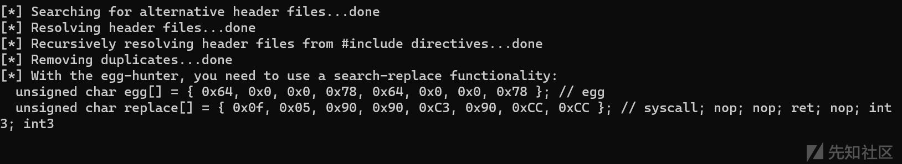

```
Sw3NtAllocateVirtualMemory PROC
     mov [rsp +8], rcx          ; Save registers.
     mov [rsp+16], rdx
     mov [rsp+24], r8
     mov [rsp+32], r9
     sub rsp, 28h
     mov ecx, 003AE0F2Bh        ; Load function hash into ECX.
     call SW3_GetSyscallNumber              ; Resolve function hash into syscall number.
     add rsp, 28h
     mov rcx, [rsp+8]                      ; Restore registers.
     mov rdx, [rsp+16]
     mov r8, [rsp+24]
     mov r9, [rsp+32]
     mov r10, rcx
     DB 64h                     ; "d"
     DB 0h                     ; "0"
     DB 0h                     ; "0"
     DB 78h                     ; "x"
     DB 64h                     ; "d"
     DB 0h                     ; "0"
     DB 0h                     ; "0"
     DB 78h                     ; "x"
     ret
 Sw3NtAllocateVirtualMemory ENDP
```

可以看见汇编中多的这一段 对应的egg 需要我们自己实现动态替换的部分

### jumper

```
Sw3NtAllocateVirtualMemory PROC
     mov [rsp +8], rcx          ; Save registers.
     mov [rsp+16], rdx
     mov [rsp+24], r8
     mov [rsp+32], r9
     sub rsp, 28h
     mov ecx, 0D554E3DBh        ; Load function hash into ECX.
     call SW3_GetSyscallAddress              ; Resolve function hash into syscall offset.
     mov r11, rax                           ; Save the address of the syscall
     mov ecx, 0D554E3DBh        ; Re-Load function hash into ECX (optional).
     call SW3_GetSyscallNumber              ; Resolve function hash into syscall number.
     add rsp, 28h
     mov rcx, [rsp+8]                      ; Restore registers.
     mov rdx, [rsp+16]
     mov r8, [rsp+24]
     mov r9, [rsp+32]
     mov r10, rcx
     jmp r11                                ; Jump to -> Invoke system call.
 Sw3NtAllocateVirtualMemory ENDP
```

通过hash拿到对应的调用号和函数地址 jmp过去 这里的目的是进ntdll.dll

### jumper\_randomized

```
Sw3NtAllocateVirtualMemory PROC
     mov [rsp +8], rcx          ; Save registers.
     mov [rsp+16], rdx
     mov [rsp+24], r8
     mov [rsp+32], r9
     sub rsp, 28h
     mov ecx, 01C8E0C68h        ; Load function hash into ECX.
     call SW3_GetRandomSyscallAddress        ; Get a syscall offset from a different api.
     mov r11, rax                           ; Save the address of the syscall
     mov ecx, 01C8E0C68h        ; Re-Load function hash into ECX (optional).
     call SW3_GetSyscallNumber              ; Resolve function hash into syscall number.
     add rsp, 28h
     mov rcx, [rsp+8]                      ; Restore registers.
     mov rdx, [rsp+16]
     mov r8, [rsp+24]
     mov r9, [rsp+32]
     mov r10, rcx
     jmp r11                                ; Jump to -> Invoke system call.
 Sw3NtAllocateVirtualMemory ENDP
```

和2一样思路 随便找个ntdll.dll中的函数去执行syscall

## Hell's Gate

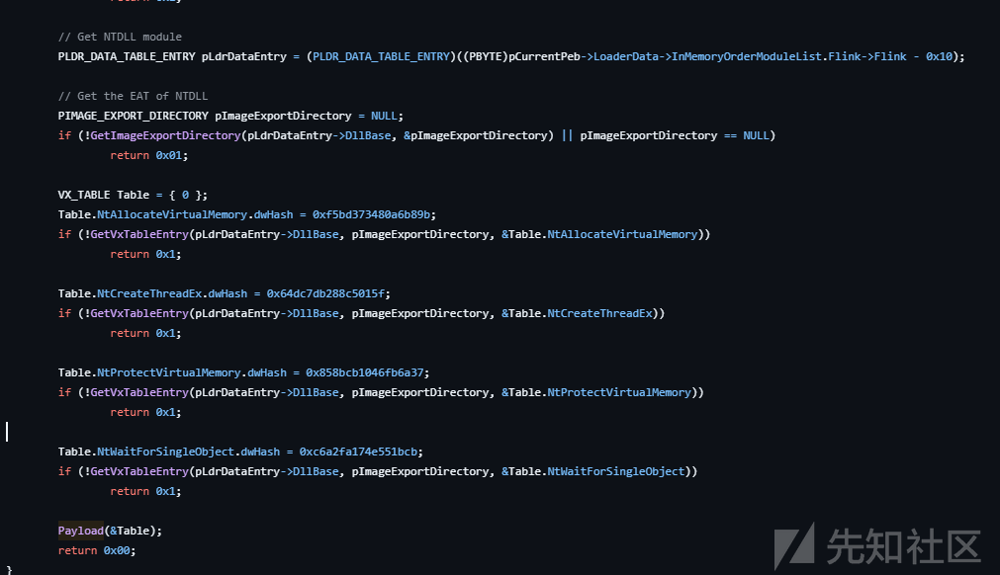

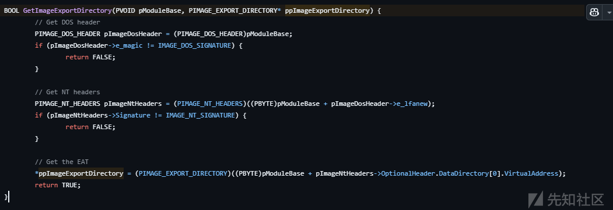

首先手动解析导出表 获取了几个后续需要使用的windowsAPI 然后调用Payload函数 传了一个VX\_TABLE结构进去

```
typedef struct _VX_TABLE {
     VX_TABLE_ENTRY NtAllocateVirtualMemory;
     VX_TABLE_ENTRY NtProtectVirtualMemory;
     VX_TABLE_ENTRY NtCreateThreadEx;
     VX_TABLE_ENTRY NtWaitForSingleObject;
 } VX_TABLE, * PVX_TABLE;
```

```
typedef struct _VX_TABLE_ENTRY {
     PVOID   pAddress;
     DWORD64 dwHash;
     WORD    wSystemCall;
 } VX_TABLE_ENTRY, * PVX_TABLE_ENTRY;
```

VX\_TABLE每个成员都是VX\_TABLE\_ENTRY结构保存了地址 哈希 SSN

Payload函数分配了一块RW类型的内存 写完shellcode后改为RX并执行

```
BOOL Payload(PVX_TABLE pVxTable) {
     NTSTATUS status = 0x00000000;
     char shellcode[] = "\x90\x90\x90\x90\xcc\xcc\xcc\xcc\xc3";
 
     // Allocate memory for the shellcode
     PVOID lpAddress = NULL;
     SIZE_T sDataSize = sizeof(shellcode);
     HellsGate(pVxTable->NtAllocateVirtualMemory.wSystemCall);
     status = HellDescent((HANDLE)-1, &lpAddress, 0, &sDataSize, MEM_COMMIT, PAGE_READWRITE);
 
     // Write Memory
     VxMoveMemory(lpAddress, shellcode, sizeof(shellcode));
 
     // Change page permissions
     ULONG ulOldProtect = 0;
     HellsGate(pVxTable->NtProtectVirtualMemory.wSystemCall);
     status = HellDescent((HANDLE)-1, &lpAddress, &sDataSize, PAGE_EXECUTE_READ, &ulOldProtect);
 
     // Create thread
     HANDLE hHostThread = INVALID_HANDLE_VALUE;
     HellsGate(pVxTable->NtCreateThreadEx.wSystemCall);
     status = HellDescent(&hHostThread, 0x1FFFFF, NULL, (HANDLE)-1, (LPTHREAD_START_ROUTINE)lpAddress, NULL, FALSE, NULL, NULL, NULL, NULL);
 
     // Wait for 1 seconds
     LARGE_INTEGER Timeout;
     Timeout.QuadPart = -10000000;
     HellsGate(pVxTable->NtWaitForSingleObject.wSystemCall);
     status = HellDescent(hHostThread, FALSE, &Timeout);
 
     return TRUE;
 }
```

这里HellsGate函数接收SSN保存到wSystemCall

通过HellDescent去触发syscall 这是一个直接syscall

HellsGate的定义如下

```
.data
     wSystemCall DWORD 000h
 
 .code 
     HellsGate PROC
         mov wSystemCall, 000h
         mov wSystemCall, ecx
         ret
     HellsGate ENDP
 
     HellDescent PROC
         mov r10, rcx
         mov eax, wSystemCall
 
         syscall
         ret
     HellDescent ENDP
 end
```

主要的SSN获取的流程在GetVxTableEntry函数

这里通过解析导出表 匹配特征码 获取SSN

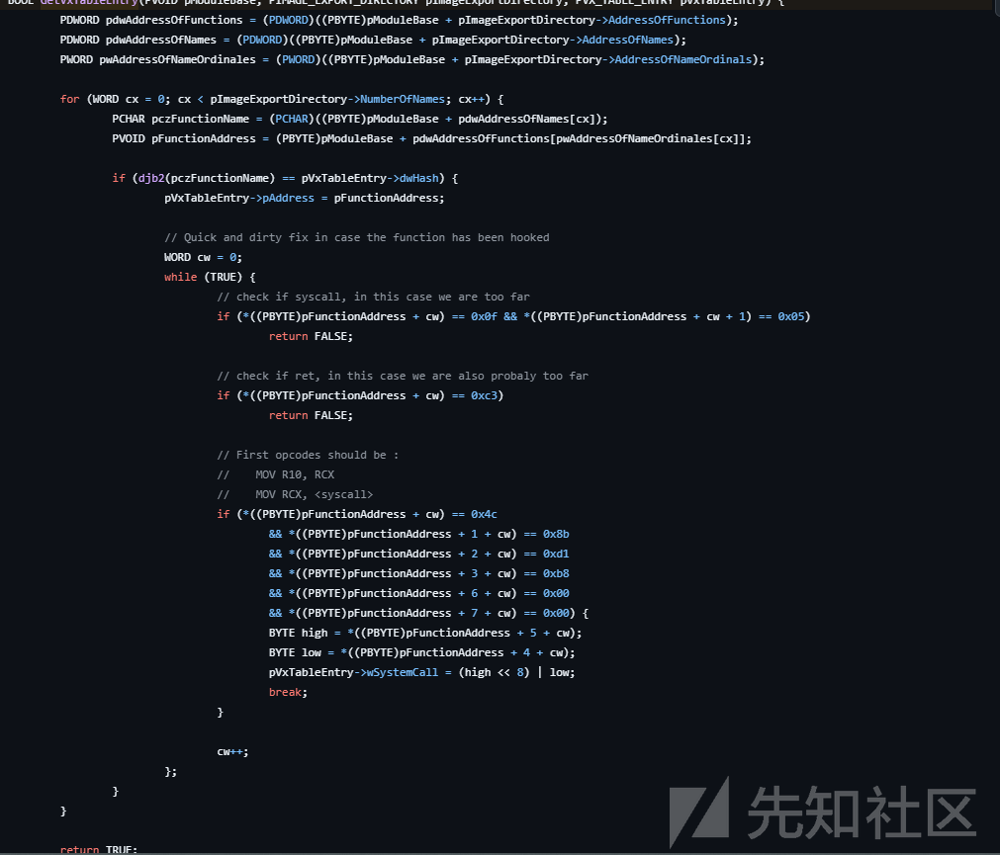

## Tartarus' Gate

<https://github.com/trickster0/TartarusGate>

由于Tartarus' Gate是Halo's Gate改来的 且改动不大 就直接看这个了

Hell's Gate的升级版Hell's Gate需要内存中的ntdll.dll是干净的 否则获取不到对应的SSN

Tartarus' Gate主要改动点在GetVxTableEntry

如果没被hook 和以前一样 直接匹配特征码


如果在第一条指令是jmp(0xe9) 代表被hook了


向上下找未被hook的函数

如果第二条指令是jmp 同样的解决方案

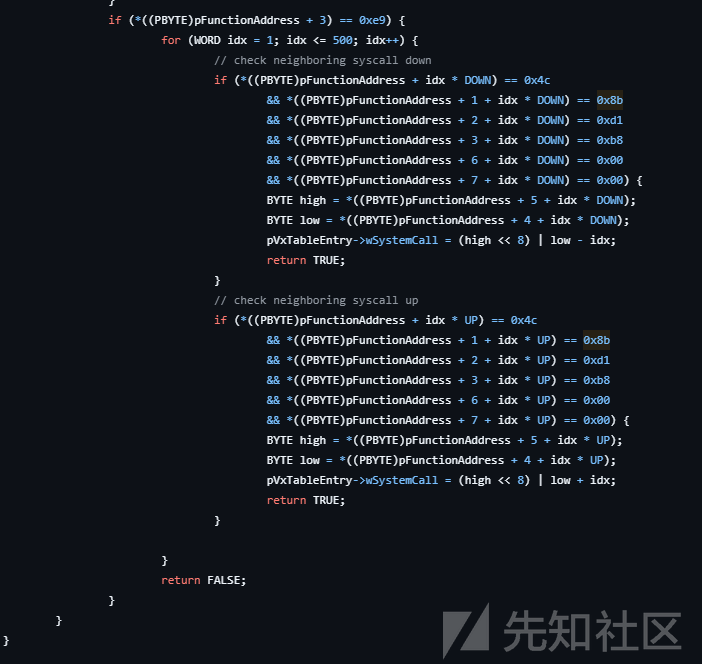

asm中加了一些nop

```
; Hell's Gate
 ; Dynamic system call invocation 
 ; 
 ; by smelly__vx (@RtlMateusz) and am0nsec (@am0nsec)
 
 .data
     wSystemCall DWORD 000h
 
 .code 
     HellsGate PROC
         nop
         mov wSystemCall, 000h
         nop
         mov wSystemCall, ecx
         nop
         ret
     HellsGate ENDP
 
     HellDescent PROC
         nop
         mov rax, rcx
         nop
         mov r10, rax
         nop
         mov eax, wSystemCall
         nop
         syscall
         ret
     HellDescent ENDP
 end
```

但是依旧是直接系统调用

## RecycledGate

Tartarus' Gate的升级

```
typedef struct {
 
     DWORD dwSyscallNr;
     PVOID pRecycledGate;
 
 } Syscall;
```

主要改动就是从使用间接syscall 在拿到SSN之后搜syscall;ret的特征码

确保所有系统调用都通过ntdll.dll发起

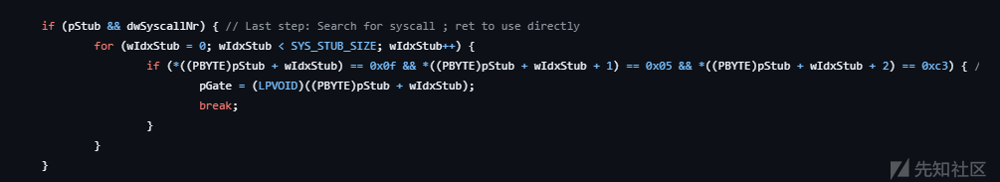

## ParallelSyscalls

<https://github.com/mdsecactivebreach/ParallelSyscalls>

win10 引入了并行dll加载的机制 允许递归并行加载 DLL

LdrpDetectDetour 函数通过检查NtOpenFileNtCreateSectionZwQueryAttributesFileNtOpenSectionZwMapViewOfSection 这五个函数是否被hook 来决定是否启用并行加载

检测的方式是逐一与LdrpThunkSignature的元素对比前16个字节

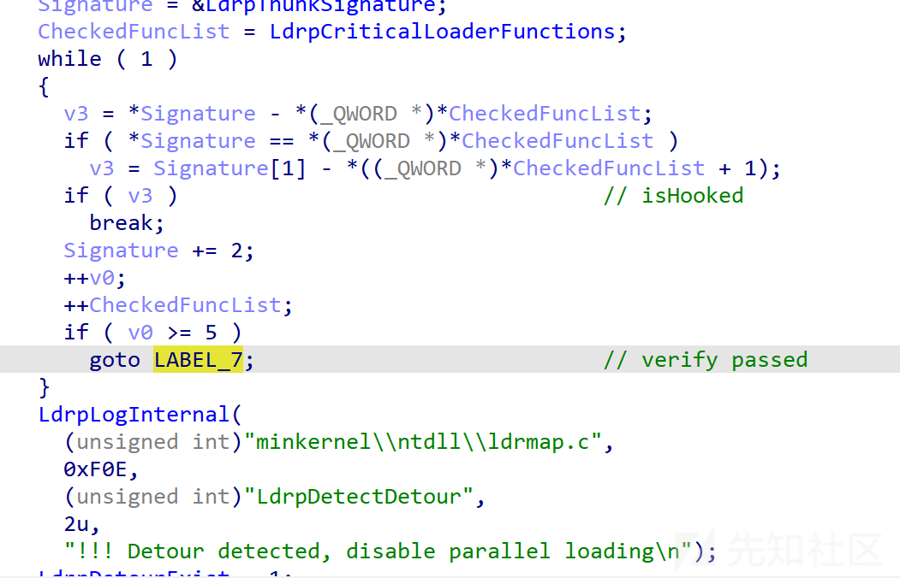

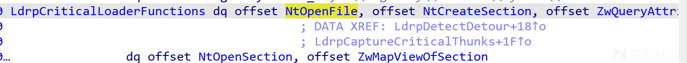

LdrpThunkSignature的赋值在LdrpCaptureCriticalThunks函数中实现

保存了目标函数的前16个字节

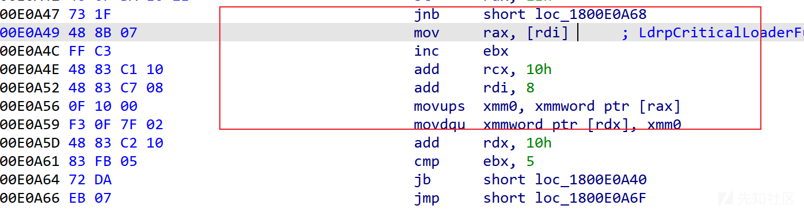

ParallelSyscalls项目就是利用LdrpThunkSignature来恢复syscall的 可以通过NtMapViewOfSection等函数 映射一个干净的ntdll

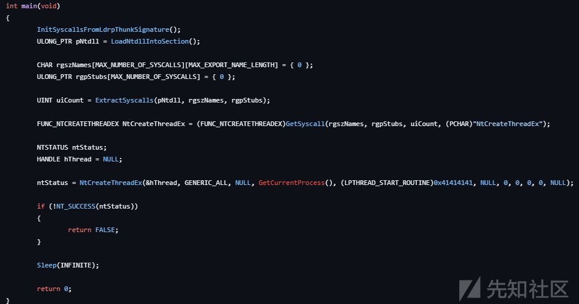

```
BOOL InitSyscallsFromLdrpThunkSignature()
 {
     PPEB Peb = (PPEB)__readgsqword(0x60);
     PPEB_LDR_DATA Ldr = Peb->Ldr;
     PLDR_DATA_TABLE_ENTRY NtdllLdrEntry = NULL;
     
     for (PLDR_DATA_TABLE_ENTRY LdrEntry = (PLDR_DATA_TABLE_ENTRY)Ldr->InLoadOrderModuleList.Flink;
         LdrEntry->DllBase != NULL;
         LdrEntry = (PLDR_DATA_TABLE_ENTRY)LdrEntry->InLoadOrderLinks.Flink)
     {
         if (_wcsnicmp(LdrEntry->BaseDllName.Buffer, L"ntdll.dll", 9) == 0)
         {
             // got ntdll
             NtdllLdrEntry = LdrEntry;
             break;
         }
     }
 
     if (NtdllLdrEntry == NULL)
     {
         return FALSE;
     }
     
     PIMAGE_NT_HEADERS ImageNtHeaders = (PIMAGE_NT_HEADERS)((ULONG_PTR)NtdllLdrEntry->DllBase + ((PIMAGE_DOS_HEADER)NtdllLdrEntry->DllBase)->e_lfanew);
     PIMAGE_SECTION_HEADER SectionHeader = (PIMAGE_SECTION_HEADER)((ULONG_PTR)&ImageNtHeaders->OptionalHeader + ImageNtHeaders->FileHeader.SizeOfOptionalHeader);
     
     ULONG_PTR DataSectionAddress = NULL;
     DWORD DataSectionSize;
 
     for (WORD i = 0; i < ImageNtHeaders->FileHeader.NumberOfSections; i++)
     {
         if (!strcmp((char*)SectionHeader[i].Name, ".data"))
         {
             DataSectionAddress = (ULONG_PTR)NtdllLdrEntry->DllBase + SectionHeader[i].VirtualAddress;
             DataSectionSize = SectionHeader[i].Misc.VirtualSize;
             break;
         }
     }
 
     DWORD dwSyscallNo_NtOpenFile = 0, dwSyscallNo_NtCreateSection = 0, dwSyscallNo_NtMapViewOfSection = 0;
 
     if (!DataSectionAddress || DataSectionSize < 16 * 5)
     {
         return FALSE;
     }
 
     for (UINT uiOffset = 0; uiOffset < DataSectionSize - (16 * 5); uiOffset++)
     {
         if (*(DWORD*)(DataSectionAddress + uiOffset) == 0xb8d18b4c &&
             *(DWORD*)(DataSectionAddress + uiOffset + 16) == 0xb8d18b4c &&
             *(DWORD*)(DataSectionAddress + uiOffset + 32) == 0xb8d18b4c &&
             *(DWORD*)(DataSectionAddress + uiOffset + 48) == 0xb8d18b4c &&
             *(DWORD*)(DataSectionAddress + uiOffset + 64) == 0xb8d18b4c)
         {
             dwSyscallNo_NtOpenFile = *(DWORD*)(DataSectionAddress + uiOffset + 4);
             dwSyscallNo_NtCreateSection = *(DWORD*)(DataSectionAddress + uiOffset + 16 + 4);
             dwSyscallNo_NtMapViewOfSection = *(DWORD*)(DataSectionAddress + uiOffset + 64 + 4);
             break;
         }
     }
 
     if (!dwSyscallNo_NtOpenFile)
     {
         return FALSE;
     }
 
     ULONG_PTR SyscallRegion = (ULONG_PTR)VirtualAlloc(NULL, 3 * MAX_SYSCALL_STUB_SIZE, MEM_RESERVE | MEM_COMMIT, PAGE_EXECUTE_READWRITE);
 
     if (!SyscallRegion)
     {
         return FALSE;
     }
 
     NtOpenFile = (FUNC_NTOPENFILE)BuildSyscallStub(SyscallRegion, dwSyscallNo_NtOpenFile);
     NtCreateSection = (FUNC_NTCREATESECTION)BuildSyscallStub(SyscallRegion + MAX_SYSCALL_STUB_SIZE, dwSyscallNo_NtCreateSection);
     NtMapViewOfSection = (FUNC_NTMAPVIEWOFSECTION)BuildSyscallStub(SyscallRegion + (2* MAX_SYSCALL_STUB_SIZE), dwSyscallNo_NtMapViewOfSection);
 
     return TRUE;
 }
```

首先拿到ntdll.dll的地址

找到.data段 搜特征码b8d18b4c 连续的5个 以确定LdrpThunkSignature +4偏移拿到SSN

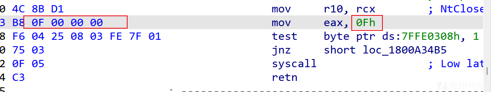

BuildSyscallStub函数用于构造一个结构 包含指令和SSN

```
ULONG_PTR BuildSyscallStub(ULONG_PTR StubRegion, DWORD dwSyscallNo)
 {
     BYTE SyscallStub[] =
     {
         0x4c, 0x8b, 0xd1,               // mov     r10,rcx
         0xb8, 0x00, 0x00, 0x00, 0x00,   // mov     eax,xxx
         0x0f, 0x05,                     // syscall
         0xc3                            // ret
     };
 
     memcpy((PBYTE)StubRegion, SyscallStub, sizeof(SyscallStub));
     *(DWORD*)(StubRegion + 4) = dwSyscallNo;
     
     return StubRegion;
 }
```

执行完InitSyscallsFromLdrpThunkSignature(); 之后获得了三个函数

接着调用LoadNtdllIntoSection 在其中通过获取到的NtMapViewOfSection 重新映射了一个ntdll.dll到当前进程

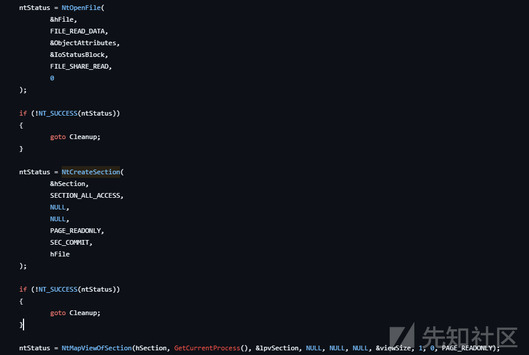

ExtractSyscalls 解析这个干净的ntdll 获取SSN和地址

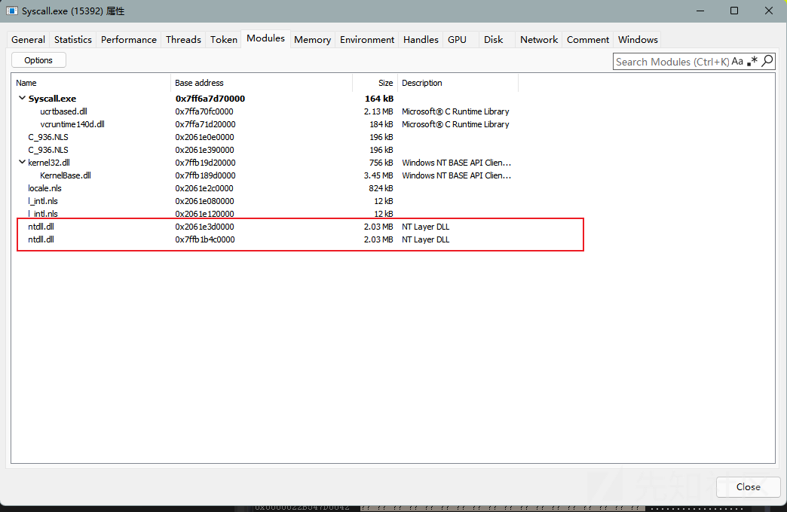

通过System Informer查看模块 我们可以看见多了一个ntdll.dll

## HWSyscalls

<https://github.com/Dec0ne/HWSyscalls>

```
bool InitHWSyscalls() {
     myThread = GetCurrentThread();
     hNtdll = (HANDLE)GetModuleAddress((LPWSTR)L"ntdll.dll");
 
     if (!FindRetGadget()) {
         DEBUG_PRINT("[!] Could not find a suitable "ADD RSP,68;RET" gadget in kernel32 or kernelbase. InitHWSyscalls failed.");
         return false;
     }
 
     // Register exception handler
     exceptionHandlerHandle = AddVectoredExceptionHandler(1, &HWSyscallExceptionHandler);
 
     if (!exceptionHandlerHandle) {
         DEBUG_PRINT("[!] Could not register VEH: 0x%X
", GetLastError());
         return false;
     }
 
     return SetMainBreakpoint();
 }
```

初始化函数先调用FindRetGadget在Kernel32.dll 与 kernelbase.dll中搜特征码

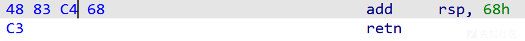

```
bool FindRetGadget() {
     // Dynamically search for a suitable "ADD RSP,68;RET" gadget in both kernel32 and kernelbase
     retGadgetAddress = FindInModule("KERNEL32.DLL", (PBYTE)"\x48\x83\xC4\x68\xC3", (PCHAR)"xxxxx");
     if (retGadgetAddress != 0) {
         DEBUG_PRINT("[+] Found RET_GADGET in kernel32.dll: %#llx
", retGadgetAddress);
         return true;
     }
     else {
         retGadgetAddress = FindInModule("kernelbase.dll", (PBYTE)"\x48\x83\xC4\x68\xC3", (PCHAR)"xxxxx");
         DEBUG_PRINT("[+] Found RET_GADGET in kernelbase.dll: %#llx
", retGadgetAddress);
         if (retGadgetAddress != 0) {
             return true;
         }
     }
     return false;
 }
 
 DWORD_PTR FindInModule(LPCSTR moduleName, PBYTE bMask, PCHAR szMask)
 {
     DWORD_PTR dwAddress = 0;
     PIMAGE_DOS_HEADER imageBase = (PIMAGE_DOS_HEADER)GetModuleHandleA(moduleName);
 
     if (!imageBase)
         return 0;
 
     DWORD_PTR sectionOffset = (DWORD_PTR)imageBase + imageBase->e_lfanew + sizeof(IMAGE_NT_HEADERS);
 
     if (!sectionOffset)
         return 0;
 
     PIMAGE_SECTION_HEADER textSection = (PIMAGE_SECTION_HEADER)(sectionOffset);
     dwAddress = FindPattern((DWORD_PTR)imageBase + textSection->VirtualAddress, textSection->SizeOfRawData, bMask, szMask);
     return dwAddress;
 }
 BOOL MaskCompare(const BYTE* pData, const BYTE* bMask, const char* szMask)
 {
     for (; *szMask; ++szMask, ++pData, ++bMask)
         if (*szMask == 'x' && *pData != *bMask)
             return FALSE;
     return TRUE;
 }
 
 DWORD_PTR FindPattern(DWORD_PTR dwAddress, DWORD dwLen, PBYTE bMask, PCHAR szMask)
 {
     for (DWORD i = 0; i < dwLen; i++)
         if (MaskCompare((PBYTE)(dwAddress + i), bMask, szMask))
             return (DWORD_PTR)(dwAddress + i);
 
     return 0;
 }
```

找到之后注册一个VEH HWSyscallExceptionHandler

首先通过函数名动态获取到对应函数地址 在该地址下硬件断点

后续当调用到该函数时 伪造一个堆栈 然后检测该函数是否被hook(通过判断syscall的特征码)

如果没被hook 则继续执行

如果被hook了 调用FindSyscallNumber拿SSN 手法和Halo's Gate一样 向上下找干净的函数

```
LONG HWSyscallExceptionHandler(EXCEPTION_POINTERS* ExceptionInfo) {
     if (ExceptionInfo->ExceptionRecord->ExceptionCode == EXCEPTION_SINGLE_STEP) {
         if (ExceptionInfo->ContextRecord->Rip == (DWORD64)&PrepareSyscall) {
             DEBUG_PRINT("
===============HWSYSCALLS DEBUG===============");
             DEBUG_PRINT("
[+] PrepareSyscall Breakpoint Hit (%#llx)!
", ExceptionInfo->ExceptionRecord->ExceptionAddress);
             
             // Find the address of the syscall function in ntdll we got as the first argument of the PrepareSyscall function
             ntFunctionAddress = GetSymbolAddress((UINT64)hNtdll, (const char*)(ExceptionInfo->ContextRecord->Rcx));
             DEBUG_PRINT("[+] Found %s address: 0x%I64X
", (const char*)(ExceptionInfo->ContextRecord->Rcx), ntFunctionAddress);
             
             // Move breakpoint to the NTAPI function;
             DEBUG_PRINT("[+] Moving breakpoint to %#llx
", ntFunctionAddress);
             ExceptionInfo->ContextRecord->Dr0 = ntFunctionAddress;
         }
         else if (ExceptionInfo->ContextRecord->Rip == (DWORD64)ntFunctionAddress) {
             DEBUG_PRINT("[+] NTAPI Function Breakpoint Hit (%#llx)!
", (DWORD64)ExceptionInfo->ExceptionRecord->ExceptionAddress);
             
             // Create a new stack to spoof the kernel32 function address
             // The stack size will be 0x70 which is compatible with the RET_GADGET we found.
             // sub rsp, 70
             ExceptionInfo->ContextRecord->Rsp -= 0x70;
             // mov rsp, REG_GADGET_ADDRESS
             *(PULONG64)(ExceptionInfo->ContextRecord->Rsp) = retGadgetAddress;
             DEBUG_PRINT("[+] Created a new stack frame with RET_GADGET (%#llx) as the return address
", retGadgetAddress);
 
             // Copy the stack arguments from the original stack
             for (size_t idx = 0; idx < STACK_ARGS_LENGTH; idx++)
             {
                 const size_t offset = idx * STACK_ARGS_LENGTH + STACK_ARGS_RSP_OFFSET;
                 *(PULONG64)(ExceptionInfo->ContextRecord->Rsp + offset) = *(PULONG64)(ExceptionInfo->ContextRecord->Rsp + offset + 0x70);
             }
             DEBUG_PRINT("[+] Original stack arguments successfully copied over to the new stack
");
 
             DWORD64 pFunctionAddress = ExceptionInfo->ContextRecord->Rip;
 
             char nonHookedSyscallBytes[] = { 0x4C,0x8B,0xD1,0xB8 };
             if (FindPattern(pFunctionAddress, 4, (PBYTE)nonHookedSyscallBytes, (PCHAR)"xxxx")) {
                 DEBUG_PRINT("[+] Function is not hooked
");
                 DEBUG_PRINT("[+] Continuing with normal execution
");
             }
             else {
                 DEBUG_PRINT("[+] Function is HOOKED!
");
                 DEBUG_PRINT("[+] Looking for the SSN via Halos Gate
");
 
                 WORD syscallNumber = FindSyscallNumber(pFunctionAddress);
 
                 if (syscallNumber == 0) {
                     ExceptionInfo->ContextRecord->Dr0 = callRegGadgetAddressRet;
                     return EXCEPTION_CONTINUE_EXECUTION;
                 }
 
                 DWORD64 syscallReturnAddress = FindSyscallReturnAddress(pFunctionAddress, syscallNumber);
 
                 if (syscallReturnAddress == 0) {
                     ExceptionInfo->ContextRecord->Dr0 = callRegGadgetAddressRet;
                     return EXCEPTION_CONTINUE_EXECUTION;
                 }
 
                 // mov r10, rcx
                 DEBUG_PRINT("[+] Moving RCX to R10 (mov r10, rcx)
");
                 ExceptionInfo->ContextRecord->R10 = ExceptionInfo->ContextRecord->Rcx;
                 //mov eax, SSN
                 DEBUG_PRINT("[+] Moving SSN to RAX (mov rax, 0x%X)
", syscallNumber);
                 ExceptionInfo->ContextRecord->Rax = syscallNumber;
                 //Set RIP to syscall;ret; opcode address
                 DEBUG_PRINT("[+] Jumping to "syscall;ret;" opcode address: 0x%I64X
", syscallReturnAddress);
                 ExceptionInfo->ContextRecord->Rip = syscallReturnAddress;
 
             }
 
             // Move breakpoint back to PrepareSyscall to catch the next invoke
             DEBUG_PRINT("[+] Moving breakpoint back to PrepareSyscall to catch the next invoke
");
             ExceptionInfo->ContextRecord->Dr0 = (UINT64)&PrepareSyscall;
 
             DEBUG_PRINT("==============================================

");
 
         }
         return EXCEPTION_CONTINUE_EXECUTION;
     }
     return EXCEPTION_CONTINUE_SEARCH;
 }
```

最后调用SetMainBreakpoint 设置硬断走单步异常 以触发HWSyscallExceptionHandler接管

```
bool SetMainBreakpoint() {
     // Dynamically find the GetThreadContext and SetThreadContext functions
     GetThreadContext_t pGetThreadContext = (GetThreadContext_t)GetSymbolAddress(GetModuleAddress((LPWSTR)L"KERNEL32.DLL"), "GetThreadContext");
     SetThreadContext_t pSetThreadContext = (SetThreadContext_t)GetSymbolAddress(GetModuleAddress((LPWSTR)L"KERNEL32.DLL"), "SetThreadContext");
 
     DWORD old = 0;
 
     CONTEXT ctx = { 0 };
     ctx.ContextFlags = CONTEXT_DEBUG_REGISTERS;
 
     // Get current thread context
     pGetThreadContext(myThread, &ctx);
     
     // Set hardware breakpoint on PrepareSyscall function
     ctx.Dr0 = (UINT64)&PrepareSyscall;
     ctx.Dr7 |= (1 << 0);
     ctx.Dr7 &= ~(1 << 16);
     ctx.Dr7 &= ~(1 << 17);
     ctx.ContextFlags = CONTEXT_DEBUG_REGISTERS;
 
     // Apply the modified context to the current thread
     if (!pSetThreadContext(myThread, &ctx)) {
         DEBUG_PRINT("[-] Could not set new thread context: 0x%X", GetLastError());
         return false;
     }
 
     DEBUG_PRINT("[+] Main HWBP set successfully
");
     return true;
 }
```

## FreshyCalls

<https://github.com/crummie5/FreshyCalls>

定义了一个Syscall类

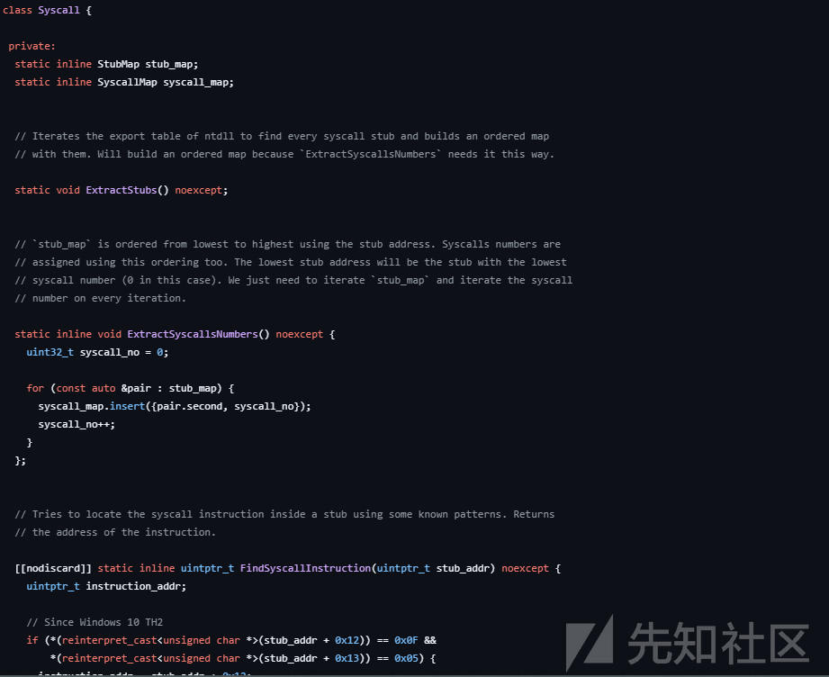

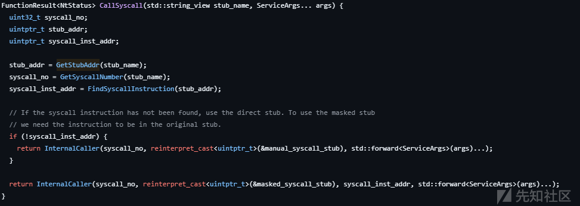

其中的CallSyscall函数是对外提供的接口

其中调用的GetStubAddr 通过遍历stub\_map查找对应的系统调用stub地址 stub\_map的初始化在ExtractStubs函数中完成

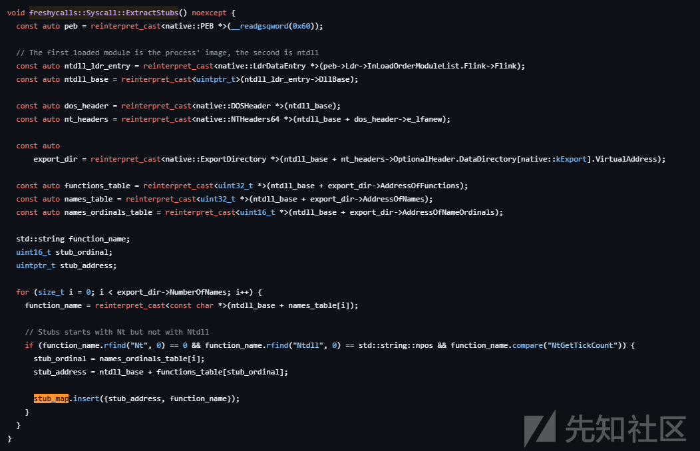

解析ntdll.dll的导出表

GetSyscallNumber函数 遍历syscall\_map通过名字拿调用号

syscall\_map的初始化在ExtractSyscallsNumbers

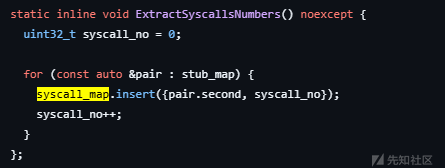

FindSyscallInstruction函数用于找syscall或sysenter 指令的地址

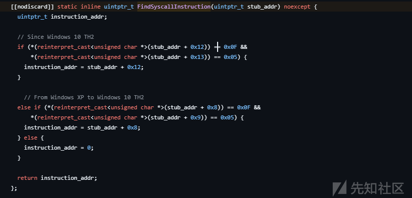

一切准备就绪后调用InternalCaller如果没有找到syscall指令 就使用直接系统调用

```
template<typename... ServiceArgs>
   FunctionResult<NtStatus> InternalCaller(uint32_t syscall_no, uintptr_t stub_addr, ServiceArgs... args) noexcept {
     using StubDef = NtStatus(__stdcall *)(uint32_t, ServiceArgs...);
     StubDef stub = reinterpret_cast<decltype(stub)>(stub_addr);
     NtStatus return_value = stub(syscall_no, std::forward<ServiceArgs>(args)...);
 
     return FunctionResult<NtStatus>(return_value);
   }
```


这里我们来看间接系统调用的部分

首先从rcx rdx取出调用号和syscall地址 存在r13 r14

然后将参数存放到rcx rdx r8 r9 这几步在处理传参

然后提升堆栈

恢复上下文

最后jmp到syscall地址执行

## PigSyscall

<https://github.com/evilashz/PigSyscall>

和FreshyCalls项目的实现差不多 新增了一些功能

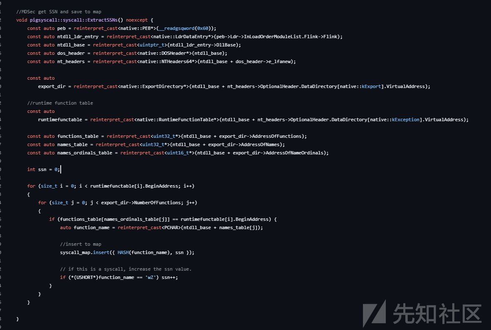

首先初始化syscall\_map往里填充的是哈希而非名称 后续通过HASH查找函数

此外 在最后调用InternalCaller的时候使用的是encrypted\_masked\_syscall\_stub 调用了CryptPermute进行解密
